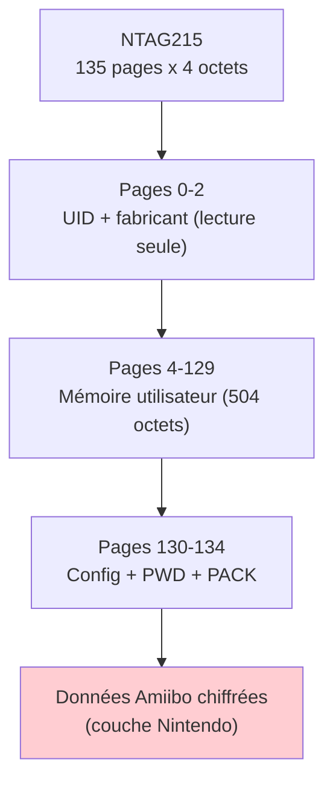
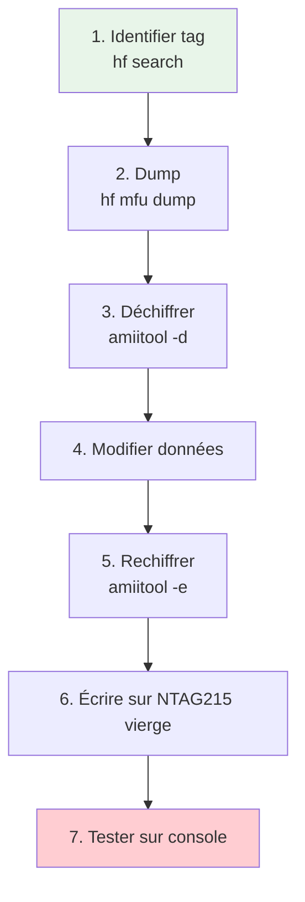

# Amiibo et NTAG215

> [!info] **En 1 phrase**
> Un Amiibo est une puce **NTAG215** (NFC 13.56 MHz) dont les données sont **chiffrées et
> signées par Nintendo**, la signature étant **liée au UID** : pour cloner, il faut **dériver
> le mot de passe du UID** puis **recalculer la signature**.

---

## Overview

| Champ | Valeur |
|---|---|
| **Type** | NFC Tag (NTAG215) / Amiibo |
| **Domaine** | Hardware Hacking — NFC / Gaming |
| **Niveau** | Beginner → Expert |
| **OS cibles** | Nintendo Switch, Wii U, 3DS — tout appareil NFC Nintendo |
| **Matériel requis** | Flipper Zero, Proxmark3, lecteur NFC ACR122u, NTAG215 vierges |
| **Complexité** | Moyenne (signature Nintendo à recréer) |
| **Dernière mise à jour** | 2026-08-16 |

---

## Concept

> Un Amiibo est une figurine ou carte contenant un tag **NTAG215** standard (NFC Forum
> Type 2 Tag, 13.56 MHz). Nintendo ajoute une **couche de chiffrement propriétaire**
> et une **signature numérique liée au UID**. Le tag fait 540 octets EEPROM organisés
> en 135 pages de 4 octets, soit **504 octets utilisateur**.

> [!info] **Le contexte**
> - **NTAG215** : 540 octets EEPROM, 135 pages, mot de passe 32 bits, UID 7 octets
> - Nintendo ajoute **chiffrement + signature** : copier les octets bruts ne suffit pas
> - La signature dépend du **UID** → chaque tag nécessite un recalcul unique
> - La fuite des `amiibo_keys.bin` permet de forger des signatures valides



---

## Concepts fondamentaux

### Architecture mémoire NTAG215

| Page | Adresse hex | Contenu | Accès |
|---|---|---|---|
| 0-1 | 0x00-0x01 | Serial number (UID) | Lecture seule |
| 2 | 0x02 | Internal, Lock bytes | Lecture seule |
| 3 | 0x03 | Capability Container (CC) | OTP |
| 4-129 | 0x04-0x81 | Données utilisateur | Read/Write |
| 130 | 0x82 | Dynamic lock bytes | OTP |
| 131-132 | 0x83-0x84 | CFG0/CFG1 | Config |
| 133 | 0x85 | PWD (mot de passe 32 bits) | Write-Only |
| 134 | 0x86 | PACK (2 octets) | Write-Only |

### Dérivation du mot de passe NTAG215

| Octet UID | Opération | Résultat |
|---|---|---|
| `uid[1] XOR uid[3]` | XOR avec `0xAA` | `password[0]` |
| `uid[2] XOR uid[4]` | XOR avec `0x55` | `password[1]` |
| `uid[3] XOR uid[5]` | XOR avec `0xAA` | `password[2]` |
| `uid[4] XOR uid[6]` | XOR avec `0x55` | `password[3]` |

### Comparaison NTAG21x

| Modèle | EEPROM | Pages | User Memory | Usage |
|---|---|---|---|---|
| NTAG213 | 180 octets | 45 | 144 octets | Tags NFC bon marché |
| NTAG215 | 540 octets | 135 | 504 octets | Amiibo Nintendo |
| NTAG216 | 924 octets | 231 | 888 octets | Stockage étendu |

---

## Matériel / Composants

### Outils principaux

| Outil | Type | Usage | Prix | Source |
|---|---|---|---|---|
| amiitool | Outil CLI | Déchiffrement/rechiffrement Amiibo | Gratuit | socram8888/amiitool |
| Flipper Zero | Multi-tool | Lecture/écriture/émulation NFC | ~170€ | Flipper Devices |
| Proxmark3 | Reader/Writer | Dump, écriture, émulation NTAG2x | ~60-330€ | RfidResearchGroup |
| ACR122u | Reader HF | Dump avec libnfc | ~30€ | ACS |
| NTAG215 vierges | Tags NFC | Cible d'écriture | ~1-3€/unité | Amazon / AliExpress |

### Cibles typiques

| Catégorie | Exemples | Vulnérabilités |
|---|---|---|
| Figurines Amiibo | Mario, Zelda, etc. | Crypto cassée (fuite keys) |
| Cartes Amiibo | Cards series 1-5 | Identique aux figurines |
| Tags NFC génériques | NTAG215 vierges | Pas de crypto par défaut |
| Badges NFC marketing | Tags promotionnels | Données en clair |

---

## Protocoles

### NFC Forum Type 2 Tag

| Paramètre | Valeur |
|---|---|
| **Type** | Sans fil (inductive coupling) |
| **Vitesse** | 106 kbit/s |
| **Direction** | Half-duplex |

### Commandes ISO14443 Type A

| Commande | Code | Description |
|---|---|---|
| READ | `0x30` | Lecture de 4 pages (16 octets) |
| FAST_READ | `0x3A` | Lecture rapide de pages consécutives |
| WRITE | `0xA2` | Écriture d'une page (4 octets) |
| PWD_AUTH | `0x1B` | Authentification par mot de passe |
| READ_SIG | `0x3C` | Lecture de la signature ECC |

---

## Installation / Setup

### Prérequis

| Composant | Version | Lien |
|---|---|---|
| amiitool | Latest | github.com/socram8888/amiitool |
| amiibo_keys.bin | Fuite Nintendo | Recherche en ligne |
| Proxmark3 client | Iceman fork | github.com/RfidResearchGroup/proxmark3 |
| NTAG215 vierges | NFC Forum T2T | Amazon / AliExpress |

### Connexion physique

```
Flipper Zero → NFC → Tag Amiibo (approcher < 3cm)
Proxmark3 → HF Antenna → Tag Amiibo (approcher < 5cm)
ACR122u → USB → PC → champ RF intégré → Tag Amiibo
```

### Compilation d'amiitool

```bash
git clone https://github.com/socram8888/amiitool
cd amiitool
make
./amiitool --help
```

---

## Configuration

### Paramètres amiitool

| Option | Description |
|---|---|
| `-d` | Mode déchiffrement |
| `-e` | Mode rechiffrement |
| `-k` | Fichier de clés Nintendo |
| `-i` | Fichier d'entrée |
| `-o` | Fichier de sortie |

---

## Commandes / Manipulations

| Commande | Description |
|---|---|
| `hf mfu dump` | Dump complet NTAG2x (135 pages) |
| `hf mfu restore` | Restaure un dump sur un tag vierge |
| `hf mfu rdbl` | Lecture d'une page (4 octets) |
| `hf mfu wrbl` | Écriture d'une page |
| `hf mfu auth` | Authentification PWD |
| `hf mfu setpwd` | Définit le mot de passe |
| `hf mfu sim` | Émulation de tag |
| `hf mfu info` | Info tag (type, UID, taille) |

### Séquence rapide

```bash
hf mfu dump
hf mfu auth --pwd aabbccdd
hf mfu wrbl 5 01020304
hf mfu setpwd aabbccdd --pack 8080
```

---

## Exemples pratiques

### Débutant — Lecture d'un Amiibo avec Flipper Zero

```text
1. Allumer le Flipper Zero
2. Menu → NFC → Read
3. Approcher l'Amiibo du Flipper
4. Le Flipper affiche les données du tag
5. Sauvegarder le fichier .nfc
```

### Intermédiaire — Dump et reécriture

```bash
# Dump de l'original
hf mfu dump

# Dérivation du mot de passe
python3 -c "
uid = [0x04, 0xAA, 0xBB, 0xCC, 0xDD, 0xEE, 0xFF]
pwd = [0xAA^(uid[1]^uid[3]), 0x55^(uid[2]^uid[4]), 0xAA^(uid[3]^uid[5]), 0x55^(uid[4]^uid[6])]
print(f'PWD: {pwd[0]:02X}{pwd[1]:02X}{pwd[2]:02X}{pwd[3]:02X}')
"

# Écriture sur tag vierge
hf mfu restore
hf mfu setpwd aabbccdd --pack 8080
```

### Avancé — Déchiffrer et modifier un Amiibo

```bash
# Déchiffrement
./amiitool -d -k amiibo_keys.bin -i amiibo_encrypted.bin -o amiibo_decrypted.bin

# Modification
hexedit amiibo_decrypted.bin

# Rechiffrement
./amiitool -e -k amiibo_keys.bin -i amiibo_decrypted.bin -o amiibo_new.bin
```

### Expert — Création automatique d'Amiibo

```python
#!/usr/bin/env python3
import subprocess

def derive_password(uid_bytes):
    return bytes([
        0xAA ^ (uid_bytes[1] ^ uid_bytes[3]),
        0x55 ^ (uid_bytes[2] ^ uid_bytes[4]),
        0xAA ^ (uid_bytes[3] ^ uid_bytes[5]),
        0x55 ^ (uid_bytes[4] ^ uid_bytes[6])
    ])

def create_amiibo(template, keys, output):
    subprocess.run(["./amiitool", "-d", "-k", keys, "-i", template, "-o", "temp.bin"], check=True)
    with open("temp.bin", "rb") as f: data = bytearray(f.read())
    with open("temp.bin", "wb") as f: f.write(data)
    subprocess.run(["./amiitool", "-e", "-k", keys, "-i", "temp.bin", "-o", output], check=True)
    print(f"[+] Amiibo créé : {output}")

create_amiibo("template.bin", "amiibo_keys.bin", "custom_amiibo.bin")
```

---

## Workflow complet (scénario pas à pas)



---

## Scénarios avancés

### Scénario 1 — Création d'un Amiibo complet

| Élément | Détail |
|---|---|
| **Objectif** | Créer un Amiibo personnalisé |
| **Matériel** | PC + amiitool + Proxmark3 + NTAG215 vierge |
| **Étapes** | Déchiffrer → Modifier → Rechiffrer → Écrire → Tester |
| **Difficulté** | |

### Scénario 2 — Émulation d'Amiibo avec Flipper Zero

| Élément | Détail |
|---|---|
| **Objectif** | Émuler un Amiibo sans physique |
| **Matériel** | Flipper Zero + fichier .nfc |
| **Étapes** | Dump original → Charger sur Flipper → NFC → Amiibo → Select |
| **Difficulté** | |

---

## Cybersecurity use cases

| Use case | Sévérité | Impact |
|---|---|---|
| Création Amiibo non officiels | Moyenne | Contournement protections |
| Clonage figurines rares | Faible | Copie contenu protégé |
| Analyse sécurité Nintendo | Élevée | RE complet |

| Phase pentest | Ce que permet cette technique |
|---|---|
| Recon | Identification des tags NFC utilisés |
| Accès initial | Clonage de tags NFC pour test |
| Post-exploitation | Manipulation de données signées |

---

## MITRE ATT&CK

| Technique ID | Nom | Catégorie | Applicabilité |
|---|---|---|---|
| T1200 | Hardware Additions | Initial Access | Tag NFC malveillant |
| T1557 | Adversary-in-the-Middle | Credential Access | Relay/sniffing NFC |
| T1040 | Network Sniffing | Credential Access | Capture communications NFC |

---

## Defensive Security

### Détection

| Signal | Source | Fiabilité |
|---|---|---|
| Signatures invalides | Console Nintendo | Élevée |
| UID non conforme | Lecteur NFC | Moyenne |
| Données modifiées | Audit firmware | Moyenne |

### Prévention

| Mesure | Efficacité | Coût | Priorité |
|---|---|---|---|
| Vérification signature | Élevée | Intégrée | Haute |
| Détection timing (relay) | Moyenne | Faible | Moyenne |
| Anti-émulation | Moyenne | Faible | Basse |

> [!warning] Points de sécurité
> - La création d'Amiibo non officiels peut violer les CGU de Nintendo
> - Les consoles récentes peuvent bannir les comptes détectant des tags non-officiels

> [!danger] Cadre légal
> La contrefaçon de produits de propriété intellectuelle est passible de poursuites.
> Le RE à des fins de recherche est généralement autorisé.

---

## Automatisation

```python
#!/usr/bin/env python3
"""Script de dump NTAG215 avec dérivation du mot de passe"""
import subprocess

def dump_ntag215():
    result = subprocess.run(["./pm3", "-c", "hf mfu info"], capture_output=True, text=True)
    for line in result.stdout.split("\n"):
        if "UID" in line: print(f"[+] {line}")
    subprocess.run(["./pm3", "-c", "hf mfu dump"])
    print("[+] Dump terminé")

dump_ntag215()
```

| Outil | Usage |
|---|---|
| amiitool | Déchiffrement/rechiffrement |
| Flipper Zero | Lecture/écriture/émulation |
| Proxmark3 client | Dump NTAG2x |
| TagMo (Android) | Gestion Amiibo mobile |

---

## Output et parsing

| Format | Utilité |
|---|---|
| `.bin` | Données déchiffrées |
| `.nfc` | Format Flipper Zero |
| `.mfd` | Format Proxmark3 |

```bash
hexdump -C amiibo_decrypted.bin
hexdump -s 0x208 -n 32 -C amiibo_decrypted.bin  # signature
```

---

## Intégrations

- [[13 - Hardware & IoT| Hardware & IoT]] global
- [[Hardware - RFID et NFC| Hub RFID]]
- [[Hardware - RFID MIFARE (HF 13.56 MHz)| MIFARE]]

| Outils associés | Usage |
|---|---|
| [[Hardware - Proxmark]] | Dump et émulation NTAG2x |
| [[Hardware - Flipper Zero]] | Lecture/écriture NFC portable |
| [[Hardware - HydraNFC]] | Sniffer NFC avancé |

---

## Alternatives

| Alternative | Avantages | Inconvénients | Cas d'usage |
|---|---|---|---|
| Flipper Zero | Portable, émulation directe | Pas de déchiffrer/rechiffrer | Test rapide terrain |
| ChameleonMini | Émulation multi-tag | Pas de crypto Nintendo | Émulation basique |
| NTAG216 | Plus de mémoire (888 bytes) | Pas compatible Amiibo | Tags NFC standard |

---

## Performance

| Métrique | Valeur | Impact |
|---|---|---|
| Vitesse lecture | 106 kbit/s | Dump ~2-5s |
| Temps déchiffrement | < 1 seconde | Très rapide |
| Portée NFC | 1-5 cm | Approche physique requise |
| Fiabilité écriture | > 99% | Tag vierge neuf |

---

## Troubleshooting

| Problème | Cause probable | Solution |
|---|---|---|
| `hf mfu dump` échoue | Tag pas un NTAG2x | Vérifier `hf search` |
| amiitool échoue | Clés manquantes | Trouver `amiibo_keys.bin` |
| Tag non reconnu par Switch | Signature invalide | Recalculer avec `amiitool -e` |
| Écriture incomplète | Tag verrouillé | Utiliser un tag vierge |
| Mot de passe incorrect | UID mal lu | Relire l'UID, recalculer PWD |

---

## Sécurité

| Risque | Impact | Mitigation |
|---|---|---|
| Contournement protections | Fraude | Vérification signature renforcée |
| Clonage contenus protégés | Perte de revenus | Détection anti-émulation |

> [!danger] Cadre légal
> La contrefaçon de produits de propriété intellectuelle est passible de poursuites.
> Le RE à des fins de recherche est généralement autorisé, mais la distribution de
> clés de déchiffrement peut tomber sous le DMCA / directive EU copyright.

---

## Limitations

| Limite | Impact | Contournement |
|---|---|---|
| Clés Nintendo nécessaires | Impossible sans amiibo_keys.bin | Fuite en ligne |
| Signature liée au UID | Pas de copie octet-à-octet | Recalcul complet |
| NTAG215 spécifique (504 bytes) | Pas compatible NTAG213/216 | Utiliser le bon tag |
| Anti-émulation Switch récente | Détection possible | Timing vérifié |

---

## Cheatsheet

```
┌───────────────────────────────────────────────────────┐
│ Amiibo / NTAG215 — Cheatsheet                        │
├───────────────────────────────────────────────────────┤
│ Dump:       hf mfu dump                              │
│ Restore:    hf mfu restore                           │
│ Auth:       hf mfu auth --pwd <pwd>                   │
│ Read page:  hf mfu rdbl <page>                        │
│ Write page: hf mfu wrbl <page> <data>                 │
│ Set PWD:    hf mfu setpwd <pwd> --pack <pack>         │
│ Info:       hf mfu info                               │
│ Decrypt:    amiitool -d -k keys.bin -i enc -o dec    │
│ Encrypt:    amiitool -e -k keys.bin -i dec -o enc    │
│ PWD:        0xAA^(uid[1]^uid[3]) / 0x55^(uid[2]^uid[4]) │
└───────────────────────────────────────────────────────┘
```

| Action | Commande |
|---|---|
| Dump Amiibo | `hf mfu dump` |
| Écrire sur vierge | `hf mfu restore` |
| Déchiffrer | `amiitool -d -k keys.bin -i enc.bin -o dec.bin` |
| Rechiffrer | `amiitool -e -k keys.bin -i dec.bin -o new.bin` |
| Émuler | `hf mfu sim` |

---

## Quick reference

| Élément | Valeur |
|---|---|
| **Type** | NFC Forum Type 2 Tag |
| **Fréquence** | 13.56 MHz |
| **EEPROM** | 540 octets / 135 pages |
| **User memory** | 504 octets |
| **UID** | 7 octets (cascade level 2) |
| **Mot de passe** | 32 bits (4 octets) |
| **Vitesse** | 106 kbit/s |
| **Portée** | 1-5 cm |
| **Outil principal** | amiitool + Proxmark3/Flipper |

---

## Détection & Défense

| Signal | Méthode de détection | Outil |
|---|---|---|
| Signature ECC invalide | Vérification firmware | Console Nintendo |
| UID non standards | Scan NFC | NFC TagInfo |
| Données modifiées | Comparaison hash | Audit firmware |

| Countermeasure | Efficacité | Implémentation |
|---|---|---|
| Vérification signature ECC | Élevée | Firmware console |
| Anti-émulation | Moyenne | Firmware console |
| Compteur anti-replay | Élevée | Firmware tag |

---

## Tips & Pièges

- **Piège 1** : Le mot de passe dépend du UID — changer de tag = recalculer le PWD.
- **Piège 2** : Sans `amiibo_keys.bin`, déchiffrement/rechiffrement impossible.
- **Piège 3** : Les NTAG213 ne fonctionnent pas (144 bytes vs 504 nécessaires).
- **Piège 4** : Les Switch récentes peuvent détecter les tags émulés.
- **Astuce 1** : Le Flipper Zero gère les Amiibo nativement (fichiers .nfc).
- **Astuce 2** : L'UID d'un NTAG215 fait toujours 7 octets (cascade level 2).
- **Bonne pratique** : Toujours sauvegarder le dump original avant modification.

---

## References

> [!info] **Sources**
> - [HardwareAllTheThings — Amiibo / NTAG215](https://github.com/swisskyrepo/HardwareAllTheThings/blob/main/docs/protocols/rfid-nfc/ntag215-amiibo.md)
> - [Reverse Engineering Amiibo — Kevin Brewster](https://kevinbrewster.github.io/Amiibo-Reverse-Engineering/)
> - [NXP NTAG213/215/216 Datasheet](https://www.nxp.com/docs/en/data-sheet/NTAG213_215_216.pdf)
> - [amiitool — GitHub](https://github.com/socram8888/amiitool)

| Source | URL |
|---|---|
| NXP NTAG215 | nxp.com/products/NTAG213_215_216 |
| amiitool | github.com/socram8888/amiitool |
| Flipper NFC | docs.flipperzero.one |

---

**Liens :** [[Hardware - RFID et NFC| Hub RFID]] · [[Hardware - RFID MIFARE (HF 13.56 MHz)| MIFARE]] · [[Hardware - Flipper Zero| Flipper]] · [[Bibliothèque technique| Index]]