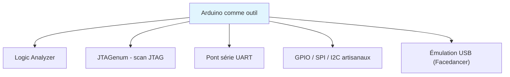
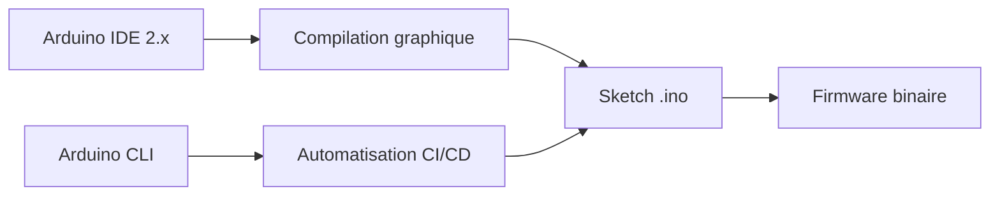
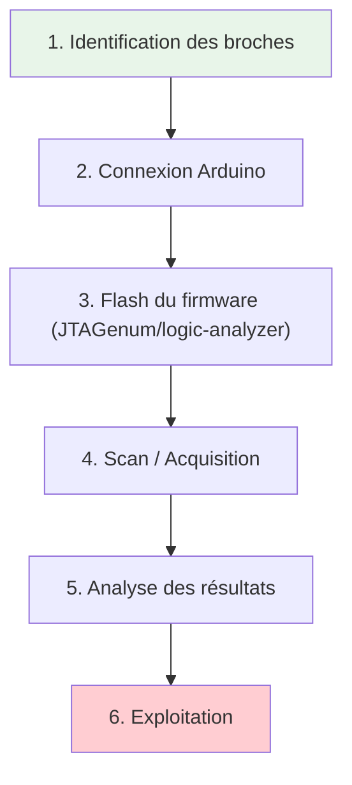
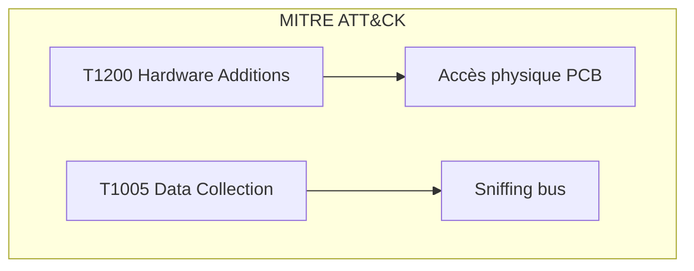
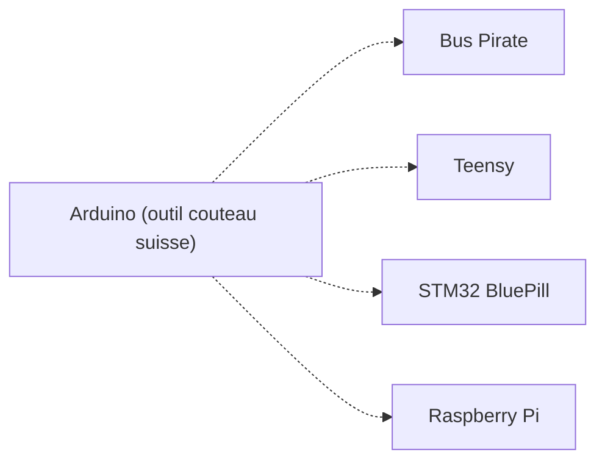

# 🔌 Arduino

> [!info] **En 1 phrase**
> L'**Arduino** est la plateforme de prototypage la plus répandue : en hardware
> hacking, on s'en sert surtout comme **outil** (analyseur logique, scanneur JTAG,
> pont série/UART, contrôle GPIO/SPI/I2C) et comme **cible** IoT facile à flasher.

---

## 🧾 Overview

| Champ | Valeur |
|---|---|
| **Type** | Plateforme de prototypage / Outil de hacking |
| **Domaine** | Hardware Hacking / IoT |
| **Niveau** | Beginner → Expert |
| **OS cibles** | Bare-metal AVR, ARM (Arduino framework) |
| **Matériel requis** | Arduino Uno/Nano/ESP32, câble USB, PC |
| **Complexité** | Faible → Moyenne |
| **Dernière mise à jour** | 2026-08-16 |

> [!info] 📊 **Diagramme de contexte**
> ```mermaid
> flowchart LR
>     A["Arduino / Teensy / STM32"] --> B["GPIO / UART / SPI / I2C"]
>     B --> C["Device cible (PCB)"]
>     C --> D["Analyse / Exploitation"]
>     style A fill:#e1f5fe
>     style D fill:#c8e6c9
> ```

---

## 🎯 Concept

Arduino est une plateforme open-source de microcontrôleurs utilisée comme **outil de pentest hardware** : analyseur logique artisanal, scanneur de broches JTAG, pont série UART, émulateur de devices USB. C'est aussi une **cible** : les IoT utilisent des cartes Arduino compatibles (ATmega328P, ESP32, SAMD21) dont le firmware est facilement modifiable et dumpable.



---

## 🧠 Concepts fondamentaux

### Plateformes Arduino

| Terme | Définition |
|---|---|
| **AVR (ATmega328P)** | Processeur 8-bit des Uno/Nano,architecture Harvard |
| **ARM (SAMD21, STM32)** | Processeur 32-bit des cartes MKR/Zero |
| **ESP32/ESP8266** | WiFi/BLE coeur Espressif via Arduino framework |
| **Teensy** | Alternative haute performance (ARM Cortex-M4) |

### Arduino IDE vs Arduino CLI

Arduino IDE 2.x est l'interface graphique (auto-complétion, debugging). Arduino CLI est l'outil en ligne de commande pour l'automatisation (CI/CD, scripts).



---

## 🔌 Matériel / Composants

### Tableau comparatif des cartes

| Carte | Processeur | Fréquence | RAM | Flash | GPIO | Voltage | Usage pentest |
|---|---|---|---|---|---|---|---|
| Arduino Uno R3 | ATmega328P | 16 MHz | 2 KB | 32 KB | 14 | 5V | Analyseur logique, JTAGenum |
| Arduino Nano | ATmega328P | 16 MHz | 2 KB | 32 KB | 14 | 5V | Compact, même chip que Uno |
| Arduino Mega | ATmega2560 | 16 MHz | 8 KB | 256 KB | 54 | 5V | Beaucoup de GPIO |
| Arduino MKR Zero | SAMD21 | 48 MHz | 32 KB | 256 KB | 27 | 3.3V | Native USB, crypto |
| ESP32 DevKit | Xtensa LX6 | 240 MHz | 520 KB | 4 MB | 34 | 3.3V | WiFi/BLE hacking |
| Teensy 4.1 | i.MX RT1062 | 600 MHz | 1 MB | 8 MB | 42 | 3.3V | Ultra-rapide, USB OTG |
| STM32 BluePill | STM32F103C8 | 72 MHz | 20 KB | 64 KB | 37 | 3.3V | JTAGenum, OpenOCD |

### Outils complémentaires

| Outil | Type | Usage | Prix | Source |
|---|---|---|---|---|
| JTAGenum | Firmware Arduino | Scan broches JTAG/SWD | Gratuit | cyphunk/JTAGenum |
| logic-analyzer | Firmware Arduino | Analyseur logique | Gratuit | aster94/logic-analyzer |
| Bus Pirate | Carte multi-protocole | UART/SPI/I2C/JTAG | ~30€ | DangerousPrototypes |
| CH341A | Adaptateur USB | Flash SPI/I2C | ~5€ | WCH |

### Pinout Arduino Uno

```
        ┌──────────────────────┐
        │  Arduino Uno R3      │
   5V ──┤ 1               28 ├── AREF
  GND ──┤ 2               27 ├── GND
   D2 ──┤ 3               26 ├── A5 (SCL)
   D3 ──┤ 4               25 ├── A4 (SDA)
   D4 ──┤ 5               24 ├── A3
   D5 ──┤ 6               23 ├── A2
   D6 ──┤ 7               22 ├── A1
   D7 ──┤ 8               21 ├── A0
   D8 ──┤ 9               20 ├── VCC
   D9 ──┤ 10              19 ├── GND
  D10 ──┤ 11              18 ├── AREF
  D11 ──┤ 12              17 ├── VCC
  D12 ──┤ 13              16 ├── GND
  D13 ──┤ 14              15 ├── RX (D0)
        └──────────────────────┘
```

---

## ⚡ Protocoles

### Protocoles supportés par Arduino

| Protocole | Pins | Vitesse | Usage pentest |
|---|---|---|---|
| UART (SoftwareSerial) | D2/D3 (soft) | 9600-115200 | Pont série, console debug |
| SPI | D10-D13 | 8 MHz | Flash NOR, communication |
| I2C | A4/A5 | 400 kHz | Scan EEPROM, capteurs |
| 1-Wire | D2 (soft) | — | Lecture de badges |

### Comparaison des protocoles

| Protocole | Vitesse | Complexité | Sécurité | Usage typique |
|---|---|---|---|---|
| UART | 115200 | Faible | Aucune | Console série, debug |
| SPI | 8 MHz | Moyenne | Aucune | Flash, peripherals |
| I2C | 400 kHz | Faible | Aucune | Capteurs, EEPROM |

---

## 🛠️ Installation / Setup

### Prérequis

| Composant | Version | Lien |
|---|---|---|
| Arduino IDE | 2.3.x | https://www.arduino.cc/en/software |
| Arduino CLI | 1.5.x | https://arduino.github.io/arduino-cli/ |
| Python | 3.8+ | https://python.org |
| PlatformIO | Latest | https://platformio.org/ |

### Connexion physique

```
PC ──── USB (Arduino Uno/Nano) ──── Device cible
│                                 │
│  D2 (TX soft) ──────────────── RX
│  D3 (RX soft) ──────────────── TX
│  GND ──────────────────────── GND
│  D10 (SS) ─────────────────── CS (SPI flash)
│  D11 (MOSI) ──────────────── MOSI
│  D12 (MISO) ──────────────── MISO
│  D13 (SCK) ───────────────── SCK
```

### Outils logiciels

```bash
# Installation Arduino CLI
curl -fsSL https://raw.githubusercontent.com/arduino/arduino-cli/master/install.sh | sh

# Mise à jour des index
arduino-cli core update-index

# Installation du core AVR
arduino-cli core install arduino:avr

# Compilation d'un sketch
arduino-cli compile --fqbn arduino:avr:uno sketch.ino

# Upload
arduino-cli upload -p /dev/ttyACM0 --fqbn arduino:avr:uno sketch.ino
```

---

## ⚙️ Configuration

### Arduino IDE 2.x — Options clés

| Option | Valeur | Description |
|---|---|---|
| Board | Arduino Uno/Nano/Mega | Carte cible |
| Port | /dev/ttyACM0 ou COM3 | Port série |
| Programmer | AVR ISP mkII | Pour gravure de bootloaders |
| Sketch location | ~/Documents/Arduino | Répertoire de travail |

### Arduino CLI — Configuration

```yaml
# ~/.arduino15/arduino-cli.yaml
board_manager:
  additional_urls:
    - https://arduino.esp8266.com/stable/package_esp8266com_index.json
    - https://raw.githubusercontent.com/stm32duino/BoardManagerFiles/main/package_stmicroelectronics_index.json
```

---

## ⌨️ Commandes / Manipulations

### Commandes essentielles

| Commande | Description | Exemple |
|---|---|---|
| `arduino-cli board list` | Lister les cartes connectées | `arduino-cli board list` |
| `arduino-cli compile` | Compiler un sketch | `arduino-cli compile --fqbn arduino:avr:uno` |
| `arduino-cli upload` | Envoyer sur la carte | `arduino-cli upload -p COM3` |
| `arduino-cli core install` | Installer un core | `arduino-cli core install arduino:avr` |

### Lecture / Écriture

```bash
# Compiler et uploader automatiquement
arduino-cli compile --fqbn arduino:avr:uno -u -p /dev/ttyACM0 sketch/

# Installer le core ESP32
arduino-cli config add-board-manager-url https://espressif.github.io/arduino-esp32/package_esp32_index.json
arduino-cli core update-index
arduino-cli core install esp32:esp32
```

### Shell / Console

```bash
# Console série Arduino
screen /dev/ttyACM0 115200
# Ou avec monitor
arduino-cli monitor -p /dev/ttyACM0 -c baudrate=115200
```

---

## 🧪 Exemples pratiques

### 🟢 Débutant — Analyseur logique artisanal

```text
1. Flasher le firmware logic-analyzer (aster94/logic-analyzer) sur Arduino
2. Connecter les broches D2-D9 aux signaux à analyser
3. Utiliser l'app PulseView (sigrok) avec le pilote "Arduino logic analyzer"
4. Acquérir et décoder UART/SPI/I2C
```

### 🟡 Intermédiaire — Scan JTAG avec JTAGenum

```text
1. Compiler JTAGenum pour Arduino Uno
2. Connecter les broches suspectes du device via résistances série
3. Lancer le scan série → JTAGenum identifie TCK/TMS/TDI/TDO
4. Connecter OpenOCD sur les pins trouvées
```

```bash
# Compilation JTAGenum
arduino-cli compile --fqbn arduino:avr:uno JTAGenum/
arduino-cli upload -p /dev/ttyACM0 --fqbn arduino:avr:uno JTAGenum/
```

### 🔴 Avancé — Pont USB-UART pour sniffing

```python
#!/usr/bin/env python3
"""Sniffing UART entre deux devices via Arduino"""
import serial
import sys

ser = serial.Serial('/dev/ttyACM0', 115200, timeout=1)
print("[*] Sniffing UART... Ctrl+C pour arrêter")
try:
    while True:
        line = ser.readline()
        if line:
            print(f"[RX] {line.decode(errors='replace').strip()}")
except KeyboardInterrupt:
    print("\n[*] Arrêté")
    ser.close()
```

### ⚫ Expert — Power glitching artisanal

```text
Utilisation d'un Arduino Mega pour du voltage glitching :
1. Connecter une GPIO à la ligne VCC du device cible (via MOSFET)
2. Utiliser le timer precisely pour couper l'alimentation quelques nanosecondes
3. Synchroniser avec le cycle d'horloge cible (oscilloscope requis)
4. Le device "saute" une instruction de vérification

> [!warning] Technique avancée nécessitant oscilloscope + connaissances en timing.
```

---

## 🧪 Workflow complet (scénario pas à pas)



### Étape 1 — Identification

| Action | Commande | Résultat attendu |
|---|---|---|
| Repérer les pads test | Inspection visuelle | Broches UART/JTAG/SPI |
| Identifier le voltage | Multimètre | 3.3V ou 5V |

### Étape 2 — Connexion

| Méthode | Difficulté | Fiabilité |
|---|---|---|
| Crocodile clips | Faible | Moyenne |
| Soudure directe | Moyenne | Élevée |
| Test probes (PIZZAbite) | Faible | Élevée |

### Étape 3 — Flash

```bash
arduino-cli compile --fqbn arduino:avr:uno JTAGenum/
arduino-cli upload -p /dev/ttyACM0 --fqbn arduino:avr:uno JTAGenum/
```

### Étape 4 — Exploitation

```bash
# JTAGenum : ouvrir le moniteur série
arduino-cli monitor -p /dev/ttyACM0 -c baudrate=115200
# Suivre les résultats de scan
```

### Étape 5 — Post-exploitation

```text
Avec les broches JTAG identifiées → Connecter OpenOCD → Dump/Debug
Avec UART sniff → Extraire credentials, commands
```

---

## 🎬 Scénarios avancés

### Scénario 1 — Scan JTAG complet avec JTAGenum

| Élément | Détail |
|---|---|
| **Objectif** | Identifier les broches JTAG/SWD d'un device inconnu |
| **Matériel** | Arduino Uno, résistances 1KΩ, fils, PCB cible |
| **Étapes** | Flash JTAGenum → Connecter broches suspectes → Lancer scan → Analyser résultats |
| **Résultat** | Pinout JTAG identifié (TCK/TMS/TDI/TDO) |
| **Difficulté** | ⭐⭐ |


### Scénario 2 — Sniffing SPI Flash via Arduino

| Élément | Détail |
|---|---|
| **Objectif** | Intercepter les communications SPI entre MCU et flash |
| **Matériel** | Arduino Uno, fils, PCB cible |
| **Étapes** | Connecter Arduino en parallèle sur bus SPI → Logger trafic → Extraire firmware |
| **Résultat** | Dump de la flash SPI |
| **Difficulté** | ⭐⭐⭐ |

---

## 🛡️ Cybersecurity use cases

| Use case | Sévérité | Matériel requis | Impact |
|---|---|---|---|
| Scan JTAG inconnu | Élevée | Arduino + JTAGenum | Accès debug device |
| Sniffing UART | Moyenne | Arduino | Extraction credentials |
| Logic analyzer | Moyenne | Arduino + PulseView | Analyse protocoles |
| Pont série (USB-serial bridge) | Élevée | Arduino Uno | Console debug device |
| Flash SPI dump | Élevée | Arduino + flashrom | Extraction firmware |

| Phase pentest | Ce que permet cette technique |
|---|---|
| Recon | Scan des broches exposées |
| Accès initial | Sniffing UART pour credentials |
| Maintien d'accès | Flash firmware backdoor via SPI |
| Évasion | Manipulation des signaux GPIO |

---

## 🎯 MITRE ATT&CK

| Technique ID | Nom | Catégorie | Applicabilité |
|---|---|---|---|
| T1200 | Hardware Additions | Initial Access | Arduino connecté au PCB |
| T1195.002 | Supply Chain Compromise | Initial Access | Arduino compromis |
| T1005 | Data from Local System | Collection | Sniffing UART/SPI |



---

## 🛡️ Defensive Security

### Détection

| Signal de détection | Source | Fiabilité |
|---|---|---|
| Connexion Arduino sur PCB | Inspection physique | Élevée |
| Trafic SPI anormal | Monitoring bus | Moyenne |
| Device non reconnu USB | Logs OS | Élevée |

### Prévention

| Mesure | Efficacité | Coût | Priorité |
|---|---|---|---|
| Blinder ports debug | Élevée | Faible | Haute |
| Désactiver JTAG (fusible) | Élevée | Gratuit | Haute |
| Watchdog hardware | Moyenne | Faible | Moyenne |

### Durcissement (hardening)

```text
- Ne pas laisser les pads UART/JTAG/SPI exposés en production
- Utiliser des connecteurs de debug verrouillables (clips magnétiques)
- Activer les protections de lecture flash (RDP sur STM32, lock bit AVR)
```

---

## 🤖 Automatisation

### Scripts d'exploitation

```python
#!/usr/bin/env python3
"""Scan automatique de ports série via Arduino"""
import serial.tools.list_ports
import serial

ports = serial.tools.list_ports.comports()
for p in ports:
    print(f"[*] {p.device}: {p.description}")
    try:
        s = serial.Serial(p.device, 115200, timeout=2)
        s.write(b"\r\n")
        data = s.read(100)
        if data:
            print(f"    Réponse: {data[:50]}")
        s.close()
    except:
        pass
```

### Outils d'automatisation

| Outil | Usage | Lien |
|---|---|---|
| Arduino CLI | Compilation/upload | https://arduino.github.io/arduino-cli/ |
| PlatformIO | Build automatisé | https://platformio.org/ |
| sigrok/PulseView | Logic analyzer | https://sigrok.org/ |

---

## 📤 Output et parsing

### Formats de sortie

| Format | Exemple | Utilité |
|---|---|---|
| Texte série | Console output | Debug, logs |
| Binary | Dump SPI | Firmware dump |
| CSV | Logic analyzer data | Timing analysis |

### Parsing des résultats

```bash
# Capture série vers fichier
screen -L -Logfile uart_log.txt /dev/ttyACM0 115200

# Export logic analyzer
pulseview -d arduino:avr:uno -O capture.sr
```

---

## 🔗 Intégrations

- [[13 - Hardware & IoT|⚙️ Hardware & IoT]] global
- [[Hardware - UART|🔌 UART]] — Console série
- [[Hardware - I2C et SPI|🔗 I2C/SPI]] — Bus communication
- [[Hardware - JTAG et SWD|🔧 JTAG/SWD]] — Debug
- [[Hardware - Logic Analyzer|📊 Logic Analyzer]] — Analyse signaux

| Outils associés | Usage complémentaire |
|---|---|
| Bus Pirate | Alternative multi-protocole |
| GoodFET | Facedancer USB fuzzing |
| CH341A | Flash SPI directe |

---

## 🔄 Alternatives

| Alternative | Avantages | Inconvénients | Cas d'usage |
|---|---|---|---|
| Bus Pirate | Multi-protocole natif | Plus cher (~30€) | Scan rapide |
| Teensy | Plus rapide, USB OTG | Plus cher (~25€) | Analyse haute vitesse |
| STM32 BluePill | 3.3V natif, bon marché | Plus complexe | JTAGenum 3.3V |
| RPi GPIO | Linux intégré | Pas de bare-metal | Analyse complexe |



---

## ⚡ Performance

| Métrique | Valeur | Impact |
|---|---|---|
| Vitesse UART | 115200 bauds | Standard |
| Vitesse SPI | 8 MHz | Suffisant pour sniffing |
| Vitesse I2C | 400 kHz | Standard |
| Sampling rate (logic analyzer) | ~1 MHz | Limité par fréquence CPU |

---

## 🛠️ Troubleshooting

| Problème | Cause probable | Solution |
|---|---|---|
| Carte non détectée | Driver manquant | Installer CH340/CP210x driver |
| Upload échoué | Mauvais port/board | Vérifier `arduino-cli board list` |
| Données corrompues | Mismatch voltage 5V/3.3V | Utiliser level shifter |
| Logic analyzer instable | Fréquence trop élevée | Réduire le débit d'acquisition |

### Erreurs courantes

```
Erreur : "avrdude: ser_open(): can't open device"
Cause : Mauvais port ou driver manquant
Solution : Vérifier le port avec arduino-cli board list
```

### Diagnostic

```bash
arduino-cli board list
dmesg | tail
ls /dev/ttyACM*
```

---

## 🔐 Sécurité

| Risque | Impact | Mitigation |
|---|---|---|
| 5V sur cible 3.3V | Destruction composant | Level shifter / résistances |
| Arduino non sécurisé | Backdoor possible | Signed firmware |
| USB exposé | Attack vector | Verrouiller ports USB |

> [!warning] Points de sécurité
> - L'Arduino Uno travaille en **5V** : toujours vérifier la tension du device cible
> - Utiliser des **résistances série** ou **level shifter** vers 3.3V
> - Les clones Arduino peuvent avoir des pilotes différents

### Restrictions légales

> [!danger] Cadre légal
> L'utilisation d'Arduino pour des tests non autorisés est illégale. Ces techniques sont pour pentest contractuel et recherche.

---

## ⚠️ Limitations

| Limite | Impact | Contournement |
|---|---|---|
| Fréquence limitée (16 MHz) | Logic analyzer ~1 MHz max | Utiliser Saleae/DSLogic |
| 5V (Uno) | Risque pour cibles 3.3V | Level shifter |
| Pas de JTAG natif | Scan limité | JTAGenum (logiciel) |
| Pas de WiFi/BT (Uno) | Pas de wireless sniffing | Utiliser ESP32 |

### Cas où cette technique ne fonctionne pas

| Scénario | Raison |
|---|---|
| Signal > 1 MHz | Fréquence CPU insuffisante |
| Cible 1.8V | Voltage trop bas pour Arduino |
| Bus protégé (encrypted) | Sniffing inutile |

---

## 📋 Cheatsheet

```
┌──────────────────────────────────────────────────────┐
│ Arduino — Cheatsheet                                 │
├──────────────────────────────────────────────────────┤
│ Compile :    arduino-cli compile --fqbn arduino:avr:uno│
│ Upload :     arduino-cli upload -p /dev/ttyACM0       │
│ List boards: arduino-cli board list                    │
│ Monitor :    arduino-cli monitor -p /dev/ttyACM0      │
│ JTAGenum :   Flash → Monitor → Scan pins               │
│ Logic Anal : Flash aster94/logic-analyzer → PulseView  │
│ Serial :     screen /dev/ttyACM0 115200                │
│ ⚠️  Uno = 5V : utiliser level shifter sur 3.3V !      │
└──────────────────────────────────────────────────────┘
```

| Action | Commande |
|---|---|
| Compiler | `arduino-cli compile --fqbn arduino:avr:uno sketch/` |
| Upload | `arduino-cli upload -p /dev/ttyACM0 --fqbn arduino:avr:uno sketch/` |
| Monitor | `arduino-cli monitor -p /dev/ttyACM0 -c baudrate=115200` |
| List boards | `arduino-cli board list` |
| Install core | `arduino-cli core install arduino:avr` |

---

## ⚡ Quick reference

| Élément | Valeur / Commande |
|---|---|
| **Fonction** | Outil de prototypage / hacking hardware |
| **Brochage** | D2=TX soft, D3=RX soft, A4=SDA, A5=SCL |
| **Vitesse par défaut** | 115200 bauds (UART) |
| **Voltage** | 5V (Uno) / 3.3V (MKR/SAMD) |
| **Logiciel principal** | Arduino IDE 2.x / Arduino CLI |
| **Commande rapide** | `arduino-cli upload -p COM3 --fqbn arduino:avr:uno sketch/` |

---

## 🔍 Détection & Défense

| Signal | Méthode de détection | Outil |
|---|---|---|
| Device USB non reconnu | Logs kernel | `dmesg \| tail` |
| Connexion sur pads test | Inspection visuelle | Loupe / microscope |

| Countermeasure | Efficacité | Implémentation |
|---|---|---|
| Blinder pads debug | Élevée | Resin potting, cut traces |
| Désactiver JTAG (fusible) | Élevée | AVR lock bit, STM32 RDP |

> [!tip] Défense
> - Masquer physiquement les pads de debug sur les PCB de production
> - Activer les fuse bits de protection lecture sur AVR/ARM
> - Utiliser des connecteurs magnétiques pour les ports de test

---

## ⚠️ Tips & Pièges

- **Piège 1** : Arduino Uno = 5V : ne jamais connecter directement à une cible 3.3V.
- **Piège 2** : Les clones CH340 nécessitent un pilote spécifique sous Windows.
- **Piège 3** : JTAGenum ne fonctionne qu'avec des résistances série sur les broches suspectes.
- **Astuce 1** : Le logic-analyzer d'aster94 est parfait pour débuter sans matériel coûteux.
- **Astuce 2** : JTAGenum supporte Arduino, Teensy, BluePill, Tiva, RPi.
- **Astuce 3** : Pour du glitching, utiliser les pins à timing précis (Timer1/Timer2).
- **Bonne pratique** : Toujours tester en premier avec `arduino-cli board list`.

> [!tip] Astuces
> - Les shields clones (UNO R3) sont fonctionnellement identiques et moins chers
> - PlatformIO est plus rapide qu'Arduino IDE pour la compilation
> - Un seul Arduino peut servir de logic analyzer + pont série + scanneur JTAG

---

## 📚 References

> [!info] 📚 **Sources**
> - [HardwareAllTheThings — Arduino](https://github.com/swisskyrepo/HardwareAllTheThings/blob/main/docs/gadgets/arduino.md)
> - [Arduino — Site officiel](https://www.arduino.cc/)
> - [Arduino CLI — Documentation](https://arduino.github.io/arduino-cli/)
> - [JTAGenum — GitHub](https://github.com/cyphunk/JTAGenum)

### Documentation officielle

| Source | URL | Type |
|---|---|---|
| Arduino Docs | https://docs.arduino.cc/ | Documentation |
| Arduino CLI | https://arduino.github.io/arduino-cli/ | CLI reference |

### Vidéos / Tutorials

| Titre | Auteur | Lien |
|---|---|---|
| Arduino as Logic Analyzer | Aster94 | GitHub |
| JTAGenum Tutorial | Cyphunk | GitHub |

### Livres / Articles

| Titre | Auteur | Année |
|---|---|---|
| The Hardware Hacking Handbook | Jasper van Woudenberg | 2021 |
| Arduino Cookbook | Michael Margolis | 2020 |

---

➡️ **Liens :** [[13 - Hardware & IoT|⚙️ Hardware & IoT]] · [[Hardware - UART|🔌 UART]] · [[Hardware - I2C et SPI|🔗 I2C/SPI]] · [[Hardware - JTAG et SWD|🔧 JTAG/SWD]] · [[Hardware - Logic Analyzer|📊 Logic Analyzer]]
