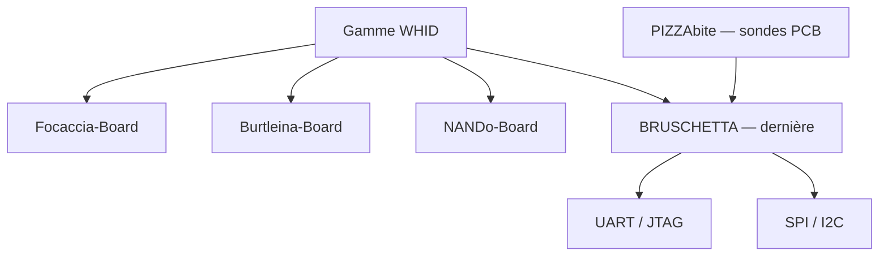
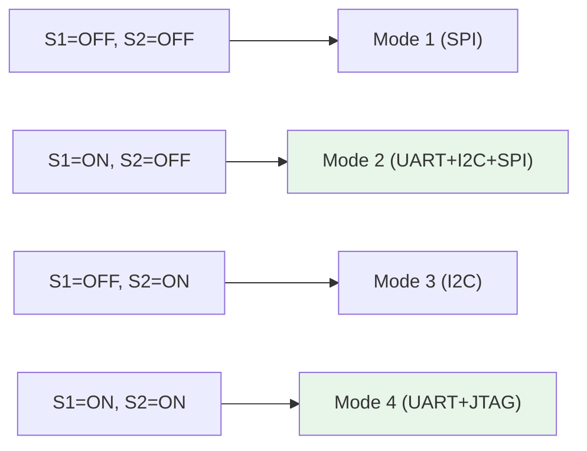
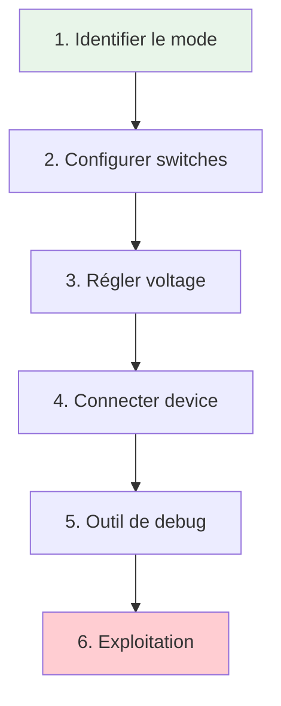
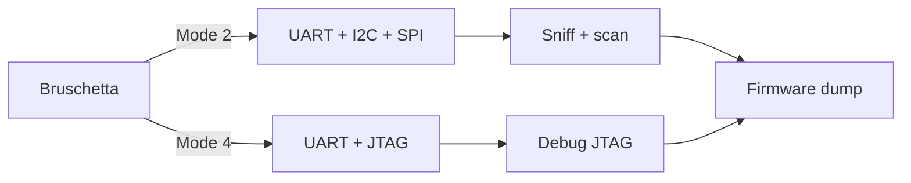
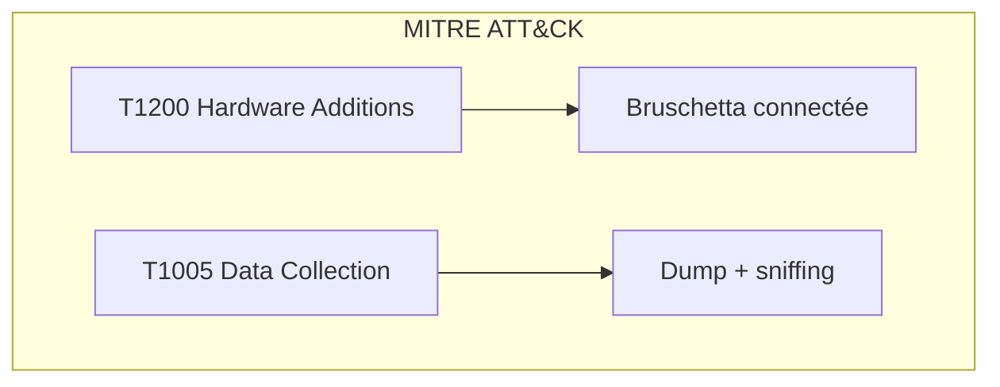
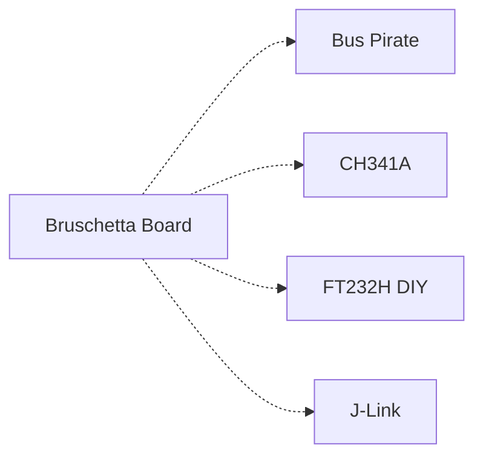

# 🍞 Bruschetta Board

> [!info] **En 1 phrase**
> **BRUSCHETTA** = le « couteau suisse multi-protocoles » du hardware hacker
> (**UART / JTAG / SPI / I2C**, base FT232H) — la dernière carte de la gamme
> WHID, pensée pour un lab propre et efficace.

---

## 🧾 Overview

| Champ | Valeur |
|---|---|
| **Type** | Carte multi-protocoles / Outil de hacking |
| **Domaine** | Hardware Hacking |
| **Niveau** | Beginner → Expert |
| **OS cibles** | Bare-metal, embedded, Linux |
| **Matériel requis** | Bruschetta Board, câble USB, PC, sondes PIZZAbite |
| **Complexité** | Faible → Moyenne |
| **Dernière mise à jour** | 2026-08-16 |

> [!info] 📊 **Diagramme de contexte**
> ```mermaid
> flowchart LR
>     A["Bruschetta Board"] --> B["UART / JTAG"]
>     A --> C["SPI / I2C"]
>     B --> D["Device cible (PCB)"]
>     C --> D
>     D --> E["Debug / Dump / Flash"]
>     style A fill:#e1f5fe
>     style E fill:#c8e6c9
> ```

---

## 🎯 Concept

La Bruschetta Board est un breakout FT232H multi-protocole conçu par Luca Bongiorni (WHID) pour les hardware hackers. Elle combine UART, JTAG, SPI et I2C en une seule carte avec **level shifters intégrés** (1.8V, 2.5V, 3.3V, 5V) et 4 modes de fonctionnement via switches DIP.



---

## 🧠 Concepts fondamentaux

### FT232H — Le cœur de la Bruschetta

| Terme | Définition |
|---|---|
| **FT232H** | Puce FTDI multi-protocole — USB à UART/SPI/I2C/JTAG |
| **VCP** | Virtual COM Port — apparait comme port série sur le PC |
| **Level Shifter** | Convertisseur de tension — adapte le voltage au device cible |
| **DIP Switch** | Interrupteur à levier — sélectionne le mode de fonctionnement |
| **PIZZAbite** | Sondes PCB open hardware (version PCBite de Sensepeek) |

### Modes de fonctionnement

La Bruschetta se configure avec **2 switches DIP** (S1, S2) pour sélectionner le mode :

| Mode | Switches | Protocoles actifs |
|---|---|---|
| Mode 1 | S1=OFF, S2=OFF | SPI seul (réservé) |
| Mode 2 | S1=ON, S2=OFF | UART1 + I2C + SPI-VCP |
| Mode 3 | S1=OFF, S2=ON | I2C seul (réservé) |
| Mode 4 | S1=ON, S2=ON | UART1 + JTAG |



---

## 🔌 Matériel / Composants

### Outils principaux

| Outil | Type | Usage | Prix | Source |
|---|---|---|---|---|
| Bruschetta Board | Carte multi-protocole | UART/JTAG/SPI/I2C | ~25-35€ | WHID/AprBrother |
| PIZZAbite | Sondes PCB | Points de test mains-libres | ~15-20€ | WHID |
| Câbles dupont | Connexions | Lien device | ~3€ | — |
| PC | Station de travail | Logiciels de debug | — | — |

### Spécifications Bruschetta Board

| Composant | Spécification |
|---|---|
| **Puce principale** | FT232H (FTDI) |
| **Interface USB** | USB 2.0 Full-Speed (12 Mbps) |
| **Protocoles** | UART, JTAG, SPI, I2C |
| **Level shifters** | 1.8V, 2.5V, 3.3V, 5V (sélectionnable) |
| **Modes** | 4 modes (switches DIP S1/S2) |
| **UART** | Jusqu'à 3 Mbaud |
| **SPI** | Jusqu'à 30 MHz |
| **I2C** | 100 kHz / 400 kHz |
| **JTAG** | Bit-bang via FT232H |
| **Compatibilité** | Windows (FTDI CH341PAR driver), Linux (libftdi) |

### Descendances de la gamme WHID

| Carte | Description | Différence |
|---|---|---|
| Focaccia-Board | Breakout FT232H multipurpose | Ancienne génération |
| Burtleina-Board | Autre breakout multipurpose | Similaire à Focaccia |
| NANDo-Board | 2e génération cartes FTDI | Amélioration |
| **BRUSCHETTA** | Dernière génération | Level shifters + switches |

---

## ⚡ Protocoles

### Protocoles supportés par mode

| Mode | UART | JTAG | SPI | I2C |
|---|---|---|---|---|
| Mode 1 (S1=OFF, S2=OFF) | Non | Non | Oui | Non |
| Mode 2 (S1=ON, S2=OFF) | Oui | Non | Oui (VCP) | Oui |
| Mode 3 (S1=OFF, S2=ON) | Non | Non | Non | Oui |
| Mode 4 (S1=ON, S2=ON) | Oui | Oui | Non | Non |

### Comparaison des protocoles

| Protocole | Vitesse max | Complexité | Sécurité | Usage typique |
|---|---|---|---|---|
| UART | 3 Mbaud | Faible | Aucune | Console debug |
| JTAG | Bit-bang | Élevée | Modérée | Debug, breakpoints |
| SPI | 30 MHz | Moyenne | Aucune | Flash NOR, LCD |
| I2C | 400 kHz | Faible | Aucune | Capteurs, EEPROM |

---

## 🛠️ Installation / Setup

### Prérequis

| Composant | Version | Lien |
|---|---|---|
| Driver FTDI | CH341PAR (Windows) | FTDI website |
| libftdi | Latest (Linux) | apt install libftdi-dev |
| OpenOCD | 0.12+ | https://openocd.org/ |
| Flashrom | 1.4+ | https://flashrom.org/ |
| PuTTY | Latest | https://putty.org/ |

### Installation Windows

```text
1. Télécharger et installer CH341PAR.EXE (driver FTDI)
2. Brancher la Bruschetta Board
3. Vérifier dans le Device Manager (port COM attribué)
4. Installer PuTTY pour UART, OpenOCD pour JTAG, Flashrom pour SPI
```

### Installation Linux

```bash
# Driver libftdi
sudo apt-get install libftdi-dev libusb-1.0-0-dev

# Flashrom
sudo apt-get install flashrom

# OpenOCD
sudo apt-get install openocd

# Vérification
lsusb | grep -i "ftdi"
ls /dev/ttyUSB*
```

### Connexion physique

```
Bruschetta Board  ────────  Device cible
│
│  UART TX ────────────────── RX (device)
│  UART RX ────────────────── TX (device)
│  JTAG TMS ───────────────── TMS (device)
│  JTAG TCK ───────────────── TCK (device)
│  JTAG TDI ───────────────── TDI (device)
│  JTAG TDO ───────────────── TDO (device)
│  SPI MOSI ───────────────── MOSI (flash)
│  SPI MISO ───────────────── MISO (flash)
│  SPI SCK ────────────────── SCK (flash)
│  SPI CS ─────────────────── CS (flash)
│  I2C SDA ────────────────── SDA (device)
│  I2C SCL ────────────────── SCL (device)
│  GND ────────────────────── GND (device)
│  VCC (level shifted) ────── VCC (device, si 3.3V)
```

---

## ⚙️ Configuration

### Sélection du voltage (Level Shifter)

| Jumper Voltage | Usage |
|---|---|
| 1.8V | Devices low-power (Nordic, certaines NAND) |
| 2.5V | Quelques SoC anciens |
| 3.3V | Standard (ESP32, STM32, ARM) |
| 5V | Arduino Uno, devices 5V |

> [!warning] Règle d'or : **régler le jumper de voltage AVANT de brancher** la carte sur le device cible.

### Sélection du Chip Select (SPI)

| Jumper CS | Usage |
|---|---|
| CS0 | Flash SPI principale |
| CS1 | Deuxième device SPI |

---

## ⌨️ Commandes / Manipulations

### Mode 2 — UART + I2C + SPI

```bash
# UART (PuTTY/screen)
screen /dev/ttyUSB0 115200
# Ou PuTTY : Port COM + 115200 bauds

# I2C scan
i2cdetect -y 1
# Ou avec python-smbus
python3 -c "import smbus; b=smbus.SMBus(1); print([hex(a) for a in range(0x03,0x78) if b.read_byte(a)])"

# SPI read (flashrom)
flashrom -p ft2232_spi:type=2232H,port=A -r spi_dump.bin
```

### Mode 4 — UART + JTAG

```bash
# UART
screen /dev/ttyUSB0 115200

# JTAG (OpenOCD)
openocd -f interface/ftdi/ft2232h-module.cfg \
        -c "transport select jtag" \
        -c "adapter speed 1000" \
        -f target/stm32f1x.cfg
```

---

## 🧪 Exemples pratiques

### 🟢 Débutant — Connexion UART

```text
1. Régler S1=ON, S2=OFF (Mode 2) OU S1=ON, S2=ON (Mode 4)
2. Régler le level shifter à la tension du device (3.3V typique)
3. Connecter TX→RX, RX→TX, GND→GND
4. Ouvrir PuTTY/screen sur le port COM/USB correspondant
5. Observer la console du device
```

### 🟡 Intermédiaire — Flash SPI avec flashrom

```text
1. Régler en Mode 2 (S1=ON, S2=OFF)
2. Sélectionner CS0
3. Connecter SPI : MOSI, MISO, SCK, CS vers la flash NOR
4. flashrom -p ft2232_spi:type=2232H,port=A -r dump.bin
5. flashrom -p ft2232_spi:type=2232H,port=A -w new_firmware.bin
```

### 🔴 Avancé — JTAG debug avec OpenOCD

```text
1. Régler en Mode 4 (S1=ON, S2=ON)
2. Connecter JTAG : TMS, TCK, TDI, TDO vers le device
3. Lancer OpenOCD avec le bon config
4. Scanner la chaîne JTAG
5. Lire les registres, breakpoints, dump mémoire
```

### ⚫ Expert — Combinaison Bruschetta + PIZZAbite

```text
1. Fixer les sondes PIZZAbite sur les pads test du PCB
2. Connecter les sondes à la Bruschetta Board
3. Tester UART + JTAG + SPI simultanément
4. Changer de mode via les switches sans déconnecter
5. Analyse multi-protocole rapide
```

---

## 🧪 Workflow complet (scénario pas à pas)



### Étape 1 — Identification

| Action | Commande | Résultat |
|---|---|---|
| Identifier le voltage du device | Multimètre | 1.8V / 2.5V / 3.3V / 5V |
| Identifier les protocoles | Inspection PCB | UART? JTAG? SPI? I2C? |

### Étape 2 — Configuration

| Méthode | Difficulté | Fiabilité |
|---|---|---|
| Switches DIP | Faible | Élevée |
| Jumper voltage | Faible | Élevée |
| Sélection CS | Faible | Élevée |

### Étape 3 — Connexion

```text
Connecter les fils correspondant au mode choisi
Vérifier les niveaux de tension AVANT le branchement
```

### Étape 4 — Exploitation

```bash
# UART
screen /dev/ttyUSB0 115200
# SPI
flashrom -p ft2232_spi:type=2232H,port=A -r dump.bin
# JTAG
openocd -f interface/ftdi/ft2232h-module.cfg -f target/stm32f1x.cfg
```

---

## 🎬 Scénarios avancés

### Scénario 1 — Audit complet d'un IoT avec Bruschetta

| Élément | Détail |
|---|---|
| **Objectif** | Audit sécurité complet d'un device IoT |
| **Matériel** | Bruschetta Board, PIZZAbite, PC |
| **Étapes** | 1. Mode 2 : scanner I2C + sniff UART<br>2. Mode 4 : scan JTAG<br>3. Mode 2 : dump SPI flash<br>4. Analyser firmware |
| **Résultat** | Accès complet au device |
| **Difficulté** | ⭐⭐⭐ |



### Scénario 2 — Récupération firmware via SPI flash

| Élément | Détail |
|---|---|
| **Objectif** | Extraire le firmware d'une flash NOR SPI |
| **Matériel** | Bruschetta Board, clips SOIC-8, PC |
| **Étapes** | 1. Identifier la flash NOR sur le PCB<br>2. Connecter SPI via Bruschetta<br>3. flashrom -r dump.bin<br>4. Analyser (binwalk) |
| **Résultat** | Firmware dump complet |
| **Difficulté** | ⭐⭐ |

---

## 🛡️ Cybersecurity use cases

| Use case | Sévérité | Matériel requis | Impact |
|---|---|---|---|
| Sniffing UART | Élevée | Bruschetta | Credentials exposées |
| Flash SPI dump | Élevée | Bruschetta + clips | Firmware extrait |
| JTAG debug | Élevée | Bruschetta | Accès device complet |
| Scan I2C | Moyenne | Bruschetta | Identification composants |

| Phase pentest | Ce que permet cette technique |
|---|---|
| Recon | Scanner I2C pour identifier les composants |
| Accès initial | Sniffing UART pour credentials |
| Collecte | Dump flash SPI |
| Exploitation | Debug JTAG pour contrôle complet |

---

## 🎯 MITRE ATT&CK

| Technique ID | Nom | Catégorie | Applicabilité |
|---|---|---|---|
| T1200 | Hardware Additions | Initial Access | Bruschetta connectée au PCB |
| T1005 | Data from Local System | Collection | Dump flash, sniff UART |
| T1059 | Command and Scripting Interpreter | Execution | Console UART → shell |



---

## 🛡️ Defensive Security

### Détection

| Signal de détection | Source | Fiabilité |
|---|---|---|
| Connexion sur pads test | Inspection physique | Élevée |
| Trafic SPI/JTAG anormal | Bus monitoring | Moyenne |

### Prévention

| Mesure | Efficacité | Coût | Priorité |
|---|---|---|---|
| Blinder connecteurs debug | Élevée | Faible | Haute |
| Désactiver JTAG (fuse) | Élevée | Gratuit | Haute |
| Watchdog hardware | Moyenne | Faible | Moyenne |

### Durcissement (hardening)

```text
- Masquer physiquement les pads de debug
- Utiliser des connecteurs verrouillables
- Activer les fuse bits de protection lecture
- Retirer les connecteurs UART/JTAG en production
```

---

## 🤖 Automatisation

### Scripts d'exploitation

```python
#!/usr/bin/env python3
"""Sniffing UART automatisé via Bruschetta Board"""
import serial
import sys
import time

def sniff_uart(port, baud=115200, duration=60):
    ser = serial.Serial(port, baud, timeout=1)
    print(f"[*] Sniffing {port} @ {baud} bauds pendant {duration}s...")
    start = time.time()
    with open("uart_sniff.log", "w") as log:
        while time.time() - start < duration:
            line = ser.readline()
            if line:
                decoded = line.decode(errors='replace').strip()
                log.write(decoded + "\n")
                print(f"  {decoded}")
    ser.close()
    print("[+] Sniff terminé. Log: uart_sniff.log")

if __name__ == "__main__":
    port = sys.argv[1] if len(sys.argv) > 1 else "/dev/ttyUSB0"
    sniff_uart(port)
```

---

## 📤 Output et parsing

### Formats de sortie

| Format | Exemple | Utilité |
|---|---|---|
| Binary (.bin) | `spi_dump.bin` | Firmware flash |
| Text (UART) | `uart_sniff.log` | Console log |
| Text (I2C) | `i2c_scan.txt` | Devices détectés |

### Parsing des résultats

```bash
strings spi_dump.bin | grep -iE "password|key|admin"
binwalk spi_dump.bin
cat uart_sniff.log | grep -i "error\|login\|password"
```

---

## 🔗 Intégrations

- [[13 - Hardware & IoT|⚙️ Hardware & IoT]] global
- [[Hardware - UART|🔌 UART]] — Console série
- [[Hardware - I2C et SPI|🔗 I2C/SPI]] — Bus communication
- [[Hardware - JTAG et SWD|🔧 JTAG/SWD]] — Debug
- [[Hardware - CH341A]] — Alternative SPI low-cost

| Outils associés | Usage complémentaire |
|---|---|
| PIZZAbite | Sondes PCB mains-libres |
| CH341A | Flash SPI alternatif |
| Bus Pirate | Alternative UART/SPI |
| flashrom | Flash NOR |

---

## 🔄 Alternatives

| Alternative | Avantages | Inconvénients | Cas d'usage |
|---|---|---|---|
| Bus Pirate | Multi-protocole natif | Pas de level shifters intégrés | Scan rapide |
| CH341A | Très bon marché | SPI/I2C uniquement | Flash directe |
| FT232H breakout | Même puce, DIY | Pas de switches/voltage | Projet custom |
| J-Link | Debug professionnel | UART/SPI/I2C non supportés | Debug JTAG avancé |



---

## ⚡ Performance

| Métrique | Valeur | Impact |
|---|---|---|
| UART baud rate | 3 Mbaud | Très rapide |
| SPI clock | 30 MHz | Flash rapide |
| I2C speed | 400 kHz | Standard |
| USB | Full-Speed 12 Mbps | Suffisant |

---

## 🛠️ Troubleshooting

| Problème | Cause probable | Solution |
|---|---|---|
| Port COM non trouvé | Driver FTDI manquant | Installer CH341PAR.EXE |
| Mauvais mode | Switches mal réglés | Vérifier S1/S2 |
| Tension incorrecte | Jumper voltage mal positionné | Régler AVANT branchement |
| JTAG ne répond pas | Mauvais wiring TMS/TCK | Vérifier connexions |

### Erreurs courantes

```
Erreur : "Device not found" (OpenOCD)
Cause : Mauvais interface config ou mauvais wiring
Solution : Vérifier le mode (S1=ON, S2=ON) et les connexions JTAG
```

### Diagnostic

```bash
lsusb | grep -i "ftdi"
ls /dev/ttyUSB*
openocd -f interface/ftdi/ft2232h-module.cfg -c "adapter speed 100; scan_chain"
```

---

## 🔐 Sécurité

| Risque | Impact | Mitigation |
|---|---|---|
| Connexion UART exposée | Accès console | Blinder ports debug |
| Flash SPI accessible | Firmware dump | Chiffrement flash |
| JTAG actif | Debug device | Désactiver via fuse |

> [!warning] Points de sécurité
> - **Vérifier les switches AVANT branchement** : le mode détermine les protocoles actifs
> - **Level shifters** : ne jamais dépasser la tension du device cible
> - **Bruschetta + PIZZAbite** : combinaison idéale pour un lab de hardware hacking

### Restrictions légales

> [!danger] Cadre légal
> L'utilisation de Bruschetta Board pour des tests non autorisés est illégale. Techniques pour pentest autorisé uniquement.

---

## ⚠️ Limitations

| Limite | Impact | Contournement |
|---|---|---|
| FT232H = USB Full-Speed | Pas de High-Speed | Autre adaptateur |
| Pas de 1.8V natif | Certains devices inaccessibles | Level shifter externe |
| JTAG bit-bang | Plus lent que True JTAG | J-Link pour debug avancé |

### Cas où cette technique ne fonctionne pas

| Scénario | Raison |
|---|---|
| Device USB 3.0 uniquement | Bruschetta = USB 2.0 |
| JTAG chiffré | Debug impossible |
| Pas d'accès physique | Impossible de connecter |

---

## 📋 Cheatsheet

```
┌──────────────────────────────────────────────────────┐
│ Bruschetta Board — Cheatsheet                        │
├──────────────────────────────────────────────────────┤
│ Mode 2 :     S1=ON, S2=OFF (UART+I2C+SPI)          │
│ Mode 4 :     S1=ON, S2=ON  (UART+JTAG)              │
│ UART :       screen /dev/ttyUSB0 115200              │
│ SPI flash :  flashrom -p ft2232_spi:type=2232H,port=A│
│ JTAG :       openocd -f ftdi/ft2232h-module.cfg      │
│ I2C scan :   i2cdetect -y 1                          │
│ ⚠️  Régler voltage AVANT branchement !                │
│ ⚠️  Débrancher I2C/SPI avant d'utiliser UART/JTAG !  │
└──────────────────────────────────────────────────────┘
```

| Action | Commande |
|---|---|
| Mode 2 | S1=ON, S2=OFF |
| Mode 4 | S1=ON, S2=ON |
| UART | `screen /dev/ttyUSB0 115200` |
| SPI flash | `flashrom -p ft2232_spi:type=2232H,port=A -r dump.bin` |
| JTAG | `openocd -f interface/ftdi/ft2232h-module.cfg` |
| I2C scan | `i2cdetect -y 1` |

---

## ⚡ Quick reference

| Élément | Valeur / Commande |
|---|---|
| **Fonction** | Outil multi-protocole UART/JTAG/SPI/I2C |
| **Puce** | FT232H (FTDI) |
| **Voltage** | 1.8V / 2.5V / 3.3V / 5V (level shifters) |
| **Modes** | 4 (S1/S2 DIP switches) |
| **Logiciel principal** | screen/PuTTY, flashrom, OpenOCD |
| **Commande rapide** | Mode 2: S1=ON, S2=OFF |

---

## 🔍 Détection & Défense

| Signal | Méthode de détection | Outil |
|---|---|---|
| Connexion physique | Inspection PCB | Observation |
| Trafic SPI/JTAG | Bus monitoring | Logic analyzer |

| Countermeasure | Efficacité | Implémentation |
|---|---|---|
| Blinder pads debug | Élevée | Resin potting |
| Désactiver JTAG (fuse) | Élevée | Fuse bits AVR/ARM |

> [!tip] Défense
> - Masquer physiquement les pads de debug
> - Connecteurs magnétiques pour les ports de test
> - Activer les fuse bits de protection

---

## ⚠️ Tips & Pièges

- **Piège 1** : **Vérifier les switches avant branchement** : le mode détermine les protocoles actifs.
- **Piège 2** : **Débrancher I2C/SPI** avant d'utiliser UART/JTAG pour éviter les conflits.
- **Piège 3** : **Régler le level shifter** à la tension du device AVANT tout branchement.
- **Astuce 1** : Le FT232H gère le VCP : le port série apparait comme `/dev/ttyUSB*`.
- **Astuce 2** : **Bruschetta + PIZZAbite** = combinaison parfaite pour un lab de hacking.
- **Astuce 3** : Pour le JTAG, OpenOCD est indispensable — config précompilée disponible dans le repo.
- **Bonne pratique** : Toujours commencer par le Mode 2 (le plus polyvalent).

> [!tip] Astuces
> - Le repo GitHub contient des configs OpenOCD précompilées
> - Les sondes PIZZAbite permettent des tests mains-libres
> - Flashrom supporte le mode FT2232H nativement

---

## 📚 References

> [!info] 📚 **Sources**
> - [HardwareAllTheThings — Bruschetta Board](https://github.com/swisskyrepo/HardwareAllTheThings/blob/main/docs/gadgets/bruschetta-board.md)
> - [whid-injector/BRUSCHETTA-Board — GitHub](https://github.com/whid-injector/BRUSCHETTA-Board)
> - [PIZZAbite & BRUSCHETTA — Blog WHID](https://www.whid.ninja/blog/pizzabite-bruschetta-board-the-hardware-hackers-tools-you-need-to-kickstart-your-own-lab)

### Documentation officielle

| Source | URL | Type |
|---|---|---|
| BRUSCHETTA Board | https://github.com/whid-injector/BRUSCHETTA-Board | Documentation |
| PIZZAbite | https://github.com/whid-injector/PIZZAbite | Open HW |
| WHID Ninja | https://www.whid.ninja/ | Blog |

### Vidéos / Tutorials

| Titre | Auteur | Lien |
|---|---|---|
| BRUSCHETTA & PIZZAbite Demo | WHID | YouTube |

### Livres / Articles

| Titre | Auteur | Année |
|---|---|---|
| The Hardware Hacking Handbook | Jasper van Woudenberg | 2021 |

---

➡️ **Liens :** [[13 - Hardware & IoT|⚙️ Hardware & IoT]] · [[Hardware - UART|🔌 UART]] · [[Hardware - I2C et SPI|🔗 I2C/SPI]] · [[Hardware - JTAG et SWD|🔧 JTAG/SWD]]
