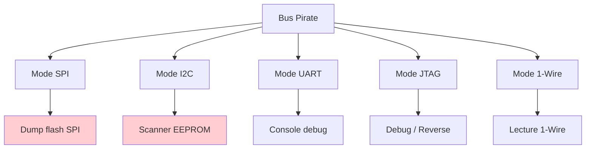
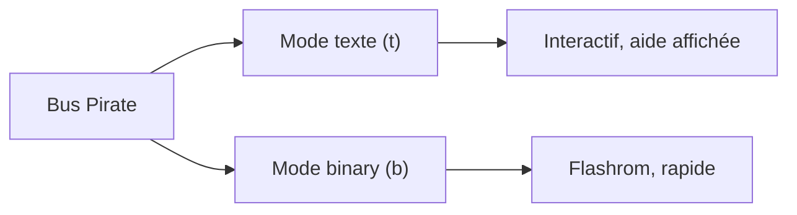
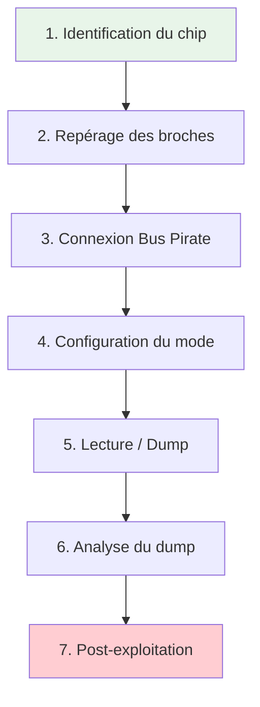
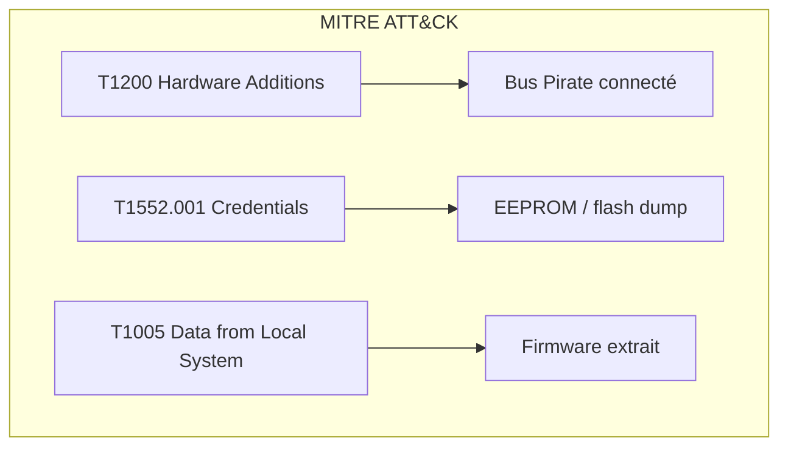
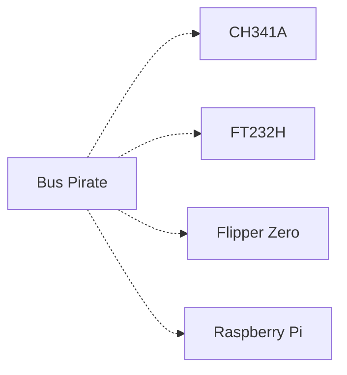

# 🏴‍☠️ Bus Pirate

> [!info] **En 1 phrase**
> Le **Bus Pirate** est un petit adaptateur USB de debug hardware qui parle les protocoles
> **UART, SPI, I2C, JTAG, 1-Wire**… — l'outil portable pour scanner un bus ou **dumper une
> flash SPI** avec flashrom.

---

## 🧾 Overview

| Champ | Valeur |
|---|---|
| **Type** | Adaptateur USB multi-protocole |
| **Domaine** | Hardware Hacking / Debug |
| **Niveau** | Beginner → Expert |
| **OS cibles** | Linux, Windows, macOS (tout OS avec pilotes USB) |
| **Matériel requis** | Bus Pirate v4/v5/v6, câble USB, sondes/connecteurs |
| **Complexité** | Faible → Moyenne |
| **Dernière mise à jour** | 2025-08-14 |

> [!info] 📊 **Diagramme de contexte**
> ```mermaid
> flowchart LR
>     A["Bus Pirate"] --> B["UART / SPI / I2C / JTAG"]
>     B --> C["Device cible"]
>     C --> D["Dump firmware / Lecture EEPROM"]
>     style A fill:#e1f5fe
>     style D fill:#c8e6c9
> ```

---

## 🎯 Concept

> Le Bus Pirate est un adaptateur USB open-source qui permet de communiquer avec les bus d'un PCB (UART, SPI, I2C, JTAG, 1-Wire, CAN) via un terminal série ou un logiciel comme flashrom. Il sert à scanner les bus, lire/écrire des flash EEPROM/SPI, capturer des signaux, et debugger des devices embarqués.



---

## 🧠 Concepts fondamentaux

### Protocoles de bus debug

Le Bus Pirate supporte plusieurs protocoles de communication serial utilisés sur les PCB pour la communication entre puces. Chaque protocole a ses propres signaux, timings et conventions.

| Terme | Définition |
|---|---|
| **SPI** | Serial Peripheral Interface — bus maître/esclave 4 fils (CLK, MOSI, MISO, CS) |
| **I2C** | Inter-Integrated Circuit — bus 2 fils (SDA, SCL) avec adressage 7/10 bits |
| **UART** | Universal Asynchronous Receiver/Transmitter — série asynchrone 2 fils (TX, RX) |
| **JTAG** | Joint Test Action Group — protocole de debug/test (TMS, TCK, TDI, TDO) |
| **1-Wire** | Protocole 1 fil de Maxim/Dallas pour capteurs et clés de sécurité |
| **Binary mode** | Mode de contrôle fin au niveau octet pour les communications rapides |
| **HiZ mode** | Mode haute impédance (défaut) — les broches sont en entrée, pas de pull-up |

### Mode binary vs mode texte

Le Bus Pirate propose deux modes d'interface : le mode texte (interactif, plus lent) et le mode binary (contrôle fin, requis pour flashrom). Le mode binary permet des communications plus rapides et plus fiables pour les dumps de flash.



### Pull-up / Pull-down et HiZ

Les bus I2C nécessitent des résistances pull-up sur SDA et SCL. Le Bus Pirate peut activer des pull-ups internes (mode I2C) ou externes. Le mode HiZ (haute impédance) est le mode par défaut pour éviter les courts-circuits lors de la connexion.

---

## 🔌 Matériel / Composants

### Outils principaux

| Outil | Type | Usage | Prix | Source |
|---|---|---|---|---|
| Bus Pirate v4 | Adaptateur USB | Mode binary, multi-protocole | ~30 USD | Seeedstudio |
| Bus Pirate v5 | Adaptateur USB | RP2040, interface graphique, NAND | ~40 USD | buspirate.com |
| Bus Pirate v6 | Adaptateur USB | RP2350, plus de RAM, logic analyzer | ~60 USD | buspirate.com |
| Adaptateurs SOIC-8 | Clip | Lecture in-circuit de flash SPI | ~5 USD | Divers |
| Fils Dupont / Jumper | Câblage | Connexion aux broches | ~3 USD | Standard |
| Sondes Hook | Probes | Connexion aux pistes du PCB | ~10 USD | Divers |

### Cibles typiques

| Catégorie | Exemples | Protocoles | Vulnérabilités |
|---|---|---|---|
| Routeurs/IoT | Flash SPI NOR | SPI | Dump firmware, credentials |
| Modules EEPROM | 24Cxx, 93Cxx | I2C / SPI | Config, secrets |
| Consoles debug | UART 3.3V | UART | Shell, boot logs |
| µC (AVR, STM32) | ATmega, STM32F1 | JTAG / SWD | Firmware, bypass RDP |
| Capteurs 1-Wire | DS18B20, iButton | 1-Wire | Clés, identifiants |

### Pinout / Brochage Bus Pirate v4

```
Vue du Bus Pirate v4 (brochage de la barrette) :

  ┌──────────────────────────┐
  │   Bus Pirate v4          │
  │                          │
  │   [USB]        [Barrette 10 pins]
  │                          │
  │   Brochage barrette :    │
  │   Pin 1  = GND           │
  │   Pin 2  = 3.3V          │
  │   Pin 3  = 5V            │
  │   Pin 4  = MOSI          │
  │   Pin 5  = CLK (SCK)     │
  │   Pin 6  = MISO          │
  │   Pin 7  = CS (VPU)      │
  │   Pin 8  = AUX           │
  │   Pin 9  = AUX2          │
  │   Pin 10 = ADC           │
  │                          │
  └──────────────────────────┘

Vue du Bus Pirate v5/v6 :

  ┌──────────────────────────┐
  │   Bus Pirate v5/v6       │
  │                          │
  │   [USB-C]     [Screen]   │
  │   [SD Card]              │
  │   [Clamp connector]      │
  │                          │
  │   RP2040 (v5) / RP2350 (v6)
  │   8 PIO state machines (v5)
  │   12 PIO state machines (v6)
  │   264KB RAM (v5) / 512KB RAM (v6)
  │                          │
  └──────────────────────────┘
```

### Bus Pirate v5 vs v6

| Caractéristique | Bus Pirate v5 | Bus Pirate v6 |
|---|---|---|
| Microcontrôleur | RP2040 dual core 125MHz | RP2350 dual core 133MHz |
| RAM | 264KB | 512KB |
| PIO state machines | 8 | 12 |
| Logic Analyzer intégré | Non | Oui |
| Interface graphique | Oui | Oui |
| Support NAND | Limité (2K page max) | Étendu (4K page, 1GB) |
| Prix | ~40 USD | ~60 USD |
| Production | Volume active | Production initiale |

> [!note] À vérifier
> Le Bus Pirate 6 est en production initiale (2025) avec des quantités limitées. La compatibilité NAND avec les nouveaux pilotes est en cours de stabilisation.

---

## ⚡ Protocoles

### SPI

| Paramètre | Valeur |
|---|---|
| **Type** | Série synchrone |
| **Vitesse** | jusqu'à 8 MHz |
| **Voltage** | 3.3V (BPv4), configurable (BPv5/v6) |
| **Nombre de fils** | 4 (CLK, MOSI, MISO, CS) |
| **Direction** | Full-duplex |

### I2C

| Paramètre | Valeur |
|---|---|
| **Type** | Série半 duplex |
| **Vitesse** | 100 kHz (Standard), 400 kHz (Fast) |
| **Voltage** | 3.3V |
| **Nombre de fils** | 2 (SDA, SCL) + GND |
| **Direction** | Half-duplex |

### UART

| Paramètre | Valeur |
|---|---|
| **Type** | Série asynchrone |
| **Vitesse** | 300 → 115200 baud (configurable) |
| **Voltage** | 3.3V TTL |
| **Nombre de fils** | 2 (TX, RX) + GND |
| **Direction** | Full-duplex |

### JTAG

| Paramètre | Valeur |
|---|---|
| **Type** | Série synchrone (test/debug) |
| **Vitesse** | jusqu'à 6 MHz |
| **Voltage** | 3.3V |
| **Nombre de fils** | 4 (TMS, TCK, TDI, TDO) + GND |
| **Direction** | Full-duplex |

### Comparaison des protocoles

| Protocole | Vitesse | Complexité | Sécurité | Usage typique |
|---|---|---|---|---|
| SPI | 8 MHz | Faible | Aucune | Flash NOR/EEPROM |
| I2C | 400 kHz | Faible | Aucune | EEPROM, capteurs |
| UART | 115200 baud | Très faible | Aucune | Console debug |
| JTAG | 6 MHz | Moyenne | Faible | Debug µC, bypass RDP |
| 1-Wire | 16 kbps | Très faible | Faible | Capteurs, iButton |

---

## 🛠️ Installation / Setup

### Prérequis

| Composant | Version | Lien |
|---|---|---|
| Bus Pirate firmware | v6.3 (BPv4) / latest (BPv5/v6) | buspirate.com |
| pirate-loader | latest | GitHub BusPirate |
| flashrom | latest | flashrom.org |
| Terminal série | PuTTY / screen / minicom | Divers |
| Librairie libusb | 1.0+ | Package manager |

### Connexion physique

```
PC ──── USB ──── Bus Pirate ──── Broches du device cible
│                         │
│  MOSI ──────────────── MOSI (SPI)
│  MISO ──────────────── MISO (SPI)
│  CLK  ──────────────── CLK/SCK (SPI)
│  CS   ──────────────── CS/SS (SPI)
│  GND  ──────────────── GND (commun)
│  VCC  ──[NE PAS BRANCHER]─ (sauf si alimentation voulue)
```

### Outils logiciels

```bash
# Installation de pirate-loader (BPv4)
cd Bus_Pirate/package/BPv4-firmware/pirate-loader-v4-source/pirate-loader_lnx
sudo ./pirate-loader_lnx --dev=/dev/ttyACM0 --hex=../BPv4-firmware-v6.3-r2151.hex

# Vérification de flashrom
flashrom --version

# Vérification du port série
ls /dev/ttyUSB*
dmesg | tail | grep tty
```

### Flash du firmware Bus Pirate

```bash
# BPv4 : pirate-loader
sudo ./pirate-loader_lnx --dev=/dev/ttyACM0 --hex=path/to/firmware.hex

# BPv5/v6 : via l'interface USB DFU
# 1. Mettre en mode DFU (bouton BOOT + reset)
# 2. Flasher avec dfu-util
dfu-util -a 0 -D firmware.uf2

# Vérification
screen /dev/ttyACM0 115200
# Taper "i" pour info → modèle et version firmware
```

---

## ⚙️ Configuration

### Paramètres du Bus Pirate

| Option | Valeur par défaut | Description |
|---|---|---|
| Mode | HiZ | Haute impédance (sécurité) |
| Baud rate | 115200 | Vitesse du port série |
| Voltage | 3.3V | Tension de sortie |
| Pull-ups | Désactivés | Résistances pull-up internes |
| Power supply | Désactivé | Alimentation externe off |

### Configuration matérielle

| Paramètre | Recommandé | Min | Max |
|---|---|---|---|
| Vitesse SPI | 1 MHz | 100 kHz | 8 MHz |
| Vitesse I2C | 100 kHz | 10 kHz | 400 kHz |
| Baud UART | 115200 | 300 | 921600 |
| Alimentation cible | 3.3V | 1.8V | 5V |

### Adaptateurs compatibles

| Adaptateur | Interface | Voltage | Note |
|---|---|---|---|
| CH341A | USB-SPI/I2C | 3.3V/5V | Bon marché, SPI/I2C |
| FT232H | USB multi-protocole | 3.3V | Fiable, rapide |
| ST-Link V2 | USB-SWD/JTAG | 3.3V | STM32专用 |
| J-Link | USB-JTAG/SWD | 1.2-3.6V | Professionnel |

---

## ⌨️ Commandes / Manipulations

### Commandes essentielles

| Commande | Description | Exemple |
|---|---|---|
| `i` | Info sur le device | Affiche version firmware |
| `m` | Changer de mode | Sélection SPI, I2C, UART… |
| `?` | Aide du mode actuel | Commandes disponibles |
| `v` | Voir les tensions ADC | Mesure de tension |
| `d/D` | Ajuster la résolution ADC | 10-bit ou 12-bit |
| `w` | Activer/désactiver les pull-ups | Pull-ups internes |
| `W` | Activer l'alimentation 3.3V/5V | Power supply |
| `o` | Changer l'endianness | MSB/LSB first |
| `f` | Mesure de fréquence | Signal sur AUX |
| `#` | Reset le Bus Pirate | Reboot |

### Modes principaux (terminal binaire)

```text
Mode SPI  : m → 1 → [CS#][CLK][MISO][MOSI][GND]   dump flash
Mode I2C  : m → 2 → [SDA][SCL][GND]               scanner / lire EEPROM
Mode UART : m → 3 → [TX][RX][GND]                 console série
Mode JTAG : m → 4 → [TMS][TCK][TDI][TDO][GND]     debug
Mode 1-Wire : m → 5 → [DATA][GND]                  lecture 1-Wire
```

### Commandes SPI (mode binary)

```text
# Entrer en mode SPI
m → SPI → vitesse → polarity → edge → phase

# Commandes SPI :
?          → aide SPI
0x00 0xFF  → envoyer octets
[           → CS bas (chip select)
]           → CS haut
r           → lire un octet
```

### Commandes I2C

```text
# Scanner les adresses I2C
m → I2C → vitesse
(1) → scan adresses
# Résultat : adresses détectées en hex

# Lire un EEPROM 24Cxx
(2) → start
(4) → address (0xA0 write, 0xA1 read)
(6) → data
(7) → stop
```

### Commandes UART

```text
# Mode bridge série
m → UART → 115200
# Tout ce qui est tapé est envoyé sur TX
# Tout ce qui est reçu sur RX est affiché
```

### Lecture / Écriture avec flashrom

```bash
# Détection automatique du chip
sudo flashrom -p buspirate_spi:dev=/dev/ttyUSB0

# Lecture complète
sudo flashrom -p buspirate_spi:dev=/dev/ttyUSB0 -r dump.bin

# Lecture avec chip spécifique et vitesse réduite
sudo flashrom -p buspirate_spi:dev=/dev/ttyUSB0,spispeed=1M -c "MX25L6406E" -r dump.bin

# Écriture (⚠️ dangereux sans backup)
sudo flashrom -p buspirate_spi:dev=/dev/ttyUSB0 -w new_firmware.bin

# Vérification
sudo flashrom -p buspirate_spi:dev=/dev/ttyUSB0 -v dump.bin
```

---

## 🧪 Exemples pratiques

### 🟢 Débutant — Scan I2C des adresses

```bash
# 1. Connecter le Bus Pirate au PCB cible
# 2. Ouvrir le terminal : screen /dev/ttyUSB0 115200
# 3. Changer de mode : m → I2C → 100kHz
# 4. Activer les pull-ups : w
# 5. Scanner les adresses : (1)
# 6. Les adresses respondantes s'affichent (ex: 0xA0, 0x68, 0x27)
# 7. Identifier les puces via les adresses (0xA0 = EEPROM, 0x68 = IMU, 0x27 = LCD)
```

### 🟡 Intermédiaire — Dump firmware SPI avec flashrom

```bash
# 1. Identifier le chip flash sur le PCB (silkscreen : W25Q32, MX25L256…)
# 2. Connecter le Bus Pirate en mode SPI (CS, CLK, MISO, MOSI, GND)
# 3. Lancer flashrom avec détection automatique
sudo flashrom -p buspirate_spi:dev=/dev/ttyUSB0
# 4. Si détection réussie, lire le dump complet
sudo flashrom -p buspirate_spi:dev=/dev/ttyUSB0 -r dump.bin
# 5. Vérifier le checksum du dump
md5sum dump.bin
# 6. Relire et comparer (contacts instables)
sudo flashrom -p buspirate_spi:dev=/dev/ttyUSB0 -r dump2.bin
md5sum dump2.bin  # Les deux doivent être identiques
```

### 🔴 Avancé — Lecture EEPROM I2C brute

```python
#!/usr/bin/env python3
"""Lecture d'un EEPROM I2C via Bus Pirate en mode binary"""
import serial
import struct

BAUD = 115200
PORT = "/dev/ttyUSB0"

def bp_command(ser, cmd):
    """Envoyer une commande au Bus Pirate"""
    ser.write(cmd)
    return ser.read(ser.inWaiting())

def i2c_read_eeprom(ser, addr, start, length):
    """Lire un bloc depuis un EEPROM I2C"""
    # Mode I2C
    bp_command(ser, b"\x01")  # Enter I2C mode
    bp_command(ser, b"\x62")  # 100kHz
    bp_command(ser, b"\x40")  # Pull-ups on
    bp_command(ser, b"\x80")  # Power on

    # Start + address + register
    bp_command(ser, b"\x08")  # Start
    bp_command(ser, bytes([addr | 0]))  # Write mode
    bp_command(ser, bytes([start >> 8, start & 0xFF]))  # Register address

    # Repeated start + read
    bp_command(ser, b"\x08")  # Start again
    bp_command(ser, bytes([addr | 1]))  # Read mode

    data = b""
    for i in range(length):
        bp_command(ser, b"\x04")  # ACK
        data += ser.read(1)

    bp_command(ser, b"\x06")  # Stop
    return data

ser = serial.Serial(PORT, BAUD, timeout=1)
data = i2c_read_eeprom(ser, 0xA0, 0x0000, 256)

with open("eeprom_dump.bin", "wb") as f:
    f.write(data)

print(f"[+] Dump complet : {len(data)} octets")
```

### ⚫ Expert — Sniffing I2C en temps réel

```python
#!/usr/bin/env python3
"""Sniffing de trames I2C en temps réel via Bus Pirate"""
import serial
import time

def i2c_sniff(ser):
    """Capturer les trames I2C en temps réel"""
    # Activer le mode sniffer
    bp_command(ser, b"\x01")  # Enter I2C
    bp_command(ser, b"\x62")  # 100kHz
    bp_command(ser, b"\x04")  # Start sniffing

    frames = []
    start_time = time.time()

    while time.time() - start_time < 60:  # 60 secondes
        data = ser.read(ser.inWaiting())
        if data:
            frame = {
                "timestamp": time.time(),
                "raw": data.hex(),
                "type": "I2C",
                "parsed": parse_i2c_frame(data)
            }
            frames.append(frame)
            print(f"[{frame['timestamp']:.2f}] {frame['parsed']}")

    return frames

def parse_i2c_frame(data):
    """Parser une trame I2C brute"""
    if len(data) < 2:
        return "trame incomplète"
    addr = data[0] >> 1
    rw = "R" if data[0] & 1 else "W"
    return f"Addr:0x{addr:02X} {rw} Data:{data[1:].hex()}"

ser = serial.Serial("/dev/ttyUSB0", 115200, timeout=1)
frames = i2c_sniff(ser)
print(f"\n[+] {len(frames)} trames capturées")
```

---

## 🧪 Workflow complet (scénario pas à pas)



### Étape 1 — Identification

| Action | Commande | Résultat attendu |
|---|---|---|
| Identifier le chip flash | Inspection visuelle du PCB | W25Q32, MX25L256… |
| Trouver la datasheet | Recherche web | Pinout, protocole |
| Vérifier les tensions | Multimètre sur VCC/GND | 3.3V ou 5V |

### Étape 2 — Repérage des broches

| Méthode | Difficulté | Fiabilité |
|---|---|---|
| Datasheet du chip | Faible | Élevée |
| Suivi des pistes sur PCB | Moyenne | Élevée |
| Mode Continuité (multimètre) | Faible | Moyenne |
| Marquages sur PCB | Très faible | Faible |

### Étape 3 — Connexion

Connecter les broches SPI/I2C/UART du Bus Pirate aux broches correspondantes du device cible. Toujours connecter GND en premier.

### Étape 4 — Exploitation

Scanner le bus, identifier les devices, lire les données (dump flash, EEPROM, console UART).

### Étape 5 — Post-exploitation

Analyser le dump (binwalk, strings, reverse engineering), extraire les secrets, documenter les findings.

---

## 🎬 Scénarios avancés

### Scénario 1 — Dump firmware complet d'un routeur IoT

| Élément | Détail |
|---|---|
| **Objectif** | Extraire le firmware complet d'un routeur via sa flash SPI |
| **Matériel** | Bus Pirate v5, clip SOIC-8, flashrom |
| **Étapes** | 1. Identifier W25Q128 sur le PCB → 2. Connecter clip SOIC-8 → 3. flashrom -r dump.bin → 4. binwalk -Me dump.bin → 5. Analyser rootfs |
| **Résultat** | Firmware complet avec credentials, certs, config |
| **Difficulté** | ⭐⭐⭐ |


### Scénario 2 — Lecture de config EEPROM sur device industriel

| Élément | Détail |
|---|---|
| **Objectif** | Extraire la configuration d'un contrôleur industriel via EEPROM I2C |
| **Matériel** | Bus Pirate v4, sondes Hook |
| **Étapes** | 1. Scanner I2C → 2. Identifier EEPROM 24C256 → 3. Lire 32KB → 4. Parser les données |
| **Résultat** | Configuration réseau, credentials, paramètres |
| **Difficulté** | ⭐⭐⭐⭐ |

---

## 🛡️ Cybersecurity use cases

| Use case | Sévérité | Matériel requis | Impact |
|---|---|---|---|
| Dump firmware IoT | Haute | Bus Pirate + clip SOIC-8 | Extraction de secrets |
| Lecture EEPROM | Moyenne | Bus Pirate | Récupération de config |
| Console UART debug | Haute | Bus Pirate | Shell d'accès |
| Scan I2C | Faible | Bus Pirate | Identification de devices |
| Sniffing SPI | Haute | Bus Pirate | Capture de communications |

| Phase pentest | Ce que permet cette technique |
|---|---|
| Recon | Identification des buses et devices sur un PCB |
| Accès initial | Dump firmware, extraction de credentials |
| Maintien d'accès | Re-flash avec firmware modifié |
| Évasion | Modification de la config réseau |
| Post-exploitation | Extraction de clés, analyse forensique |

---

## 🎯 MITRE ATT&CK

| Technique ID | Nom | Catégorie | Applicabilité |
|---|---|---|---|
| T1200 | Hardware Additions | Initial Access | Ajout du Bus Pirate pour accès physique |
| T1552.001 | Credentials In Files | Credential Access | Extraction de credentials depuis EEPROM/flash |
| T1005 | Data from Local System | Collection | Dump de firmware et config |
| T1083 | File and Directory Discovery | Discovery | Exploration du filesystem extrait |
| T1592 | Gather Victim Host Information | Recon | Identification des composants PCB |



### Mapping détaillé

| Phase MITRE | Technique | Cette fiche couvre |
|---|---|---|
| Initial Access | T1200 Hardware Additions | Connexion physique du Bus Pirate |
| Credential Access | T1552.001 Credentials in Files | Extraction depuis flash/EEPROM |
| Collection | T1005 Data from Local System | Dump complet de la flash |
| Discovery | T1083 File and Directory Discovery | Analyse du filesystem extrait |
| Recon | T1592 Gather Victim Host Info | Identification des composants |

---

## 🛡️ Defensive Security

### Détection

| Signal de détection | Source | Fiabilité |
|---|---|---|
| Connexion USB inconnue | Logs système | Élevée |
| Accès au bus SPI/I2C | Monitoring GPIO | Moyenne |
| Lecture de la flash | Logs d'accès mémoire | Moyenne |
| Connérie physique suspecte | Caméras / alertes | Faible |

| Indicateur | Log / Capteur | Seuil d'alerte |
|---|---|---|
| Nouveau périphérique USB | dmesg / Windows Event | Tout nouveau device |
| Accès SPI non autorisé | GPIO monitoring | >1 accès/heure |
| Dump de flash | Logs filesystem | Tout dump complet |

### Prévention

| Mesure | Efficacité | Coût | Priorité |
|---|---|---|---|
| Chiffrement de la flash | Très élevée | Faible | Haute |
| Secure boot | Élevée | Moyenne | Haute |
| Désactivation des bus debug | Élevée | Faible | Haute |
| Conformal coating | Moyenne | Faible | Moyenne |
| Monitoring USB | Élevée | Moyen | Haute |

### Durcissement (hardening)

```bash
# Désactiver JTAG/SWD en production (ESP32)
esptool.py --port COM3 burn_efuse JTAG_DISABLE

# Activer le chiffrement de la flash (ESP32)
esptool.py --port COM3 encrypt_flash --flash_mode dio --flash_size 4MB

# Verrouiller les secteurs de la flash (SPI)
flashrom -p ch341a_spi -p buspirate_spi:dev=/dev/ttyUSB0 --wp-enable
```

---

## 🤖 Automatisation

### Scripts d'exploitation

```python
#!/usr/bin/env python3
"""Script d'automatisation pour dump flash via Bus Pirate"""
import subprocess
import hashlib
import os

BUS_PIRATE_PORT = "/dev/ttyUSB0"
DUMP_FILE = "firmware_dump.bin"
NUM_READS = 3

def dump_flash():
    """Lire la flash complète via flashrom"""
    cmd = [
        "flashrom",
        "-p", f"buspirate_spi:dev={BUS_PIRATE_PORT},spispeed=1M",
        "-r", DUMP_FILE
    ]
    subprocess.run(cmd, check=True)

def verify_dump():
    """Vérifier le dump en le relisant"""
    hashes = []
    for i in range(NUM_READS):
        dump_flash()
        with open(DUMP_FILE, "rb") as f:
            h = hashlib.md5(f.read()).hexdigest()
        hashes.append(h)
        print(f"[{i+1}/{NUM_READS}] Hash: {h}")

    if len(set(hashes)) == 1:
        print("[+] Dump vérifié : tous les hashes correspondent")
    else:
        print("[-] ALERTE : hashes différents — contacts instables")

verify_dump()
```

### Outils d'automatisation

| Outil | Usage | Lien |
|---|---|---|
| flashrom | Lecture/écriture SPI flash | flashrom.org |
| OpenOCD | Debug JTAG/SWD | openocd.org |
| sigrok/PulseView | Analyse logique | sigrok.org |
| binwalk | Extraction firmware | github.com/ReFirmLabs/binwalk |

### Intégration dans des frameworks

| Framework | Méthode d'intégration |
|---|---|
| Metasploit | Module custom pour dump flash |
| Custom framework | Script Python avec pyserial |
| Automated pentest | Intégration dans pipeline CI/CD |

---

## 📤 Output et parsing

### Formats de sortie

| Format | Exemple | Utilité |
|---|---|---|
| Binary (dump) | firmware_dump.bin | Analyse complète |
| Intel HEX | dump.hex | MCU programming |
| Raw text | console UART output | Debug, logs |
| CSV | I2C scan results | Documentation |

### Parsing des résultats

```bash
# Analyser un dump firmware
binwalk -Me firmware_dump.bin

# Extraire les strings
strings -n 6 firmware_dump.bin | grep -iE 'pass|secret|key|token'

# Vérifier l'entropie
binwalk -E firmware_dump.bin

# Comparer deux dumps
binwalk firmware_dump1.bin firmware_dump2.bin
md5sum firmware_dump*.bin

# Scanner I2C depuis le Bus Pirate
# Les adresses sont affichées dans le terminal série
```

### Intégration SIEM / Logging

| Source | Format | Pipeline |
|---|---|---|
| Bus Pirate terminal | Texte brut | Serial → Log parser → SIEM |
| flashrom output | Texte | stdout → Log file → SIEM |
| UART console | Texte | Serial → Log aggregation |

---

## 🔗 Intégrations

- [[13 - Hardware & IoT|⚙️ Hardware & IoT]] global
- [[Hardware - CH341A|💾 CH341A]] pour comparaison des programmeurs
- [[Hardware - I2C et SPI|🔗 I2C/SPI]] pour détails des protocoles
- [[Hardware - UART|🔌 UART]] pour la console série
- [[Hardware - JTAG et SWD|🔧 JTAG/SWD]] pour le debug
- [[Hardware - Dump et Analyse de Firmware|💾 Dump de firmware]] pour l'analyse post-dump

| Outils associés | Usage complémentaire |
|---|---|
| CH341A | Programmeur SPI/I2C alternatif |
| Saleae Logic 2 | Logic analyzer professionnel |
| flashrom | Outil de lecture/écriture SPI |
| OpenOCD | Debug JTAG/SWD |

| Intégration | Comment |
|---|---|
| flashrom | Driver dédié buspirate_spi |
| OpenOCD | Interface Bus Pirate pour JTAG |
| sigrok | Capture de signaux via Bus Pirate |

---

## 🔄 Alternatives

| Alternative | Avantages | Inconvénients | Cas d'usage |
|---|---|---|---|
| CH341A | Très bon marché | SPI/I2C uniquement | Dump SPI basique |
| FT232H | Plus rapide, stable | Plus cher | Production |
| Flipper Zero | Portable, multi-protocole | Pas de JTAG | Tests terrain |
| Raspberry Pi | Linux complet, GPIO | Plus encombrant | Développement avancé |
| Tigard | Professionnel, isolate | Très cher | Laboratoire |



---

## ⚡ Performance

| Métrique | Valeur | Impact |
|---|---|---|
| Vitesse SPI max | 8 MHz (BPv4), 30 MHz (BPv5/v6) | BPv5/v6 plus rapide |
| Vitesse I2C max | 400 kHz | Suffisant pour EEPROM |
| Vitesse UART | 921600 baud max | Console debug |
| Latence USB | ~1ms | Acceptable |
| Taille dump typique | 1-16 MB | 1-10 minutes |

### Optimisations

| Technique | Gain | Complexité |
|---|---|---|
| Réduire spispeed | +fiabilité | Faible |
| Mode binary | +vitesse ×10 | Faible |
| Cache de lectures | +rapidité | Moyenne |
| Parallélisation des dumps | - | Élevée |

---

## 🛠️ Troubleshooting

| Problème | Cause probable | Solution |
|---|---|---|
| flashrom ne détecte rien | Mauvais CS, spispeed trop haut | `spispeed=1M`, vérifier CS |
| Écriture échouée | Write protect activé | Désactiver WP, vérifier WP# |
| Console UART vide | Mauvais TX/RX, mauvais baud | Vérifier broches, baud rate |
| I2C pas de réponse | Pas de pull-up | Activer pull-ups `w`, ajouter externes |
| Bus Pirate non reconnu | Pilote USB manquant | Installer pilotes, dmesg |
| Dump corrompu | Contacts instables | Reconnecter, relire, comparer |

### Erreurs courantes

```
Erreur : "No EEPROM/flash device detected"
Cause : Mauvais chip select ou spispeed trop rapide
Solution : Réduire spispeed=1M, vérifier broches CS/MOSI/MISO/CLK

Erreur : "Chip ID mismatch"
Cause : Mauvais chip sélectionné dans flashrom
Solution : Utiliser -c pour spécifier le chip, ou laisser flashrom détecter

Erreur : "Calibration failed" (ADC)
Cause : Tension hors plage
Solution : Vérifier l'alimentation, ne pas dépasser 3.3V
```

### Diagnostic

```bash
# Vérifier la connexion Bus Pirate
dmesg | tail | grep tty
ls /dev/ttyUSB*

# Vérifier le firmware Bus Pirate
screen /dev/ttyUSB0 115200
# Taper "i" → info device

# Vérifier flashrom
flashrom --version
flashrom -p buspirate_spi:dev=/dev/ttyUSB0

# Vérifier les signaux (oscilloscope ou logic analyzer)
# CLK doit être propre, CS doit descendre avant la communication
```

---

## 🔐 Sécurité

| Risque | Impact | Mitigation |
|---|---|---|
| Court-circuit par mauvais câblage | Élevé (puce grillée) | Vérifier le pinout, GND en premier |
| Écriture accidentelle sur la flash | Critique (brick device) | Toujours dump AVANT write |
| Tension excessive | Élevé | Vérifier 3.3V vs 5V |
| Données extraites non sécurisées | Élevé | Chiffrer les dumps, chaîne de custody |

> [!warning] Points de sécurité
> - Toujours **connecter GND en premier** lors du câblage
> - Ne jamais **écrire sur la flash** sans avoir fait un dump complet
> - Vérifier la **tension** (3.3V vs 5V) avant toute connexion
> - Les **pull-ups** peuvent endommager des puces sensibles

### Restrictions légales

> [!danger] Cadre légal
> L'utilisation du Bus Pirate pour lire/écrire des mémoires est légale sur du matériel que vous possédez ou pour lequel vous avez une autorisation explicite. Le dump de firmware d'appareils tiers sans autorisation constitue une atteinte à la propriété intellectuelle et potentiellement un acte de hacking illégal.

---

## ⚠️ Limitations

| Limite | Impact | Contournement |
|---|---|---|
| Pas d'isolation galvanique | Risque de court-circuit | Optocopleur externe |
| SPI max 8 MHz (BPv4) | Lent pour grosses flash | BPv5/v6 ou FT232H |
| Pas de support CAN natif | Impossible de sniffer CAN | Adaptateur CAN séparé |
| Mode binary nécessaire pour flashrom | Courbe d'apprentissage | Documentation flashrom |
| Pas d'alimentation forte | Limité pour certains devices | Alimentation externe |

### Cas où cette technique ne fonctionne pas

| Scénario | Raison |
|---|---|
| Flash chiffrée (AES) | Dump illisible sans clé |
| JTAG/SWD désactivé (RDP) | Pas d'accès debug |
| Chip sous bouclier EM/RF | Impossible de sonder |
| BGA encapsulé en résine | Pas d'accès physique aux broches |

---

## 📋 Cheatsheet

```
┌─────────────────────────────────────────────┐
│ Bus Pirate — Cheatsheet                     │
├─────────────────────────────────────────────┤
│ Mode :      m (choisir SPI/I2C/UART/JTAG)   │
│ Aide :      ? (dans chaque mode)             │
│ Info :      i (version firmware)             │
│ SPI dump :  flashrom -p buspirate_spi:...   │
│ I2C scan :  (1) en mode I2C                  │
│ UART :      mode UART, puis bridge           │
│ JTAG :      mode JTAG, OpenOCD               │
│ Pull-ups :  w (toggle)                       │
│ Power :     W (toggle 3.3V/5V)               │
│ Reset :     #                                │
└─────────────────────────────────────────────┘
```

| Action | Commande |
|---|---|
| Scan I2C | Mode I2C → `(1)` |
| Dump SPI | `flashrom -p buspirate_spi:dev=/dev/ttyUSB0 -r dump.bin` |
| Console UART | Mode UART → bridge |
| Debug JTAG | Mode JTAG → OpenOCD |
| Info device | `i` |
| Changer mode | `m` |

---

## ⚡ Quick reference

| Élément | Valeur / Commande |
|---|---|
| **Fonction** | Debug hardware, dump flash, scan bus |
| **Brochage** | 10-pin barrette (GND, 3V3, 5V, MOSI, CLK, MISO, CS, AUX) |
| **Vitesse par défaut** | 115200 baud (UART), 1 MHz (SPI) |
| **Voltage** | 3.3V (configurable) |
| **Logiciel principal** | flashrom, terminal série |
| **Commande rapide** | `flashrom -p buspirate_spi:dev=/dev/ttyUSB0 -r dump.bin` |

---

## 🔍 Détection & Défense

| Signal | Méthode de détection | Outil |
|---|---|---|
| Connexion USB suspecte | Logs système | dmesg, Windows Event Viewer |
| Accès SPI/I2C non autorisé | GPIO monitoring | Logic analyzer |
| Dump de flash | Logs d'accès | file integrity monitoring |

| Countermeasure | Efficacité | Implémentation |
|---|---|---|
| Chiffrement flash | Très élevée | AES-256 sur la flash |
| Secure boot | Élevée | Vérification d'intégrité au boot |
| JTAG/SWD disable | Élevée | eFuse (ESP32) |
| Conformal coating | Moyenne | Résine sur le PCB |

> [!tip] Défense
> La meilleure défense contre les dumps flash est le **chiffrement de la flash** combiné au **secure boot**. Sans ces protections, un attaquant avec un accès physique peut extraire le firmware complet en quelques minutes.

---

## ⚠️ Tips & Pièges

- **Piège 1** : Attention aux tensions — le Bus Pirate parle en 3.3V, un VCC 5V direct peut griller la cible.
- **Piège 2** : La masse commune obligatoire (GND cible ↔ GND probe) sinon aucun signal.
- **Piège 3** : L'ordre des broches sur la barrette n'est pas toujours celui gravé sur le PCB — vérifier la doc du modèle.
- **Astuce 1** : Le mode texte (`t`) est plus lent — préférer le mode binary pour flashrom.
- **Astuce 2** : Si flashrom ne détecte rien : tester `spispeed=1M` et vérifier le chip select (CS).
- **Bonne pratique** : Toujours lire la flash en plusieurs fois et comparer les checksums.

> [!tip] Astuces
> - Utiliser un **clip SOIC-8** pour éviter le dessoudage — rapide et réversible
> - Le **mode binary** est 10× plus rapide que le mode texte
> - Un **oscilloscope** ou un **logic analyzer** aide à diagnostiquer les problèmes de communication

---

## 📚 References

> [!info] 📚 **Sources**
> - [HardwareAllTheThings — Bus Pirate](https://github.com/swisskyrepo/HardwareAllTheThings/blob/main/docs/gadgets/bus-pirate.md)
> - [Bus Pirate Documentation](https://docs.buspirate.com)
> - [flashrom — Supported Hardware](https://www.flashrom.org/supported_hw/supported_programmers.html)
> - [Bus Pirate Forum — NAND Flash](https://forum.buspirate.com/t/drastic-storage-chip-price-increase/1399)

### Documentation officielle

| Source | URL | Type |
|---|---|---|
| Bus Pirate Docs | https://docs.buspirate.com | Documentation officielle |
| flashrom | https://www.flashrom.org | Outil de dump SPI |
| Bus Pirate Forum | https://forum.buspirate.com | Communauté |

### Vidéos / Tutorials

| Titre | Auteur | Lien |
|---|---|---|
| Bus Pirate Tutorial | Various | YouTube |
| Flashrom with Bus Pirate | Various | YouTube |
| I2C Sniffing with Bus Pirate | Various | YouTube |

### Livres / Articles

| Titre | Auteur | Année |
|---|---|---|
| Hardware Hacking Handbook | Jasper van Woudenberg, Colin O'Flynn | 2021 |
| The IoT Hacker's Handbook | Aditya Gupta | 2019 |

---

➡️ **Liens :** [[13 - Hardware & IoT|⚙️ Hardware & IoT]] · [[Hardware - I2C et SPI|🔗 I2C/SPI]] · [[Hardware - UART|🔌 UART]] · [[Hardware - JTAG et SWD|🔧 JTAG/SWD]] · [[Hardware - Dump et Analyse de Firmware|💾 Dump de firmware]]
