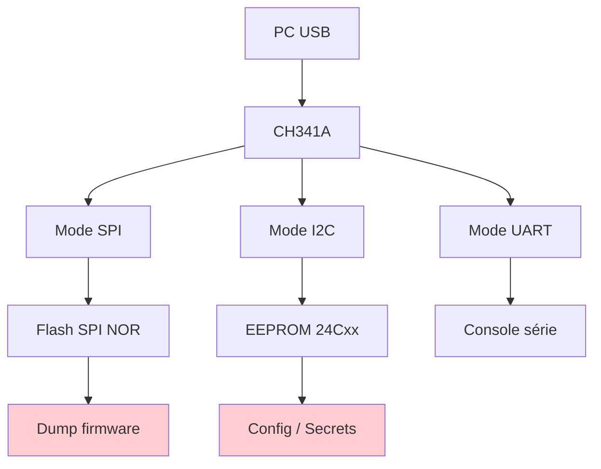
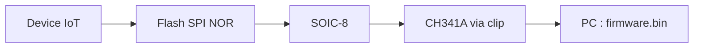
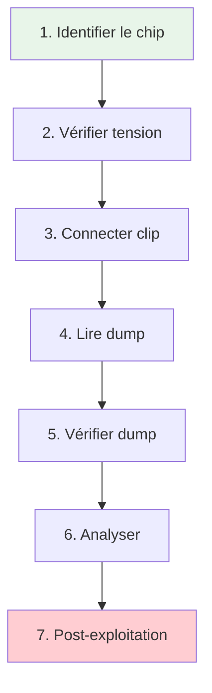
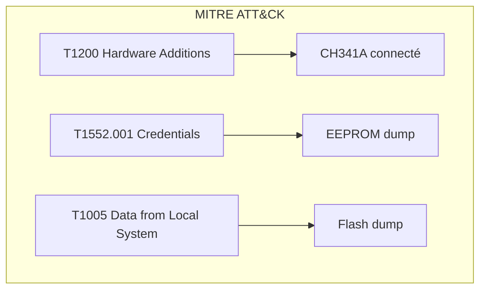
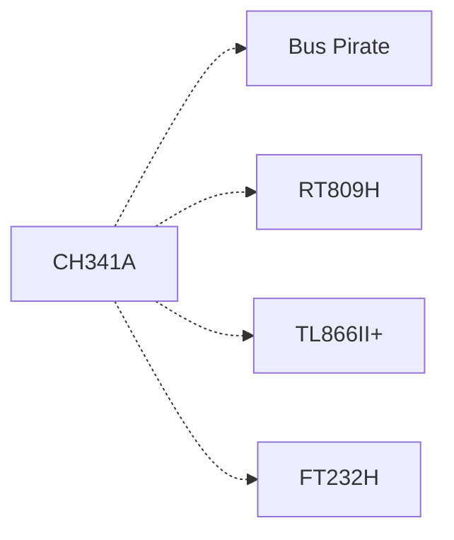

# CH341A

> [!info] **En 1 phrase**
> La **CH341A** est la petite carte USB (quelques euros) qui transforme ton PC en
> **programmeur SPI/I2C** : le moyen le plus simple et le plus connu pour **dumper la
> flash** d'un device IoT.

---

## Overview

| Champ | Valeur |
|---|---|
| **Type** | Programmeur USB multi-protocole |
| **Domaine** | Hardware Hacking / Flash Dump |
| **Niveau** | Beginner → Intermediate |
| **OS cibles** | Linux, Windows, macOS (pilotes universels) |
| **Matériel requis** | CH341A, clip SOIC-8, câble, logiciel |
| **Complexité** | Faible |
| **Dernière mise à jour** | 2025-08-14 |

> [!info] **Diagramme de contexte**
> ```mermaid
> flowchart LR
>     A["CH341A"] --> B["SPI Flash NOR"]
>     A --> C["I2C EEPROM"]
>     A --> D["UART TTL"]
>     B --> E["Dump firmware"]
>     C --> F["Config / Secrets"]
>     style A fill:#e1f5fe
>     style E fill:#c8e6c9
> ```

---

## Concept

> La puce CH341 de WCH (Nanjing Qinheng Microelectronics) est un contrôleur USB qui intègre trois interfaces : SPI (programmeur flash), I2C (EEPROM), et UART (série TTL). La carte CH341A est le format le plus courant : un USB dongle avec des broches pour connecter des clips ou des sondes, idéal pour lire/écrire des flash SPI NOR et des EEPROM I2C sur des PCB IoT.



---

## Concepts fondamentaux

### Puce CH341 et ses variantes

La puce CH341 existe en plusieurs variantes : CH341A (USB-SPI-I2C-UART), CH341B (USB-Parallel), CH341F (USB-Parallel). La variante CH341A est celle utilisée pour le hardware hacking car elle intègre SPI et I2C.

| Terme | Définition |
|---|---|
| **CH341A** | Puce USB → SPI + I2C + UART, format SOP-16/SSOP-28 |
| **SPI Flash NOR** | Mémoire flash sérielle (SOIC-8) — ex. W25Q, MX25L |
| **I2C EEPROM** | Mémoire EEPROM sérielle — ex. 24Cxx, AT24 |
| **In-circuit** | Lecture sans dessoudage (clip ou sondes sur le PCB) |
| **SOIC-8** | Package Standard Small Outline Integrated Circuit, 8 broches |
| **Clip SOIC-8** | Pince à ressort qui se connecte directement sur le chip sans dessoudage |
| **Level shifter** | Circuit de conversion de tension (3.3V ↔ 5V ↔ 1.8V) |

### SPI Flash NOR — le standard IoT

La plupart des devices IoT (routeurs, caméras, bornes) utilisent une flash SPI NOR pour stocker leur firmware. Ces puces sont au format SOIC-8 et communiquent via le protocole SPI. Le CH341A peut les lire sans dessoudage grâce à un clip.



### EEPROM I2C — stockage de config

Les EEPROM I2C (24C02, 24C256, etc.) stockent la configuration, les paramètres réseau, et parfois des secrets. Elles sont lisibles via le mode I2C du CH341A.

---

## Matériel / Composants

### Outils principaux

| Outil | Type | Usage | Prix | Source |
|---|---|---|---|---|
| CH341A programmer | Programmeur USB | Dump SPI/I2C/UART | ~3-5 USD | AliExpress, Amazon |
| Clip SOIC-8 | Pince | Lecture in-circuit sans dessoudage | ~3 USD | Divers |
| Adaptateur SOP8→DIP8 | PCB adapter | Conversion de package | ~2 USD | Inclus avec CH341A |
| Support DIP8 | Socket | Fixer la puce pour lecture | ~1 USD | Inclus |
| Multimètre | Mesure | Vérifier tensions et continuité | ~10 USD | Standard |
| Fer à souder | Soudure | Dessoudage si clip impossible | ~15 USD | Standard |

### CH341A — versions du hardware

| Version | Tension | Packages supportés | Note |
|---|---|---|---|
| CH341A v1.5 | 3.3V/5V (selecteur) | SOIC-8, DIP-8 | Basique, pas de pull-up |
| CH341A v1.6 | 3.3V/5V (selecteur) | SOIC-8, DIP-8,部分 pull-up | Intermédiaire |
| CH341A v1.7 | 1.8V/2.5V/3.3V/5V | SOIC-8, DIP-8, tout package | Recommandé, level shifter intégré |

### Cibles typiques

| Catégorie | Chips courants | Package | Vulnérabilités |
|---|---|---|---|
| Flash SPI NOR | W25Q32, W25Q64, W25Q128, MX25L256 | SOIC-8 | Firmware complet, secrets |
| EEPROM I2C | 24C02, 24C256, AT24C512 | SOIC-8, DIP-8 | Config, credentials |
| Flash SPI Data | AT45DB, GD25Q | SOIC-8 | Firmware, data |
| Flash SPI NAND | W25N01, GD5F1GQ4 | SOIC-8/16 | Firmware (avec ECC) |
| EC (Embedded Controller) | KB9012, KB9016 | LQFP-128 | BIOS, config clavier |

### Pinout / Brochage CH341A

```
Vue du CH341A (brochage du connecteur 2×5 pins) :

  ┌──────────────────────┐
  │  CH341A Programmer    │
  │                      │
  │  Brochage 2×5 pins : │
  │  Pin 1  = VCC (5V)   │
  │  Pin 2  = GND        │
  │  Pin 3  = TXD (UART) │
  │  Pin 4  = RXD (UART) │
  │  Pin 5  = SDA (I2C)  │
  │  Pin 6  = SCL (I2C)  │
  │  Pin 7  = CLK (SPI)  │
  │  Pin 8  = DI/MOSI    │
  │  Pin 9  = DO/MISO    │
  │  Pin 10 = CS/SS      │
  │                      │
  │  [USB-A connector]   │
  │  [Selecteur 3.3V/5V] │
  │  [DIP socket 28 pins]│
  └──────────────────────┘

Connexion clip SOIC-8 :
  Clip Pin 1 → VCC (3.3V ou 5V)
  Clip Pin 2 → GND
  Clip Pin 3 → WP# (Write Protect)
  Clip Pin 4 → VSS (GND)
  Clip Pin 5 → DI/MOSI
  Clip Pin 6 → CLK
  Clip Pin 7 → GND
  Clip Pin 8 → CS#

  Vérifier le pinout exact du chip cible
     (W25Q32 vs MX25L256 peuvent différer)
```

### Table des principaux chips supportés

| Fabricant | Famille | Capacité | Package | Usage |
|---|---|---|---|---|
| Winbond | W25Qxx | 4Mbit - 256Mbit | SOIC-8 | Flash SPI NOR |
| Macronix | MX25Lxx | 4Mbit - 256Mbit | SOIC-8 | Flash SPI NOR |
| GigaDevice | GD25Qxx | 4Mbit - 256Mbit | SOIC-8 | Flash SPI NOR |
| ISSI | IS25LPxx | 4Mbit - 128Mbit | SOIC-8 | Flash SPI NOR |
| SST | SST25VFxx | 4Mbit - 64Mbit | SOIC-8 | Flash SPI NOR |
| Atmel | AT25xxx | 4Kbit - 512Kbit | SOIC-8 | EEPROM SPI |
| Microchip | 24Cxx | 256bit - 512Kbit | SOIC-8 | EEPROM I2C |
| Adesto | AT45DBxx | 1Mbit - 512Mbit | SOIC-8 | Data Flash |
| EON | EN25QHxx | 4Mbit - 256Mbit | SOIC-8 | Flash SPI NOR |
| ESMT | F25Lxx | 4Mbit - 256Mbit | SOIC-8 | Flash SPI NOR |

> [!note] À vérifier
> La CH341A supporte 1430+ chips (selon la liste NeoProgrammer). Vérifier la compatibilité spécifique avec `DeviceList.txt` inclus dans le logiciel.

---

## Protocoles

### SPI (Serial Peripheral Interface)

| Paramètre | Valeur |
|---|---|
| **Type** | Série synchrone full-duplex |
| **Vitesse** | jusqu'à 30 MHz (CH341A limite: ~24 MHz) |
| **Voltage** | 1.8V / 2.5V / 3.3V / 5V (sélecteur) |
| **Nombre de fils** | 4 (CLK, MOSI, MISO, CS) |
| **Direction** | Full-duplex |

### I2C (Inter-Integrated Circuit)

| Paramètre | Valeur |
|---|---|
| **Type** | Série half-duplex |
| **Vitesse** | 100 kHz (Standard), 400 kHz (Fast) |
| **Voltage** | 1.8V / 2.5V / 3.3V / 5V |
| **Nombre de fils** | 2 (SDA, SCL) |
| **Direction** | Half-duplex |

### UART (TTL)

| Paramètre | Valeur |
|---|---|
| **Type** | Série asynchrone |
| **Vitesse** | 50 → 230400 baud |
| **Voltage** | 3.3V TTL |
| **Nombre de fils** | 2 (TX, RX) |
| **Direction** | Full-duplex |

### Comparaison avec autres programmeurs

| Programmeur | SPI | I2C | UART | Voltage | Prix |
|---|---|---|---|---|---|
| CH341A | Oui | Oui | Oui | 1.8-5V | ~3 USD |
| Bus Pirate | Oui | Oui | Oui | 3.3V | ~30 USD |
| FT232H | Oui | Oui | Oui | 3.3V | ~15 USD |
| RT809H | Oui | Oui | Oui | 1.8-12V | ~30 USD |
| TL866II+ | Oui | Oui | Non | 1.8-6.5V | ~25 USD |

---

## Installation / Setup

### Prérequis

| Composant | Version | Lien |
|---|---|---|
| flashrom | latest (v1.4+) | flashrom.org |
| ch341eeprom | latest | github.com/plumbum |
| NeoProgrammer | 2.2.0.6+ | gratuit (Windows) |
| AsProgrammer | latest | gratuit (Windows) |
| Librairie libusb | 1.0+ | Package manager |
| Clip SOIC-8 | Standard | AliExpress |

### Connexion physique

```
PC ──── USB-A ──── CH341A ──── Clip SOIC-8 ──── Flash SPI NOR
│                            │
│  VCC (3.3V) ─────────────── Pin 1 (VCC) du chip
│  GND ────────────────────── Pin 4 (GND) du chip
│  CS# ────────────────────── Pin 1 (CS#) du chip
│  CLK ────────────────────── Pin 6 (CLK) du chip
│  MOSI ───────────────────── Pin 5 (DI) du chip
│  MISO ───────────────────── Pin 2 (DO) du chip
│                            │
│  ⚠️ Vérifier le pinout exact du chip !
```

### Outils logiciels

```bash
# Installation de flashrom (Linux)
sudo apt install flashrom

# Ou compilation depuis les sources
git clone https://github.com/flashrom/flashrom.git
cd flashrom
make
sudo make install

# Installation de ch341eeprom
sudo apt install git make libusb-1.0-0-dev clang
git clone https://github.com/plumbum/ch341eeprom.git
cd ch341eeprom
make

# Vérification
flashrom --version
./ch341eeprom --help

# Vérification du device USB
lsusb | grep 1a86
# Résultat : Bus 001 Device 003: ID 1a86:5512 QinHeng Electronics
```

---

## Configuration

### Paramètres logiciels

| Option | Valeur par défaut | Description |
|---|---|---|
| Voltage | 3.3V | Sélecteur physique sur la carte |
| Programmer | ch341a_spi | Driver flashrom |
| Vitesse SPI | Défaut | Détection automatique |
| Mode lecture | RDID | Identification du chip |
| Taille dump | Auto | Taille totale du chip |

### Configuration matérielle

| Paramètre | Recommandé | Min | Max |
|---|---|---|---|
| Voltage | 3.3V (la plupart des flash) | 1.8V | 5V |
| Contact clip | Ferme, propre | - | - |
| Distance PCB-chip | In-circuit: 0cm | 0 | 10cm |
| Capacité chip | 4Mbit - 256Mbit | 64Kbit | 512Mbit |

### Sélecteur de tension

```
Sélecteur de tension CH341A v1.7 :

  Position 1 : 1.8V (flash basse tension)
  Position 2 : 2.5V (flash basse tension)
  Position 3 : 3.3V (standard — la plupart des flash)
  Position 4 : 5V (dangereux pour les flash 3.3V)

  TOUJOURS vérifier la tension du chip cible AVANT la lecture
  La plupart des flash SPI NOR fonctionnent en 3.3V
```

---

## Commandes / Manipulations

### Commandes essentielles

| Commande | Description | Exemple |
|---|---|---|
| `flashrom -r` | Lecture complète | `flashrom -p ch341a_spi -r dump.bin` |
| `flashrom -w` | Écriture complète | `flashrom -p ch341a_spi -w firmware.bin` |
| `flashrom -v` | Vérification | `flashrom -p ch341a_spi -v dump.bin` |
| `flashrom -c` | Spécifier le chip | `flashrom -p ch341a_spi -c W25Q16.V -r dump.bin` |
| `ch341eeprom -r` | Lecture EEPROM | `ch341eeprom -v -s 24c256 -r dump.bin` |
| `ch341eeprom -w` | Écriture EEPROM | `ch341eeprom -v -s 24c256 -w config.bin` |

### Lecture / Écriture avec flashrom

```bash
# Détection automatique du chip
sudo flashrom -V --programmer ch341a_spi

# Lecture complète (détection auto)
sudo flashrom -V --programmer ch341a_spi -r dump.bin

# Lecture avec chip spécifique
sudo flashrom -V --programmer ch341a_spi -r dump.bin -c W25Q16.V

# Lecture partielle (1 Ko à partir de l'offset 0)
sudo flashrom -V --programmer ch341a_spi -r dump.bin -l 0x400

# Écriture (ATTENTION : écrase le contenu actuel)
sudo flashrom -V --programmer ch341a_spi -w new_firmware.bin

# Vérification (comparer dump avec contenu actuel)
sudo flashrom -V --programmer ch341a_spi -v dump.bin
```

### Lecture EEPROM avec ch341eeprom

```bash
# Lecture d'un EEPROM 24C256
sudo ./ch341eeprom -v -s 24c256 -r eeprom_dump.bin

# Écriture sur un EEPROM 24C02
sudo ./ch341eeprom -v -s 24c02 -w config.bin

# Lecture complète avec taille spécifique
sudo ./ch341eeprom -v -s 24c512 -r -l 65536 full_dump.bin
```

---

## Exemples pratiques

### Débutant — Premier dump SPI avec clip

```bash
# 1. Identifier le chip flash sur le PCB (silkscreen : W25Q32, MX25L256…)
# 2. Vérifier la tension du chip (multimètre sur VCC/GND → 3.3V)
# 3. Brancher le clip SOIC-8 sur le chip (pin 1 = dot/encoche)
# 4. Connecter le clip au CH341A (adapter le pinout)
# 5. Brancher le CH341A en USB
# 6. Vérifier la détection :
sudo flashrom -V --programmer ch341a_spi
# 7. Lire le dump complet :
sudo flashrom -V --programmer ch341a_spi -r dump.bin
# 8. Vérifier la taille du dump (doit correspondre à la capacité du chip)
ls -la dump.bin
```

### Intermédiaire — Dump fiable avec comparaison

```bash
# 1. Premier dump
sudo flashrom -V --programmer ch341a_spi -r dump1.bin
md5sum dump1.bin

# 2. Débrancher et rebrancher le clip (tester la reproductibilité)
# 3. Deuxième dump
sudo flashrom -V --programmer ch341a_spi -r dump2.bin
md5sum dump2.bin

# 4. Comparer les hashes
if [ "$(md5sum dump1.bin | awk '{print $1}')" = "$(md5sum dump2.bin | awk '{print $1}')" ]; then
    echo "[+] Dumps identiques — extraction fiable"
else
    echo "[-] Dumps différents — revoir le contact du clip"
fi

# 5. Analyser le dump
binwalk -Me dump1.bin
strings -n 6 dump1.bin | grep -iE 'pass|key|token|secret'
```

### Avancé — Dump EEPROM I2C + analyse config

```bash
# 1. Scanner les adresses I2C (via Bus Pirate ou CH341A mode I2C)
# 2. Identifier l'EEPROM (0xA0 = 24Cxx, 0xA2 = 24Cxx bank 2)
# 3. Lire l'EEPROM complète
sudo ./ch341eeprom -v -s 24c256 -r eeprom_dump.bin

# 4. Analyser les strings
strings eeprom_dump.bin

# 5. Parser les données de config
xxd eeprom_dump.bin | head -20

# 6. Rechercher des secrets
grep -ra "password\|secret\|key\|token" eeprom_dump.bin

# 7. Sauvegarder le dump brut pour analyse forensique
cp eeprom_dump.bin /evidence/eeprom_$(date +%Y%m%d_%H%M%S).bin
```

### Expert — Re-flash avec firmware modifié

```python
#!/usr/bin/env python3
"""
Script expert : modification et re-flash d'un firmware
ATTENTION : risque de brick du device
"""
import subprocess
import hashlib
import os
import shutil

FLASHROM = "flashrom"
PROGRAMMER = "ch341a_spi"

def backup_firmware():
    """Faire un backup complet avant modification"""
    subprocess.run([
        FLASHROM, "-p", PROGRAMMER,
        "-r", "backup_original.bin"
    ], check=True)
    print("[+] Backup créé : backup_original.bin")
    return hashlib.md5(open("backup_original.bin", "rb").read()).hexdigest()

def modify_firmware(input_file, output_file, offset, new_bytes):
    """Modifier des octets à un offset spécifique"""
    with open(input_file, "rb") as f:
        data = bytearray(f.read())
    for i, b in enumerate(new_bytes):
        data[offset + i] = b
    with open(output_file, "wb") as f:
        f.write(data)
    print(f"[+] Firmware modifié : {output_file}")

def verify_and_flash(modified_file):
    """Vérifier puis flasher le firmware modifié"""
    # Vérifier d'abord
    result = subprocess.run([
        FLASHROM, "-p", PROGRAMMER,
        "-v", modified_file
    ], capture_output=True)

    if result.returncode != 0:
        print("[!] Différence détectée — flash en cours...")
        subprocess.run([
            FLASHROM, "-p", PROGRAMMER,
            "-w", modified_file
        ], check=True)
        print("[+] Flash terminé")
    else:
        print("[+] Le chip contient déjà ce firmware")

# Exemple : activer un mode debug en modifiant un byte
original_hash = backup_firmware()
print(f"[*] Hash original : {original_hash}")

# Modifier le byte à l'offset 0x1000 (exemple fictif)
modify_firmware("backup_original.bin", "modified.bin",
                offset=0x1000, new_bytes=b"\x01")

verify_and_flash("modified.bin")
```

---

## Workflow complet (scénario pas à pas)



### Étape 1 — Identification

| Action | Commande | Résultat attendu |
|---|---|---|
| Identifier le chip | Inspection visuelle + datasheet | W25Q32, MX25L256… |
| Vérifier la tension | Multimètre sur VCC/GND | 3.3V (la plupart) |
| Trouver le pin 1 | Dot, encoche, chanfrein sur le boîtier | Position du clip |

### Étape 2 — Repérage des broches

| Méthode | Difficulté | Fiabilité |
|---|---|---|
| Datasheet du chip | Faible | Très élevée |
| Marquage sur PCB | Faible | Moyenne |
| Suivi des pistes | Moyenne | Élevée |
| Mode Continuité | Faible | Moyenne |

### Étape 3 — Connexion

Poser le clip SOIC-8 sur le chip (pin 1 aligné), connecter le clip au CH341A, vérifier le sélecteur de tension.

### Étape 4 — Exploitation

Lancer flashrom, vérifier la détection, lire le dump complet, sauvegarder le fichier brut.

### Étape 5 — Post-exploitation

Analyser le dump (binwalk, strings, reverse), extraire les secrets, documenter les findings.

---

## Scénarios avancés

### Scénario 1 — Dump d'un routeur avec protection anti-clip

| Élément | Détail |
|---|---|
| **Objectif** | Extraire le firmware d'un routeur dont le chip flash est sous un bouclier EM/RF |
| **Matériel** | CH341A, fer à souder, préchauffeur, pistolet thermique |
| **Étapes** | 1. Identifier le chip sous le bouclier → 2. Découper le bouclier (Dremel) → 3. Dessouder le chip → 4. Souder sur un adaptateur SOP8→DIP8 → 5. Lire avec CH341A |
| **Résultat** | Firmware complet du routeur |
| **Difficulté** | |


### Scénario 2 — Récupération de credentials EEPROM sur device IoT

| Élément | Détail |
|---|---|
| **Objectif** | Extraire les credentials Wi-Fi stockés dans une EEPROM I2C d'une caméra IP |
| **Matériel** | CH341A, sondes Hook, mode I2C |
| **Étapes** | 1. Scanner I2C → 2. Identifier EEPROM 24C256 à 0xA0 → 3. Lire 32KB → 4. Parser la config → 5. Extraire les credentials |
| **Résultat** | Identifiants admin de la caméra IP |
| **Difficulté** | |

---

## Cybersecurity use cases

| Use case | Sévérité | Matériel requis | Impact |
|---|---|---|---|
| Dump firmware routeur | Haute | CH341A + clip SOIC-8 | Extraction de secrets |
| Lecture EEPROM credentials | Haute | CH341A + sondes | Récupération de config |
| Audit de firmware | Moyenne | CH341A | Vérification d'intégrité |
| Clonage de firmware | Haute | CH341A × 2 | Duplication de device |
| Récupération post-brick | Moyenne | CH341A | Restauration de firmware |

| Phase pentest | Ce que permet cette technique |
|---|---|
| Recon | Identification des composants flash sur le PCB |
| Accès initial | Dump firmware pour analyse hors-ligne |
| Maintien d'accès | Re-flash avec firmware modifié (backdoor) |
| Post-exploitation | Extraction de secrets (clés, credentials) |

---

## MITRE ATT&CK

| Technique ID | Nom | Catégorie | Applicabilité |
|---|---|---|---|
| T1200 | Hardware Additions | Initial Access | Ajout du CH341A pour accès physique |
| T1552.001 | Credentials In Files | Credential Access | Extraction depuis EEPROM |
| T1005 | Data from Local System | Collection | Dump de firmware |
| T1083 | File and Directory Discovery | Discovery | Exploration du filesystem |
| T1195.002 | Supply Chain Compromise | Initial Access | Re-flash avec firmware malveillant |



### Mapping détaillé

| Phase MITRE | Technique | Cette fiche couvre |
|---|---|---|
| Initial Access | T1200 Hardware Additions | Connexion physique du CH341A |
| Initial Access | T1195.002 Supply Chain | Re-flash firmware |
| Credential Access | T1552.001 Credentials in Files | Extraction EEPROM |
| Collection | T1005 Data from Local System | Dump flash complet |
| Discovery | T1083 File and Directory Discovery | Analyse filesystem |

---

## Defensive Security

### Détection

| Signal de détection | Source | Fiabilité |
|---|---|---|
| Connexion USB CH341A | Logs système USB | Élevée |
| Lecture de la flash | GPIO monitoring SPI | Moyenne |
| Dessoudage / clip | Inspection physique | Élevée |
| Nouveau firmware flashé | Integrity monitoring | Élevée |

| Indicateur | Log / Capteur | Seuil d'alerte |
|---|---|---|
| Device USB 1a86:5512 | dmesg / Windows Event | Tout nouveau device |
| Accès SPI non autorisé | SPI monitoring | >1 accès/heure |
| Flash modifiée | file integrity | Tout changement |

### Prévention

| Mesure | Efficacité | Coût | Priorité |
|---|---|---|---|
| Secure boot | Très élevée | Moyenne | Haute |
| Chiffrement flash | Très élevée | Faible | Haute |
| Write protect (WP#) | Élevée | Gratuit | Haute |
| Conformal coating | Moyenne | Faible | Moyenne |
| Bouclier EM/RF | Moyenne | Faible | Moyenne |

### Durcissement (hardening)

```bash
# Activer le write protect sur une flash SPI (exemple W25Q)
# 1. Lire le statut register
flashrom -p ch341a_spi -r /dev/null

# 2. Activer le write protect
# Cette opération peut être irréversible
# Référez-vous à la datasheet du chip

# Vérifier le secure boot (ESP32)
esptool.py --port COM3 encrypted_status

# Activer le chiffrement de la flash
esptool.py --port COM3 encrypt_flash --flash_mode dio
```

---

## Automatisation

### Scripts d'exploitation

```python
#!/usr/bin/env python3
"""Script d'automatisation CH341A — dump et analyse"""
import subprocess
import hashlib
import os

PROGRAMMER = "ch341a_spi"
DUMP_DIR = "/dumps"

def dump_firmware(chip_name=None):
    """Dump complet de la flash"""
    os.makedirs(DUMP_DIR, exist_ok=True)
    output = f"{DUMP_DIR}/dump_{hashlib.md5(str(os.urandom(8)).encode()).hexdigest()[:8]}.bin"

    cmd = ["flashrom", "-p", PROGRAMMER, "-r", output]
    if chip_name:
        cmd.extend(["-c", chip_name])

    subprocess.run(cmd, check=True)
    print(f"[+] Dump créé : {output}")
    return output

def analyze_dump(dump_file):
    """Analyse rapide du dump"""
    # Strings et secrets
    result = subprocess.run(
        ["strings", "-n", "6", dump_file],
        capture_output=True, text=True
    )
    secrets = [l for l in result.stdout.splitlines()
               if any(w in l.lower() for w in ["password", "key", "token", "secret"])]
    if secrets:
        print(f"[+] Secrets trouvés : {len(secrets)}")
        for s in secrets[:10]:
            print(f"    {s}")
    return secrets

# Exécution
dump = dump_firmware()
analyze_dump(dump)
```

### Outils d'automatisation

| Outil | Usage | Lien |
|---|---|---|
| flashrom | Lecture/écriture SPI flash | flashrom.org |
| ch341eeprom | Lecture/écriture EEPROM I2C | github.com/plumbum |
| NeoProgrammer | GUI Windows multi-chip | Gratuit |
| binwalk | Extraction firmware | github.com/ReFirmLabs/binwalk |

### Intégration dans des frameworks

| Framework | Méthode d'intégration |
|---|---|
| Metasploit | Module custom pour dump flash |
| Custom framework | Script Python avec subprocess |
| Forensics toolkit | Intégration dans pipeline d'analyse |

---

## Output et parsing

### Formats de sortie

| Format | Exemple | Utilité |
|---|---|---|
| Binary | dump.bin | Firmware complet |
| Intel HEX | dump.hex | Programmation MCU |
| Raw | firmware_raw.bin | Analyse brute |
| JSON | chip_info.json | Documentation |

### Parsing des résultats

```bash
# Analyse rapide d'un dump
binwalk -Me dump.bin

# Extraire les strings
strings -n 6 dump.bin | head -100

# Rechercher des secrets
strings -n 6 dump.bin | grep -iE 'pass|key|token|secret|api'

# Vérifier l'entropie (chiffrement ?)
binwalk -E dump.bin

# Comparer deux dumps
cmp -l dump1.bin dump2.bin | wc -l

# Afficher le header (16 premiers octets)
xxd dump.bin | head -1

# Lire un fichier Intel HEX
cat dump.hex | tr -d ":" | tr -d "\n" | xxd -r -p | strings
```

### Intégration SIEM / Logging

| Source | Format | Pipeline |
|---|---|---|
| flashrom logs | Texte | stdout → Log file |
| ch341eeprom logs | Texte | stdout → Log file |
| USB events | OS logs | dmesg / Windows Event |

---

## Intégrations

- [[13 - Hardware & IoT| Hardware & IoT]] global
- [[Hardware - Bus Pirate| Bus Pirate]] pour comparaison
- [[Hardware - Memory Programmer| Memory Programmer]] pour programmeurs avancés
- [[Hardware - I2C et SPI| I2C/SPI]] pour détails des protocoles
- [[Hardware - Dump et Analyse de Firmware| Dump de firmware]] pour l'analyse post-dump

| Outils associés | Usage complémentaire |
|---|---|
| flashrom | Outil principal de dump SPI |
| ch341eeprom | Outil de dump EEPROM I2C |
| NeoProgrammer | GUI pour Windows |
| binwalk | Extraction firmware |

| Intégration | Comment |
|---|---|
| flashrom | Driver ch341a_spi |
| OpenOCD | Non supporté (utiliser ST-Link) |
| binwalk | Analyse post-dump |

---

## Alternatives

| Alternative | Avantages | Inconvénients | Cas d'usage |
|---|---|---|---|
| Bus Pirate | Plus de protocoles | Plus cher | Debug avancé |
| RT809H | Plus de chips, eMMC | Plus cher | Programmes industriels |
| TL866II+ | Plus fiable, isolation | Plus cher | Production |
| FT232H | Plus rapide, stable | Plus cher | Développement |
| Raspberry Pi GPIO | Linux complet | Plus encombrant | Développement |



---

## Performance

| Métrique | Valeur | Impact |
|---|---|---|
| Vitesse SPI | ~1 MHz (limité USB) | Lent pour grosses flash |
| Temps dump 16MB | ~2-5 minutes | Acceptable |
| Vitesse I2C | ~100 kHz | Suffisant pour EEPROM |
| Fiabilité | Moyenne (contacts clip) | Vérifier avec 2 dumps |
| Latence USB | ~1ms | Négligeable |

### Optimisations

| Technique | Gain | Complexité |
|---|---|---|
| Dump partiel | -50% temps | Faible |
| Réduire spispeed | +fiabilité | Faible |
| Deux dumps comparés | +confiance | Faible |
| Adaptateur SOP8→DIP8 | +stabilité | Faible |

---

## Troubleshooting

| Problème | Cause probable | Solution |
|---|---|---|
| "No EEPROM/flash chip detected" | Mauvais contact clip | Re-positionner, nettoyer, presser |
| "Chip ID mismatch" | Mauvais chip sélectionné | Utiliser `-c` pour spécifier |
| "Calibration failed" | Tension incorrecte | Vérifier le sélecteur 3.3V/5V |
| Dump corrompu | Contact instable | Relire, comparer 2 dumps |
| CH341A non reconnu | Pilote manquant | Installer pilotes CH341 |
| Write échoué | Write protect actif | Désactiver WP# |

### Erreurs courantes

```
Erreur : "No CH341A programmer found"
Cause : Pilote USB non installé ou device non connecté
Solution : Installer les pilotes CH341, vérifier dmesg

Erreur : "Chip identification failed"
Cause : Mauvais contact ou mauvais chip
Solution : Re-positionner le clip, vérifier le pinout

Erreur : "Read failed at address 0x..."
Cause : Contact instable ou chip endommagé
Solution : Reconnecter, essayer un autre clip
```

### Diagnostic

```bash
# Vérifier la détection USB
lsusb | grep 1a86
dmesg | tail | grep ch341

# Vérifier le device
ls /dev/ttyUSB*

# Vérifier flashrom
flashrom --version
flashrom -p ch341a_spi

# Vérifier le contact
# Relire le dump 2 fois et comparer les hashes
flashrom -p ch341a_spi -r test1.bin
flashrom -p ch341a_spi -r test2.bin
md5sum test1.bin test2.bin
```

---

## Sécurité

| Risque | Impact | Mitigation |
|---|---|---|
| Écriture accidentelle | Critique (brick) | Toujours dump AVANT write |
| Mauvais voltage | Élevé (puce grillée) | Vérifier tension avec multimètre |
| Données extraites | Élevé | Chiffrer les dumps |
| Contact défaillant | Faible | Vérifier avec 2 dumps |

> [!warning] Points de sécurité
> - Toujours **lire AVANT d'écrire** sur une flash
> - Vérifier la **tension** du chip cible (3.3V vs 5V)
> - Un **dump corrompu** peut bricker le device si re-flashé
> - Les **clips SOIC-8** ont une durée de vie limitée

### Restrictions légales

> [!danger] Cadre légal
> L'utilisation du CH341A pour lire/écrire des mémoires est légale sur du matériel que vous possédez. Le dump de firmware d'appareils tiers sans autorisation peut constituer une atteinte à la propriété intellectuelle.

---

## Limitations

| Limite | Impact | Contournement |
|---|---|---|
| Pas d'isolation galvanique | Risque de court-circuit | Optocopleur externe |
| SPI limité à ~24 MHz | Lent pour grosses flash | FT232H ou RT809H |
| Clips instables | Dump corrompu | 2 dumps comparés, adaptateur |
| Pas de support BGA | Impossible de lire les chips BGA | Dessoudage + socket BGA |
| Voltage limité (1.8-5V) | Pas de chips haute tension | RT809H |

### Cas où cette technique ne fonctionne pas

| Scénario | Raison |
|---|---|
| Flash chiffrée (AES) | Dump illisible sans clé |
| Chip sous bouclier EM/RF | Impossible de cliper |
| BGA encapsulé | Pas d'accès physique |
| WP# soudé en dur | Write protect non désactivable |
| Chip mort | Pas de réponse SPI |

---

## Cheatsheet

```
┌─────────────────────────────────────────────┐
│ CH341A — Cheatsheet                         │
├─────────────────────────────────────────────┤
│ Dump SPI :  flashrom -p ch341a_spi -r dump  │
│ Dump I2C :  ch341eeprom -v -s 24c256 -r    │
│ Write SPI : flashrom -p ch341a_spi -w fw    │
│ Verify :    flashrom -p ch341a_spi -v dump  │
│ Detect :    flashrom -p ch341a_spi          │
│ Voltage :   Sélecteur 3.3V (défaut)        │
│ Clip :      SOIC-8, pin 1 = dot/encoche    │
│ MD5 check : md5sum dump.bin                 │
└─────────────────────────────────────────────┘
```

| Action | Commande |
|---|---|
| Dump SPI | `flashrom -p ch341a_spi -r dump.bin` |
| Dump I2C | `ch341eeprom -v -s 24c256 -r dump.bin` |
| Write SPI | `flashrom -p ch341a_spi -w firmware.bin` |
| Verify | `flashrom -p ch341a_spi -v dump.bin` |
| Detect | `flashrom -p ch341a_spi` |

---

## Quick reference

| Élément | Valeur / Commande |
|---|---|
| **Fonction** | Programmeur SPI/I2C/UART USB |
| **Brochage** | 2×5 pins (VCC, GND, TX, RX, SDA, SCL, CLK, MOSI, MISO, CS) |
| **Vitesse par défaut** | 100 kHz (I2C), ~1 MHz (SPI) |
| **Voltage** | 1.8V / 2.5V / 3.3V / 5V (sélecteur) |
| **Logiciel principal** | flashrom, ch341eeprom |
| **Commande rapide** | `flashrom -p ch341a_spi -r dump.bin` |

---

## Détection & Défense

| Signal | Méthode de détection | Outil |
|---|---|---|
| Device USB CH341A | Logs USB | dmesg, Windows Event |
| Accès SPI suspect | GPIO monitoring | Logic analyzer |
| Flash modifiée | Integrity check | file trip / AIDE |

| Countermeasure | Efficacité | Implémentation |
|---|---|---|
| Secure boot | Très élevée | Vérification au boot |
| Chiffrement flash | Très élevée | AES-256 |
| Write protect | Élevée | WP# pull-up |
| Conformal coating | Moyenne | Résine sur PCB |

> [!tip] Défense
> La meilleure protection contre les dumps flash est le **chiffrement de la flash** combiné au **secure boot**. Sans ces protections, un attaquant avec un accès physique et un CH341A (~3 USD) peut extraire le firmware en quelques minutes.

---

## Tips & Pièges

- **Piège 1** : La CH341A n'est pas isolée — vérifier la tension (3.3V, certains modules en 5V).
- **Piège 2** : Le dump doit être complet — `flashrom` lit par défaut toute la puce, conserver le fichier brut.
- **Astuce 1** : **Identifier la puce** (silkscreen : W25Q32, MX25L256…) avant le dump et la passer en `-c`.
- **Astuce 2** : **Comparer deux dumps** pour valider l'extraction (contacts de clip instables).
- **Astuce 3** : Tester d'abord un **dump court** (`-l <len>`) pour valider le contact avant de lire toute la puce.
- **Bonne pratique** : Toujours sauvegarder le dump brut dans un emplacement sûr avant analyse.

> [!tip] Astuces
> - Un **clip SOIC-8** est réutilisable et évite le dessoudage
> - La **vérification MD5** de deux dumps successifs confirme la fiabilité
> - La commande `flashrom -V` (verbose) affiche les détails de détection

---

## References

> [!info] **Sources**
> - [HardwareAllTheThings — CH341A](https://github.com/swisskyrepo/HardwareAllTheThings/blob/main/docs/gadgets/ch341a.md)
> - [flashrom — Supported Hardware](https://www.flashrom.org/supported_hw/supported_programmers.html)
> - [NeoProgrammer — CH341A Chip List](https://tecmikro.com/documentos-software/ch341a-programmer-devicelist.txt)
> - [CH341A Programmer Manual](https://m.media-amazon.com/images/I/B1cML5t-HGL.pdf)

### Documentation officielle

| Source | URL | Type |
|---|---|---|
| flashrom | https://www.flashrom.org | Outil de dump SPI |
| ch341eeprom | https://github.com/plumbum/ch341eeprom | Outil EEPROM I2C |
| NeoProgrammer | Gratuit (Windows) | GUI programmeur |
| WCH CH341 Datasheet | http://www.wch-ic.com | Spécifications puce |

### Vidéos / Tutorials

| Titre | Auteur | Lien |
|---|---|---|
| CH341A Flash Dump Tutorial | Various | YouTube |
| CH341A EEPROM Read/Write | Various | YouTube |
| IoT Firmware Dump with CH341A | Various | YouTube |

### Livres / Articles

| Titre | Auteur | Année |
|---|---|---|
| Hardware Hacking Handbook | Jasper van Woudenberg, Colin O'Flynn | 2021 |
| Practical IoT Hacking | Chantzis et al. | 2021 |

---

**Liens :** [[13 - Hardware & IoT| Hardware & IoT]] · [[Hardware - I2C et SPI| I2C/SPI]] · [[Hardware - Dump et Analyse de Firmware| Dump de firmware]] · [[Hardware - UART| UART]]
