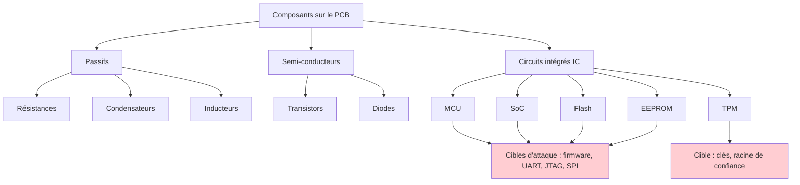
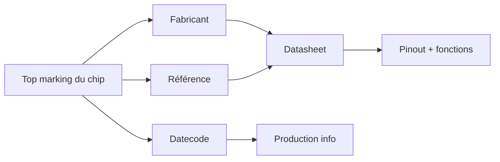
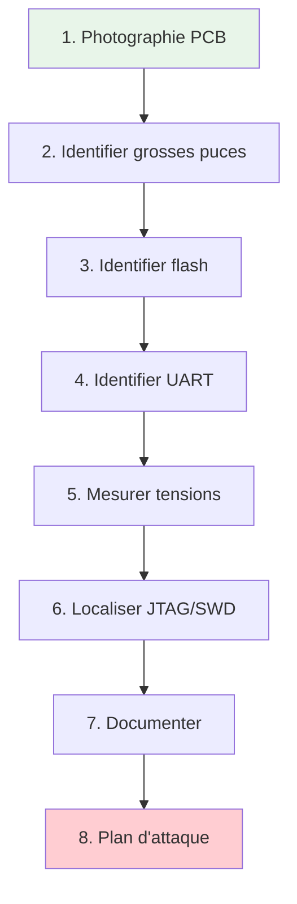
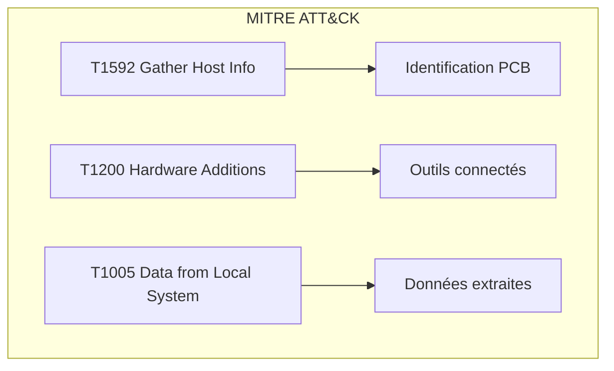
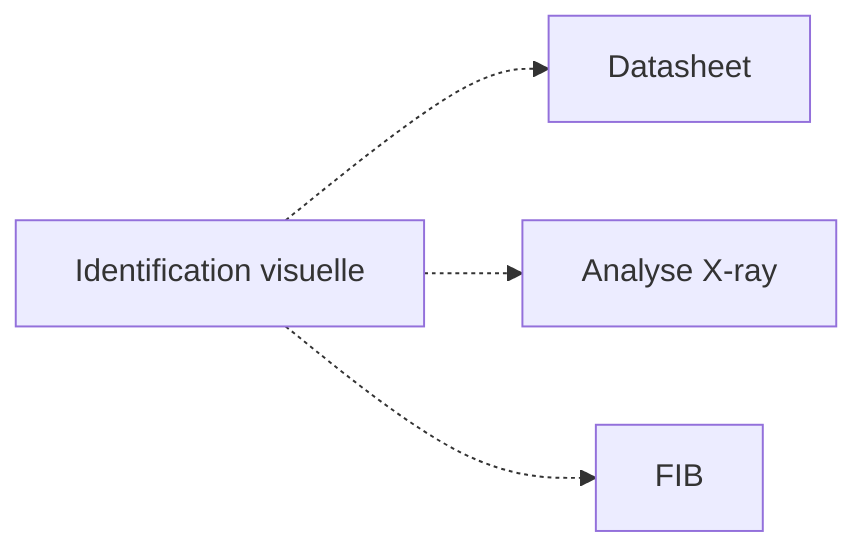

# 🧩 Composants électroniques

> [!info] **En 1 phrase**
> Reconnaître les composants sur un PCB (résistances, condensateurs, transistors,
> inducteurs, IC/MCU/SoC/TPM) = savoir **où attaquer** et **quoi ne pas griller**.

---

## 🧾 Overview

| Champ | Valeur |
|---|---|
| **Type** | Connaissance fondamentale |
| **Domaine** | Hardware Hacking / Électronique |
| **Niveau** | Beginner → Expert |
| **OS cibles** | Tous (bare-metal, embedded, IoT) |
| **Matériel requis** | Multimètre, loupe/binoculaire, microscope |
| **Complexité** | Faible (identification) → Élevée (analyse avancée) |
| **Dernière mise à jour** | 2025-08-14 |

> [!info] 📊 **Diagramme de contexte**
> ```mermaid
> flowchart LR
>     A["PCB cible"] --> B["Identification composants"]
>     B --> C["Passifs"]
>     B --> D["Semi-conducteurs"]
>     B --> E["Circuits intégrés"]
>     C --> F["Alimentation / Signaux"]
>     D --> G["Commutation / Amplification"]
>     E --> H["Firmware / Logique"]
>     style A fill:#e1f5fe
>     style H fill:#c8e6c9
> ```

---

## 🎯 Concept

> Savoir identifier les composants sur un PCB est la base du hardware hacking. Chaque composant a un rôle (alimentation, logique, communication) et représente une cible ou un obstacle. Les grosses puces = SoC/MCU (cibles firmware), les petites autour = flash, régulateurs, interfaces (signaux). Les TPM/Secure Element = le coffre-fort (clés).



> [!info] 💡 **Règle d'or du hardware hacker**
> - Les **grosses puces** = SoC/MCU (cibles principales : firmware, debug).
> - Les **petites autour** = flash, régulateurs, interfaces (là où passent les signaux).
> - **TPM / Secure Element** = le coffre-fort (clés, mesures de boot).

---

## 🧠 Concepts fondamentaux

### Hiérarchie des composants

| Terme | Définition |
|---|---|
| **Passif** | Composant sans source d'énergie (résistance, condensateur, inducteur) |
| **Semi-conducteur** | Composant à base de silicium (diode, transistor) |
| **IC (Integrated Circuit)** | Circuit intégré (MCU, SoC, EEPROM, flash) |
| **MCU (Microcontrôleur)** | Processeur + mémoire + IO sur une puce (STM32, ESP32) |
| **SoC (System-on-Chip)** | Système complet sur une puce (CPU + GPU + IO) |
| **TPM (Trusted Platform Module)** | Module sécurisé pour clés et attestation |
| **PMIC (Power Management IC)** | Gestion de l'alimentation |
| **EEPROM** | Mémoire non volatile petit format (config, secrets) |
| **Flash** | Mémoire non volatile grande capacité (firmware) |

### Identification par marqueur visuel

Les composants sont identifiés par leur **top marking** : code imprimé sur le boîtier. Ce code contient le fabricant, la référence, et parfois la date de production.



### Packages de composants

| Package | Description | Broches typiques | Usage |
|---|---|---|---|
| SMD 0201 | Très petit, 0.6×0.3mm | 2 | Résistances, condensateurs |
| SMD 0402 | Petit, 1.0×0.5mm | 2 | Résistances, condensateurs |
| SMD 0603 | Moyen, 1.6×0.8mm | 2 | Résistances, condensateurs |
| SMD 0805 | Standard, 2.0×1.25mm | 2 | Résistances, condensateurs |
| SOT-23 | Transistor, 3 pattes | 3 | Transistors, régulateurs |
| SOIC-8 | IC 8 broches | 8 | Flash SPI, EEPROM |
| TSSOP | IC à broches fines | 16-64 | IC divers |
| QFP | IC à broches sur 4 côtés | 32-200 | MCU, FPGA |
| BGA | IC à billes | 100-1000+ | SoC, eMMC |

---

## 🔌 Matériel / Composants

### Résistances

#### Codes couleur (traversant)

| Couleur | Chiffre | Multiplieur | Tolérance |
|---|---|---|---|
| Noir | 0 | ×1 | - |
| Marron | 1 | ×10 | ±1% |
| Rouge | 2 | ×100 | ±2% |
| Orange | 3 | ×1K | - |
| Jaune | 4 | ×10K | - |
| Vert | 5 | ×100K | ±0.5% |
| Bleu | 6 | ×1M | ±0.25% |
| Violet | 7 | ×10M | ±0.1% |
| Gris | 8 | - | - |
| Blanc | 9 | - | - |
| Or | - | ×0.1 | ±5% |
| Argent | - | ×0.01 | ±10% |

**Exemple** : Rouge-Violet-Or = 2.7 Ω ±5%
**Exemple** : Marron-Noir-Rouge = 1K Ω ±2%

#### Codes SMD (3-4 chiffres)

| Code | Valeur | Explication |
|---|---|---|
| `0` | 0 Ω | Strap (jonction) |
| `100` | 10 Ω | 10 × 10⁰ |
| `101` | 100 Ω | 10 × 10¹ |
| `103` | 10 KΩ | 10 × 10³ |
| `472` | 4.7 KΩ | 47 × 10² |
| `105` | 1 MΩ | 10 × 10⁵ |
| `R10` | 0.1 Ω | R = point décimal |
| `4R7` | 4.7 Ω | R = point décimal |

**Intérêt sécurité** : les résistances **0 Ω** font office de straps (sélection de mode) — les supprimer/remplacer peut déverrouiller des fonctions de debug.

### Condensateurs

| Type | Identification | Polarité | Valeur | Usage |
|---|---|---|---|---|
| Céramique (MLCC) | Petit rectangle beige/orange | Non | 1pF - 100µF | Découplage, filtrage |
| Électrolytique | Cylindre铝, bande | Oui (bande = GND) | 1µF - 10000µF | Alimentation |
| Tantalum | Cylindre/beige, bande | Oui (bande = +) | 0.1µF - 100µF | Découplage |
| Film | Rectangle bleu/noir | Non | 1nF - 10µF | Filtrage audio |

**Intérêt sécurité** : les **condensateurs de découplage** proches des broches d'alimentation sont des points de mesure ; les gros condensateurs se **déchargent** — attention aux courts-circuits.

### Transistors

| Type | Package | Broches | Usage |
|---|---|---|---|
| NPN (2N2222) | TO-92, SOT-23 | B, C, E | Commutation, amplification |
| PNP (2N2907) | TO-92, SOT-23 | B, C, E | Commutation inverse |
| N-MOSFET (IRF540) | TO-220, SOT-23 | G, D, S | Commutation puissance |
| P-MOSFET | TO-220, SOT-23 | G, D, S | Interrupteur high-side |

**Intérêt sécurité** : les MOSFET de commutation contrôlent l'alimentation des rails — les **court-circuiter** peut bypasser des protections.

### Diodes

| Type | Identification | Usage |
|---|---|---|
| Schottky (1N5819) | Bande noire, 2 pattes | Redressement rapide |
| Zener (BZX55C3V3) | Code voltage | Régulation tension |
| LED | Transparent/colored, 2 pattes | Indicateur |
| TVS (PESD5V0) | SOT-23, 3 pattes | Protection ESD |

### Inducteurs

| Type | Identification | Usage |
|---|---|---|
| Bouclier (shielded) | Bloc carré noir, bobine visible | Filtrage DC-DC |
| Non bouclier | Bobine à ciel ouvert | Filtrage RF |
| Ferrite | Cylindre ferrite | Filtrage HF |

**Intérêt sécurité** : ils sont sur les **chemins d'alimentation RF** ; les retirer coupe des circuits sans les griller — utile pour isoler des modules (ex: couper l'antenne).

### IC — Circuits intégrés

| Type | Package typique | Usage | Intérêt sécurité |
|---|---|---|---|
| Flash SPI (W25Q) | SOIC-8 | Firmware | Dump firmware |
| EEPROM (24Cxx) | SOIC-8 | Config, secrets | Extraction config |
| MCU (STM32) | LQFP-48/64/100 | Firmware principal | Dump firmware, JTAG |
| SoC (Allwinner) | BGA | Linux complet | Firmware, UART |
| PMIC (AXP192) | QFN | Gestion puissance | Alimentation |
| USB (CH341) | SOP-16 | Interface USB | Debug, programmation |
| Regulator (LM1117) | SOT-223 | 3.3V/5V | Alimentation |

### MCU — Microcontrôleur

| Famille | Fabricant | Architecture | Usage |
|---|---|---|---|
| STM32 | STMicroelectronics | ARM Cortex-M | IoT, industriel |
| ESP32 | Espressif | Xtensa dual-core | Wi-Fi/BLE IoT |
| ESP8266 | Espressif | Xtensa single-core | Wi-Fi IoT |
| ATmega328P | Microchip | AVR | Arduino |
| nRF52840 | Nordic | ARM Cortex-M4 | BLE |
| PIC | Microchip | PIC | Industriel |
| RP2040 | Raspberry Pi | ARM Cortex-M0+ | Éducation |

**Intérêt sécurité** : c'est **la cible n°1** — dump firmware (UART/JTAG/SWD/SPI), analyse binaire, bypass de protection de lecture (RDP), fault injection.

### SoC — System-on-Chip

| SoC | Fabricant | Architecture | Usage |
|---|---|---|---|
| Allwinner H3/H6 | Allwinner | ARM Cortex-A7/A53 | Routeurs, TV boxes |
| Rockchip RK3399 | Rockchip | ARM Cortex-A72 | Tablettes, SBC |
| BCM2837 | Broadcom | ARM Cortex-A53 | Raspberry Pi 3 |
| Hi3516 | HiSilicon | ARM Cortex-A7 | Caméras IP |
| Qualcomm IPQ | Qualcomm | ARM | Routeurs Wi-Fi |

**Intérêt sécurité** : firmware **complet à analyser** (kernel, rootfs), interfaces **U-Boot**, **secure boot** à contourner.

### TPM — Trusted Platform Module

| Type | Interface | Fabricant | Usage |
|---|---|---|---|
| TPM 1.2 | LPC/SPI/I2C | Infineon, Atmel | Racine de confiance |
| TPM 2.0 | SPI/I2C | Infineon, Nuvoton | Attestation, chiffrement |
| Secure Element | I2C/SPI | NXP, Microchip | Clés cryptographiques |

**Intérêt sécurité** : les clés du TPM protègent le **chiffrement/attestation** ; attaquable par **fault injection**, **side-channel** (SPA/DPA) ou exploitation d'une interface de debug.

---

## ⚡ Protocoles de communication

### Comparaison des bus

| Bus | Canaux | Vitesse | Usage |
|---|---|---|---|
| I2C | 2 (SDA, SCL) | 100-400 kHz | EEPROM, capteurs |
| SPI | 4 (CLK, MOSI, MISO, CS) | 1-50 MHz | Flash, display |
| UART | 2 (TX, RX) | 300-921600 baud | Console debug |
| JTAG | 4-5 (TMS, TCK, TDI, TDO) | 1-6 MHz | Debug MCU |
| SWD | 2 (SWDIO, SWCLK) | 1-8 MHz | Debug ARM |
| CAN | 2 (CAN_H, CAN_L) | 125-1000 kbps | Automotive |
| USB | 2-4 | 12-480 Mbps | Périphériques |

---

## 🛠️ Installation / Setup

### Prérequis

| Composant | Version | Lien |
|---|---|---|
| Multimètre | Tout modèle | Standard |
| Loupe binoculaire | 10×-40× | Divers |
| Microscope USB | 50×-200× | AliExpress |
| Fer à souder | Température contrôlée | Standard |
| Sondes de test | Hook probes | Divers |

### Outils d'identification

```bash
# Recherche de datasheet par top marking
# Sites utiles :
# - www.alldatasheet.com
# - www.digikey.com
# - www.mouser.com
# - www.snapeda.com

# Exemple : identifier un chip "STM32F103C8T6"
# STM32 = famille MCU
# F = line (F = Foundation)
# 103 = série
# C = 48 pins
# T = LQFP package
# 6 = -40°C to +85°C
```

### Vérification de la tension

```bash
# Mesurer les rails d'alimentation avec un multimètre
# 1. Trouver GND (masse commune, plan de masse)
# 2. Mesurer les points VCC adjacents aux condensateurs de découplage
# 3. Identifier les tensions : 1.8V, 2.5V, 3.3V, 5V, 12V

# Commande : mode Continuité (buzzer)
# Si buzzer = connexion directe (circuit fermé)
# Si pas de buzzer = pas de connexion

# Commande : mode Tension DC
# Mesurer entre GND et chaque rail
```

---

## ⚙️ Configuration

### Table des pins MCU courantes

| Pin STM32F103 | Fonction | Intérêt |
|---|---|---|
| PA9 (TX) | USART1_TX | Console UART |
| PA10 (RX) | USART1_RX | Console UART |
| PA13 (SWDIO) | SWD | Debug SWD |
| PA14 (SWCLK) | SWD | Debug SWD |
| PA2 (TX) | USART2_TX | Debug UART |
| PA3 (RX) | USART2_RX | Debug UART |
| BOOT0 | Mode boot | Sélection boot UART/Flash |

### Table des pins ESP32 courantes

| Pin ESP32 | Fonction | Intérêt |
|---|---|---|
| GPIO0 | Boot mode | Sélection mode download |
| GPIO1 (TX0) | UART0_TX | Console UART |
| GPIO3 (RX0) | UART0_RX | Console UART |
| GPIO6-11 | Flash SPI | Connexion flash |
| GPIO12 | ADC | Mesure analogique |
| EN | Enable | Reset du chip |

---

## ⌨️ Commandes / Manipulations

### Commandes d'identification

| Action | Commande | Résultat attendu |
|---|---|---|
| Identifier un chip | Recherche top marking | Datasheet, pinout |
| Mesurer tension | Multimètre VDC | Rail d'alimentation |
| Continuité | Multimètre Ω/buzzer | Connexion électrique |
| Vérifier pin 1 | Loupe (dot, encoche) | Orientation du chip |

### Workflow d'identification d'un PCB

```text
1. Photographier le PCB (haute résolution)
2. Identifier les grosses puces (MCU/SoC) → base de l'attaque
3. Identifier la flash (SOIC-8) → dump firmware
4. Identifier le UART (TX/RX) → console debug
5. Identifier les rails d'alimentation → ne pas griller
6. Identifier les straps (0Ω) → configuration debug
7. Rechercher les JTAG/SWD → debug avancé
8. Vérifier le TPM/Secure Element → racine de confiance
```

---

## 🧪 Exemples pratiques

### 🟢 Débutant — Identification des composants d'un routeur

```bash
# 1. Photographier le PCB du routeur
# 2. Identifier la grosse puce = SoC (ex: Allwinner H3)
# 3. Identifier la puce SOIC-8 = flash SPI (ex: W25Q64)
# 4. Trouver le UART (3 broches de test avec marquage TX/RX/GND)
# 5. Mesurer la tension : 3.3V sur le rail principal
# 6. Vérifier les straps BOOT0 → mode normal
# 7. Rechercher JTAG → 0 pads non souder (JTAG non exposé)
# 8. Documenter : SoC=Allwinner H3, Flash=W25Q64, UART=115200
```

### 🟡 Intermédiaire — Analyse de la chaîne d'alimentation

```bash
# 1. Tracer le chemin de l'alimentation USB (5V)
# 2. Identifier le régulateur (ex: LM1117 → 3.3V)
# 3. Identifier le DC-DC (inducteur + IC) → 1.8V pour le core
# 4. Vérifier les condensateurs de découplage (100nF, 10µF)
# 5. Mesurer les tensions : 5V → 3.3V → 1.8V
# 6. Documenter : rail 3.3V pour flash/UART, rail 1.8V pour SoC
```

### 🔴 Avancé — Recherche des points d'attaque

```bash
# 1. Identifier le MCU → chercher la datasheet (top marking)
# 2. Vérifier les protections (RDP, secure boot, efuses)
# 3. Localiser le UART de debug → connexion série
# 4. Localiser les pads JTAG/SWD → debug avancé
# 5. Vérifier la flash SPI → dump firmware
# 6. Identifier le TPM/Secure Element → clés racine
# 7. Vérifier les straps → bypass de debug possible ?
# 8. Documenter : plan d'attaque complet
```

### ⚫ Expert — Analyse complète d'un PCB inconnu

```python
#!/usr/bin/env python3
"""
Script expert : analyse semi-automatique d'un PCB
via identification des composants et recommandation d'attaque
"""
import json

PCB_ANALYSIS = {
    "components": [],
    "attack_surface": [],
    "power_rails": [],
    "interfaces": []
}

def identify_by_package(package, pins):
    """Identifier un composant par son package"""
    known_packages = {
        ("SOIC-8", 8): "Flash SPI NOR ou EEPROM",
        ("SOT-23", 3): "Transistor ou régulateur LDO",
        ("LQFP-48", 48): "MCU (STM32, ESP32)",
        ("LQFP-64", 64): "MCU avancé",
        ("BGA-100", 100): "SoC ou FPGA",
        ("BGA-153", 153): "eMMC",
        ("TO-220", 3): "Régulateur puissance (LM7805)",
        ("DIP-8", 8): "IC analogique (op-amp, 555)",
    }
    return known_packages.get((package, pins), "Inconnu")

def suggest_attack(component_type):
    """Recommander une méthode d'attaque"""
    attacks = {
        "Flash SPI NOR": ["CH341A clip SOIC-8", "flashrom dump"],
        "MCU": ["JTAG/SWD debug", "UART console", "fault injection"],
        "SoC": ["UART console", "JTAG", "dump flash externe"],
        "EEPROM": ["I2C dump", "CH341A"],
        "eMMC": ["RT809H socket BGA", "ISP dump"],
        "TPM": ["side-channel", "fault injection"],
    }
    return attacks.get(component_type, ["Analyse visuelle"])

# Exemple d'utilisation
components = [
    {"package": "SOIC-8", "pins": 8, "marking": "W25Q64"},
    {"package": "LQFP-48", "pins": 48, "marking": "STM32F103C8"},
    {"package": "SOT-23", "pins": 3, "marking": "1.1"},
]

for comp in components:
    comp_type = identify_by_package(comp["package"], comp["pins"])
    attacks = suggest_attack(comp_type)
    print(f"[{comp['marking']}] {comp_type}")
    print(f"  Attaques: {', '.join(attacks)}")
```

---

## 🧪 Workflow complet (scénario pas à pas)



### Étape 1 — Identification

| Action | Commande | Résultat attendu |
|---|---|---|
| Photographier le PCB | Caméra haute résolution | Image complète |
| Identifier le SoC/MCU | Top marking → datasheet | Nom du chip |
| Trouver la flash | SOIC-8 sur le PCB | W25Q, MX25L |

### Étape 2 — Repérage des broches

| Méthode | Difficulté | Fiabilité |
|---|---|---|
| Datasheet du chip | Faible | Très élevée |
| Marquage PCB | Très faible | Faible |
| Suivi des pistes | Moyenne | Élevée |
| Mode Continuité | Faible | Moyenne |

### Étape 3 — Connexion

Documenter tous les points d'intérêt : UART, JTAG, flash, straps, alimentation.

### Étape 4 — Exploitation

Appliquer la méthode d'attaque choisie (dump UART, JTAG, SPI).

### Étape 5 — Post-exploitation

Analyser les données extraites, documenter les findings.

---

## 🎬 Scénarios avancés

### Scénario 1 — Analyse complète d'un DVR IP inconnu

| Élément | Détail |
|---|---|
| **Objectif** | Identifier tous les composants et les points d'attaque d'un DVR |
| **Matériel** | Microscope USB, multimètre, loupe, caméra |
| **Étapes** | 1. Photo haute résolution → 2. Identifier SoC Hi3516 → 3. Flash eMMC BGA-153 → 4. UART exposé (3 pins) → 5. JTAG non exposé → 6. Plan d'attaque : dump eMMC via RT809H |
| **Résultat** | Plan d'attaque complet, firmware extrait |
| **Difficulté** | ⭐⭐⭐⭐ |


### Scénario 2 — Recherche de TPM sur un device sécurisé

| Élément | Détail |
|---|---|
| **Objectif** | Localiser et identifier le TPM pour attaquer la racine de confiance |
| **Matériel** | Microscope, multimètre, bus analyzer |
| **Étapes** | 1. Identifier les puces candidates (petites, sous bouclier) → 2. Vérifier les traces vers le SoC → 3. Identifier interface (SPI/I2C/LPC) → 4. Tenter side-channel |
| **Résultat** | TPM identifié, interface connue |
| **Difficulté** | ⭐⭐⭐⭐⭐ |

---

## 🛡️ Cybersecurity use cases

| Use case | Sévérité | Matériel requis | Impact |
|---|---|---|---|
| Identification de composants | Faible | Loupe, caméra | Recon |
| Localisation du UART | Haute | Multimètre | Shell root |
| Dump flash SPI | Haute | CH341A, clip | Firmware complet |
| Localisation JTAG/SWD | Haute | Multimètre, LA | Debug access |
| Identification TPM | Élevée | Microscope | Clés racine |

| Phase pentest | Ce que permet cette technique |
|---|---|
| Recon | Cartographie complète du PCB |
| Accès initial | Identification des points d'entrée (UART, JTAG) |
| Maintien d'accès | Compréhension de l'architecture |
| Post-exploitation | Extraction de secrets (TPM, flash) |

---

## 🎯 MITRE ATT&CK

| Technique ID | Nom | Catégorie | Applicabilité |
|---|---|---|---|
| T1200 | Hardware Additions | Initial Access | Ajout de matériel |
| T1592 | Gather Victim Host Info | Recon | Identification des composants |
| T1592.001 | Hardware: Software/Firmware | Recon | Identification du firmware |
| T1005 | Data from Local System | Collection | Dump flash/EEPROM |



### Mapping détaillé

| Phase MITRE | Technique | Cette fiche couvre |
|---|---|---|
| Recon | T1592 Gather Victim Host Info | Identification des composants |
| Recon | T1592.001 Hardware: Firmware | Localisation du firmware |
| Initial Access | T1200 Hardware Additions | Connexion physique |
| Collection | T1005 Data from Local System | Extraction de données |

---

## 🛡️ Defensive Security

### Détection

| Signal de détection | Source | Fiabilité |
|---|---|---|
| Inspection physique du PCB | Caméras, accès physique | Élevée |
| Manipulation de composants | Logs d'intégrité | Moyenne |

| Indicateur | Log / Capteur | Seuil d'alerte |
|---|---|---|
| Absence de composant | Hardware inventory | Tout changement |
| Nouveau composant | Hardware inventory | Tout ajout |

### Prévention

| Mesure | Efficacité | Coût | Priorité |
|---|---|---|---|
| Marquage effacé | Moyenne | Gratuit | Moyenne |
| Conformal coating | Moyenne | Faible | Moyenne |
| Bouclier EM/RF | Élevée | Faible | Moyenne |
| Encapsulation résine | Élevée | Moyen | Moyenne |

### Durcissement (hardening)

```bash
# Désactiver le UART (ESP32)
esptool.py --port COM3 burn_efuse UART_DISABLE

# Désactiver JTAG
esptool.py --port COM3 burn_efuse JTAG_DISABLE

# Activer la protection de lecture (STM32)
openocd -f interface/stlink.cfg -c "stm32f1x.lock 0"
```

---

## 🤖 Automatisation

### Scripts d'exploitation

```python
#!/usr/bin/env python3
"""Script d'automatisation : identification de composants"""
import re

def parse_top_marking(marking):
    """Parser un top marking de chip"""
    patterns = {
        "STM32": r"STM32(\w{4})(\w)(\w)(\w)",
        "ESP32": r"ESP32[-_](\w+)",
        "W25Q": r"W25Q(\d+)(\w*)",
        "24C": r"24C(\d+)",
    }
    for chip_type, pattern in patterns.items():
        match = re.search(pattern, marking)
        if match:
            return {"type": chip_type, "groups": match.groups()}
    return {"type": "unknown", "raw": marking}

def suggest_datasheet(chip_info):
    """Suggérer une recherche datasheet"""
    queries = {
        "STM32": f"STM32F{chip_info['groups'][0]} datasheet",
        "ESP32": f"ESP32 {chip_info['groups'][0]} datasheet",
        "W25Q": f"W25Q{chip_info['groups'][0]} datasheet",
    }
    return queries.get(chip_info["type"], f"{chip_info['raw']} datasheet")

# Exemple
markings = ["STM32F103C8T6", "W25Q64JV", "24C256"]
for m in markings:
    info = parse_top_marking(m)
    ds = suggest_datasheet(info)
    print(f"{m}: {info['type']} → Recherche: {ds}")
```

### Outils d'automatisation

| Outil | Usage | Lien |
|---|---|---|
| Microscope USB | Identification visuelle | AliExpress |
| Multimètre | Mesure tension/continuité | Standard |
| loupe binoculaire | Inspection fine | Divers |
| Alldatasheet | Recherche datasheet | alldatasheet.com |

### Intégration dans des frameworks

| Framework | Méthode d'intégration |
|---|---|
| Forensics hardware | Pipeline d'identification |
| Custom framework | Script d'identification |
| Pentest report | Documentation des composants |

---

## 📤 Output et parsing

### Formats de sortie

| Format | Exemple | Utilité |
|---|---|---|
| JSON | composants.json | Documentation structurée |
| Image | pcb_photo.jpg | Preuve visuelle |
| Texte | analyse.txt | Rapport |
| Tableau | Excel | Synthèse |

### Parsing des résultats

```bash
# Documenter les composants identifiés
cat << EOF > composants.json
{
  "SoC": "Allwinner H3",
  "Flash": "W25Q64JV (SOIC-8)",
  "UART": {"TX": "PA9", "RX": "PA10", "baud": 115200},
  "JTAG": "non exposé",
  "alimentation": {"5V": "USB", "3.3V": "LM1117", "1.8V": "DC-DC"},
  "straps": ["BOOT0=0", "nRST=pull-up"]
}
EOF
```

### Intégration SIEM / Logging

| Source | Format | Pipeline |
|---|---|---|
| Identification manuelle | JSON | Manuel → Base de données |
| Photo PCB | Image | Stockage → Analyse |
| Rapport d'analyse | Texte | Document → Base de données |

---

## 🔗 Intégrations

- [[13 - Hardware & IoT|⚙️ Hardware & IoT]] global
- [[Hardware - Dump et Analyse de Firmware|💾 Dump de firmware]] pour l'analyse post-identification
- [[Hardware - JTAG et SWD|🔧 JTAG/SWD]] pour le debug
- [[Hardware - Identification de puces|🔬 Identification de puces]] pour l'identification avancée

| Outils associés | Usage complémentaire |
|---|---|
| CH341A | Dump flash SPI |
| Logic Analyzer | Capture de signaux |
| Bus Pirate | Communication bus |
| RT809H | Dump eMMC/NAND |

| Intégration | Comment |
|---|---|
| Datasheet lookup | alldatasheet.com |
| PCB analysis | Microscope + caméra |
| Component database | Documentation |

---

## 🔄 Alternatives

| Alternative | Avantages | Inconvénients | Cas d'usage |
|---|---|---|---|
| Référence visuelle | Rapide, pas cher | Subjectif | Identification basique |
| Datasheet | Exact, détaillé | Long à trouver | Analyse approfondie |
| Analyse X-ray | Voir à travers le PCB | Très cher | BGA, encapsulé |
| Analyse FIB (Focused Ion Beam) | Accès interne | Très cher | R&D reverse engineering |



---

## ⚡ Performance

| Métrique | Valeur | Impact |
|---|---|---|
| Temps identification PCB | 15-60 minutes | Variable selon complexité |
| Précision visuelle | 90%+ avec microscope | Élevée |
| Couverture composants | 100% avec inspection | Complète |

### Optimisations

| Technique | Gain | Complexité |
|---|---|---|
| Photo haute résolution | +identification | Faible |
| Microscope 200× | +précision | Faible |
| Base de données de marquages | +rapidité | Moyenne |

---

## 🛠️ Troubleshooting

| Problème | Cause probable | Solution |
|---|---|---|
| Chip non identifiable | Marquage effacé | Microscope, X-ray |
| Tension inconnue | Rail non documenté | Suivre les pistes |
| Pin 1 inconnu | Pas de marquage visible | Datasheet, continuité |
| Package non identifié | Variante rare | Recherche web |

### Erreurs courantes

```
Erreur : "Component not found in database"
Cause : Marquage non standard ou effacé
Solution : Recherche web, X-ray, analyse visuelle approfondie

Erreur : "Wrong voltage applied"
Cause : Mauvais rail identifié
Solution : Vérifier avec un multimètre avant toute connexion
```

### Diagnostic

```bash
# Vérifier les tensions avec un multimètre
# Mode DC Volts, connecter COM à GND, mesurer chaque point VCC

# Vérifier la continuité entre les composants
# Mode Continuité (buzzer), vérifier les connexions

# Identifier le fabricant par le code
# Rechercher le préfixe du top marking
```

---

## 🔐 Sécurité

| Risque | Impact | Mitigation |
|---|---|---|
| Court-circuit par mauvais test | Élevé | Multimètre en continu |
| Destruction de composant | Élevé | Ne pas toucher sans formation |
| Exposition de données | Élevé | Chiffrer les dumps |

> [!warning] Points de sécurité
> - **Toujours identifier avant de toucher** : une sonde sur le mauvais pin = puce grillée.
> - Les **passifs sont silencieux** : résistances/condensateurs ne dumpent rien, mais leur topologie révèle les rails et les bus.
> - **Flash SPI ≠ MCU** : ne pas confondre la flash (SOIC-8, dump facile) avec le SoC (protégé).
> - **Les TPM se cachent** : sous bouclier, coté opposé du PCB, ou intégrés dans le SoC.
> - Un **datasheet mal lu** = mauvais pinout = court-circuit.

### Restrictions légales

> [!danger] Cadre légal
> L'inspection et l'analyse de PCB est légale sur du matériel que vous possédez. La manipulation de composants sur des appareils tiers peut constituer une atteinte à l'intégrité physique.

---

## ⚠️ Limitations

| Limite | Impact | Contournement |
|---|---|---|
| Identification visuelle limitée | Composants non lisibles | X-ray, FIB |
| Marquages effacés | Impossible d'identifier | Datasheet par package |
| BGA encapsulé | Pas d'accès visuel | X-ray |
| Composants sous résine | Invisible | Décapsulation chimique |
| Protocole propriétaire | Pas de décodage | Reverse engineering |

### Cas où cette technique ne fonctionne pas

| Scénario | Raison |
|---|---|
| PCB entièrement encapsulé | Pas d'accès visuel |
| Composants custom | Pas de datasheet publique |
| Multi-layer PCB caché | Pistes internes invisibles |
| Marquages effacés | Impossible d'identifier |

---

## 📋 Cheatsheet

```
┌─────────────────────────────────────────────┐
│ Composants électroniques — Cheatsheet       │
├─────────────────────────────────────────────┤
│ SOIC-8 = Flash SPI ou EEPROM                │
│ SOT-23 = Transistor ou LDO                  │
│ LQFP-48/64 = MCU                            │
│ BGA = SoC ou eMMC                           │
│ 0Ω = Strap (debug/mode)                     │
│ UART : TX, RX, GND (115200 baud)           │
│ JTAG : TMS, TCK, TDI, TDO, GND             │
│ SWD : SWDIO, SWCLK, GND                     │
│ GND : masse commune (buzzer = continu)      │
│ Pin 1 : dot, encoche, chanfrein             │
└─────────────────────────────────────────────┘
```

| Action | Commande |
|---|---|
| Identifier chip | Top marking → datasheet |
| Mesurer tension | Multimètre DC Volts |
| Continuité | Multimètre buzzer |
| Trouver GND | Plan de masse, gros pad |

---

## ⚡ Quick reference

| Élément | Valeur / Commande |
|---|---|
| **Fonction** | Identification des composants PCB |
| **Outils** | Multimètre, loupe, microscope |
| **Package flash** | SOIC-8 (SPI NOR) |
| **Package MCU** | LQFP-48/64/100 |
| **Package SoC** | BGA (sous bouclier) |
| **Identification** | Top marking → Datasheet |

---

## 🔍 Détection & Défense

| Signal | Méthode de détection | Outil |
|---|---|---|
| Manipulation PCB | Caméras, accès physique | Surveillance |
| Composants manquants | Inspection visuelle | Hardware inventory |

| Countermeasure | Efficacité | Implémentation |
|---|---|---|
| Marquage effacé | Moyenne | Érasement laser |
| Conformal coating | Moyenne | Résine époxy |
| Bouclier EM/RF | Élevée | Blindage métallique |

> [!tip] Défense
> La meilleure défense est la **conformal coating** (résine) sur les composants sensibles et l'**effacement des marquages** pour compliquer l'identification.

---

## ⚠️ Tips & Pièges

- **Piège 1** : Toujours identifier avant de toucher — une sonde sur le mauvais pin = puce grillée. Commence par GND (continuité).
- **Piège 2** : Les **passifs sont silencieux** — résistances/condensateurs ne dumpent rien, mais leur topologie révèle les rails d'alimentation et les bus.
- **Piège 3** : **Flash SPI ≠ MCU** — ne confonds pas la flash (SOIC-8, dump facile) avec le SoC (protégé). Sur beaucoup de devices, dump flash + analyse = firmware complet.
- **Astuce 1** : **Les TPM se cachent** : sous bouclier, coté opposé du PCB, ou intégrés dans le SoC (recherche de la marque de confiance).
- **Astuce 2** : Un **datasheet mal lu** = mauvais pinout = court-circuit. Vérifie la version du boîtier (SOIC-8, SOP-8, MSOP-8…).
- **Bonne pratique** : Toujours photographier le PCB avant toute manipulation pour pouvoir retrouver la position d'origine.

> [!tip] Astuces
> - Utiliser un **microscope USB** pour lire les top markings des petits composants
> - Un **multimètre en mode Continuité** est l'outil le plus rapide pour tracer les pistes
> - Les **condensateurs de découplage** (100nF) proches d'un chip indiquent son alimentation

---

## 📚 References

> [!info] 📚 **Sources**
> - [HardwareAllTheThings — Electronic Components](https://github.com/swisskyrepo/HardwareAllTheThings/blob/main/docs/other/electronic-components.md)
> - [Alldatasheet](https://www.alldatasheet.com)
> - [SnapEDA](https://www.snapeda.com)
> - [Component Datasheets](https://www.digikey.com)

### Documentation officielle

| Source | URL | Type |
|---|---|---|
| Alldatasheet | https://www.alldatasheet.com | Base de données datasheets |
| SnapEDA | https://www.snapeda.com | Symboles et footprints |
| Digikey | https://www.digikey.com | Composants et docs |
| Mouser | https://www.mouser.com | Composants et docs |

### Vidéos / Tutorials

| Titre | Auteur | Lien |
|---|---|---|
| PCB Reverse Engineering | Various | YouTube |
| Component Identification | Various | YouTube |
| Hardware Hacking Basics | Various | YouTube |

### Livres / Articles

| Titre | Auteur | Année |
|---|---|---|
| The Art of PCB Reverse Engineering | Keng Tiong Ng | 2015 |
| Hardware Hacking Handbook | Jasper van Woudenberg, Colin O'Flynn | 2021 |

---

➡️ **Liens :** [[13 - Hardware & IoT|⚙️ Hardware & IoT]] · [[Hardware - Identification de puces|🔬 Identification de puces]] · [[Hardware - Dump et Analyse de Firmware|💾 Dump de firmware]] · [[Hardware - JTAG et SWD|🔧 JTAG/SWD]]
