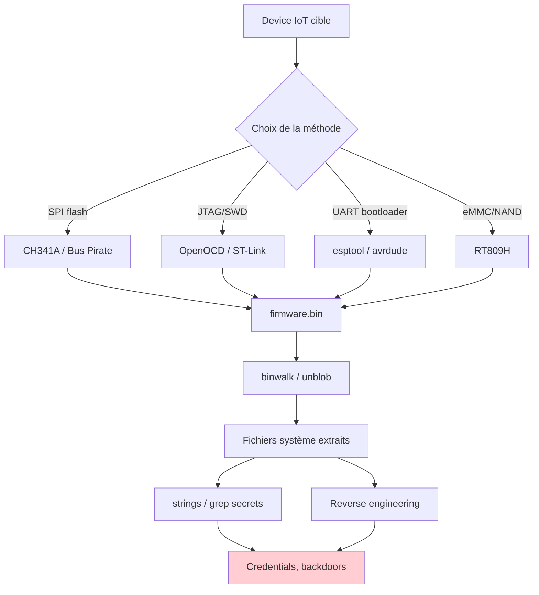
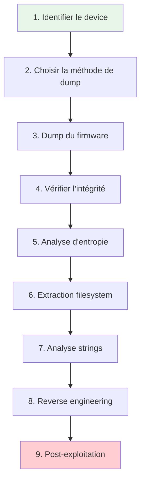
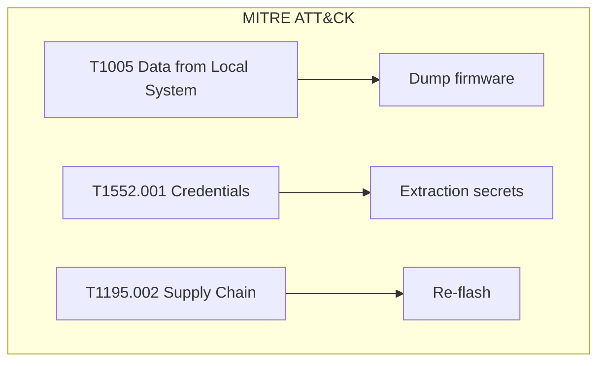
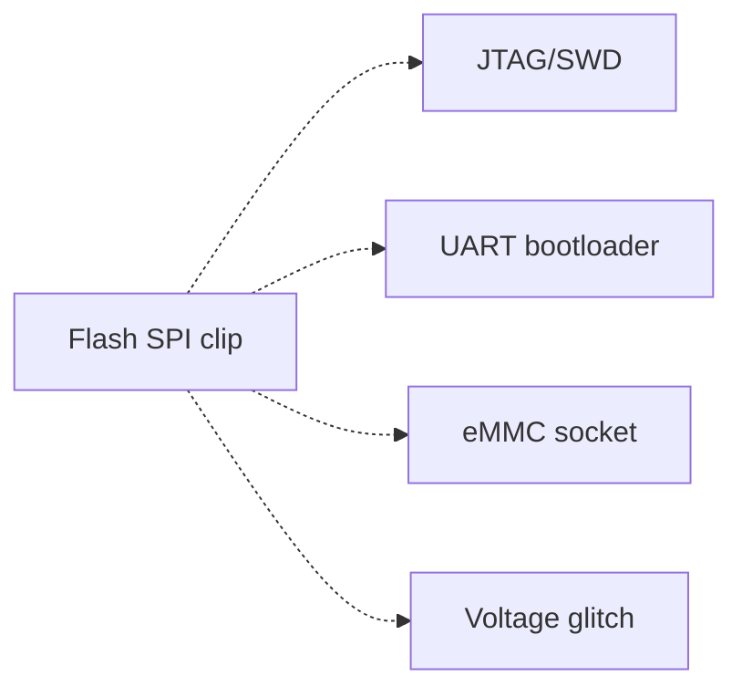

# Dump et Analyse de Firmware

> [!info] **En 1 phrase**
> Dumper le firmware = **récupérer tout le logiciel** d'un objet connecté depuis sa mémoire flash,
> puis l'analyser (strings, fichiers système, reverse) pour trouver **secrets, backdoors et RCE**.

---

## Overview

| Champ | Valeur |
|---|---|
| **Type** | Technique complète de dump + analyse |
| **Domaine** | Hardware Hacking / Firmware Reverse Engineering |
| **Niveau** | Beginner → Expert |
| **OS cibles** | Linux embedded, bare-metal, RTOS |
| **Matériel requis** | CH341A, Bus Pirate, RT809H, logic analyzer |
| **Complexité** | Moyenne → Élevée |
| **Dernière mise à jour** | 2025-08-14 |

> [!info] **Diagramme de contexte**
> ```mermaid
> flowchart LR
>     A["Dump firmware"] --> B["Extraction"]
>     B --> C["Analyse"]
>     C --> D["Secrets / RCE"]
>     style A fill:#e1f5fe
>     style D fill:#c8e6c9
> ```

---

## Concept

> Le dump de firmware consiste à extraire le contenu binaire de la mémoire flash d'un device IoT/embedded, puis à l'analyser pour en comprendre le fonctionnement, trouver des failles, extraire des secrets (credentials, clés), ou préparer une attaque (reverse shell, backdoor). C'est la pierre angulaire du pentest hardware.



> [!info] **Le plus gros secret se trouve souvent dans le bootloader / U-Boot** : `printenv` peut révéler serveurs, IP, chemins, parfois des mots de passe.

---

## Concepts fondamentaux

### Types de mémoire flash

| Type | Package | Capacité | Usage | Méthode dump |
|---|---|---|---|---|
| **NOR (SPI)** | SOIC-8 | 4-256 Mbit | Boot firmware | CH341A, Bus Pirate, flashrom |
| **NAND** | TSOP-48/BGA | 1-16 Gbit | Stockage massif | RT809H, JTAG |
| **eMMC** | BGA-153/162 | 4-256 Gbit | Stockage intégré | RT809H, ISP |
| **UFS** | BGA | 32-512 Gbit | Flash universelle | Programmeur UFS |
| **EEPROM** | SOIC-8/DIP-8 | 256 bit - 512 Kbit | Config, secrets | CH341A, I2C |

### Méthodes de dump

| Méthode | Outil | Quand | Difficulté |
|---|---|---|---|
| **Flash SPI NOR** | flashrom + CH341A | La plupart des IoT | Faible |
| **JTAG/SWD** | OpenOCD, avrdude | MCU avec debug accessible | Moyenne |
| **UART bootloader** | esptool.py | ESP8266/ESP32 | Faible |
| **eMMC socket** | RT809H | eMMC BGA soudée | Élevée |
| **Voltage glitch** | ChipWhisperer | Firmware protégé (RDP) | Très élevée |
| **ISP (In-System)** | RT809H | TV, DVR, moniteurs | Moyenne |

### Systèmes de fichiers embarqués

| Filesystem | Signature | Outil d'extraction |
|---|---|---|
| **SquashFS** | `sqsh`, `hsqs` | `unsquashfs -f -d out rootfs.squashfs` |
| **JFFS2** | `0x72b6` | `jefferson image.jffs2 -d out` |
| **YAFFS2** | `0x5941ff53` | `unyaffs image -d out` |
| **CramFS** | `0x28cd3d45` | `uncramfs` / 7zip |
| **UBIFS** | `0x06101831` | `ubi_reader` |
| **ROMFS** | `0x7275` | lecture directe |
| **CPIO** | `070707` | `cpio -idmv` |

### Formats de firmware

| Format | Signature | Description |
|---|---|---|
| Raw | - | Dump binaire brut de la flash |
| Intel HEX | `:` en début de ligne | Format Intel (longueur, offset, type) |
| Motorola SREC | `S` en début de ligne | Format Motorola |
| TI-TXT | `@` prefix | Format TI MSP430 |

---

## Matériel / Composants

### Outils principaux

| Outil | Type | Usage | Prix | Source |
|---|---|---|---|---|
| CH341A | Programmeur USB | Dump SPI/I2C | ~3 USD | AliExpress |
| Bus Pirate | Adaptateur USB | Dump SPI/I2C/UART | ~30 USD | Seeedstudio |
| RT809H | Programmeur ISP | Dump eMMC/NAND | ~30 USD | AliExpress |
| ST-Link V2 | Debug probe | Dump JTAG/SWD | ~5 USD | AliExpress |
| Clip SOIC-8 | Pince | Lecture in-circuit | ~3 USD | Divers |
| Logic analyzer | Capture signaux | Sniffing protocoles | ~5-100 USD | Divers |

### Cibles typiques

| Catégorie | Mémoire | Méthode dump | Contenu |
|---|---|---|---|
| Routeur IoT | SPI NOR (SOIC-8) | CH341A | Firmware Linux |
| Caméra IP | eMMC (BGA) | RT809H | Firmware + credentials |
| DVR | eMMC/NAND | RT809H | Firmware complet |
| ESP32/ESP8266 | Flash interne | esptool.py | Firmware FreeRTOS |
| Arduino | Flash AVR | avrdude + USBasp | Sketch .hex |
| Smart TV | eMMC (BGA) | RT809H | Firmware Android/Linux |

---

## Protocoles de dump

### SPI Flash (méthode reine)

| Paramètre | Valeur |
|---|---|
| **Outil** | flashrom |
| **Programmeur** | ch341a_spi, buspirate_spi |
| **Vitesse** | 1 MHz (sécurisé) → 8 MHz |
| **Voltage** | 3.3V (la plupart) |
| **Câblage** | CS, CLK, MOSI, MISO, GND |

### JTAG/SWD

| Paramètre | Valeur |
|---|---|
| **Outil** | OpenOCD, avrdude |
| **Interface** | ST-Link V2, J-Link |
| **Vitesse** | 1-8 MHz |
| **Câblage** | TMS/TCK/TDI/TDO ou SWDIO/SWCLK |

### UART Bootloader

| Paramètre | Valeur |
|---|---|
| **Outil** | esptool.py, avrdude, picotool |
| **Vitesse** | 115200-921600 baud |
| **Câblage** | TX, RX, GND (VCC optionnel) |
| **Condition** | Boot mode activé (GPIO toggle) |

---

## Installation / Setup

### Prérequis

| Composant | Version | Lien |
|---|---|---|
| flashrom | latest (v1.4+) | flashrom.org |
| binwalk | v3.1.0 | github.com/ReFirmLabs/binwalk |
| unblob | latest | github.com/onekey-sec/unblob |
| esptool.py | latest | github.com/espressif/esptool |
| OpenOCD | latest | openocd.org |
| Ghidra | latest | ghidra-sre.org |
| radare2 | latest | github.com/radareorg/radare2 |

### Installation des outils

```bash
# flashrom
sudo apt install flashrom

# binwalk v3 (Rust)
cargo install binwalk

# ou binwalk v2 (Python)
sudo apt install binwalk

# unblob (Docker)
docker pull ghcr.io/onekey-sec/unblob:latest

# esptool.py
pip install esptool

# OpenOCD
sudo apt install openocd

# Ghidra
wget https://github.com/NationalSecurityAgency/ghidra/releases/latest
# Installer selon la documentation

# radare2
git clone https://github.com/radareorg/radare2
cd radare2 && sys/install.sh
```

---

## Configuration

### Configuration flashrom

| Option | Valeur par défaut | Description |
|---|---|---|
| Programmer | ch341a_spi | Driver à utiliser |
| Speed | Auto | Vitesse SPI |
| Chip | Auto | Détection automatique |
| Length | Complet | Taille du dump |

### Configuration binwalk

| Option | Valeur par défaut | Description |
|---|---|---|
| Extraction | `-Me` | Extraction récursive |
| Entropie | `-E` | Graphique d'entropie |
| Signature | `-Y` | Identification d'architecture |

### Configuration esptool.py

| Option | Valeur par défaut | Description |
|---|---|---|
| Port | Auto-détection | Port COM/USB |
| Baud | 460800 | Vitesse de flashing |
| Flash mode | dio | Mode SPI flash |
| Flash size | 4MB | Taille de la flash |

---

## Commandes / Manipulations

### 1. Dump du firmware

```bash
# === SPI flash (la méthode reine) ===
# CH341A
sudo flashrom -p ch341a_spi -r dump.bin -c "MX25L6406E"

# Bus Pirate
sudo flashrom -p buspirate_spi:dev=/dev/ttyUSB0 -r dump.bin

# FT232H
sudo flashrom -p ft232h:type=232h -r dump.bin

# === JTAG/SWD (via OpenOCD) ===
# STM32
sudo openocd -f interface/stlink-v2-1.cfg -f target/stm32f1x.cfg -c "init; dump_image firmware.bin 0x08000000 0x10000; shutdown"

# nRF51
sudo openocd -f interface/stlink-v2-1.cfg -f target/nrf51.cfg -c "init; dump_image firmware.bin 0x0 0x40000; shutdown"

# === UART bootloader ===
# ESP8266/ESP32
esptool.py read_flash 0x0 0x400000 firmware.bin

# AVR (USBasp)
avrdude -p m328p -c usbasp -P /dev/ttyUSB0 -b 9600 -U flash:r:flash_raw.bin:r

# Raspberry Pi Pico
sudo ./picotool save --all -F /tmp/out.bin

# === Format Intel HEX → binaire ===
avr-objcopy -I ihex -O binary dump.hex dump.bin
```

### 2. Extraction & analyse rapide

```bash
# Entropie d'abord !
binwalk -E firmware.bin
# HAUTE entropie = chiffré ou compressé
# BASSE entropie = texte/code lisible

# binwalk (classique)
binwalk -Me firmware.bin

# unblob (plus robuste, en docker)
docker run --rm --pull always \
  -v $(pwd)/out:/data/output -v $(pwd):/data/input \
  ghcr.io/onekey-sec/unblob:latest /data/input/firmware.bin

# Extraire un chunk précis (dd)
dd if=firmware.bin of=firmware.chunk bs=1 skip=$((0x200)) count=$((0x400-0x200))
```

### 3. Reverse engineering

```bash
# Identifier l'archi automatiquement
binwalk -Y dump.elf

# ARM / Thumb (la majorité des IoT)
radare2 -A -a arm -b 32 firmware.bin

# AVR (Arduino)
radare2 -a avr /tmp/flash

# ESP32
esptool.py image_info firmware.bin
```

### 4. Rechercher les secrets

```bash
strings -n 6 firmware.bin | grep -iE 'pass|secret|key|token|api|auth'
strings -e l firmware.bin                # UTF-16
strings -tx firmware.bin | grep -i password   # avec offset hex

# Dans la racine extraite :
grep -rniE 'password|apikey|secret' /tmp/rootfs --include="*.conf" --include="*.sh" --include="*.py"
find /tmp/rootfs -name "*.pem" -o -name "*.key" -o -name "id_rsa*"
```

### 5. Repacker & reflasher

```bash
# Repacker le rootfs
mksquashfs squashfs-root newrootfs.img {options}
dd if=newrootfs.img of=dump.bin bs=1 seek=<offset> conv=notrunc

# Reflasher
flashrom -p ch341a_spi -w dump.bin
avrdude -p m328p -c usbasp -U flash:w:flash_raw.bin
esptool.py write_flash 0x0 firmware.bin
picotool load firmware.bin
```

---

## Exemples pratiques

### Débutant — Premier dump SPI avec CH341A

```bash
# 1. Identifier le chip flash (W25Q64, MX25L256…)
# 2. Connecter le clip SOIC-8 au CH341A
# 3. Brancher en USB
# 4. Détection :
sudo flashrom -V --programmer ch341a_spi
# 5. Dump complet :
sudo flashrom -V --programmer ch341a_spi -r dump.bin
# 6. Vérifier :
ls -la dump.bin
md5sum dump.bin
```

### Intermédiaire — Extraction complète avec binwalk

```bash
# 1. Dump du firmware
sudo flashrom -p ch341a_spi -r firmware.bin

# 2. Analyse d'entropie
binwalk -E firmware.bin
# Interpréter le graphique :
# - Entropie haute continue = chiffrement
# - Entropie haute par blocs = compression (LZMA, ZLIB)
# - Entropie basse = code/texte lisible

# 3. Extraction
binwalk -Me firmware.bin

# 4. Exploration du rootfs
cd _firmware.bin.extracted/
ls -la
find . -type f | head -50

# 5. Recherche de secrets
grep -rniE 'password|secret|key|api' ./squashfs-root/
find . -name "*.conf" -exec grep -l "pass" {} \;
```

### Avancé — Analyse complète avec reverse engineering

```bash
# 1. Dump et extraction
sudo flashrom -p ch341a_spi -r firmware.bin
binwalk -Me firmware.bin

# 2. Identifier l'architecture
binwalk -Y firmware.bin
# ARM executable code, 32-bit, little endian

# 3. Analyser le binaire principal
radare2 -A -a arm -b 32 squashfs-root/usr/bin/app
# Au prompt radare2 :
# afl    → lister les fonctions
# pdf @main → désassembler main
# / strings → rechercher des strings
# axt @sym.check_password → trouver les références

# 4. Ghidra pour une analyse plus profonde
# Importer le binaire "raw" avec l'architecture ARM 32-bit little endian
# Laisser Ghidra analyser automatiquement
# Identifier les fonctions de vérification de mot de passe
# Rechercher les appels réseau (connect, send, recv)
```

### Expert — Extraction avec bypass de protection

```python
#!/usr/bin/env python3
"""
Script expert : dump firmware avec bypass de protection RDP
via voltage glitching (ChipWhisperer)
"""
import chipwhisperer as cw
import time

def setup_glitcher():
    """Configurer le ChipWhisperer pour le voltage glitching"""
    scope = cw.scope()
    scope.default_setup()
    target = cw.target(scope)
    return scope, target

def glitch_and_read(scope, target, flash_addr=0x08000000, size=0x10000):
    """Tenter un glitch pendant la lecture de la flash"""
    # Configurer le glitch
    scope.glitch.clk_src = "clkgen"
    scope.glitch.output = "enable_only"
    scope.glitch.trigger_src = "ext_single"
    scope.glitch.width = 10
    scope.glitch.offset = 10
    scope.glitch.repeat = 1

    # Tenter la lecture avec des paramètres de glitch croissants
    for width in range(5, 50, 5):
        for offset in range(0, 30, 2):
            scope.glitch.width = width
            scope.glitch.offset = offset

            # Envoyer la commande de lecture
            target.simpleserial_write('r', flash_addr.to_bytes(4, 'big') + size.to_bytes(4, 'big'))
            response = target.simpleserial_read('r', size)

            if response and len(response) > 0:
                if not all(b == 0xFF for b in response):  # Pas de données vides
                    print(f"[+] Glitch réussi: width={width}, offset={offset}")
                    return response

    print("[-] Aucun glitch réussi")
    return None

# Exécution
scope, target = setup_glitcher()
data = glitch_and_read(scope, target)
if data:
    with open("firmware_glitch.bin", "wb") as f:
        f.write(data)
    print(f"[+] Firmware extrait: {len(data)} octets")
```

---

## Workflow complet (scénario pas à pas)



### Étape 1 — Identification

| Action | Commande | Résultat attendu |
|---|---|---|
| Identifier le chip flash | Inspection visuelle | W25Q, MX25L |
| Identifier le MCU/SoC | Top marking → datasheet | STM32, ESP32, Allwinner |
| Vérifier le debug port | Multimètre, LA | UART, JTAG exposés |

### Étape 2 — Méthode de dump

| Méthode | Outil | Quand |
|---|---|---|
| SPI flash clip | CH341A + flashrom | SOIC-8 accessible |
| JTAG/SWD | OpenOCD + ST-Link | Debug port exposé |
| UART bootloader | esptool.py | ESP8266/ESP32 |
| eMMC socket | RT809H | BGA, pas de clip |

### Étape 3 — Dump

Lancer la lecture, sauvegarder le dump brut, vérifier le checksum.

### Étape 4 — Vérification

Comparer deux dumps, vérifier la taille, analyser l'entropie.

### Étape 5 — Exploitation

Analyser le dump (binwalk, strings, reverse), extraire les secrets, documenter les findings.

---

## Scénarios avancés

### Scénario 1 — Dump complet d'un routeur compromis

| Élément | Détail |
|---|---|
| **Objectif** | Extraire et analyser le firmware complet d'un routeur pour trouver des backdoors |
| **Matériel** | CH341A, clip SOIC-8, logic analyzer, PC |
| **Étapes** | 1. Identifier W25Q128 → 2. Dump SPI (16MB) → 3. binwalk extraction → 4. Trouver U-Boot → 5. Extraire rootfs → 6. Trouver script de config avec credentials root |
| **Résultat** | Backdoor hardcoded dans le script de config |
| **Difficulté** | |


### Scénario 2 — Extraction firmware DVR avec bypass RDP

| Élément | Détail |
|---|---|
| **Objectif** | Extraire le firmware d'un DVR dont le MCU a la protection de lecture activée |
| **Matériel** | ChipWhisperer, ST-Link V2, préchauffeur, RT809H |
| **Étapes** | 1. Tenter JTAG → RDP bloquant → 2. Voltage glitch sur le bootloader → 3. Bypass RDP → 4. Dump complet → 5. Analyse |
| **Résultat** | Firmware complet malgré la protection |
| **Difficulté** | |

---

## Cybersecurity use cases

| Use case | Sévérité | Matériel requis | Impact |
|---|---|---|---|
| Extraction de credentials | Haute | CH341A, clip | Accès root |
| Détection de backdoors | Très haute | CH341A, Ghidra | Compromission complète |
| Analyse de firmware | Moyenne | CH341A | Compréhension du device |
| Audit d'intégrité | Moyenne | CH341A | Vérification sécurité |
| Récupération post-brick | Moyenne | CH341A, RT809H | Restauration |

| Phase pentest | Ce que permet cette technique |
|---|---|
| Recon | Identification du firmware et de l'architecture |
| Accès initial | Extraction de credentials, backdoors |
| Maintien d'accès | Re-flash avec firmware modifié |
| Post-exploitation | Extraction de clés, analyse forensique |
| Évasion | Modification de la config réseau |

---

## MITRE ATT&CK

| Technique ID | Nom | Catégorie | Applicabilité |
|---|---|---|---|
| T1005 | Data from Local System | Collection | Dump firmware complet |
| T1552.001 | Credentials In Files | Credential Access | Extraction credentials |
| T1083 | File and Directory Discovery | Discovery | Exploration filesystem |
| T1195.002 | Supply Chain Compromise | Initial Access | Re-flash firmware |
| T1592 | Gather Victim Host Info | Recon | Analyse firmware |



### Mapping détaillé

| Phase MITRE | Technique | Cette fiche couvre |
|---|---|---|
| Recon | T1592 Gather Victim Host Info | Identification firmware |
| Collection | T1005 Data from Local System | Dump complet |
| Credential Access | T1552.001 Credentials in Files | Extraction secrets |
| Initial Access | T1195.002 Supply Chain | Re-flash |

---

## Defensive Security

### Détection

| Signal de détection | Source | Fiabilité |
|---|---|---|
| Connexion physique (CH341A) | Logs USB | Élevée |
| Lecture de la flash | GPIO monitoring | Moyenne |
| Firmware modifié | Integrity check | Élevée |

| Indicateur | Log / Capteur | Seuil d'alerte |
|---|---|---|
| Nouveau device USB | dmesg | Tout nouveau device |
| Flash lue | SPI monitoring | Tout accès |
| Firmware modifié | Secure boot | Tout changement |

### Prévention

| Mesure | Efficacité | Coût | Priorité |
|---|---|---|---|
| Secure boot | Très élevée | Moyenne | Haute |
| Chiffrement flash | Très élevée | Faible | Haute |
| RDP (Read Protection) | Élevée | Faible | Haute |
| JTAG disable | Élevée | Faible | Haute |
| Anti-glitch | Moyenne | Moyenne | Moyenne |

### Durcissement (hardening)

```bash
# Activer le secure boot (ESP32)
esptool.py --port COM3 burn_efuse SECURE_BOOT

# Chiffrer la flash (ESP32)
esptool.py --port COM3 encrypt_flash --flash_mode dio

# Activer RDP (STM32)
openocd -f interface/stlink.cfg -c "stm32f1x.lock 0"

# Désactiver JTAG (ESP32)
esptool.py --port COM3 burn_efuse JTAG_DISABLE
```

---

## Automatisation

### Scripts d'exploitation

```python
#!/usr/bin/env python3
"""Script d'automatisation : dump et analyse firmware"""
import subprocess
import hashlib
import os

PROGRAMMER = "ch341a_spi"
DUMP_DIR = "/dumps"

def dump_firmware(chip_name=None):
    """Dump complet de la flash"""
    os.makedirs(DUMP_DIR, exist_ok=True)
    output = f"{DUMP_DIR}/dump_{hashlib.md5(str(os.urandom(8)).encode()).hexdigest()[:8]}.bin"
    cmd = ["flashrom", "-p", PROGRAMMER, "-r", output]
    if chip_name:
        cmd.extend(["-c", chip_name])
    subprocess.run(cmd, check=True)
    return output

def analyze_entropy(dump_file):
    """Analyse d'entropie"""
    result = subprocess.run(
        ["binwalk", "-E", dump_file],
        capture_output=True, text=True
    )
    return result.stdout

def extract_firmware(dump_file):
    """Extraction du firmware"""
    subprocess.run(["binwalk", "-Me", dump_file], check=True)
    extract_dir = f"_{os.path.basename(dump_file)}.extracted"
    return extract_dir

def find_secrets(extract_dir):
    """Rechercher des secrets"""
    result = subprocess.run(
        ["grep", "-rniE", "password|secret|key|token|api", extract_dir],
        capture_output=True, text=True
    )
    return result.stdout.splitlines()

# Exécution
dump = dump_firmware()
print(f"[+] Dump: {dump}")
print(f"[+] MD5: {hashlib.md5(open(dump, 'rb').read()).hexdigest()}")

entropy = analyze_entropy(dump)
print(f"[*] Entropie:\n{entropy}")

extracted = extract_firmware(dump)
secrets = find_secrets(extracted)
print(f"[+] Secrets trouvés: {len(secrets)}")
for s in secrets[:20]:
    print(f"  {s}")
```

### Outils d'automatisation

| Outil | Usage | Lien |
|---|---|---|
| flashrom | Dump SPI | flashrom.org |
| binwalk | Extraction firmware | github.com/ReFirmLabs/binwalk |
| unblob | Extraction robuste | github.com/onekey-sec/unblob |
| Ghidra | Reverse engineering | ghidra-sre.org |
| radare2 | Reverse engineering | github.com/radareorg/radare2 |

### Intégration dans des frameworks

| Framework | Méthode d'intégration |
|---|---|
| Metasploit | Module custom pour dump |
| Custom framework | Pipeline dump → analyse |
| Forensics toolkit | Analyse forensique firmware |

---

## Output et parsing

### Formats de sortie

| Format | Exemple | Utilité |
|---|---|---|
| Binary | firmware.bin | Dump brut |
| Extracted filesystem | squashfs-root/ | Fichiers système |
| Entropie | Graphique PNG | Visualisation |
| Strings | dump_strings.txt | Recherche de secrets |

### Parsing des résultats

```bash
# Analyse rapide
binwalk -Me firmware.bin
strings -n 6 firmware.bin | grep -iE 'pass|key|token'
grep -rniE 'password|secret' _firmware.bin.extracted/

# Export des résultats
strings firmware.bin > strings_full.txt
grep -iE 'pass|key|token' strings_full.txt > secrets.txt
```

### Intégration SIEM / Logging

| Source | Format | Pipeline |
|---|---|---|
| Dump firmware | Binary | Stockage sécurisé |
| Analyse | JSON/Texte | Pipeline → SIEM |
| Secrets trouvés | JSON | Alerte → SIEM |

---

## Intégrations

- [[13 - Hardware & IoT| Hardware & IoT]] global
- [[Hardware - CH341A| CH341A]] pour les dumps SPI
- [[Hardware - Bus Pirate| Bus Pirate]] pour les dumps multi-protocole
- [[Hardware - Memory Programmer| Memory Programmer]] pour eMMC/NAND
- [[Hardware - Logic Analyzer| Logic Analyzer]] pour le sniffing
- [[Hardware - JTAG et SWD| JTAG/SWD]] pour le debug
- [[Hardware - UART| UART]] pour la console

| Outils associés | Usage complémentaire |
|---|---|
| CH341A | Dump SPI NOR |
| Bus Pirate | Dump multi-protocole |
| RT809H | Dump eMMC/NAND |
| OpenOCD | Debug JTAG/SWD |

| Intégration | Comment |
|---|---|
| flashrom | Driver pour CH341A, Bus Pirate |
| binwalk | Extraction firmware |
| Ghidra | Reverse engineering |

---

## Alternatives

| Alternative | Avantages | Inconvénients | Cas d'usage |
|---|---|---|---|
| Download OTA | Pas de hardware | Pas disponible si pas d'API | Mise à jour officielle |
| UART bootloader | Pas de dessoudage | Limité aux MCU supportés | ESP32, Arduino |
| JTAG/SWD | Accès complet MCU | Nécessite debug port | MCU non protégés |
| Voltage glitch | Bypass RDP | Très complexe | MCU protégés |



---

## Performance

| Métrique | Valeur | Impact |
|---|---|---|
| Vitesse dump SPI | ~1 MB/s (CH341A) | Lent pour 16MB |
| Vitesse dump JTAG | ~500 KB/s | Moyen |
| Vitesse binwalk | Variable | Dépend du firmware |
| Taille dump typique | 1-16 MB | Stockage |
| Temps analyse | 5-30 minutes | Variable |

### Optimisations

| Technique | Gain | Complexité |
|---|---|---|
| Dump partiel (header) | -90% temps | Faible |
| Parallélisation | -50% temps | Moyenne |
| Cache de lectures | +rapidité | Moyenne |
| Extraction sélective | -70% temps | Faible |

---

## Troubleshooting

| Problème | Cause probable | Solution |
|---|---|---|
| flashrom ne détecte rien | Mauvais contact | Vérifier clip, réduire spispeed |
| binwalk extraction vide | Firmware chiffré | Chercher la clé ailleurs |
| binwalk extraction partielle | Signatures manquantes | Utiliser unblob |
| GID ou RDP actif | Protection MCU | Voltage glitch ou bootloader |
| Dump corrompu | Contacts instables | Relire, comparer 2 dumps |

### Erreurs courantes

```
Erreur : "No EEPROM/flash chip detected"
Cause : Mauvais contact clip
Solution : Re-positionner, nettoyer, spispeed=1M

Erreur : "binwalk: no matches found"
Cause : Firmware chiffré ou format inconnu
Solution : Analyser l'entropie, chercher la clé

Erreur : "Read verification failed"
Cause : Contact instable
Solution : Relire, comparer hashes
```

### Diagnostic

```bash
# Vérifier le dump
md5sum dump.bin
ls -la dump.bin
binwalk -E dump.bin

# Vérifier les signatures
binwalk dump.bin

# Vérifier l'architecture
binwalk -Y dump.bin
```

---

## Sécurité

| Risque | Impact | Mitigation |
|---|---|---|
| Données extraites non sécurisées | Élevé | Chiffrer les dumps |
| Re-flash dangereux | Critique (brick) | Backup original |
| Exposition de secrets | Élevé | Chaîne de custody |

> [!warning] Points de sécurité
> - **Entropie haute ≠ forcément chiffré** : un firmware peut être compressé (LZMA) → encore extractible. Un vrai chiffrement (AES) reste un mur → cherche la clé ailleurs (JTAG, strings dans un autre dump, serveur de maj).
> - **Le plus gros secret se trouve souvent dans le bootloader / U-Boot** : `printenv` peut révéler serveurs, IP, chemins, parfois des mots de passe.
> - **Compare deux versions de firmware** (`binwalk`, `diff`) : la version suivante peut corriger un secret... ou en ajouter.
> - **Les mises à jour OTA** (sur-écriture à chaud) sont des cibles : intercepte-les (MITM) pour récupérer le firmware officiel.
> - **Une flash SPI peut être lue SANS dessouder** avec une clip SOIC-8 (si l'espace le permet).

### Restrictions légales

> [!danger] Cadre légal
> Le dump de firmware est légal sur du matériel que vous possédez. L'analyse et la modification de firmware tiers sans autorisation peut constituer une atteinte à la propriété intellectuelle.

---

## Limitations

| Limite | Impact | Contournement |
|---|---|---|
| Firmware chiffré | Dump illisible | Chercher la clé (JTAG, serveur) |
| RDP/Secure Boot actif | Pas de dump SWD | Voltage glitch, bootloader |
| BGA encapsulé | Pas d'accès physique | X-ray, FIB |
| Taille de dump | Limité par la mémoire du LA | Dump par morceaux |

### Cas où cette technique ne fonctionne pas

| Scénario | Raison |
|---|---|
| Firmware chiffré (AES-256) | Pas de clé |
| Secure boot + chiffrement | Double protection |
| Chip mort | Pas de réponse |
| Flash sans interface externe | Pas de bus accessible |

---

## Cheatsheet

```
┌─────────────────────────────────────────────┐
│ Dump & Analyse Firmware — Cheatsheet        │
├─────────────────────────────────────────────┤
│ SPI dump :  flashrom -p ch341a_spi -r dump  │
│ JTAG dump : openocd ... dump_image          │
│ ESP dump :  esptool.py read_flash           │
│ AVR dump :  avrdude -U flash:r:dump         │
│ Entropie :  binwalk -E firmware.bin         │
│ Extract :   binwalk -Me firmware.bin        │
│ Unblob :    docker run ... unblob firmware   │
│ Strings :   strings -n 6 dump | grep -iE    │
│ Secrets :   grep -rniE 'pass|key' rootfs/   │
│ Reverse :   radare2 -A -a arm -b 32 bin     │
│ Repack :    mksquashfs rootfs new.img       │
│ Reflash :   flashrom -p ch341a_spi -w fw    │
└─────────────────────────────────────────────┘
```

| Action | Commande |
|---|---|
| Dump SPI | `flashrom -p ch341a_spi -r dump.bin` |
| Dump JTAG | `openocd -f ... -c "dump_image fw.bin 0x08000000 0x10000"` |
| Dump ESP | `esptool.py read_flash 0x0 0x400000 firmware.bin` |
| Entropie | `binwalk -E firmware.bin` |
| Extraction | `binwalk -Me firmware.bin` |
| Secrets | `grep -rniE 'password\|secret' rootfs/` |
| Reverse | `radare2 -A -a arm -b 32 firmware.bin` |
| Repack | `mksquashfs squashfs-root new.img` |
| Reflash | `flashrom -p ch341a_spi -w firmware.bin` |

---

## Quick reference

| Élément | Valeur / Commande |
|---|---|
| **Fonction** | Extraction et analyse de firmware |
| **Méthode reine** | SPI flash + flashrom |
| **Outils clés** | flashrom, binwalk, Ghidra, radare2 |
| **Baud UART** | 115200 (défaut) |
| **Voltage flash** | 3.3V (la plupart) |
| **Commande rapide** | `flashrom -p ch341a_spi -r dump.bin && binwalk -Me dump.bin` |

---

## Détection & Défense

| Signal | Méthode de détection | Outil |
|---|---|---|
| Connexion CH341A | USB monitoring | dmesg |
| Lecture flash | GPIO monitoring | Logic analyzer |
| Firmware modifié | Integrity check | Secure boot |

| Countermeasure | Efficacité | Implémentation |
|---|---|---|
| Secure boot | Très élevée | Chain of trust |
| Chiffrement flash | Très élevée | AES-256 |
| RDP | Élevée | eFuse / config |
| Anti-glitch | Moyenne | Hardware sensors |

> [!tip] Défense
> La meilleure défense est le **secure boot** + **chiffrement flash** + **désactivation des ports debug**. Sans ces protections, un attaquant avec un accès physique peut extraire et analyser le firmware en quelques heures.

---

## Tips & Pièges

- **Piège 1** : **Entropie haute ≠ forcément chiffré** — un firmware peut être compressé (LZMA) → encore extractible. Un vrai chiffrement (AES) reste un mur.
- **Piège 2** : **Compare deux dumps** pour valider l'extraction (contacts de clip instables).
- **Astuce 1** : **binwalk -E** en premier — le graphique d'entropie vous dit si le firmware est lisible ou chiffré.
- **Astuce 2** : **unblob** est plus robuste que binwalk pour l'extraction (signatures plus complètes).
- **Astuce 3** : Les **mises à jour OTA** sont des cibles : intercepte-les (MITM) pour récupérer le firmware officiel.
- **Bonne pratique** : Toujours sauvegarder le dump brut dans un emplacement sécurisé avant analyse.

> [!tip] Astuces
> - La commande `strings -n 6 firmware.bin | grep -iE 'pass|key|token'` est souvent la plus révélatrice
> - Les **U-Boot environment variables** contiennent souvent des informations utiles
> - **Ghidra** est gratuit et plus puissant que radare2 pour le reverse engineering

---

## References

> [!info] **Sources**
> - [HardwareAllTheThings — Firmware Dumping](https://github.com/swisskyrepo/HardwareAllTheThings/blob/main/docs/firmware/firmware-dumping.md)
> - [HardwareAllTheThings — Firmware Reverse Engineering](https://github.com/swisskyrepo/HardwareAllTheThings/blob/main/docs/firmware/firmware-reverse-engineering.md)
> - [binwalk — GitHub](https://github.com/ReFirmLabs/binwalk)
> - [unblob — GitHub](https://github.com/onekey-sec/unblob)
> - [flashrom — Documentation](https://www.flashrom.org)

### Documentation officielle

| Source | URL | Type |
|---|---|---|
| flashrom | https://www.flashrom.org | Outil de dump |
| binwalk | https://github.com/ReFirmLabs/binwalk | Extraction firmware |
| unblob | https://github.com/onekey-sec/unblob | Extraction robuste |
| Ghidra | https://ghidra-sre.org | Reverse engineering |
| radare2 | https://github.com/radareorg/radare2 | Reverse engineering |

### Vidéos / Tutorials

| Titre | Auteur | Lien |
|---|---|---|
| Firmware Analysis with binwalk | Various | YouTube |
| Ghidra for Embedded | Various | YouTube |
| ESP32 Firmware Dump | Various | YouTube |

### Livres / Articles

| Titre | Auteur | Année |
|---|---|---|
| Hardware Hacking Handbook | Jasper van Woudenberg, Colin O'Flynn | 2021 |
| Practical IoT Hacking | Chantzis et al. | 2021 |
| The IoT Hacker's Handbook | Aditya Gupta | 2019 |

---

**Liens :** [[13 - Hardware & IoT| Hardware & IoT]] · [[Hardware - JTAG et SWD| JTAG/SWD]] · [[Hardware - UART| UART]] · [[Hardware - CH341A| CH341A]]
