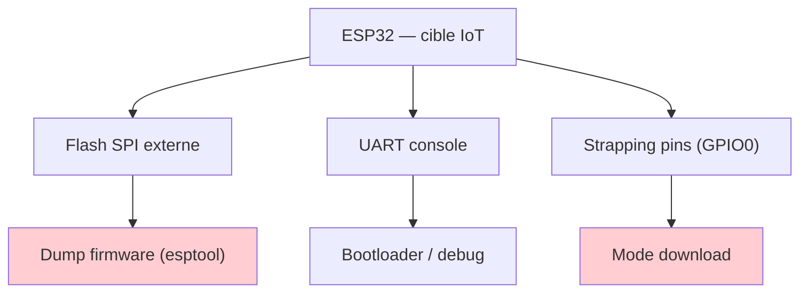
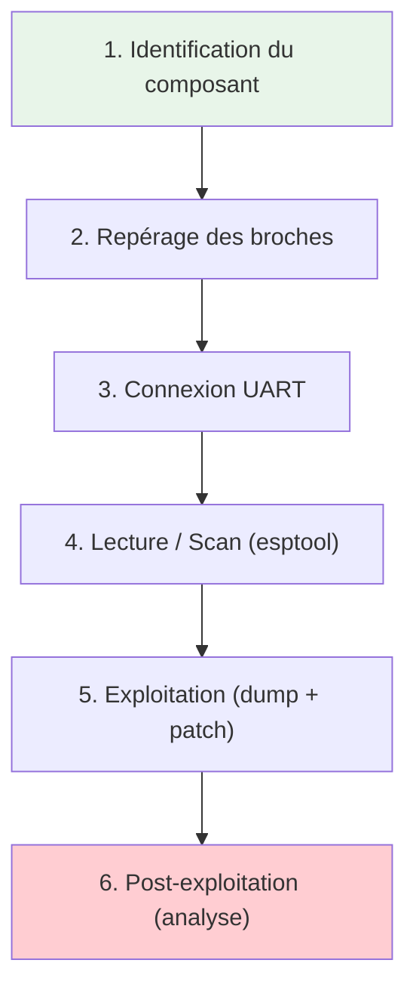
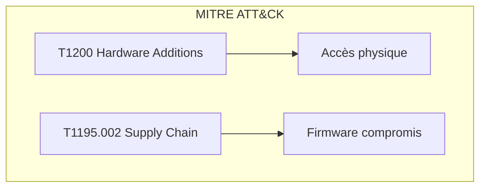
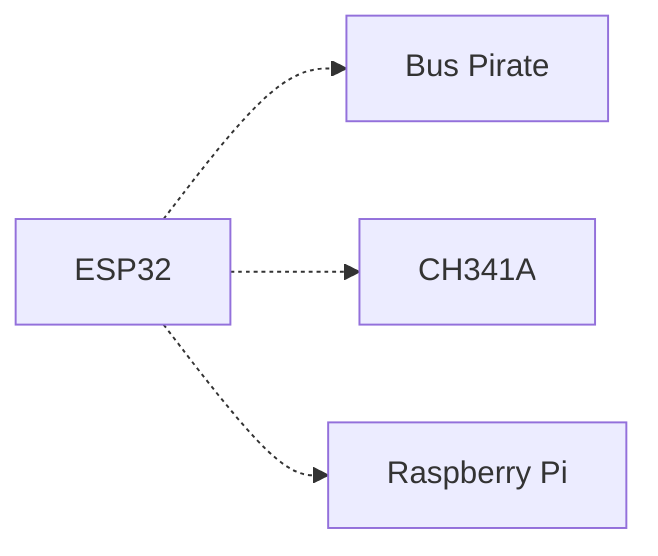

# 🔌 ESP32

> [!info] **En 1 phrase**
> L'**ESP32** est le microcontrôleur WiFi/Bluetooth le plus répandu de l'Internet des
> objets : **console UART de debug**, **bootloader récupérable**, **JTAG** et **flash SPI
> dumpable** en font la cible idéale pour débuter en hardware hacking.

---

## 🧾 Overview

| Champ | Valeur |
|---|---|
| **Type** | Microcontrôleur WiFi/BLE |
| **Domaine** | Hardware Hacking / IoT |
| **Niveau** | Beginner → Expert |
| **OS cibles** | FreeRTOS, ESP-IDF, bare-metal, MicroPython |
| **Matériel requis** | ESP32 DevKit, câble USB-UART (CP2102/CH340), PC |
| **Complexité** | Faible → Élevée |
| **Dernière mise à jour** | 2026-08-16 |

> [!info] 📊 **Diagramme de contexte**
> ```mermaid
> flowchart LR
>     A["ESP32 DevKit"] --> B["UART / JTAG / SPI"]
>     B --> C["Firmware / Flash"]
>     C --> D["Dump & Reverse Engineering"]
>     style A fill:#e1f5fe
>     style D fill:#c8e6c9
> ```

---

## 🎯 Concept

L'ESP32 est un microcontrôleur Espressif intégrant WiFi 2.4 GHz et Bluetooth. C'est à la fois une **cible** (IoT embarquant massivement des ESP32) et un **outil** (ESP32Marauder, attaques WiFi). Sa flash SPI externe contient le firmware, ses pins UART exposent la console de debug, et ses strapping pins contrôlent le mode de boot.



---

## 🧠 Concepts fondamentaux

### Xtensa LX6 / RISC-V

L'ESP32 original utilise un **dual-core Xtensa LX6** à 240 MHz. Les séries C/H utilisent **RISC-V** (open-source). Dans Ghidra, sélectionner `Tensilica Xtensa 32-bit little-endian`.

| Terme | Définition |
|---|---|
| **Xtensa** | Architecture processeur configurable Espressif (Tensilica/Cadence) |
| **RISC-V** | Architecture open-source des séries C et H |
| **eFuse** | Mémoire non-volatile programmable une seule fois (sécurité) |
| **Strapping pin** | GPIO dont l'état au reset détermine le mode de boot |

### Flash SPI externe

Le firmware réside sur une **NOR Flash SPI externe** (4-16 MB). C'est cette flash qui est lue/écrite par `esptool` et dumpée pour le reverse engineering.


---

## 🔌 Matériel / Composants

### Outils principaux

| Outil | Type | Usage | Prix | Source |
|---|---|---|---|---|
| ESP32 DevKit V1 | Carte dev | Cible / outil | ~5-15€ | Espressif |
| CP2102 USB-UART | Adaptateur série | Console UART / flash | ~3-8€ | Silicon Labs |
| CH340 USB-UART | Adaptateur série | Console UART (low-cost) | ~2-5€ | WCH |
| ST-LINK v2 | Débogueur SWD | JTAG/OpenOCD | ~5-10€ | STMicroelectronics |

### Cibles typiques

| Catégorie | Exemples | Protocoles | Vulnérabilités |
|---|---|---|---|
| Caméras IP | Caméras WiFi grand public | HTTP, RTSP, MQTT | Firmware en clair, credentials |
| Domotique | Prises connectées, capteurs | MQTT, CoAP | UART exposé, pas de secure boot |
| Wearables | Montres, trackers BLE | BLE, WiFi | Dump flash, clés BLE exposées |

### Variantes ESP32 (2026)

| Variant | Architecture | Cœurs | Freq | RAM | WiFi | BT | Zigbee/Thread | GPIO |
|---|---|---|---|---|---|---|---|---|
| ESP32 (original) | Xtensa LX6 | 2 | 240 MHz | 520 KB | WiFi 4 | Classic+BLE 4.2 | Non | 34 |
| ESP32-S2 | Xtensa LX7 | 1 | 240 MHz | 320 KB | WiFi 4 | Aucun | Non | 43 |
| ESP32-S3 | Xtensa LX7 | 2 | 240 MHz | 512 KB | WiFi 4 | BLE 5.0 | Non | 45 |
| ESP32-C3 | RISC-V | 1 | 160 MHz | 400 KB | WiFi 4 | BLE 5.0 | Non | 22 |
| ESP32-C6 | RISC-V | 1 | 160 MHz | 512 KB | WiFi 6 | BLE 5.3 | Oui | 30 |
| ESP32-H2 | RISC-V | 1 | 96 MHz | 320 KB | Aucun | BLE 5.0 | Oui | 19 |
| ESP32-P4 | RISC-V | 2 | 400 MHz | 768 KB | Aucun | Aucun | Non | — |

> [!note] À vérifier
> Les spécifications RAM/Flash varient selon les modules (WROOM, WROVER). Vérifier la datasheet du module spécifique.

### Pinout et broches utiles

| Broche | Rôle |
|---|---|
| **TX (GPIO1) / RX (GPIO3)** | UART0 → console de debug |
| **GPIO0** | Strapping : GND au boot = mode download |
| **GPIO2 / GPIO12 (MTDI)** | Strapping de boot + pull-up JTAG |
| **EN** | Reset / enable |
| **GPIO12-15** | JTAG (TMS, TCK, TDI, TDO) |
| **3V3 / GND** | Alimentation |

### Modes de boot (strapping pins)

```text
GPIO0 = 1 au reset (pull-up) → boot normal (exécute la flash)
GPIO0 = 0 au reset → mode téléchargement UART (esptool)
Le mode download est actif en maintenant BOOT pendant le reset
Console UART à 115200 bauds pour le flash et le debug
```

---

## ⚡ Protocoles

### Comparaison des protocoles

| Protocole | Vitesse | Complexité | Sécurité | Usage typique |
|---|---|---|---|---|
| UART | 115200 bauds | Faible | Aucune | Console debug, flash |
| SPI | 80 MHz | Moyenne | Aucune | Flash firmware |
| JTAG | Variable | Élevée | Modérée | Debug, breakpoints |
| I2C | 400 kHz | Faible | Aucune | Capteurs, EEPROM |

---

## 🛠️ Installation / Setup

### Prérequis

| Composant | Version | Lien |
|---|---|---|
| Python | 3.8+ | https://python.org |
| esptool | 4.x | https://github.com/espressif/esptool |
| esp32knife | Latest | https://github.com/jmswrnr/esp32knife |
| ampy | Latest | https://github.com/scientifichackers/ampy |

### Connexion physique

```
PC ──── USB-UART (CP2102/CH340) ──── ESP32 DevKit
│                                    │
│  TX  ──────────────────────────── RX (GPIO3)
│  RX  ──────────────────────────── TX (GPIO1)
│  GND ──────────────────────────── GND
│  3V3 ──[NE PAS BRANCHER]────────── 3V3
```

### Outils logiciels

```bash
pip install esptool
esptool.py version
pip install adafruit-ampy
```

---

## ⚙️ Configuration

### Paramètres du logiciel d'interfaçage

| Option | Valeur par défaut | Description |
|---|---|---|
| Baud rate | 115200 | Vitesse console UART |
| Flash mode | DIO | Mode de flash |
| Flash size | Detect | Taille auto-détectée |
| Flash freq | 40m | Fréquence bus flash |

### Adaptateurs compatibles

| Adaptateur | Interface | Voltage | Note |
|---|---|---|---|
| CP2102 | USB-UART | 3.3V/5V | Recommandé |
| CH340 | USB-UART | 3.3V/5V | Low-cost |
| FT232H | USB multi-protocole | 3.3V | Polyvalent |
| ST-LINK v2 | SWD/JTAG | 3.3V | Pour OpenOCD |

---

## ⌨️ Commandes / Manipulations

### Commandes essentielles

| Commande | Description | Exemple |
|---|---|---|
| `esptool.py flash_id` | Identifier le chip | `esptool -p COM7 flash_id` |
| `esptool.py read_flash` | Dumper la flash | `esptool read_flash 0 0x400000 out.bin` |
| `esptool.py write_flash` | Écrire un firmware | `esptool write_flash 0x10000 fw.bin` |
| `esptool.py erase_flash` | Effacer la flash | `esptool erase_flash` |

### Lecture / Écriture

```bash
# Dumper la flash (4 Mo)
esptool -p COM7 -b 115200 read_flash 0 0x400000 flash.bin

# Flasher un firmware complet
esptool.py -p /dev/ttyUSB0 -b 460800 --chip esp32 write_flash \
  --flash_mode dio --flash_size 2MB --flash_freq 40m \
  0x1000 bootloader.bin 0x8000 partition.bin 0x10000 app.bin

# Disséquer le firmware
python esp32knife.py --chip=esp32 load_from_file ./flash.bin

# Patcher puis ré-flasher
python esp32fix.py --chip=esp32 app_image ./patched.factory
esptool -p COM7 write_flash 0x10000 ./patched.factory.fixed
```

### Shell / Console

```bash
screen /dev/ttyUSB0 115200
minicom -D /dev/ttyUSB0 -b 115200
ampy --port /dev/ttyUSB0 put script.py
ampy --port /dev/ttyUSB0 run main.py
```

---

## 🧪 Exemples pratiques

### 🟢 Débutant — Lecture du chip ID

```bash
# Mettre en mode download (BOOT + RESET)
esptool.py -p /dev/ttyUSB0 flash_id
# Sortie : Chip ID, Flash size, Flash mode
```

### 🟡 Intermédiaire — Dump + analyse de credentials

```bash
#!/bin/bash
PORT="/dev/ttyUSB0"
esptool.py -p $PORT read_flash 0 0x400000 dump.bin
strings dump.bin | grep -iE "(password|key|token|secret|http|mqtt)"
```

### 🔴 Avancé — Extraction de secrets

```python
#!/usr/bin/env python3
"""Extraction de credentials depuis un dump flash ESP32"""
import sys, re

with open(sys.argv[1], "rb") as f:
    data = f.read()

patterns = {
    "WiFi": rb"[\x20-\x7e]{3,32}\x00",
    "MQTT": rb"mqtt://[\x20-\x7e]+",
    "HTTP": rb"https?://[\x20-\x7e]+",
    "API Key": rb"[A-Za-z0-9]{32,64}",
}
for name, pat in patterns.items():
    matches = re.findall(pat, data)
    if matches:
        print(f"[+] {name}: {len(matches)} trouvé(s)")
        for m in matches[:5]:
            print(f"    {m.decode('utf-8', errors='replace')}")
```

### ⚫ Expert — Bypass Secure Boot v2 via voltage glitching

```text
Scénario : Secure Boot v2 activé (efuses programmés).
1. Identifier le point de vérification de signature dans le ROM
2. Utiliser un ChipWhisperer pour injecter un pulse de tension
3. Le processeur "saute" la vérification de signature
4. Flasher un bootloader modifié via JTAG

> [!warning] Nécessite du matériel spécialisé (ChipWhisperer, oscilloscope).
```

---

## 🧪 Workflow complet (scénario pas à pas)



### Étape 1 — Identification

| Action | Commande | Résultat attendu |
|---|---|---|
| Identifier le chip | `esptool.py flash_id` | Chip ID, flash size |
| Lister les ports | `ls /dev/ttyUSB*` | Port série trouvé |

### Étape 2 — Repérage des broches

| Méthode | Difficulté | Fiabilité |
|---|---|---|
| Inspection visuelle du PCB | Faible | Élevée |
| Recherche du label/module | Faible | Élevée |
| Datasheet du module | Faible | Élevée |

### Étape 3 — Connexion

```text
Brancher TX, RX, GND. Ne JAMAIS brancher VCC depuis l'adaptateur UART.
Appuyer sur BOOT puis RESET pour entrer en mode download.
```

### Étape 4 — Exploitation

```bash
esptool.py -p COM7 read_flash 0 0x400000 flash_dump.bin
binwalk flash_dump.bin
strings flash_dump.bin | head -100
```

### Étape 5 — Post-exploitation

```bash
strings flash_dump.bin | grep -iE "password|key|token|secret"
strings flash_dump.bin | grep -E "https?://"
python esp32knife.py --chip=esp32 load_from_file flash_dump.bin
```

---

## 🎬 Scénarios avancés

### Scénario 1 — Clonage WiFi via firmware dump

| Élément | Détail |
|---|---|
| **Objectif** | Extraire les credentials WiFi d'un routeur IoT |
| **Matériel** | USB-UART bridge, PC |
| **Étapes** | Identifier pads UART → Connecter TX/RX/GND → Dump flash → Extraire credentials |
| **Résultat** | SSID et mot de passe WiFi en clair |
| **Difficulté** | ⭐⭐ |


### Scénario 2 — Injection de firmware malveillant

| Élément | Détail |
|---|---|
| **Objectif** | Injecter un reverse shell via firmware modifié |
| **Matériel** | PC, câble USB-UART |
| **Étapes** | Dump original → Analyser (binwalk) → Compiler firmware backdoor → Patcher partitions → Flasher → Capturer shell |
| **Résultat** | Accès shell distant |
| **Difficulté** | ⭐⭐⭐⭐ |

---

## 🛡️ Cybersecurity use cases

| Use case | Sévérité | Matériel requis | Impact |
|---|---|---|---|
| Dump firmware (reverse engineering) | Élevée | USB-UART, PC | Récupération de secrets |
| Injection firmware malveillant | Critique | USB-UART, PC | Contrôle total du device |
| Attaque WiFi (evil twin, deauth) | Élevée | ESP32 + Marauder | Interceptation trafic |
| Clonage BLE | Moyenne | ESP32-S3 | Usurpation d'identité BLE |

| Phase pentest | Ce que permet cette technique |
|---|---|
| Recon | Identification du SoC, scan ports UART |
| Accès initial | Flash firmware backdoor via UART |
| Maintien d'accès | Firmware persistant, reverse shell WiFi |
| Évasion | Désactivation des logs via firmware |

---

## 🎯 MITRE ATT&CK

| Technique ID | Nom | Catégorie | Applicabilité |
|---|---|---|---|
| T1200 | Hardware Additions | Initial Access | Device ESP32 compromis |
| T1195.002 | Supply Chain Compromise | Initial Access | Firmware ESP32 modifié |
| T1059.001 | Scripting Interpreter | Execution | MicroPython sur ESP32 |
| T1005 | Data from Local System | Collection | Extraction données flash |



### Mapping détaillé

| Phase MITRE | Technique | Cette fiche couvre |
|---|---|---|
| Initial Access | T1200 | Connexion UART physique |
| Execution | T1059.001 | MicroPython, esptool |
| Collection | T1005 | Dump de la flash |
| Persistence | T1542 | Bootloader modifié |
| Defense Evasion | T1027 | Firmware chiffré |

---

## 🛡️ Defensive Security

### Détection

| Signal de détection | Source | Fiabilité |
|---|---|---|
| Connexion UART inattendue | Logs console | Élevée |
| Flash modifiée (hash) | Boot verification | Élevée |
| Firmware non signé | Secure boot check | Élevée |

### Prévention

| Mesure | Efficacité | Coût | Priorité |
|---|---|---|---|
| Secure Boot v2 | Élevée | Gratuit | Haute |
| Flash Encryption | Élevée | Gratuit | Haute |
| Désactiver UART prod | Élevée | Faible | Haute |
| Verrouiller JTAG (efuse) | Élevée | Gratuit | Haute |

### Durcissement (hardening)

```bash
# Secure Boot v2
esptool.py --chip esp32 secure_digest_secure_boot_v2 --keyfile key.bin
# Flash Encryption
esptool.py --chip esp32 encrypt_flash --keyfile key.bin --flash_mode dio
# Vérifier efuses
esptool.py --chip esp32 efuse_summary
```

> [!warning] Secure Boot et Flash Encryption sont **irréversibles**.

---

## 🤖 Automatisation

### Scripts d'exploitation

```python
#!/usr/bin/env python3
"""Dump automatique + analyse ESP32"""
import subprocess, hashlib, sys

def dump(port, out):
    subprocess.run(["esptool.py","-p",port,"read_flash","0","0x400000",out], check=True)

def analyze(path):
    with open(path,"rb") as f: data=f.read()
    print(f"[+] {len(data)} octets, MD5: {hashlib.md5(data).hexdigest()}")
    import re
    urls=re.findall(rb"https?://[\x20-\x7e]+",data)
    for u in urls[:10]: print(f"    {u.decode(errors='replace')}")

if __name__=="__main__":
    p=sys.argv[1] if len(sys.argv)>1 else "/dev/ttyUSB0"
    o="dump.bin"; dump(p,o); analyze(o)
```

### Outils d'automatisation

| Outil | Usage | Lien |
|---|---|---|
| esptool | Flash/read/write | https://github.com/espressif/esptool |
| esp32knife | Dissection firmware | https://github.com/jmswrnr/esp32knife |
| ampy | MicroPython upload | https://github.com/scientifichackers/ampy |
| ESPWebTool | Flash from browser | https://esp.huhn.me/ |

---

## 📤 Output et parsing

### Formats de sortie

| Format | Exemple | Utilité |
|---|---|---|
| Binary (.bin) | `flash_dump.bin` | Dump brut flash |
| Intel HEX | `firmware.hex` | Format standard |
| ELF | `firmware.elf` | Debug symbols |

### Parsing des résultats

```bash
strings flash_dump.bin | grep -iE "(password|key|token|mqtt)"
esptool.py -p COM7 flash_id > chip_info.txt 2>&1
```

### Intégration SIEM / Logging

| Source | Format | Pipeline |
|---|---|---|
| Console UART | Texte brut | Capture → SIEM |
| esptool output | JSON/Text | Parsing Python → Elasticsearch |

---

## 🔗 Intégrations

- [[13 - Hardware & IoT|⚙️ Hardware & IoT]] global
- [[Hardware - UART|🔌 UART]] — Console de debug
- [[Hardware - JTAG et SWD|🔧 JTAG/SWD]] — Debug avancé
- [[Hardware - Dump et Analyse de Firmware|💾 Dump de firmware]]

| Outils associés | Usage complémentaire |
|---|---|
| Bus Pirate | Alternative UART multi-protocole |
| CH341A | Flash SPI directe |
| Logic Analyzer | Décoder trafic SPI/I2C |

---

## 🔄 Alternatives

| Alternative | Avantages | Inconvénients | Cas d'usage |
|---|---|---|---|
| Bus Pirate | Multi-protocole | Moins rapide | Scan rapide |
| CH341A | Très bon marché | SPI/I2C uniquement | Flash directe |
| RPi GPIO | Linux intégré | Pas bare-metal | Analyse complexe |



---

## ⚡ Performance

| Métrique | Valeur | Impact |
|---|---|---|
| Vitesse dump flash | 460800 bauds | ~90s pour 4 Mo |
| Latence UART | ~1 ms | Réponse console |
| Fiabilité | Élevée | esptool stable |

---

## 🛠️ Troubleshooting

| Problème | Cause probable | Solution |
|---|---|---|
| "Failed to connect" | Pas en mode download | BOOT + RESET |
| "Invalid header" | Mauvais baud rate | Essayer 115200/460800 |
| Flash non détectée | Mauvais chip | `--chip esp32` |
| Dump corrompu | Connexion instable | Réduire baud rate |

### Erreurs courantes

```
Erreur : "Failed to connect to ESP32"
Cause : Device pas en mode download
Solution : Maintenir BOOT, appuyer RESET, relâcher RESET puis BOOT
```

### Diagnostic

```bash
esptool.py -p COM7 flash_id
lsusb | grep -i "silicon\|ch34"
sudo systemctl stop ModemManager
```

---

## 🔐 Sécurité

| Risque | Impact | Mitigation |
|---|---|---|
| Firmware en clair | Extraction secrets | Secure Boot + Flash Encryption |
| UART exposé | Accès console | Désactiver UART prod |
| Pas de secure boot | Flash modifiable | Secure Boot v2 |
| JTAG non verrouillé | Debug lecture mémoire | Verrouiller via efuses |

> [!warning] Points de sécurité
> - **Secure Boot v2** : première ligne de défense
> - **Flash Encryption** : rend le dump illisible
> - Les efuses sont **irréversibles**
> - En production, **désactiver UART et JTAG**

### Restrictions légales

> [!danger] Cadre légal
> L'exploitation sans autorisation est illégale. Ces techniques sont pour tests autorisés (pentest, bug bounty) et recherche académique.

---

## ⚠️ Limitations

| Limite | Impact | Contournement |
|---|---|---|
| Secure Boot v2 | Lecture impossible | Voltage glitching (difficile) |
| Flash Encryption | Dump chiffré | Attaque physique |
| UART password | Connexion bloquée | GPIO0 bypass |

### Cas où cette technique ne fonctionne pas

| Scénario | Raison |
|---|---|
| Secure Boot + Flash Encryption | Données chiffrées |
| Module BGA soudé | Pas d'accès pads |
| Device encapsulé (resin) | Pas d'accès PCB |

---

## 📋 Cheatsheet

```
┌──────────────────────────────────────────────────────┐
│ ESP32 — Cheatsheet                                   │
├──────────────────────────────────────────────────────┤
│ Mode download :    BOOT + RESET (GPIO0 → GND)        │
│ Console :          screen /dev/ttyUSB0 115200        │
│ Flash ID :         esptool.py -p COM7 flash_id       │
│ Dump flash :       esptool read_flash 0 0x400000 out │
│ Flash firmware :   esptool write_flash 0x10000 fw.bin│
│ MicroPython :      ampy --port COM7 put script.py    │
│ Analyse :          esp32knife.py --chip=esp32 ...     │
│ Ghidra :           Xtensa 32-bit little-endian       │
└──────────────────────────────────────────────────────┘
```

| Action | Commande |
|---|---|
| Mode download | BOOT (GPIO0 → GND) + RESET |
| Console série | `screen /dev/ttyUSB0 115200` |
| Flash ID | `esptool.py -p COM7 flash_id` |
| Dump flash | `esptool read_flash 0 0x400000 dump.bin` |
| Flasher | `esptool write_flash 0x10000 firmware.bin` |
| MicroPython | `ampy --port COM7 put script.py` |
| Disséquer | `esp32knife.py --chip=esp32 load_from_file dump.bin` |

---

## ⚡ Quick reference

| Élément | Valeur / Commande |
|---|---|
| **Fonction** | Microcontrôleur WiFi/BLE IoT |
| **Brochage** | TX=GPIO1, RX=GPIO3, BOOT=GPIO0 |
| **Vitesse par défaut** | 115200 bauds (UART) |
| **Voltage** | 3.3V (TTL) |
| **Logiciel principal** | esptool.py |
| **Commande rapide** | `esptool.py -p COM7 flash_id` |

---

## 🔍 Détection & Défense

| Signal | Méthode de détection | Outil |
|---|---|---|
| Connexion UART | Moniteur port série | `lsof /dev/ttyUSB*` |
| Trafic SPI anormal | Logic analyzer | Saleae Logic |

| Countermeasure | Efficacité | Implémentation |
|---|---|---|
| Secure Boot v2 | Élevée | `esptool secure_digest_secure_boot_v2` |
| Flash Encryption | Élevée | `esptool encrypt_flash` |
| Désactiver UART | Élevée | Retirer composants UART du PCB |

> [!tip] Défense
> - Activez **Secure Boot v2 + Flash Encryption** dès le développement
> - Vérifiez les efuses avec `esptool.py efuse_summary`
> - En production, **physiquement désactiver** UART/JTAG

---

## ⚠️ Tips & Pièges

- **Piège 1** : GPIO0 à GND au boot = mode download : récupère un ESP32 verrouillé.
- **Piège 2** : Console UART par défaut 115200 : permuter RX/TX si rien ne s'affiche.
- **Piège 3** : GPIO12 (MTDI) pull-up interne : GND au boot bloque le boot.
- **Astuce 1** : Toujours tester `esptool.py flash_id` avant de dumper.
- **Astuce 2** : Secure boot/flash encryption sont **irréversibles**.
- **Astuce 3** : Mode download fonctionne après UART password si efuses non programmées.
- **Bonne pratique** : Sauvegarder efuses originales (`esptool.py efuse_dump`) avant modification.

> [!tip] Astuces
> - Bouton BOOT sur NodeMCU/Wemos connecté directement à GPIO0
> - Combiner `binwalk` + `strings` + `grep` pour extraction rapide de secrets
> - PlatformIO plus rapide qu'Arduino IDE pour ESP32

---

## 📚 References

> [!info] 📚 **Sources**
> - [HardwareAllTheThings — ESP32](https://github.com/swisskyrepo/HardwareAllTheThings/blob/main/docs/gadgets/esp32.md)
> - [Espressif SoCs](https://www.espressif.com/en/products/socs)
> - [esptool GitHub](https://github.com/espressif/esptool)
> - [ESP32 Variants (IOT Journal 2026)](https://iotjournal.net/esp32-ecosystem-2026-guide-how-to-pick-the-right-esp32/)

### Documentation officielle

| Source | URL | Type |
|---|---|---|
| ESP-IDF Docs | https://docs.espressif.com/projects/esp-idf/ | Documentation |
| esptool GitHub | https://github.com/espressif/esptool | Outil |

### Vidéos / Tutorials

| Titre | Auteur | Lien |
|---|---|---|
| ESP32 Hardware Hacking | Flashback Team | YouTube |

### Livres / Articles

| Titre | Auteur | Année |
|---|---|---|
| The Hardware Hacking Handbook | Jasper van Woudenberg | 2021 |

---

➡️ **Liens :** [[13 - Hardware & IoT|⚙️ Hardware & IoT]] · [[Hardware - UART|🔌 UART]] · [[Hardware - JTAG et SWD|🔧 JTAG/SWD]] · [[Hardware - Dump et Analyse de Firmware|💾 Dump de firmware]] · [[Hardware - Secure Boot]]
