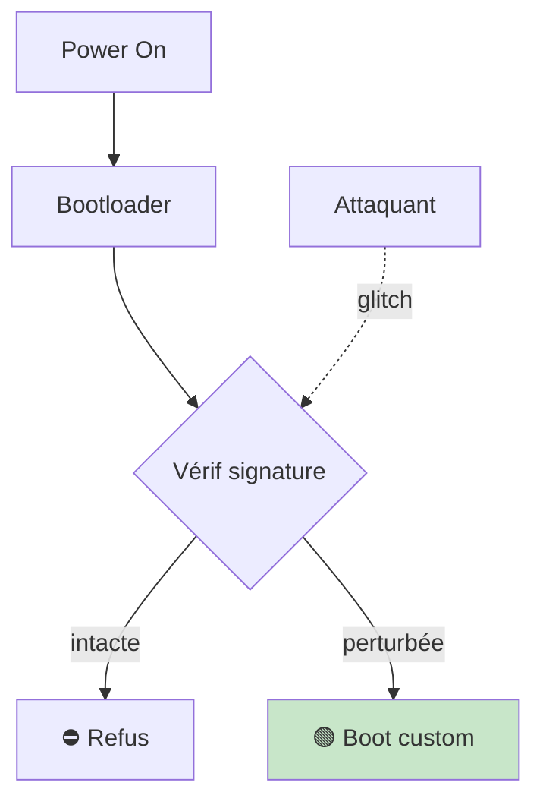
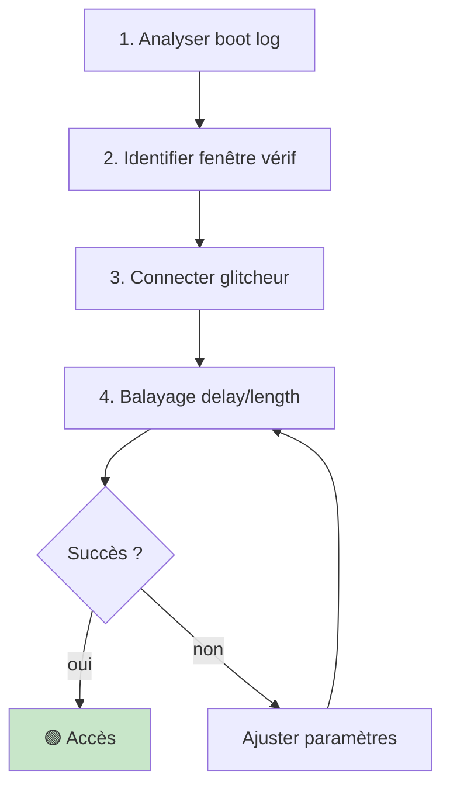
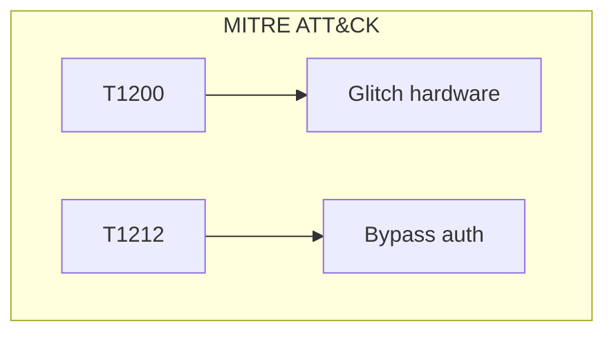

# ⚡ Fault Injection

> [!info] **En 1 phrase**
> Le **glitching** (ou fault injection) : provoquer un **défaut électrique contrôlé** au bon moment
> pour faire **échouer une vérification** (secure boot, mot de passe, anti-dump) et obtenir accès
> ou exécution de code.

---

## 🧾 Overview

| Champ | Valeur |
|---|---|
| **Type** | Attaque par perturbation physique |
| **Domaine** | Hardware Security / Reverse Engineering |
| **Niveau** | Intermédiaire → Expert |
| **OS cibles** | Bare-metal, RTOS, U-Boot |
| **Matériel requis** | ChipWhisperer, PicoGlitcher, Faultier, oscilloscope |
| **Complexité** | Élevée → Très élevée |
| **Dernière mise à jour** | 2024-03-15 |

> [!info] 📊 **Diagramme de contexte**
> ```mermaid
> flowchart LR
>     ATK["Attaquant"] -->|"Voltage / Clock / EM"| MCU["µC en boot"]
>     MCU -->|"check"| CHECK{"Saut vérif ?"}
>     CHECK -->|"oui"| OK["🟢 Accès / RCE"]
>     CHECK -->|"non"| FAIL["🔴 Reboot"]
>     style OK fill:#c8e6c9
>     style FAIL fill:#ffcdd2
> ```

---

## 🎯 Concept

> Les vérifications de sécurité sont des opérations séquentielles. Un perturbateur au bon moment peut sauter l'instruction de comparaison, corrompre le résultat, ou forcer un branchement conditionnel.



> [!info] 💡 **Applications classiques**
> - **Bypass secure boot** → boot firmware non signé
> - **Bypass mot de passe** → accès à l'appareil
> - **Réactivation debug** → RDP désactivé (STM32)
> - **Bypass checks anti-tamper** → DRM, paiement

---

## 🧠 Concepts fondamentaux

### Les 3 types de glitch

| Type | Principe | Outils |
|---|---|---|
| **Voltage (VCC)** | Coupe/sag brièvement l'alimentation | Faultier, PicoGlitcher, ChipWhisperer |
| **Clock** | Tick d'horloge extra/trop court | ChipWhisperer |
| **EM** | Impulsion électromagnétique locale | ChipSHOUTER |

### Paramètres critiques

| Paramètre | Description | Plage typique |
|---|---|---|
| **Trigger** | Quand déclencher | Rising/falling edge |
| **Delay** | Temps après trigger | 1–10000 cycles |
| **Length** | Durée du glitch | 1–500 ns |
| **Voltage** | Amplitude du sag | 0–50% VCC |

### Fenêtre d'exploitation

```text
Temps ──────────────────────────────────────►
      │        │              │         │
      Boot     Vérif sig      Check     OK
               │◄── FENÊTRE ──►│
               │  (ns à µs)    │
               └─── GLITCH ICI ─┘
```

> Exemples connus : bypass RDP **Trezor One**, bypass APPROTECT **nRF52832** (AirTags).

---

## 🔌 Matériel / Composants

### Outils principaux

| Outil | Type | Usage | Prix |
|---|---|---|---|
| ChipWhisperer | Plateforme complète | Voltage/clock/EM glitch | ~200-500 € |
| PicoGlitcher | Glitcheur RP2040 | Voltage glitch basique | ~30 € |
| Faultier | Glitcheur USB | Voltage glitch contrôlé | ~50 € |
| ChipSHOUTER | EM glitch | Impulsion EM locale | ~300 € |
| Oscilloscope | Mesure | Observer glitch | ~100-500 € |
| MOSFET + R | DIY | Circuit glitch basique | ~5 € |

### Cibles typiques

| Catégorie | Objectif | Résultat |
|---|---|---|
| SoC secure boot | Bypass vérif signature | Boot custom |
| STM32 RDP Level 1 | Réactivation debug | Dump firmware |
| nRF52832 | Bypass APPROTECT | Debug complet |
| Trezor One | Bypass PIN | Accès crypto |

---

## ⚡ Protocoles

### Voltage Glitch

| Paramètre | Recommandé | Plage |
|---|---|---|
| Trigger | Front montant boot | — |
| Delay | 100–5000 cycles | Variable |
| Length | 1–100 ns | 1–500 ns |
| Voltage | 1.0–2.5V (sur 3.3V) | 0–50% sag |

### Clock Glitch

| Paramètre | Recommandé |
|---|---|
| Fréquence normale | 8–16 MHz |
| Glitch clock | 1 tick extra |

### EM Glitch

| Paramètre | Recommandé |
|---|---|
| Coil position | Sur le µC |
| Puissance | 100–500 V |
| Durée | 1–10 µs |

---

## 🛠️ Installation / Setup

### Prérequis

| Composant | Version |
|---|---|
| Python | ≥ 3.8 |
| ChipWhisperer | pip install chipwhisperer |
| Findus | pip install findus |
| Faultier | pip install faultier |
| Oscilloscope | any (USB ou dédié) |

### Connexion physique

```text
PC ──── Glitcheur ──── Device cible
│                        │
│  VCC ──────────────── VCC (via MOSFET)
│  GND ──────────────── GND
│  Trigger ──────────── GPIO device
│  Serial RX ────────── TX device (monitoring)
```

> [!warning] Vérifier les niveaux logiques (3.3V vs 5V) avant connexion.

---

## ⚙️ Configuration

### Paramètres Faultier

| Option | Défaut | Description |
|---|---|---|
| trigger_source | EXT0 | Source de déclenchement |
| trigger_type | PULSE_POSITIVE | Type de pulse |
| glitch_output | CROWBAR | Sortie de glitch |
| delay | Variable | Position du glitch |
| pulse | Variable | Durée du glitch |

### Paramètres ChipWhisperer

| Option | Valeur |
|---|---|
| clkgen_freq | 7370000 Hz |
| adc_samples | 24000 |
| glitch.clk_src | clkgen |
| glitch.output | enable_only |

---

## ⌨️ Commandes / Manipulations

### Faultier

```python
import faultier, serial
ft = faultier.Faultier()
ser = serial.Serial(ft.get_serial_path(), baudrate=115200)
ft.configure_glitcher(
    trigger_source=faultier.TRIGGER_IN_EXT0,
    trigger_type=faultier.TRIGGER_PULSE_POSITIVE,
    glitch_output=faultier.OUT_CROWBAR
)
ft.glitch(delay=1000, pulse=1)
print(ser.read(3))
```

### ChipWhisperer

```python
import chipwhisperer as cw
scope = cw.scope()
scope.clock.clkgen_freq = 7370000
scope.glitch.width = 10
scope.glitch.offset = 500
```

### Pin2Pwn

```text
1. Identifier MOSI/CS flash SPI
2. Court-circuiter au boot (aiguille)
3. Si succès : shell bootloader
```

---

## 🧪 Exemples pratiques

### 🟢 Débutant — Pin2Pwn

```text
Court-circuiter MOSI ↔ CS flash SPI au boot → µC ne lit pas firmware → shell
Matériel : aiguille à coudre uniquement
```

### 🟡 Intermédiaire — Bypass RDP STM32

```python
import chipwhisperer as cw
scope = cw.scope()
scope.clock.clkgen_freq = 7370000
for width in range(0, 50, 2):
    for offset in range(-2000, 2000, 100):
        scope.glitch.width = width
        scope.glitch.offset = offset
        # Test lecture JTAG → si succès = RDP bypassé
```

### 🔴 Avancé — Bypass secure boot

| Cible | Méthode | Timing |
|---|---|---|
| U-Boot signé | Voltage glitch | 100–500 ms après power-on |

### ⚫ Expert — Double fault

```text
1er glitch : réactiver debug (RDP bypass)
2e glitch  : bypass vérif signature
Résultat : accès complet
```

---

## 🧪 Workflow complet



| Étape | Action | Outil |
|---|---|---|
| 1 | Analyser boot | UART, oscilloscope |
| 2 | Identifier timing | Logic analyzer |
| 3 | Connecter | Glitcheur + device |
| 4 | Balayage | Script automatisé |
| 5 | Affiner | Réduire la plage |

---

## 🎬 Scénarios avancés

### Scénario 1 — Trezor One : bypass PIN

| Élément | Détail |
|---|---|
| **Objectif** | Accès crypto wallet Trezor |
| **Méthode** | Voltage glitch + UART |
| **Résultat** | PIN bypassé, seed extractible |
| **Difficulté** | ⭐⭐⭐⭐ |

### Scénario 2 — nRF52832 : bypass APPROTECT

| Élément | Détail |
|---|---|
| **Objectif** | Debug complet nRF52832 (AirTag) |
| **Méthode** | EM glitch pendant reset |
| **Résultat** | SWD réactivé, dump firmware |
| **Difficulté** | ⭐⭐⭐⭐⭐ |


---

## 🛡️ Cybersecurity use cases

| Use case | Sévérité | Impact |
|---|---|---|
| Bypass secure boot | Critique | Boot custom |
| Bypass RDP | Élevée | Dump firmware |
| Bypass PIN | Élevée | Accès device |

| Phase pentest | Rôle Fault Injection |
|---|---|
| Accès initial | Bypass secure boot |
| Reverse | Réactiver debug |
| Post-exploitation | Bypass anti-tamper |

---

## 🎯 MITRE ATT&CK

| Technique ID | Nom | Catégorie |
|---|---|---|
| T1200 | Hardware Additions | Initial Access |
| T1195 | Supply Chain Compromise | Initial Access |
| T1212 | Exploitation for Credential Access | Credential Access |



---

## 🛡️ Defensive Security

| Mesure | Efficacité | Priorité |
|---|---|---|
| Double vérification | Élevée | Haute |
| Watchdog | Élevée | Haute |
| Secure enclave/HSM | Très élevée | Haute |
| Clock monitoring | Moyenne | Moyenne |
| Mesure tension | Moyenne | Moyenne |

```bash
# Watchdog : reboot si comportement anormal
# Secure enclave : clés hors du CPU principal
# Double vérif : vérifier signature 2x à moments différents
```

---

## 🤖 Automatisation

```python
#!/usr/bin/env python3
"""Automatisation fault injection avec Findus"""
from findus import Findus

fw = Findus("/dev/ttyUSB0")
fw.set_baudrate(115200)
results = fw.scan(
    delay_range=(100, 2000), delay_step=10,
    pulse_range=(1, 50), pulse_step=2,
    repetitions=10
)
for r in results:
    print(f"delay={r.delay} pulse={r.pulse} → {r.response}")
```

| Outil | Usage |
|---|---|
| Findus | Automatisation glitch |
| ChipWhisperer | Glitch contrôlé |
| PicoGlitcher | Glitch basique |

---

## 📤 Output et parsing

```bash
# Analyse timing boot
cat boot.log | grep -iE 'time|ms|µs'

# Export oscilloscope
python3 -c "
import csv
with open('scope.csv') as f:
    for row in csv.reader(f): print(row)
"
```

---

## 🔗 Intégrations

- [[13 - Hardware & IoT|⚙️ Hardware & IoT]]
- [[Hardware - Fault Injection]] (cette fiche)
- [[Hardware - JTAG et SWD|🔧 JTAG/SWD]]

| Outil | Usage |
|---|---|
| [[Hardware - JTAG et SWD]] | Réactivation debug |
| [[Hardware - Secure Boot]] | Cible de bypass |
| [[Hardware - Logic Analyzer]] | Observer signaux |

---

## 🔄 Alternatives

| Alternative | Avantages | Inconvénients |
|---|---|---|
| JTAG/SWD | Accès complet | Nécessite broches |
| UART | Console interactif | Moins d'accès |
| EMFI (EM) | Sans contact | Coûteux |

---

## ⚡ Performance

| Métrique | Valeur |
|---|---|
| Fenêtre glitch | 1–500 ns |
| Taux réussite | 1–10% par essai |
| Essais nécessaires | 1000–100000 |
| Temps total | Minutes → heures |

---

## 🛠️ Troubleshooting

| Problème | Cause | Solution |
|---|---|---|
| Aucun effet | Delay/length incorrect | Balayer plus large |
| Crash permanent | Glitch trop fort | Réduire amplitude |
| Irréproducible | Timing variable | Augmenter répétitions |

---

## 🔐 Sécurité

| Risque | Mitigation |
|---|---|
| Bypass secure boot | Double vérif, watchdog |
| Bypass RDP | Secure enclave |
| Extraction clés | HSM, clés hors CPU |

> [!warning] Le fault injection nécessite équipement spécialisé et patience.

> [!danger] Cadre légal uniquement (pentest, recherche).

---

## ⚠️ Limitations

| Limite | Contournement |
|---|---|
| Timing très étroit | Oscilloscope, automatisation |
| Chaque device unique | Calibration par device |
| Équipement coûteux | DIY (PicoGlitcher) |

---

## 📋 Cheatsheet

```
┌───────────────────────────────────────────────────┐
│ Fault Injection — Cheatsheet                      │
├───────────────────────────────────────────────────┤
│ Types :    Voltage / Clock / EM                   │
│ Outils :   ChipWhisperer, PicoGlitcher, Faultier │
│ Timing :   1–500 ns (fenêtre étroite)            │
│ Méthodo :  Balayage delay/length                  │
│ Pin2Pwn :  Court-circuiter MOSI↔CS (aiguille)    │
│ RDP :      Glitch pendant reset STM32            │
│ Secure boot: Glitch vérif signature              │
│ Essais :   1000–100000 typiques                  │
└───────────────────────────────────────────────────┘
```

---

## ⚡ Quick reference

| Élément | Valeur |
|---|---|
| **Types** | Voltage, Clock, EM |
| **Outils** | ChipWhisperer, PicoGlitcher |
| **Fenêtre** | 1–500 ns |
| **Essais** | 1000–100000 |
| **Objectif** | Bypass vérification sécurité |

---

## 🔍 Détection & Défense

| Countermeasure | Efficacité |
|---|---|
| Double vérif | Élevée |
| Watchdog | Élevée |
| Secure enclave | Très élevée |

---

## ⚠️ Tips & Pièges

- **Trial-and-error massif** : prévois setup automatisé.
- **Chaque tentative peut crasher** : watchdog/power-cycle.
- **Fenêtre très étroite** (ns–µs) : précision du trigger.
- **Combine avec analyse firmware** : réduit l'espace de recherche.
- Commence par **boot le plus tôt possible**.

> [!tip] Utilise Findus pour automatiser le balayage. La patience est la clé.

---

## 📚 References

> [!info] 📚 **Sources**
> - [HardwareAllTheThings — Fault Injection](https://github.com/swisskyrepo/HardwareAllTheThings/blob/main/docs/side-channel/fault-injection.md)
> - [Attacking STM32F4 — PicoGlitcher](https://mkesenheimer.github.io/blog/glitching-the-stm32f4.html)
> - [Replicant: Trezor One](https://voidstarsec.com/blog/replicant-part-1)

| Source | URL |
|---|---|
| ChipWhisperer | https://www.chipwhisperer.com/ |
| PicoGlitcher | https://github.com/example/picoglitcher |

---

➡️ **Liens :** [[13 - Hardware & IoT|⚙️ Hardware & IoT]] · [[Hardware - JTAG et SWD|🔧 JTAG/SWD]] · [[Hardware - Secure Boot|🔐 Secure Boot]] · [[Hardware - Dump et Analyse de Firmware|💾 Dump de firmware]]
