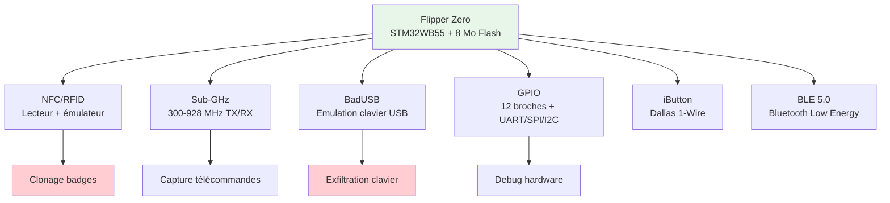
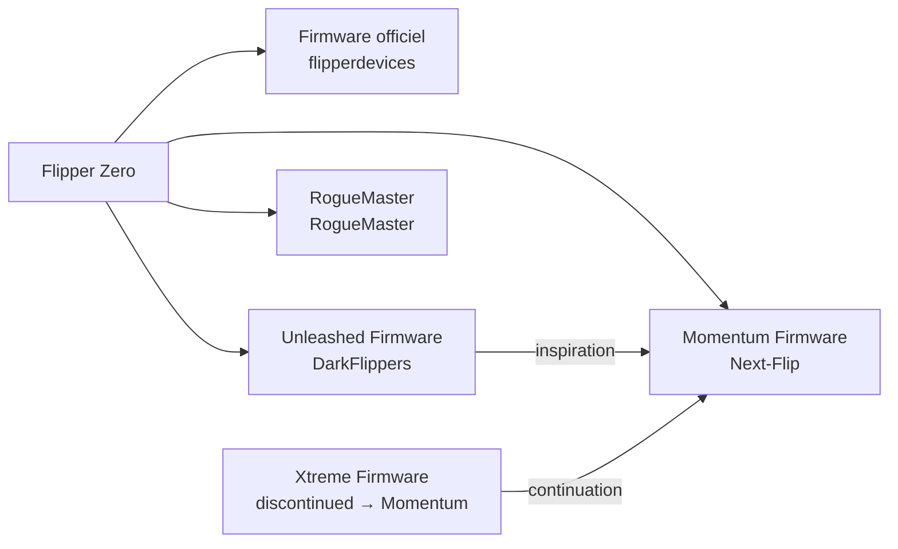
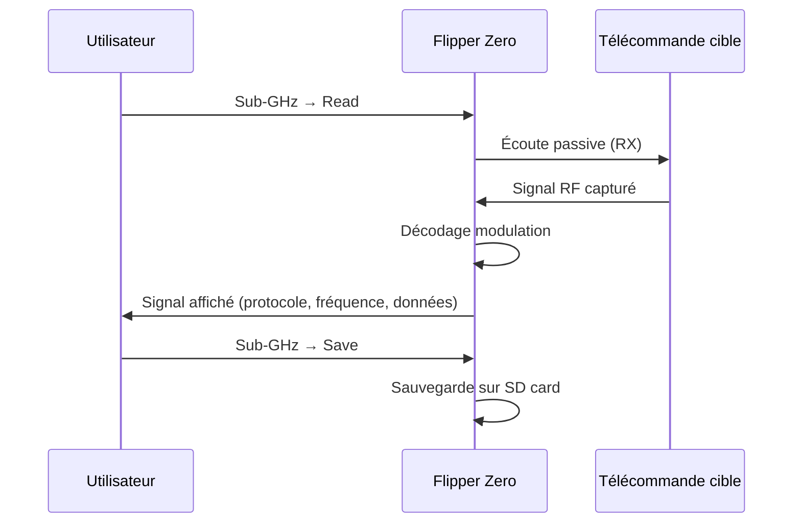
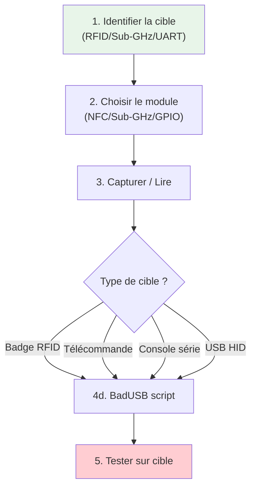
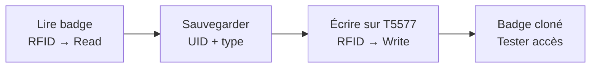
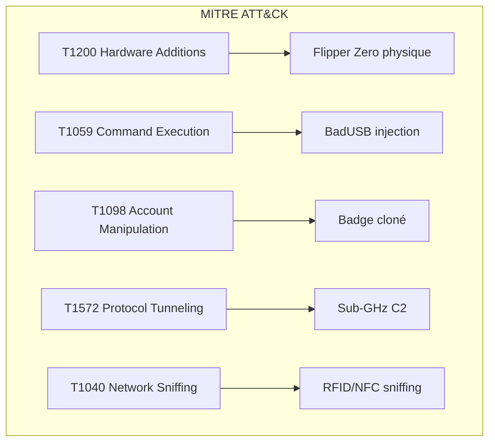
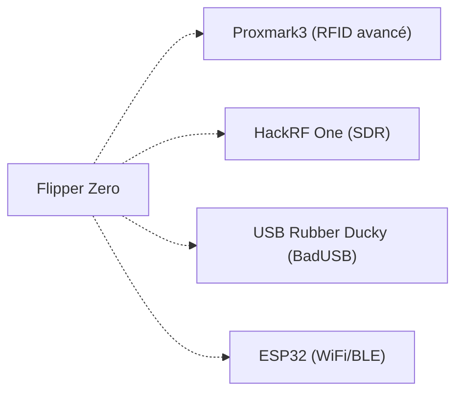

# 🐬 Flipper Zero

> [!info] **En 1 phrase**
> Le **Flipper Zero** est le couteau suisse du pentester hardware : **RFID/NFC**, **Sub-GHz**,
> **BadUSB**, **iButton** et **GPIO/UART** dans une coquille de 100 g — le GPIO permet même
> de s'en servir comme **Bus Pirate** (UART, SPI, I2C, JTAG/SWD).

---

## 🧾 Overview

| Champ | Valeur |
|---|---|
| **Type** | Multi-tool hardware hacking |
| **Domaine** | Hardware Hacking — RFID, RF, USB, GPIO |
| **Niveau** | Beginner → Expert |
| **OS cibles** | Linux embedded (Flipper OS), tout device avec interface RF/USB/UART |
| **Matériel requis** | Flipper Zero + carte SD + firmwares custom |
| **Complexité** | Faible (GUI intégrée) → Élevée (GPIO/UART scripting) |
| **Dernière mise à jour** | 2026-08-16 |

> [!info] 📊 **Diagramme de contexte**
> ```mermaid
> flowchart LR
>     FZ["Flipper Zero"] --> NFC["NFC/RFID<br>125 kHz + 13.56 MHz"]
>     FZ --> SUB["Sub-GHz<br>300-928 MHz"]
>     FZ --> USB["BadUSB<br>HID keyboard"]
>     FZ --> GPIO["GPIO<br>UART/SPI/I2C/JTAG"]
>     FZ --> IB["iButton<br>Dallas 1-Wire"]
>     FZ --> BLE["Bluetooth<br>BLE 5.0"]
>     style FZ fill:#e1f5fe
> ```

---

## 🎯 Concept

> Le Flipper Zero est un microcontrôleur **STM32WB55** (ARM Cortex-M4, 64 MHz, 1 Mo Flash,
> 256 Ko RAM) doté d'un écran OLED 1.1", de capteurs RFID/NFC LF+HF, d'un émetteur
> Sub-GHz, d'un port USB HID, d'un module BLE 5.0 et de broches GPIO directement accessibles.
> Son OS basé sur le Furi Core gère les applications comme un smartphone : chaque module
> (NFC, Sub-GHz, BadUSB, etc.) est une application séparée.



> [!info] 💡 **Le contexte**
> - **STM32WB55** : double cœur Cortex-M4 (64 MHz) + Cortex-M0 (32 MHz pour BLE)
> - **Flash** : 8 Mo (firmware + applications) — pas la même que la RAM (256 Ko)
> - **RFID LF** : 125 kHz (EM410X, HID, Indala, HiTag, etc.) via antenne interne
> - **RFID HF** : 13.56 MHz (MIFARE Classic/Ultralight, NFC) via antenne interne
> - **Sub-GHz** : 300-928 MHz (OOK, ASK, FSK, PSK) via antenne interne dédiée
> - **GPIO** : 12 broches, dont TX/RX UART, SWD/SWC, SPI, I2C, 5V out
> - **Caractéristiques** : 103g, écran OLED 1.1" 128x64, bouton 5 directions, vibreur, LED RGB

---

## 🧠 Concepts fondamentaux

### Architecture matérielle

| Composant | Spécification | Rôle |
|---|---|---|
| MCU principal | STM32WB55RG | Cortex-M4 64 MHz + Cortex-M0 BLE |
| Flash externe | 8 Mo (MX25R6435F) | Firmware + applications + stockage |
| RAM | 256 Ko | Mémoire vive |
| Écran | OLED 1.1" 128x64 | Interface graphique |
| RFID LF | 125 kHz (antenne intégrée) | Lecture/écriture/émulation LF |
| RFID HF | 13.56 MHz (antenne intégrée) | NFC ISO14443A/B |
| Sub-GHz | 300-928 MHz (CC1101-like) | TX/RX signaux RF |
| USB | USB 2.0 FS (Micro-USB) | BadUSB, charging, firmware |
| BLE | Bluetooth 5.0 (Cortex-M0) | Connexion mobile, BLE spam |
| GPIO | 12 broches | UART, SPI, I2C, SWD, PWM |
| Batterie | 2000 mAh Li-Ion | ~5-7h d'utilisation |

### Firmwares disponibles



| Firmware | Philosophie | Sub-GHz unlock | Mise à jour | Public cible |
|---|---|---|---|---|
| Officiel (OFW) | Conservative, légalement prudent | Verrouillé par région | Lente, curatée | Utilisateurs normaux |
| Unleashed | Maximum de features | Déverrouillé (responsabilité utilisateur) | Fréquente | Power users |
| Momentum | Stabilité + extras curatés | Déverrouillé | Fréquente | Daily driver |
| RogueMaster | UI très personnalisée, gros catalogue apps | Déverrouillé | Fréquente | Thématisation poussée |

### GPIO (le côté hardware hacking)

![[Images/HardwareAllTheThings/flipper-gpio.png]]

| Pin GPIO | Broche MCU | Rôle |
|---|---|---|
| **3.3V** | Power | Alimentation sortante 3.3V (max 100mA) |
| **5V** | Power | Alimentation sortante 5V (USB power) |
| **TX (PA9)** | UART1_TX | Transmission série |
| **RX (PA10)** | UART1_RX | Réception série |
| **SWC (PA14)** | SWD_CLK | Serial Wire Debug clock |
| **SWDIO (PA13)** | SWD_IO | Serial Wire Debug data |
| **PC0** | GPIO | Générique |
| **PC1** | GPIO | Générique |
| **PC3** | GPIO | Générique |
| **GND** | Ground | Masse |

> L'application **GPIO** intégrée fournit des outils **UART**, **I2C**, **SPI**, **JTAG/SWD**
> et un mode **Bus Pirate-like** — parfait pour scanner, dumper et flasher sur le terrain.

---

## 🔌 Matériel / Composants

### Outils principaux

| Outil | Type | Usage | Prix | Source |
|---|---|---|---|---|
| Flipper Zero | Multi-tool | RFID, Sub-GHz, BadUSB, GPIO, iButton, BLE | ~170€ | flipperzero.one |
| Flipper Zero + WiFi Dev Board | Multi-tool + WiFi | Deauther, scan WiFi (ESP32) | ~230€ | flipperzero.one + ESP32 |
| Carte SD 32/64 Go | Stockage | Firmware, dumps, signaux | ~10€ | Qualité A1/A2 |
| Cable USB-C/μUSB | Connectique | Flash firmware, debugging | ~5€ | Officiel recommandé |
| Antennes Sub-GHz externes | Extension | Portée étendue | ~15-30€ | Community |

### Cibles typiques

| Catégorie | Exemples | Module Flipper | Vulnérabilités |
|---|---|---|---|
| Serrures RFID | Badges 125 kHz / 13.56 MHz | NFC/RFID | MIFARE Classic cassé, EM410X en clair |
| Télécommandes | Portails, garages, barrières | Sub-GHz | OOK/ASK sans chiffrement |
| Claviers USB | Postes de travail | BadUSB | Injection de frappes |
| Systèmes série | Routers, switches, IoT | GPIO/UART | Console de debug exposée |
| Capteurs 1-Wire | Dallas DS1990A | iButton | Clonage trivial |
| Périphériques BLE | Accessoires connectés | BLE | Replay / spam |

---

## ⚡ Protocoles

### RFID/LF (125 kHz)

| Paramètre | Valeur |
|---|---|
| **Type** | Sans fil (inductive coupling LF) |
| **Fréquence** | 125 kHz |
| **Protocoles** | EM410X, HID Prox, Indala, HiTag, Viking, Paradox |
| **Portée** | 1-8 cm (antenne interne) |
| **Direction** | Simplex (tag → lecteur) |

### RFID/HF (13.56 MHz)

| Paramètre | Valeur |
|---|---|
| **Type** | Sans fil (inductive coupling HF) |
| **Fréquence** | 13.56 MHz |
| **Protocoles** | ISO14443A/B, MIFARE Classic/Ultralight, NFC |
| **Portée** | 1-5 cm (antenne interne) |
| **Direction** | Half-duplex |

### Sub-GHz

| Paramètre | Valeur |
|---|---|
| **Type** | Sans fil (radio) |
| **Fréquence** | 300-928 MHz (région-dépendant) |
| **Modulations** | OOK, ASK, FSK, PSK |
| **Portée** | 10-100+ m (selon antenne/puissance) |
| **Direction** | TX et RX |

### Séquence d'analyse Sub-GHz



---

## 🛠️ Installation / Setup

### Prérequis

| Composant | Version | Lien |
|---|---|---|
| qFlipper (desktop) | Latest | flipperzero.one/qflipper |
| Firmware officiel | Latest | flipperzero.one/update |
| Firmware Unleashed | Latest | DarkFlippers/unleashed-firmware |
| Firmware Momentum | Latest | Next-Flip/Momentum-Firmware |
| Carte SD | FAT32, A1/A2 | Qualité recommandée |

### Mise à jour via qFlipper

```bash
# 1. Connecter le Flipper en USB
# 2. Ouvrir qFlipper
# 3. Cliquer sur "Update" → choisir le firmware
# 4. Attendre la fin du flash (ne pas débrancher)
```

### Update via WebUpdater

```text
Officiel    : https://lab.flipper.net/
Momentum    : https://momentum-fw.dev/update
Unleashed   : https://lab.flipper.net/?url=...&channel=release-cfw
RogueMaster : https://lab.flipper.net/?url=...&channel=RM
```

### Update via SD card (offline)

```text
1. Télécharger la release (.tgz) du firmware
2. Extraire sur la carte SD (dossier /update)
3. Éteindre le Flipper
4. Insérer la SD et allumer
5. Menu → Changelog/Storage → updater → Run
```

---

## ⚙️ Configuration

### Paramètres système

| Option | Valeur par défaut | Description |
|---|---|---|
| `ibutton.deny_reads` | false | Refuse les lectures iButton |
| `rfid.deny_reads` | false | Refuse les lectures RFID |
| `nfc.deny_reads` | false | Refuse les lectures NFC |
| `subghz.deny_tx` | false | Refuse les transmissions Sub-GHz |
| `badusb.deny_keyboard` | false | Refuse les injections BadUSB |
| `uart.echo` | false | Echo UART activé |
| `lockscreen.mode` | off | Verrouillage écran |

### GPIO (mode Bus Pirate)

| Mode | Broches utilisées | Usage |
|---|---|---|
| UART | TX (PA9) / RX (PA10) | Console série 115200/9600 baud |
| SPI | PC0(SCK) / PC1(MOSI) / PC3(MISO) + CS manuel | Flash SPI, capteurs |
| I2C | PC1(SCL) / PC3(SDA) | Scan bus, dump EEPROM |
| SWD | SWC(PA14) / SWDIO(PA13) | Debug ARM Cortex |
| 1-Wire | PC0 | iButton / Dallas sensors |

---

## ⌨️ Commandes / Manipulations

### Commandes essentielles (menu Flipper)

| Menu | Action | Résultat |
|---|---|---|
| NFC → Read | Lire un tag NFC | Affiche UID + type |
| NFC → Add Manually | Ajouter un NFC manuellement | Édition UID |
| RFID → Read | Lire un badge LF | Affiche UID + type |
| RFID → Add Manually | Ajouter un RFID manuellement | Édition UID |
| Sub-GHz → Read | Capturer un signal RF | Décodage temps réel |
| Sub-GHz → Saved → Send | Renvoyer un signal | TX le signal sauvegardé |
| BadUSB → Run | Exécuter un script USB | Injection de frappes |
| GPIO → UART Bridge | Pont UART | TX/RX vers PC |
| GPIO → GPIO Config | Configurer les broches | Input/Output/Pull-up |
| iButton → Read | Lire un iButton | Affiche l'ID |
| iButton → Emulate | Émuler un iButton | Le Flipper se fait passer pour le tag |

### Shell / Console (UART bridge)

```text
# Via le Flipper (mode UART Bridge)
# Connecter TX→RX et RX→TX de la cible
# Connecter GND à GND
# Ouvrir un terminal sur le PC :
screen /dev/ttyACM0 115200

# Le Flipper fait le pont entre USB et UART
# Utile pour les consoles de debug (routers, switches)
```

---

## 🧪 Exemples pratiques

### 🟢 Débutant — Clonage d'un badge RFID LF

```text
1. Menu → RFID → Read
2. Approcher le badge (125 kHz)
3. Le Flipper affiche l'UID
4. Menu → Saved → sélectionner le badge
5. "Write" → approcher la carte T5577 vierge
6. Badge cloné !
```

### 🟡 Intermédiaire — Capture et rejeu Sub-GHz

```text
1. Menu → Sub-GHz → Read
2. Régler la fréquence (ex: 433.92 MHz)
3. Capturer le signal de la télécommande
4. Sauvegarder le signal
5. Sub-GHz → Saved → sélectionner le signal
6. "Send" → tester le rejeu
```

### 🔴 Avancé — BadUSB + exfiltration WiFi

```text
# Créer un script BadUSB (DuckyScript)
# Fichier : /ext/badusb/exfil_wifi.txt

REM Exfiltration WiFi credentials via PowerShell
DELAY 1000
GUI r
DELAY 500
STRING powershell -Command "netsh wlan show profile | Select-String 'Key Content'"
ENTER
DELAY 2000
GUI a
DELAY 200
GUI c
DELAY 100
```

### ⚫ Expert — UART bridge + dump firmware via GPIO

```text
# 1. Connecter Flipper à la cible
#    TX Flipper → RX cible
#    RX Flipper → TX cible
#    GND Flipper → GND cible

# 2. Activer le UART Bridge
#    Menu → GPIO → UART Bridge

# 3. Depuis le PC, ouvrir un terminal
#    picocom /dev/ttyACM0 -b 115200

# 4. Interagir avec le bootloader / OS de la cible
#    (ex: U-Boot, BusyBox, Linux console)
```

---

## 🧪 Workflow complet (scénario pas à pas)



### Étape 1 — Identification

| Action | Commande | Résultat attendu |
|---|---|---|
| Scanner RFID | RFID → Read | Type + UID du badge |
| Scanner NFC | NFC → Read | UID + type NTAG/MIFARE |
| Scanner Sub-GHz | Sub-GHz → Read | Fréquence + modulation |
| Identifier UART | GPIO → UART Bridge + PC | Prompt de la console |

### Étape 2 — Exploitation

| Méthode | Difficulté | Fiabilité |
|---|---|---|
| Clonage RFID LF | Faible | Élevée |
| Rejeu Sub-GHz | Faible | Variable (rolling code?) |
| BadUSB injection | Moyenne | Élevée |
| UART debug | Élevée | Élevée |

---

## 🎬 Scénarios avancés

### Scénario 1 — Red team: Clonage de badge + accès physique

| Élément | Détail |
|---|---|
| **Objectif** | Cloner un badge employé pour accès physique non autorisé |
| **Matériel** | Flipper Zero + carte T5577 vierge |
| **Étapes** | 1. RFID → Read badge → 2. Sauvegarder → 3. Write sur T5577 |
| **Résultat** | Badge cloné, accès physique compromis |
| **Difficulté** | ⭐⭐ |



### Scénario 2 — Recon: Capture Sub-GHz + analyse protocole

| Élément | Détail |
|---|---|
| **Objectif** | Capturer et analyser les signaux RF d'un site |
| **Matériel** | Flipper Zero + antenne externe |
| **Étapes** | 1. Sub-GHz → Read → 2. Capturer tous signaux → 3. Analyser sur PC |
| **Résultat** | Protocoles RF identifiés, signaux réjouables |
| **Difficulté** | ⭐⭐⭐ |

---

## 🛡️ Cybersecurity use cases

| Use case | Sévérité | Matériel requis | Impact |
|---|---|---|---|
| Clonage badge RFID | Critique | Flipper Zero + T5577 | Accès physique compromis |
| Rejeu télécommande | Élevée | Flipper Zero | Ouvrir portails/barrières |
| BadUSB keylogging | Élevée | Flipper Zero | Vol de credentials |
| UART console access | Élevée | Flipper Zero + câbles | Root sur device IoT |
| iButton clone | Moyenne | Flipper Zero | Accès 1-Wire compromis |
| BLE spam/advertising | Faible | Flipper Zero | Perturbation BLE |

| Phase pentest | Ce que permet cette technique |
|---|---|
| Recon | Scan RFID/Sub-GHz/BLE des alentours |
| Accès initial | Clonage badge, injection BadUSB, rejeu RF |
| Maintien d'accès | Badge cloné durable, BadUSB persistant |
| Exfiltration | BadUSB → PowerShell → vol de données |
| Évasion | Outil 100g non détectable |

---

## 🎯 MITRE ATT&CK

| Technique ID | Nom | Catégorie | Applicabilité |
|---|---|---|---|
| T1200 | Hardware Additions | Initial Access | Flipper Zero = hardware addition |
| T1059 | Command and Scripting Interpreter | Execution | BadUSB = PowerShell/cmd injection |
| T1098 | Account Manipulation | Persistence | Badge cloné = accès persistant |
| T1572 | Protocol Tunneling | Command & Control | Sub-GHz comme canal C2 |
| T1040 | Network Sniffing | Credential Access | Sniffing NFC/RFID/Sub-GHz |



### Mapping détaillé

| Phase MITRE | Technique | Cette fiche couvre |
|---|---|---|
| Initial Access | T1200 | Placement du Flipper Zero |
| Execution | T1059 | Injection BadUSB |
| Persistence | T1098 | Badge cloné |
| Credential Access | T1040 | Sniffing RFID/Sub-GHz |
| C2 | T1572 | Sub-GHz comme canal |

---

## 🛡️ Defensive Security

### Détection

| Signal de détection | Source | Fiabilité |
|---|---|---|
| OUI MAC `0C:FA:22` sur BLE/WiFi | Scanner réseau | Élevée |
| BadUSB HID inconnu | GPO Windows / EDR | Moyenne |
| Rejeu RFID/Sub-GHz | Logs contrôle d'accès | Moyenne |
| UART non autorisé | Physique (câbles) | Faible |

| Indicateur | Log / Capteur | Seuil d'alerte |
|---|---|---|
| OUI `0C:FA:22` | WiFi/BLE scan | Immédiat |
| USB HID inconnu | GPO / USB device control | Immédiat |
| Badge lu sans passage | Logs RFID | Immédiat |
| Signal RF inconnu | Spectrum analyzer | Variable |

### Prévention

| Mesure | Efficacité | Coût | Priorité |
|---|---|---|---|
| DESFire / RFID chiffré | Très élevée | Élevé | Haute |
| USB endpoint policy | Élevée | Faible | Haute |
| Protocoles RF chiffrés | Élevée | Élevé | Moyenne |
| Surveillance physique | Moyenne | Faible | Basse |

### Durcissement (hardening)

```bash
# Windows : Bloquer les USB HID inconnus
# via Group Policy → USB Device Installation

# Linux : restreindre les input devices
echo 'SUBSYSTEM=="input", KERNEL=="event*", ATTRS{idVendor}=="0483", ACTION=="add", RUN+="/bin/false"' > /etc/udev/rules.d/99-block-flipper.rules
```

---

## 🤖 Automatisation

### Scripts d'exploitation

```python
#!/usr/bin/env python3
"""
Automatisation Flipper Zero via serial API (USB CDC)
"""
import serial
import time

def connect_flipper(port="/dev/ttyACM0"):
    return serial.Serial(port, 115200, timeout=2)

def send_command(ser, cmd):
    ser.write((cmd + "\r\n").encode())
    time.sleep(0.5)
    return ser.read(ser.inWaiting()).decode(errors="ignore")

def scan_rfid(ser):
    print("[*] Scan RFID LF...")
    response = send_command(ser, "rfid read")
    print(response)
    return response

def capture_subghz(ser, freq=433920000):
    print(f"[*] Capture Sub-GHz sur {freq/1e6} MHz...")
    response = send_command(ser, f"subghz capture {freq}")
    print(response)

# Exemple d'utilisation
ser = connect_flipper()
send_command(ser, "input press up")
send_command(ser, "input press ok")
time.sleep(1)
send_command(ser, "input press back")
```

### Outils d'automatisation

| Outil | Usage | Lien |
|---|---|---|
| qFlipper | Interface desktop officielle | flipperzero.one/qflipper |
| f0_studio | Alternative GUI | Community |
| Serial API | Automatisation Python | Flipper Zero serial protocol |
| UFW (Unleashed Web) | Flash web | lab.flipper.net |

### Intégration dans des frameworks

| Framework | Méthode d'intégration |
|---|---|
| Metasploit | Via BadUSB payloads personnalisés |
| Custom framework | Serial API Python → contrôle complet |
| Red Team ops | Flipper Zero comme outil de terrain |

---

## 📤 Output et parsing

### Formats de sortie

| Format | Emplacement | Utilité |
|---|---|---|
| `.rfid` | `/ext/rfid/` | Signaux RFID LF sauvegardés |
| `.nfc` | `/ext/nfc/` | Tags NFC sauvegardés |
| `.sub` | `/ext/subghz/` | Signaux Sub-GHz sauvegardés |
| `.ibtn` | `/ext/ibutton/` | Données iButton |
| `.txt` (BadUSB) | `/ext/badusb/` | Scripts DuckyScript |

### Parsing des résultats

```bash
# Lecture des fichiers Flipper via qFlipper
# Ou directement sur la carte SD

# Conversion de signaux Sub-GHz
# Format .sub = texte avec fréquence, modulation, données

cat saved_signal.sub
# Frequency: 433920000
# Preset: FuriHalSubGhzPresetOok650Async
# Protocol: Nice FLO
# Data: 0x12345678
```

---

## 🔗 Intégrations

- [[13 - Hardware & IoT|⚙️ Hardware & IoT]] global
- [[Hardware - RFID et NFC|🏷️ RFID/NFC]]
- [[Hardware - UART|🔌 UART]]
- [[Hardware - JTAG et SWD|🔧 JTAG/SWD]]

| Outils associés | Usage complémentaire |
|---|---|
| [[Hardware - Proxmark]] | Attaques RFID avancées (darkside, nested) |
| [[Hardware - RFID MIFARE (HF 13.56 MHz)]] | Clonage MIFARE complet |
| [[Hardware - Pwnagotchi]] | Collecte WiFi en parallèle |
| [[Hardware - HydraBus]] | Debug multi-protocol |

| Intégration | Comment |
|---|---|
| ESP32 WiFi Dev Board | Déauther, scan WiFi, Evil Portal |
| ChameleonMini | Émulation multi-badge |
| Proxmark3 | Attaques avancées que le Flipper ne peut pas |

---

## 🔄 Alternatives

| Alternative | Avantages | Inconvénients | Cas d'usage |
|---|---|---|---|
| Proxmark3 | Attaques RFID complètes | Pas de Sub-GHz/BadUSB | Pentest RFID dédié |
| HackRF One | Sub-GHz large bande, SDR | Pas de RFID/BadUSB | Analyse RF avancée |
| USB Rubber Ducky | BadUSB dédié | Uniquement USB | Injection clavier |
| O.MG Cable | BadUSB + WiFi | Prix élevé (~100€) | Exfiltration avancée |



---

## ⚡ Performance

| Métrique | Valeur | Impact |
|---|---|---|
| Batterie | 2000 mAh | 5-7h d'utilisation |
| RFID LF portée | 1-8 cm | Approche physique |
| RFID HF portée | 1-5 cm | Approche physique |
| Sub-GHz portée | 10-100+ m | Variable (antenne) |
| BLE portée | 10-30 m | Connexion mobile |
| Poids | 103 g | Ultra-portable |
| Boot time | ~3 secondes | Démarrage rapide |

### Optimisations

| Technique | Gain | Complexité |
|---|---|---|
| Firmware custom (Unleashed/Momentum) | +features, unlock Sub-GHz | Faible |
| Antenne Sub-GHz externe | Portée x3 | Faible |
| WiFi Dev Board ESP32 | +WiFi/BLE hacking | Moyenne |
| Carte SD rapide (A2) | Performance I/O | Faible |

---

## 🛠️ Troubleshooting

| Problème | Cause probable | Solution |
|---|---|---|
| Flipper non reconnu USB | Driver manquant | Installer les drivers STM32 |
| Sub-GHz TX ne fonctionne pas | Région verrouillée | Utiliser firmware custom |
| BadUSB ne s'exécute pas | Mauvais format DuckyScript | Vérifier la syntaxe |
| Écran blanc / gelé | Firmware corrompu | Reflash via qFlipper (DFU) |
| NFC ne lit rien | Tag incompatible ou antenne | Vérifier la fréquence |
| UART Bridge ne répond pas | Broches TX/RX inversées | Vérifier le câblage |

### Erreurs courantes

```
Erreur : "Device not found" (qFlipper)
Cause : Driver USB manquant ou Flipper en DFU
Solution : Installer drivers STM32, relancer qFlipper

Erreur : "SD card not found"
Cause : Carte non formatée FAT32 ou absente
Solution : Formater en FAT32, réinsérer

Erreur : "Sub-GHz TX blocked"
Cause : Firmware officiel + région verrouillée
Solution : Installer Unleashed ou Momentum
```

### Diagnostic

```bash
# Vérifier le Flipper depuis qFlipper
# → System Info → Firmware version, SD card, battery

# Via le Flipper lui-même
# → Settings → About → Hardware info

# UART Bridge test
# Connecter TX→RX, RX→TX, GND→GND
# Ouvrir terminal sur PC : screen /dev/ttyACM0 115200
```

---

## 🔐 Sécurité

| Risque | Impact | Mitigation |
|---|---|---|
| Badge RFID cloné | Accès physique compromis | DESFire, anti-clonage |
| Télécommande réjouée | Accès non autorisé | Rolling codes, chiffré |
| BadUSB injection | Vol de credentials | USB device control |
| UART console root | Root device IoT | Sérial désactivé en prod |
| iButton cloné | Accès 1-Wire compromis | Multi-facteur |

> [!warning] Points de sécurité
> - 5V sur le GPIO : certains Flipper délivrent du 5V — vérifier la tension avant de brancher une cible 3.3V
> - La législation sur les intercepteurs radio s'applique : cloner un badge ou copier une télécommande peut être illégal hors périmètre autorisé
> - Les CFW sont souvent incompatibles entre eux : un reflash complet est nécessaire pour changer

### Restrictions légales

> [!danger] Cadre légal
> L'utilisation du Flipper Zero pour cloner des badges, rejouer des télécommandes ou
> injecter des commandes est soumise aux lois locales sur la sécurité informatique et
> les communications radio. En France : accès non autorisé = 3 ans + 45 000€ (art. 323-1 CP).
> Utiliser uniquement dans un cadre de pentest autorisé ou de recherche.

---

## ⚠️ Limitations

| Limite | Impact | Contournement |
|---|---|---|
| Pas d'attaques Crypto1 avancées | Impossible de cracker MIFARE | Utiliser Proxmark3 |
| Sub-GHz verrouillé (OFW) | TX/RX limité par région | Firmware custom |
| Portée RFID limitée (<10 cm) | Proximité physique requise | Antenne externe |
| Pas de SDR complet | Pas d'analyse RF avancée | HackRF One |
| Batterie limitée (5-7h) | Autonomie moyenne | Power bank |

### Cas où cette technique ne fonctionne pas

| Scénario | Raison |
|---|---|
| Rolling code (garage moderne) | Chaque signal est unique |
| DESFire AES (13.56 MHz) | Le Flipper ne peut pas cracker AES |
| BadUSB + USB device control | Le Flipper est bloqué par GPO |
| Sub-GHz freq-hopping | Le Flipper ne suit pas les hopings |
| Badge SEOS (HID) | Protocole propriétaire non supporté |

---

## 📋 Cheatsheet

```
┌─────────────────────────────────────────────────────────┐
│ Flipper Zero — Cheatsheet                               │
├─────────────────────────────────────────────────────────┤
│ RFID LF Read:    RFID → Read                           │
│ RFID LF Write:   RFID → Saved → Write                  │
│ NFC Read:        NFC → Read                            │
│ NFC Emulate:     NFC → Saved → Emulate                 │
│ Sub-GHz Read:    Sub-GHz → Read                        │
│ Sub-GHz Send:    Sub-GHz → Saved → Send                │
│ BadUSB Run:      BadUSB → Run → script.txt             │
│ GPIO UART:       GPIO → UART Bridge                    │
│ GPIO SPI:        GPIO → SPI Config                     │
│ GPIO I2C:        GPIO → I2C Config                     │
│ iButton Read:    iButton → Read                        │
│ iButton Emulate: iButton → Saved → Emulate             │
│ BLE Scan:        BLE → Scan                            │
│ Flash firmware:  qFlipper ou WebUpdater ou SD card     │
└─────────────────────────────────────────────────────────┘
```

| Action | Menu / Commande |
|---|---|
| Lire badge RFID | RFID → Read |
| Cloner badge | RFID → Saved → Write |
| Lire NFC | NFC → Read |
| Capturer RF | Sub-GHz → Read |
| Rejouer RF | Sub-GHz → Saved → Send |
| BadUSB | BadUSB → Run → script |
| UART Bridge | GPIO → UART Bridge |
| Debug SWD | GPIO → SWD |
| Émuler iButton | iButton → Saved → Emulate |
| Flash firmware | qFlipper → Update |

---

## ⚡ Quick reference

| Élément | Valeur / Commande |
|---|---|
| **MCU** | STM32WB55RG (Cortex-M4 64 MHz) |
| **Flash** | 8 Mo (MX25R6435F) |
| **RAM** | 256 Ko |
| **RFID LF** | 125 kHz (EM410X, HID, etc.) |
| **RFID HF** | 13.56 MHz (MIFARE, NFC) |
| **Sub-GHz** | 300-928 MHz |
| **USB** | USB 2.0 FS (Micro-USB) |
| **BLE** | Bluetooth 5.0 |
| **GPIO** | 12 broches (UART, SPI, I2C, SWD) |
| **Écran** | OLED 1.1" 128x64 |
| **Batterie** | 2000 mAh |
| **Poids** | 103 g |
| **OUI MAC** | `0C:FA:22` (détection BLE/WiFi) |
| **Web Updater** | momentum-fw.dev/update |

---

## 🔍 Détection & Défense

| Signal | Méthode de détection | Outil |
|---|---|---|
| OUI MAC `0C:FA:22` | WiFi/BLE scan | Nmap, Wigle |
| BadUSB HID inconnu | USB device control | GPO, EDR |
| Rejeu RFID | Logs contrôle d'accès | SIEM |
| Signal RF inconnu | Spectrum analyzer | HackRF, SDR |
| UART non autorisé | Inspection physique | Caméras |

| Countermeasure | Efficacité | Implémentation |
|---|---|---|
| DESFire / RFID chiffré | Très élevée | Nouveaux badges |
| USB endpoint policy | Élevée | GPO Windows |
| Rolling codes RF | Élevée | Nouvelles télécommandes |
| Sérial désactivé | Élevée | Firmware device |
| Surveillance physique | Moyenne | Caméras + personnel |

> [!tip] Défense
> Le Flipper Zero est indétectable par les logiciels classiques car il agit comme un
> périphérique USB standard. La défense la plus efficace est de combiner le contrôle
> physique (caméras, personnel) avec le contrôle technique (USB policy, RFID chiffré).

---

## ⚠️ Tips & Pièges

- **Piège 1** : 5V sur le GPIO peut endommager une cible 3.3V — toujours vérifier la tension avec un multimètre.
- **Piège 2** : Les firmware custom sont souvent incompatibles entre eux — reflash complet nécessaire.
- **Piège 3** : Sub-GHz est verrouillé par région sur le firmware officiel — les CFW déverrouillent (responsabilité légale).
- **Piège 4** : Un écran bloqué se résout par un reflash complet via qFlipper (mode DFU).
- **Astuce 1** : `hf mf autopwn` (Proxmark3) est plus puissant que le Flipper pour MIFARE — combiner les deux outils.
- **Astuce 2** : L'OUI MAC `0C:FA:22` permet de détecter un Flipper sur WiFi/BLE — utile en défense.
- **Bonne pratique** : Toujours sauvegarder les signaux capturés sur la carte SD avant de les effacer.

> [!tip] Astuces
> - Momentum est le firmware le plus stable pour un daily driver (base OFW + features Unleashed)
> - Le Flipper peut servir de bus UART pour dumper du firmware via U-Boot
> - Utiliser les Asset Packs de Momentum pour personnaliser l'UI sans recompiler

---

## 📚 References

> [!info] 📚 **Sources**
> - [HardwareAllTheThings — Flipper Zero](https://github.com/swisskyrepo/HardwareAllTheThings/blob/main/docs/gadgets/flipper-zero.md)
> - [Flipper Zero Official](https://flipperzero.one/)
> - [Momentum Firmware](https://github.com/Next-Flip/Momentum-Firmware)
> - [Unleashed Firmware](https://github.com/DarkFlippers/unleashed-firmware)
> - [RogueMaster Firmware](https://github.com/RogueMaster/flipperzero-firmware-wPlugins)
> - [Flipper Zero GPIO Pinout](https://docs.flipperzero.one/gpio)

### Documentation officielle

| Source | URL | Type |
|---|---|---|
| Flipper Zero Docs | docs.flipperzero.one | Documentation |
| Momentum FW | momentum-fw.dev | Firmware custom |
| Unleashed FW | github.com/DarkFlippers/unleashed-firmware | Firmware custom |
| Flipper Application Catalog | app.flipperzero.one | Applications |

### Vidéos / Tutorials

| Titre | Auteur | Lien |
|---|---|---|
| Flipper Zero Getting Started | Flipper Devices | YouTube |
| Sub-GHz Deep Dive | Community | YouTube |
| GPIO as Bus Pirate | Community | YouTube |
| BadUSB Tutorial | Community | YouTube |

### Livres / Articles

| Titre | Auteur | Année |
|---|---|---|
| Flipper Zero GPIO Pinout | Flipper Devices | 2023 |
| Momentum vs Unleashed vs RogueMaster | Community | 2025 |
| Flipper Zero Red Teaming Guide | RAGONET | 2025 |

---

➡️ Liens : [[13 - Hardware & IoT|⚙️ Hardware & IoT]] · [[Hardware - RFID et NFC|🏷️ RFID/NFC]] · [[Hardware - RFID MIFARE (HF 13.56 MHz)|💳 MIFARE]] · [[Hardware - RFID LF (HID, EM410X, Indala, HiTag)|📡 LF]] · [[Hardware - Proxmark|📡 Proxmark]] · [[Hardware - UART|🔌 UART]] · [[Hardware - JTAG et SWD|🔧 JTAG/SWD]] · [[Bibliothèque technique|🏠 Index]]