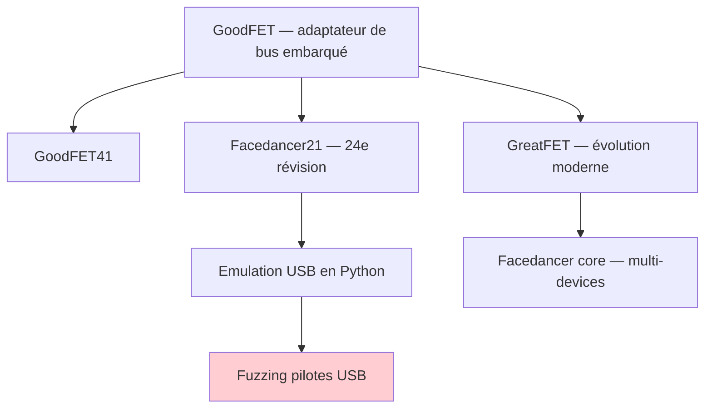
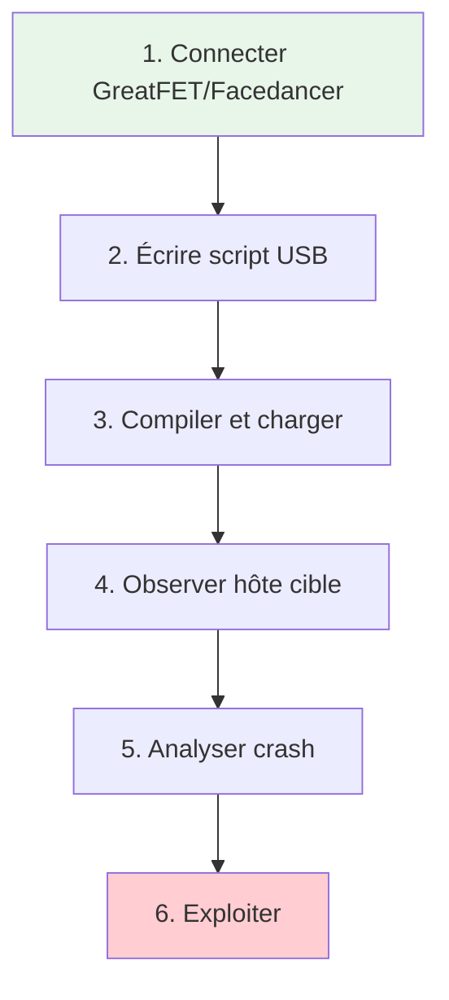
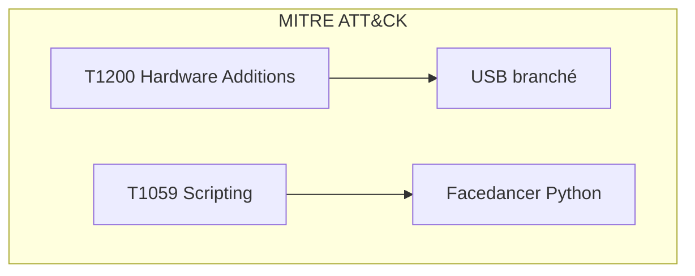
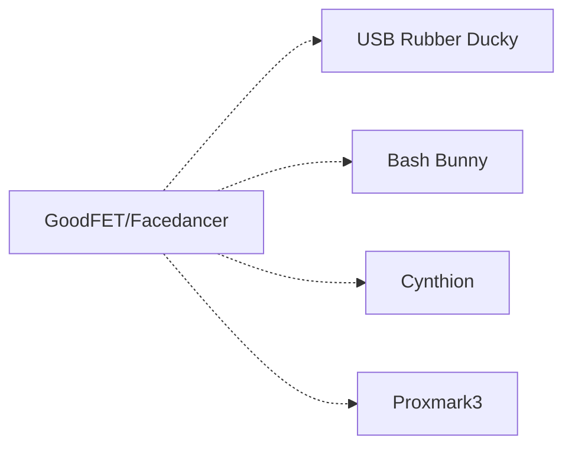

# GoodFET

> [!info] **En 1 phrase**
> GoodFET = un **adaptateur de bus embarqué** open source pour divers
> **microcontrôleurs et radios** — à l'origine du fameux **Facedancer21**,
> qui permet d'**écrire des devices USB en Python** pour **fuzzer les pilotes
> USB d'une autre machine**.

---

## Overview

| Champ | Valeur |
|---|---|
| **Type** | Adaptateur de bus embarqué / Outil de fuzzing USB |
| **Domaine** | Hardware Hacking / USB Security |
| **Niveau** | Intermediate → Expert |
| **OS cibles** | Linux, Windows, macOS (hôte), USB stack du device |
| **Matériel requis** | GoodFET/Facedancer21/GreatFET, câble USB, PC |
| **Complexité** | Moyenne → Élevée |
| **Dernière mise à jour** | 2026-08-16 |

> [!info] **Diagramme de contexte**
> ```mermaid
> flowchart LR
>     A["GoodFET / GreatFET"] --> B["Bus embarqué (JTAG/SPI/I2C)"]
>     A --> C["Facedancer (USB emulation)"]
>     C --> D["Hôte cible"]
>     D --> E["Pilotes USB testés"]
>     style A fill:#e1f5fe
>     style E fill:#c8e6c9
> ```

---

## Concept

La famille GoodFET est un adaptateur de bus embarqué open-source créée par Travis Goodspeed. Elle inclut le **GoodFET41** original, le **Facedancer21** (émulation USB), et le **GreatFET** (successeur moderne). Leur usage principal en pentest est le **fuzzing de pilotes USB** : émuler des devices USB malformés côté Python pour trouver des vulnérabilités dans le USB stack de la cible.



---

## Concepts fondamentaux

### La famille GoodFET / Facedancer

| Terme | Définition |
|---|---|
| **GoodFET41** | Adaptateur original — JTAG, SPI, I2C, ADC/DAC, radio |
| **Facedancer21** | 24e révision — spécialisé émulation USB en Python |
| **GreatFET** | Successeur moderne — USB, JTAG, SPI, I2C, ADC/DAC, radio |
| **Facedancer** | Core logiciel pour émuler des devices USB (greatscottgadgets) |
| **Cynthion** | Instrument de test USB dernière génération |

### USB Fuzzing

Le fuzzing USB consiste à émuler des devices USB avec des descripteurs malformés, des tailles de paquets incorrectes, ou des réponses de contrôle inattendues pour déclencher des bugs dans les pilotes USB de la machine cible.


---

## Matériel / Composants

### Outils principaux

| Outil | Type | Usage | Prix | Source |
|---|---|---|---|---|
| GoodFET41 | Adaptateur bus | JTAG/SPI/I2C/UART | ~30-50€ | Travis Goodspeed |
| Facedancer21 | Emulation USB | Fuzzing pilotes USB | ~40-60€ | GoodFET |
| GreatFET One | Multi-protocole | USB/JTAG/SPI/I2C | ~120-150€ | Great Scott Gadgets |
| Cynthion | Test USB | USB 2.0 analysis | ~200-250€ | Great Scott Gadgets |

### Tableau comparatif

| Carte | Architecture | USB | JTAG | SPI | I2C | ADC/DAC | Facedancer |
|---|---|---|---|---|---|---|---|
| GoodFET41 | MSP430 | — | Oui | Oui | Oui | Oui | Non (ancien) |
| Facedancer21 | MAX3420 | Émulation | — | — | — | — | Oui |
| GreatFET One | LPC4330 | Oui | Oui | Oui | Oui | Oui | Oui |
| Cynthion | iCE40 + LPC | USB 2.0 PHY | — | — | — | — | Oui |

### Spécifications GreatFET (v2025.0.0)

| Composant | Spécification |
|---|---|
| **Processeur** | NXP LPC4330 (dual-core Cortex-M4/M0) |
| **Interface** | USB High-Speed (480 Mbps) |
| **Flash** | 4 MB (SPI) |
| **RAM** | 264 KB SRAM |
| **GPIO** | 56 broches |
| **Protocoles** | JTAG, SPI, I2C, UART, ADC, DAC, GPIO |
| **Facedancer** | Supporté (BACKEND=greatfet) |
| **Firmware** | greatscottgadgets/greatfet (BSD-3-Clause) |

---

## Protocoles

### Protocoles supportés

| Protocole | GoodFET41 | GreatFET | Facedancer21 |
|---|---|---|---|
| USB (émulation) | Non | Oui | Oui (dédié) |
| JTAG | Oui | Oui | Non |
| SPI | Oui | Oui | Non |
| I2C | Oui | Oui | Non |
| UART | Oui | Oui | Non |
| ADC/DAC | Oui | Oui | Non |
| GPIO | Oui | Oui | Non |

---

## Installation / Setup

### Prérequis

| Composant | Version | Lien |
|---|---|---|
| Python | 3.9+ | https://python.org |
| GreatFET tools | v2025.0.0 | https://github.com/greatscottgadgets/greatfet |
| Facedancer | 3.1+ | https://github.com/greatscottgadgets/facedancer |

### Installation GreatFET

```bash
# Cloner le repo GreatFET
git clone https://github.com/greatscottgadgets/greatfet.git
cd greatfet/host
pip install -e .

# Vérification
greatfet_info
```

### Installation Facedancer

```bash
# Cloner le repo Facedancer
git clone https://github.com/greatscottgadgets/facedancer.git
cd facedancer
pip install -e .

# Vérification
python -c "import facedancer; print(facedancer.__version__)"
```

### Connexion physique

```
GreatFET One  ────────  Device cible (USB)
│
│  USB-A ──────────────── Port USB de l'hôte cible
│  JTAG header ─────────── JTAG du device (optionnel)
│  GPIO ────────────────── Pins de test sur le PCB
```

---

## Configuration

### Backends Facedancer supportés

| Backend | Carte | Usage |
|---|---|---|
| `BACKEND=cynthion` | Cynthion | USB 2.0, MITM |
| `BACKEND=greatfet` | GreatFET One | Multi-protocole |
| `BACKEND=goodfet` | Facedancer21/GoodFET41 | USB émulation basique |
| `BACKEND=raspdancer` | RPi + MAX3421 | USB émulation |
| `BACKEND=hydradancer` | HydraDancer/USB3 | USB haute vitesse |

---

## Commandes / Manipulations

### Commandes essentielles

| Commande | Description | Exemple |
|---|---|---|
| `greatfet_info` | Info sur la carte | `greatfet_info` |
| `greatfet_jtag` | Scan JTAG | `greatfet_jtag scan` |
| `greatfet_spi` | Opérations SPI | `greatfet_spi read_id` |
| `greatfet_i2c` | Scan I2C | `greatfet_i2c scan` |
| `greatfet_gpio` | Contrôle GPIO | `greatfet_gpio read` |

### USB Facedancer — Exemple

```python
#!/usr/bin/env python3
"""Émulation d'un device USB clavier malformé (fuzzing)"""
from facedancer import *

class MalformedKeyboard(USBDevice):
    name = "Malformed Keyboard"

    def __init__(self):
        USBDevice.__init__(
            self,
            device_descriptor=USBDeviceDescriptor(
                idVendor=0xFFFF,
                idProduct=0x0001,
                iProduct="Fuzz Keyboard",
            ),
        )
        self.add_interface(USBInterface(
            number=0,
            class_number=3,  # HID
            subclass=1,      # Boot
            protocol=1,      # Keyboard
            descriptors=[],
            endpoints=[
                USBEndpoint(
                    number=1,
                    direction=1,  # IN
                    transfer_type=3,  # Interrupt
                    max_packet_size=8,
                    interval=10,
                )
            ]
        ))

device = MalformedKeyboard()
device.run()
```

---

## Exemples pratiques

### Débutant — Scan JTAG avec GreatFET

```bash
# Connecter le GreatFET au device cible
greatfet_jtag scan
# Les broches TCK/TMS/TDI/TDO seront identifiées automatiquement
```

### Intermédiaire — Émulation USB HID

```python
from facedancer import *

class FakeKeyboard(USBDevice):
    """Émule un clavier USB basique"""
    def __init__(self):
        USBDevice.__init__(self,
            device_descriptor=USBDeviceDescriptor(
                idVendor=0x1234,
                idProduct=0x5678,
                iProduct="Fake KB",
            ))
        # Ajouter interface HID Keyboard
        self.add_interface(USBInterface(
            number=0, class_number=3, subclass=1, protocol=1,
            descriptors=[],
            endpoints=[USBEndpoint(
                number=1, direction=1, transfer_type=3,
                max_packet_size=8, interval=10
            )]
        ))

device = FakeKeyboard()
device.run()
# Le device apparaît comme clavier sur l'hôte cible
```

### Avancé — USB MITM avec Cynthion

```text
1. Connecter le Cynthion entre le device USB et l'hôte cible
2. Utiliser le mode USBProxy pour intercepter le trafic
3. Modifier les paquets en temps réel (MITM)
4. Injecter des réponses malformées pour fuzzing
```

### Expert — Fuzzing complet de USB stack

```text
1. Émuler un device USB avec des descripteurs aléatoires
2. Fuzzing des requêtes de contrôle (SET_REPORT, GET_DESCRIPTOR, etc.)
3. Envoi de paquets avec tailles incorrectes
4. Observation des crashs pilotes (BSOD, kernel panic)
5. Analyse des core dumps pour identifier le bug
```

---

## Workflow complet (scénario pas à pas)



### Étape 1 — Connexion

| Action | Commande | Résultat |
|---|---|---|
| Connecter GreatFET | USB-A → hôte cible | Carte détectée |
| Vérifier | `greatfet_info` | Firmware version |

### Étape 2 — Script

| Méthode | Difficulté | Fiabilité |
|---|---|---|
| Émulation HID basique | Moyenne | Élevée |
| Fuzzing descripteurs | Élevée | Variable |
| USBProxy MITM | Élevée | Élevée |

### Étape 3 — Exécution

```bash
python fuzz_keyboard.py
# Le device USB apparaît sur l'hôte cible
# Observer les logs kernel pour les erreurs
dmesg -w
```

### Étape 4 — Analyse

```bash
# Sur l'hôte cible (Linux)
dmesg | grep -i "usb\|error\|bug"
# Sur Windows : Event Viewer → System logs
```

---

## Scénarios avancés

### Scénario 1 — Fuzzing de pilote USB Windows

| Élément | Détail |
|---|---|
| **Objectif** | Trouver une vulnerability dans un pilote USB Windows |
| **Matériel** | Facedancer21, VM Windows (USB passthrough) |
| **Étapes** | 1. Émuler device USB malformé<br>2. Connecter à VM via USB passthrough<br>3. Fuzzing des requêtes de contrôle<br>4. Observer BSOD / crash pilote |
| **Résultat** | CVE potentielle dans le pilote |
| **Difficulté** | |


### Scénario 2 — Clonage USB (BadUSB)

| Élément | Détail |
|---|---|
| **Objectif** | Émuler un device USB malveillant (keyboard/storage) |
| **Matériel** | GreatFET One, PC cible |
| **Étapes** | 1. Émuler clavier USB<br>2. Envoyer de frappes clavier (reverse shell)<br>3. Ou émuler stockage avec payload autorun |
| **Résultat** | Exécution de code sur la cible |
| **Difficulté** | |

---

## Cybersecurity use cases

| Use case | Sévérité | Matériel requis | Impact |
|---|---|---|---|
| USB fuzzing | Élevée | Facedancer/GreatFET | Crash pilotes, CVE |
| USB MITM | Élevée | Cynthion | Interceptation trafic |
| BadUSB emulation | Critique | GreatFET | Exécution de code |
| JTAG scan | Moyenne | GreatFET | Debug device |

| Phase pentest | Ce que permet cette technique |
|---|---|
| Recon | Scan JTAG/SPI/I2C du device |
| Accès initial | BadUSB pour exécution de code |
| Collecte | USB MITM pour interception |
| Évasion | USB fuzzing pour contourner sécurité |

---

## MITRE ATT&CK

| Technique ID | Nom | Catégorie | Applicabilité |
|---|---|---|---|
| T1200 | Hardware Additions | Initial Access | Facedancer branché à la cible |
| T1059 | Command and Scripting Interpreter | Execution | USB HID → keystrokes |
| T1195.002 | Supply Chain Compromise | Initial Access | Device USB compromis |



---

## Defensive Security

### Détection

| Signal de détection | Source | Fiabilité |
|---|---|---|
| Device USB inconnu | Logs kernel | Élevée |
| Descripteurs USB anormaux | USB stack monitoring | Moyenne |
| Trafic USB suspect | USBProxy | Élevée |

### Prévention

| Mesure | Efficacité | Coût | Priorité |
|---|---|---|---|
| Verrouiller ports USB | Élevée | Faible | Haute |
| USB device whitelisting | Élevée | Moyen | Haute |
| Desactiver USB unused | Moyenne | Gratuit | Moyenne |

### Durcissement (hardening)

```bash
# Désactiver le chargement auto de modules USB (Linux)
echo "blacklist usb-storage" | sudo tee /etc/modprobe.d/blacklist-usb.conf

# Vérifier les devices USB connectés
lsusb
# Sur Windows : Device Manager → USB controllers
```

---

## Automatisation

### Scripts d'exploitation

```python
#!/usr/bin/env python3
"""Fuzzing automatisé de USB requests"""
from facedancer import *
import random

class USBFuzzer(USBDevice):
    def __init__(self):
        USBDevice.__init__(self,
            device_descriptor=USBDeviceDescriptor(
                idVendor=0xFFFF, idProduct=0x0001,
                iProduct="USB Fuzzer"))
        self.add_interface(USBInterface(
            number=0, class_number=0xFF,
            descriptors=[], endpoints=[]))

    def handle_control_request(self, request):
        # Réponse aléatoire pour fuzzing
        data = bytes(random.getrandbits(8) for _ in range(request.length))
        request.reply(data)

device = USBFuzzer()
device.run()
```

### Outils d'automatisation

| Outil | Usage | Lien |
|---|---|---|
| Facedancer | USB emulation | https://github.com/greatscottgadgets/facedancer |
| GreatFET | Multi-protocole | https://github.com/greatscottgadgets/greatfet |
| Cynthion | USB 2.0 analysis | https://greatscottgadgets.com/cynthion/ |

---

## Output et parsing

### Formats de sortie

| Format | Exemple | Utilité |
|---|---|---|
| Log texte | `dmesg` output | Crash detection |
| Core dump | Windows BSOD dump | Exploit analysis |
| USB capture | PCAP | Trafic USB |

### Parsing des résultats

```bash
# Linux : surveiller les erreurs USB
dmesg -w | grep -i "usb\|error\|bug\|crash"

# Windows : Event Viewer
eventvwr.msc → System → Filter: Source="USB"
```

---

## Intégrations

- [[13 - Hardware & IoT| Hardware & IoT]] global
- [[Hardware - JTAG et SWD| JTAG/SWD]] — JTAG via GreatFET
- [[Hardware - Dump et Analyse de Firmware| Dump de firmware]]
- [[Protocole USB| USB]]

| Outils associés | Usage complémentaire |
|---|---|
| Bus Pirate | UART/SPI/I2C basique |
| USBPcap | Capture trafic USB |
| Wireshark | Analyse protocoles |

---

## Alternatives

| Alternative | Avantages | Inconvénients | Cas d'usage |
|---|---|---|---|
| USB Rubber Ducky | BadUSB simple | Pas de fuzzing avancé | Injection keystrokes |
| Bash Bunny | Plus de payloads | Moins flexible | Pentest USB |
| Cynthion | USB 2.0 complet | Plus cher | MITM avancé |
| Proxmark3 | RFID, pas USB | Domaine différent | RFID hacking |



---

## Performance

| Métrique | Valeur | Impact |
|---|---|---|
| Vitesse USB | Full-Speed (12 Mbps) | Suffisant pour fuzzing |
| Latence emulation | ~1 ms | Temps réel |
| Nombre de fuzz/sec | ~100/s | Couverture correcte |

---

## Troubleshooting

| Problème | Cause probable | Solution |
|---|---|---|
| GreatFET non détecté | Driver manquant | Installer udev rules |
| Facedancer error | Version Python incompatible | Python 3.9+ |
| USB device non reconnu | Descripteurs invalides | Vérifier les descripteurs |

### Erreurs courantes

```
Erreur : "No GreatFET found"
Cause : Driver USB manquant ou permission
Solution : greatfet host-tools --ensure-access
```

### Diagnostic

```bash
greatfet_info
lsusb | grep -i "great\|goodfet"
dmesg | tail
```

---

## Sécurité

| Risque | Impact | Mitigation |
|---|---|---|
| USB fuzzing | Crash système | Patch pilotes |
| BadUSB | Exécution de code | USB whitelisting |
| USB MITM | Interceptation | Chiffrement USB |

> [!warning] Points de sécurité
> - Le **Facedancer21 ≠ GoodFET polyvalent** : spécialisé émulation USB
> - Le **GreatFET** est le successeur moderne
> - Pour fuzzer efficacement, construire des **descripteurs malformés**
> - Idéal sur **machine de test isolée** (VM + USB passthrough)

### Restrictions légales

> [!danger] Cadre légal
> Le fuzzing USB et l'émulation de devices malveillants ne sont autorisés que sur des systèmes dédiés aux tests. L'usage non autorisé est illégal.

---

## Limitations

| Limite | Impact | Contournement |
|---|---|---|
| Facedancer21 = Full-Speed USB | Pas de High-Speed (480 Mbps) | Utiliser Cynthion |
| Pas de USB 3.0 | Limité aux devices USB 2.0 FS | USB proxy matériel |
| Open-source uniquement | Pas de support commercial | Communauté GitHub |

### Cas où cette technique ne fonctionne pas

| Scénario | Raison |
|---|---|
| USB 3.0 uniquement | Facedancer = Full-Speed seulement |
| Device USB chiffré (USB-Crypto) | MITM impossible |
| VM sans USB passthrough | Pas de connexion physique |

---

## Cheatsheet

```
┌──────────────────────────────────────────────────────┐
│ GoodFET / Facedancer — Cheatsheet                    │
├──────────────────────────────────────────────────────┤
│ Info :       greatfet_info                            │
│ JTAG scan :  greatfet_jtag scan                       │
│ SPI read :   greatfet_spi read_id                     │
│ I2C scan :   greatfet_i2c scan                        │
│ USB emul :   python facedancer_script.py               │
│ Backend :    GREATFET / CYNTHION / GOODFET            │
│ Python :     from facedancer import *                  │
│ Fuzzing :    Construire descripteurs malformés        │
└──────────────────────────────────────────────────────┘
```

| Action | Commande |
|---|---|
| Info carte | `greatfet_info` |
| JTAG scan | `greatfet_jtag scan` |
| USB emulation | `python fuzz_script.py` |
| I2C scan | `greatfet_i2c scan` |

---

## Quick reference

| Élément | Valeur / Commande |
|---|---|
| **Fonction** | Adaptateur bus / Emulation USB |
| **USB** | Full-Speed (12 Mbps) |
| **Protocoles** | JTAG, SPI, I2C, UART, USB |
| **Voltage** | 3.3V (GreatFET) |
| **Logiciel principal** | greatfet / facedancer |
| **Commande rapide** | `greatfet_info` |

---

## Détection & Défense

| Signal | Méthode de détection | Outil |
|---|---|---|
| Device USB inconnu | Logs kernel | `dmesg \| grep USB` |
| Descripteurs anormaux | USB monitoring | USBGuard |

| Countermeasure | Efficacité | Implémentation |
|---|---|---|
| USB whitelisting | Élevée | USBGuard (Linux) |
| Ports USB verrouillés | Élevée | Physique + logiciel |

> [!tip] Défense
> - Utiliser **USBGuard** pour whitelisting des devices USB
> - Verrouiller physiquement les ports USB des machines sensibles
> - Désactiver le chargement auto de modules USB non autorisés

---

## Tips & Pièges

- **Piège 1** : Facedancer21 ≠ GoodFET polyvalent — il est spécialisé émulation USB.
- **Piège 2** : Le GreatFET est le successeur moderne mais plus cher.
- **Piège 3** : Le Facedancer moderne (greatscottgadgets) supporte plusieurs boards.
- **Astuce 1** : Construire des descripteurs USB malformés pour fuzzing efficace.
- **Astuce 2** : Utiliser une VM avec USB passthrough pour tester en sécurité.
- **Astuce 3** : Le GreatFET supporte aussi JTAG/SPI/I2C — c'est un couteau suisse.
- **Bonne pratique** : Tester toujours sur un système isolé/dédié.

> [!tip] Astuces
> - Le repo `greatscottgadgets/facedancer` est la référence pour le fuzzing USB
> - Cynthion est le choix pour USB 2.0 High-Speed et MITM
> - Les exemples dans le repo facedancer sont un bon point de départ

---

## References

> [!info] **Sources**
> - [HardwareAllTheThings — GoodFET](https://github.com/swisskyrepo/HardwareAllTheThings/blob/main/docs/gadgets/goodfet.md)
> - [GoodFET Project](https://goodfet.sourceforge.net/)
> - [Facedancer — GitHub](https://github.com/greatscottgadgets/facedancer)
> - [GreatFET — GitHub](https://github.com/greatscottgadgets/greatfet)

### Documentation officielle

| Source | URL | Type |
|---|---|---|
| GoodFET | https://goodfet.sourceforge.net/ | Documentation |
| GreatFET | https://greatscottgadgets.com/greatfet/ | Produit |
| Facedancer | https://github.com/greatscottgadgets/facedancer | Source |

### Vidéos / Tutorials

| Titre | Auteur | Lien |
|---|---|---|
| USB Fuzzing with Facedancer | Great Scott Gadgets | YouTube |

### Livres / Articles

| Titre | Auteur | Année |
|---|---|---|
| The Hardware Hacking Handbook | Jasper van Woudenberg | 2021 |

---

**Liens :** [[13 - Hardware & IoT| Hardware & IoT]] · [[Hardware - Dump et Analyse de Firmware| Dump de firmware]] · [[Hardware - JTAG et SWD| JTAG/SWD]] · [[Protocole USB| USB]]
