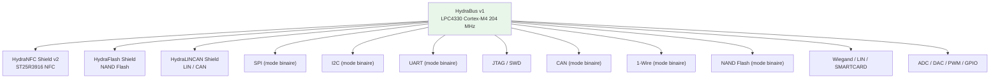
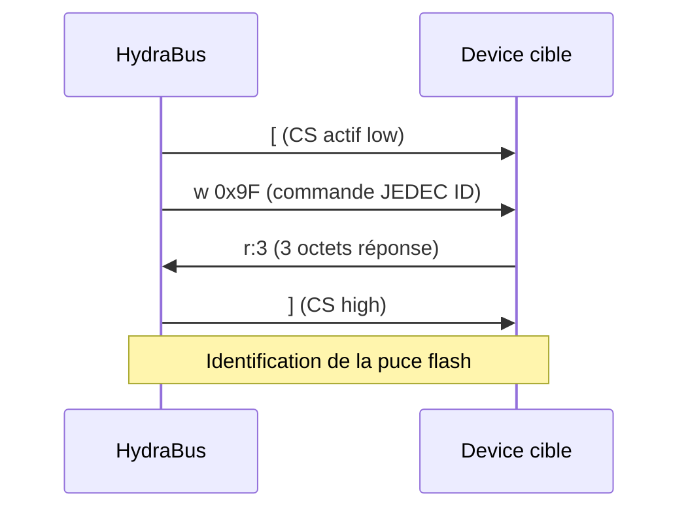
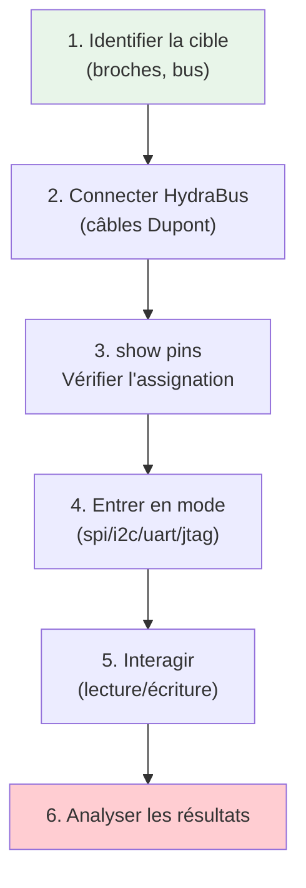
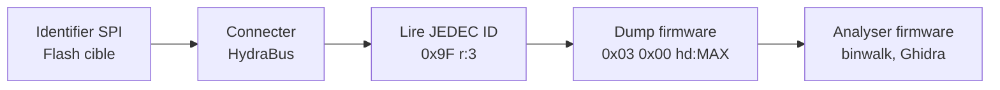
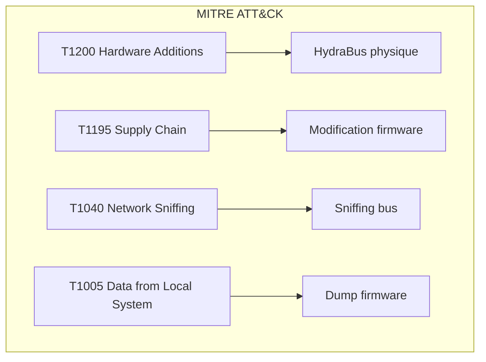
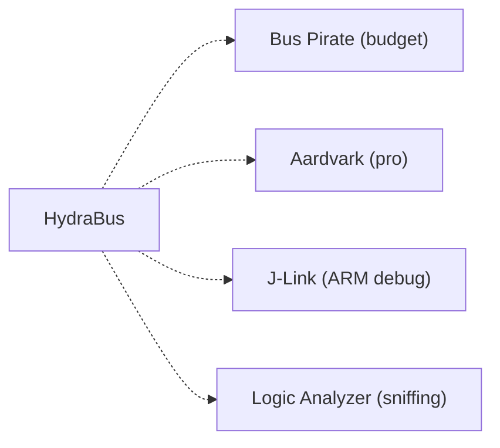

# 🚌 HydraBus

> [!info] **En 1 phrase**
> HydraBus = une **plateforme open source multifonction** (à base de LPC4330) qui
> parle **SPI, I2C, UART, JTAG, CAN, 1-Wire, NFC, NAND Flash...** — le couteau
> suisse du hardware hacker, avec un firmware communautaire **HydraFW**.

![[Images/HardwareAllTheThings/hydrabus_pin_assignment.jpg]]

---

## 🧾 Overview

| Champ | Valeur |
|---|---|
| **Type** | Plateforme de debug/attaque hardware multifonction |
| **Domaine** | Hardware Hacking — Multi-protocol |
| **Niveau** | Intermediate → Expert |
| **OS cibles** | Tout device avec bus SPI, I2C, UART, JTAG, CAN, 1-Wire, NAND |
| **Matériel requis** | HydraBus v1 + HydraNFC Shield v2 (optionnel) + câbles |
| **Complexité** | Moyenne → Élevée (multi-protocole) |
| **Dernière mise à jour** | 2026-08-16 |

> [!info] 📊 **Diagramme de contexte**
> ```mermaid
> flowchart LR
>     HB["HydraBus v1<br>LPC4330 Cortex-M4/M0"] --> SPI["SPI"]
>     HB --> I2C["I2C"]
>     HB --> UART["UART"]
>     HB --> JTAG["JTAG/SWD"]
>     HB --> CAN["CAN"]
>     HB --> OW["1-Wire"]
>     HB --> NF["NAND Flash"]
>     HB --> NFC["NFC (shield)"]
>     HB --> ADC["ADC / DAC / PWM"]
>     style HB fill:#e1f5fe
> ```

---

## 🎯 Concept

> HydraBus est une plateforme open-source basée sur le microcontrôleur **NXP LPC4330**
> (double cœur ARM Cortex-M4 à 204 MHz + Cortex-M0). Elle supporte nativement une multitude
> de bus et protocoles de communication via son firmware **HydraFW**. Le bus **NFC** est
> ajouté via le shield **HydraNFC v2** (chipset ST25R3916). Le mode **binaire** de chaque
> protocole permet des interactions haute vitesse avec les dispositifs cibles.



> [!info] 💡 **Le contexte**
> - **LPC4330** : double cœur ARM (M4 204 MHz + M0 32 MHz), 264 Ko SRAM, Ethernet, 2x USB HS
> - **HydraFW** : firmware open-source pour HydraBus et HydraNFC Shield
> - **Mode binaire** : chaque protocole (SPI, I2C, UART...) a un mode optimisé pour la vitesse
> - **Shields** : HydraNFC (NFC), HydraFlash (NAND), HydraLINCAN (LIN/CAN)
> - **Console** : interface série via USB (Micro-USB), VT100 terminal
> - **Stockage** : microSD FAT16/FAT32 jusqu'à 32 Go (via HydraNFC shield)

---

## 🧠 Concepts fondamentaux

### Architecture HydraBus

| Composant | Spécification | Rôle |
|---|---|---|
| MCU principal | LPC4330 (Cortex-M4 204 MHz + M0 32 MHz) | Logique principale |
| SRAM | 264 Ko | Mémoire vive |
| Flash interne | 1 Mo (NOR) | Firmware HydraFW |
| USB | 2x USB HS (Micro-USB) | Connexion PC + alimentation |
| Ethernet | 10/100 Mbps | Connexion réseau |
| GPIO | Multiples broches | Bus SPI, I2C, UART, JTAG, CAN... |
| microSD | FAT16/FAT32 (via HydraNFC) | Stockage dumps |
| Connecteur FPC | HydraNFC Shield v2 | Interface NFC |

### Protocoles supportés

| Bus | Mode | Vitesse max | Usage |
|---|---|---|---|
| SPI | Binaire + Console | 10+ MHz | Flash, capteurs, FPGA |
| I2C | Binaire + Console | 400 kHz | EEPROM, capteurs |
| UART | Binaire + Console | 115200+ baud | Console de debug |
| JTAG | Console | Variable | Debug ARM, dump firmware |
| CAN | Binaire + Console | 1 Mbps | Automotive, IoT |
| 1-Wire | Binaire + Console | 16 kbit/s | Dallas, iButton |
| NAND Flash | Binaire | Variable | Dump firmware NAND |
| Wiegand | Console | Variable | Systèmes d'accès badge |
| LIN | Console | 20 kbit/s | Automotive |
| SMARTCARD | Binaire | Variable | Cartes à puce |

### Mode binaire vs Console

| Mode | Avantage | Inconvénient | Usage |
|---|---|---|---|
| Console (interactive) | Lisible, facile | Lent | Débug, exploration |
| Binaire | Très rapide, scriptable | Moins lisible | Dumps massifs, automatisation |

---

## 🔌 Matériel / Composants

### Outils principaux

| Outil | Type | Usage | Prix | Source |
|---|---|---|---|---|
| HydraBus v1 | Plateforme multi-bus | SPI, I2C, UART, JTAG, CAN, etc. | ~60€ | hydrabus.com |
| HydraNFC Shield v2 | Shield NFC | NFC ISO14443, MIFARE, ISO15693 | ~60€ | hydrabus.com |
| HydraFlash Shield | Shield NAND | Lecture/dump NAND Flash | ~30€ | hydrabus.com |
| HydraLINCAN Shield | Shield LIN/CAN | Bus LIN et CAN | ~30€ | github.com/smillier/HydraLINCAN |
| Câbles Dupont | Connectique | Connexion aux broches cibles | ~5€ | Amazon |

### Cibles typiques

| Catégorie | Exemples | Bus | Vulnérabilités |
|---|---|---|---|
| IoT / SBC | Raspberry Pi, BeagleBone | UART, SPI, I2C | Console exposée |
| Routeurs / Switches | Cisco, MikroTik | UART, SPI | Dump firmware, root |
| Systèmes d'accès | Lecteurs badges | Wiegand, 1-Wire | Clonage badges |
| Automotive | ECU, OBD-II | CAN, LIN | Injection CAN |
| NFC/RFID | Tags, lecteurs | NFC (shield) | Clonage, sniffing |
| NAND Flash | BIOS, firmware | NAND | Extraction firmware |

---

## ⚡ Protocoles

### SPI

| Paramètre | Valeur |
|---|---|
| **Type** | Série synchrone full-duplex |
| **Vitesse** | Jusqu'à 10+ MHz |
| **Broches** | MOSI, MISO, SCK, CS |
| **Direction** | Full-duplex |
| **Usage** | Flash SPI, FPGA, capteurs |

### I2C

| Paramètre | Valeur |
|---|---|
| **Type** | Série synchrone half-duplex |
| **Vitesse** | 100 kHz (standard) / 400 kHz (fast) |
| **Broches** | SDA, SCL |
| **Direction** | Half-duplex (bidirectionnel) |
| **Usage** | EEPROM, capteurs, configuration |

### UART

| Paramètre | Valeur |
|---|---|
| **Type** | Série asynchrone |
| **Vitesse** | 9600 - 115200+ baud |
| **Broches** | TX, RX |
| **Direction** | Full-duplex |
| **Usage** | Console de debug, communication |

### CAN bus

| Paramètre | Valeur |
|---|---|
| **Type** | Série multi-master |
| **Vitesse** | Jusqu'à 1 Mbps |
| **Broches** | CAN_H, CAN_L |
| **Direction** | Half-duplex |
| **Usage** | Automotive, IoT industriel |

### Séquence d'interaction SPI



---

## 🛠️ Installation / Setup

### Prérequis

| Composant | Version | Lien |
|---|---|---|
| HydraFW | v0.11+ | github.com/hydrabus/hydrafw |
| dfu-util | Latest | git.code.sf.net/p/dfu-util |
| Terminal série | minicom/screen | Linux/Mac/Windows |
| HydraBus v1 | Rev 1.5+ | hydrabus.com |

### Mise à jour du firmware (USB DFU)

```bash
# 1. Installer dfu-util
sudo apt install dfu-util
# Ou compiler depuis les sources :
git clone git://git.code.sf.net/p/dfu-util/dfu-util
cd dfu-util && ./autogen.sh && ./configure && sudo make install

# 2. Télécharger la dernière release HydraFW
wget https://github.com/hydrabus/hydrafw/releases/download/v0.11/build_HydraFW_v0.11.zip
unzip build_HydraFW_v0.11.zip

# 3. Règles udev (Linux)
sudo wget https://raw.githubusercontent.com/hydrabus/hydrafw/master/utils/udev-rules/09-hydrabus.rules \
    -O /etc/udev/rules.d/09-hydrabus.rules
sudo udevadm control --reload-rules
sudo udevadm trigger

# 4. Mode DFU : maintenir "UBTN" pendant PowerON/RESET
# 5. Vérifier la détection
sudo dfu-util -l

# 6. Flasher le firmware
sudo dfu-util -i 0 -a 0 -d 0483:df11 -D ./build/hydrafw.dfu
```

### Connexion série

```bash
# Linux
ls /dev/ttyACM*    # Déterminer le port
screen /dev/ttyACM0 115200

# Ou avec minicom
minicom -D /dev/ttyACM0 -b 115200

# Windows
# Utiliser PuTTY ou TeraTerm sur le COM port
```

---

## ⚙️ Configuration

### Paramètres HydraFW

| Option | Valeur par défaut | Description |
|---|---|---|
| `show system` | - | Informations système |
| `show pins` | - | Broches assignées |
| `help` | - | Aide des commandes |

### Adaptateurs compatibles

| Adaptateur | Interface | Voltage | Note |
|---|---|---|---|
| HydraBus v1 | USB (CDC ACM) | 3.3V (GPIO) | Plateforme principale |
| CH341A | USB-SPI/I2C | 3.3V/5V | Bon marché |
| Bus Pirate | USB multi-protocole | 3.3V/5V | Polyvalent |
| FT232H | USB multi-protocole | 3.3V | Fiable |

---

## ⌨️ Commandes / Manipulations

### Commandes essentielles

| Commande | Description | Exemple |
|---|---|---|
| `show system` | Info système | Version HydraFW, cycle counter |
| `show pins` | Broches assignées | Voir les pinouts par mode |
| `help` | Aide | Liste de toutes les commandes |
| `spi` | Mode SPI | Entrer en mode SPI |
| `i2c` | Mode I2C | Entrer en mode I2C |
| `uart` | Mode UART | Entrer en mode UART |
| `jtag` | Mode JTAG | Entrer en mode JTAG |
| `can` | Mode CAN | Entrer en mode CAN |
| `1-wire` | Mode 1-Wire | Entrer en mode 1-Wire |
| `nfc` | Mode NFC | Entrer en mode NFC (HydraNFC) |

### Syntaxe mode binaire (ex. SPI)

| Valeur | Description |
|---|---|
| `[` | Chip select (CS) actif (low) |
| `]` | CS désactivé (high) |
| `r` | Lire 1 octet (dummy 0xFF) |
| `r:N` | Lire N octets |
| `hd` | Lire 1 octet + hexdump |
| `hd:N` | Lire N octets + hexdump |
| `w` | Suivi des valeurs à écrire |
| `w:N` | Écrire N octets |
| `0b` | Valeur binaire |
| `0` | Valeur octale |
| `0h`/`0x` | Valeur hexadécimale |
| `"` | Chaîne ASCII |

### Exemples de commandes

```text
# SPI : Lire l'Identification JEDEC d'une puce flash
> spi
spi> [ 0x9F r:3 ]
# Résultat : 3 octets d'identification

# SPI : Lire des données à l'adresse 0x00
spi> [ 0x03 0x00:3 hd:32 ]
# Lecture de 32 octets à partir de l'adresse 0x000000

# I2C : Scanner le bus
> i2c
i2c> [ 0xA0 r:1 ]
# Lecture d'un octet à l'adresse I2C 0x50 (7-bit : 0xA0 >> 1)

# UART : Connexion à la console
> uart
uart> bridge
# Mode pont : le terminal PC est connecté à la cible
```

---

## 🧪 Exemples pratiques

### 🟢 Débutant — Identification d'une puce flash SPI

```text
# 1. Connecter HydraBus à la puce flash
#    MOSI → SI, MISO → SO, SCK → SCK, CS → CS, GND → GND

# 2. Entrer en mode SPI
> spi

# 3. Lire le JEDEC ID
spi> [ 0x9F r:3 ]

# 4. Identifier la puce selon les 3 octets retournés
#    Ex: 0xEF 0x40 0x16 → Winbond W25Q32
```

### 🟡 Intermédiaire — Dump de firmware NAND

```text
# 1. Connecter HydraBus aux broches NAND
#    (selon pinout de la puce cible)

# 2. Utiliser le shield HydraFlash ou mode binaire NAND
> nand

# 3. Lire le contenu
nand> read 0 0x100000
# Lecture de 1 Mo à partir de l'adresse 0

# 4. Sauvegarder sur microSD (si HydraNFC connecté)
```

### 🔴 Avancé — Communication I2C avec EEPROM

```text
# 1. Connecter SDA et SCL à l'EEPROM cible
#    + VCC et GND

# 2. Mode I2C
> i2c

# 3. Scanner le bus pour trouver les adresses
i2c> scan

# 4. Lire l'EEPROM (adresse 0x50)
i2c> [ 0xA0 [ 0x00 ] [ 0xA1 r:256 ]
# Écrit l'adresse 0x00 puis lit 256 octets

# 5. Écrire dans l'EEPROM
i2c> [ 0xA0 [ 0x00 0x48 0x65 0x6C 0x6C 0x6F ]
# Écrit "Hello" à l'adresse 0x00
```

### ⚫ Expert — JTAG debug ARM Cortex

```text
# 1. Connecter les broches JTAG
#    TDI, TDO, TCK, TMS, TRST, GND

# 2. Mode JTAG
> jtag

# 3. Scan de la chaîne JTAG
jtag> scan

# 4. Identification des cores
#    (IDCODE de chaque device dans la chaîne)

# 5. Lecture des registres / dump mémoire
jtag> read <address> <length>
```

---

## 🧪 Workflow complet (scénario pas à pas)



### Étape 1 — Identification

| Action | Commande | Résultat attendu |
|---|---|---|
| Info système | `show system` | Version HydraFW |
| Voir broches | `show pins` | Pinout du mode actuel |
| Scanner I2C | `i2c > scan` | Adresses I2C détectées |

### Étape 2 — Exploitation

| Méthode | Difficulté | Fiabilité |
|---|---|---|
| SPI (JEDEC ID) | Faible | Élevée |
| I2C (scan + read) | Moyenne | Élevée |
| UART (bridge) | Faible | Élevée |
| JTAG (scan chain) | Élevée | Élevée |

---

## 🎬 Scénarios avancés

### Scénario 1 — Dump de firmware SPI Flash

| Élément | Détail |
|---|---|
| **Objectif** | Extraire le firmware d'un routeur via SPI Flash |
| **Matériel** | HydraBus v1 + câbles + pince SOIC8 |
| **Étapes** | 1. Identifier SPI Flash → 2. Connecter → 3. Lire JEDEC ID → 4. Dump complet |
| **Résultat** | Firmware extrait, prêt pour le reverse engineering |
| **Difficulté** | ⭐⭐⭐ |



### Scénario 2 — Sniffing CAN bus automotive

| Élément | Détail |
|---|---|
| **Objectif** | Capturer et analyser le trafic CAN d'un véhicule |
| **Matériel** | HydraBus v1 + connecteur OBD-II |
| **Étapes** | 1. Connecter au port OBD-II → 2. Mode CAN → 3. Capture → 4. Analyse protocole |
| **Résultat** | Messages CAN capturés, identification des IDs |
| **Difficulté** | ⭐⭐⭐⭐ |

---

## 🛡️ Cybersecurity use cases

| Use case | Sévérité | Matériel requis | Impact |
|---|---|---|---|
| Dump firmware SPI/I2C | Élevée | HydraBus + câbles | Reverse engineering |
| Console UART root | Élevée | HydraBus + câble | Accès root device |
| JTAG debug access | Élevée | HydraBus + câbles | Dump/modif firmware |
| NFC sniffing | Élevée | HydraBus + HydraNFC | Capture NFC |
| CAN bus injection | Critique | HydraBus + OBD-II | Contrôle véhicule |

| Phase pentest | Ce que permet cette technique |
|---|---|
| Recon | Identification des bus exposés |
| Accès initial | UART root, JTAG dump |
| Post-exploitation | Firmware dump, modif mémoire |
| Évasion | Manipulation hardware directe |

---

## 🎯 MITRE ATT&CK

| Technique ID | Nom | Catégorie | Applicabilité |
|---|---|---|---|
| T1200 | Hardware Additions | Initial Access | HydraBus physique |
| T1195 | Supply Chain Compromise | Initial Access | Modification firmware |
| T1040 | Network Sniffing | Credential Access | Sniffing CAN/UART/I2C |
| T1005 | Data from Local System | Collection | Dump firmware/mémoire |



### Mapping détaillé

| Phase MITRE | Technique | Cette fiche couvre |
|---|---|---|
| Initial Access | T1200 | Placement HydraBus |
| Collection | T1005 | Dump firmware/mémoire |
| Credential Access | T1040 | Sniffing bus communication |
| Impact | T1195 | Modification firmware |

---

## 🛡️ Defensive Security

### Détection

| Signal de détection | Source | Fiabilité |
|---|---|---|
| Connexion USB inconnue | Gestionnaire de périphériques | Moyenne |
| Activité JTAG suspecte | Monitoring JTAG | Moyenne |
| Trafic CAN anormaux | CAN IDS | Moyenne |
| Lecture flash en masse | Logs firmware | Moyenne |

| Indicateur | Log / Capteur | Seuil d'alerte |
|---|---|---|
| Nouveau périphérique USB | OS logs | Immédiat |
| Trafic CAN spike | CAN monitor | Variable |
| Accès UART non autorisé | Physical security | Immédiat |

### Prévention

| Mesure | Efficacité | Coût | Priorité |
|---|---|---|---|
| Désactiver JTAG en prod | Élevée | Faible | Haute |
| Protéger UART (password) | Élevée | Faible | Haute |
| Chiffrer firmware | Élevée | Moyen | Moyenne |
| CAN IDS | Moyenne | Élevé | Moyenne |

### Durcissement (hardening)

```bash
# 1. Désactiver JTAG/SWD en production
#    (via fuse bits ou configuration firmware)

# 2. Protéger la console UART
#    Ajouter un mot de passe au bootloader

# 3. Chiffrer le firmware
#    Utiliser les fonctionnalités de chiffrement du MCU

# 4. Surveiller les ports USB
#    GPO / device control policy
```

---

## 🤖 Automatisation

### Scripts d'exploitation

```python
#!/usr/bin/env python3
"""
Script de dump SPI Flash via HydraBus
en mode binaire
"""
import serial
import time
import sys

def connect_hydrabus(port="/dev/ttyACM0"):
    return serial.Serial(port, 115200, timeout=2)

def send_cmd(ser, cmd):
    ser.write((cmd + "\n").encode())
    time.sleep(0.1)
    return ser.read(ser.inWaiting()).decode(errors="ignore")

def read_jedec_id(ser):
    """Lit l'ID JEDEC d'une puce SPI"""
    send_cmd(ser, "spi")
    response = send_cmd(ser, "[ 0x9F r:3 ]")
    send_cmd(ser, "]")
    return response

def dump_flash(ser, output_file, size=0x100000):
    """Dump complet d'une SPI Flash"""
    send_cmd(ser, "spi")
    
    with open(output_file, "wb") as f:
        for addr in range(0, size, 256):
            cmd = f"[ 0x03 0x{(addr >> 16) & 0xFF:02X} 0x{(addr >> 8) & 0xFF:02X} 0x{addr & 0xFF:02X} r:256 ]"
            response = send_cmd(ser, cmd)
            # Parser la réponse hex → bytes
            try:
                data = bytes.fromhex(response.strip().replace(" ", ""))
                f.write(data)
            except ValueError:
                f.write(b'\x00' * 256)
            
            if addr % 0x10000 == 0:
                print(f"[*] Progression : {addr}/{size} ({100*addr//size}%)")
    
    send_cmd(ser, "]")
    print(f"[+] Dump terminé : {output_file}")

# Exemple
ser = connect_hydrabus()
print(read_jedec_id(ser))
dump_flash(ser, "firmware_dump.bin")
```

### Outils d'automatisation

| Outil | Usage | Lien |
|---|---|---|
| HydraFW | Firmware HydraBus | hydrabus/hydrafw |
| HydraNFC FW | Firmware HydraNFC | hydrabus/hydrafw_hydranfc_shield_v2 |
| Black Magic | Debugger ARM | bvernoux/blackmagic |
| dfu-util | Flash firmware USB | dfu-util.sourceforge.net |
| binwalk | Analyse firmware | ReFirmLabs/binwalk |

---

## 📤 Output et parsing

### Formats de sortie

| Format | Exemple | Utilité |
|---|---|---|
| Hexdump (terminal) | Résultat `hd` | Visualisation rapide |
| Binaire brut | Dump flash | Analyse hors-ligne |
| JSON | Données structurées | Intégration script |
| microSD | Stockage NFC | Dumps sur carte |

### Parsing des résultats

```bash
# Visualisation d'un dump
hexdump -C firmware_dump.bin | head -20

# Recherche de motifs dans le dump
strings firmware_dump.bin | grep -i "password"

# Analyse avec binwalk
binwalk firmware_dump.bin
```

---

## 🔗 Intégrations

- [[13 - Hardware & IoT|⚙️ Hardware & IoT]] global
- [[Hardware - UART|🔌 UART]]
- [[Hardware - I2C et SPI|🔗 I2C/SPI]]
- [[Hardware - JTAG et SWD|🔧 JTAG/SWD]]
- [[Hardware - RFID et NFC|🏷️ RFID/NFC]]

| Outils associés | Usage complémentaire |
|---|---|
| [[Hardware - HydraNFC]] | Shield NFC pour HydraBus |
| [[Hardware - Flipper Zero]] | Outil complémentaire terrain |
| [[Hardware - Proxmark]] | Attaques RFID avancées |

---

## 🔄 Alternatives

| Alternative | Avantages | Inconvénients | Cas d'usage |
|---|---|---|---|
| Bus Pirate | Simplicité, communauté | Moins de protocoles | Débutants |
| Total Phase Aardvark | Qualité pro, I2C/SPI | Prix élevé (>200€) | Lab pro |
| J-Link | Debug ARM complet | ARM uniquement | Debug ARM |
| Logic Analyzer | Sniffing passif | Pas d'écriture | Analyse protocol |



---

## ⚡ Performance

| Métrique | Valeur | Impact |
|---|---|---|
| MCU vitesse | 204 MHz (M4) | Traitement rapide |
| SPI clock | 10+ MHz | Transfert flash rapide |
| I2C clock | 400 kHz | Standard fast-mode |
| UART baud | 115200+ | Console réactive |
| USB | USB HS | Transfert PC rapide |
| Ethernet | 10/100 Mbps | Network debug |

### Optimisations

| Technique | Gain | Complexité |
|---|---|---|
| Mode binaire | x10 vitesse | Faible |
| HydraNFC microSD | Stockage local | Faile |
| Black Magic firmware | Debug ARM natif | Moyenne |

---

## 🛠️ Troubleshooting

| Problème | Cause probable | Solution |
|---|---|---|
| HydraBus non reconnu USB | Driver manquant | Installer driver USB CDC |
| Mode DFU ne fonctionne pas | Pas le bon bouton | Maintenir UBTN pendant reset |
| Réponse I2C vide | Mauvaise adresse | Scanner le bus avec `scan` |
| SPI pas de réponse | Mauvais câblage | Vérifier CS, MOSI, MISO, SCK |
| HydraNFC pas détecté | Firmware incorrect | Flasher hydrafw_hydranfc_shield_v2 |

### Erreurs courantes

```
Erreur : "Device not found" (USB)
Cause : Driver USB manquant ou port incorrect
Solution : Vérifier lsusb, installer driver CDC

Erreur : "No answer from SPI device"
Cause : CS non activé ou câble déconnecté
Solution : Vérifier brochage, utiliser show pins

Erreur : "I2C NACK"
Cause : Adresse I2C incorrecte ou device absent
Solution : Scanner le bus, vérifier pull-ups SDA/SCL
```

### Diagnostic

```bash
# Vérification HydraBus
screen /dev/ttyACM0 115200
> show system
> show pins
> help
```

---

## 🔐 Sécurité

| Risque | Impact | Mitigation |
|---|---|---|
| Dump firmware | Reverse engineering complet | Chiffrement firmware |
| UART root | Accès root | Protéger console |
| JTAG access | Dump/modif mémoire | Désactiver JTAG |
| CAN injection | Contrôle véhicule | CAN IDS |

> [!warning] Points de sécurité
> - Le mode binaire de chaque protocole est plus rapide mais moins lisible
> - Toujours vérifier `show pins` avant de connecter — chaque mode a des broches différentes
> - Les shields HydraNFC/Flash/LINCAN sont spécifiques à HydraBus v1

### Restrictions légales

> [!danger] Cadre légal
> L'utilisation d'HydraBus pour extraire du firmware, sniffer des bus ou injecter des
> données est soumise aux lois locales. L'accès non autorisé à des systèmes informatiques
> est un délit. Utiliser uniquement dans un cadre autorisé.

---

## ⚠️ Limitations

| Limite | Impact | Contournement |
|---|---|---|
| Pas de support WiFi | Pas d'analyse RF WiFi | Pwnagotchi / Flipper |
| NFC via shield uniquement | NFC non intégré | HydraNFC Shield v2 |
| Pas de SDR | Pas d'analyse RF large | HackRF One |
| LPC4330 uniquement | Pas de MCU plus récent | FPGA dev board |

### Cas où cette technique ne fonctionne pas

| Scénario | Raison |
|---|---|
| Protocole non supporté | Vérifier la liste des modes |
| Voltage incompatible | Vérifier le niveau logique (3.3V vs 5V) |
| Bus chiffré | Impossible d'interagir |
| Device sans bus exposé | Pas de points de test |

---

## 📋 Cheatsheet

```
┌─────────────────────────────────────────────────────────┐
│ HydraBus — Cheatsheet                                   │
├─────────────────────────────────────────────────────────┤
│ System:      show system                                │
│ Pins:        show pins                                  │
│ Help:        help                                       │
│ SPI mode:    spi                                        │
│ I2C mode:    i2c                                        │
│ UART mode:   uart                                       │
│ JTAG mode:   jtag                                       │
│ CAN mode:    can                                        │
│ 1-Wire:      1-wire                                     │
│ NFC:         nfc (HydraNFC shield)                      │
│ JEDEC ID:    [ 0x9F r:3 ]                               │
│ I2C scan:    scan                                       │
│ Flash DFU:   sudo dfu-util -i 0 -a 0 -d 0483:df11 -D  │
└─────────────────────────────────────────────────────────┘
```

| Action | Commande |
|---|---|
| Info système | `show system` |
| Voir broches | `show pins` |
| Mode SPI | `spi` |
| JEDEC ID | `[ 0x9F r:3 ]` |
| I2C scan | `i2c > scan` |
| UART bridge | `uart > bridge` |
| NFC mode | `nfc` |

---

## ⚡ Quick reference

| Élément | Valeur / Commande |
|---|---|
| **MCU** | NXP LPC4330 (M4 204 MHz + M0 32 MHz) |
| **SRAM** | 264 Ko |
| **Flash** | 1 Mo NOR |
| **USB** | 2x USB HS |
| **Ethernet** | 10/100 Mbps |
| **GPIO** | Multiples (SPI, I2C, UART, JTAG, CAN) |
| **Console** | USB CDC ACM (115200 baud) |
| **Mode DFU** | UBTN + PowerON |
| **NFC** | HydraNFC Shield v2 (ST25R3916) |
| **Web** | hydrabus.com |
| **Firmware** | hydrabus/hydrafw |

---

## 🔍 Détection & Défense

| Signal | Méthode de détection | Outil |
|---|---|---|
| Périphérique USB inconnu | Gestionnaire périphériques | OS logs |
| Activité JTAG | Monitoring JTAG | Logic analyzer |
| Trafic CAN | CAN IDS | CAN monitoring |
| Lecture flash | Logs firmware | Audit |

| Countermeasure | Efficacité | Implémentation |
|---|---|---|
| Désactiver JTAG | Élevée | Fuse bits firmware |
| Protéger UART | Élevée | Password bootloader |
| Chiffrer firmware | Élevée | MCU encryption |
| CAN IDS | Moyenne | Monitoring CAN |

> [!tip] Défense
> La défense la plus efficace consiste à désactiver les interfaces de debug (JTAG/SWD)
> en production et à protéger les consoles UART par un mot de passe. Le chiffrement du
> firmware empêche l'extraction et le reverse engineering.

---

## ⚠️ Tips & Pièges

- **Piège 1** : Chaque mode (SPI, I2C, UART) a des broches assignées différentes — toujours vérifier `show pins`.
- **Piège 2** : Le mode binaire est plus rapide mais les réponses ne sont pas lisibles directement.
- **Piège 3** : Le firmware HydraNFC est spécifique au shield v2 — ne pas flasher le firmware HydraBus générique.
- **Piège 4** : La commande `[`/`]` en SPI gère le CS manuellement — ne pas oublier de le désactiver.
- **Astuce 1** : Le firmware `blackmagic` transforme l'HydraBus en GDB server SWD pour debug ARM.
- **Astuce 2** : La doc complète est sur le wiki HydraFW (guides par bus : SPI, I2C, UART, CAN, JTAG, NFC).
- **Bonne pratique** : Toujours commencer par `show system` et `show pins` avant de connecter.

> [!tip] Astuces
> - Le mode binaire de chaque protocole est idéal pour les dumps massifs
> - L'HydraBus peut servir de logic analyzer avec le bon firmware
> - Les shields HydraNFC/Flash/LINCAN s'empilent sur le même connecteur

---

## 📚 References

> [!info] 📚 **Sources**
> - [HardwareAllTheThings — HydraBus](https://github.com/swisskyrepo/HardwareAllTheThings/blob/main/docs/gadgets/hydrabus.md)
> - [Wiki HydraFW — HydraBus/HydraFW](https://github.com/hydrabus/hydrafw/wiki/)
> - [Spécifications HydraBus v1.0](https://hydrabus.com/hydrabus-1-0-specifications)
> - [HydraNFC Shield v2 Specs](https://hydrabus.com/hydranfc-shield-v2-specifications)

### Documentation officielle

| Source | URL | Type |
|---|---|---|
| HydraBus | hydrabus.com | Hardware |
| HydraFW Wiki | github.com/hydrabus/hydrafw/wiki | Documentation |
| HydraNFC FW | github.com/hydrabus/hydrafw_hydranfc_shield_v2 | Firmware |
| Black Magic | github.com/bvernoux/blackmagic | Firmware ARM debug |

### Vidéos / Tutorials

| Titre | Auteur | Lien |
|---|---|---|
| HydraBus Getting Started | HydraBus | hydrabus.com |
| HydraNFC v2 Guide | HydraBus | GitHub Wiki |
| SPI Flash Hacking | Community | YouTube |

### Livres / Articles

| Titre | Auteur | Année |
|---|---|---|
| HydraBus v1 Specifications | HydraBus | 2020 |
| HydraNFC Shield v2 Specs | HydraBus | 2025 |
| LPC4330 Datasheet | NXP Semiconductors | 2020 |

---

➡️ **Liens :** [[13 - Hardware & IoT|⚙️ Hardware & IoT]] · [[Hardware - HydraNFC|🏷️ HydraNFC]] · [[Hardware - HydraUSB3|🧪 HydraUSB3]] · [[Hardware - UART|🔌 UART]] · [[Hardware - I2C et SPI|🔗 I2C/SPI]] · [[Hardware - JTAG et SWD|🔧 JTAG/SWD]] · [[Bibliothèque technique|🏠 Index]]