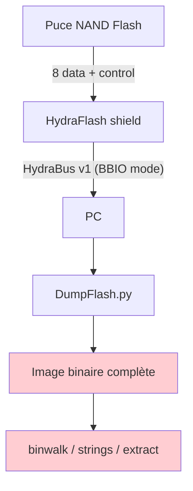
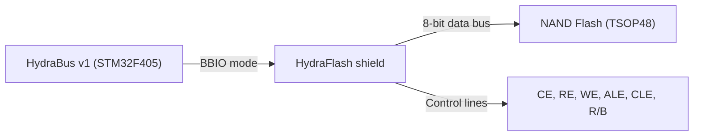
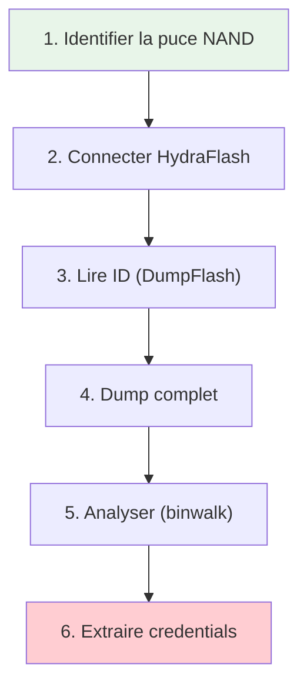
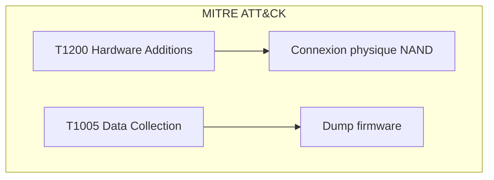
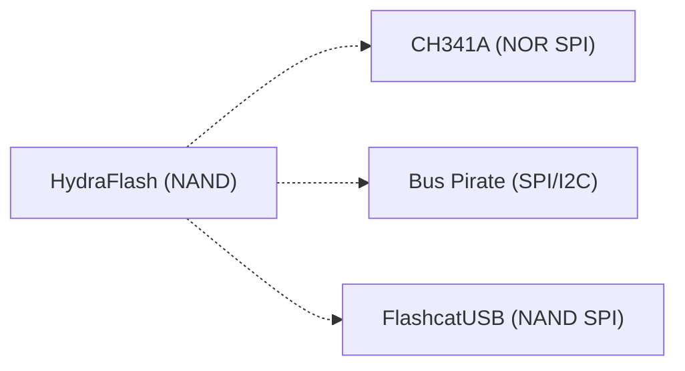

# HydraFlash

> [!info] **En 1 phrase**
> HydraFlash = le **shield NAND Flash** de l'HydraBus, conçu pour **dumper le
> contenu de puces NAND** (firmware, données) directement depuis leur PCB.

---

## Overview

| Champ | Valeur |
|---|---|
| **Type** | Shield hardware / Outil de dump NAND Flash |
| **Domaine** | Hardware Hacking / Firmware Extraction |
| **Niveau** | Intermediate → Advanced |
| **OS cibles** | Linux embedded (routeurs, caméras, IoT) |
| **Matériel requis** | HydraBus v1, HydraFlash shield, PC, câbles |
| **Complexité** | Moyenne → Élevée |
| **Dernière mise à jour** | 2026-08-16 |

> [!info] **Diagramme de contexte**
> ```mermaid
> flowchart LR
>     A["NAND Flash (PCB cible)"] -->|"soudures / test pads"| B["HydraFlash shield"]
>     B -->|"HydraBus"| C["PC"]
>     C -->|"DumpFlash.py"| D["Dump firmware .bin"]
>     D --> E["Analyse: binwalk, strings"]
>     style A fill:#e1f5fe
>     style E fill:#c8e6c9
> ```

---

## Concept

Les puces **NAND Flash** stockent le firmware et les données de routeurs, caméras, smart TV et objets connectés. HydraFlash est un shield open hardware qui se connecte à l'HydraBus v1 pour lire et écrire directement ces puces NAND. L'outil `DumpFlash.py` gère les bad blocks, la lecture en pages, et l'extraction de partitions (U-Boot, kernel, rootfs).



---

## Concepts fondamentaux

### NAND Flash vs NOR Flash

| Terme | Définition |
|---|---|
| **NAND Flash** | Mémoire non-volatile à blocs — pages de 512/2048/4096 octets, bad blocks gérés par ECC |
| **NOR Flash** | Mémoire non-volatile à octets — accès aléatoire, plus lente en écriture |
| **Bad Block** | Bloc défectueux en usine ou usagé — la NAND en contient par nature |
| **OOB (Out-of-Band)** | Zone de métadonnées par page (ECC, statut bad block) |
| **ECC** | Error Correction Code — correction d'erreurs en lecture NAND |
| **BBIO mode** | Binary Bus I/O — mode de l'HydraBus pour contrôle bas-niveau des bus |

### HydraBus + HydraFlash

L'HydraBus v1 est une carte multi-protocole open-source basée sur un STM32F405. Le shield HydraFlash ajoute le connecteur et les lignes de contrôle spécifiques à la NAND (CE, RE, WE, ALE, CLE, R/B).



---

## Matériel / Composants

### Outils principaux

| Outil | Type | Usage | Prix | Source |
|---|---|---|---|---|
| HydraBus v1 | Carte multi-protocole | Contrôle NAND | ~60-80€ | hydrabus.com |
| HydraFlash | Shield NAND | Connexion directe NAND | ~20-30€ | hydrabus.com (open HW) |
| PC | Station de travail | DumpFlash.py | — | — |
| Câbles dupont / test clips | Connexions | Connecter aux pads | ~5€ | — |

### Puces NAND supportées

| Fabricant | Modèle | Capacité | Package | Voltage |
|---|---|---|---|---|
| Samsung | K9F1G08U0C | 16 MB (x8) | TSOP48 | 3.3V |
| Samsung | K9F2G08U0C | 256 MB (x8) | TSOP48 | 3.3V |
| Samsung | K9F4G08U0A | 512 MB (x8) | TSOP48 | 3.3V |
| Hynix | HY27US08281A | 16 MB (x8) | TSOP48 | 3.3V |
| Hynix | HY27UF082G2M | 256 MB (x8) | TSOP48 | 3.3V |
| Micron | MT29F2G08ABAEAWP | 256 MB (x8) | TSOP48 | 3.3V |
| Spansion | S29GL128P | 16 MB (x16) | TSOP56 | 3.3V |

> [!note] À vérifier
> La liste complète des puces supportées dépend de la version de DumpFlash et du firmware HydraFW. Les NAND en mode 8-bit (x8) sont les plus courants.

### Pinout HydraFlash (connecteur NAND TSOP48)

| NAND Pin | HydraBus Pin | Signal |
|---|---|---|
| 9 | PB4 | CE# — Chip Enable |
| 7 | PB0 | RB# — Read/Busy |
| 16 | PB3 | CL — Command Latch |
| 17 | PB2 | AL — Address Latch |
| 8 | PB5 | RE# — Read Enable |
| 18 | PB1 | WE# — Write Enable |
| 19 | GND/3.3V | WP# — Write Protect |
| 29 | PC0 | IO0 (bit 0) |
| 30 | PC1 | IO1 (bit 1) |
| 31 | PC2 | IO2 (bit 2) |
| 32 | PC3 | IO3 (bit 3) |
| 41 | PC4 | IO4 (bit 4) |
| 42 | PC5 | IO5 (bit 5) |
| 43 | PC6 | IO6 (bit 6) |
| 44 | PC7 | IO7 (bit 7) |
| 12, 37 | 3.3V | Vcc |
| 13, 36 | GND | Vss |

---

## Protocoles

### Bus NAND Flash

| Paramètre | Valeur |
|---|---|
| **Type** | Parallèle 8-bit |
| **Vitesse** | Variable (selon timing NAND) |
| **Voltage** | 3.3V (standard) |
| **Nombre de fils** | 8 data + 6 control + power |
| **Direction** | Full-duplex |

---

## Installation / Setup

### Prérequis

| Composant | Version | Lien |
|---|---|---|
| Python | 2.7 (DumpFlash.py) | https://python.org |
| HydraBus Firmware (HydraFW) | Latest | https://github.com/hydrabus/hydrafw |
| DumpFlash-Hydrabus | Latest | https://github.com/hydrabus/DumpFlash-Hydrabus |
| HydraBus v1 | Hardware | https://hydrabus.com |
| HydraFlash shield | Hardware | https://github.com/hydrabus/HydraFlash |

### Installation DumpFlash

```bash
# Cloner DumpFlash
git clone https://github.com/hydrabus/DumpFlash-Hydrabus.git
cd DumpFlash-Hydrabus

# Installation (Python 2)
pip2 install git+https://github.com/hydrabus/DumpFlash-Hydrabus

# Vérification
python2 DumpFlash.py --help
```

### Connexion physique

```
HydraBus v1 (via HydraFlash shield)
│
│  CE#  (PB4) ──────────── Pin 9 NAND
│  RB#  (PB0) ──────────── Pin 7 NAND
│  CL   (PB3) ──────────── Pin 16 NAND
│  AL   (PB2) ──────────── Pin 17 NAND
│  RE#  (PB5) ──────────── Pin 8 NAND
│  WE#  (PB1) ──────────── Pin 18 NAND
│  WP#  (GND/3.3V) ────── Pin 19 NAND
│  IO0-IO7 (PC0-PC7) ──── Pins 29-44 NAND
│  Vcc  (3.3V) ────────── Pins 12,37 NAND
│  GND  ────────────────── Pins 13,36 NAND
```

---

## Configuration

### Mode HydraBus

```text
Le HydraBus doit être en mode BBIO (Binary Bus I/O) pour DumpFlash.
Le firmware HydraFW supporte le mode NAND Flash natif.
```

### Pins HydraBus utilisées

| HydraBus Pin | Signal NAND | Direction |
|---|---|---|
| PB0 | RB# (Read/Busy) | Input |
| PB1 | WE# (Write Enable) | Output |
| PB2 | AL (Address Latch) | Output |
| PB3 | CL (Command Latch) | Output |
| PB4 | CE# (Chip Enable) | Output |
| PB5 | RE# (Read Enable) | Output |
| PC0-PC7 | IO0-IO7 (Data) | Bidirectionnel |

---

## Commandes / Manipulations

### Commandes DumpFlash

```bash
# Lancement en mode interactif
python2 DumpFlash.py -d /dev/hydrabus -i

# Lecture de l'ID de la puce
python2 DumpFlash.py -d /dev/hydrabus --read-id

# Dump complet
python2 DumpFlash.py -d /dev/hydrabus --read flash_dump.bin

# Écriture
python2 DumpFlash.py -d /dev/hydrabus --write firmware.bin
```

### Options DumpFlash

| Option | Description | Exemple |
|---|---|---|
| `-d` | Port série HydraBus | `-d /dev/hydrabus` |
| `-i` | Mode interactif | `-i` |
| `--read` | Lire la flash | `--read output.bin` |
| `--write` | Écrire sur la flash | `--write firmware.bin` |
| `--read-id` | Lire l'ID de la puce | `--read-id` |
| `--chip` | Type de puce | `--chip K9F1G08U0C` |

### Mode interactif

```text
DumpFlash.py -i
> Sélectionner la puce (ou auto-detect)
> Choisir : Read / Write / Erase
> Lire ID: EC F1 C0 95 D1
> Puce: Samsung K9F1G08U0C (16 MB)
> Démarrer le dump...
```

---

## Exemples pratiques

### Débutant — Lecture de l'ID NAND

```bash
# Connecter HydraBus + HydraFlash au PCB cible
python2 DumpFlash.py -d /dev/hydrabus -i
# Sélectionner "Read ID"
# Résultat : Fabricant, modèle, taille de la puce
```

### Intermédiaire — Dump complet d'un routeur

```bash
# Dump complet de 16 MB
python2 DumpFlash.py -d /dev/hydrabus --read routeur_dump.bin

# Vérification
md5sum routeur_dump.bin
ls -la routeur_dump.bin

# Analyse initiale
binwalk routeur_dump.bin
strings routeur_dump.bin | head -50
```

### Avancé — Extraction de credentials depuis NAND dump

```python
#!/usr/bin/env python3
"""Extraction de credentials depuis un dump NAND Flash"""
import sys
import re
import struct

def parse_nand_dump(filepath):
    with open(filepath, 'rb') as f:
        data = f.read()

    print(f"[*] Taille du dump: {len(data)} octets ({len(data)//1024} KB)")

    # Recherche de partitions
    partitions = {
        b'U-Boot': 'Bootloader U-Boot',
        b'Linux': 'Kernel Linux',
        b'rootfs': 'Système de fichiers',
        b'JFFS2': 'Système JFFS2',
        b'UBIFS': 'Système UBIFS',
    }
    for marker, name in partitions.items():
        idx = data.find(marker)
        if idx >= 0:
            print(f"[+] Partition '{name}' trouvée à offset 0x{idx:x}")

    # Recherche de credentials
    patterns = [
        (b'password', 'Mot de passe'),
        (b'admin', 'Identifiant admin'),
        (b'root', 'Compte root'),
        (b'mqtt', 'Broker MQTT'),
        (b'http://', 'URL HTTP'),
        (b'https://', 'URL HTTPS'),
    ]
    for pat, desc in patterns:
        idx = data.find(pat)
        if idx >= 0:
            context = data[max(0,idx-20):idx+60]
            print(f"[+] {desc}: {context.decode(errors='replace')}")

if __name__ == "__main__":
    parse_nand_dump(sys.argv[1])
```

### Expert — Reconstruction de filesystem JFFS2

```text
1. Dump complet de la NAND (256 MB - 1 GB)
2. Identifier les partitions avec binwalk
3. Extraire les sections JFFS2/UBIFS
4. Monter le filesystem avec jefferson (JFFS2) ou mtd-utils (UBIFS)
5. Analyser les fichiers de configuration
6. Extraire les credentials et la logique applicative
```

---

## Workflow complet (scénario pas à pas)



### Étape 1 — Identification

| Action | Commande | Résultat |
|---|---|---|
| Identifier la puce | `DumpFlash.py --read-id` | Fabricant, modèle |
| Repérer les pads | Inspection visuelle | Connexions NAND |

### Étape 2 — Connexion

| Méthode | Difficulté | Fiabilité |
|---|---|---|
| Test clips (SOIC clip) | Faible | Élevée |
| Soudure directe | Moyenne | Très élevée |
| Pogo pins | Moyenne | Élevée |

### Étape 3 — Dump

```bash
python2 DumpFlash.py -d /dev/hydrabus --read nand_dump.bin
```

### Étape 4 — Analyse

```bash
binwalk nand_dump.bin
strings nand_dump.bin | grep -iE "password|key|admin|root"
```

### Étape 5 — Post-exploitation

```python
# Extraction de partitions et credentials
python3 analyze_nand.py nand_dump.bin
```

---

## Scénarios avancés

### Scénario 1 — Dump firmware routeur Linksys/Ethical

| Élément | Détail |
|---|---|
| **Objectif** | Extraire le firmware d'un routeur pour reverse engineering |
| **Matériel** | HydraBus + HydraFlash, clips SOIC-48, PC |
| **Étapes** | 1. Identifier NAND sur PCB<br>2. Connecter clips<br>3. Dump 16-256 MB<br>4. Analyser avec binwalk |
| **Résultat** | Firmware complet extrait |
| **Difficulté** | |


### Scénario 2 — Récupération de données depuis caméra IP

| Élément | Détail |
|---|---|
| **Objectif** | Récupérer les credentials et configuration d'une caméra IP |
| **Matériel** | HydraBus + HydraFlash, PC |
| **Étapes** | 1. Démonter la caméra<br>2. Identifier la NAND (souvent TSOP48)<br>3. Dump complet<br>4. Extraire les fichiers de config |
| **Résultat** | Credentials admin, RTSP stream URL |
| **Difficulté** | |

---

## Cybersecurity use cases

| Use case | Sévérité | Matériel requis | Impact |
|---|---|---|---|
| Dump firmware NAND | Élevée | HydraBus + HydraFlash | Extraction complète |
| Extraction credentials | Élevée | Idem | Accès admin |
| Reverse engineering | Moyenne | PC | Compréhension logique |
| Récupération données | Élevée | Idem | Données sensibles |

| Phase pentest | Ce que permet cette technique |
|---|---|
| Recon | Identification du modèle NAND |
| Collecte | Dump complet du firmware |
| Analyse | Extraction de credentials et logique |
| Exploitation | Modification du firmware reflashé |

---

## MITRE ATT&CK

| Technique ID | Nom | Catégorie | Applicabilité |
|---|---|---|---|
| T1200 | Hardware Additions | Initial Access | HydraFlash connecté au PCB |
| T1005 | Data from Local System | Collection | Dump NAND Flash |
| T1027 | Obfuscated Files | Defense Evasion | Firmware chiffré |



---

## Defensive Security

### Détection

| Signal de détection | Source | Fiabilité |
|---|---|---|
| Connexion physique sur NAND | Inspection PCB | Élevée |
| Dump en cours | Bus NAND monitoring | Moyenne |
| Flash modifiée | Checksum/boot verify | Élevée |

### Prévention

| Mesure | Efficacité | Coût | Priorité |
|---|---|---|---|
| Chiffrement firmware | Élevée | Moyen | Haute |
| Resin potting | Élevée | Faible | Haute |
| Secure boot | Élevée | Gratuit | Haute |

### Durcissement (hardening)

```text
- Utiliser des puces NAND avec ECC intégré
- Chiffrer le firmware avant stockage (dm-crypt, LUKS)
- Appliquer du resin potting sur les puces sensibles
- Activer le secure boot pour vérifier l'intégrité
- Désactiver les interfaces de debug en production
```

---

## Automatisation

### Scripts d'exploitation

```python
#!/usr/bin/env python3
"""Dump et analyse NAND avec HydraBus"""
import subprocess
import os

def dump_nand(port="/dev/hydrabus", output="nand_dump.bin"):
    cmd = [
        "python2", "DumpFlash.py",
        "-d", port,
        "--read", output
    ]
    subprocess.run(cmd, check=True)

def analyze_nand(filepath):
    with open(filepath, 'rb') as f:
        data = f.read()
    print(f"[+] Taille: {len(data)} octets")
    # Recherche de patterns
    import re
    urls = re.findall(rb"https?://[\x20-\x7e]+", data)
    creds = re.findall(rb"(password|passwd|key|token)[\x00-\x20]*[\x20-\x7e]+", data, re.I)
    print(f"[+] URLs: {len(urls)}")
    print(f"[+] Credentials: {len(creds)}")
    for c in creds[:10]:
        print(f"    {c.decode(errors='replace')}")

if __name__ == "__main__":
    dump_nand()
    analyze_nand("nand_dump.bin")
```

---

## Output et parsing

### Formats de sortie

| Format | Exemple | Utilité |
|---|---|---|
| Binary (.bin) | `nand_dump.bin` | Dump brut NAND |
| Text | DumpFlash logs | Statut, ID puce |

### Parsing des résultats

```bash
strings nand_dump.bin | grep -iE "password|key|admin|root"
binwalk nand_dump.bin
```

---

## Intégrations

- [[13 - Hardware & IoT| Hardware & IoT]] global
- [[Hardware - Dump et Analyse de Firmware| Dump de firmware]]
- [[Hardware - I2C et SPI| I2C/SPI]]

| Outils associés | Usage complémentaire |
|---|---|
| CH341A | Flash SPI (NOR) |
| Bus Pirate | SPI/I2C basique |
| flashrom | Flash NOR SPI |

---

## Alternatives

| Alternative | Avantages | Inconvénients | Cas d'usage |
|---|---|---|---|
| CH341A | Très bon marché | NOR SPI uniquement | Flash NOR |
| Bus Pirate | Multi-protocole | Pas de NAND natif | SPI/I2C basique |
| FlashcatUSB | NAND dédié | Moins accessible | NAND SPI |
| J-Link | Flash interne MCU | Pas de NAND externe | MCU flash |



---

## Performance

| Métrique | Valeur | Impact |
|---|---|---|
| Vitesse lecture | ~500 KB/s | Dump 256 MB ~8 min |
| Vitesse écriture | ~200 KB/s | Flash lent |
| Fiabilité | Élevée | Gestion ECC/bad blocks |

---

## Troubleshooting

| Problème | Cause probable | Solution |
|---|---|---|
| ID non détecté | Mauvais wiring | Vérifier connexions CE/RE/WE |
| Bad blocks nombreux | NAND usagée | Dump complet + BBT |
| Dump corrompu | Timing incorrect | Réduire la vitesse |

### Erreurs courantes

```
Erreur : "No NAND detected"
Cause : Connexions défaillantes
Solution : Vérifier les 8 lignes data + 6 control
```

### Diagnostic

```bash
python2 DumpFlash.py -d /dev/hydrabus --read-id
dmesg | tail
lsusb | grep -i hydrabus
```

---

## Sécurité

| Risque | Impact | Mitigation |
|---|---|---|
| Firmware en clair | Extraction complète | Chiffrement firmware |
| Bad blocks gérés | Dump fiable | BBT + vérification |

> [!warning] Points de sécurité
> - **NAND ≠ NOR** : la NAND a des **bad blocks** et une disposition en pages
> - Utiliser `DumpFlash.py` qui gère ça correctement
> - Relire la puce **plusieurs fois** et comparer les hashs pour valider l'intégrité

### Restrictions légales

> [!danger] Cadre légal
> Le dump de NAND Flash sans autorisation est illégal. Techniques pour pentest autorisé uniquement.

---

## Limitations

| Limite | Impact | Contournement |
|---|---|---|
| NAND en pages | Pas d'accès octet | DumpFlash gère les pages |
| Bad blocks | Données manquantes | BBT + multi-read |
| HydraBus = 3.3V | Pas de 1.8V/5V | Level shifter |
| SPI NAND non supporté | Nouvelles puces | FlashcatUSB |

### Cas où cette technique ne fonctionne pas

| Scénario | Raison |
|---|---|
| NAND SPI | HydraFlash = NAND parallèle |
| Puce soudée BGA | Pas d'accès physique |
| Resin potting | Pas d'accès aux pads |

---

## Cheatsheet

```
┌──────────────────────────────────────────────────────┐
│ HydraFlash — Cheatsheet                              │
├──────────────────────────────────────────────────────┤
│ ID :         DumpFlash.py -d /dev/hydrabus --read-id │
│ Dump :       DumpFlash.py -d /dev/hydrabus --read out│
│ Write :      DumpFlash.py -d /dev/hydrabus --write fw│
│ Interactif : DumpFlash.py -d /dev/hydrabus -i        │
│ Analyse :    binwalk dump.bin                        │
│ Strings :    strings dump.bin | grep password         │
│ NAND ≠ NOR : bad blocks, pages, ECC !                 │
│ Re-read :    comparer hashs multi-lectures           │
└──────────────────────────────────────────────────────┘
```

| Action | Commande |
|---|---|
| Read ID | `python2 DumpFlash.py -d /dev/hydrabus --read-id` |
| Dump | `python2 DumpFlash.py -d /dev/hydrabus --read output.bin` |
| Write | `python2 DumpFlash.py -d /dev/hydrabus --write firmware.bin` |
| Interactive | `python2 DumpFlash.py -d /dev/hydrabus -i` |

---

## Quick reference

| Élément | Valeur / Commande |
|---|---|
| **Fonction** | Dump/Flash NAND parallèle |
| **Data bus** | 8-bit (IO0-IO7) |
| **Voltage** | 3.3V |
| **Logiciel principal** | DumpFlash.py (Python 2) |
| **Commande rapide** | `DumpFlash.py -d /dev/hydrabus --read-id` |
| **Bus** | HydraBus BBIO mode |

---

## Détection & Défense

| Signal | Méthode de détection | Outil |
|---|---|---|
| Connexion NAND | Inspection PCB | Observation |
| Trafic NAND | Bus monitoring | Logic analyzer |

| Countermeasure | Efficacité | Implémentation |
|---|---|---|
| Chiffrement firmware | Élevée | dm-crypt |
| Resin potting | Élevée | Processus de fabrication |
| Secure boot | Élevée | Vérification hash |

> [!tip] Défense
> - Les mécanismes d'update (FOTA) révèlent souvent la façon de flasher
> - Le resin potting / shield électronique complique l'accès aux pads
> - Chiffrer le firmware avant stockage sur NAND

---

## Tips & Pièges

- **Piège 1** : NAND ≠ NOR : la NAND a des **bad blocks** et une disposition en pages.
- **Piège 2** : Toujours relire la puce **plusieurs fois** et comparer les hashs.
- **Piège 3** : Le dump NAND doit être analysé avec **binwalk / strings**.
- **Astuce 1** : Vérifier que le firmware HydraFW supporte le mode NAND.
- **Astuce 2** : Chercher les partitions (U-Boot, kernel, rootfs) dans le dump.
- **Astuce 3** : Les clips SOIC-48 facilitent l'accès sans soudure.
- **Bonne pratique** : Sauvegarder le dump original avant toute analyse.

> [!tip] Astuces
> - DumpFlash gère les bad blocks automatiquement
> - Les dumps NAND de routeurs contiennent souvent U-Boot + Linux
> - Utiliser `binwalk -e` pour extraire automatiquement les filesystems

---

## References

> [!info] **Sources**
> - [HardwareAllTheThings — HydraFlash](https://github.com/swisskyrepo/HardwareAllTheThings/blob/main/docs/gadgets/hydraflash.md)
> - [HydraFlash — GitHub](https://github.com/hydrabus/HydraFlash)
> - [DumpFlash-Hydrabus — GitHub](https://github.com/hydrabus/DumpFlash-Hydrabus)
> - [HydraFW NAND Flash Guide](https://github.com/hydrabus/hydrafw/wiki/HydraFW-NAND-Flash-guide)

### Documentation officielle

| Source | URL | Type |
|---|---|---|
| HydraBus | https://hydrabus.com/ | Produit |
| HydraFlash | https://github.com/hydrabus/HydraFlash | Open HW |
| DumpFlash | https://github.com/hydrabus/DumpFlash-Hydrabus | Outil |

### Vidéos / Tutorials

| Titre | Auteur | Lien |
|---|---|---|
| Reverse Engineering Flash Memory | Black Hat 2014 | YouTube |
| HydraBus NAND Flash Demo | hydrabus | YouTube |

### Livres / Articles

| Titre | Auteur | Année |
|---|---|---|
| Reverse Engineering Flash Memory for Fun and Benefit | B. Oh et al. | 2014 |

---

**Liens :** [[13 - Hardware & IoT| Hardware & IoT]] · [[Hardware - Dump et Analyse de Firmware| Dump de firmware]] · [[Hardware - I2C et SPI| I2C/SPI]]
