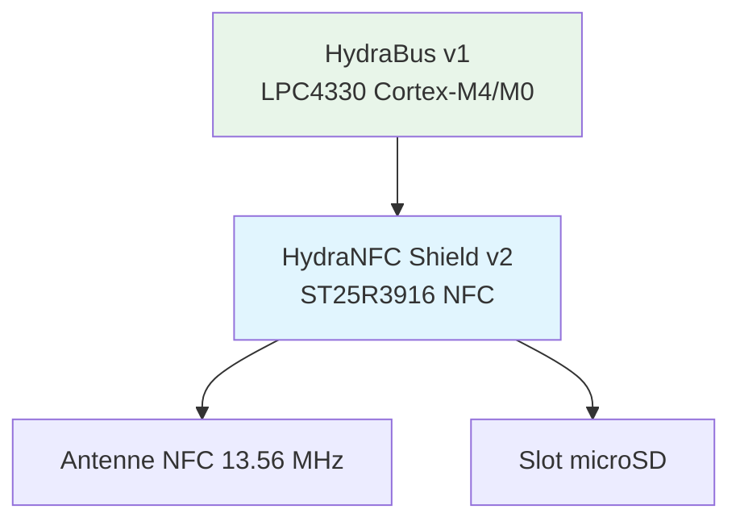
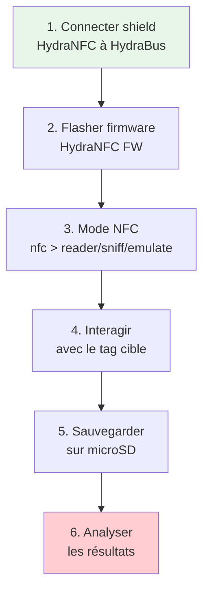

---

# HydraNFC Shield v2

> [!info] **En 1 phrase**
> Le **HydraNFC Shield v2** est un shield NFC open-source basé sur le chipset
> **ST25R3916**, offrant le sniffing, l'émulation, la lecture et l'écriture de tags
> **ISO14443A/B, ISO15693, ISO18092 (NFC-DEP)** — le compagnon NFC de l'**HydraBus v1**.

![[Images/HardwareAllTheThings/hydrabus_hydranfc_shield_v2.jpg]]

---

## Overview

| Champ | Valeur |
|---|---|
| **Type** | Shield NFC open-source |
| **Domaine** | Hardware Hacking — NFC / RFID HF |
| **Niveau** | Intermediate → Expert |
| **OS cibles** | Tous devices NFC (phones, badges, readers) |
| **Matériel requis** | HydraBus v1 + HydraNFC Shield v2 + câbles |
| **Complexité** | Moyenne |
| **Dernière mise à jour** | 2026-08-16 |

---

## Concept

> HydraNFC Shield v2 est une extension pour **HydraBus v1** ajoutant la communication
> **NFC (Near Field Communication)** via le chip **ST25R3916** de STMicroelectronics.
> Il est utilisé via le firmware **HydraNFC FW**.

> [!info] **Le contexte**
> - **ST25R3916** : chip reader NFC HF 13.56 MHz, toutes les variantes ISO14443
> - **HydraBus v1** : plateforme hôte (LPC4330, Cortex-M4 204 MHz)
> - **Modes** : reader, sniffing, emulation
> - **Stockage** : microSD FAT16/FAT32 (dumps)



---

## Concepts fondamentaux

### Architecture HydraNFC Shield v2

| Composant | Spécification | Rôle |
|---|---|---|
| NFC IC | ST25R3916 | Reader NFC HF 13.56 MHz |
| Protocoles | ISO14443A/B, ISO15693, ISO18092 | Communication NFC |
| Interface | FPC → HydraBus v1 | Connexion plateforme hôte |
| Stockage | microSD FAT16/FAT32 | Dumps, dumps massifs |
| Antenne | Intégrée ou externe | Émission/réception RF |

### Protocoles NFC supportés

| Protocole | Type | Usage |
|---|---|---|
| ISO14443A | Proximité | MIFARE, NTAG, Ultralight |
| ISO14443B | Proximité | ePassport, Calypso |
| ISO15693 | Vicinity (jusqu'à 1m) | ICODE, cartes longue portée |
| ISO18092 | NFC-DEP | P2P NFC, NFC Forum |

### ST25R3916 vs PN532 vs ACR122U

| Caractéristique | ST25R3916 | PN532 | ACR122U |
|---|---|---|---|
| ISO14443A/B | Oui | Oui | Oui |
| ISO15693 | Oui | Oui | Oui |
| NFC-DEP | Oui | Oui | Non |
| Sniffing | HydraNFC FW | NFTEdge | PCSC |
| Price | ~60€ | ~30€ | ~80€ |
| Open-source | Firmware | Firmware | Non |

---

## Matériel / Composants

### Outils principaux

| Outil | Type | Usage | Prix | Source |
|---|---|---|---|---|
| HydraNFC Shield v2 | Shield NFC | NFC ISO14443A/B, ISO15693 | ~60€ | hydrabus.com |
| HydraBus v1 | Plateforme hôte | LPC4330 Cortex-M4 | ~60€ | hydrabus.com |
| Antenne NFC externe | Antenne HF | Amélioration portée | ~10€ | Amazon |
| microSD 32 Go FAT32 | Stockage | Dumps tags | ~10€ | Amazon |

### Cibles NFC typiques

| Catégorie | Exemples | NFC Type | Vulnérabilités |
|---|---|---|---|
| Badges d'accès | MIFARE Classic 1K/4K | ISO14443A | Crypto-1 faible |
| Tickets transport | MIFARE Ultralight C | ISO14443A | Auth faible |
| Passeports | ePassport | ISO14443B | Chip inséré |
| Tags NFC | NTAG213/215/216 | ISO14443A | Données ouvertes |
| Lecteurs NFC | Readers fixe | ISO14443A/B | Sniffing possible |

### Câblage HydraNFC → HydraBus

```
HydraNFC Shield v2          HydraBus v1
┌─────────────────┐         ┌─────────────────┐
│ FPC Connector   │ ──────→ │ FPC Port        │
│ VCC (3.3V)      │ ──────→ │ VCC 3.3V        │
│ GND             │ ──────→ │ GND             │
│ SPI_MISO        │ ──────→ │ SPI_MISO        │
│ SPI_MOSI        │ ──────→ │ SPI_MOSI        │
│ SPI_SCK         │ ──────→ │ SPI_SCK         │
│ SPI_CS          │ ──────→ │ SPI_CS (GPIO)   │
│ IRQ             │ ──────→ │ GPIO IRQ        │
└─────────────────┘         └─────────────────┘
```

---

## Protocoles

### ISO14443A

| Paramètre | Valeur |
|---|---|
| **Type** | Proximité |
| **Fréquence** | 13.56 MHz |
| **Distance** | < 10 cm |
| **Débit** | 106 / 212 / 424 / 848 kbit/s |
| **Usage** | MIFARE, NTAG, Ultralight |

### ISO15693

| Paramètre | Valeur |
|---|---|
| **Type** | Vicinity |
| **Distance** | Jusqu'à 1 m |
| **Débit** | 26.48 kbit/s |
| **Usage** | ICODE, cartes longue portée |

---

## Installation / Setup

### Prérequis

| Composant | Version | Lien |
|---|---|---|
| HydraNFC FW | v2.1.4+ | github.com/hydrabus/hydrafw_hydranfc_shield_v2 |
| dfu-util | Latest | git.code.sf.net/p/dfu-util |
| HydraBus v1 | Rev 1.5+ | hydrabus.com |

### Flash du firmware HydraNFC

```bash
# Cloner le firmware
git clone https://github.com/hydrabus/hydrafw_hydranfc_shield_v2.git
cd hydrafw_hydranfc_shield_v2

# Télécharger la dernière release OU compiler
wget https://github.com/hydrabus/hydrafw_hydranfc_shield_v2/releases/latest
# make clean && make

# Mode DFU : maintenir UBTN → RESET
sudo dfu-util -i 0 -a 0 -d 0483:df11 -D ./build/hydranfc_shield_v2.dfu

# Vérifier
screen /dev/ttyACM0 115200
> show system
```

### Vérification post-installation

```text
> show system
HydraNFC Shield v2 — Firmware: hydranfc_shield_v2 v2.1.4
NFC IC: ST25R3916

> nfc
nfc> help
```

---

## Configuration

### Modes HydraNFC

| Mode | Description | Commande |
|---|---|---|
| Reader | Lire des tags NFC | `nfc > reader` |
| Sniffing | Capturer trafic NFC | `nfc > sniff` |
| Emulation | Émuler un tag NFC | `nfc > emulate` |
| Record | Enregistrer sur microSD | `nfc > record` |

### Slots microSD

| Slot | Description | Format |
|---|---|---|
| Slot 1 | Dump tags | FAT16/FAT32 |
| Slot 2 | Logs sniffing | FAT16/FAT32 |

> [!tip] Tips
> - La carte microSD doit être FAT16 ou FAT32, max 32 Go
> - Les dumps sont enregistrés au format binaire brut

---

## Commandes / Manipulations

### Commandes NFC essentielles

| Commande | Description |
|---|---|
| `nfc` | Entrer en mode NFC |
| `reader poll` | Scanner les tags à proximité |
| `reader read <uid>` | Lire un tag par son UID |
| `reader scan` | Scan complet (ISO14443A/B + ISO15693) |
| `sniff start / stop` | Démarrer / arrêter le sniffing |
| `sniff save <file>` | Sauvegarder sur microSD |
| `emulate tag <type>` | Émuler un tag (MF Ultralight, NTAG...) |
| `emulate uid <uid>` | Émuler un tag avec un UID spécifique |
| `show system` | Info système HydraNFC |
| `show pins` | Pinout des broches |

---

## Exemples pratiques

### Débutant — Lecture d'un tag NFC

```text
# 1. Connecter le shield HydraNFC à HydraBus
# 2. Flasher le firmware HydraNFC
# 3. Connecter en série
screen /dev/ttyACM0 115200

# 4. Scanner les tags
nfc> reader
nfc> reader poll
# Résultat : UID du tag, type (MIFARE, NTAG...)

# 5. Lire le contenu
nfc> reader read <UID>
```

### Intermédiaire — Sniffing de trafic NFC

```text
nfc> sniff
nfc> sniff start
# Approcher un reader et un tag...
nfc> sniff stop
nfc> sniff save /sd/sniff_capture.bin
```

### Avancé — Émulation d'un tag MIFARE

```text
nfc> emulate
nfc> emulate tag mf_classic_1k
nfc> emulate uid 04:AA:BB:CC:DD:EE:FF:00
# Le tag est maintenant présentable à un reader
```

### Expert — Sniffing + analyse protocole NFC

```text
nfc> sniff
nfc> sniff start
# Capturer : REQ/WUP → ATQA → ANTICOLL → SELECT → AUTH → READ/WRITE
nfc> sniff stop
nfc> sniff save /sd/protocol_trace.bin
# Analyser : hexdump -C protocol_trace.bin
```

---

## Workflow complet (scénario pas à pas)



| Étape | Action | Commande |
|---|---|---|
| 1. Setup | `show system` + `show pins` | Vérifier firmware + pinout |
| 2. Lecture | `reader poll` → `reader read <UID>` | Lire tag |
| 3. Sniffing | `sniff start` → `sniff stop` | Capturer trafic |
| 4. Émulation | `emulate tag <type>` | Émuler tag |

---

## Scénarios avancés

### Scénario 1 — Clonage d'un badge MIFARE Classic

| Élément | Détail |
|---|---|
| **Objectif** | Cloner un badge MIFARE Classic d'accès |
| **Matériel** | HydraNFC Shield v2 + HydraBus v1 + tag vierge MIFARE |
| **Étapes** | 1. Lire badge → 2. Extraire clés → 3. Écrire sur tag vierge |
| **Résultat** | Badge cloné fonctionnel |
| **Difficulté** | |

### Scénario 2 — Sniffing de session NFC Android

| Élément | Détail |
|---|---|
| **Objectif** | Capturer la communication phone ↔ lecteur NFC |
| **Matériel** | HydraNFC Shield v2 + HydraBus v1 |
| **Étapes** | 1. Sniff mode → 2. Phone scanne reader → 3. Analyse protocole |
| **Résultat** | Session NFC complète capturée |
| **Difficulté** | |

---

## Cybersecurity use cases

| Use case | Sévérité | Impact |
|---|---|---|
| Clonage badge accès | Élevée | Accès non autorisé |
| Sniffing NFC | Élevée | Fuite données |
| Émulation tag | Élevée | Spoofing identité |
| Lecture passeport | Élevée | Fuite données personnelles |

| Phase pentest | Ce que permet cette technique |
|---|---|
| Recon | Lecture UID/tags à proximité |
| Accès initial | Clonage badge d'accès |
| Post-exploitation | Émulation tag pour accès physique |

---

## MITRE ATT&CK

| Technique ID | Nom | Catégorie | Applicabilité |
|---|---|---|---|
| T1200 | Hardware Additions | Initial Access | HydraNFC physique |
| T1040 | Network Sniffing | Credential Access | Sniffing NFC |
| T1098 | Account Manipulation | Persistence | Clonage badge |
| T1557 | Adversary-in-the-Middle | Collection | Sniffing session NFC |

---

## Defensive Security

### Détection

| Signal de détection | Source | Fiabilité |
|---|---|---|
| Lecteur NFC inconnu actif | Monitoring RF | Moyenne |
| Badge cloné utilisé | Logs accès physique | Moyenne |
| Session NFC interrompue | Logs reader | Variable |

### Prévention

| Mesure | Efficacité | Coût | Priorité |
|---|---|---|---|
| Chiffrer communication NFC | Élevée | Élevée | Haute |
| Badge à chiffrement (DESFire) | Élevée | Élevée | Haute |
| Détection RF passive | Moyenne | Élevée | Moyenne |

> [!warning] Points de sécurité
> - Le sniffing NFC nécessite un accès physique à la zone de communication
> - Les badges MIFARE Classic sont particulièrement vulnérables au sniffing
> - Les passeports ePassport ont une protection par chiffrement (BAC)
> - La détection de sniffing NFC est très difficile sans équipement spécialisé

---

## Automatisation

```python
#!/usr/bin/env python3
"""Script de sniffing NFC via HydraNFC Shield v2"""
import serial, time

def connect(port="/dev/ttyACM0"):
    return serial.Serial(port, 115200, timeout=2)

def send(ser, cmd):
    ser.write((cmd + "\n").encode())
    time.sleep(0.5)
    return ser.read(ser.inWaiting()).decode(errors="ignore")

def scan_tags(ser):
    return send(ser, "nfc > reader poll")

def sniff_start(ser):
    send(ser, "nfc")
    return send(ser, "sniff start")

def sniff_stop_save(ser, filename="sniff.bin"):
    send(ser, "sniff stop")
    send(ser, f"sniff save /sd/{filename}")

def emulate_tag(ser, uid=None):
    send(ser, "nfc")
    if uid:
        return send(ser, f"emulate uid {uid}")
    return send(ser, "emulate tag mf_classic_1k")

ser = connect()
print(scan_tags(ser))
```

| Outil | Usage |
|---|---|
| HydraNFC FW | Firmware Shield |
| libnfc | Bibliothèque NFC |
| mfoc | Brute-force MIFARE |

---

## Output et parsing

| Format | Utilité |
|---|---|
| UID hex | Identification tag |
| Blocs hex | Analyse contenu |
| Dump binaire (.bin) | Analyse hors-ligne |
| microSD FAT | Dumps massifs |

```bash
hexdump -C sniff_capture.bin | head -20
xxd sniff_capture.bin | head -40
```

---

## Intégrations

- [[13 - Hardware & IoT| Hardware & IoT]] global
- [[Hardware - RFID MIFARE (HF 13.56 MHz)| MIFARE]]
- [[Hardware - Amiibo et NTAG215| NTAG215]]
- [[Hardware - RFID LF (125 kHz)| RFID LF]]

| Outils associés | Usage complémentaire |
|---|---|
| [[Hardware - HydraBus]] | Plateforme hôte HydraNFC |
| [[Hardware - Proxmark]] | Attaques RFID avancées |
| [[Hardware - Flipper Zero]] | NFC portable terrain |

---

## Alternatives

| Alternative | Avantages | Inconvénients | Cas d'usage |
|---|---|---|---|
| ACR122U | Plug-and-play, Linux/Mac/Win | Prix élevé, pas de sniffing | NFC standard |
| ChameleonMini | Émulation NFC complète | Pas de sniffing | Émulation tags |
| NFC Shield v2 (Adafruit) | Simple, Arduino | Pas de sniffing | NFC Arduino |
| Proxmark3 | Sniffing RFID complet | Prix élevé | RFID avancé |

---

## Performance

| Métrique | Valeur | Impact |
|---|---|---|
| Fréquence | 13.56 MHz | NFC HF standard |
| Distance lecture | < 10 cm | Proximité requise |
| Débit ISO14443A | 106-848 kbit/s | Variable selon tag |
| Stockage | microSD FAT16/32 (32 Go) | Dumps massifs |

---

## Troubleshooting

| Problème | Cause probable | Solution |
|---|---|---|
| HydraNFC non détecté | Firmware incorrect | Flasher hydrafw_hydranfc_shield_v2 |
| Pas de tag détecté | Antenne trop éloignée | Rapprocher (< 5 cm) |
| Sniffing ne démarre pas | Reader non actif | Activer le reader en même temps |
| microSD non reconnue | Format incorrect | Formater FAT16/FAT32, max 32 Go |
| UID erroné | Tag non compatible | Vérifier type de tag |

---

## Sécurité

| Risque | Impact | Mitigation |
|---|---|---|
| Sniffing NFC | Fuite données personnelles | Chiffrement NFC (DESFire) |
| Clonage badge | Accès non autorisé | Badge à chiffrement |
| Lecture passeport | Fuite identité | BAC ePassport |
| Émulation tag | Spoofing identité | Détection RFID |

> [!danger] Cadre légal
> Le sniffing et la lecture non autorisée de tags NFC (badges, passeports) est
> un délit. Utiliser uniquement dans le cadre de tests autorisés en pentest.

---

## Limitations

| Limite | Impact | Contournement |
|---|---|---|
| HF uniquement (13.56 MHz) | Pas LF (125 kHz) | Proxmark3 pour LF |
| Shield obligatoire | NFC non intégré | HydraBus v1 + Shield |
| Pas de sniffing passif | Difficile d'intercepter | Proxmark3 |
| Débit ISO15693 lent | 26.48 kbit/s | ISO14443A plus rapide |

---

## Cheatsheet

```
┌───────────────────────────────────────────────────────┐
│ HydraNFC Shield v2 — Cheatsheet                       │
├───────────────────────────────────────────────────────┤
│ Mode NFC:     nfc                                     │
│ Reader:       reader poll / reader read <UID>         │
│ Sniffing:     sniff start / sniff stop                │
│ Emulation:    emulate tag <type> / emulate uid <uid>  │
│ Record:       record /sd/<file>                       │
│ System:       show system                             │
│ Pins:         show pins                               │
│ SD Card:      FAT16/FAT32, max 32 Go                  │
│ Protocols:    ISO14443A/B, ISO15693, NFC-DEP          │
│ NFC IC:       ST25R3916                               │
│ Web:          hydrabus.com                             │
└───────────────────────────────────────────────────────┘
```

| Action | Commande |
|---|---|
| Scanner tags | `reader poll` |
| Lire tag | `reader read <UID>` |
| Sniff start | `sniff start` |
| Émuler tag | `emulate tag <type>` |

---

## Quick reference

| Élément | Valeur |
|---|---|
| **NFC IC** | ST25R3916 |
| **Fréquence** | 13.56 MHz |
| **Distance** | < 10 cm |
| **Protocoles** | ISO14443A/B, ISO15693, NFC-DEP |
| **Modes** | Reader, Sniffing, Emulation |
| **Stockage** | microSD FAT16/32 (32 Go) |
| **Hôte** | HydraBus v1 (LPC4330) |
| **Firmware** | hydrafw_hydranfc_shield_v2 |
| **Web** | hydrabus.com |

---

## Détection & Défense

| Signal | Méthode de détection | Outil |
|---|---|---|
| Trafic NFC inattendu | Monitoring RF 13.56 MHz | Dédié RF |
| Badge cloné utilisé | Logs accès physique | Contrôle accès |

| Countermeasure | Efficacité | Implémentation |
|---|---|---|
| Chiffrement NFC (DESFire) | Élevée | Tags sécurisés |
| BAC ePassport | Élevée | Passeports modernes |
| Détection RF | Moyenne | Capteurs dédiés |

> [!tip] Défense
> Utiliser des tags NFC à chiffrement (DESFire EV2/EV3) et activer le BAC
> pour les passeports. La détection de sniffing NFC nécessite des capteurs RF
> dédiés.

---

## Tips & Pièges

- **Piège 1** : HydraNFC est un shield — il nécessite une HydraBus v1 en plateforme hôte.
- **Piège 2** : La portée est limitée à ~10 cm — rapprocher physiquement le tag du shield.
- **Piège 3** : Le sniffing NFC n'est pas passif — le HydraNFC émet des trames de réponse.
- **Piège 4** : La carte microSD doit être FAT16 ou FAT32, max 32 Go.
- **Astuce 1** : Utiliser `reader poll` pour scanner rapidement les tags à proximité.
- **Astuce 2** : Le firmware HydraNFC est spécifique — ne pas flasher le firmware HydraBus générique.
- **Astuce 3** : Les dumps microSD sont au format binaire brut — analyser avec `hexdump` ou `xxd`.

---

## References

> [!info] **Sources**
> - [HardwareAllTheThings — HydraNFC Shield v2](https://github.com/swisskyrepo/HardwareAllTheThings/blob/main/docs/gadgets/hydranfc_shield_v2.md)
> - [Wiki HydraNFC Shield v2](https://github.com/hydrabus/hydrafw_hydranfc_shield_v2/wiki)
> - [Spécifications ST25R3916](https://www.st.com/resource/en/datasheet/st25r3916.pdf)

| Source | URL |
|---|---|
| HydraNFC Shield v2 | github.com/hydrabus/hydrafw_hydranfc_shield_v2 |
| Wiki | github.com/hydrabus/hydrafw_hydranfc_shield_v2/wiki |
| ST25R3916 Datasheet | st.com/resource/en/datasheet/st25r3916.pdf |
| HydraBus | hydrabus.com |

---

**Liens :** [[13 - Hardware & IoT| Hardware & IoT]] · [[Hardware - HydraBus| HydraBus]] · [[Hardware - RFID MIFARE (HF 13.56 MHz)| MIFARE]] · [[Hardware - RFID LF (125 kHz)| RFID LF]] · [[Bibliothèque technique| Index]]