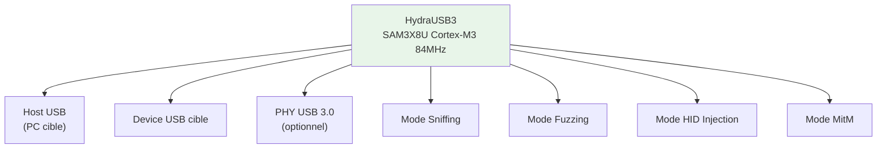
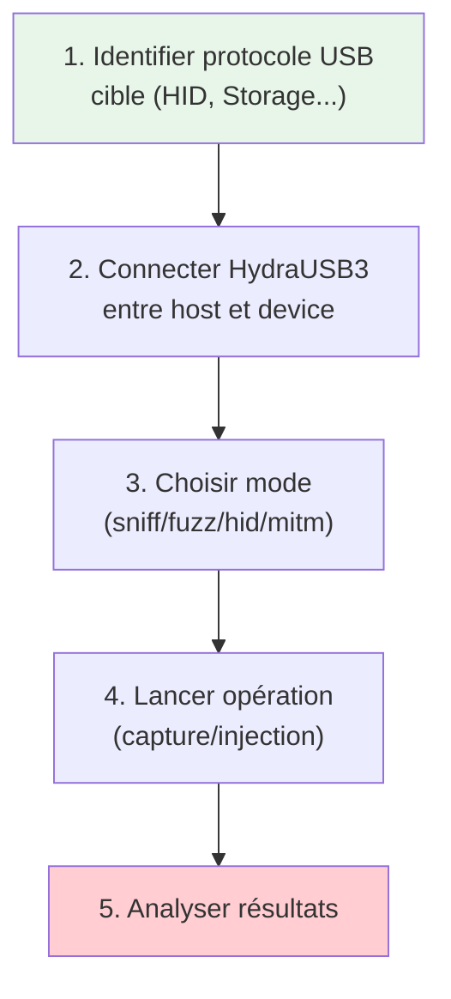

---

# 🧪 HydraUSB3

> [!info] **En 1 phrase**
> **HydraUSB3** est une plateforme open-source de test de sécurité USB 2.0/3.0 basée
> sur le MCU **Microchip SAM3X8U (Cortex-M3)**, capable de **sniffer, fuzz, injecter et
> manipuler le trafic USB** — l'outil ultime pour les attaques USB.

![[Images/HardwareAllTheThings/hydrabus_hydranfc_shield_v2.jpg]]

---

## 🧾 Overview

| Champ | Valeur |
|---|---|
| **Type** | Plateforme de sécurité USB |
| **Domaine** | Hardware Hacking — USB Security |
| **Niveau** | Expert |
| **OS cibles** | Tout device USB (PC, IoT, mobile) |
| **Matériel requis** | HydraUSB3 + câbles USB + PC |
| **Complexité** | Élevée |
| **Dernière mise à jour** | 2026-08-16 |

---

## 🎯 Concept

> HydraUSB3 est une plateforme open-source de test de sécurité USB conçue pour
> tester la sécurité des implémentations USB. Elle supporte le **sniffing**, le
> **fuzzing**, l'**injection HID** et la **man-in-the-Middle USB**.

> [!info] 💡 **Le contexte**
> - **SAM3X8U** : MCU Cortex-M3 à 84 MHz (même que l'Arduino Due)
> - **USB 2.0** : Low-Speed (1.5 Mbps) et Full-Speed (12 Mbps)
> - **USB 3.0** : Super-Speed (5 Gbps) via PHY externe
> - **Modes** : Sniffer, Fuzzing, HID, MitM, Relay



---

## 🧠 Concepts fondamentaux

### Architecture HydraUSB3

| Composant | Spécification | Rôle |
|---|---|---|
| MCU | SAM3X8U (Cortex-M3 84 MHz) | Logique principale |
| SRAM | 96 Ko | Mémoire tampon |
| Flash | 512 Ko | Firmware |
| USB 2.0 | Low-Speed (1.5 Mbps) / Full-Speed (12 Mbps) | Sniffing/Fuzzing |
| USB 3.0 | Super-Speed (5 Gbps) | Sniffing (PHY externe) |
| Interface série | UART (115200 baud) | Console de debug |

### Types d'attaques USB

| Attaque | Description | Sévérité | Exemple |
|---|---|---|---|
| Sniffing | Capture trafic USB | Élevée | Keylogger hardware |
| Fuzzing | Injection aléatoire | Élevée | Découverte CVE |
| HID Injection | Émulation périphérique | Critique | Rubber Ducky |
| MitM | Interception trafic | Critique | Filage USB |
| Relay | Relais transparent | Moyenne | Contournement auth |

---

## 🔌 Matériel / Composants

### Outils principaux

| Outil | Type | Usage | Prix | Source |
|---|---|---|---|---|
| HydraUSB3 | Plateforme USB 2.0/3.0 | Sniff, fuzz, HID | ~80€ | hydrabus.com |
| Câble USB male/female | Connectique | Connexion cible | ~10€ | Amazon |
| PC avec Linux | Station de travail | Analyse, scripts | - | - |

### Cibles USB typiques

| Catégorie | Exemples | Vulnérabilités |
|---|---|---|
| Périphériques HID | Claviers, souris | Injection HID |
| Clés USB | Stockage, security tokens | Fuzzing, relay |
| Devices mobiles | Smartphones, tablettes | MitM USB |
| IoT | Raspberry Pi, BeagleBone | Console USB |
| PC/Mac | Ordinateurs portables | Sniffing, injection |

### Câblage HydraUSB3

```
HydraUSB3               Device cible              Host (PC)
┌─────────────┐         ┌─────────────┐           ┌─────────────┐
│ USB Host    │ ──────→ │ Device USB  │           │             │
│ Port        │         │ (clavier,   │           │             │
│             │         │  clé, etc.) │           │             │
├─────────────┤         └─────────────┘           ├─────────────┤
│ USB Device  │ ←────── │ Host USB    │ ←──────── │ PC Host     │
│ Port        │         │ (PC)        │           │             │
└─────────────┘         └─────────────┘           └─────────────┘
     │                                                   │
     └───────────── MitM Position ───────────────────────┘
```

---

## ⚡ Protocoles

### USB 2.0

| Paramètre | Valeur |
|---|---|
| **Type** | Sériel différentiel |
| **Low-Speed** | 1.5 Mbps |
| **Full-Speed** | 12 Mbps |
| **High-Speed** | 480 Mbps (non supporté) |
| **Distance** | 5 m |
| **Broches** | VCC, GND, D+, D- |

### USB 3.0

| Paramètre | Valeur |
|---|---|
| **Type** | Sériel différentiel |
| **Super-Speed** | 5 Gbps |
| **Distance** | 3 m |
| **Broches** | VCC, GND, D+, D-, SSRX, SSTX |
| **Direction** | Full-duplex |

### Protocoles USB supportés

| Protocole | Usage |
|---|---|
| HID | Clavier, souris |
| Mass Storage | Clé USB, disque |
| CDC | Modem, série |
| MTP | Smartphones |

---

## 🛠️ Installation / Setup

### Prérequis

| Composant | Version | Lien |
|---|---|---|
| HydraUSB3 FW | Latest | github.com/hydrabus/hydrabus_ufirmware |
| dfu-util | Latest | git.code.sf.net/p/dfu-util |
| Python 3 | 3.8+ | python.org |

### Mise à jour du firmware

```bash
# Cloner le firmware
git clone https://github.com/hydrabus/hydrabus_ufirmware.git
cd hydrabus_ufirmware

# Compiler
make clean && make

# Flasher via DFU (maintenir BOOT pendant PowerON)
sudo dfu-util -i 0 -a 0 -d 03eb:6124 -D ./build/hydrabus.dfu

# Vérifier
screen /dev/ttyACM0 115200
> show system
```

### Dépendances Python

```bash
pip install pyusb
sudo apt install usbutils
sudo modprobe usbmon   # Linux — pour Wireshark + usbmon
```

---

## ⚙️ Configuration

### Paramètres HydraUSB3

| Option | Valeur par défaut | Description |
|---|---|---|
| USB Speed | Auto | Détection automatique |
| VID/PID | Personnalisable | Vendor/Product ID |
| Sniff Mode | Transparent | Interception sans modification |
| Fuzz Mode | Random | Injection aléatoire |
| HID Mode | Keyboard | Émulation clavier par défaut |

### VID/PID personnalisés

| Usage | VID | PID | Description |
|---|---|---|---|
| Défaut | 0x1234 | 0x5678 | HydraUSB3 |
| HID Keyboard | 0x046D | 0xC31C | Logitech Keyboard |
| Mass Storage | 0x0781 | 0x5567 | SanDisk USB |

---

## ⌨️ Commandes / Manipulations

| Commande | Description |
|---|---|
| `show system` | Informations système |
| `show pins` | Broches assignées |
| `help` | Aide des commandes |
| `sniff` | Mode sniffing USB |
| `sniff start / stop` | Démarrer / arrêter la capture |
| `sniff save <file>` | Sauvegarder sur microSD |
| `fuzz` | Mode fuzzing USB |
| `fuzz start packets <N>` | Fuzz N paquets |
| `hid` | Mode HID injection |
| `hid keyboard / mouse` | Émuler clavier/souris |
| `hid type "<text>"` | Taper du texte |
| `hid key <combo>` | Touche (ex: `LCTRL+LALT+DELETE`) |
| `mitm` | Mode Man-in-the-Middle USB |
| `relay` | Mode relais transparent |

---

## 🧪 Exemples pratiques

### 🟢 Débutant — Sniffing de trafic USB

```text
# 1. Connecter HydraUSB3 entre host et device
#    Host ←→ HydraUSB3 ←→ Device USB

# 2. Démarrer la capture
> sniff
sniff> start
# Capture en cours...

# 3. Interagir avec le device cible (touches, brancher/débrancher)

# 4. Arrêter et sauvegarder
sniff> stop
sniff> save /sd/capture.bin
```

### 🟡 Intermédiaire — Injection HID (clavier)

```text
> hid
hid> keyboard
hid> type "echo pwned > /tmp/pwned.txt"
hid> key LCTRL+LALT+DELETE
```

### 🔴 Avancé — Fuzzing d'un driver USB

```text
> fuzz
fuzz> start packets 10000
# Injection de 10000 paquets fuzz — surveiller crashs / BSOD
```

### ⚫ Expert — Man-in-the-Middle USB

```text
> mitm
mitm> start
mitm> modify packet 5 payload 0x41
mitm> save /sd/mitm_session.bin
```

---

## 🧪 Workflow complet (scénario pas à pas)



| Étape | Action | Commande |
|---|---|---|
| 1. Identification | `show system` + `show pins` | Vérifier pinout USB |
| 2. Sniffing | `sniff > start` | Capture trafic USB |
| 3. HID Injection | `hid > keyboard` | Émuler clavier |
| 4. Fuzzing | `fuzz > start packets N` | Injection aléatoire |
| 5. Analyse | Wireshark / tshark | Protocole USB |

---

## 🎬 Scénarios avancés

### Scénario 1 — Keylogger Hardware via sniffing

| Élément | Détail |
|---|---|
| **Objectif** | Capturer les touches d'un clavier USB |
| **Matériel** | HydraUSB3 + câble USB male/female |
| **Étapes** | 1. MitM → 2. Sniffer HID → 3. Extraire scancodes → 4. Décoder |
| **Résultat** | Journal des touches pressées |
| **Difficulté** | ⭐⭐ |

### Scénario 2 — Fuzzing d'un driver USB

| Élément | Détail |
|---|---|
| **Objectif** | Trouver des vulnérabilités dans un driver USB |
| **Matériel** | HydraUSB3 + PC cible |
| **Étapes** | 1. Fuzzing HID → 2. Surveiller crashs → 3. Analyser paquets → 4. PoC |
| **Résultat** | CVE potentielle |
| **Difficulté** | ⭐⭐⭐⭐ |

---

## 🛡️ Cybersecurity use cases

| Use case | Sévérité | Impact |
|---|---|---|
| Keylogger hardware | Élevée | Vol de credentials |
| Fuzzing driver USB | Élevée | Découverte CVE |
| HID injection | Critique | Exécution commande |
| MitM USB | Critique | Vol données transit |
| Relay USB | Moyenne | Contournement auth |

| Phase pentest | Ce que permet cette technique |
|---|---|
| Recon | Identification ports USB exposés |
| Accès initial | HID injection (Rubber Ducky style) |
| Post-exploitation | Sniffing credentials USB |

---

## 🎯 MITRE ATT&CK

| Technique ID | Nom | Catégorie | Applicabilité |
|---|---|---|---|
| T1200 | Hardware Additions | Initial Access | HydraUSB3 physique |
| T1056.001 | Input Capture: Keylogger | Collection | Sniffing HID |
| T1059.007 | Command: JavaScript | Execution | HID injection |
| T1557 | Adversary-in-the-Middle | Collection | MitM USB |

---

## 🛡️ Defensive Security

### Détection

| Signal de détection | Source | Fiabilité |
|---|---|---|
| Nouveau périphérique USB | OS logs | Moyenne |
| Périphérique USB inconnu | Gestionnaire périphériques | Élevée |
| Trafic USB anormal | USB monitoring | Moyenne |
| Driver crash | Logs système | Élevée |

### Prévention

| Mesure | Efficacité | Coût | Priorité |
|---|---|---|---|
| Désactiver ports USB | Élevée | Faible | Haute |
| Contrôle périphériques USB | Élevée | Moyen | Haute |
| USB device whitelisting | Élevée | Élevé | Haute |
| USBGuard (Linux) | Moyenne | Faible | Moyenne |

```bash
# USBGuard (Linux) — whitelist de périphériques USB
sudo apt install usbguard
sudo usbguard-gen-rules > /etc/usbguard/rules.conf

# Désactiver ports USB (Linux)
echo 'blacklist usb-storage' | sudo tee /etc/modprobe.d/disable-usb-storage.conf
```

---

## 🤖 Automatisation

```python
#!/usr/bin/env python3
"""Script de sniffing USB via HydraUSB3"""
import serial, time

def connect(port="/dev/ttyACM0"):
    return serial.Serial(port, 115200, timeout=2)

def send(ser, cmd):
    ser.write((cmd + "\n").encode())
    time.sleep(0.5)
    return ser.read(ser.inWaiting()).decode(errors="ignore")

def sniff(ser, duration=30):
    send(ser, "sniff"); send(ser, "start")
    time.sleep(duration)
    send(ser, "stop"); send(ser, "save /sd/usb_cap.bin")

def hid_inject(ser, text):
    send(ser, "hid"); send(ser, "keyboard")
    send(ser, f'type "{text}"')

ser = connect()
sniff(ser, 60)
hid_inject(ser, "echo pwned")
```

| Outil | Usage |
|---|---|
| HydraUSB3 FW | Firmware (hydrabus/ufirmware) |
| pyusb | Sniffing USB Python |
| USBPcap + Wireshark | Capture & analyse protocole |

---

## 📤 Output et parsing

| Format | Utilité |
|---|---|
| USBPcap (.pcap) | Analyse Wireshark |
| binaire brut (.bin) | Analyse hors-ligne |
| Scancodes HID | Keylogger |

```bash
# Analyse avec tshark
tshark -r usb_capture.pcap -T fields -e usb.capdata
# Visualisation avec Wireshark
wireshark usb_capture.pcap
```

---

## 🔗 Intégrations

- [[13 - Hardware & IoT|⚙️ Hardware & IoT]] global
- [[Hardware - Flipper Zero|🐬 Flipper Zero]]
- [[Hardware - Proxmark|🔧 Proxmark]]
- [[Hardware - Pwnagotchi|🤖 Pwnagotchi]]

| Outils associés | Usage complémentaire |
|---|---|
| [[Hardware - HydraBus]] | Plateforme hôte HydraUSB3 |
| [[Hardware - HydraNFC]] | NFC via HydraBus |

---

## 🔄 Alternatives

| Alternative | Avantages | Inconvénients | Cas d'usage |
|---|---|---|---|
| USB Rubber Ducky | HID injection simple | Pas de sniffing | Injection HID |
| FaceDancer | Fuzzing USB avancé | Prix élevé (>100$) | Recherche USB |
| Gadgeteer | Development USB | Pas de sniffing | Dev USB |

---

## ⚡ Performance

| Métrique | Valeur | Impact |
|---|---|---|
| MCU vitesse | 84 MHz (M3) | Traitement rapide |
| SRAM | 96 Ko | Buffer capture |
| Flash | 512 Ko | Firmware |
| USB 2.0 LS | 1.5 Mbps | Low-Speed supporté |
| USB 2.0 FS | 12 Mbps | Full-Speed supporté |
| USB 3.0 SS | 5 Gbps | Super-Speed (PHY externe) |

---

## 🛠️ Troubleshooting

| Problème | Cause probable | Solution |
|---|---|---|
| HydraUSB3 non reconnu | Driver USB manquant | Installer driver CDC |
| Sniffing ne capture pas | Mauvais positionnement | Vérifier câblage MitM |
| HID pas de réponse | VID/PID incorrect | Vérifier configuration |
| Fuzzing crash PC | Bug driver trouvé | Documenter, reporter |
| USB 3.0 pas détecté | PHY externe manquant | Installer PHY USB 3.0 |

---

## 🔐 Sécurité

| Risque | Impact | Mitigation |
|---|---|---|
| Keylogger hardware | Vol credentials | Désactiver USB inconnu |
| HID injection | Exécution commande | USB whitelisting |
| Fuzzing driver | Découverte CVE | Patchs réguliers |
| MitM USB | Vol données | Chiffrement USB |

> [!warning] Points de sécurité
> - Sniffing USB nécessite un accès physique aux ports USB
> - L'injection HID peut exécuter des commandes arbitraires sur le host
> - Le fuzzing USB peut provoquer des BSOD / kernel panics

> [!danger] Cadre légal
> L'utilisation d'HydraUSB3 pour sniff, fuzz ou injecter du trafic USB est soumise
> aux lois locales. Utiliser uniquement dans un cadre autorisé (pentest, recherche).

---

## ⚠️ Limitations

| Limite | Impact | Contournement |
|---|---|---|
| USB 2.0 uniquement (natif) | Pas USB 3.0 natif | PHY externe pour 3.0 |
| Pas de support audio | Pas sniffing audio USB | Autres outils |
| Pas de WiFi/Bluetooth | Pas d'analyse RF sans fil | Autres outils |

---

## 📋 Cheatsheet

```
┌───────────────────────────────────────────────────────┐
│ HydraUSB3 — Cheatsheet                                │
├───────────────────────────────────────────────────────┤
│ System:     show system                               │
│ Pins:       show pins                                 │
│ Sniffing:   sniff > start / stop / save              │
│ HID:        hid > keyboard / mouse / type / key       │
│ Fuzzing:    fuzz > start packets <N>                  │
│ MitM:       mitm > start                              │
│ Relay:      relay > start                             │
│ USB:        2.0 (LS/FS), 3.0 (PHY externe)           │
│ Web:        hydrabus.com                              │
└───────────────────────────────────────────────────────┘
```

| Action | Commande |
|---|---|
| Sniff USB | `sniff > start` |
| Sauvegarder | `sniff > save /sd/file.bin` |
| HID keyboard | `hid > keyboard` |
| HID type text | `hid > type "text"` |
| Fuzzing | `fuzz > start packets N` |
| MitM | `mitm > start` |

---

## ⚡ Quick reference

| Élément | Valeur |
|---|---|
| **MCU** | SAM3X8U (Cortex-M3 84 MHz) |
| **SRAM / Flash** | 96 Ko / 512 Ko |
| **USB 2.0** | Low-Speed (1.5 Mbps), Full-Speed (12 Mbps) |
| **USB 3.0** | Super-Speed (5 Gbps) via PHY externe |
| **Modes** | Sniffer, Fuzzing, HID, MitM, Relay |
| **Console** | UART 115200 baud |
| **Web** | hydrabus.com |

---

## 🔍 Détection & Défense

| Signal | Méthode de détection | Outil |
|---|---|---|
| Nouveau périphérique USB | OS logs | Gestionnaire périphériques |
| VID/PID inconnu | USB monitoring | USBGuard |
| Trafic HID anormal | HID monitoring | Custom script |
| Driver crash | Logs noyau | dmesg / Event Viewer |

| Countermeasure | Efficacité | Implémentation |
|---|---|---|
| Désactiver ports USB | Élevée | GPO / BIOS |
| USB whitelisting | Élevée | USBGuard / GPO |
| Chiffrement USB | Élevée | BitLocker / LUKS |

> [!tip] Défense
> La défense la plus efficace : désactiver les ports USB physiquement ou via GPO,
> ou utiliser un whitelisting de périphériques USB (USBGuard / Device Installation
> Restrictions).

---

## ⚠️ Tips & Pièges

- **Piège 1** : HydraUSB3 doit être entre le host et le device pour le sniffing (position MitM).
- **Piège 2** : Le fuzzing USB peut provoquer des BSOD / kernel panics sur le PC cible.
- **Piège 3** : L'injection HID peut déclencher des antivirus / EDR — tester hors production.
- **Piège 4** : USB 3.0 nécessite un PHY externe — HydraUSB3 gère USB 2.0 nativement.
- **Astuce 1** : Utiliser Wireshark + USBPcap pour visualiser les captures en temps réel.
- **Astuce 2** : Les VID/PID personnalisés permettent d'imiter n'importe quel périphérique.

> [!tip] Astuces
> - Le sniffing USB est transparent si positionné correctement
> - L'injection HID est la méthode la plus simple pour exécuter des commandes sur un PC
> - Le fuzzing USB est puissant mais destructeur — à utiliser avec précaution

---

## 📚 References

> [!info] 📚 **Sources**
> - [HardwareAllTheThings — HydraUSB3](https://github.com/swisskyrepo/HardwareAllTheThings/blob/main/docs/gadgets/hydranfc_shield_v2.md)
> - [HydraUSB3 Firmware](https://github.com/hydrabus/ufirmware)
> - [USB Security Attacks (SRLabs)](https://srlabs.de/usb-security)

| Source | URL |
|---|---|
| HydraUSB3 | hydrabus.com |
| Firmware | github.com/hydrabus/ufirmware |
| SAM3X8U Datasheet | microchip.com |
| USB.org | usb.org |

---

➡️ **Liens :** [[13 - Hardware & IoT|⚙️ Hardware & IoT]] · [[Hardware - HydraBus|🚌 HydraBus]] · [[Hardware - HydraNFC|🏷️ HydraNFC]] · [[Hardware - Flipper Zero|🐬 Flipper Zero]] · [[Hardware - Proxmark|🔧 Proxmark]] · [[Bibliothèque technique|🏠 Index]]