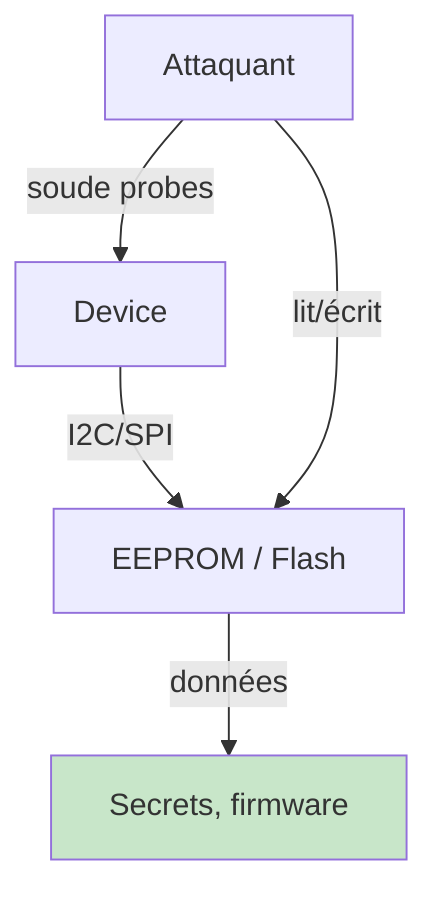
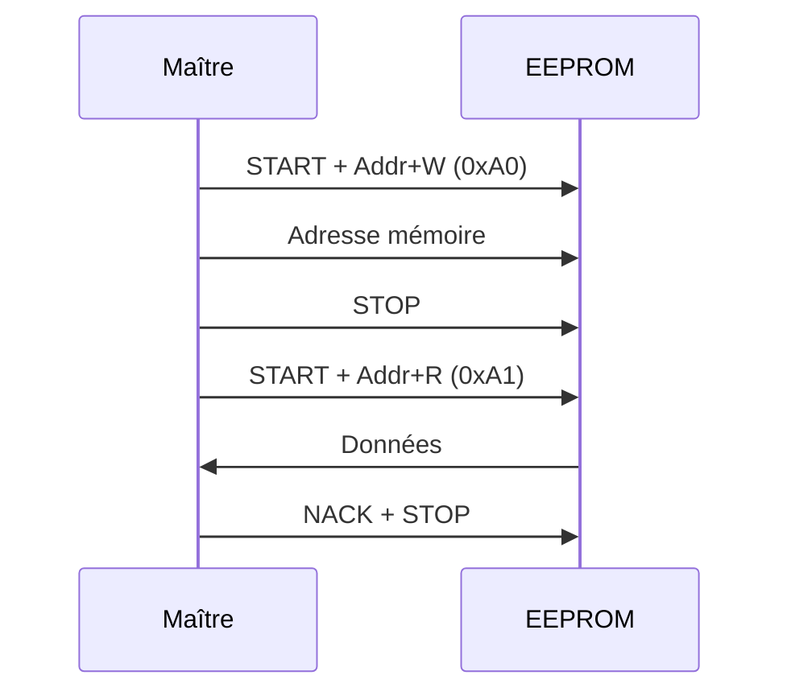
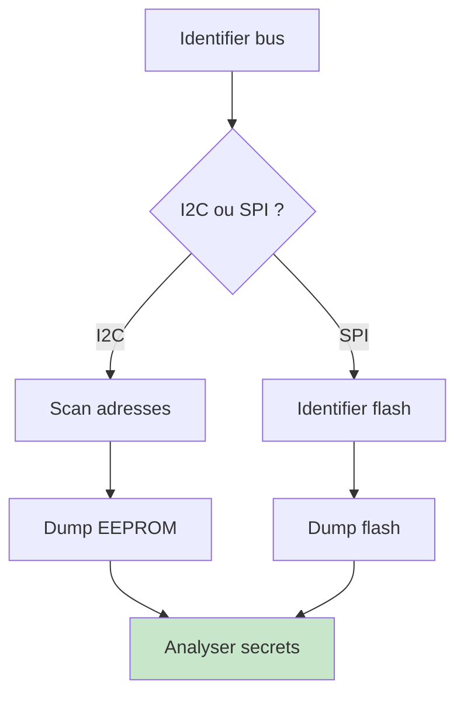

# I2C et SPI

> [!info] **En 1 phrase**
> **I2C** et **SPI** sont les bus internes qui relient le microcontrôleur à ses périphériques
> (EEPROM, capteurs, flash) — les **écouter/parler** peut révéler des données ou permettre
> des écritures (ex : cloner une EEPROM).

---

## Overview

| Champ | Valeur |
|---|---|
| **Type** | Bus interne (I2C : 2 fils, SPI : 4 fils) |
| **Domaine** | Hardware Hacking / Embedded |
| **Niveau** | Débutant → Avancé |
| **OS cibles** | Linux embedded, bare-metal, RTOS |
| **Matériel requis** | Raspberry Pi, Bus Pirate, CH341A, Logic Analyzer |
| **Complexité** | Faible → Moyenne |
| **Dernière mise à jour** | 2024-03-15 |

> [!info] **Diagramme de contexte**
> ```mermaid
> flowchart LR
>     MCU["Microcontrôleur"] -->|"I2C: SDA/SCL"| EEPROM["EEPROM"]
>     MCU -->|"SPI: MOSI/MISO/SCLK/CS"| FLASH["Flash SPI"]
>     ATK["Attaquant"] -.->|"écoute bus"| MCU
>     style ATK fill:#ffcdd2
> ```

---

## Concept

> I2C et SPI sont les bus internes des SoC pour communiquer avec EEPROMs, capteurs et flash. En pentest : lire/modifier config, extraire secrets, dumper firmware depuis la flash SPI.



> [!info] **Ce qu'on peut faire**
> - **Scanner** le bus → périphériques (adresses I2C).
> - **Lire** EEPROMs → secrets, MAC, config.
> - **Écrire** EEPROM → modifier config, bypass checks.
> - **Dumper** flash SPI → firmware complet.

---

## Concepts fondamentaux

### I2C

| Terme | Définition |
|---|---|
| **SDA** | Serial Data — ligne données bidirectionnelle |
| **SCL** | Serial Clock — horloge (maître) |
| **Pull-up** | 4.7kΩ vers VCC (open-drain obligatoire) |
| **Adressage 7 bits** | 0x03–0x77, chaque périphérique unique |
| **Start/Stop** | Condition début/fin de transaction |

### SPI

| Terme | Définition |
|---|---|
| **MOSI** | Master Out Slave In |
| **MISO** | Master In Slave Out |
| **SCLK** | Serial Clock |
| **CS/SS** | Chip Select (actif bas) |
| **Modes** | CPOL/CPHA 0–3 |
| **QSPI** | Quad SPI — 4 bits/cycle, ~4x plus rapide |

### Comparaison

| Caractéristique | I2C | SPI |
|---|---|---|
| **Fils** | 2 (SDA, SCL) | 4 (MOSI, MISO, SCLK, CS) |
| **Adressage** | 7 bits | Par CS |
| **Vitesse** | 100k–3.4M Hz | 1–100 MHz |
| **Direction** | Half-duplex | Full-duplex |
| **Usage** | EEPROM, capteurs, RTC | Flash, écrans, µSD |

---

## Matériel / Composants

### Outils principaux

| Outil | Type | Usage | Prix |
|---|---|---|---|
| Raspberry Pi | Mini-PC | I2C/SPI GPIO natif | ~40 € |
| Bus Pirate | Multi-protocole | I2C, SPI, UART | ~30 € |
| CH341A | USB | I2C/SPI/EEPROM | ~5 € |
| HydraBus | Multi-protocole | I2C, SPI, UART, CAN | ~50 € |
| Logic Analyzer | Analyseur | Capture signaux | ~10-30 € |

### Cibles typiques

| Catégorie | Bus | Vulnérabilités |
|---|---|---|
| EEPROM 24Cxx | I2C | Config, secrets, MAC |
| Flash W25Qxx | SPI | Firmware complet |
| RTC DS3231 | I2C | Timestamps |
| Écrans OLED | I2C/SPI | Info affichée |

### Pinout

```text
EEPROM I2C (SOIC-8) :        Flash SPI (SOIC-8) :
       ┌──────────────┐            ┌──────────────┐
  A0  ─┤1            8├─ VCC    CS ─┤1            8├─ VCC
  A1  ─┤2            7├─ WP    DO  ─┤2            7├─ HOLD
  A2  ─┤3            6├─ SCL   /WP ─┤3            6├─ CLK
  GND ─┤4            5├─ SDA   GND ─┤4            5├─ DI
       └──────────────┘            └──────────────┘
```

---

## Protocoles

### I2C

| Paramètre | Valeur |
|---|---|
| Standard | 100 kHz |
| Fast mode | 400 kHz |
| High speed | 3.4 MHz |
| Voltage | 1.8V / 3.3V / 5V |

### SPI

| Paramètre | Valeur |
|---|---|
| Vitesse | 1–100 MHz |
| Modes | SPI 0/1/2/3 |
| QSPI | 4 bits/cycle |

### Séquence I2C



---

## Installation / Setup

```bash
# Raspberry Pi : activer I2C/SPI
sudo raspi-config → Interface Options → I2C / SPI

# Installer outils
sudo apt install i2c-tools python3-smbus flashrom

# I2C : scanner
i2cdetect -y 1

# SPI : dump flash
flashrom -p ch341a_spi -r dump.bin -c "W25Q64.V"
```

---

## Configuration

| Paramètre | I2C | SPI |
|---|---|---|
| Pull-up | 4.7kΩ obligatoire | Non |
| Vitesse défaut | 100 kHz | 1-10 MHz |
| Mode | — | 0 ou 3 |

---

## Commandes / Manipulations

```bash
# I2C : scan + dump
i2cdetect -y 1
sudo i2cdump -y 1 0x50
sudo i2cget -y 1 0x50 0x00

# SPI : dump flash
flashrom -p ch341a_spi -r dump.bin -c "MX25L6406E"
flashrom -p linux_spi:dev=/dev/spidev0.0,spispeed=512 -r dump.bin

# HydraBus
i2c1> scan
spi1> read_id
```

---

## Exemples pratiques

### Débutant — Scan I2C

```bash
sudo i2cdetect -y 1
# 50: 50 -- -- ... → EEPROM à 0x50
sudo i2cdump -y 1 0x50 b
```

### Intermédiaire — Dump SPI

```bash
flashrom -p ch341a_spi -r flash_dump.bin -c "W25Q64.V"
binwalk flash_dump.bin
strings flash_dump.bin | grep -i password
```

### Avancé — Script Python I2C

```python
import smbus2
bus = smbus2.SMBus(1)
data = bytearray()
for i in range(0, 256, 16):
    block = bus.read_i2c_block_data(0x50, i, 16)
    data.extend(block)
    print(f"0x{i:04x}: {' '.join(f'{b:02x}' for b in block)}")
with open("eeprom.bin", "wb") as f:
    f.write(data)
bus.close()
```

### Expert — Capture sigrok

```bash
sigrok-cli -d fx2lafw --config samplerate=1000000 --samples 5000000 \
    -P i2c:sda=D0:scl=D1 -B i2c=sda,i2c=scl -O ascii
```

---

## Workflow complet



| Étape | I2C | SPI |
|---|---|---|
| 1 | `i2cdetect -y 1` | Identifier CS pin |
| 2 | `i2cdump -y 1 0x50` | `flashrom -p ch341a_spi -r dump.bin` |
| 3 | Analyser hex dump | `binwalk dump.bin` |

---

## Scénarios avancés

### Scénario 1 — Cloner EEPROM routeur

| Élément | Détail |
|---|---|
| **Objectif** | Copier config d'un routeur sur un autre |
| **Matériel** | CH341A, pinces |
| **Étapes** | Dump EEPROM A → analyser → écrire sur B |
| **Difficulté** | |

### Scénario 2 — Bypass vérification via EEPROM

| Élément | Détail |
|---|---|
| **Objectif** | Modifier flag de check dans EEPROM |
| **Matériel** | Bus Pirate, pinces |
| **Étapes** | Dump → identifier byte check → modifier → reflash |
| **Difficulté** | |


---

## Cybersecurity use cases

| Use case | Sévérité | Impact |
|---|---|---|
| EEPROM secrets | Élevée | Fuite credentials |
| Flash dump | Critique | Firmware complet |
| Config modifiable | Élevée | Bypass sécurité |

| Phase pentest | Rôle I2C/SPI |
|---|---|
| Recon | EEPROM → config |
| Accès initial | Flash dump → reverse |
| Maintien | Modif EEPROM → persistence |

---

## MITRE ATT&CK

| Technique ID | Nom | Catégorie |
|---|---|---|
| T1200 | Hardware Additions | Initial Access |
| T1552 | Unsecured Credentials | Credential Access |
| T1005 | Data from Local System | Collection |

---

## Defensive Security

| Mesure | Efficacité | Priorité |
|---|---|---|
| Chiffrer EEPROM | Très élevée | Haute |
| WP pin activée | Élevée | Haute |
| Anti-soudure | Élevée | Moyenne |
| Intégrité firmware | Élevée | Moyenne |

---

## Automatisation

```python
import smbus2
bus = smbus2.SMBus(1)
devices = []
for addr in range(0x03, 0x78):
    try:
        bus.read_byte(addr)
        devices.append(addr)
        print(f"[+] 0x{addr:02x}")
    except: pass
if 0x50 in devices:
    data = bytearray()
    for i in range(0, 256, 16):
        data.extend(bus.read_i2c_block_data(0x50, i, 16))
    open("dump.bin","wb").write(data)
bus.close()
```

| Outil | Usage |
|---|---|
| i2c-tools | Scan/lecture I2C |
| flashrom | Dump/flash SPI |
| sigrok-cli | Capture signaux |

---

## Output et parsing

```bash
binwalk dump.bin
strings dump.bin | head -20
hexdump -C dump.bin | head -30
diff <(xxd dump1.bin) <(xxd dump2.bin)
```

---

## Intégrations

- [[13 - Hardware & IoT| Hardware & IoT]]
- [[Hardware - I2C et SPI]] (cette fiche)
- [[Hardware - Dump et Analyse de Firmware| Dump de firmware]]

| Outil | Usage |
|---|---|
| [[Hardware - CH341A]] | Programmateur EEPROM |
| [[Hardware - Bus Pirate]] | Multi-protocole |
| [[Hardware - Raspberry Pi]] | GPIO I2C/SPI |
| [[Hardware - Logic Analyzer]] | Capture signaux |

---

## Alternatives

| Alternative | Avantages | Inconvénients |
|---|---|---|
| UART | Console interactif | Moins d'accès mémoire |
| JTAG | Debug complet | Broches absentes |
| Réseau | Pas physique | Nécessite IP |

---

## Performance

| Métrique | I2C | SPI |
|---|---|---|
| Vitesse max | 3.4 MHz | 100 MHz |
| Dump 8MB flash | — | ~5 s |
| Latence | ~10 µs | ~1 µs |

---

## Troubleshooting

| Problème | Cause | Solution |
|---|---|---|
| Aucun device | Pas de pull-up | Ajouter 4.7kΩ |
| Scan erroné | Mauvais bus | `i2cdetect -y 0` vs `1` |
| Flash non détectée | Mauvais CS | Vérifier câble |

---

## Sécurité

| Risque | Mitigation |
|---|---|
| Lecture EEPROM | Chiffrer données |
| Écriture EEPROM | WP pin |
| Flash dump | Chiffrer firmware |

> [!warning] Chiffrer toutes les données en EEPROM/flash en production.

> [!danger] Cadre légal : manipulation bus = accès physique. Uniquement sur vos appareils.

---

## Limitations

| Limite | Contournement |
|---|---|
| Pull-up requis | Résistances externes |
| Flash protégée | Fault injection |
| QSPI complexe | Adaptateur dédié |

---

## Cheatsheet

```
┌─────────────────────────────────────────────┐
│ I2C / SPI — Cheatsheet                      │
├─────────────────────────────────────────────┤
│ I2C scan :  i2cdetect -y 1                  │
│ I2C dump :  i2cdump -y 1 0x50               │
│ SPI dump :  flashrom -p ch341a_spi -r dump.bin│
│ Pull-up :   4.7kΩ vers VCC                  │
│ Flash typ. : W25Q64, MX25L6406E             │
└─────────────────────────────────────────────┘
```

---

## Quick reference

| Élément | I2C | SPI |
|---|---|---|
| **Fils** | SDA, SCL | MOSI, MISO, SCLK, CS |
| **Vitesse** | 100k–3.4M | 1–100 MHz |
| **Scan** | `i2cdetect -y 1` | `flashrom -p ch341a_spi` |
| **Pull-up** | 4.7kΩ | Non |

---

## Détection & Défense

| Countermeasure | Efficacité |
|---|---|
| Chiffrer EEPROM | Très élevée |
| WP pin | Élevée |
| Anti-soudure | Élevée |

---

## Tips & Pièges

- **I2C open-drain** : sans pull-up, rien ne marche.
- **EEPROM à 0x50** = réflexe sur tout device.
- **SPI = flash firmware** → priorité reverse.
- **QSPI** = 4 lignes, adaptateur spécifique.

> [!tip] Commence par `i2cdetect`, la flash SPI contient souvent le firmware complet.

---

## References

> [!info] **Sources**
> - [HardwareAllTheThings — I2C](https://github.com/swisskyrepo/HardwareAllTheThings/blob/main/docs/protocols/i2c.md)
> - [HardwareAllTheThings — SPI](https://github.com/swisskyrepo/HardwareAllTheThings/blob/main/docs/protocols/spi.md)

| Source | URL |
|---|---|
| I2C Spec NXP | https://www.nxp.com/docs/en/user-guide/UM10204.pdf |
| flashrom | https://flashrom.org/Flashrom |

---

**Liens :** [[13 - Hardware & IoT| Hardware & IoT]] · [[Hardware - Dump et Analyse de Firmware| Dump de firmware]] · [[Hardware - UART| UART]] · [[Hardware - JTAG et SWD| JTAG/SWD]]
