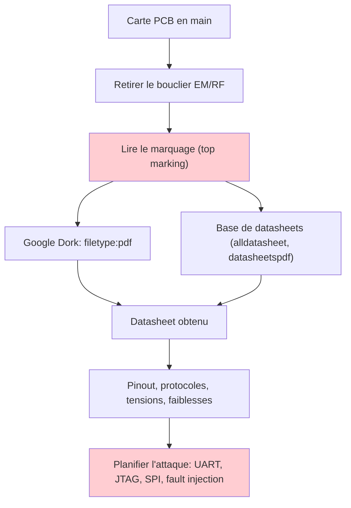
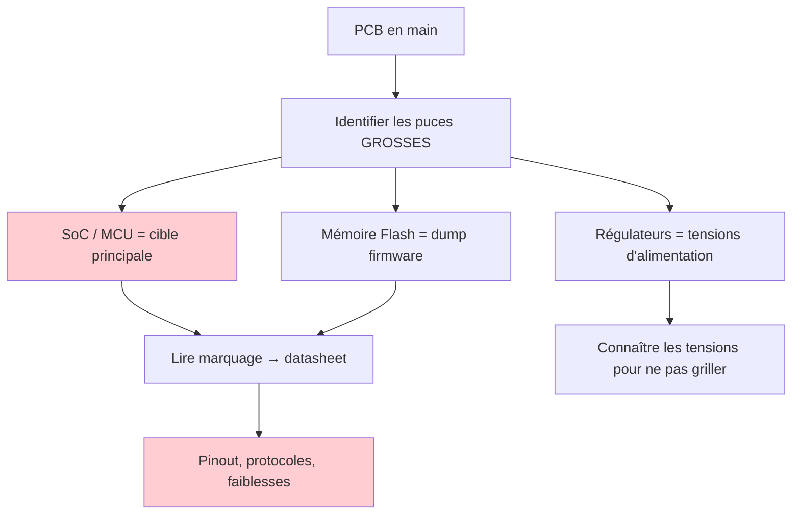
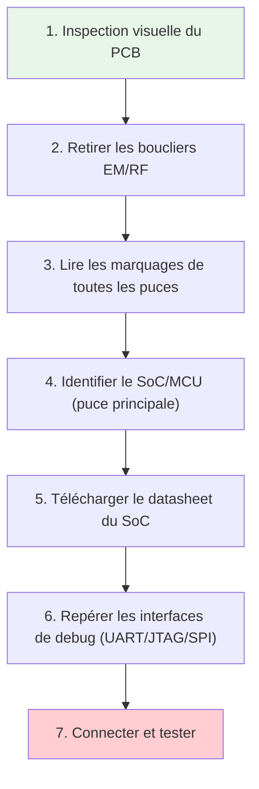
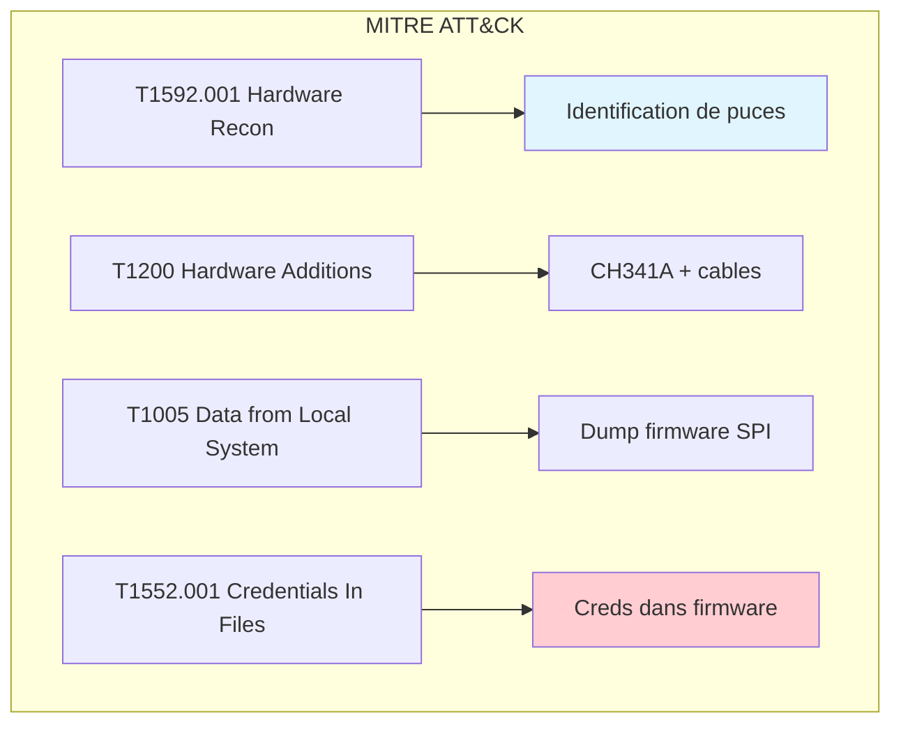
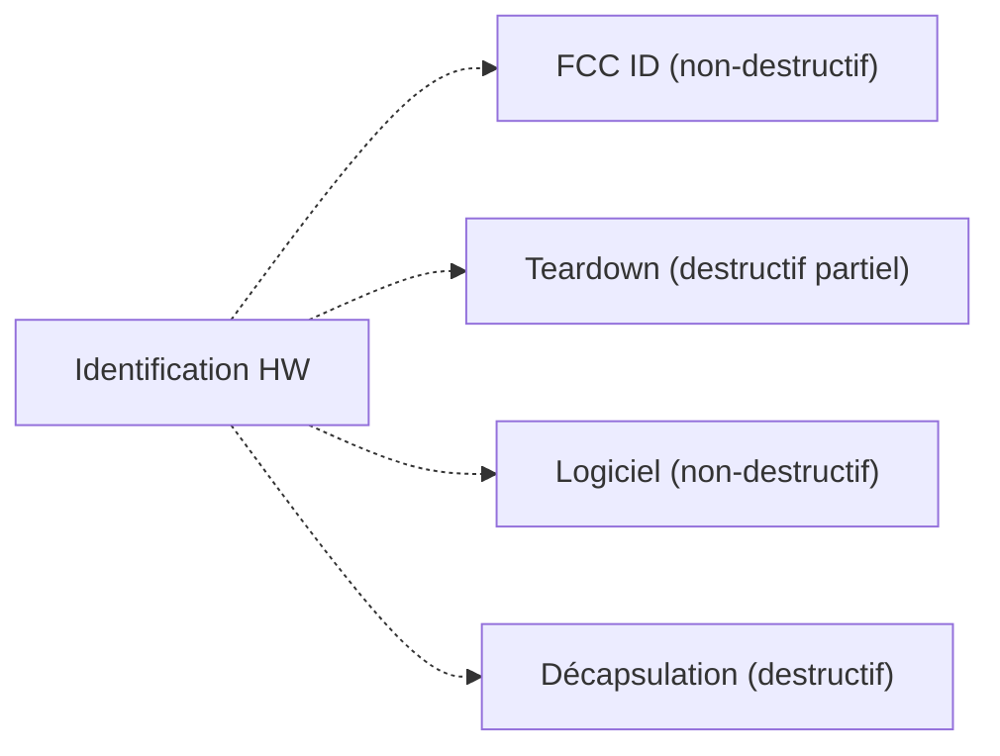

# Identification de puces

> [!info] **En 1 phrase**
> Identifier la puce d'un device = **remonter au datasheet** (pinout, protocoles, faiblesses)
> — c'est l'**étape zéro** de tout hack hardware sérieux.

---

## Overview

| Champ | Valeur |
|---|---|
| **Type** | Technique / Méthodologie |
| **Domaine** | Hardware Hacking — Enumeration |
| **Niveau** | Beginner → Expert |
| **OS cibles** | Tous (analyse physique de PCB) |
| **Matériel requis** | Loupe/microscope, caméra macro, fer à souder (optionnel), UV light (optionnel) |
| **Complexité** | Faible à Élevée |
| **Dernière mise à jour** | 2026-08-16 |

> [!info] **Diagramme de contexte**
> ```mermaid
> flowchart LR
>     A["Carte PCB en main"] --> B["Retirer le bouclier EM/RF"]
>     B --> C["Lire le marquage (top marking)"]
>     C --> D["Google Dork: filetype:pdf <référence>"]
>     C --> E["Base de datasheets"]
>     D --> F["Datasheet obtenu"]
>     E --> F
>     F --> G["Pinout, protocoles, faiblesses"]
>     style A fill:#e1f5fe
>     style G fill:#c8e6c9
> ```

---

## Concept

> L'identification de puces est le processus de reconnaissance physique d'un PCB : lire les **marquages** imprimés sur les composants, les associer à leur **datasheet**, et en extraire le **pinout**, les **protocoles**, les **tensions** et les **faiblesses**. C'est une étape fondamentale du hardware hacking car elle détermine toutes les étapes suivantes : quelles broches attaquer (UART, JTAG, SPI), quelles tensions utiliser, et quels outils connecter.



> [!info] **Ce qu'on gagne avec le datasheet**
> - Le **pinout exact** → où trouver TX/RX UART, TDI/TDO JTAG, SPI flash, etc.
> - Les **protocoles** et tensions d'alimentation → ne pas griller le circuit.
> - Les **faiblesses connues** : clés publiques, réinitialisation, debug non désactivé, CVE du SoC/MCU.
> - Les **modes de debug** : JTAG activé, UART console, bootloader accessibles.

---

## Concepts fondamentaux

### Types de composants sur un PCB

| Catégorie | Rôle | Exemples | Priorité pentest |
|---|---|---|---|
| **SoC / MCU** | Processeur principal | RTL8196E, BCM2835, ESP32, STM32 | Haute (cible principale) |
| **Mémoire Flash** | Stockage firmware | W25Q128, MX25L64, K9F1G08 | Haute (dump firmware) |
| **EEPROM** | Stockage config | AT24C02, M24256 | Moyenne |
| **Régulateur** | Alimentation | AMS1117, LM7805, AP2112 | Info (tensions) |
| **RF transceiver** | Radio | LMS7002M, nRF24L01, CC2520 | Haute (si cible RF) |
| ** PHY Ethernet** | Interface réseau | RTL8201, KSZ8051 | Moyenne |
| **Audio codec** | Traitement audio | WM8960, ES8388 | Faible |
| **Capacitive touch** | Interface tactile | TTP223, FT5x06 | Faible |

### Logique de identification d'un PCB



### Règles d'or

1. **Repère le SoC/MCU en premier** : c'est la puce la plus grosse du PCB, souvent au centre
2. **Identifie la mémoire flash** : souvent à côté du SoC, c'est là que se trouve le firmware
3. **Note les références** : U1, U2, J1, J2 sur le PCB = ta carte d'identification
4. **Ne jamais supposer** : un même code SMD peut correspondre à des puces différentes selon le fabricant

---

### Lire le marquage d'une puce

#### Structure du top marking

> Le **top marking** (marquage imprimé sur le boîtier) est la clé : fabricant + référence + datacode.

```text
Exemple de marquage typique :
    ATMEL   ← logo / fabricant
    24C02   ← référence du composant (EEPROM 2 kbit I2C)
    1428N   ← datacode: semaine 28, année 2014

- 1ère ligne    → fabricant (logo + nom)
- 2ème ligne    → référence exacte du composant (la plus importante)
- 3ème ligne    → datacode / lot de fabrication (moins important)
```

#### Marquages par type de boîtier

| Boîtier | Taille | Marquage | Exemple |
|---|---|---|---|
| **DIP** (Dual In-line) | Large | Complet ou 3 lignes | ATMEL 24C02 1428N |
| **SOIC** (Small Outline) | Moyen | Référence complète ou partielle | STM32F103C8T6 |
| **QFP** (Quad Flat Package) | Moyen | Référence complète | NXP LPC1768 |
| **QFN** (Quad Flat No-leads) | Petit | Référence partielle | ESP32-D0WDQ6 |
| **SOT-23** | Très petit | Code 2–4 caractères | 1A (BC846A) |
| **SC-70** | Très petit | Code 2–3 caractères | K7 (2SC4617) |
| **WLCSP** | Miniature | Code 2–3 caractères | AB |

> Les **SMD** n'affichent souvent qu'un code court → utiliser un **codebook SMD** (sites type `smdcode.com`, `smd.yooneed.one`, `marsport.org.uk/smd`) pour retrouver la référence.

#### Interpréter le datacode

| Fabricant | Format | Exemple | Interprétation |
|---|---|---|---|
| Texas Instruments | 2 chiffres semaine + 2 chiffres année | 2814 | Semaine 28, 2014 |
| STMicroelectronics | 3 caractères (semaine + année) | C2814 | Semaine 28, 2014 |
| Microchip | 4 chiffres (semaine + année) | 2814 | Semaine 28, 2014 |
| Nexperia | 4 chiffres (année + semaine) | 1428 | Semaine 28, 2014 |
| Samsung | 4 chiffres (année + semaine) | 1428 | Semaine 28, 2014 |

> Le datacode permet de **dater un device** → utile pour savoir si un firmware est ancien / patchable.

---

### Google Dorks

```text
filetype:pdf <référence>                 # datasheet en PDF direct
"<référence>" "datasheet"                # datasheet en général
"<référence>" schematic                  # schéma d'application (reference design)
"<référence>" "pinout" pin               # pinout détaillé
"<référence>" "JTAG" OR "UART" OR "SPI" # interfaces de debug
"<référence>" CVE                        # vulnérabilités connues
"<référence>" site:github.com            # code source / exploits
```

### Dorks spécifiques par type de puce

```text
# SoC / MCU
"<référence>" "bootloader" filetype:pdf
"<référence>" "JTAG" "pinout" filetype:pdf

# Mémoire Flash
"<référence>" "datasheet" "SPI" filetype:pdf
"<référence>" "W25Q" OR "MX25L" filetype:pdf

# Regulateurs
"<référence>" "AMS1117" OR "LM7805" filetype:pdf

# Ethernet PHY
"<référence>" "MII" OR "RMII" filetype:pdf
```

---

### Bases de datasheets

### Sites de référence

| Site | Usage | Avantage | Lien |
|---|---|---|---|
| [datasheetspdf.com](https://datasheetspdf.com) | Recherche par référence | PDF gratuits | datasheetspdf.com |
| [alldatasheet.com](https://www.alldatasheet.com) | Très large catalogue | Vue éclatée, vues PCB | alldatasheet.com |
| [datasheets360.com](https://www.datasheets360.com) | Recherche croisée | Paramètres filtres | datasheets360.com |
| [octopart.com](https://octopart.com) | Recherche composants | Stock + datasheets | octopart.com |
| [lcsc.com](https://lcsc.com) | Composants électroniques | Stock chinois | lcsc.com |
| [smdcode.com](https://smdcode.com) | Codes SMD | Décodage marquages courts | smdcode.com |
| [smd.yooneed.one](https://smd.yooneed.one) | Base SMD marking | >3500 codes | smd.yooneed.one |
| [marsport.org.uk/smd](http://www.marsport.org.uk/smd/codeintro.htm) | SMD Codebook HTML | >3500 codes | marsport.org.uk |

### Recherche par fabricant

| Fabricant | Site officiel | Base de marquage |
|---|---|---|
| Texas Instruments | ti.com | Part marking lookup |
| STMicroelectronics | st.com | Reference marking documents |
| Analog Devices | analog.com | Package resources |
| Microchip | microchip.com | Device marking guide |
| Nexperia | nexperia.com | SMD marking codes |
| onsemi | onsemi.com | Package information |
| Infineon | infineon.com | Marking information |

### Comment utiliser un codebook SMD

```text
1. Identifier le boîtier (SOT-23, SC-70, QFN, etc.)
2. Lire le code imprimé (2-4 caractères)
3. Rechercher le code dans le codebook
4. Vérifier le fabricant (logo sur le boîtier)
5. Croiser : code + fabricant + boîtier → référence exacte
6. Télécharger le datasheet pour confirmer
```

> [!warning] Attention
> Un même code SMD peut correspondre à **des puces différentes** selon le fabricant. Par exemple, le code `1A` peut être un BC846A (NXP) ou un FMMT3904 (Zetex). Toujours croiser avec le logo du fabricant et le type de boîtier.

---

## Matériel / Composants

### Outils principaux

| Outil | Type | Usage | Prix | Source |
|---|---|---|---|---|
| Loupe binoculaire x10 | Optique | Inspection générale | ~$20 | Amazon |
| Microscope USB x50-200 | Optique | Inspection détaillée | ~$30 | Amazon |
| Station hot air (858D) | Thermique | Retrait boucliers, reflow | ~$30 | AliExpress |
| Fer à souder 40W | Thermique | Soudure, retrait | ~$10 | Amazon |
| CH341A | USB-SPI/I2C/UART | Lecture flash, console | ~$3 | AliExpress |
| Multimètre | Mesure | Tensions, continuité | ~$15 | Amazon |
| Analyseur logique | Capture | UART/SPI/I2C signals | ~$20 | AliExpress |
| Tigard | USB-JTAG/SWD/UART | Multi-protocole | ~$50 | tigard.net |
| UV light 365 nm | Optique | Révéler marquages effacés | ~$10 | Amazon |

### Cibles typiques

| Catégorie | Exemples | Priorité | Interfaces |
|---|---|---|---|
| SoC / MCU | RTL8196E, ESP32, STM32, BCM2835 | Haute | UART, JTAG, SPI, I2C |
| Mémoire Flash | W25Q128, MX25L64, AT25SF041 | Haute | SPI |
| EEPROM | AT24C02, M24256 | Moyenne | I2C |
| Régulateur | AMS1117, AP2112, LM7805 | Info | — |
| Ethernet PHY | RTL8201, KSZ8051, LAN8720 | Moyenne | MII/RMII |
| RF transceiver | LMS7002M, nRF24L01, CC2520 | Haute | SPI, UART |

---

## Bouclier EM/RF (EM/RF shield)

### Pourquoi les boucliers sont importants

> Les **boucliers électromagnétiques / radiofréquence** (cages métalliques soudées sur le PCB)
> cachent souvent les composants radio (RF front-end, amplis, SoC radio)… et parfois bien plus.
> Il faut les **retirer** pour voir ce qu'ils protègent.

| Contenu possible du bouclier | Intérêt pentest |
|---|---|
| SoC radio (Wi-Fi, BLE, Zigbee) | Identifier le chipset RF |
| Amplificateur de puissance (PA) | Puissance TX |
| Filtre RF / matching network | Bandes de fréquences |
| Secure Element / TPM | Cible de high-value |
| Mémoire flash cryptée | Dump firmware chiffré |

### Méthode de retrait

```text
1. Chauffer les soudures de la cage avec un fer (ou station hot air)
   - Température : 300-350°C (fer) / 350-400°C (hot air)
   - Durée : 10-30 secondes par coin

2. Soulever délicatement avec une pince / spatule
   - Ne pas forcer : risque d'arracher des pistes

3. Réinspecter : puces cachées, références, broches
   - Utiliser une loupe / microscope USB

4. (Option) enlever le composant lui-même pour lire son marquage complet
   - Utile si le marquage est partiellement caché
```

### Outils pour le retrait

| Outil | Usage | Prix | Recommandé pour |
|---|---|---|---|
| Fer à souder 40W | Chauffage local | ~$10 | Boucliers simples |
| Station hot air (858D) | Chauffage uniforme | ~$30 | Boucliers soudés |
| Pince antistatique | Soulever le bouclier | ~$5 | Manipulation |
| Spatule métallique | Lever le bouclier | ~$3 | Manipulation |
| Loupe binoculaire | Inspection | ~$20 | Lecture de marquages |
| Microscope USB | Inspection détaillée | ~$30 | Marquages SMD |

> Les boucliers non retirés = risque de **mal identifier** le SoC (c'est souvent LUI que l'on cache).
> Sur certains devices (TPM, Secure Element), le bouclier est le premier indice d'une **cible riche** : encapsulation en résine = composant sécurisé.

---

## Techniques d'identification avancées

### Identification par contexte circuit

Parfois le marquage est illisible ou absent. On peut identifier la puce par sa **fonction dans le circuit** :

| Indice | Déduction | Exemple |
|---|---|---|
| 48 pins, QFP, au centre du PCB | SoC principal | BCM2835, RTL8196E |
| 8 pins, SOIC, près du SoC | SPI Flash | W25Q128, MX25L64 |
| 3-5 pins, SOT-23, près de l'entrée USB | Régulateur 3.3V/5V | AMS1117, AP2112 |
| 16/20 pins, SOIC, près du port Ethernet | PHY Ethernet | RTL8201, KSZ8051 |
| 48 pins, QFN, avec antenne | Module RF | nRF52840, ESP32 |
| 8 pins, SOIC, I2C bus | EEPROM | AT24C02, M24256 |

### Identification par protocole

```bash
# Si on peut accéder au device (UART/SSH), utiliser des commandes système :
cat /proc/cpuinfo       # Info SoC
cat /proc/version       # Kernel version
uname -a                # Info système
cat /etc/os-release     # Distribution Linux
ls /dev/                # Devices disponibles (mtdblock*, mmcblk*, etc.)
```

### Identification par logiciels

```bash
# Linux embedded : identifier le SoC via /proc
cat /proc/cpuinfo | grep "Hardware\|model name\|Processor"

# Identifier la mémoire flash
cat /proc/mtd           # NAND/NOR flash
ls /dev/mtd*            # MTD devices
lsblk                   # Block devices

# Identifier le bootloader
printenv                # U-Boot variables (si accessible)
fw_printenv              # Depuis le host
```

### Décapping (méthode experte)

> La **décapsulation** consiste à retirer le boîtier d'une puce pour exposer le **die** (circuit imprimé interne) et lire les marquages directs.

| Méthode | Difficulté | Résultat |
|---|---|---|
| Acide nitrique (fumant) | Élevée | Die exposé, marquages visibles |
| Laser ablation | Très élevée | Die propre, inspection microscopique |
| Mécanique (grattage) | Moyenne | Risque d'endommager le die |

> [!warning] Sécurité
> La décapsulation à l'acide nitrique est **dangereuse** (fumées toxiques). À réaliser uniquement en laboratoire équipé avec EPI complets.

### UV light (lumière ultraviolete)

> La **lumière UV** peut révéler des marquages effacés ou cachés sous une couche de résine.

```text
1. Exposer le composant à la lumière UV (365 nm) pendant 10-30 minutes
2. La résine noire devient semi-transparente
3. Les marquages sous la résine deviennent visibles
4. Utiliser une caméra avec filtre UV pour capturer l'image
```

| Outil | Usage | Prix |
|---|---|---|
| Lampe UV 365 nm | Exposition | ~$10 |
| Caméra + filtre UV | Capture d'image | ~$50 |
| Microscope + UV | Inspection détaillée | ~$100 |

---

## Installation / Setup

### Prérequis

| Composant | Usage | Prix |
|---|---|---|
| Loupe binoculaire x10 | Inspection générale | ~$20 |
| Microscope USB x50-200 | Inspection détaillée | ~$30 |
| Caméra macro / smartphone | Documentation photo | ~$0 (smartphone) |
| Station hot air | Retrait boucliers | ~$30 |
| Fer à souder | Retrait composants | ~$10 |
| Multimètre | Mesure tensions | ~$15 |
| Analyseur logique | Capture signaux (UART, SPI, I2C) | ~$20 |

### Connexion physique

```
PCB en main :
1. Identifier le pin 1 (point, encoche, chanfrein)
2. Nettoyer la surface si nécessaire (alcool isopropylique)
3. Utiliser la loupe/microscope pour lire les marquages
4. Prendre des photos de chaque composant
5. Noter les références (U1, U2, J1, J2, etc.)

Pin 1 markers :
┌──────────────────┐
│  ●               │  ← Point ou encoche = pin 1
│  1               │
│  ┌────────────┐  │
│  │            │  │
│  └────────────┘  │
│                  │
└──────────────────┘
```

### Outils logiciels

```bash
# Identifier le SoC via SSH (si accès au device)
cat /proc/cpuinfo
cat /proc/version
uname -a

# Identifier la flash (si accès au device)
cat /proc/mtd
ls /dev/mtd*
lsblk

# Identifier le bootloader
printenv  # U-Boot

# Identifier les interfaces de debug
ls /dev/ttyS*     # UART
ls /dev/ttyUSB*   # USB-UART adapter
ls /dev/spi*      # SPI
ls /dev/i2c*      # I2C
```

---

## Configuration

### Outils d'analyse

| Outil | Usage | Interface |
|---|---|---|
| microscope-usb | Inspection visuelle | USB |
| Multimètre | Mesure tensions, continuité | Probes |
| Analyseur logique | Capture UART/SPI/I2C | GPIO |
| Bus Pirate | Interface multi-protocole | USB |
| Tigard | JTAG/SWD/UART/SPI | USB |
| CH341A | Flash programmer | USB |

### Adaptateurs pour programmer / lire

| Adaptateur | Interface | Voltage | Usage |
|---|---|---|---|
| CH341A | USB-SPI/I2C/UART | 3.3V/5V | Lecture flash, console série |
| Bus Pirate | USB multi-protocole | 3.3V/5V | Polyvalent, tous protocoles |
| FT232RL | USB-UART | 3.3V/5V | Console série |
| Tigard | USB-JTAG/SWD/UART/SPI | 3.3V/5V | Multi-protocole |
| ST-Link V2 | USB-SWD | 3.3V | STM32 programming |
| J-Link | USB-JTAG/SWD | 3.3V | Multi-MCU |

---

### Commandes / Manipulations

### Commandes essentielles

| Commande | Description | Exemple |
|---|---|---|
| `cat /proc/cpuinfo` | Info SoC/MCU | `cat /proc/cpuinfo` |
| `cat /proc/version` | Version kernel | `cat /proc/version` |
| `cat /proc/mtd` | Info flash | `cat /proc/mtd` |
| `ls /dev/` | Devices disponibles | `ls /dev/mtd*` |
| `printenv` | Variables U-Boot | `printenv` |
| `lsusb` | Devices USB connectés | `lsusb` |
| `lspci` | Devices PCI | `lspci` |

### Lecture / Écriture de flash

```bash
# Lire le contenu d'une flash SPI via flashrom
flashrom -p ch341a_spi -r firmware_dump.bin

# Écrire sur une flash SPI
flashrom -p ch341a_spi -w new_firmware.bin

# Vérifier l'écriture
flashrom -p ch341a_spi -v new_firmware.bin

# Lire une flash NOR via JTAG
openocd -f interface/jlink.cfg -c "transport select jtag" \
  -f target/stm32f1x.cfg -c "init; dump_image flash_dump.bin 0x08000000 0x100000; exit"
```

### Capture de signaux (UART, SPI, I2C)

```bash
# UART : lire la console série
screen /dev/ttyUSB0 115200

# OU avec picocom
picocom -b 115200 /dev/ttyUSB0

# SPI : capture avec Bus Pirate
picocom -b 115200 /dev/ttyUSB0
# Mode SPI dans Bus Pirate > spi > sniffer

# I2C : scanner les devices I2C
i2cdetect -y 1
```

---

## Exemples pratiques

### Débutant — Identifier les puces d'un PCB

```bash
# Étape 1 : Prendre des photos du PCB (toutes les faces)
# Étape 2 : Identifier les logos fabricants sur les puces
# Étape 3 : Lire les références (ex: STM32F103C8T6)
# Étape 4 : Google Dork : filetype:pdf STM32F103C8T6 datasheet
# Étape 5 : Télécharger le datasheet → pinout, protocoles, tensions
```

### Intermédiaire — Identifier les interfaces de debug

```bash
# Étape 1 : Trouver le SoC sur le PCB (puce la plus grosse)
# Étape 2 : Télécharger le datasheet du SoC
# Étape 3 : Chercher "JTAG", "UART", "SWD" dans le datasheet
# Étape 4 : Repérer les broches correspondantes sur le PCB
# Étape 5 : Utiliser un multimètre pour confirmer les connexions

# Exemple : UART
# Broches TX du SoC → vers un connecteur ou des pads
# Broches RX du SoC → vers un connecteur ou des pads
# GND → connecté à la masse du PCB
```

### Avancé — Dump firmware via SPI Flash

```python
#!/usr/bin/env python3
"""Dump firmware depuis une SPI Flash via CH341A."""

import subprocess
import sys
import os

def dump_firmware(output_file="firmware_dump.bin"):
    """Dump le firmware depuis la flash SPI."""
    print("[*] Détection du CH341A...")
    result = subprocess.run(["lsusb"], capture_output=True, text=True)
    if "1a86:5512" not in result.stdout:
        print("[-] CH341A non détecté")
        return False

    print("[*] Dump du firmware via flashrom...")
    cmd = ["flashrom", "-p", "ch341a_spi", "-r", output_file]
    result = subprocess.run(cmd, capture_output=True, text=True)

    if result.returncode == 0:
        size = os.path.getsize(output_file)
        print(f"[+] Firmware dumpé : {output_file} ({size} octets)")
        return True
    else:
        print(f"[-] Erreur : {result.stderr}")
        return False

def analyze_firmware(dump_file):
    """Analyser basique du dump firmware."""
    print(f"[*] Analyse de {dump_file}...")
    with open(dump_file, 'rb') as f:
        data = f.read(1024)

    # Chercher des signatures connues
    signatures = {
        b'UBOOT': "U-Boot bootloader",
        b'hsqs': "SquashFS filesystem",
        b'UBI#': "UBI filesystem",
        b'\x7fELF': "ELF binary",
        b'MZ': "PE executable",
    }

    for sig, desc in signatures.items():
        if sig in data:
            print(f"[+] Signature trouvée : {desc}")

if __name__ == "__main__":
    output = sys.argv[1] if len(sys.argv) > 1 else "firmware_dump.bin"
    if dump_firmware(output):
        analyze_firmware(output)
```

### Expert — Analyse complète avec décapsulation

```python
#!/usr/bin/env python3
"""Pipeline complet d'identification de puces (sans décapsulation)."""

import subprocess
import json
import re
import sys

class ChipIdentifier:
    def __init__(self):
        self.chips = []

    def add_chip(self, reference, package, location, notes=""):
        """Ajouter une puce identifiée."""
        self.chips.append({
            "reference": reference,
            "package": package,
            "location": location,
            "notes": notes,
            "datasheet_url": None,
            "pinout": None
        })

    def search_datasheet(self, reference):
        """Rechercher le datasheet via Google Dork."""
        query = f'filetype:pdf "{reference}" datasheet'
        print(f"[*] Google Dork: {query}")
        # En pratique, ouvrir le navigateur avec cette requête
        return f"https://www.google.com/search?q={query.replace(' ', '+')}"

    def identify_by_context(self, pin_count, package, position):
        """Identifier par contexte circuit."""
        candidates = []

        if pin_count in [8] and "SOIC" in package:
            candidates.append("SPI Flash (W25Q, MX25L, AT25)")
        if pin_count in [48, 64, 100, 144] and "QFP" in package:
            candidates.append("SoC / MCU principal")
        if pin_count in [3, 5] and "SOT" in package:
            candidates.append("Régulateur (AMS1117, AP2112)")
        if pin_count in [16, 20] and "SOIC" in package:
            candidates.append("EEPROM ou logic IC")

        return candidates

    def generate_report(self):
        """Générer un rapport d'identification."""
        report = "# Rapport d'identification de puces\n\n"
        for chip in self.chips:
            report += f"## {chip['reference']}\n"
            report += f"- Package: {chip['package']}\n"
            report += f"- Location: {chip['location']}\n"
            report += f"- Notes: {chip['notes']}\n\n"
        return report

if __name__ == "__main__":
    identifier = ChipIdentifier()
    # Exemple d'utilisation
    identifier.add_chip("STM32F103C8T6", "LQFP-48", "U1", "MCU principal")
    identifier.add_chip("W25Q128JVSIQ", "SOIC-8", "U2", "SPI Flash 128Mbit")
    identifier.add_chip("AMS1117-3.3", "SOT-223", "U3", "Régulateur 3.3V")
    identifier.add_chip("RTL8201F", "QFP-48", "U4", "Ethernet PHY")

    print(identifier.generate_report())
```

---

## Workflow complet (scénario pas à pas)



### Étape 1 — Inspection visuelle

| Action | Outil | Difficulté |
|---|---|---|
| Prendre des photos du PCB | Caméra macro / smartphone | Faible |
| Identifier les logos | Loupe x10 | Faible |
| Lire les références | Microscope USB | Faible |
| Noter les positions (U1, U2…) | Papier | Faible |

### Étape 2 — Retrait des boucliers

| Action | Outil | Difficulté |
|---|---|---|
| Chauffer les soudures | Station hot air 350°C | Moyenne |
| Soulever le bouclier | Pince antistatique | Faible |
| Réinspecter | Microscope | Faible |

### Étape 3 — Identification des puces

| Action | Outil | Résultat |
|---|---|---|
| Lire marquage | Microscope | Référence brute |
| Codebook SMD | smdcode.com / smd.yooneed.one | Référence complète |
| Google Dork | navigateur | Datasheet PDF |
| Vérifier pinout | Datasheet | Brochages |

### Étape 4 — Exploitation

| Action | Outil | Résultat |
|---|---|---|
| Connecter UART | CH341A / FTDI | Console série |
| Lire flash SPI | flashrom + CH341A | Dump firmware |
| Connecter JTAG | Tigard / J-Link | Accès debug |

---

## Scénarios avancés

### Scénario 1 — Audit complet d'un routeur IoT

| Élément | Détail |
|---|---|
| **Objectif** | Identifier toutes les puces et interfaces de debug d'un routeur |
| **Matériel** | Loupe, microscope USB, CH341A, fer à souder |
| **Étapes** | 1. Inspection visuelle 2. Retrait bouclier 3. Identification SoC 4. Datasheet → UART 5. Console UART → root shell |
| **Résultat** | Shell root sur le routeur via UART |
| **Difficulté** | |


### Scénario 2 — Extraction firmware depuis SPI Flash

| Élément | Détail |
|---|---|
| **Objectif** | Extraire le firmware d'une caméra IP pour analyse |
| **Matériel** | CH341A, probes SOP8, PC avec flashrom |
| **Étapes** | 1. Identifier la flash SPI 2. Connecter CH341A 3. Dump firmware 4. Analyser avec binwalk 5. Extraire filesystem |
| **Résultat** | Firmware complet → analyse des vulnérabilités |
| **Difficulté** | |

---

## Cybersecurity use cases

| Use case | Sévérité | Matériel requis | Impact |
|---|---|---|---|
| Identification SoC | Faible | Loupe, microscope | Base de l'attaque |
| Repérage UART/JTAG | Haute | Loupe, multimètre | Accès console |
| Dump firmware | Haute | CH341A, flashrom | Extraction secrets |
| Décapsulation | Critique | Lab équipé | Accès au die |

| Phase pentest | Ce que permet cette technique |
|---|---|
| Recon | Identification des composants hardware |
| Énumération | Repérage des interfaces de debug |
| Accès initial | Connexion UART/JTAG → console |
| Collection | Dump firmware → analyse des secrets |

---

## MITRE ATT&CK

| Technique ID | Nom | Catégorie | Applicabilité |
|---|---|---|---|
| T1200 | Hardware Additions | Initial Access | Ajout de matériel (CH341A, cables) |
| T1592.001 | Gather Victim Host Information: Hardware | Reconnaissance | Identification des puces |
| T1005 | Data from Local System | Collection | Dump firmware depuis flash |
| T1552.001 | Credentials In Files: Credentials In Files | Credential Access | Creds dans le firmware dumpé |



### Mapping détaillé

| Phase MITRE | Technique | Cette fiche couvre |
|---|---|---|
| Reconnaissance | T1592.001 | Identification des puces via marquages |
| Collection | T1005 | Dump firmware depuis SPI Flash |
| Credential Access | T1552.001 | Extraction de credentials dans le firmware |

---

## Defensive Security

### Détection

| Signal de détection | Source | Fiabilité |
|---|---|---|
| Retrait de bouclier EM/RF | Inspection visuelle | Faible |
| Connexion UART/JTAG | Logs device (si monitoring) | Moyenne |
| Dump firmware | Logs d'accès physique | Faible |

### Prévention

| Mesure | Efficacité | Coût | Priorité |
|---|---|---|---|
| Effacer les marquages (rasage) | Moyenne | Faible | Moyenne |
| Boucliers EM/RF soudés | Élevée | Faible | Haute |
| Encapsulation en résine (potting) | Élevée | Moyenne | Haute |
| Désactiver JTAG/UART | Élevée | Faible | Haute |
| Chiffrement firmware | Élevée | Moyenne | Haute |
| Secure Boot | Élevée | Moyenne | Haute |

### Durcissement (hardening)

```bash
# Désactiver le JTAG en production (exemple pour STM32)
# Dans le code firmware :
# STM32->__HAL_AFIO_REMAP_SWJ_NOJTAG();  // Libère les broches JTAG

# Désactiver l'UART (exemple générique)
# Ne pas connecter l'UART au header en production
# Ou utiliser un UART chiffré

# Activer le Secure Boot (exemple U-Boot)
# CONFIG_SPL=y
# CONFIG_SPL_SECURE_BOOT=y
# CONFIG_SPL_SIGNATURE=y
```

---

## Automatisation

### Scripts d'exploitation

```python
#!/usr/bin/env python3
"""Pipeline d'identification automatique de puces."""

import subprocess
import os
import json

def scan_i2c_devices(bus=1):
    """Scanner les devices I2C connectés."""
    try:
        result = subprocess.run(
            ["i2cdetect", "-y", str(bus)],
            capture_output=True, text=True, timeout=5
        )
        devices = []
        for line in result.stdout.split('\n')[1:]:
            for addr in line.split()[1:]:
                if addr != '--':
                    devices.append(f"0x{addr}")
        return devices
    except Exception:
        return []

def scan_usb_devices():
    """Scanner les devices USB connectés."""
    try:
        result = subprocess.run(["lsusb"], capture_output=True, text=True)
        return result.stdout.strip().split('\n')
    except Exception:
        return []

def dump_mtd_partition(device, output_file):
    """Dumper une partition MTD."""
    cmd = f"dd if=/dev/{device} of={output_file} bs=64k"
    os.system(cmd)

def analyze_binary_strings(file_path, min_length=4):
    """Extraire les chaînes significatives d'un binaire."""
    try:
        result = subprocess.run(
            ["strings", f"-n{min_length}", file_path],
            capture_output=True, text=True
        )
        return result.stdout.split('\n')
    except Exception:
        return []

if __name__ == "__main__":
    print("[*] Scan I2C...")
    i2c = scan_i2c_devices()
    print(f"[+] Devices I2C: {i2c}")

    print("[*] Scan USB...")
    usb = scan_usb_devices()
    for dev in usb:
        print(f"  USB: {dev}")
```

### Outils d'automatisation

| Outil | Usage | Lien |
|---|---|---|
| flashrom | Lecture/écriture flash | flashrom.org |
| OpenOCD | Debug JTAG/SWD | openocd.org |
| binwalk | Analyse firmware | github.com/ReFirmLabs/binwalk |
| Ghidra | Désassemblage | ghidra-sre.org |
| Ida Pro | Désassemblage | hex-rays.com |

### Intégration dans des frameworks

| Framework | Méthode d'intégration |
|---|---|
| Binwalk | Analyse automatique du firmware dumpé |
| Ghidra | Désassemblage du code extrait |
| Frida | Hook dynamique (si shell obtenu) |
| Custom | Scripts Python pour pipeline complet |

---

## Output et parsing

### Formats de sortie

| Format | Exemple | Utilité |
|---|---|---|
| Photo PCB | JPEG/PNG | Documentation |
| Datasheet | PDF | Référence technique |
| Firmware dump | BIN | Analyse forensique |
| JSON | Script → JSON | Rapport structuré |
| CSV | Script → CSV | Tableau comparatif |

### Parsing des résultats

```bash
# Analyser un firmware dump avec binwalk
binwalk firmware_dump.bin

# Extraire le filesystem
binwalk -e firmware_dump.bin

# Chercher des strings intéressantes
strings firmware_dump.bin | grep -i "password\|key\|secret\|admin"

# Chercher des URLs
strings firmware_dump.bin | grep -i "http://\|https://"

# Vérifier la signature ELF
file firmware_dump.bin
```

### Intégration SIEM / Logging

| Source | Format | Pipeline |
|---|---|---|
| Photos PCB | JPEG/PNG | Stockage → Analyse manuelle |
| Firmware dump | BIN | Binwalk → Extraction → Analyse |
| Rapport JSON | JSON | Import → Asset management |

---

## Intégrations

- [[13 - Hardware & IoT| Hardware & IoT]] global
- [[Hardware - Recherche FCC ID| FCC ID]] — Photos internes du device (avant teardown)
- [[Hardware - Mots de passe par défaut IoT| Creds par défaut]] — Creds dans le firmware
- [[Hardware - LimeSDR et BTS| LimeSDR/BTS]] — Test des composants RF identifiés

| Outils associés | Usage complémentaire |
|---|---|
| flashrom | Lecture/écriture de flash |
| binwalk | Analyse de firmware |
| Ghidra | Désassemblage |
| OpenOCD | Debug JTAG/SWD |
| Google Dorks | Recherche de datasheets |

| Intégration | Comment |
|---|---|
| FCC ID | Photos internes avant teardown |
| binwalk | Extraction automatique du firmware |
| Ghidra | Analyse du code extrait |

---

## Alternatives

| Alternative | Avantages | Inconvénients | Cas d'usage |
|---|---|---|---|
| FCC ID lookup | Photos sans teardown | USA uniquement, résolution limitée | Recon initiale |
| Teardown sites (iFixit) | Photos haute qualité | Pas toujours disponible | Avant achat |
| Logicielle (SSH/UART) | Info précise du SoC | Nécessite accès shell | Device déjà compromis |
| Décapsulation | Marquages exacts | Destructif, cher | Analyse forensique |
| Spectral analysis | Identifier le SoC par émission RF | Équipement cher | Analyse RF avancée |



---

## Performance

| Métrique | Valeur | Impact |
|---|---|---|
| Temps d'inspection visuelle | 5–15 minutes | Très rapide |
| Temps de retrait bouclier | 5–30 minutes | Rapide |
| Recherche datasheet | 5–30 minutes | Variable |
| Dump firmware (SPI) | 1–10 minutes | Rapide |
| Analyse firmware (binwalk) | 1–5 minutes | Rapide |

### Optimisations

| Technique | Gain | Complexité |
|---|---|---|
| Photos macro + Google Dicks | Évite le retrait bouclier | Faible |
| FCC ID avant teardown | Réduit le temps d'identification | Faible |
| Template de rapport | Standardise l'documentation | Faible |
| Scripts automatisés | Évite les erreurs humaines | Moyenne |

---

## Troubleshooting

| Problème | Cause probable | Solution |
|---|---|---|
| Marquage illisible | Résine noire / laser effacé | UV light, décapsulation |
| Code SMD introuvable | Code très court / rare | Croiser avec fabricant + boîtier |
| Bouclier ne se détache pas | Soudure trop forte | Plus de chaleur, patience |
| flashrom ne détecte pas | Mauvais adaptateur | Vérifier câblage CH341A |
| JTAG ne répond pas | Protocole désactivé | Essayer SWD, ou UART |

### Erreurs courantes

```
Erreur : "flashrom: No EEPROM/flash device found"
Cause : Mauvais câblage ou mauvais adaptateur
Solution : Vérifier les connexions SPI (CLK, MOSI, MISO, CS)

Erreur : "i2cdetect: No device found"
Cause : Bus I2C non disponible ou mauvais bus
Solution : Vérifier /dev/i2c-* et le bus correct

Erreur : SMD code trouvé mais puce inconnue
Cause : Code non unique ou fabricant rare
Solution : Croiser avec logo + boîtier + contexte circuit
```

### Diagnostic

```bash
# Vérifier les devices USB
lsusb

# Vérifier les devices I2C
i2cdetect -y 1

# Vérifier les MTD (flash)
cat /proc/mtd

# Vérifier les ports série
ls /dev/ttyS* /dev/ttyUSB*

# Vérifier les pins GPIO (si accès shell)
ls /sys/class/gpio/
```

---

## Sécurité

| Risque | Impact | Mitigation |
|---|---|---|
| Marquages visibles | Identification des composants | Raser les marquages |
| Boucliers amovibles | Accès aux composants cachés | Souder les boucliers |
| Firmware dumpable | Extraction de secrets | Chiffrer le firmware |
| JTAG/UART activé | Accès debug | Désactiver en production |

> [!warning] Points de sécurité
> - Les **marquages de puces** sont la première source d'information pour un attaquant
> - Les **boucliers EM/RF** sont faciles à retirer avec un fer à souder
> - Le **firmware** contient souvent des secrets (creds, clés, API keys)
> - Les **interfaces de debug** (UART, JTAG) doivent être désactivées en production

### Restrictions légales

> [!danger] Cadre légal
> L'ouverture d'un device et la lecture de ses composants peut **annuler la garantie**. L'extraction de firmware peut constituer une violation du DMCA (Digital Millennium Copyright Act) dans certains cas. Seul un pentest autorisé par écrit est légal. Toujours obtenir une autorisation formelle.

---

## Limitations

| Limite | Impact | Contournement |
|---|---|---|
| Marquages effacés/laser | Identification difficile | UV, décapsulation, contexte |
| Boîtiers sans pin 1 marker | Orientation inconnue | Datasheet, continuité |
| Encapsulation résine (potting) | Accès physique impossible | Logiciel (SSH/UART) |
| Secure Element / TPM | Pas d'accès debug | Attaques spécifiques |
| Code SMD non unique | Identification incertaine | Croiser avec fabricant |

### Cas où cette technique ne fonctionne pas

| Scénario | Raison |
|---|---|
| Device encapsulé (potting complet) | Pas d'accès physique aux puces |
| Tous les marquages effacés | Impossible d'identifier les composants |
| Secure Element sans debug | Pas d'interface exploitable |
| Device sans PCB visible | Boîtier scellé |

---

## Cheatsheet

```
┌─────────────────────────────────────────────────────────────────┐
│ Identification de puces — Cheatsheet                            │
├─────────────────────────────────────────────────────────────────┤
│ Inspection :    Loupe x10 / Microscope USB x50                  │
│ Bouclier :      Hot air 350°C → soulever délicatement           │
│ Marquage :      Ligne 1=fabricant, 2=référence, 3=datacode     │
│ Codebook SMD :  smdcode.com / smd.yooneed.one                   │
│ Datasheet :     Google Dork filetype:pdf <référence>            │
│ Sites :         alldatasheet.com, datasheetspdf.com             │
│ Flash dump :    flashrom -p ch341a_spi -r dump.bin              │
│ UART :          screen /dev/ttyUSB0 115200                      │
│ I2C scan :      i2cdetect -y 1                                  │
│ Pin 1 :         Point, encoche, chanfrein sur le boîtier        │
└─────────────────────────────────────────────────────────────────┘
```

| Action | Commande / Outil |
|---|---|
| Inspection visuelle | Loupe x10, Microscope USB |
| Retrait bouclier | Station hot air 350°C |
| Lire marquage | Microscope + codebook SMD |
| Datasheet | `filetype:pdf <référence>` |
| Dump flash SPI | `flashrom -p ch341a_spi -r dump.bin` |
| Console UART | `screen /dev/ttyUSB0 115200` |
| Scan I2C | `i2cdetect -y 1` |
| Analyse firmware | `binwalk dump.bin` |

---

## Quick reference

| Élément | Valeur / Commande |
|---|---|
| **Fonction** | Identification physique des composants électroniques |
| **Outils principaux** | Loupe, microscope, CH341A, flashrom |
| **Sites de référence** | alldatasheet.com, smdcode.com, smd.yooneed.one |
| **Pin 1** | Point, encoche, chanfrein sur le boîtier |
| **Codebook SMD** | smdcode.com, smd.yooneed.one, marsport.org.uk |
| **Décapsulation** | Acide nitrique ou UV (expert only) |
| **Dump firmware** | `flashrom -p ch341a_spi -r dump.bin` |

---

## Détection & Défense

| Signal | Méthode de détection | Outil |
|---|---|---|
| Retrait bouclier | Inspection visuelle | Caméra sécurité |
| Connexion UART/JTAG | Logs device (si monitoring) | auditd |
| Dump firmware | Logs d'accès physique | Logs physically |
| Microscope sur PCB | Non détectable | — |

| Countermeasure | Efficacité | Implémentation |
|---|---|---|
| Effacer marquages | Moyenne | Raser / laser |
| Boucliers soudés | Élevée | Design HW |
| Potting (résine) | Élevée | Fabrication |
| Désactiver JTAG/UART | Élevée | Firmware |
| Chiffrer firmware | Élevée | Secure Boot |

> [!tip] Défense
> La défense la plus efficace est de **combiner plusieurs mesures** : désactiver UART/JTAG en production, chiffrer le firmware, et utiliser du potting (encapsulation en résine) pour les devices à haute valeur. Les boucliers EM/RF doivent être **soudés** (pas clipsés) pour empêcher le retrait facile.

---

## Tips & Pièges

- **Repère le pin 1 d'abord** : un point, une encoche, ou un chanfrein sur le boîtier. Tout test sur la mauvaise broche = risque de griller la puce.
- Ne te fie pas à la seule référence du marquage : certains fabricants re-estampillent (re-marking) des puces.
- Le **datacode** permet de dater un device → utile pour savoir si un firmware est ancien / patchable.
- Un bouclier EM/RF peut cacher un **Secure Element** ou la **mémoire flash** : c'est exactement ce que tu cherches.
- Note toujours la **référence + position** (U1, U2…) sur le PCB avant de démonter : c'est ta carte d'identification.
- Si le datasheet n'existe pas en ligne, le **FCC ID** (voir fiche dédiée) donne photos internes et datasheets.
- Les **codes SMD courts** (2-3 caractères) ne sont pas uniques : croiser toujours avec le fabricant et le boîtier.
- L'**UV light** peut révéler des marquages effacés sous la résine noire : technique peu coûteuse mais efficace.

> [!tip] Astuces
> - Le **SoC** est toujours la puce la plus grosse du PCB : c'est elle en premier à identifier
> - La **mémoire flash** est souvent à côté du SoC : c'est là que se trouve le firmware
> - Les **régulateurs** (SOT-23) indiquent les tensions d'alimentation : essentiel pour ne pas griller
> - Combine toujours identification HW + **FCC ID** pour une recon complète

---

## References

> [!info] **Sources**
> - [HardwareAllTheThings — Chip Identification](https://github.com/swisskyrepo/HardwareAllTheThings/blob/main/docs/enumeration/chip-identification.md)
> - [SMD Codebook — Marsport](http://www.marsport.org.uk/smd/codeintro.htm)
> - [SMD Marking Codes Database](https://smd.yooneed.one)
> - [Texas Instruments Device Marking Conventions](https://e2e.ti.com/cfs-file/__key/communityserver-discussions-components-files/151/device_2D00_marking_2D00_conventions_2D00_rev_2D00_c-_2800_1_2900_.pdf)
> - [Octatronics — IC Top Marking Codes](https://octatronics.com/resource/technical-knowledge/ic-top-marking-codes-smd-chip-identification/)
> - [EDN — SMD Code Book](https://www.edn.com/smd-code-book-and-marking-codes/)

### Documentation officielle

| Source | URL | Type |
|---|---|---|
| alldatasheet.com | https://www.alldatasheet.com | Base de datasheets |
| datasheetspdf.com | https://datasheetspdf.com | Datasheets PDF |
| smdcode.com | https://smdcode.com | Codes SMD |
| smd.yooneed.one | https://smd.yooneed.one | Base SMD marking |
| flashrom | https://flashrom.org | Outil de dump flash |

### Vidéos / Tutorials

| Titre | Auteur | Lien |
|---|---|---|
| HardwareAllTheThings | SwisskyRepo | https://github.com/swisskyrepo/HardwareAllTheThings |
| SMD Code Book Tutorial | EDN | https://www.edn.com/smd-code-book-and-marking-codes/ |
| Chip Identification Guide | Octatronics | https://octatronics.com |

### Livres / Articles

| Titre | Auteur | Année |
|---|---|---|
| The Hardware Hacking Handbook | Jasper van Woudenberg | 2021 |
| Practical IoT Hacking | Fotios Chantzis | 2021 |
| The IoT Hacker's Handbook | Aditya Gupta | 2019 |

**Liens :** [[13 - Hardware & IoT| Hardware & IoT]] · [[Hardware - Recherche FCC ID| FCC ID]] · [[Hardware - Mots de passe par défaut IoT| Creds par défaut]] · [[Hardware - LimeSDR et BTS| LimeSDR/BTS]]
