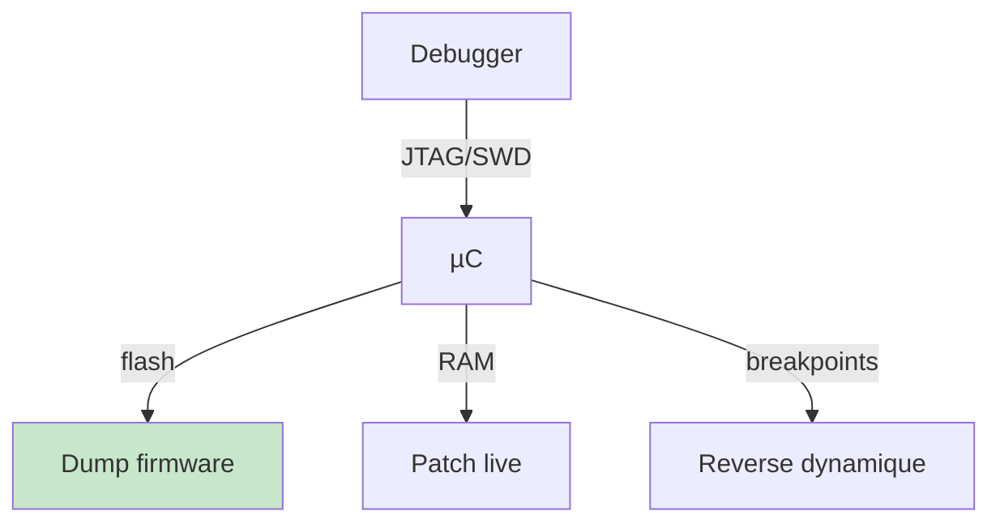
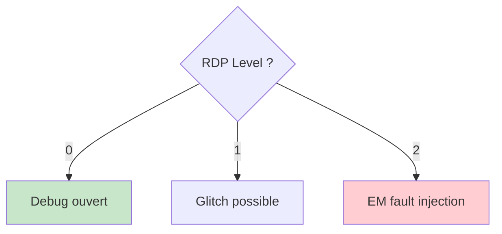
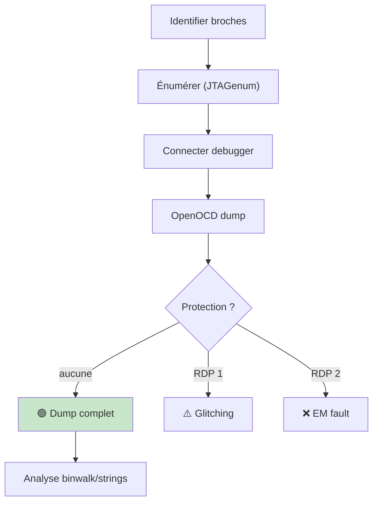
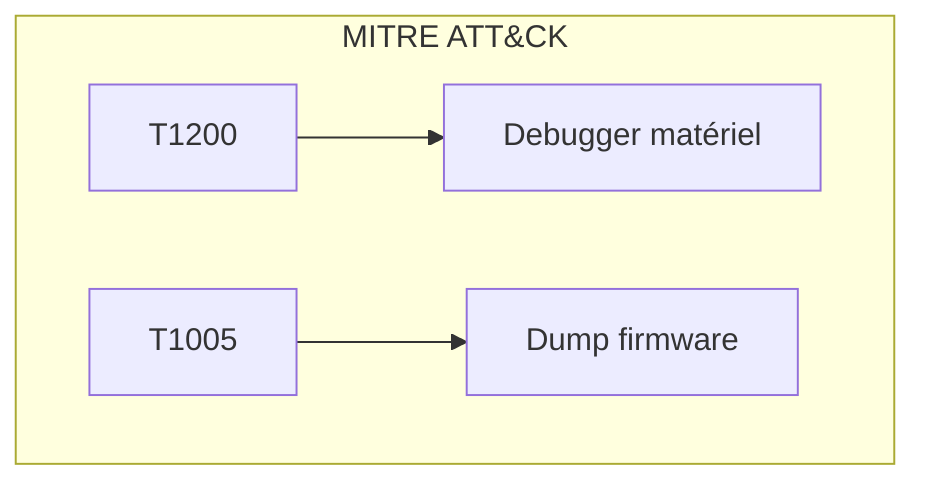

# 🔧 JTAG et SWD

> [!info] **En 1 phrase**
> JTAG/SWD = le **débogueur matériel** des microcontrôleurs : s'il n'est pas protégé, on a
> **lecture/écriture mémoire complète, dump du firmware et contrôle total** de la puce.

---

## 🧾 Overview

| Champ | Valeur |
|---|---|
| **Type** | Interface de debug/test matériel |
| **Domaine** | Hardware Hacking / Reverse Engineering |
| **Niveau** | Débutant → Avancé |
| **OS cibles** | ARM Cortex, AVR, MIPS, RISC-V |
| **Matériel requis** | ST-Link, J-Link, OpenOCD, Raspberry Pi |
| **Complexité** | Moyenne → Élevée |
| **Dernière mise à jour** | 2024-03-15 |

> [!info] 📊 **Diagramme de contexte**
> ```mermaid
> flowchart LR
>     DBG["Debugger<br>OpenOCD"] -->|"JTAG/SWD"| MCU["µC"]
>     MCU -->|"dump"| FW["Firmware"]
>     MCU -->|"accès"| EXP["Exploitation"]
>     style DBG fill:#e1f5fe
>     style EXP fill:#ffcdd2
> ```

---

## 🎯 Concept

> JTAG (IEEE 1149.1) est la norme de debug/test. SWD est la version ARM compacte (2 fils). Si non désactivées en production, elles offrent un accès mémoire complet.



> [!info] 💡 **Ce que permet JTAG/SWD**
> - **Dump firmware** complet.
> - **Lecture/écriture** RAM et registres.
> - **Breakpoints** → reverse dynamique.
> - **Contourner** vérifications logicielles.

---

## 🧠 Concepts fondamentaux

### Signaux JTAG

| Signal | Rôle |
|---|---|
| **TCK** | Horloge TAP controller |
| **TMS** | Sélection d'état |
| **TDI** | Données entrantes |
| **TDO** | Données sortantes |
| **TRST** | Reset (optionnel) |

### Signaux SWD

| Signal | Rôle |
|---|---|
| **SWCLK** | Horloge (← TCK) |
| **SWDIO** | Données bidirectionnelles (← TMS) |

### Correspondance JTAG ↔ SWD

| JTAG | SWD | Signal |
|---|---|---|
| TCK | SWCLK | Horloge |
| TMS | SWDIO | Données/mode |
| TDO | SWV | Sortie / trace |
| TDI | — | Entrée (unused SWD) |

---

## 🔌 Matériel / Composants

| Outil | Usage | Prix |
|---|---|---|
| ST-Link V2 | STM32, SWD | ~5-10 € |
| J-Link EDU | ARM, RISC-V | ~50-200 € |
| JTAGulator | Énumérateur broches | ~120 € |
| JTAGenum | Énumérateur Arduino | ~10 € |
| Tigard | JTAG/SWD/UART/SPI | ~30 € |
| Raspberry Pi | OpenOCD GPIO | ~40 € |

### Cibles typiques

| Catégorie | Processeur | Interface |
|---|---|---|
| STM32 | ARM Cortex-M | SWD |
| ESP32 | Xtensa/RISC-V | JTAG (USB) |
| RP2040 | ARM Cortex-M0+ | SWD |
| Routeurs | MIPS/ARM | JTAG |
| Arduino Mega | AVR | JTAG |

---

## ⚡ Protocoles

| Paramètre | JTAG | SWD |
|---|---|---|
| Broches | 4–5 | 2 |
| Vitesse | 10–100 MHz | 10–100 MHz |
| Portée | Universel | ARM uniquement |
| Direction | Full-duplex | Bidirectionnel |
| Norme | IEEE 1149.1 | ARM proprietary |

---

## 🔍 Identifier les broches JTAG

### Méthodes

```text
1. Datasheet / schémas → pinout officiel
2. Observation PCB → rangées de trous
3. JTAGenum / JTAGulator → brute-force
4. Logic analyzer pendant boot
```

### JTAGenum (Arduino)

```bash
# Flash JTAGenum → moniteur série → tapez "a"
# Sortie :
# +-- IDCODE scan --+
# | TCK | TMS | TDO | IDCODE     |
# |   2 |   3 |   0 | 0x3ba00477 |
# +--- SUCCESS ------+
```

### JTAGscan (RP2040)

```text
Modes : IDCODE (rapide), BYPASS (complet)
Résistance 33Ω en série sur chaque pin testée

+-- IDCODE scan --+
| TCK | TMS | TDO |
|   2 |   3 |   0 |
+--- SUCCESS ------+
```

### Broches suspectes

| Indice | Description |
|---|---|
| Rangée 4–6 trous | Connecteur debug non soudé |
| Résistances 33Ω en série | Pistes JTAG |
| Label "J1", "DBG" | Marquage fabricant |

---

## 🛠️ Exploitation (OpenOCD)

### Dump firmware

```bash
# Config dump
cat > dump_fw.cfg << 'EOF'
init
reset init
halt
dump_image firmware.bin 0x00000000 0x00040000
exit
EOF

# STM32
sudo openocd -f interface/stlink-v2.cfg -f target/stm32f1x.cfg -f dump_fw.cfg

# nRF51
sudo openocd -f interface/stlink-v2-1.cfg -f target/nrf51.cfg -f dump_fw.cfg

# Analyse
binwalk firmware.bin
strings firmware.bin | grep -i password
```

### Console interactive

```bash
sudo openocd -f interface/stlink-v2.cfg -f target/stm32f1x.cfg -c "init; halt"

# Console OpenOCD
mdw 0x08000000            # lire
mww 0x08000000 0xDEADBEEF # écrire
dump_image fw.bin 0x08000000 0x10000
load_image fw.bin 0x08000000
resume
```

### AVR

```bash
avrdude -p m128 -c jtagmkI -P /dev/ttyUSB0 -U flash:r:flash.bin:r
```

---

## 🚧 Les protections (RDP / lock bits)

| Protection | Effet | Contournement |
|---|---|---|
| AVR lock bits | Bloque lecture flash | Efface tout ⚠️ |
| STM32 RDP Level 1 | Pas de dump debug | Glitching possible |
| STM32 RDP Level 2 | Debug irréversible | EM fault injection |
| Read-protect + vérif | Dump mais code vérifie | Patch via debug |

> [!warning] **RDP 1 → RDP 0 = wipe de la flash !** Dump d'abord.



---

## 🧪 Exemples pratiques

### 🟢 Débutant — Dump STM32

```bash
sudo openocd -f interface/stlink-v2.cfg -f target/stm32f1x.cfg \
    -c "init; halt; dump_image firmware.bin 0x08000000 0x40000; exit"
binwalk firmware.bin
```

### 🟡 Intermédiaire — Énumération JTAG

```bash
# 1. Connecter broches candidates à JTAGenum
# 2. Lancer scan (tapez "a")
# 3. Identifier TCK/TMS/TDO/TDI
# 4. OpenOCD avec broches identifiées
# 5. Dump
```

### 🔴 Avancé — Bypass RDP Level 1

```python
import serial, time
ser = serial.Serial("/dev/ttyUSB0", 115200, timeout=1)
for delay in range(100, 500, 10):
    for pulse in range(1, 20):
        # Glitch voltage pendant reset
        # Vérifier si debug réactivé
        # Si oui : dump via JTAG
        pass
ser.close()
```

### ⚫ Expert — Scan chain multi-device

```bash
sudo openocd -f interface/jlink.cfg \
    -c "transport select jtag" \
    -c "adapter speed 10000" \
    -c "jtag scan_chain" \
    -c "init; halt; dump_image chain.bin 0x0 0x100000; exit"
```

---

## 🧪 Workflow complet



| Étape | Action | Outil |
|---|---|---|
| 1 | Observation PCB | Multimètre, loupe |
| 2 | Énumération | JTAGenum, JTAGulator |
| 3 | Connexion | ST-Link, J-Link |
| 4 | Dump | openocd dump_image |
| 5 | Analyse | binwalk, radare2 |

---

## 🎬 Scénarios avancés

### Scénario 1 — Routeur : dump firmware JTAG

| Élément | Détail |
|---|---|
| **Objectif** | Extraire firmware routeur MIPS |
| **Matériel** | J-Link, pinces |
| **Étapes** | Trouver broches → JTAGenum → OpenOCD → dump |
| **Résultat** | Firmware complet → Ghidra |
| **Difficulté** | ⭐⭐⭐ |

### Scénario 2 — STM32 : bypass RDP1

| Élément | Détail |
|---|---|
| **Objectif** | Dump firmware STM32F4 RDP1 |
| **Matériel** | ChipWhisperer, ST-Link |
| **Étapes** | Voltage glitch → réactivation debug → dump |
| **Difficulté** | ⭐⭐⭐⭐ |

---

## 🛡️ Cybersecurity use cases

| Use case | Sévérité | Impact |
|---|---|---|
| JTAG ouvert | Critique | Accès mémoire total |
| SWD non protégé | Critique | Dump firmware |
| Lock bits absents | Élevée | Dump + modification |

| Phase pentest | Rôle JTAG/SWD |
|---|---|
| Accès initial | Dump firmware |
| Reverse | Breakpoints, registers |
| Exploitation | Patch mémoire live |

---

## 🎯 MITRE ATT&CK

| Technique ID | Nom | Catégorie |
|---|---|---|
| T1200 | Hardware Additions | Initial Access |
| T1195 | Supply Chain Compromise | Initial Access |
| T1005 | Data from Local System | Collection |



---

## 🛡️ Defensive Security

| Mesure | Efficacité | Priorité |
|---|---|---|
| RDP Level 2 | Très élevée | Haute |
| Lock bits AVR | Élevée | Haute |
| Supprimer pads | Élevée | Moyenne |
| Firmware chiffré | Élevée | Moyenne |
| Secure boot | Élevée | Haute |

---

## 🤖 Automatisation

```python
import subprocess, os
def jtag_dump(iface, target, out, addr="0x08000000", size="0x40000"):
    cfg = f"init\nreset init\nhalt\ndump_image {out} {addr} {size}\nexit\n"
    open("/tmp/jtag_dump.cfg","w").write(cfg)
    subprocess.run(f"sudo openocd -f interface/{iface}.cfg -f target/{target}.cfg -f /tmp/jtag_dump.cfg".split())
    if os.path.exists(out):
        print(f"[+] {out} ({os.path.getsize(out)} bytes)")

jtag_dump("stlink-v2", "stm32f1x", "firmware.bin")
```

| Outil | Usage |
|---|---|
| OpenOCD | Interface JTAG/SWD |
| J-Link Commander | Flash/debug |
| avrdude | AVR programming |

---

## 📤 Output et parsing

```bash
binwalk firmware.bin
strings firmware.bin | grep -iE 'password|key|secret'
hexdump -C firmware.bin | head -50
radare2 -q -c 'aaa; afl' firmware.bin
```

---

## 🔗 Intégrations

- [[13 - Hardware & IoT|⚙️ Hardware & IoT]]
- [[Hardware - JTAG et SWD]] (cette fiche)
- [[Hardware - Dump et Analyse de Firmware|💾 Dump de firmware]]

| Outil | Usage |
|---|---|
| [[Hardware - UART]] | Console série |
| [[Hardware - Fault Injection]] | Bypass RDP |
| [[Hardware - Logic Analyzer]] | Capture signaux |

---

## 🔄 Alternatives

| Alternative | Avantages | Inconvénients |
|---|---|---|
| UART | Console interactif | Moins d'accès mémoire |
| I2C/SPI | EEPROM | Pas de debug |
| Fault injection | Bypass protections | Complexe |

---

## ⚡ Performance

| Métrique | Valeur |
|---|---|
| Vitesse | 10–100 MHz |
| Dump 256 KB | ~1-5 s |
| Dump 1 MB | ~5-20 s |

---

## 🛠️ Troubleshooting

| Problème | Cause | Solution |
|---|---|---|
| "no JTAG" | Mauvaises broches | Ré-énumérer |
| "Target not halted" | RDP actif | Vérifier level |
| Dump corrompu | Contact | Ressouder |

```bash
openocd -f interface/stlink-v2.cfg -f target/stm32f1x.cfg -c "init; targets"
lsusb | grep -i "st-link\|jlink"
```

---

## 🔐 Sécurité

| Risque | Mitigation |
|---|---|
| JTAG exposé | RDP Level 2, supprimer pads |
| Firmware lisible | Chiffrement |
| Debug non désactivé | Lock bits, eFuse |

> [!warning] Toujours désactiver JTAG/SWD en production.

> [!danger] RDP Level 2 irréversible sur STM32. Certifier firmware AVANT.

---

## ⚠️ Limitations

| Limite | Contournement |
|---|---|
| RDP Level 2 | EM fault injection |
| Broches absentes | Micro-sonde |
| Device non supporté | OpenOCD custom |

---

## 📋 Cheatsheet

```
┌───────────────────────────────────────────────────┐
│ JTAG / SWD — Cheatsheet                           │
├───────────────────────────────────────────────────┤
│ Énumérer :  JTAGenum / JTAGulator                 │
│ Dump :      openocd -c "dump_image fw.bin 0x0 0x40000"│
│ SWD pins :  SWCLK + SWDIO (2 fils ARM)            │
│ JTAG pins : TCK/TMS/TDI/TDO (+TRST)               │
│ RDP 0 :     Debug ouvert                            │
│ RDP 1 :     Glitch possible                         │
│ RDP 2 :     Irréversible                            │
│ Analyse :   binwalk -Y / strings / radare2         │
└───────────────────────────────────────────────────┘
```

---

## ⚡ Quick reference

| Élément | Valeur |
|---|---|
| **JTAG** | TCK, TMS, TDI, TDO, TRST |
| **SWD** | SWCLK, SWDIO |
| **Debugger** | ST-Link V2, J-Link |
| **Software** | OpenOCD, avrdude |
| **Dump** | `openocd -c "dump_image"` |

---

## 🔍 Détection & Défense

| Countermeasure | Efficacité |
|---|---|
| RDP Level 2 | Très élevée |
| Supprimer pads | Élevée |
| Firmware chiffré | Élevée |

---

## ⚠️ Tips & Pièges

- **Mesure d'abord** : continuité GND, tensions avant brancher debugger.
- **Dump peut être énorme** → stocke proprement.
- Après dump : `binwalk -Y` pour motifs ARM.
- **JTAG ouvert** = souvent le secret du CTF.

> [!tip] Énumère toujours avec JTAGenum avant de brancher un debugger.

---

## 📚 References

> [!info] 📚 **Sources**
> - [HardwareAllTheThings — JTAG](https://github.com/swisskyrepo/HardwareAllTheThings/blob/main/docs/debug-interfaces/jtag.md)
> - [JTAG HDD — wrongbaud](https://wrongbaud.github.io/posts/jtag-hdd/)

| Source | URL |
|---|---|
| OpenOCD | https://openocd.org/ |
| J-Link | https://www.segger.com/products/debug-probes/j-link/ |
| JTAGulator | https://github.com/grandideast/JTAGulator |

---

➡️ **Liens :** [[13 - Hardware & IoT|⚙️ Hardware & IoT]] · [[Hardware - UART|🔌 UART]] · [[Hardware - Dump et Analyse de Firmware|💾 Dump de firmware]] · [[Hardware - Fault Injection|⚡ Fault Injection]]
