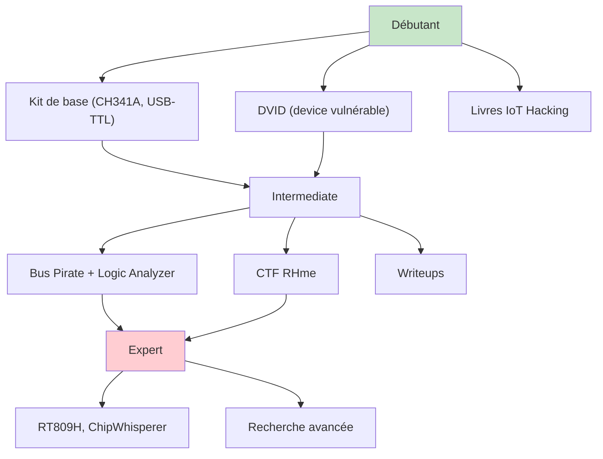
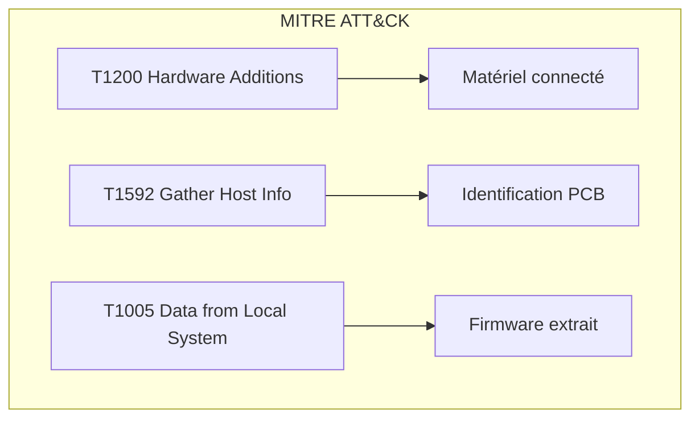
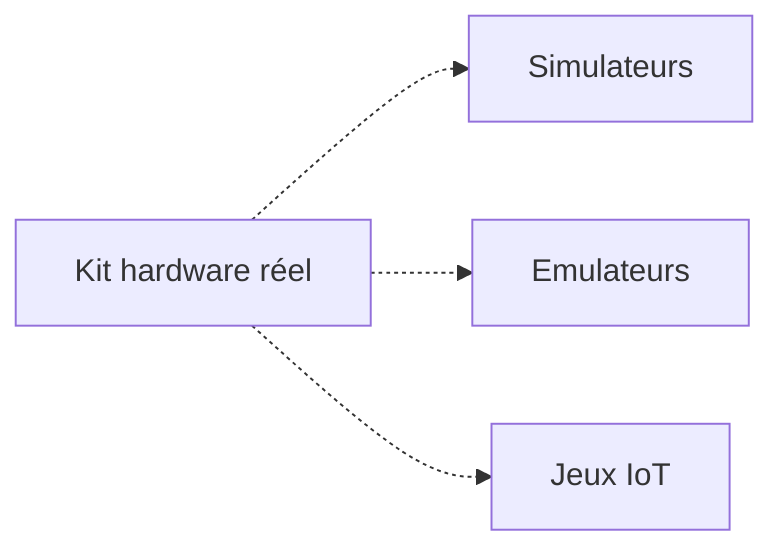

# 🧰 Kits et ressources

> [!info] **En 1 phrase**
> Une liste des **kits hardware, challenges CTF, chaînes, livres et ressources** pour
> apprendre le hardware hacking en conditions réelles.

---

## 🧾 Overview

| Champ | Valeur |
|---|---|
| **Type** | Ressources d'apprentissage et matériel |
| **Domaine** | Hardware Hacking / Formation |
| **Niveau** | Beginner → Expert |
| **OS cibles** | Tous (Linux, Windows, macOS) |
| **Matériel requis** | Kit hardware de base, PC |
| **Complexité** | Faible (début) → Élevée (expert) |
| **Dernière mise à jour** | 2025-08-14 |

> [!info] 📊 **Diagramme de contexte**
> ```mermaid
> flowchart LR
>     A["Apprendre le hardware hacking"] --> B["CTF & challenges"]
>     A --> C["Kits & matériel"]
>     A --> D["Livres & cours"]
>     A --> E["Streaming & writeups"]
>     B --> F["BLE CTF"]
>     B --> G["DVID"]
>     B --> H["RHme"]
>     C --> I["Kit de soudure, sondes, programmateur"]
>     D --> J["IoT Hacking / Pentest Cookbook"]
>     E --> K["virtualabs, writeups, vidéos"]
>     style A fill:#e1f5fe
> ```

---

## 🎯 Concept

> Le hardware hacking nécessite un apprentissage pratique. Les ressources listées ici permettent de progresser de débutant à expert grâce à des challenges CTF dédiés, du matériel d'entraînement, des livres de référence, et une communauté active de streamers et de chercheurs.



> [!info] 💡 **Le combo gagnant**
> Un **kit de debug** (adaptateur USB-TTL, programmateur, sondes) + un **device d'entraînement** (DVID, camera, routeur) + les **writeups** de la communauté = progression rapide.

---

## 🧠 Concepts fondamentaux

### Progression d'apprentissage

| Niveau | Compétences | Ressources |
|---|---|---|
| **Débutant** | Identification composants, UART, SPI | CH341A, DVID, livres intro |
| **Intermédiaire** | JTAG, I2C, firmware analysis | Bus Pirate, CTF RHme, binwalk |
| **Avancé** | eMMC, fault injection, side-channel | RT809H, ChipWhisperer, recherche |
| **Expert** | Bypass secure boot, custom exploits | Tout hardware, publication |

### Compétences clés

| Terme | Définition |
|---|---|
| **UART** | Console série pour shell debug |
| **SPI/I2C** | Bus de communication pour flash et EEPROM |
| **JTAG/SWD** | Port de debug pour MCU |
| **Firmware dump** | Extraction du logiciel depuis la flash |
| **Reverse engineering** | Analyse du binaire pour comprendre le code |
| **Fault injection** | Perturbation électrique pour bypasser les protections |
| **Side-channel** | Analyse de la consommation/temps pour extraire des clés |

---

## 🔌 Matériel / Composants

### Kit hardware de base

```
Un kit hardware de base contient :
- Multimètre (continuité, tensions, résistances)
- Adaptateur USB-TTL 3.3V/5V (UART)
- Programmateur SPI flash (CH341A, RT809H) + pince SOIC
- Logic analyzer basique (Saleae clone / sigrok)
- Fer à souder + flux + hot air (boucliers EM/RF)
- Sondes, pinces crocodiles, fils de test
- Câbles Dupont (male-male, male-female, female-female)
- Résistances et condensateurs de test (kit assortment)
```

### Tableau des outils par niveau

| Niveau | Outils | Prix estimé | Usage |
|---|---|---|---|
| **Débutant** | CH341A, USB-TTL, multimètre | ~20 USD | Dump SPI, UART |
| **Intermédiaire** | + Bus Pirate, logic analyzer | ~60 USD | Multi-protocole |
| **Avancé** | + RT809H, fer à souder | ~120 USD | eMMC, BGA |
| **Expert** | + ChipWhisperer, oscilloscope | ~500+ USD | Fault injection |

### Cibles d'entraînement

| Catégorie | Exemples | Protocoles | Difficulté |
|---|---|---|---|
| DVID | Vulcainreo DVID | UART, SPI, I2C | Faible |
| Routeurs | TP-Link, Netgear | SPI, UART | Faible |
| Caméras IP | Hikvision, Dahua | UART, eMMC | Moyenne |
| DVR | Divers | UART, eMMC | Moyenne |
| BLE devices | nRF52, ESP32 | BLE | Moyenne |
| Arduino/ESP | Uno, ESP32 | UART, SPI | Faible |

---

## ⚡ CTF & Challenges

### BLE CTF

| Ressource | URL | Description |
|---|---|---|
| BLE CTF (hackgnar) | github.com/hackgnar/ble_ctf | Apprendre le hack Bluetooth en pratique |
| Learning Bluetooth Hackery | hackgnar.com/2018/06 | Tutorial BLE Hacking |
| BLE CTF Writeup | blog.tclaverdie.eu | Writeup Eclectic Koala |
| Tapplock Smart Lock | pentestpartners.com | Exploitation Bluetooth |

### DVID — Damn Vulnerable IoT Device

| Ressource | URL | Description |
|---|---|---|
| DVID | github.com/Vulcainreo/DVID | Device IoT volontairement vulnérable |
| Writeups DVID | swisskyrepo.github.io/DVID | Solutions et writeups |
| Présentation DVID | triplesec.info | Arnaud Courty @Vulcainreo |
| findTheDatasheet (EN) | blog.ghozt.ninja | Recherche de datasheets |
| findTheDatasheet (FR) | shoxxdj.fr | Version française |
| defaultPassword (FR) | shoxxdj.fr | Mots de passe par défaut |
| Vidéo GreHack 2019 | youtube.com | Hack The Damn Vulnerable IoT Device |

### Riscure CTF (RHme)

| Ressource | URL | Description |
|---|---|---|
| RHme-2017 (CTF 3) | github.com/Riscure/Rhme-2017 | Dernière édition |
| RHme-2016 (CTF 2) | github.com/Riscure/Rhme-2016 | Édition précédente |
| RHme-2015 (CTF 1) | github.com/Riscure/RHme-2015 | Première édition |

#### Vidéos RHme

| Titre | Lien |
|---|---|
| Reversing AVR avec radare2 — rhme2 Jumpy | youtube.com/watch?v=zk3JdMOQPc8 |
| UART/Serial sur device embarqué — rhme2 Setup | youtube.com/watch?v=TM-cuV9Nd1E |
| SHA1 length extension — rhme2 Secure Filesystem | youtube.com/watch?v=6QQ4kgDWQ9w |
| Reversing AVR — Memory Map & I/O Registers | youtube.com/watch?v=D0VKuZuuvW8 |
| Stack cookie brute force — rhme2 Photo manager | youtube.com/watch?v=01EX0mjya5A |
| Format string sur Arduino — rhme2 Casino | youtube.com/watch?v=fRgNtGXDMlY |
| Identifier UART et main() dans un firmware AVR | youtube.com/watch?v=hyoPAOTrUMc |
| loopback 0x03 — LiveOverflow | youtu.be/FI4serDzE4w |
| Writeup Team HydraBus | github.com/hydrabus/rhme-2016 |

### Autres challenges & tutos

| Ressource | URL | Description |
|---|---|---|
| Reversing Raw Binary in Ghidra | gist.github.com/nstarke | Tutorial Ghidra |
| Dumper un Arduino — thanatos | thanat0s.trollprod.org | Dump Arduino |
| Dumping firmware with BusPirate | blog.isecurion.com | Tutorial Bus Pirate |
| Embedded/IoT Linux Red-Blue | pentesteracademy.com | Cours Pentester Academy |
| From PCBs to exploits | hackinparis.com | virtualabs @ Hack in Paris 2018 |

---

## 📺 Twitch & Streaming

| Chaîne | Plateforme | Spécialité |
|---|---|---|
| virtualabs | Twitch | Hacking hardware en direct (FR) |
| VirtuVOD | YouTube | VOD de virtualabs |
| WHID "We Hack In Disguise" | YouTube | Hardware hacking, USB attacks |

> [!info] 💡 **virtualabs** est LA référence francophone du hacking hardware en direct. Ses streams combinent UART, JTAG, firmware analysis et exploitation sur du vrai matériel.

---

## 📚 Livres

| Titre | Auteur | Année | Niveau |
|---|---|---|---|
| IoT Penetration Testing Cookbook | Aaron Guzman, Aditya Gupta | 2017 | Intermediate |
| The IoT Hacker's Handbook | Aditya Gupta | 2019 | Intermediate |
| Practical IoT Hacking | Chantzis, Stais, Calderon, Deirmentzoglou, Woods | 2021 | Intermediate-Advanced |
| Advanced Penetration Testing Hacking IoT | Richard Knowell | 2019 | Advanced |
| Hardware Hacking Handbook | Jasper van Woudenberg, Colin O'Flynn | 2021 | Advanced |
| The Art of PCB Reverse Engineering | Keng Tiong Ng | 2015 | Advanced |

---

## 🧰 Hardware Kits

### Images de référence


### Kits par fabricant

| Kit | Contenu | Prix | Usage |
|---|---|---|---|
| DVID Kit | PCB DVID + accessoires | ~50 EUR | Entraînement |
| Ph0wn Kit | Multi-device IoT | Variable | Competition |
| WHID Training Kit | Outils offensive | Variable | Formation |
| Bus Pirate Kit | Bus Pirate + câbles | ~40 USD | Debug multi-protocole |

### Composition d'un kit avancé

```
Kit hardware avancé :
1. Multimètre numérique (Fluke ou équivalent)
2. Oscilloscope basique (Hantek, Siglent)
3. Logic analyzer (Saleae 8ch ou DSLogic)
4. Bus Pirate v5/v6
5. CH341A programmer
6. RT809H programmer
7. ST-Link V2 + J-Link
8. Fer à souder température contrôlée
9. Station hot air (pour BGA)
10. Microscope USB 200×
11. Clips SOIC-8, probes hook
12. Sondes, pinces crocodiles, fils Dupont
13. Résistances, condensateurs, LED (kit assortment)
14. USB-TTL adapter (3.3V/5V)
15. ESP32, Arduino Uno, Raspberry Pi Zero W
```

---

## ⚡ Ressources en ligne

### Sites de référence

| Site | URL | Contenu |
|---|---|---|
| HardwareAllTheThings | github.com/swisskyrepo/HardwareAllTheThings | Guides hardware hacking |
| Hackster.io | hackster.io | Projets IoT |
| Instructables | instructables.com | Tutoriels hardware |
| Dangerous Prototypes | dangerousprototypes.com | Projets open-source |

### Outils en ligne

| Outil | URL | Usage |
|---|---|---|
| Alldatasheet | alldatasheet.com | Recherche datasheets |
| SnapEDA | snapeda.com | Symboles et footprints |
| Component Search Engine | componentsearchengine.com | Recherche composants |
| Digikey | digikey.com | Achat composants |

### Communautés

| Communauté | Plateforme | Spécialité |
|---|---|---|
| r/hardwarehacking | Reddit | Hardware hacking general |
| r/ReverseEngineering | Reddit | Reverse engineering |
| Bus Pirate Forum | forum.buspirate.com | Bus Pirate |
| Hack5 Community | hack5.org | Outils offensive |

---

## 🔍 Détection & Défense

| Réponse | Détail |
|---|---|
| **Matériel d'entraînement dédié** | DVID / BLE CTF / RHme évitent de casser du vrai matériel |
| **Multiplier les devices d'entraînement** | Chaque plateforme (AVR, ARM, ESP, routeur) enseigne un pattern |
| **Reproduire les writeups** | Les CTF archivés (RHme) ont des solutions détaillées |
| **S'entraîner en lab RF** | SDR/BTS à tester dans une cage de Faraday |
| **Sécuriser le workspace** | Équipement ESD, ventilation pour soudure, organisation |

## ⚠️ Tips & Pièges

- **Piège 1** : **Commence par des devices faciles** (flash SPI, UART exposé) avant de t'attaquer aux TPM/secure boot.
- **Piège 2** : Les **kits CTF Riscure** (RHme) sont réutilisables en lab mais s'abîment avec le temps (flash).
- **Astuce 1** : **virtualabs** (Twitch/YouTube) est LA référence francophone du hacking hardware en direct.
- **Astuce 2** : Les **livres IoT** listés couvrent la méthode complète : recon → dump → analyse → exploitation.
- **Astuce 3** : Un **programmateur CH341A** suffit pour la majorité des dumps SPI — inutile d'investir avant d'avoir compris les bases.
- **Bonne pratique** : Toujours avoir un **device de remplacement** quand on travaille avec du matériel fragile.

> [!tip] Astuces
> - Rejoindre la **communauté virtualabs** pour des sessions d'entraînement en direct
> - Commencer par le **DVID** (le plus accessible et le mieux documenté)
> - Les **writeups RHme** sont d'excellents exercices progressifs
> - Un **kit de composants** (résistances, condensateurs) est utile pour les tests de continuité

---

## 🛡️ Cybersecurity use cases

| Use case | Sévérité | Matériel requis | Impact |
|---|---|---|---|
| Entraînement pentest hardware | Moyenne | Kit de base | Compétences |
| Compétition CTF | Élevée | Kit avancé | Réputation |
| Recherche sécurité | Élevée | Kit complet | Vulnérabilités |
| Audit device | Haute | Kit professionnel | Sécurité client |

| Phase pentest | Ce que permet cette technique |
|---|---|
| Recon | Identification des composants |
| Accès initial | Dump firmware, UART shell |
| Maintien d'accès | Re-flash firmware |
| Évasion | Modification config |

---

## 🎯 MITRE ATT&CK

| Technique ID | Nom | Catégorie | Applicabilité |
|---|---|---|---|
| T1200 | Hardware Additions | Initial Access | Ajout de matériel |
| T1592 | Gather Victim Host Info | Recon | Identification des composants |
| T1005 | Data from Local System | Collection | Dump firmware |
| T1552.001 | Credentials In Files | Credential Access | Extraction secrets |



### Mapping détaillé

| Phase MITRE | Technique | Cette fiche couvre |
|---|---|---|
| Recon | T1592 Gather Victim Host Info | Identification des composants |
| Initial Access | T1200 Hardware Additions | Connexion physique |
| Collection | T1005 Data from Local System | Dump firmware |
| Credential Access | T1552.001 Credentials in Files | Extraction secrets |

---

## 🛡️ Defensive Security

### Détection

| Signal de détection | Source | Fiabilité |
|---|---|---|
| Matériel d'entraînement | Inspection physique | Faible |
| Compétition CTF | Logs d'inscription | Faible |
| Recherche published | Publications | Faible |

| Indicateur | Log / Capteur | Seuil d'alerte |
|---|---|---|
| Nouveau device USB | dmesg | Tout device inconnu |
| Compétences suspectes | HR/Management | Subjectif |

### Prévention

| Mesure | Efficacité | Coût | Priorité |
|---|---|---|---|
| Sensibilisation | Élevée | Faible | Haute |
| Audit sécurité | Élevée | Moyen | Haute |
| Secure boot | Élevée | Moyen | Haute |

### Durcissement (hardening)

```bash
# Mesures de protection des devices
# 1. Secure boot activé
# 2. JTAG/SWD désactivé
# 3. UART de debug désactivé
# 4. Flash chiffrée
# 5. Conformal coating sur le PCB
```

---

## 🤖 Automatisation

### Scripts d'exploitation

```python
#!/usr/bin/env python3
"""Script de recommandation de matériel selon le niveau"""
def recommend_kit(level):
    kits = {
        "debutant": {
            "outils": ["CH341A", "USB-TTL 3.3V", "Multimètre"],
            "cibles": ["DVID", "Arduino Uno", "ESP8266"],
            "prix": "~20 USD",
            "ressources": ["HardwareAllTheThings", "DVID writeups"]
        },
        "intermediaire": {
            "outils": ["Bus Pirate v5", "Logic Analyzer 8ch", "Clip SOIC-8"],
            "cibles": ["Routeur IoT", "Caméra IP", "DVID"],
            "prix": "~60 USD",
            "ressources": ["RHme CTF", "binwalk", "Ghidra"]
        },
        "avance": {
            "outils": ["RT809H", "Fer à souder BGA", "Microscope USB"],
            "cibles": ["DVR", "Smart TV", "Device BGA"],
            "prix": "~120 USD",
            "ressources": ["ChipWhisperer", "Side-channel analysis"]
        },
        "expert": {
            "outils": ["ChipWhisperer", "Oscilloscope", "SDR"],
            "cibles": ["TPM", "Secure boot devices", "FPGA"],
            "prix": "~500+ USD",
            "ressources": ["Recherche publiée", "CVE analysis"]
        }
    }
    return kits.get(level, kits["debutant"])

# Exemple
kit = recommend_kit("intermediaire")
print(f"Outils: {', '.join(kit['outils'])}")
print(f"Cibles: {', '.join(kit['cibles'])}")
print(f"Budget: {kit['prix']}")
```

### Outils d'automatisation

| Outil | Usage | Lien |
|---|---|---|
| HardwareAllTheThings | Guides | github.com/swisskyrepo |
| Pentester Academy | Cours en ligne | pentesteracademy.com |
| Hackster.io | Projets | hackster.io |

### Intégration dans des frameworks

| Framework | Méthode d'intégration |
|---|---|
| Pentest methodology | Checklist hardware |
| Training platform | Lab d'entraînement |
| CTF platform | Challenges custom |

---

## 📤 Output et parsing

### Formats de sortie

| Format | Exemple | Utilité |
|---|---|---|
| Markdown | notes.md | Documentation |
| JSON | resources.json | Base de données |
| PDF | writeups.pdf | Archivage |

### Parsing des résultats

```bash
# Sauvegarder les ressources
cat << EOF > hardware_resources.json
{
  "ctf": ["BLE CTF", "DVID", "RHme"],
  "tools": ["CH341A", "Bus Pirate", "RT809H"],
  "books": ["IoT Pentest Cookbook", "Practical IoT Hacking"],
  "streams": ["virtualabs", "WHID"]
}
EOF
```

### Intégration SIEM / Logging

| Source | Format | Pipeline |
|---|---|---|
| Documentation | Markdown | Base de connaissances |
| Writeups | HTML/PDF | Archive |
| Ressources | JSON | Base de données |

---

## 🔗 Intégrations

- [[13 - Hardware & IoT|⚙️ Hardware & IoT]] global
- [[Hardware - CH341A|💾 CH341A]] pour les dumps SPI
- [[Hardware - Bus Pirate|🏴‍☠️ Bus Pirate]] pour les dumps multi-protocole
- [[Hardware - Memory Programmer|🗄️ Memory Programmer]] pour eMMC/NAND
- [[Hardware - Logic Analyzer|📈 Logic Analyzer]] pour le sniffing
- [[Hardware - Dump et Analyse de Firmware|💾 Dump de firmware]] pour l'analyse
- [[Hardware - Composants électroniques|🧩 Composants]] pour l'identification
- [[Hardware - Arduino|🔌 Arduino]] pour l'entraînement
- [[Hardware - ESP32|🔌 ESP32]] pour l'IoT
- [[Hardware - Raspberry Pi|🍓 Raspberry Pi]] pour le développement

| Outils associés | Usage complémentaire |
|---|---|
| DVID | Device d'entraînement |
| BLE CTF | Challenge Bluetooth |
| RHme | CTF hardware avancé |
| virtualabs | Formation en direct |

| Intégration | Comment |
|---|---|
| CTF platforms | DVID, RHme, BLE CTF |
| Streaming | virtualabs, WHID |
| Documentation | HardwareAllTheThings |

---

## 🔄 Alternatives

| Alternative | Avantages | Inconvénients | Cas d'usage |
|---|---|---|---|
| Simulateurs | Pas de hardware | Pas réaliste | Théorie |
| Emulateurs (QEMU) | Pas de hardware | Limité | Debug SW |
| Jeux (IoT Village) | Ludique | Pas de matériel réel | Initiation |



---

## ⚡ Performance

| Métrique | Valeur | Impact |
|---|---|---|
| Temps d'apprentissage | 3-12 mois | Variable selon le niveau |
| Coût minimum | ~20 USD | CH341A + USB-TTL |
| Coût optimal | ~100-200 USD | Kit complet |
| Nombre de ressources | 50+ | Suffisant |

### Optimisations

| Technique | Gain | Complexité |
|---|---|---|
| Commencer par DVID | +progression | Faible |
| Suivre virtualabs | +pratique | Faible |
| Lire les writeups | +connaissances | Faible |
| Former en groupe | +motivation | Moyenne |

---

## 🛠️ Troubleshooting

| Problème | Cause probable | Solution |
|---|---|---|
| Kit trop cher | Budget limité | Commencer par CH341A seul |
| Pas de progression | Manque de pratique | Suivre un CTF progressif |
| Matériel cassé | Manipulation incorrecte | Suivre les guides de sécurité |
| Ressources obsolètes | Vieillissement | Vérifier les dates |

### Erreurs courantes

```
Erreur : "Pas de matériel disponible"
Cause : Budget insuffisant
Solution : Commenter par CH341A (3 USD) + DVID

Erreur : "Pas de progression"
Cause : Pas de structure d'apprentissage
Solution : Suivre le parcours : CH341A → DVID → Bus Pirate → RHme
```

### Diagnostic

```bash
# Vérifier les ressources disponibles
# Consulter HardwareAllTheThings
# Rejoindre la communauté virtualabs
# Suivre les writeups DVID
```

---

## 🔐 Sécurité

| Risque | Impact | Mitigation |
|---|---|---|
| Destruction de matériel | Élevé | Utiliser des devices d'entraînement |
| Exposition de données | Moyenne | Lab isolé |
| Achat de matériel contrefait | Faible | Vendeurs vérifiés |

> [!warning] Points de sécurité
> - Utiliser des **devices d'entraînement dédiés** (DVID) pour éviter de casser du vrai matériel
> - Travailler dans un **lab isolé** (pas de réseau entreprise)
> - **Vérifier l'authenticité** du matériel acheté (contrefaçons courantes)

### Restrictions légales

> [!danger] Cadre légal
> L'entraînement au hardware hacking est légal sur du matériel que vous possédez. Les techniques apprises doivent être utilisées uniquement dans un cadre autorisé (pentest, CTF, recherche).

---

## ⚠️ Limitations

| Limite | Impact | Contournement |
|---|---|---|
| Coût du matériel | Budget | Commencer par le basique |
| Manque de matériel réel | Pratique limitée | Simulateurs + DVID |
| Ressources obsolètes | Informations fausses | Vérifier les dates |
| Pas de mentor | Progression lente | Communauté, streaming |

### Cas où ces ressources ne suffisent pas

| Scénario | Raison |
|---|---|
| Recherche avancée | Nécessite des équipements spécialisés |
| Compétition nationale | Nécessite un entraînement intensif |
| Audit professionnel | Nécessite des certifications |

---

## 📋 Cheatsheet

```
┌─────────────────────────────────────────────┐
│ Kits & Ressources — Cheatsheet              │
├─────────────────────────────────────────────┤
│ Débutant :  CH341A + DVID + livres          │
│ Inter :     + Bus Pirate + LA + RHme        │
│ Avancé :    + RT809H + BGA + microscope     │
│ Expert :    + ChipWhisperer + oscilloscope   │
│ Stream :    virtualabs (Twitch/YouTube)      │
│ CTF :       BLE CTF, DVID, RHme             │
│ Livres :    IoT Hacking Handbook, Practical  │
│ Community : Reddit, Hack5, Bus Pirate Forum  │
│ Tools :     HardwareAllTheThings (GitHub)    │
└─────────────────────────────────────────────┘
```

| Ressource | URL |
|---|---|
| HardwareAllTheThings | github.com/swisskyrepo/HardwareAllTheThings |
| DVID | github.com/Vulcainreo/DVID |
| BLE CTF | github.com/hackgnar/ble_ctf |
| RHme 2017 | github.com/Riscure/Rhme-2017 |
| virtualabs | twitch.tv/virtualabs |
| virtuVOD | youtube.com/@VirtuVOD |
| WHID | youtube.com/@whid_ninja |

---

## ⚡ Quick reference

| Élément | Valeur / Commande |
|---|---|
| **Fonction** | Ressources d'apprentissage hardware hacking |
| **Kit débutant** | CH341A + USB-TTL + multimètre (~20 USD) |
| **Device débutant** | DVID (Vulcainreo) |
| **CTF référence** | RHme (Riscure) |
| **Stream référence** | virtualabs (Twitch) |
| **Livre référence** | Practical IoT Hacking (2021) |
| **GitHub référence** | HardwareAllTheThings |

---

## 🔍 Détection & Défense

| Signal | Méthode de détection | Outil |
|---|---|---|
| Achat matériel hacking | Logs d'achat | Surveillance |
| Compétition CTF | Logs d'inscription | Monitoring |

| Countermeasure | Efficacité | Implémentation |
|---|---|---|
| Sensibilisation | Élevée | Formation |
| Audit sécurité | Élevée | Pentest |

> [!tip] Défense
> La meilleure défense contre les attaques hardware est la **sensibilisation** des équipes et les **audits de sécurité** réguliers. Un pentest hardware permet d'identifier les vulnérabilités avant un attaquant.

---

## ⚠️ Tips & Pièges

- **Piège 1** : **Commence par des devices faciles** (flash SPI, UART exposé) avant de t'attaquer aux TPM/secure boot.
- **Piège 2** : Les **kits CTF Riscure** (RHme) sont réutilisables en lab mais s'abîment avec le temps (flash).
- **Astuce 1** : **virtualabs** (Twitch/YouTube) est LA référence francophone du hacking hardware en direct.
- **Astuce 2** : Les **livres IoT** listés couvrent la méthode complète : recon → dump → analyse → exploitation.
- **Astuce 3** : Un **programmateur CH341A** suffit pour la majorité des dumps SPI — inutile d'investir avant d'avoir compris les bases.
- **Bonne pratique** : Documenter ses findings dans un ** Obsidian vault** structuré pour retrouver l'information rapidement.

> [!tip] Astuces
> - Rejoindre la **communauté virtualabs** pour des sessions d'entraînement en direct
> - Commencer par le **DVID** (le plus accessible et le mieux documenté)
> - Les **writeups RHme** sont d'excellents exercices progressifs
> - Un **kit de composants** (résistances, condensateurs) est utile pour les tests de continuité
> - **Sauvegarder les writeups** dans un vault Obsidian pour référence future

---

## 📚 References

> [!info] 📚 **Sources**
> - [HardwareAllTheThings — Links & Hardware Kits](https://github.com/swisskyrepo/HardwareAllTheThings/blob/main/docs/other/links-and-hardware-kits.md)
> - [DVID — Vulcainreo](https://github.com/Vulcainreo/DVID)
> - [BLE CTF — hackgnar](https://github.com/hackgnar/ble_ctf)
> - [RHme — Riscure](https://github.com/Riscure/Rhme-2017)
> - [virtualabs — Twitch](https://www.twitch.tv/virtualabs)
> - [Pentester Academy](https://www.pentesteracademy.com)

### Documentation officielle

| Source | URL | Type |
|---|---|---|
| HardwareAllTheThings | https://github.com/swisskyrepo/HardwareAllTheThings | Guides |
| DVID | https://github.com/Vulcainreo/DVID | Device d'entraînement |
| BLE CTF | https://github.com/hackgnar/ble_ctf | Challenge BLE |
| RHme | https://github.com/Riscure/Rhme-2017 | CTF hardware |
| Hackster.io | https://hackster.io | Projets IoT |
| Pentester Academy | https://www.pentesteracademy.com | Cours en ligne |

### Vidéos / Tutorials

| Titre | Auteur | Lien |
|---|---|---|
| Hack The Damn Vulnerable IoT Device | Arnaud Courty | GreHack 2019 |
| From PCBs to Exploits | virtualabs | Hack in Paris 2018 |
| Reversing AVR with radare2 | Riscure | YouTube |
| UART/Serial on Embedded Device | Riscure | YouTube |

### Livres / Articles

| Titre | Auteur | Année |
|---|---|---|
| IoT Penetration Testing Cookbook | Aaron Guzman, Aditya Gupta | 2017 |
| The IoT Hacker's Handbook | Aditya Gupta | 2019 |
| Practical IoT Hacking | Chantzis et al. | 2021 |
| Advanced Penetration Testing Hacking IoT | Richard Knowell | 2019 |
| Hardware Hacking Handbook | Jasper van Woudenberg, Colin O'Flynn | 2021 |

---

➡️ **Liens :** [[13 - Hardware & IoT|⚙️ Hardware & IoT]] · [[Hardware - UART|🔌 UART]] · [[Hardware - JTAG et SWD|🔧 JTAG/SWD]] · [[Hardware - RFID et NFC|🏷️ RFID/NFC]]
