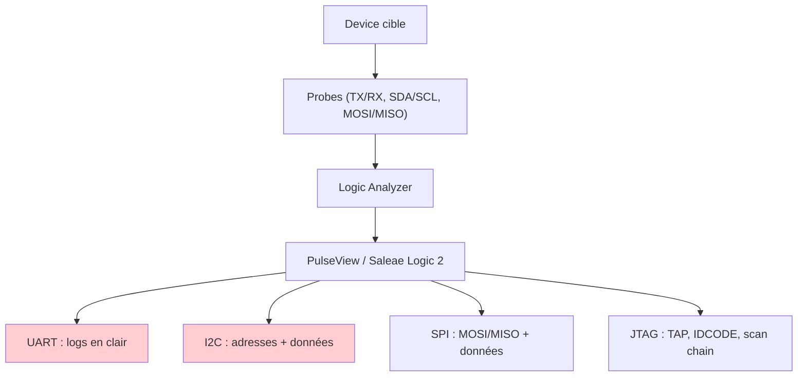
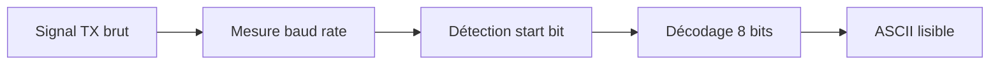
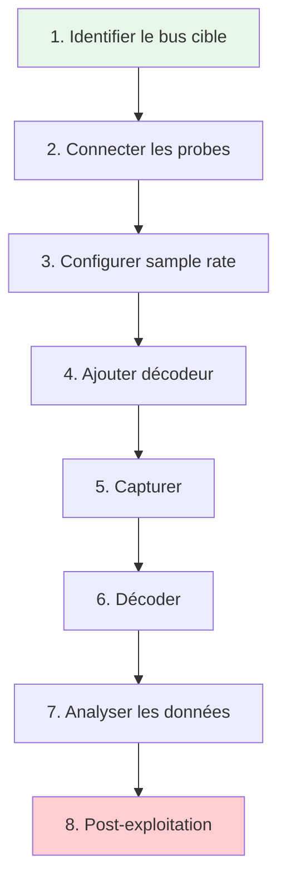
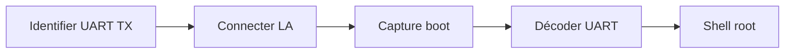
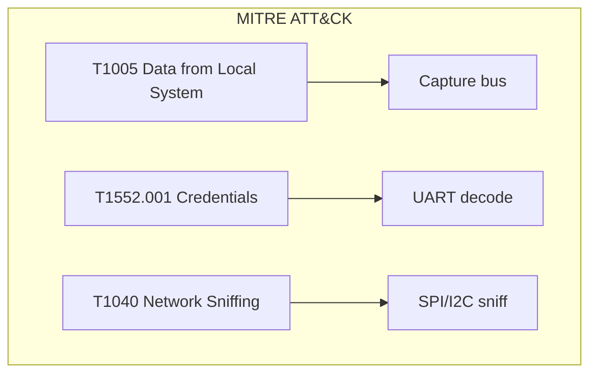
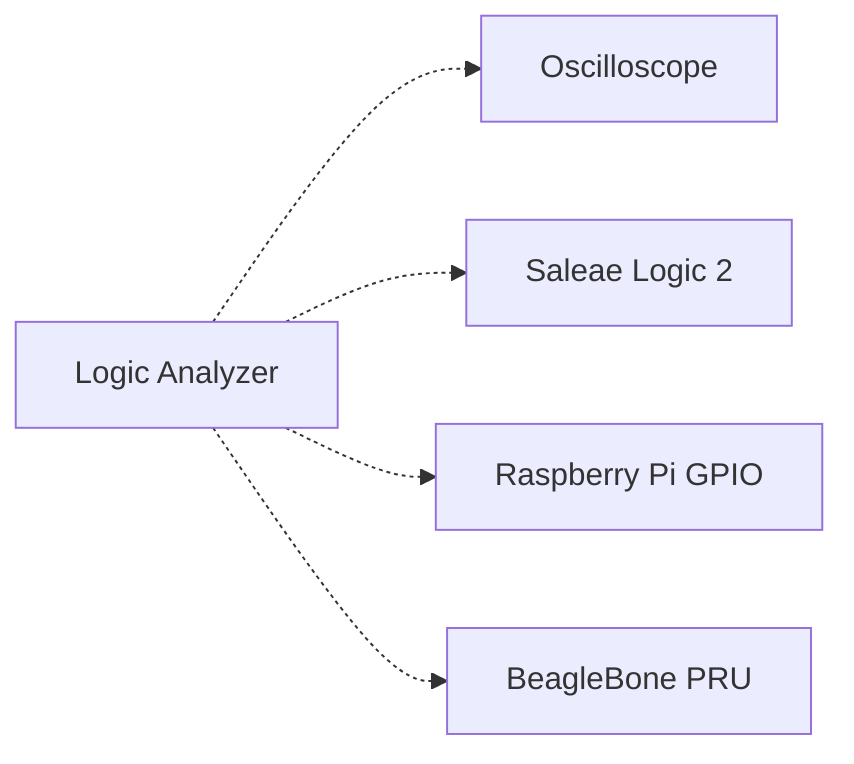

# Logic Analyzer

> [!info] **En 1 phrase**
> Le **logic analyzer** enregistre l'état de plusieurs signaux numériques dans le temps et
> **décode les protocoles** (UART, I2C, SPI, JTAG…) — l'outil qui transforme des bips
> inaudibles en **données exploitables** (logs, trames, secrets).

---

## Overview

| Champ | Valeur |
|---|---|
| **Type** | Instrument de mesure numérique |
| **Domaine** | Hardware Hacking / Debug |
| **Niveau** | Beginner → Expert |
| **OS cibles** | Linux, Windows, macOS (tout OS avec USB) |
| **Matériel requis** | Logic analyzer (Saleae, DSLogic, clone), sondes, PC |
| **Complexité** | Faible → Moyenne |
| **Dernière mise à jour** | 2025-08-14 |

> [!info] **Diagramme de contexte**
> ```mermaid
> flowchart LR
>     A["Device cible"] --> B["Probes sur signaux"]
>     B --> C["Logic Analyzer"]
>     C --> D["PC : PulseView / Saleae Logic 2"]
>     D --> E["Protocoles décodés"]
>     style A fill:#e1f5fe
>     style E fill:#c8e6c9
> ```

---

## Concept

> Un logic analyzer capture l'état logique (0/1) de plusieurs signaux numériques simultanément, avec un horodatage précis. Contrairement à un oscilloscope (analogique), il ne mesure que les niveaux logiques et les timings. Il est utilisé pour capturer et décoder les communications sur les bus debug (UART, I2C, SPI, JTAG) afin d'extraire les données transitant entre les composants d'un PCB.



> [!info] **Pourquoi un logic analyzer ?**
> Un oscilloscope montre la forme d'onde analogique (utile pour vérifier la qualité du signal), mais un logic analyzer est spécialisé dans la **capture et le décodage des protocoles numériques**. Il est moins cher, plus portable, et ses décodeurs de protocoles rendent l'analyse beaucoup plus rapide.

---

## Concepts fondamentaux

### Échantillonnage et timing

Le logic analyzer échantillonne les signaux à une fréquence fixe. Pour décoder correctement un protocole, il faut échantillonner à **au moins 4× la fréquence du signal** (Nyquist × 2 de sécurité).

| Terme | Définition |
|---|---|
| **Sample rate** | Fréquence d'échantillonnage (ex: 24 MHz) |
| **Channels** | Nombre de signaux capturés simultanément (8, 16, 32…) |
| **Trigger** | Condition de déclenchement de la capture (front montant, niveau) |
| **Decoder** | Logiciel qui interprète les bits en protocole (UART, I2C…) |
| **Protocol decode** | Décodage en temps réel des trames (adresses, données, start/stop) |
| **Threshold** | Seuil de tension pour distinguer 0 de 1 (ex: 1.8V, 3.3V) |
| **Glitch** | Perturbation très courte sur un signal (parasite) |

### UART decoding

Le décodeur UART (Async Serial) mesure la largeur du bit le plus court pour déterminer le baud rate, puis décode les trames (start bit, 8 data bits, parity, stop bit).



### I2C decoding

Le décodeur I2C identifie les conditions Start/Stop, l'adresse du device (7 bits + R/W), et les octets de données transmis.

### SPI decoding

Le décodeur SPI identifie le Chip Select (CS bas), puis décode MOSI et MISO en temps réel.

---

## Matériel / Composants

### Comparaison des logic analyzers

| Caractéristique | Saleae Logic 8 | Saleae Logic Pro 16 | DSLogic Plus | DSLogic U3Pro16 | Clone 8ch USB | sigrok compatible |
|---|---|---|---|---|---|---|
| **Canaux** | 8 | 16 | 16 | 16 | 8 | Variable |
| **Sample rate** | 100 MS/s | 500 MS/s | 400 MS/s | 1 GS/s | 24 MHz | Variable |
| **Voltage** | 1.2-5.5V | 1.2-5.5V | 1.8-5V | 1.8-5V | 3.3V/5V | Variable |
| **Logiciel** | Logic 2 (propriétaire) | Logic 2 (propriétaire) | DSView (open-source) | DSView (open-source) | PulseView (open-source) | PulseView |
| **Prix** | ~100 USD | ~400 USD | ~70 USD | ~150 USD | ~5-15 USD | Variable |
| **Décodeurs** | 25+ | 25+ | 20+ | 20+ | 20+ | 20+ |
| **API** | Oui | Oui | Limitée | Oui | Non | Non |

### Outils principaux

| Outil | Type | Usage | Prix | Source |
|---|---|---|---|---|
| Saleae Logic 8 | Logic analyzer professionnel | Capture/décodage protocoles | ~100 USD | saleae.com |
| Saleae Logic Pro 16 | Logic analyzer haut de gamme | Capture/décodage 500 MS/s | ~400 USD | saleae.com |
| DSLogic Plus | Logic analyzer open-source | Capture/décodage 400 MS/s | ~70 USD | seeedstudio.com |
| DSLogic U3Pro16 | Logic analyzer rapide | Capture/décodage 1 GS/s | ~150 USD | seeedstudio.com |
| Clone 8ch 24MHz | Clone bon marché | Capture basique | ~5-15 USD | AliExpress |
| Saleae clone | Clone Saleae | Capture/décodage | ~15-30 USD | AliExpress |

### Cibles typiques

| Catégorie | Bus capturés | Utilité |
|---|---|---|
| IoT / Routeur | UART debug, SPI flash, I2C capteurs | Logs boot, config |
| MCU (STM32, ESP32) | UART, SPI, I2C, JTAG | Debug, dump firmware |
| Caméra IP | UART, I2C, SPI | Console, config |
| DVR | UART, I2C, eMMC | Console, credentials |
| Carte à puce | SPI, I2C | Communication carte |
| Module RFID | SPI, I2C | Protocole carte |

### Pinout / Brochage type (clone 8 channels)

```
Vue du logic analyzer clone 8 canaux :

  ┌──────────────────────────┐
  │   Logic Analyzer 8ch     │
  │                          │
  │   [USB]          [Barrette]
  │                          │
  │   Brochage barrette :    │
  │   Pin 1  = GND           │
  │   Pin 2  = GND           │
  │   Pin 3  = CH0           │
  │   Pin 4  = CH1           │
  │   Pin 5  = CH2           │
  │   Pin 6  = CH3           │
  │   Pin 7  = CH4           │
  │   Pin 8  = CH5           │
  │   Pin 9  = CH6           │
  │   Pin 10 = CH7           │
  │   Pin 11 = VCC (3.3V)    │
  │   Pin 12 = VCC (5V)      │
  │                          │
  └──────────────────────────┘

Connexion typique :
  GND (LA) ──── GND (cible)
  CH0 ────────── TX (UART)
  CH1 ────────── RX (UART)
  CH2 ────────── SDA (I2C)
  CH3 ────────── SCL (I2C)
```

---

## Protocoles décodés

### UART (Async Serial)

| Paramètre | Valeur |
|---|---|
| **Baud rate** | Auto-détecté ou manuel |
| **Data bits** | 7 ou 8 |
| **Parity** | None, Even, Odd |
| **Stop bits** | 1 ou 2 |
| **Direction** | Full-duplex (2 canaux TX/RX) |

### I2C

| Paramètre | Valeur |
|---|---|
| **Vitesse** | 100 kHz (Standard), 400 kHz (Fast), 1 MHz (Fast+) |
| **Adresses** | 7 bits (0x03-0x77) ou 10 bits |
| **Canaux requis** | 2 (SDA, SCL) |
| **Direction** | Half-duplex |

### SPI

| Paramètre | Valeur |
|---|---|
| **Vitesse** | jusqu'à 50 MHz |
| **Modes** | 0, 1, 2, 3 (CPOL/CPHA) |
| **Canaux requis** | 4 (CLK, MOSI, MISO, CS) |
| **Direction** | Full-duplex |

### JTAG

| Paramètre | Valeur |
|---|---|
| **Vitesse** | jusqu'à 6 MHz |
| **Signaux** | TMS, TCK, TDI, TDO, TRST (optionnel) |
| **Canaux requis** | 4-5 |
| **Direction** | Full-duplex |

### Comparaison des protocoles

| Protocole | Canaux min | Vitesse max | Complexité décodage | Usage pentest |
|---|---|---|---|---|
| UART | 2 (TX/RX) | 115200 baud | Très faible | Logs boot, shell |
| I2C | 2 (SDA/SCL) | 1 MHz | Faible | EEPROM, capteurs |
| SPI | 4 | 50 MHz | Moyenne | Flash, display |
| JTAG | 4-5 | 6 MHz | Élevée | Debug, scan chain |
| 1-Wire | 1 | 16 kbps | Très faible | Capteurs |

---

## Installation / Setup

### Prérequis

| Composant | Version | Lien |
|---|---|---|
| PulseView | 0.4.2+ | sigrok.org |
| Saleae Logic 2 | latest | saleae.com |
| DSView | latest | github.com/DreamSourceLab |
| sigrok-cli | 0.7+ | sigrok.org |
| Librairie libsigrok | latest | sigrok.org |

### Connexion physique

```
PC ──── USB ──── Logic Analyzer ──── Probes ──── Device cible
│                                 │
│  GND (LA) ──────────────────── GND (cible)
│  CH0 ───────────────────────── TX / SDA / MOSI
│  CH1 ───────────────────────── RX / SCL / MISO
│  CH2 ───────────────────────── SCL / CLK
│  CH3 ───────────────────────── CS / TMS
│  VCC (optionnel) ───────────── 3.3V (power si besoin)
```

### Outils logiciels

```bash
# Installation de PulseView (Ubuntu/Debian)
sudo apt install pulseview

# Ou depuis les sources
git clone git://sigrok.org/libsigrok
git clone git://sigrok.org/pulseview
cd libsigrok && ./autogen.sh && ./configure && make && sudo make install
cd ../pulseview && ./autogen.sh && ./configure && make && sudo make install

# sigrok-cli (sans GUI)
sudo apt install sigrok-cli

# Vérification
pulseview --version
sigrok-cli --version

# Vérification du device
sigrok-cli --scan
```

### Installation Saleae Logic 2

```bash
# Télécharger depuis saleae.com
# Installer le logiciel (Windows/Mac/Linux)
# Connecter le Saleae Logic
# Le logiciel détecte automatiquement le device
```

---

## Configuration

### Paramètres PulseView

| Option | Valeur par défaut | Description |
|---|---|---|
| Sample rate | 1 MHz | Fréquence d'échantillonnage |
| Sample count | 1M | Nombre de samples à capturer |
| Threshold | 1.8V | Seuil logique (configurable) |
| Trigger | None | Déclenchement (rising, falling, edge) |
| Decoder | Manuel | Sélection du décodeur protocole |

### Configuration matérielle

| Paramètre | Recommandé | Min | Max |
|---|---|---|---|
| Sample rate | 4× le signal | 100 kHz | 1 GS/s |
| Threshold | 3.3V (la plupart) | 1.2V | 5.5V |
| Longueur capture | 10s-60s | 1s | 300s |
| Canaux utilisés | Nécessaires uniquement | 1 | 16 |

### Décodeurs disponibles (sigrok)

| Décodeur | Canaux | Usage |
|---|---|---|
| `uart` | TX, RX | Console série |
| `i2c` | SDA, SCL | Bus I2C |
| `spi` | CLK, MOSI, MISO, CS | Bus SPI |
| `jtag` | TMS, TCK, TDI, TDO | JTAG |
| `1wire_link` | DATA | 1-Wire |
| `can` | CAN_H, CAN_L | CAN bus |
| `sdp` | CLK, DATA | SD Protocol |
| `nrf905` | TX, RX, CE, CSN | NRF905 wireless |

---

## Commandes / Manipulations

### Commandes essentielles PulseView

| Commande | Description | Exemple |
|---|---|---|
| Run/Stop | Démarrer/arrêter la capture | Bouton Run |
| Cursor | Mesurer le timing entre 2 points | Outil Cursor |
| Zoom | Zoner sur une zone | Molette souris |
| Decoder | Ajouter un décodeur protocole | Clic droit → Add decoder |
| Export | Exporter en CSV/VCD | File → Export |

### Commandes sigrok-cli

```bash
# Scanner les devices
sigrok-cli --scan

# Capture UART
sigrok-cli -d fx2lafw --config samplerate=1m --samples 1m \
  --channels 0=TX,1=RX --protocol uart -P uart:baudrate=115200

# Capture I2C
sigrok-cli -d fx2lafw --config samplerate=4m --samples 4m \
  --channels 0=SDA,1=SCL --protocol i2c

# Capture SPI
sigrok-cli -d fx2lafw --config samplerate=8m --samples 8m \
  --channels 0=CLK,1=MOSI,2=MISO,3=CS --protocol spi

# Détection du baud rate UART
sigrok-cli -d fx2lafw --config samplerate=1m --samples 100k \
  --channels 0=TX -P uart
```

### Interaction avec le port série

```bash
# Parallèle : écouter la console UART en même temps que la capture
screen /dev/ttyUSB0 115200
# Le logic analyzer capture les signaux physiques pendant que screen affiche le texte
```

> [!info] **Puissance combinée**
> Un logic analyzer + un terminal série sur la même UART permet de voir à la fois le texte décodé ET le signal brut — idéal pour diagnostiquer les problèmes de communication.

---

## Exemples pratiques

### Débutant — Capture UART au boot

```bash
# 1. Connecter les probes : GND → GND cible, CH0 → TX du device
# 2. Ouvrir PulseView
# 3. Configurer : Sample rate = 1 MHz, Samples = 1M
# 4. Ajouter le décodeur : Clic droit → Protocol decoder → UART (Async Serial)
# 5. Configurer UART : baud = 115200, data bits = 8, parity = none, stop = 1
# 6. Cliquer "Run" puis allumer le device cible
# 7. Les logs de boot s'affichent en texte lisible dans le décodeur
# 8. Sauvegarder la capture (File → Save)
```

### Intermédiaire — Capture SPI flash read

```bash
# 1. Connecter les probes : GND, CH0=CLK, CH1=MOSI, CH2=MISO, CH3=CS
# 2. Ouvrir PulseView
# 3. Configurer : Sample rate = 8 MHz, Samples = 8M
# 4. Ajouter le décodeur SPI : CLK, MOSI, MISO, CS (active low)
# 5. Configurer SPI : mode 0 (CPOL=0, CPHA=0)
# 6. Cliquer "Run" puis déclencher une lecture flash sur le device
# 7. Les commandes SPI (Read ID, Read Data) s'affichent en hexadécimal
# 8. Filtrer les trames CS bas → données lues
```

### Avancé — Capture JTAG scan chain

```bash
# 1. Connecter les probes : GND, CH0=TMS, CH1=TCK, CH2=TDI, CH3=TDO
# 2. Ouvrir PulseView
# 3. Configurer : Sample rate = 4 MHz, Samples = 4M
# 4. Ajouter le décodeur JTAG
# 5. Configurer JTAG : pins TMS, TCK, TDI, TDO
# 6. Cliquer "Run" puis déclencher un scan JTAG
# 7. Les instructions IR, les données DR, et les IDCODE s'affichent
# 8. Identifier la scan chain (nombre de devices, IDs)
```

### Expert — Analyse multi-protocole simultanée

```python
#!/usr/bin/env python3
"""
Script expert : analyse simultanée de plusieurs protocoles
via sigrok-cli et parsing des résultats
"""
import subprocess
import json
import re

def capture_multi_protocol(duration_ms=10000, sample_rate="4m"):
    """Capture multi-protocole via sigrok-cli"""
    cmd = [
        "sigrok-cli",
        "-d", "fx2lafw",
        "--config", f"samplerate={sample_rate}",
        "--samples", str(duration_ms * 4000),  # 4000 samples per ms
        "--channels", "0=TX,1=RX,2=SDA,3=SCL,4=CLK,5=MOSI",
        "-P", "uart:baudrate=115200:rx=TX,i2c:sda=SDA:scl=SCL,spi:clk=CLK:mosi=MOSI",
        "--output-format", "json"
    ]
    result = subprocess.run(cmd, capture_output=True, text=True)
    return json.loads(result.stdout) if result.stdout else {}

def parse_uart_data(decoded_data):
    """Extraire les données UART décodées"""
    uart_frames = []
    for packet in decoded_data.get("packets", []):
        if packet.get("decoder") == "uart":
            uart_frames.append({
                "type": packet.get("annotation", [""])[0],
                "data": packet.get("data"),
                "time": packet.get("time", 0)
            })
    return uart_frames

def parse_i2c_data(decoded_data):
    """Extraire les données I2C décodées"""
    i2c_frames = []
    for packet in decoded_data.get("packets", []):
        if packet.get("decoder") == "i2c":
            i2c_frames.append({
                "type": packet.get("annotation", [""])[0],
                "data": packet.get("data"),
                "address": packet.get("ann", ""),
                "time": packet.get("time", 0)
            })
    return i2c_frames

# Exécution
data = capture_multi_protocol()
uart = parse_uart_data(data)
i2c = parse_i2c_data(data)

print(f"[+] Trames UART: {len(uart)}")
print(f"[+] Trames I2C: {len(i2c)}")

for frame in uart:
    if frame["type"] == "data":
        print(f"  UART: {chr(frame['data']) if isinstance(frame['data'], int) else frame['data']}")
```

---

## Workflow complet (scénario pas à pas)



### Étape 1 — Identification

| Action | Commande | Résultat attendu |
|---|---|---|
| Identifier les signaux | Multimètre, continuité | TX, RX, SDA, SCL… |
| Vérifier la tension | Multimètre | 3.3V ou 1.8V |
| Déterminer le protocole | Inspection PCB, datasheet | UART, I2C, SPI… |

### Étape 2 — Repérage des broches

| Méthode | Difficulté | Fiabilité |
|---|---|---|
| Datasheet du chip | Faible | Très élevée |
| Marquages sur PCB | Très faible | Faible |
| Mode Continuité | Faible | Moyenne |
| Oscilloscope | Moyenne | Élevée |

### Étape 3 — Connexion

Connecter GND en premier, puis les canaux de signal. Vérifier le threshold voltage.

### Étape 4 — Exploitation

Configurer le sample rate, ajouter le décodeur, lancer la capture, déclencher l'action cible.

### Étape 5 — Post-exploitation

Analyser les données décodées, extraire les secrets, documenter les findings.

---

## Scénarios avancés

### Scénario 1 — Extraction de credentials via UART debug

| Élément | Détail |
|---|---|
| **Objectif** | Capturer le shell UART d'un routeur au boot pour extraire les credentials root |
| **Matériel** | Logic analyzer 8ch, sondes Hook, câbles Dupont |
| **Étapes** | 1. Identifier UART TX sur le PCB → 2. Connecter LA → 3. PulseView, décodeur UART 115200 → 4. Capturer le boot complet → 5. Parser les logs |
| **Résultat** | Shell root avec credentials |
| **Difficulté** | |



### Scénario 2 — Sniffing SPI pour intercepter des données

| Élément | Détail |
|---|---|
| **Objectif** | Intercepter les communications SPI entre un MCU et une flash pour comprendre le protocole propriétaire |
| **Matériel** | Logic analyzer 16ch (DSLogic), sondes |
| **Étapes** | 1. Connecter 4 probes SPI → 2. DSView, décodeur SPI → 3. Capturer pendant 60s → 4. Filtrer les commandes Read/Write → 5. Analyser les données |
| **Résultat** | Protocole SPI complet décodé |
| **Difficulté** | |

---

## Cybersecurity use cases

| Use case | Sévérité | Matériel requis | Impact |
|---|---|---|---|
| Capture UART boot logs | Haute | Logic analyzer | Shell root, credentials |
| Sniffing SPI flash | Haute | Logic analyzer 4ch | Firmware en transit |
| Sniffing I2C config | Moyenne | Logic analyzer 2ch | Config, secrets |
| JTAG scan chain discovery | Élevée | Logic analyzer 4ch | Debug access |
| Protocole propriétaire reverse | Élevée | Logic analyzer 8-16ch | Compréhension complète |

| Phase pentest | Ce que permet cette technique |
|---|---|
| Recon | Identification des bus et protocoles |
| Accès initial | Capture de credentials via UART |
| Maintien d'accès | Compréhension du protocole |
| Post-exploitation | Extraction de données en transit |

---

## MITRE ATT&CK

| Technique ID | Nom | Catégorie | Applicabilité |
|---|---|---|---|
| T1005 | Data from Local System | Collection | Capture de données sur les bus |
| T1552.001 | Credentials In Files | Credential Access | Extraction via UART |
| T1040 | Network Sniffing | Collection | Sniffing de bus numériques |
| T1200 | Hardware Additions | Initial Access | Ajout du logic analyzer |



### Mapping détaillé

| Phase MITRE | Technique | Cette fiche couvre |
|---|---|---|
| Initial Access | T1200 Hardware Additions | Connexion physique du LA |
| Collection | T1005 Data from Local System | Capture de données |
| Credential Access | T1552.001 Credentials in Files | UART decode |
| Collection | T1040 Network Sniffing | SPI/I2C/JTAG sniffing |

---

## Defensive Security

### Détection

| Signal de détection | Source | Fiabilité |
|---|---|---|
| Probes connectées au PCB | Inspection physique | Élevée |
| Trafic UART inhabituel | Monitoring UART | Moyenne |
| Sniffing SPI/I2C | GPIO monitoring | Faible |

| Indicateur | Log / Capteur | Seuil d'alerte |
|---|---|---|
| Probes sur le PCB | Caméras / inspection | Tout probe |
| Trafic bus anormal | GPIO monitoring | >10 trames/seconde |

### Prévention

| Mesure | Efficacité | Coût | Priorité |
|---|---|---|---|
| Chiffrer les communications bus | Très élevée | Moyenne | Haute |
| Désactiver UART en production | Élevée | Faible | Haute |
| Anti-sondes (traces enterrées) | Moyenne | Moyenne | Moyenne |
| Encapsulation des composants | Moyenne | Faible | Moyenne |

### Durcissement (hardening)

```bash
# Désactiver le UART de debug (ESP32)
esptool.py --port COM3 burn_efuse UART_DISABLE

# Chiffrer les communications I2C/SPI
# (nécessite un MCU supportant le chiffrement matériel)

# Désactiver JTAG
openocd -f interface/stlink.cfg -c "stm32f1x.lock 0"
```

---

## Automatisation

### Scripts d'exploitation

```python
#!/usr/bin/env python3
"""Script d'automatisation : capture UART via sigrok-cli"""
import subprocess
import time
import re

SAMPLE_RATE = "1m"
SAMPLES = "10m"
BAUD = 115200

def capture_uart(duration_s=10):
    """Capture UART via sigrok-cli"""
    samples = str(int(SAMPLE_RATE.replace("m", "000000")) * duration_s)
    cmd = [
        "sigrok-cli",
        "-d", "fx2lafw",
        "--config", f"samplerate={SAMPLE_RATE}",
        "--samples", samples,
        "--channels", "0=TX",
        "-P", f"uart:baudrate={BAUD}:rx=TX",
        "--output-format", "ascii",
        "-A", "uart=uart-data"
    ]
    result = subprocess.run(cmd, capture_output=True, text=True, timeout=duration_s * 2)
    return result.stdout

def parse_uart_output(output):
    """Parser les données UART décodées"""
    data = ""
    for line in output.splitlines():
        if "uart-data" in line:
            match = re.search(r"uart-data=(\d+)", line)
            if match:
                char_code = int(match.group(1))
                data += chr(char_code)
    return data

# Capture pendant 10 secondes au boot du device
print("[*] Capture UART au boot...")
boot_log = capture_uart(10)
parsed = parse_uart_output(boot_log)
print(f"[+] Logs de boot:\n{parsed}")

# Rechercher des credentials
if "password" in parsed.lower() or "login" in parsed.lower():
    print("[+] Credentials potentiellement trouvés dans les logs de boot")
```

### Outils d'automatisation

| Outil | Usage | Lien |
|---|---|---|
| sigrok-cli | Capture CLI | sigrok.org |
| PulseView | Capture GUI | sigrok.org |
| Saleae Logic 2 | Capture professionnelle | saleae.com |
| Saleae API | Automatisation | docs.saleae.com |

### Intégration dans des frameworks

| Framework | Méthode d'intégration |
|---|---|
| Custom framework | Script Python + sigrok-cli |
| Forensics toolkit | Pipeline de capture + analyse |
| Automated pentest | Capture UART au boot |

---

## Output et parsing

### Formats de sortie

| Format | Exemple | Utilité |
|---|---|---|
| VCD (Value Change Dump) | capture.vcd | Standard universel |
| CSV | capture.csv | Analyse dans Excel |
| Binary | capture.bin | Raw samples |
| ASCII | dump.txt | Données décodées |

### Parsing des résultats

```bash
# Exporter en VCD pour analyse dans GTKWave
sigrok-cli -d fx2lafw --config samplerate=1m --samples 1m \
  --channels 0=TX -P uart:baudrate=115200 -O vcd > capture.vcd

# Analyser avec GTKWave
gtkwave capture.vcd

# Parser les données UART en texte
sigrok-cli -d fx2lafw --config samplerate=1m --samples 1m \
  --channels 0=TX -P uart:baudrate=115200 -A uart=uart-data

# Exporter en CSV
sigrok-cli -d fx2lafw --config samplerate=1m --samples 1m \
  --channels 0,1 -O csv > capture.csv
```

### Intégration SIEM / Logging

| Source | Format | Pipeline |
|---|---|---|
| PulseView captures | VCD/CSV | File → Parser → SIEM |
| sigrok-cli output | ASCII | stdout → Log file |
| Saleae captures | Saleae format | API → Parser → SIEM |

---

## Intégrations

- [[13 - Hardware & IoT| Hardware & IoT]] global
- [[Hardware - UART| UART]] pour la console série
- [[Hardware - I2C et SPI| I2C/SPI]] pour les protocoles de bus
- [[Hardware - JTAG et SWD| JTAG/SWD]] pour le debug
- [[Hardware - Dump et Analyse de Firmware| Dump de firmware]] pour l'analyse post-capture

| Outils associés | Usage complémentaire |
|---|---|
| oscilloscope | Vérification de la qualité du signal |
| Bus Pirate | Capture via SPI/I2C |
| OpenOCD | Debug JTAG |
| Saleae Logic 2 | Capture professionnelle |

| Intégration | Comment |
|---|---|
| sigrok | Driver universel pour LA |
| GTKWave | Visualisation VCD |
| Saleae API | Automatisation captures |

---

## Alternatives

| Alternative | Avantages | Inconvénients | Cas d'usage |
|---|---|---|---|
| Oscilloscope | Signal analogique complet | Moins de canaux, pas de décodage | Qualité signal |
| Bus Pirate | Multi-protocole, pas cher | Pas de timing précis | Communication |
| Saleae Logic 2 | Professionnel, API | Très cher | Production |
| Raspberry Pi GPIO | Pas cher | Limité en vitesse | Développement |
| BeagleBone PRU | Linux intégré | Complexe |嵌入式développement |



---

## Performance

| Métrique | Valeur | Impact |
|---|---|---|
| Sample rate max | 1 GS/s (DSLogic U3Pro16) | Capture haute fréquence |
| Nombre canaux | 8-16 (typique) | Couverture multi-bus |
| Mémoire capture | 256 Mbit - 4 Gbit | Longueur de capture |
| Latence décodage | Temps réel | Feedback immédiat |
| Taille fichier VCD | ~100 MB/million samples | Stockage |

### Optimisations

| Technique | Gain | Complexité |
|---|---|---|
| Réduire le sample rate | -50% taille fichier | Faible |
| Nombre de canaux minimum | -50% taille | Faible |
| Trigger sélectif | Capture ciblée | Faille |
| Compression VCD | -30% taille | Faible |

---

## Troubleshooting

| Problème | Cause probable | Solution |
|---|---|---|
| Signal bruité | Masse commune manquante | Connecter GND en premier |
| Décodeur faux | Sample rate trop bas | Augmenter (4× le signal) |
| Baud rate incorrect | Auto-détection échouée | Spécifier manuellement |
| Pas de signal | Mauvaise broche | Vérifier TX vs RX |
| Capture vide | Trigger mal configuré | Vérifier le trigger |
| Device non reconnu | Pilote manquant | Installer pilotes libsigrok |

### Erreurs courantes

```
Erreur : "No supported device found"
Cause : Pilote manquant ou device non supporté
Solution : Installer libsigrok, vérifier la liste des devices supportés

Erreur : "Failed to configure samplerate"
Cause : Sample rate trop élevé pour le device
Solution : Réduire le sample rate

Erreur : "No data captured"
Cause : Trigger mal configuré ou pas de signal
Solution : Utiliser "None" pour le trigger, vérifier les probes
```

### Diagnostic

```bash
# Vérifier les devices connectés
sigrok-cli --scan

# Vérifier la version
pulseview --version
sigrok-cli --version

# Vérifier les pilotes
dmesg | tail | grep -i "usb\|sigrok"

# Test basique
sigrok-cli -d fx2lafw --config samplerate=1m --samples 1k --channels 0
```

---

## Sécurité

| Risque | Impact | Mitigation |
|---|---|---|
| Capture de données sensibles | Élevé | Chiffrer les communications |
| Attribution physique | Élevé | Utilisation en lab |
| Données non sécurisées | Élevé | Chiffrer les captures |

> [!warning] Points de sécurité
> - Les **captures VCD** contiennent des données brutes — les chiffrer si sensibles
> - Ne jamais capturer de données en dehors du **périmètre autorisé**
> - Les **signaux UART** sont en clair — ne pas les exposer en production

### Restrictions légales

> [!danger] Cadre légal
> La capture de signaux numériques est légale sur du matériel que vous possédez ou pour lequel vous avez une autorisation. La capture de communications non autorisée peut constituer une interception illégale de données.

---

## Limitations

| Limite | Impact | Contournement |
|---|---|---|
| Numérique uniquement (0/1) | Pas de qualité signal | Oscilloscope |
| Sample rate limité (24 MHz basique) | Pas de signaux rapides | Saleae Pro ou DSLogic |
| Pas d'alimentation | Ne fournit pas de puissance | Alimentation externe |
| Nombre de canaux limité (8) | Pas de bus larges | LA 16+ canaux |
| Pas de décodage protocole natif (basique) | Nécessite logiciel | PulseView / Saleae |

### Cas où cette technique ne fonctionne pas

| Scénario | Raison |
|---|---|
| Signal analogique uniquement | LA est numérique |
| Très haute fréquence (>500 MHz) | LA basique limité |
| Protocole inconnu | Pas de décodeur disponible |
| Communication chiffrée | Décodeur montre du chiffre |

---

## Cheatsheet

```
┌─────────────────────────────────────────────┐
│ Logic Analyzer — Cheatsheet                 │
├─────────────────────────────────────────────┤
│ UART : TX→CH0, RX→CH1, 115200 baud         │
│ I2C :  SDA→CH0, SCL→CH1, 4× sample rate    │
│ SPI :  CLK→CH0, MOSI→CH1, MISO→CH2, CS→CH3 │
│ JTAG : TMS→CH0, TCK→CH1, TDI→CH2, TDO→CH3  │
│ GND :  TOUJOURS connecté en premier         │
│ Rate : 4× la fréquence du signal            │
│ Trigger : Rising edge pour UART start bit   │
│ Export : VCD → GTKWave, CSV → Excel         │
└─────────────────────────────────────────────┘
```

| Action | Commande |
|---|---|
| Scan devices | `sigrok-cli --scan` |
| Capture UART | `sigrok-cli -d fx2lafw --config samplerate=1m --samples 10m --channels 0=TX -P uart:baudrate=115200` |
| Export VCD | `sigrok-cli ... -O vcd > capture.vcd` |
| Decode SPI | `sigrok-cli ... -P spi:clk=CLK:mosi=MOSI:miso=MISO:cs=CS` |

---

## Quick reference

| Élément | Valeur / Commande |
|---|---|
| **Fonction** | Capture et décodage de protocoles numériques |
| **Brochage** | GND + CH0-CH7 (8 canaux typique) |
| **Vitesse par défaut** | 1 MHz (PulseView), 100 kHz (minimum UART) |
| **Voltage** | 1.2V-5.5V (threshold configurable) |
| **Logiciel principal** | PulseView, Saleae Logic 2 |
| **Commande rapide** | `sigrok-cli -d fx2lafw --config samplerate=1m --samples 1m --channels 0=TX -P uart:baudrate=115200` |

---

## Détection & Défense

| Signal | Méthode de détection | Outil |
|---|---|---|
| Probes sur le PCB | Inspection physique | Caméras |
| Capture de données | Monitoring bus | GPIO monitoring |
| Trafic UART | Analyse de trafic | Terminal + LA |

| Countermeasure | Efficacité | Implémentation |
|---|---|---|
| Chiffrer les communications | Très élevée | Crypto matériel |
| Désactiver UART | Élevée | eFuse / config |
| Traces enterrées | Moyenne | PCB layout |
| Encapsulation | Moyenne | Résine/époxy |

> [!tip] Défense
> La meilleure défense contre le sniffing de bus est le **chiffrement des communications** (UART chiffré, SPI chiffré). Le **désactivation du UART de debug** en production empêche l'accès au shell.

---

## Tips & Pièges

- **Piège 1** : **Échantillonner trop bas** = décodeurs faux → toujours au moins **4× la vitesse du signal**.
- **Piège 2** : **Masse commune obligatoire** entre l'analyzer et la cible, sinon bruit.
- **Astuce 1** : La capture **UART au boot** est la plus riche → déclencher le power-on juste avant.
- **Astuce 2** : **PulseView est gratuit et suffit** pour 90 % des cas (UART, I2C, SPI).
- **Astuce 3** : Le **baudrate se devine** en mesurant la largeur du bit le plus court dans PulseView.
- **Bonne pratique** : Toujours vérifier avec un oscilloscope si les données décodées semblent erronées.

> [!tip] Astuces
> - Un **clone 8ch 24 MHz** (~5 USD) suffit pour UART et I2C
> - Le **décodeur UART** peut auto-détecter le baud rate
> - **GTKWave** (gratuit) visualise les captures VCD
> - Les **captures de boot** sont les plus riches en informations

---

## References

> [!info] **Sources**
> - [HardwareAllTheThings — Logic Analyzer](https://github.com/swisskyrepo/HardwareAllTheThings/blob/main/docs/gadgets/logic-analyzer.md)
> - [sigrok — Downloads](https://sigrok.org/wiki/Downloads)
> - [Saleae Logic 2](https://www.saleae.com)
> - [DSLogic — DreamSourceLab](https://www.dreamsourcelab.com)
> - [PulseView Releases](https://github.com/sigrokproject/pulseview/releases)

### Documentation officielle

| Source | URL | Type |
|---|---|---|
| sigrok | https://sigrok.org | Suite logicielle open-source |
| Saleae | https://www.saleae.com | Logic analyzer professionnel |
| DSLogic | https://www.dreamsourcelab.com | Logic analyzer open-source |
| PulseView | https://sigrok.org/wiki/PulseView | GUI pour sigrok |

### Vidéos / Tutorials

| Titre | Auteur | Lien |
|---|---|---|
| Logic Analyzer Tutorial | Various | YouTube |
| UART Decode with PulseView | Various | YouTube |
| SPI Sniffing with Saleae | Various | YouTube |

### Livres / Articles

| Titre | Auteur | Année |
|---|---|---|
| Hardware Hacking Handbook | Jasper van Woudenberg, Colin O'Flynn | 2021 |
| The Art of PCB Reverse Engineering | Keng Tiong Ng | 2015 |

---

**Liens :** [[13 - Hardware & IoT| Hardware & IoT]] · [[Hardware - UART| UART]] · [[Hardware - I2C et SPI| I2C/SPI]] · [[Hardware - JTAG et SWD| JTAG/SWD]] · [[Hardware - Dump et Analyse de Firmware| Dump de firmware]]
