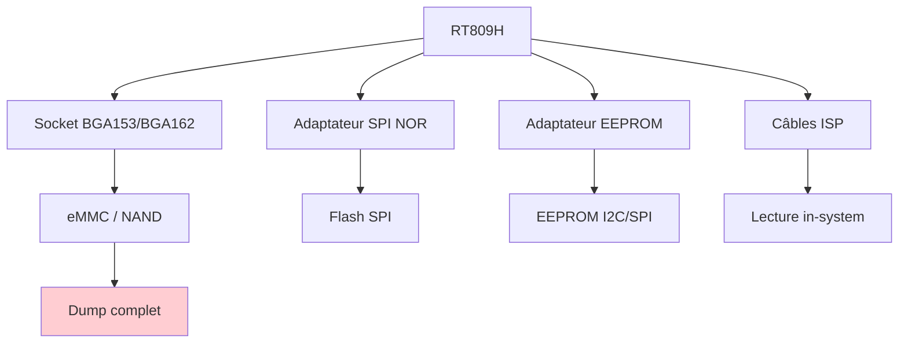
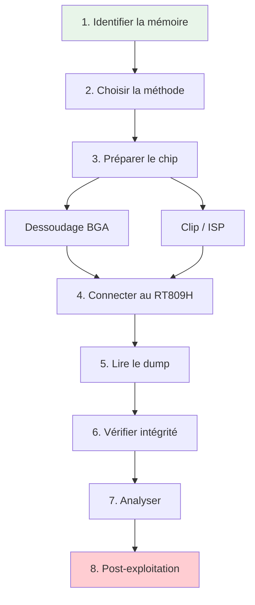
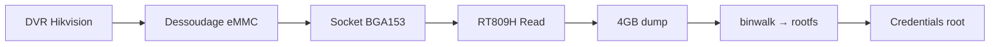
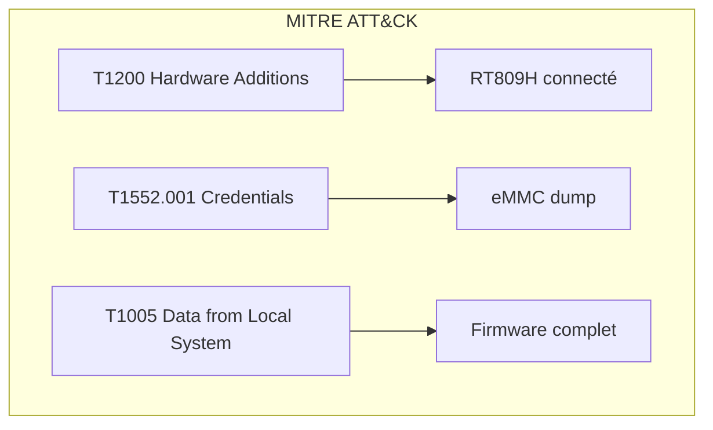
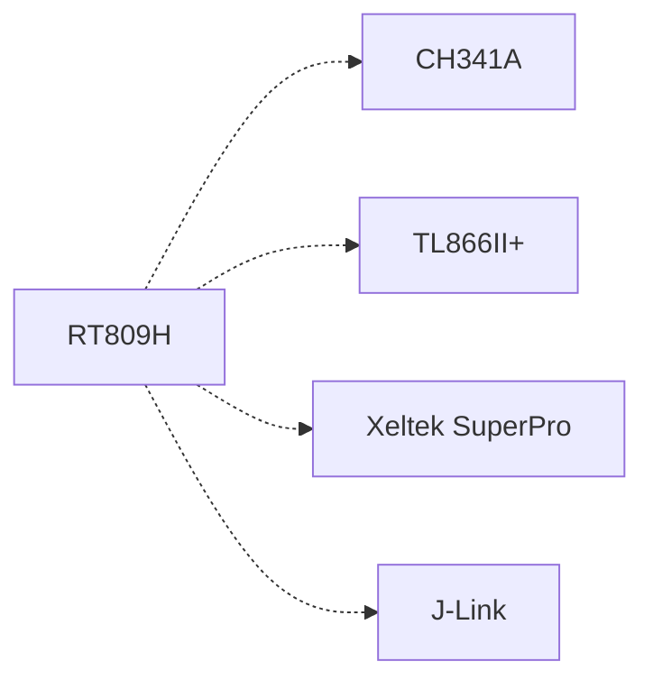

# Programmeur mémoire (RT809H)

> [!info] **En 1 phrase**
> Un **programmeur ISP** comme le **RT809H** lit/écrit **toutes les mémoires** — SPI NOR,
> **eMMC**, **NAND**, EEPROM — via des adaptateurs : l'outil indispensable pour **dumper
> un firmware** quand la flash n'est pas directement clipable.

---

## Overview

| Champ | Valeur |
|---|---|
| **Type** | Programmeur ISP multi-mémoire |
| **Domaine** | Hardware Hacking / Forensique firmware |
| **Niveau** | Intermediate → Expert |
| **OS cibles** | Windows (logiciel fabricant), Linux (flashrom/OpenOCD) |
| **Matériel requis** | RT809H, adaptateurs, PC, fer à souder/prechauffeur |
| **Complexité** | Élevée |
| **Dernière mise à jour** | 2025-08-14 |

> [!info] **Diagramme de contexte**
> ```mermaid
> flowchart LR
>     A["Device cible"] --> B["Déssoudage / Clip ISP"]
>     B --> C["RT809H"]
>     C --> D["PC : lecture / écriture"]
>     style A fill:#e1f5fe
>     style D fill:#c8e6c9
> ```

---

## Concept

> Le RT809H est un programmeur ISP (In-System Programming) professionnel qui supporte la lecture et l'écriture de toutes les mémoires courantes : SPI NOR, NAND Flash, eMMC, EEPROM, et même certains MCUs. Il est équipé de sockets BGA et d'adaptateurs pour les packages les plus courants, ce qui en fait l'outil de choix quand le clip SOIC-8 ne suffit pas (chips BGA, eMMC soudées).



> [!info] **Quand utiliser le RT809H ?**
> - La flash est en **BGA** (pas de clip possible)
> - La flash est **sous bouclier EM/RF** et doit être dessoudée
> - Vous avez besoin de lire une **eMMC** (smartphone, tablette, DVR)
> - Le **firmware est protégé** et nécessite une lecture ISP spécialisée

---

## Concepts fondamentaux

### Types de mémoire flash

| Terme | Définition |
|---|---|
| **SPI NOR** | Flash sérielle NOR — exécution in-place, faible capacité (4-256 Mbit), SOIC-8 |
| **NAND Flash** | Forte capacité (1-16 Gbit), nécessite ECC, TSOP-48/BGA |
| **eMMC** | NAND + contrôleur intégré, interface MMC, BGA-153/BGA-162 |
| **EEPROM** | Mémoire non volatile petite capacité (256 bit - 512 Kbit), I2C/SPI |
| **UFS** | Flash universelle (smartphones récents), BGA, successeur de eMMC |
| **OTP** | One-Time Programmable — fuse-based, irréversible |

### Packages de mémoire

| Package | Broches | Usage | Méthode de lecture |
|---|---|---|---|
| SOIC-8 | 8 | SPI NOR, EEPROM | Clip ou dessoudage |
| SOP-8 | 8 | SPI NOR | Clip ou dessoudage |
| TSOP-48 | 48 | NAND Flash | Socket ou dessoudage |
| BGA-153 | 153 | eMMC (48 pins actifs) | Socket BGA |
| BGA-162 | 162 | eMMC (52 pins actifs) | Socket BGA |
| BGA-100 | 100 | NAND Flash avancée | Socket BGA |
| WLCSP | Variable | Flash basse consommation | Socket spécialisé |

### In-System Programming (ISP)

L'ISP permet de programmer/lire une mémoire sans la dessouder du PCB, en connectant directement les signaux ISP sur les pads de test ou les broches exposées du device. Le RT809H supporte l'ISP pour de nombreux contrôleurs TV/moniteur.


---

## Matériel / Composants

### Outils principaux

| Outil | Type | Usage | Prix | Source |
|---|---|---|---|---|
| RT809H | Programmeur ISP | Lecture/écriture mémoire | ~30-50 USD | AliExpress |
| Socket BGA153 | Adaptateur | Lecture eMMC BGA-153 | ~10 USD | Inclus RT809H |
| Socket BGA162 | Adaptateur | Lecture eMMC BGA-162 | ~10 USD | Inclus RT809H |
| Adaptateur SOP16→DIP | PCB | Conversion package | ~3 USD | Inclus |
| Préchauffeur BGA | Station | Dessoudage BGA | ~50-200 USD | Divers |
| Pâte à souder | Consommable | Re-soudage BGA | ~10 USD | Standard |
| Flux à souder | Consommable | Aide au dessoudage | ~5 USD | Standard |

### Cibles typiques

| Catégorie | Exemples | Mémoire | Vulnérabilités |
|---|---|---|---|
| DVR/IP Camera | Hikvision, Dahua | eMMC, NAND | Firmware, credentials |
| Smart TV | Samsung, LG, Sony | eMMC, NAND | Firmware, DRM keys |
| Routeur haut de gamme | Cisco, Juniper | eMMC | IOS/OS, config |
| Smartphone (ancien) | Android entry-level | eMMC | Firmware, données |
| Tablette | Android tablettes | eMMC | Firmware complet |
| Décodeur TV | Boîtiers TNT/SAT | NAND, SPI | Firmware, config |
| Console de jeux | PS4, Xbox (ancien) | HDD/eMMC | Firmware modifié |

### Comparaison des programmeurs

| Programmeur | SPI | eMMC | NAND | EEPROM | BGA | Prix |
|---|---|---|---|---|---|---|
| RT809H | Oui | Oui | Oui | Oui | Oui | ~30 USD |
| CH341A | Oui | Non | Non | Oui | Non | ~3 USD |
| TL866II+ | Oui | Non | Non | Oui | Non | ~25 USD |
| Bus Pirate | Oui | Non | Non | Oui | Non | ~30 USD |
| Xeltek SuperPro | Oui | Oui | Oui | Oui | Oui | ~200+ USD |
| Dataman 48Pro2 | Oui | Oui | Oui | Oui | Oui | ~500+ USD |

---

## Protocoles

### MMC/SD (pour eMMC)

| Paramètre | Valeur |
|---|---|
| **Type** | Série synchrone |
| **Vitesse** | jusqu'à 52 MHz (High Speed) / 208 MHz (HS200) |
| **Voltage** | 1.8V / 3.3V |
| **Nombre de fils** | 4 (CMD, CLK, DAT0-DAT3) |
| **Direction** | Half-duplex |

### SPI (pour flash NOR)

| Paramètre | Valeur |
|---|---|
| **Type** | Série synchrone |
| **Vitesse** | jusqu'à 50 MHz |
| **Voltage** | 1.8V / 3.3V |
| **Nombre de fils** | 4 (CLK, MOSI, MISO, CS) |
| **Direction** | Full-duplex |

### NAND Flash interface

| Paramètre | Valeur |
|---|---|
| **Type** | Parallèle/série |
| **Vitesse** | 50 MHz (série), 33 MHz (parallèle) |
| **Voltage** | 1.8V / 3.3V |
| **Nombre de fils** | 8/16 (DATA) + control |
| **Direction** | Half-duplex |

### Comparaison des interfaces mémoire

| Interface | Vitesse | Capacité | Complexité | Usage |
|---|---|---|---|---|
| SPI NOR | 50 MHz | 4-256 Mbit | Faible | Boot firmware |
| NAND | 50 MHz | 1-16 Gbit | Moyenne | Stockage massif |
| eMMC | 208 MHz | 4-256 Gbit | Moyenne | Stockage intégré |
| EEPROM | 1 MHz | 256 bit - 512 Kbit | Très faible | Config |

---

## Installation / Setup

### Prérequis

| Composant | Version | Lien |
|---|---|---|
| RT809H | latest | Fourni avec programmeur |
| Logiciel RT809H | latest (Windows) | CD-ROM ou site fabricant |
| Driver USB | latest | Inclus |
| flashrom | latest (Linux) | flashrom.org |
| Préchauffeur BGA | - | Achat spécialisé |

### Connexion physique

```
PC ──── USB ──── RT809H ──── Adaptateur ──── Mémoire cible
│                         │
│  Socket BGA153 ──────── eMMC BGA-153 (dessoudée)
│  Socket BGA162 ──────── eMMC BGA-162 (dessoudée)
│  Adaptateur SPI ──────── Flash SPI NOR
│  Câbles ISP ──────────── Pads de test sur PCB
│  Adaptateur EEPROM ───── EEPROM 24Cxx
```

### Workflow type

```text
1. Identifier la puce (marquage, datasheet) et choisir l'adaptateur
2. Dessouder proprement ou utiliser un socket / clip ISP adapté
3. Connecter au RT809H → détection automatique par le logiciel
4. Lire toute la flash → dump.bin (vérifier le checksum)
5. Analyser le dump (binwalk, strings, reverse)
```

### Outils logiciels

```bash
# Installation du logiciel RT809H (Windows)
# Exécuter le setup fourni avec le programmeur
# Installer les pilotes USB

# Alternative Linux avec flashrom
sudo flashrom -p rt809h_spi -r dump.bin

# Vérification
flashrom --version
flashrom -p rt809h_spi
```

---

## Configuration

### Paramètres du logiciel RT809H

| Option | Valeur par défaut | Description |
|---|---|---|
| Vitesse | Auto | Détection automatique |
| Voltage | 1.8V/3.3V (auto) | Sélection par le logiciel |
| Type mémoire | Auto | Détection du chip |
| Mode lecture | Full | Lecture complète |
| Vérification | Oui | Comparaison après écriture |

### Configuration matérielle

| Paramètre | Recommandé | Min | Max |
|---|---|---|---|
| Temperature dessoudage | 260°C (lead-free) | 200°C | 300°C |
| Temps de chauffe | 30 secondes | 10s | 60s |
| Pression socket | Ferme | - | - |
| Capacité max | 256 Gbit | 64 Kbit | 512 Gbit |

### Adaptateurs inclus avec le RT809H

| Adaptateur | Package | Usage |
|---|---|---|
| Socket BGA153 | eMMC BGA-153 | Flash eMMC smartphones |
| Socket BGA162 | eMMC BGA-162 | Flash eMMC tablettes/DVR |
| Adaptateur SOP16→DIP | SOP-16 | Flash NAND parallèle |
| Adaptateur SOP8→DIP | SOP-8 | Flash SPI NOR |
| Support DIP8 | DIP-8 | EEPROM, flash SPI |
| Câbles ISP | Dupont | Lecture in-system |

---

## Commandes / Manipulations

### Commandes essentielles

| Commande | Description | Exemple |
|---|---|---|
| Auto-detect | Détection automatique du chip | Via logiciel RT809H |
| Read | Lecture complète | Via logiciel → Read → dump.bin |
| Write | Écriture complète | Via logiciel → Write → firmware.bin |
| Verify | Vérification | Via logiciel → Verify |
| Erase | Effacement | Via logiciel → Erase |
| Blank check | Vérification effacement | Via logiciel → Blank Check |

### Lecture avec le logiciel RT809H

```text
1. Connecter le chip au RT809H (socket ou câbles ISP)
2. Ouvrir le logiciel RT809H
3. Cliquer "Smart Identify" → le logiciel détecte le chip
4. Cliquer "Read" → lecture complète
5. Sauvegarder le fichier dump (.bin ou .hex)
6. Vérifier le checksum affiché
```

### Lecture avec flashrom (Linux)

```bash
# Détection du chip
sudo flashrom -p rt809h_spi

# Lecture complète
sudo flashrom -p rt809h_spi -r dump.bin

# Lecture avec chip spécifique
sudo flashrom -p rt809h_spi -c "W25Q128" -r dump.bin

# Écriture
sudo flashrom -p rt809h_spi -w new_firmware.bin

# Vérification
sudo flashrom -p rt809h_spi -v dump.bin
```

---

## Exemples pratiques

### Débutant — Dump eMMC via socket BGA

```bash
# 1. Identifier le chip eMMC sur le PCB (marquage, datasheet)
# 2. Dessouder le chip eMMC (préchauffeur, 260°C, 30 secondes)
# 3. Nettoyer les pads du chip (alu tape, flux)
# 4. Insérer le chip dans le socket BGA153/BGA162 du RT809H
# 5. Connecter le socket au RT809H
# 6. Ouvrir le logiciel RT809H
# 7. Smart Identify → le chip est détecté automatiquement
# 8. Read → dump complet (peut prendre 10-30 minutes selon la taille)
# 9. Vérifier le checksum
# 10. Sauvegarder le dump en .bin
```

### Intermédiaire — Lecture ISP d'un DVR

```bash
# 1. Identifier les pads ISP sur le PCB du DVR
# 2. Connecter les câbles ISP du RT809H aux pads (CMD, CLK, DAT0, GND, VCC)
# 3. Alimenter le DVR (ou utiliser l'alimentation du RT809H)
# 4. Smart Identify dans le logiciel
# 5. Read → dump de la flash eMMC
# 6. Analyser le dump :
binwalk -Me dump.bin
strings -n 6 dump.bin | grep -iE 'pass|key|token|root|admin'
# 7. Rechercher les credentials par défaut
grep -ra "default.*pass" dump.bin
```

### Avancé — Re-flash eMMC de DVR

```python
#!/usr/bin/env python3
"""
Script expert : backup et re-flash d'une eMMC via RT809H
ATTENTION : risque de brick du device
"""
import subprocess
import hashlib
import time

def backup_emmc():
    """Backup complet de l'eMMC"""
    print("[*] Début du backup eMMC...")
    # Via le logiciel RT809H (GUI) ou flashrom
    subprocess.run([
        "flashrom", "-p", "rt809h_spi",
        "-r", "emmc_backup.bin"
    ], check=True)

    h = hashlib.md5(open("emmc_backup.bin", "rb").read()).hexdigest()
    print(f"[+] Backup créé : emmc_backup.bin (hash: {h})")
    return h

def verify_integrity(dump_file):
    """Vérifier l'intégrité du dump"""
    # Vérifier la taille attendue
    size = os.path.getsize(dump_file)
    print(f"[*] Taille du dump : {size} octets ({size/1024/1024:.2f} MB)")

    # Vérifier la présence de signatures connues
    with open(dump_file, "rb") as f:
        data = f.read()

    signatures = {
        b"UBI#": "UBIFS",
        b"\x5d\x00\x00": "SquashFS",
        b"hsqs": "SquashFS (alt)",
        b"UBOOT": "U-Boot",
    }

    for sig, name in signatures.items():
        if sig in data:
            offset = data.index(sig)
            print(f"[+] Signature {name} trouvée à l'offset 0x{offset:X}")

def flash_emmc(firmware_file):
    """Flasher un nouveau firmware sur l'eMMC"""
    print(f"[*] Flash en cours : {firmware_file}")
    subprocess.run([
        "flashrom", "-p", "rt809h_spi",
        "-w", firmware_file
    ], check=True)
    print("[+] Flash terminé")

# Exécution
backup = backup_emmc()
verify_integrity("emmc_backup.bin")
```

### Expert — Analyse eMMC multi-partitions

```bash
# 1. Dump complet de l'eMMC
flashrom -p rt809h_spi -r emmc_full.bin

# 2. Identifier les partitions
fdisk -l emmc_full.bin

# 3. Extraire chaque partition
dd if=emmc_full.bin of=bootloader.bin bs=1 skip=0 count=$((0x100000))
dd if=emmc_full.bin of=rootfs.bin bs=1 skip=$((0x100000)) count=$((0x1000000))
dd if=emmc_full.bin of=config.bin bs=1 skip=$((0x1100000)) count=$((0x100000))

# 4. Analyser chaque partition
binwalk -Me bootloader.bin
binwalk -Me rootfs.bin
strings config.bin

# 5. Rechercher des secrets dans toutes les partitions
grep -ra "password\|secret\|key\|token" bootloader.bin rootfs.bin config.bin
```

---

## Workflow complet (scénario pas à pas)



### Étape 1 — Identification

| Action | Commande | Résultat attendu |
|---|---|---|
| Identifier le chip | Inspection visuelle + datasheet | eMMC BGA-153, NAND TSOP-48 |
| Vérifier la tension | Multimètre | 1.8V ou 3.3V |
| Déterminer la méthode | Analyse du PCB | Socket, clip, ou ISP |

### Étape 2 — Repérage des broches

| Méthode | Difficulté | Fiabilité |
|---|---|---|
| Datasheet eMMC | Faible | Très élevée |
| Marquage PCB | Faible | Moyenne |
| Pinout ISP (contrôleur TV) | Moyenne | Élevée |
| Broches de test | Faible | Élevée |

### Étape 3 — Connexion

Selon la méthode choisie : socket BGA, clip SOIC-8, ou câbles ISP sur pads de test.

### Étape 4 — Exploitation

Lancer la lecture via le logiciel RT809H ou flashrom, vérifier le checksum, sauvegarder le dump.

### Étape 5 — Post-exploitation

Analyser le dump (binwalk, strings, reverse), extraire les partitions, rechercher les secrets.

---

## Scénarios avancés

### Scénario 1 — Extraction firmware DVR Hikvision via eMMC

| Élément | Détail |
|---|---|
| **Objectif** | Extraire le firmware complet d'un DVR Hikvision via sa eMMC BGA-153 |
| **Matériel** | RT809H, socket BGA153, préchauffeur, station de soudure |
| **Étapes** | 1. Identifier eMMC Samsung KLMAG1JETD → 2. Dessouder (260°C, 30s) → 3. Socket BGA153 → 4. RT809H Read → 5. Dump 4GB → 6. binwalk extraction |
| **Résultat** | Firmware Linux complet avec credentials root |
| **Difficulté** | |



### Scénario 2 — Récupération firmware Smart TV brickée

| Élément | Détail |
|---|---|
| **Objectif** | Restaurer le firmware d'une Smart TV Samsung dont le eMMC est corrompue |
| **Matériel** | RT809H, socket BGA162, firmware officiel, préchauffeur |
| **Étapes** | 1. Dessouder eMMC BGA-162 → 2. Vérifier le dump (corrompu) → 3. Télécharger firmware officiel → 4. Flasher via RT809H → 5. Resouder → 6. Tester |
| **Résultat** | TV restaurée |
| **Difficulté** | |

---

## Cybersecurity use cases

| Use case | Sévérité | Matériel requis | Impact |
|---|---|---|---|
| Extraction firmware DVR | Haute | RT809H + socket BGA | Firmware complet |
| Récupération post-brick | Moyenne | RT809H | Restauration |
| Clonage de device | Haute | RT809H | Duplication |
| Forensique eMMC | Haute | RT809H | Preuve numérique |
| Analyse de firmware | Moyenne | RT809H | Reverse engineering |

| Phase pentest | Ce que permet cette technique |
|---|---|
| Recon | Identification des composants mémoire |
| Accès initial | Dump firmware pour analyse hors-ligne |
| Maintien d'accès | Re-flash avec firmware modifié |
| Post-exploitation | Extraction de secrets (clés, credentials) |
| Évasion | Modification de la config réseau |

---

## MITRE ATT&CK

| Technique ID | Nom | Catégorie | Applicabilité |
|---|---|---|---|
| T1200 | Hardware Additions | Initial Access | Ajout du RT809H |
| T1552.001 | Credentials In Files | Credential Access | Extraction depuis eMMC |
| T1005 | Data from Local System | Collection | Dump complet |
| T1195.002 | Supply Chain Compromise | Initial Access | Re-flash firmware |
| T1083 | File and Directory Discovery | Discovery | Exploration partitions |



### Mapping détaillé

| Phase MITRE | Technique | Cette fiche couvre |
|---|---|---|
| Initial Access | T1200 Hardware Additions | Connexion physique du RT809H |
| Initial Access | T1195.002 Supply Chain | Re-flash firmware |
| Credential Access | T1552.001 Credentials in Files | Extraction eMMC |
| Collection | T1005 Data from Local System | Dump complet |
| Discovery | T1083 File and Directory Discovery | Analyse partitions |

---

## Defensive Security

### Détection

| Signal de détection | Source | Fiabilité |
|---|---|---|
| Dessoudage de composants | Inspection physique | Très élevée |
| Connexion RT809H | Logs USB | Élevée |
| Modification firmware | Integrity monitoring | Élevée |
| eMMC remplacée | Hardware inventory | Élevée |

| Indicateur | Log / Capteur | Seuil d'alerte |
|---|---|---|
| Absence de chip eMMC | Hardware inventory | Tout changement |
| Firmware modifié | Secure boot log | Tout changement |
| Connexion RT809H | USB monitoring | Tout device RT809H |

### Prévention

| Mesure | Efficacité | Coût | Priorité |
|---|---|---|---|
| eMMC encryption | Très élevée | Moyenne | Haute |
| Secure boot | Très élevée | Moyenne | Haute |
| RDP (Read Protection) | Élevée | Faible | Haute |
| Conformal coating | Moyenne | Faible | Moyenne |
| Anti-tamper | Élevée | Élevée | Moyenne |

### Durcissement (hardening)

```bash
# Activer le chiffrement eMMC (exemple: Android)
# Via les efuses du contrôleur

# Vérifier le secure boot
# Vérifier les logs de boot pour l'intégrité du firmware

# Activer le ReadOut Protection (STM32)
# Via les efuses ou OpenOCD
openocd -f interface/stlink.cfg -c "stm32f1x.lock 0"
```

---

## Automatisation

### Scripts d'exploitation

```python
#!/usr/bin/env python3
"""Script d'automatisation RT809H — dump eMMC"""
import subprocess
import hashlib
import os
import time

def dump_emmc(output_file="emmc_dump.bin"):
    """Dump complet de l'eMMC via RT809H"""
    print("[*] Début du dump eMMC...")

    # Détection du chip
    result = subprocess.run(
        ["flashrom", "-p", "rt809h_spi"],
        capture_output=True, text=True
    )
    print(f"[*] Détection: {result.stdout}")

    # Lecture complète
    start = time.time()
    subprocess.run([
        "flashrom", "-p", "rt809h_spi",
        "-r", output_file
    ], check=True)
    elapsed = time.time() - start

    size = os.path.getsize(output_file)
    print(f"[+] Dump terminé: {output_file}")
    print(f"    Taille: {size/1024/1024:.2f} MB")
    print(f"    Temps: {elapsed:.1f}s")
    print(f"    Débit: {size/elapsed/1024:.2f} KB/s")

    # Vérification MD5
    h = hashlib.md5(open(output_file, "rb").read()).hexdigest()
    print(f"    MD5: {h}")
    return output_file

def verify_emmc(dump_file, reference_file):
    """Vérifier un dump contre une référence"""
    dump_hash = hashlib.md5(open(dump_file, "rb").read()).hexdigest()
    ref_hash = hashlib.md5(open(reference_file, "rb").read()).hexdigest()

    if dump_hash == ref_hash:
        print("[+] Dumps identiques")
        return True
    else:
        print("[-] Dumps différents")
        return False

# Exécution
dump = dump_emmc()
```

### Outils d'automatisation

| Outil | Usage | Lien |
|---|---|---|
| flashrom | Dump SPI/eMMC | flashrom.org |
| RT809H software | GUI programmeur | Fourni avec hardware |
| binwalk | Extraction firmware | github.com/ReFirmLabs/binwalk |
| mtd-utils | Outils NAND/eMMC Linux | Package manager |

### Intégration dans des frameworks

| Framework | Méthode d'intégration |
|---|---|
| Forensics toolkit | Pipeline de dump + analyse |
| Custom framework | Script Python avec subprocess |
| Automated analysis | CI/CD pour analyse firmware |

---

## Output et parsing

### Formats de sortie

| Format | Exemple | Utilité |
|---|---|---|
| Binary | emmc_dump.bin | Firmware complet |
| Intel HEX | dump.hex | Programmation |
| Raw | nand_raw.bin | Analyse brute |

### Parsing des résultats

```bash
# Analyser un dump eMMC complet
fdisk -l emmc_dump.bin

# Extraire les partitions
dd if=emmc_dump.bin of=boot.bin bs=1M count=1
dd if=emmc_dump.bin of=rootfs.bin bs=1M skip=1

# binwalk sur le rootfs
binwalk -Me rootfs.bin

# Rechercher des secrets
strings -n 6 emmc_dump.bin | grep -iE 'pass|key|token|secret'

# Vérifier l'entropie
binwalk -E emmc_dump.bin
```

### Intégration SIEM / Logging

| Source | Format | Pipeline |
|---|---|---|
| RT809H logs | Texte | GUI → Log file |
| flashrom logs | Texte | stdout → Log file |
| USB events | OS logs | dmesg / Windows Event |

---

## Intégrations

- [[13 - Hardware & IoT| Hardware & IoT]] global
- [[Hardware - CH341A| CH341A]] pour les dumps SPI simples
- [[Hardware - Dump et Analyse de Firmware| Dump de firmware]] pour l'analyse post-dump
- [[Hardware - JTAG et SWD| JTAG/SWD]] pour les MCU protégés
- [[Hardware - I2C et SPI| I2C/SPI]] pour les protocoles de communication

| Outils associés | Usage complémentaire |
|---|---|
| CH341A | Dump SPI NOR bon marché |
| Bus Pirate | Debug hardware polyvalent |
| OpenOCD | Debug JTAG/SWD |
| binwalk | Extraction firmware |

| Intégration | Comment |
|---|---|
| flashrom | Driver rt809h_spi |
| binwalk | Analyse post-dump |
| OpenOCD | Alternative pour MCU protégés |

---

## Alternatives

| Alternative | Avantages | Inconvénients | Cas d'usage |
|---|---|---|---|
| CH341A | Très bon marché | SPI/I2C uniquement | Dump SPI basique |
| TL866II+ | Plus fiable | Pas d'eMMC | EEPROM, SPI |
| Xeltek SuperPro | Professionnel | Très cher | Production |
| Raspberry Pi | Linux, GPIO | Pas de BGA | Développement |
| J-Link | Debug MCU | Pas de mémoire brute | Debug JTAG |



---

## Performance

| Métrique | Valeur | Impact |
|---|---|---|
| Vitesse lecture SPI | ~50 MHz | Rapide |
| Vitesse lecture eMMC | ~52 MHz (High Speed) | Moyen |
| Temps dump eMMC 4GB | ~15-30 minutes | Acceptable |
| Fiabilité | Élevée (socket BGA) | Très fiable |
| Capacité max | 256 Gbit (eMMC) | Suffisant |

### Optimisations

| Technique | Gain | Complexité |
|---|---|---|
| Dump partiel (bootstrap uniquement) | -90% temps | Faible |
| Mode ISP (pas de dessoudage) | -50% temps | Moyenne |
| Vitesse maximale | +50% vitesse | Faible |
| Double vérification | +fiabilité | Faible |

---

## Troubleshooting

| Problème | Cause probable | Solution |
|---|---|---|
| Chip non détecté | Mauvais contact, mauvais adaptateur | Vérifier le socket, nettoyer les pads |
| Dump corrompu | Contact instable, chip endommagé | Re-lire, vérifier les pads |
| Dessoudage échoué | Température incorrecte | Ajuster (260°C lead-free) |
| Lenteur excessive | Vitesse trop basse | Augmenter la vitesse |
| Échec écriture | Write protect | Vérifier les efuses |

### Erreurs courantes

```
Erreur : "Chip not found"
Cause : Mauvais socket ou mauvais contact
Solution : Vérifier l'orientation du chip, nettoyer les pads

Erreur : "Read verification failed"
Cause : Contact instable ou chip endommagé
Solution : Re-lire, vérifier le socket

Erreur : "Voltage error"
Cause : Tension incorrecte
Solution : Vérifier la configuration voltage
```

### Diagnostic

```bash
# Vérifier la détection du chip
flashrom -p rt809h_spi

# Vérifier le dump
md5sum dump.bin
ls -la dump.bin

# Vérifier l'entropie
binwalk -E dump.bin

# Vérifier les partitions
fdisk -l dump.bin
```

---

## Sécurité

| Risque | Impact | Mitigation |
|---|---|---|
| Dessoudage incorrect | Critique (chip mort) | Préchauffeur, température contrôlée |
| Écriture accidentelle | Critique (brick) | Toujours dump AVANT write |
| Données extraites | Élevé | Chiffrer les dumps |
| Perte de chip | Élevé | Organisation du workspace |

> [!warning] Points de sécurité
> - La **dessoudage BGA** est risquée — utiliser un préchauffeur et contrôler la température
> - Toujours **lire AVANT d'écrire** sur une eMMC/NAND
> - Un **dump corrompu** peut bricker le device si re-flashé
> - Les **chips BGA** sont fragiles — manipuler avec soin

### Restrictions légales

> [!danger] Cadre légal
> La lecture/écriture de mémoires est légale sur du matériel que vous possédez. La dessoudage de composants sur des appareils tiers sans autorisation peut constituer une atteinte à la propriété intellectuelle et à l'intégrité physique du device.

---

## Limitations

| Limite | Impact | Contournement |
|---|---|---|
| Dessoudage BGA risqué | Chip possible | Préchauffeur, pratique |
| Logiciel Windows uniquement | Pas de Linux natif | flashrom (partiel) |
| Pas d'isolement galvanique | Risque | Optocopleur externe |
| Capacité max 256 Gbit | Limite pour UFS | Utiliser un programmeur UFS dédié |
| Prix élevé des sockets | Budget | Choisir les sockets nécessaires |

### Cas où cette technique ne fonctionne pas

| Scénario | Raison |
|---|---|
| eMMC chiffrée (FDE) | Dump illisible sans clé |
| Chip sous résine épaisse | Dessoudage impossible |
| BGA underfill | Risque de destruction |
| UFS (pas de support) | RT809H ne supporte pas UFS |
| Chip mort physiquement | Pas de réponse |

---

## Cheatsheet

```
┌─────────────────────────────────────────────┐
│ RT809H — Cheatsheet                         │
├─────────────────────────────────────────────┤
│ Detect :   Smart Identify (logiciel)        │
│ Read :     Read → dump.bin                  │
│ Write :    Write → firmware.bin             │
│ Verify :   Verify                           │
│ Erase :    Erase                            │
│ Socket :   BGA153 (eMMC), BGA162 (eMMC)    │
│ ISP :      Câbles → pads de test            │
│ Temp BGA : 260°C (lead-free), 30 secondes   │
│ Flashrom : flashrom -p rt809h_spi -r dump   │
└─────────────────────────────────────────────┘
```

| Action | Commande |
|---|---|
| Detect | Smart Identify (RT809H GUI) |
| Read | `flashrom -p rt809h_spi -r dump.bin` |
| Write | `flashrom -p rt809h_spi -w firmware.bin` |
| Verify | `flashrom -p rt809h_spi -v dump.bin` |

---

## Quick reference

| Élément | Valeur / Commande |
|---|---|
| **Fonction** | Programmeur ISP multi-mémoire |
| **Brochage** | Socket BGA, adaptateurs SPI/I2C, câbles ISP |
| **Vitesse par défaut** | Auto (détection) |
| **Voltage** | 1.8V / 3.3V (auto) |
| **Logiciel principal** | RT809H GUI, flashrom |
| **Commande rapide** | `flashrom -p rt809h_spi -r dump.bin` |

---

## Détection & Défense

| Signal | Méthode de détection | Outil |
|---|---|---|
| Dessoudage de chip | Inspection physique | Caméras, inspection visuelle |
| Connexion RT809H | USB monitoring | dmesg, Windows Event |
| Firmware modifié | Integrity check | Secure boot, tripwire |

| Countermeasure | Efficacité | Implémentation |
|---|---|---|
| eMMC encryption | Très élevée | FDE, hardware crypto |
| Secure boot | Très élevée | Chain of trust |
| Anti-tamper | Élevée | Physical sensors |
| Conformal coating | Moyenne | Résine sur PCB |

> [!tip] Défense
> La meilleure protection contre les dumps eMMC est le **chiffrement de la mémoire** (FDE) combiné au **secure boot**. Sans ces protections, un attaquant avec un RT809H et un préchauffeur peut extraire le firmware complet.

---

## Tips & Pièges

- **Piège 1** : BGA = dessoudage risqué → préchauffeur obligatoire, attention à la température.
- **Piège 2** : Toujours **lire la puce en plusieurs fois** et comparer les checksums pour un dump fiable.
- **Piège 3** : Certains contrôleurs **eMMC** bloquent la lecture si le firmware interne n'est pas à jour.
- **Astuce 1** : Le RT809H demande le **logiciel du fabricant + driver** → l'installer dans une VM ou un ancien Windows.
- **Astuce 2** : Un dump **eMMC/NAND** contient plusieurs partitions (bootloader, U-Boot env, rootfs) — les monter avec `binwalk` / `mtd-utils`.
- **Bonne pratique** : Toujours noter l'orientation du chip (pin 1) avant dessoudage.

> [!tip] Astuces
> - Utiliser un **préchauffeur à infrarouge** pour un dessoudage BGA contrôlé
> - Nettoyer les pads avec de l'**alu tape** et du **flux** après dessoudage
> - Toujours **comparer deux dumps** avant analyse

---

## References

> [!info] **Sources**
> - [HardwareAllTheThings — Memory Programmer](https://github.com/swisskyrepo/HardwareAllTheThings/blob/main/docs/gadgets/memory-programmer.md)
> - [flashrom — Supported Hardware](https://www.flashrom.org/supported_hw/supported_programmers.html)
> - [RT809H Programmer — Datasheet](http://www.rt809h.com)

### Documentation officielle

| Source | URL | Type |
|---|---|---|
| RT809H | http://www.rt809h.com | Documentation fabricant |
| flashrom | https://www.flashrom.org | Outil open-source |
| Samsung eMMC Datasheet | samsung.com | Spécifications mémoire |

### Vidéos / Tutorials

| Titre | Auteur | Lien |
|---|---|---|
| RT809H eMMC Dump Tutorial | Various | YouTube |
| BGA Desoldering Guide | Various | YouTube |
| Firmware Extraction eMMC | Various | YouTube |

### Livres / Articles

| Titre | Auteur | Année |
|---|---|---|
| Hardware Hacking Handbook | Jasper van Woudenberg, Colin O'Flynn | 2021 |
| Practical IoT Hacking | Chantzis et al. | 2021 |

---

**Liens :** [[13 - Hardware & IoT| Hardware & IoT]] · [[Hardware - Dump et Analyse de Firmware| Dump de firmware]] · [[Hardware - I2C et SPI| I2C/SPI]] · [[Hardware - JTAG et SWD| JTAG/SWD]]
