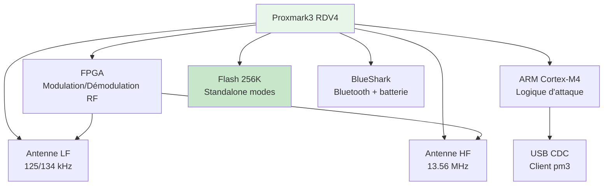
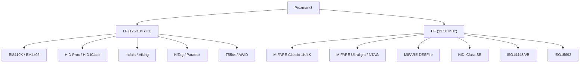
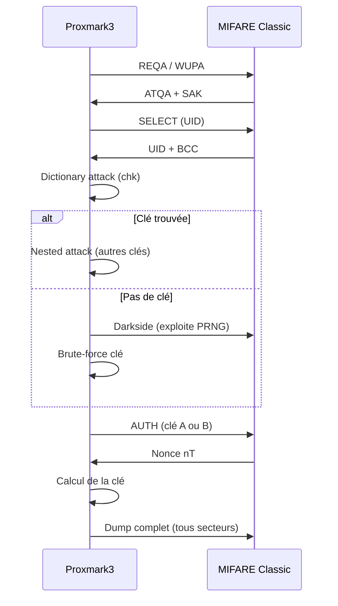
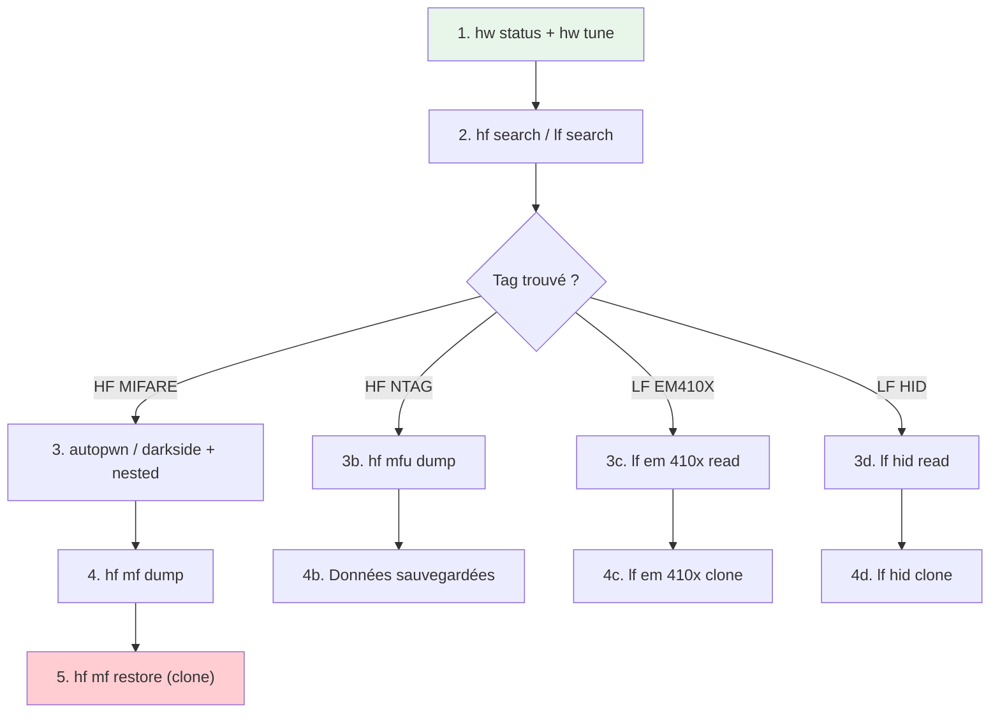
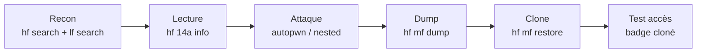
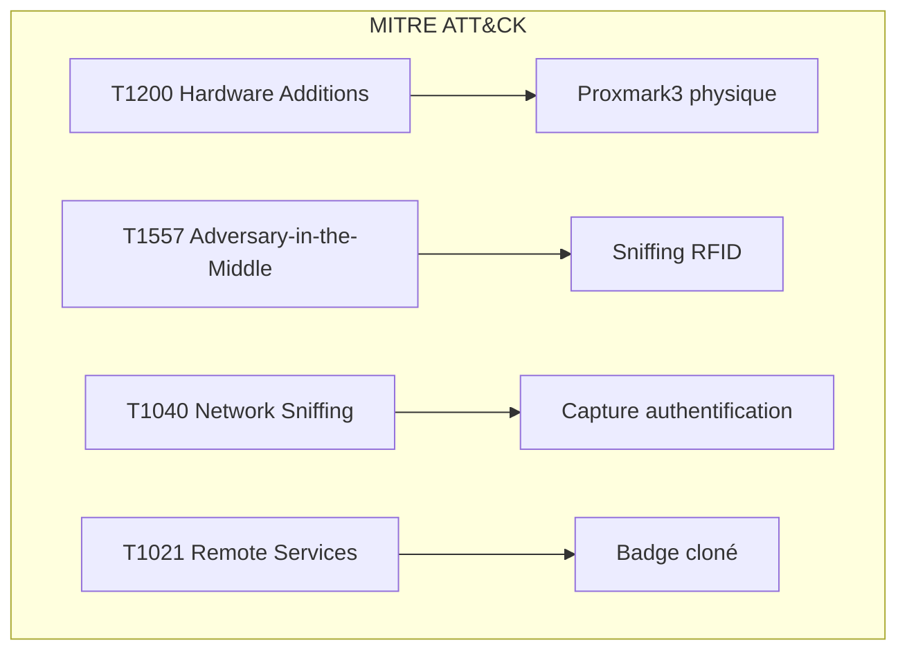
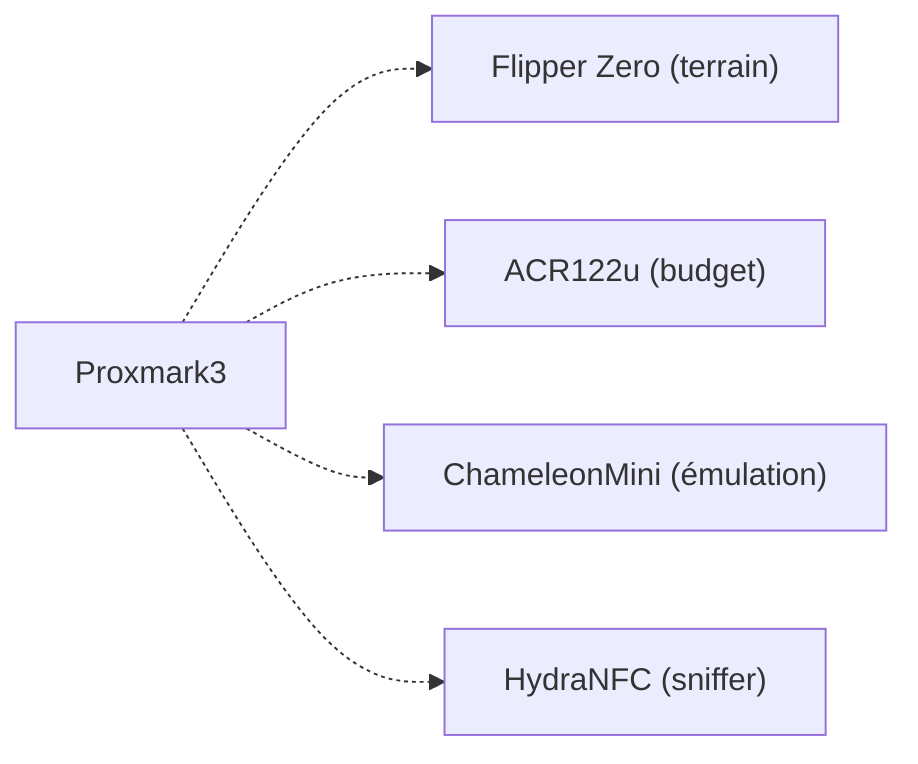

# 📡 Proxmark3

> [!info] **En 1 phrase**
> Le **Proxmark3** est la référence en **recherche RFID** : il **lit, écrit et clone** la
> plupart des tags **LF (125 kHz)** et **HF (13.56 MHz)** — Mifare, iClass, EM410x — et
> attaque même les cartes protégées (nested, récupération de clés).

---

## 🧾 Overview

| Champ | Valeur |
|---|---|
| **Type** | Outil de recherche RFID/NFC |
| **Domaine** | Hardware Hacking — RFID/NFC |
| **Niveau** | Intermediate → Expert |
| **OS cibles** | Tout tag RFID/NFC : EM410X, HID, MIFARE, iClass, T55xx, etc. |
| **Matériel requis** | Proxmark3 (Easy ou RDV4), antennes LF/HF, PC avec client pm3 |
| **Complexité** | Moyenne → Élevée (attaques avancées) |
| **Dernière mise à jour** | 2026-08-16 |

> [!info] 📊 **Diagramme de contexte**
> ```mermaid
> flowchart LR
>     PM["Proxmark3<br>MCU ARM + FPGA"] --> LF["Antenne LF<br>125/134 kHz"]
>     PM --> HF["Antenne HF<br>13.56 MHz"]
>     PM --> USB["USB CDC<br>Client pm3"]
>     LF --> LF_TAGS["EM410X, HID Prox<br>T55xx, Indala"]
>     HF --> HF_TAGS["MIFARE Classic/Ultralight<br>iClass, NTAG, DESFire"]
>     USB --> CMD["hf mifare / lf ..."]
>     style PM fill:#e1f5fe
> ```

---

## 🎯 Concept

> Le Proxmark3 est une plateforme open-source de **recherche RFID/NFC** conçue à l'origine
> par Jonathan Westhues. Le **firmware Iceman fork** (RfidResearchGroup) est aujourd'hui la
> référence communautaire, ajoutant des attaques avancées (hardnested, tear-off, relay,
> standalone modes). Le matériel se décline en deux familles principales : les cartes **Easy**
> (budget, moins de features) et les cartes **RDV4** (professionnel, flash 256K, Bluetooth).



> [!info] 💡 **Le contexte**
> - **RDV4** : MCU ARM Cortex-M4, FPGA dédié, 256K flash SPI (standalone), Smart Card module, connecteur FPC (BlueShark), antennes LF/HF interchangeables
> - **Easy** : MCU AT91SAM7S256 ou 512, antenne fixe, pas de flash externe, pas de Bluetooth
> - **Iceman fork** : firmware dominant, 5000+ commits, support complet de RDV4
> - **Standalone modes** : HF_14ASNIFF, HF_ICECLASS, LF_ICEHID — captures autonomes sans PC
> - **Client pm3** : interface CLI pour piloter le Proxmark depuis le PC (Linux, macOS, Windows)

---

## 🧠 Concepts fondamentaux

### Architecture RFID

| Composant | Spécification | Rôle |
|---|---|---|
| MCU | AT91SAM7S512 (Easy) ou STM32F207 (RDV4) | Logique d'attaque, client |
| FPGA | Xilinx Spartan (sur Easy et RDV4) | Modulation/démodulation RF temps réel |
| Flash | 256K SPI (RDV4 uniquement) | Stockage standalone modes |
| Smart Card | SAM/SIM slot (RDV4) | Interface carte à puce |
| Bluetooth | BlueShark module (RDV4) | Connexion sans fil |
| Antennes | LF (125 kHz) + HF (13.56 MHz) | Émission/réception RF |

### Comparaison Hardware

| Caractéristique | Proxmark3 Easy | Proxmark3 RDV4 |
|---|---|---|
| MCU | AT91SAM7S256/512 | STM32F207 |
| Flash interne | 256K ou 512K | 256K SPI externe |
| FPGA | Oui | Oui (amélioré) |
| Antennes | Fixe (soudée) | Interchangeables (coax) |
| Smart Card | Non | Oui (SAM/SIM) |
| Bluetooth | Non | BlueShark (FPC) |
| Batterie | Non | Via BlueShark |
| Standalone | Limité | Complet |
| Prix | ~60€ | ~330€ |
| Public | Budget / débutant | Professionnel / expert |

### Protocoles RFID supportés



---

## 🔌 Matériel / Composants

### Outils principaux

| Outil | Type | Usage | Prix | Source |
|---|---|---|---|---|
| Proxmark3 RDV4 | Outil RFID complet | Attaques LF+HF, standalone, Bluetooth | ~330€ | proxmark.com / RfidResearchGroup |
| Proxmark3 Easy | Outil RFID budget | Attaques LF+HF basiques | ~60€ | Clones chinois |
| BlueShark addon | Module Bluetooth + batterie | Mode standalone RDV4 | ~60€ | Proxgrind |
| Antenne LF longue | Antenne externe | Portée LF étendue | ~20€ | Community |
| Antenne HF longue | Antenne externe | Portée HF étendue | ~20€ | Community |
| T5577 cards | Cartes LF émulables | Cible de clonage LF | ~2€/unité | Marchands |
| Magic 1K cards | Cartes HF émulables | Cible de clonage HF | ~2€/unité | Marchands |

### Cibles typiques

| Catégorie | Protocoles | Attaques Proxmark | Vulnérabilités |
|---|---|---|---|
| Accès bâtiment | MIFARE Classic | Nested, darkside, hardnested | Crypto1 cassée |
| Transport | MIFARE Classic, iClass | Nested, tear-off | Crypto1, iClass vulnérable |
| Accès LF | EM410X, HID Prox | Clone direct | UID en clair |
| Systèmes avancés | HID iClass SE, DESFire | Tear-off, brute-force | Crypto renforcée mais attaquable |
| IoT | NFC / RFID générique | Sniffing, émulation | Dépend du protocole |

---

## ⚡ Protocoles

### LF — Basse fréquence (125/134 kHz)

| Paramètre | Valeur |
|---|---|
| **Type** | Sans fil (inductive coupling LF) |
| **Fréquence** | 125 kHz ou 134.2 kHz |
| **Modulation** | Manchester, Biphase, PSK, FSK |
| **Bitrate** | 2-64 kbit/s |
| **Portée** | 1-15 cm (selon antenne) |

### HF — Haute fréquence (13.56 MHz)

| Paramètre | Valeur |
|---|---|
| **Type** | Sans fil (inductive coupling HF) |
| **Fréquence** | 13.56 MHz |
| **Norme** | ISO14443A/B, ISO15693 |
| **Modulation** | ASK (10-100% OOK) |
| **Bitrate** | 106-848 kbit/s |
| **Portée** | 1-10 cm (selon antenne) |

### Séquence d'attaque MIFARE



---

## 🛠️ Installation / Setup

### Prérequis

| Composant | Version | Lien |
|---|---|---|
| Client Proxmark3 (Iceman fork) | Latest release | github.com/RfidResearchGroup/proxmark3 |
| GCC ARM cross-compiler | 10+ | arm-none-eabi-gcc |
| libusb | 1.0+ | libusb.info |
| libreadline | 8.0+ | GNU |
| libjansson | 2.x | libjansson.github.io |
| ProxSpace (Windows) | v3.1+ | Gator96100/ProxSpace |

### Compilation (Linux/macOS)

```bash
# Installation des dépendances (Ubuntu/Debian)
sudo apt install build-essential git libreadline-dev libusb-1.0-0-dev \
    libjansson-dev pkg-config gcc-arm-none-eabi

# Clonage et compilation
git clone https://github.com/RfidResearchGroup/proxmark3.git
cd proxmark3
make clean && make all

# Flashage du firmware
sudo ./pm3-flash-all /dev/ttyACM0

# Lancement du client
./pm3 /dev/ttyACM0
```

### Compilation (Windows — ProxSpace)

```text
1. Télécharger ProxSpace v3.1+ depuis Gator96100/ProxSpace
2. Extraire dans C:\ProxSpace
3. Ouvrir le shell MinGW dans ProxSpace
4. git clone https://github.com/RfidResearchGroup/proxmark3.git
5. cd proxmark3 && make clean && make all
6. Flasher : client/flasher.exe COM3 -b bootrom/obj/bootrom.elf armsrc/obj/fullimage.elf
7. Lancer : client/proxmark3.exe COM3
```

---

## ⚙️ Configuration

### Compilation options

| Option | Description | Valeur par défaut |
|---|---|---|
| `PLATFORM=PM3RDV4` | Cible hardware | PM3RDV4 (RDV4) |
| `PLATFORM=PM3GENERIC` | Cible générique (Easy) | Alternative |
| `WITH_FLASH=1` | Support flash (RDV4) | Oui (RDV4) |
| `WITH_SMARTCARD=1` | Support smart card (RDV4) | Oui (RDV4) |
| `WITH_BLUETOOTH=1` | Support BlueShark | Non |

### Configuration client

| Option | Valeur par défaut | Description |
|---|---|---|
| `hw status` | - | Informations matériel |
| `hw tune` | - | Réglage antenne |
| `hw version` | - | Version firmware |
| `data load` | - | Charger un fichier de données |
| `data save` | - | Sauvegarder des données |

---

## ⌨️ Commandes / Manipulations

### Commandes essentielles

| Commande | Description | Exemple |
|---|---|---|
| `hw status` | État du matériel | Vérifier firmware + FPGA |
| `hw tune` | Régler les antennes | Mesure impédance LF/HF |
| `hw version` | Version firmware | Affiche version Iceman |
| `hf search` | Scanner tag HF | Identifier MIFARE/NTAG/iClass |
| `lf search` | Scanner tag LF | Identifier EM410X/HID/etc. |
| `hf mf autopwn` | Attaque MIFARE auto | Dictionary + nested + dump |
| `hf mf darkside` | Attaque darkside | 1ère clé (PRNG faible) |
| `hf mf nested` | Attaque nested | Autres clés depuis une connue |
| `hf mf hardnested` | Attaque hardnested | PRNG corrigé (512K requis) |
| `hf mf dump` | Dump MIFARE | Toutes clés + données |
| `hf mf restore` | Restaurer MIFARE | Écrire un dump sur carte |
| `lf em 410x clone` | Cloner EM410X | Écrire sur T5577 |
| `lf hid clone` | Cloner HID Prox | Écrire sur T5577 |

### LF — Basse fréquence

```bash
# Scan LF
lf search
lf read

# EM410X
lf em 410x read
lf em 410x clone --id 1122334455

# HID Prox
lf hid read
lf hid clone --rfid <hex>

# T55xx
lf t55xx detect
lf t55xx write --blk 1 --data <hex>
```

### HF — Haute fréquence

```bash
# Scan HF
hf search
hf 14a info

# MIFARE Classic
hf mf chk *1 ? t
hf mf darkside
hf mf nested 0 0 A a0a1a2a3a4a5 t
hf mf dump 1
hf mf restore 1
hf mf rdbl 5 A ffffffffffff
hf mf wrbl 5 A ffffffffffff 00112233445566778899aabbccddeeff

# MIFARE Ultralight / NTAG
hf mfu dump
hf mfu restore
hf mfu auth --pwd aabbccdd
hf mfu rdbl 5
hf mfu wrbl 5 01020304

# iClass
hf iclass rd
hf iclass wr
hf iclass clone

# DESFire
hf mfdes detect
hf mfdes getuid
hf mfdes lsapp --no-auth
```

---

## 🧪 Exemples pratiques

### 🟢 Débutant — Clonage EM410X

```bash
# Étape 1 : Lecture du badge LF
lf search
lf em 410x read

# Étape 2 : Clonage sur T5577
lf em 410x clone --id 1122334455

# Étape 3 : Vérification
lf em 410x read
```

### 🟡 Intermédiaire — MIFARE autopwn

```bash
# Étape 1 : Recherche du tag
hf search

# Étape 2 : Attaque automatique
hf mf autopwn

# Étape 3 : Dump
hf mf dump 1

# Étape 4 : Vérification
hf mf rdbl 0 A ffffffffffff
```

### 🔴 Avancé — Hardnested + crypto1_bs

```bash
# Étape 1 : Collecte de nonces
hf mf hardnested 0 A 8829da9daf76 4 A w

# Étape 2 : Crack hors-ligne
git clone https://github.com/aczid/crypto1_bs
cd crypto1_bs
./solve_piwi ../nonces.bin

# Étape 3 : Utilisation de la clé retrouvée
hf mf nested 0 0 A <clé_trouvée> t
hf mf dump 1
```

### ⚫ Expert — Standalone HF_14ASNIFF

```bash
# Activer le mode standalone sur RDV4
# (nécessite flash 256K + BlueShark pour l'autonomie)

# 1. Flasher le firmware avec standalone activé
# 2. Débrancher le USB, le Proxmark tourne en autonome
# 3. Placer près du lecteur RFID légitime
# 4. Les authentifications sont capturées en flash
# 5. Reconnecter en USB, récupérer les données
# 6. Analyser avec mfkey64

hf 14a snoop
hf list 14a
```

---

## 🧪 Workflow complet (scénario pas à pas)



### Étape 1 — Diagnostic

| Action | Commande | Résultat attendu |
|---|---|---|
| Vérifier firmware | `hw status` | Version Iceman, FPGA status |
| Vérifier antennes | `hw tune` | Valeurs LF/HF correctes |
| Vérifier USB | `hw version` | Device détecté |

### Étape 2 — Scan

| Méthode | Difficulté | Fiabilité |
|---|---|---|
| `hf search` | Faible | Élevée (détection auto) |
| `lf search` | Faible | Élevée |
| `hf 14a info` | Faible | Élevée (détails tag) |

### Étape 3 — Attaque

| Méthode | Difficulté | Fiabilité | Hardware requis |
|---|---|---|---|
| Dictionary (chk) | Faible | Moyenne | Tout Proxmark |
| Darkside | Moyenne | Élevée | Tout Proxmark |
| Nested | Moyenne | Élevée | Tout Proxmark (1 clé connue) |
| Hardnested | Élevée | Élevée | RDV4 / Easy 512K |
| Tear-off | Élevée | Élevée | RDV4 |

---

## 🎬 Scénarios avancés

### Scénario 1 — Pentest RFID complet

| Élément | Détail |
|---|---|
| **Objectif** | Évaluer la sécurité RFID d'un site d'entreprise |
| **Matériel** | Proxmark3 RDV4 + BlueShark + antennes |
| **Étapes** | 1. Recon (scan LF+HF) → 2. Lecture badges → 3. Attaque → 4. Clonage |
| **Résultat** | Badge cloné, accès physique compromis |
| **Difficulté** | ⭐⭐⭐ |



### Scénario 2 — iClass tear-off attack

| Élément | Détail |
|---|---|
| **Objectif** | Extraire les clés iClass d'un badge |
| **Matériel** | Proxmark3 RDV4 + antenne HF |
| **Étapes** | 1. hf iclass rd → 2. hf iclass blacktears → 3. Clés extraites |
| **Résultat** | Badge iClass clonable |
| **Difficulté** | ⭐⭐⭐⭐ |

---

## 🛡️ Cybersecurity use cases

| Use case | Sévérité | Matériel requis | Impact |
|---|---|---|---|
| Clonage badge RFID | Critique | Proxmark3 + carte vierge | Accès physique compromis |
| Extraction clés iClass | Élevée | Proxmark3 RDV4 | Système iClass compromis |
| Sniffing NFC | Élevée | Proxmark3 RDV4 | Données NFC capturées |
| Relay RFID | Élevée | 2 Proxmark3 | Accès à distance |
| Analyse DESFire | Moyenne | Proxmark3 RDV4 | Reverse engineering |

| Phase pentest | Ce que permet cette technique |
|---|---|
| Recon | Scan complet LF+HF des badges utilisés |
| Accès initial | Clonage de badges pour accès physique |
| Maintien d'accès | Création de badges persistants |
| Évasion | Badges clonés non traçables |

---

## 🎯 MITRE ATT&CK

| Technique ID | Nom | Catégorie | Applicabilité |
|---|---|---|---|
| T1200 | Hardware Additions | Initial Access | Proxmark3 near RFID reader |
| T1557 | Adversary-in-the-Middle | Credential Access | MITM RFID, sniffing |
| T1040 | Network Sniffing | Credential Access | Capture authentifications |
| T1021 | Remote Services | Lateral Movement | Badge cloné pour accès |



### Mapping détaillé

| Phase MITRE | Technique | Cette fiche couvre |
|---|---|---|
| Initial Access | T1200 | Placement Proxmark3 |
| Credential Access | T1557 | MITM RFID |
| Credential Access | T1040 | Sniffing NFC/RFID |
| Lateral Movement | T1021 | Badge cloné |

---

## 🛡️ Defensive Security

### Détection

| Signal de détection | Source | Fiabilité |
|---|---|---|
| Lectures RFID multiples | Logs contrôle d'accès | Moyenne |
| UID en double | Base de données badges | Élevée |
| Présence physique suspecte | Caméras | Moyenne |
| Standalone Proxmark3 | Détection RF | Faible |

| Indicateur | Log / Capteur | Seuil d'alerte |
|---|---|---|
| Auth multiples / min | Contrôleur d'accès | > 10/min |
| UID sur 2 sites distants | SI badges | Immédiat |
| Badge sans passage physique | Caméras + RFID | Immédiat |

### Prévention

| Mesure | Efficacité | Coût | Priorité |
|---|---|---|---|
| DESFire EV2/EV3 | Très élevée | Élevé | Haute |
| iClass SE | Élevée | Élevé | Haute |
| Clés uniques par carte | Élevée | Faible | Haute |
| Multi-facteur | Élevée | Moyen | Haute |
| Anti-relay timing | Moyenne | Moyen | Basse |

### Durcissement (hardening)

```bash
# Recommandations
# 1. Remplacer les MIFARE Classic par DESFire
# 2. Changer toutes les clés par défaut
# 3. Implémenter le multi-facteur (badge + PIN)
# 4. Auditer les UID en double régulièrement
# 5. Surveiller les lectures RFID anormales
```

---

## 🤖 Automatisation

### Scripts d'exploitation

```python
#!/usr/bin/env python3
"""
Script d'automatisation Proxmark3
via le client CLI
"""
import subprocess
import re

def run_pm3(cmd, timeout=300):
    result = subprocess.run(
        ["./pm3", "-c", cmd],
        capture_output=True, text=True, timeout=timeout
    )
    return result.stdout + result.stderr

def full_mifare_attack():
    print("[*] Scan HF...")
    output = run_pm3("hf search")
    print(output)
    
    print("[*] Autopwn en cours...")
    output = run_pm3("hf mf autopwn")
    print(output)
    
    # Extraire les clés trouvées
    keys = re.findall(r"Found valid key: ([0-9a-fA-F]+)", output)
    if keys:
        print(f"[+] {len(keys)} clé(s) trouvée(s)")
        for k in keys:
            print(f"    Key: {k}")
    
    print("[*] Dump en cours...")
    run_pm3("hf mf dump 1")
    print("[+] Terminé !")

if __name__ == "__main__":
    full_mifare_attack()
```

### Outils d'automatisation

| Outil | Usage | Lien |
|---|---|---|
| Proxmark3 client (Iceman) | CLI complet | RfidResearchGroup/proxmark3 |
| mfoc | Offline cracker (nested) | GitHub |
| mfcuk | Darkside attack | GitHub |
| Crypto1_bs | Cracking hors-ligne | aczid/crypto1_bs |
| Proxmark3 GUI | Interface graphique | burma69/PM3UniversalGUI |

---

## 📤 Output et parsing

### Formats de sortie

| Format | Exemple | Utilité |
|---|---|---|
| `.bin` | `hf-mf-XXXX-data.bin` | Dump MIFARE binaire |
| `.eml` | `dump.eml` | Format texte, 16 octets/ligne |
| `.mfd` | `card.mfd` | Format mfoc/libnfc |
| `.json` | `dump.json` | Données structurées |
| `.trace` | `trace.pm3` | Log de communication |

### Parsing des résultats

```bash
# Charger et visualiser un dump
data load hf-mf-XXXX-data.bin
data hexdump

# Conversion bin → eml
script run dumptoemul -i dumpdata.bin

# Analyse de trace
hf list 14a
```

### Intégration SIEM / Logging

| Source | Format | Pipeline |
|---|---|---|
| Proxmark3 trace | Log binaire | Parser Python → JSON |
| Client pm3 | Log texte | grep/awk → CSV |
| Contrôleur d'accès | Syslog | SIEM (Splunk, ELK) |

---

## 🔗 Intégrations

- [[13 - Hardware & IoT|⚙️ Hardware & IoT]] global
- [[Hardware - RFID et NFC|🏷️ Hub RFID]]
- [[Hardware - RFID MIFARE (HF 13.56 MHz)|💳 MIFARE]]

| Outils associés | Usage complémentaire |
|---|---|
| [[Hardware - Flipper Zero]] | Clonage rapide sur le terrain |
| [[Hardware - HydraNFC]] | Sniffer NFC avancé |
| [[Hardware - Pwnagotchi]] | Collecte WiFi en parallèle |

---

## 🔄 Alternatives

| Alternative | Avantages | Inconvénients | Cas d'usage |
|---|---|---|---|
| Flipper Zero | Portable, tout-en-un | Attaques RFID limitées | Terrain rapide |
| ACR122u + mfoc | Bon marché | Uniquement HF, attaques lentes | Audit basique |
| ChameleonMini | Émulation | Pas d'attaques | Test UID |
| NFC Ring / implant | Wearable | Données fixes | POC |



---

## ⚡ Performance

| Métrique | Valeur | Impact |
|---|---|---|
| Temps darkside | 1-30 secondes | Variable (PRNG) |
| Temps nested | 1-60 secondes | Variable (secteurs) |
| Temps hardnested | 1-30 minutes | PRNG corrigé |
| Temps iClass tear-off | 1-5 minutes | RDV4 nécessaire |
| Portée LF | 1-15 cm | Selon antenne |
| Portée HF | 1-10 cm | Selon antenne |
| USB baudrate | 460800 | Transfert rapide |

### Optimisations

| Technique | Gain | Complexité |
|---|---|---|
| Antenne externe longue | Portée x3 | Faible |
| Standalone mode | Autonomie totale | Moyenne |
| BlueShark (RDV4) | Sans fil + batterie | Faible |
| Compilation optimisée | Firmware plus petit | Moyenne |

---

## 🛠️ Troubleshooting

| Problème | Cause probable | Solution |
|---|---|---|
| Device non reconnu USB | Driver manquant | Installer driver USB CDC |
| `hw tune` valeurs faibles | Antenne défectueuse | Vérifier connexions coax |
| `hf search` ne trouve rien | Tag absent ou incompatible | Approcher le tag |
| Firmware corrompu | Flash interrompu | Re-flash `pm3-flash-all` |
| 256K insuffisant | Proxmark Easy 256K | Compiler sans hardnested |

### Erreurs courantes

```
Error : "Can't establish link"
Cause : Proxmark non connecté ou mauvais port
Solution : Vérifier USB, utiliser le bon /dev/ttyACMx

Error : "PHDR is not contained in Flash"
Cause : Firmware trop gros pour 256K flash
Solution : Compiler avec options réduites ou upgrader RDV4

Error : "Device not found"
Cause : Driver USB manquant (Windows)
Solution : Installer les drivers STM32 ou ProxSpace
```

### Diagnostic

```bash
# Vérification complète
hw status
hw version
hw tune
hf search
lf search
```

---

## 🔐 Sécurité

| Risque | Impact | Mitigation |
|---|---|---|
| Clonage badge | Accès compromis | DESFire, anti-clonage |
| Extraction clés | Système compromis | Clés uniques, rotation |
| Relay RFID | Accès à distance | Anti-relay timing |

> [!warning] Points de sécurité
> - Ne cloner que dans un cadre autorisé (pentest avec accord écrit)
> - L'antenne compte énormément : un mauvais câble coax = perte de portée
> - Les modes standalone nécessitent le RDV4 avec flash 256K

### Restrictions légales

> [!danger] Cadre légal
> Le Proxmark3 est un outil de recherche. Son utilisation pour cloner des badges,
> sniffer des communications ou contourner des systèmes d'accès est encadrée par
> les lois locales. Utiliser uniquement dans un cadre autorisé.

---

## ⚠️ Limitations

| Limite | Impact | Contournement |
|---|---|---|
| DESFire AES résiste | Attaque impossible en temps raisonnable | Analyse partielle |
| iClass SE renforcé | Tear-off plus difficile | RDV4 + firmware récent |
| Proxmark Easy 256K | Hardnested impossible | Upgrade RDV4 |
| Portée limitée (< 15 cm) | Proximité physique requise | Antenne longue portée |

### Cas où cette technique ne fonctionne pas

| Scénario | Raison |
|---|---|
| DESFire EV3 avec AES-128 | Crypto non cassée |
| HID SEOS | Protocole propriétaire |
| Badges avec anti-relay | Détection du timing |
| Tag sans champ RF | Alimentation par batterie requise |

---

## 📋 Cheatsheet

```
┌─────────────────────────────────────────────────────────┐
│ Proxmark3 — Cheatsheet                                  │
├─────────────────────────────────────────────────────────┤
│ hw status:     État du matériel                         │
│ hw tune:       Réglage antennes                         │
│ hf search:     Scanner tag HF                           │
│ lf search:     Scanner tag LF                           │
│ hf 14a info:   Détails tag HF                           │
│ hf mf autopwn: Attaque MIFARE auto                      │
│ hf mf darkside: Première clé (PRNG)                     │
│ hf mf nested:  Autres clés (1 connue)                   │
│ hf mf hardnested: Clés (PRNG corrigé, 512K)            │
│ hf mf dump:    Dump MIFARE complet                      │
│ hf mf restore: Restaurer dump                           │
│ lf em 410x clone: Cloner EM410X                         │
│ lf hid clone: Cloner HID Prox                           │
│ hf mfu dump:   Dump NTAG/Ultralight                     │
│ hf iclass rd:  Lire iClass                              │
│ hf iclass blacktears: Tear-off iClass                   │
│ hf mfdes detect: Détecter DESFire                       │
└─────────────────────────────────────────────────────────┘
```

| Action | Commande |
|---|---|
| Scan HF | `hf search` |
| Scan LF | `lf search` |
| MIFARE autopwn | `hf mf autopwn` |
| Dump MIFARE | `hf mf dump 1` |
| Clone EM410X | `lf em 410x clone --id <hex>` |
| Clone HID | `lf hid clone --rfid <hex>` |
| Dump NTAG | `hf mfu dump` |
| iClass tear-off | `hf iclass blacktears` |
| DESFire detect | `hf mfdes detect` |

---

## ⚡ Quick reference

| Élément | Valeur / Commande |
|---|---|
| **Fréquence LF** | 125 kHz / 134.2 kHz |
| **Fréquence HF** | 13.56 MHz |
| **MCU (RDV4)** | STM32F207 |
| **MCU (Easy)** | AT91SAM7S256/512 |
| **Flash (RDV4)** | 256K SPI externe |
| **FPGA** | Xilinx Spartan |
| **USB** | CDC ACM (460800 baud) |
| **Antennes** | LF + HF (interchangeables RDV4) |
| **Standalone** | HF_14ASNIFF, LF_ICEHID, HF_ICECLASS |
| **Outil** | pm3 client (Iceman fork) |
| **Web updater** | proxmarkbuilds.org |

---

## 🔍 Détection & Défense

| Signal | Méthode de détection | Outil |
|---|---|---|
| Lectures multiples RFID | Logs contrôleur | SIEM |
| UID en double | Base de données | Script corrélation |
| Présence physique suspecte | Caméras | Video analytics |
| Signal RF inconnu | Spectrum analyzer | HackRF |

| Countermeasure | Efficacité | Implémentation |
|---|---|---|
| DESFire EV2/EV3 | Très élevée | Nouveaux badges |
| iClass SE | Élevée | Nouveaux badges |
| Multi-facteur | Élevée | Badge + PIN |
| Anti-relay | Moyenne | Mesure timing |

> [!tip] Défense
> La défense la plus efficace reste la migration vers des protocoles RFID robustes
> (DESFire EV2/EV3, iClass SE) et l'implémentation du multi-facteur. Le Proxmark3
> ne peut pas attaquer efficacement les systèmes utilisant AES-128.

---

## ⚠️ Tips & Pièges

- **Piège 1** : Le Proxmark Easy 256K ne peut pas faire de hardnested — vérifier la taille du flash.
- **Piège 2** : Les antennes comptent énormément — un mauvais câble coax réduit la portée à presque rien.
- **Piège 3** : Le modem-manager sous Linux peut interférer avec le Proxmark — `sudo apt remove modemmanager`.
- **Piège 4** : Passer du firmware officiel à l'Iceman fork nécessite de reflasher le bootrom.
- **Astuce 1** : Les builds précompilés sont disponibles sur proxmarkbuilds.org pour éviter la compilation.
- **Astuce 2** : Le mode standalone HF_14ASNIFF est idéal pour les engagements sans PC.
- **Bonne pratique** : Toujours faire `hw tune` avant de commencer une session.

> [!tip] Astuces
> - Le Discord RFID Hacking (Iceman) est la meilleure source d'aide communautaire
> - Commencer par les builds stables avant de tester les features bleeding-edge
> - Pour Windows, ProxSpace est la méthode la plus fiable

---

## 📚 References

> [!info] 📚 **Sources**
> - [HardwareAllTheThings — Proxmark](https://github.com/swisskyrepo/HardwareAllTheThings/blob/main/docs/gadgets/proxmark.md)
> - [Iceman Fork — RfidResearchGroup](https://github.com/RfidResearchGroup/proxmark3)
> - [Proxmark Wiki](https://github.com/Proxmark/proxmark3/wiki)
> - [Proxmark Builds](https://www.proxmarkbuilds.org/)
> - [Proxmark RDV4 — proxmark.com](https://proxmark.com/proxmark-3-hardware/proxmark-3-rdv4)

### Documentation officielle

| Source | URL | Type |
|---|---|---|
| Iceman Fork | github.com/RfidResearchGroup/proxmark3 | Firmware/Client |
| Proxmark Wiki | github.com/Proxmark/proxmark3/wiki | Documentation |
| Proxmark Builds | proxmarkbuilds.org | Binaries |
| Lab401 (RDV4) | lab401.com | Hardware |

### Vidéos / Tutorials

| Titre | Auteur | Lien |
|---|---|---|
| Proxmark3 RDV4 Setup | KSEC | tagbase.ksec.co.uk |
| RFID Hacking DEF CON | Multiple | media.defcon.org |
| Proxmark3 Cheat Sheet | RfidResearchGroup | GitHub |

### Livres / Articles

| Titre | Auteur | Année |
|---|---|---|
| RFID Hacking with Proxmark 3 | Kevin Chung | 2019 |
| Dismantling Mifare Classic | Radboud University | 2008 |
| Proxmark3 v4.21611 Release | Iceman | 2026 |

---

➡️ **Liens :** [[Hardware - RFID et NFC|🏷️ Hub RFID]] · [[Hardware - RFID MIFARE (HF 13.56 MHz)|💳 MIFARE]] · [[Hardware - RFID LF (HID, EM410X, Indala, HiTag)|📡 LF]] · [[Hardware - Flipper Zero|🐬 Flipper]] · [[Hardware - HydraNFC|🏷️ HydraNFC]] · [[Bibliothèque technique|🏠 Index]]