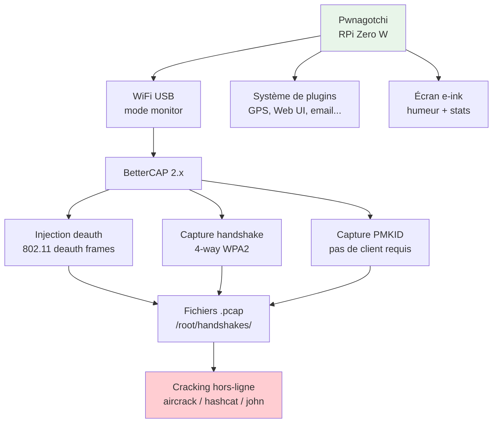
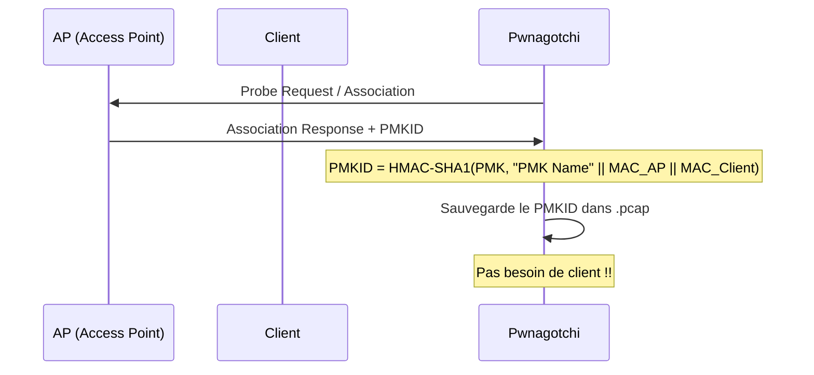
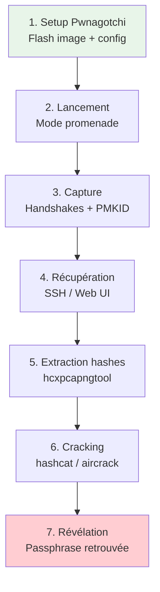
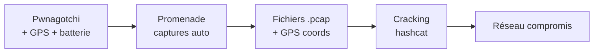
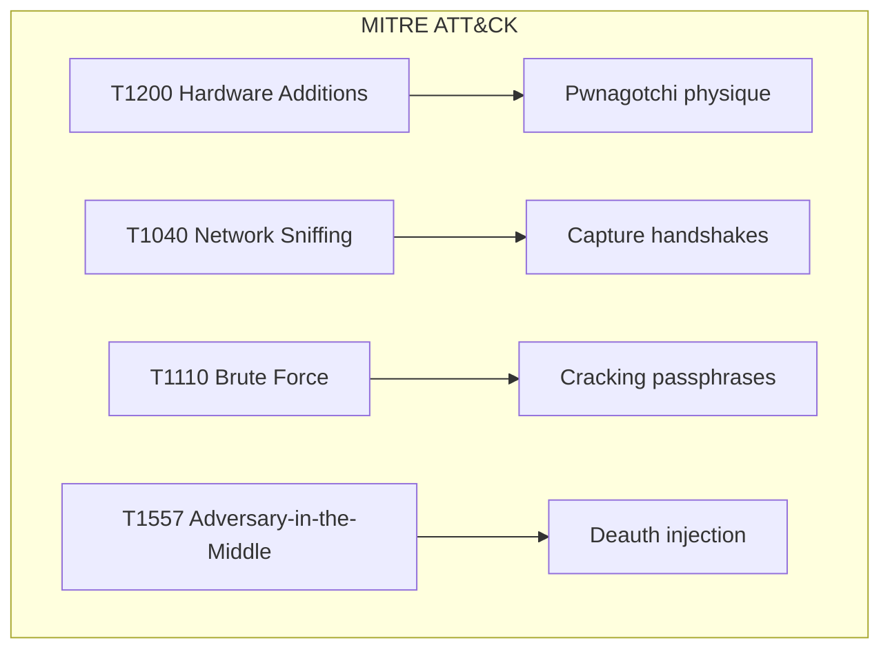
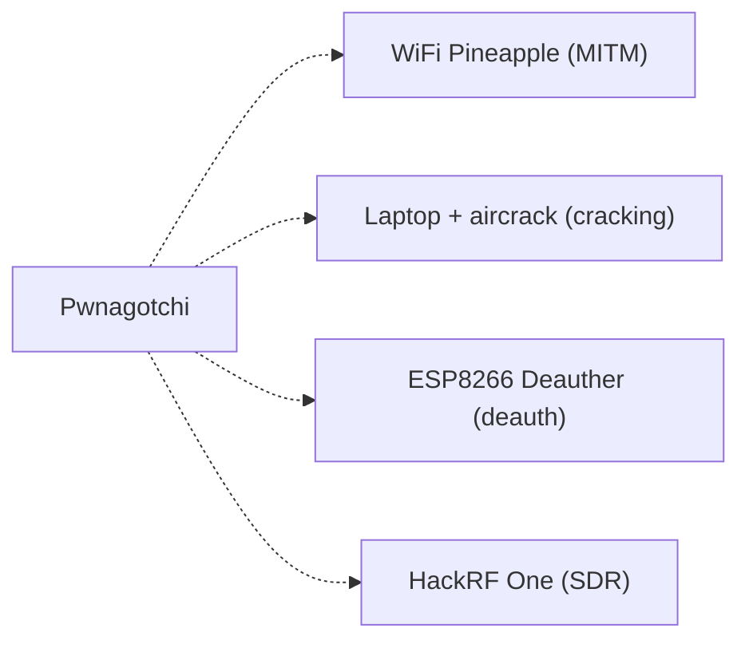

# Pwnagotchi

> [!info] **En 1 phrase**
> Le **Pwnagotchi** est un Raspberry Pi Zero W doté d'un écran e-ink et d'une « IA » qui
> capture des **handshakes WPA/WPA2** et des **PMKID** en autonomie (BetterCAP) — la
> collecte de matériel WiFi prête à être brute-forcée hors-ligne.

---

## Overview

| Champ | Valeur |
|---|---|
| **Type** | Outil de capture WiFi autonome |
| **Domaine** | Hardware Hacking — WiFi / WPA |
| **Niveau** | Beginner → Intermediate |
| **OS cibles** | Réseaux WiFi WPA/WPA2 (handshakes + PMKID) |
| **Matériel requis** | Raspberry Pi Zero W + écran e-ink Waveshare 2.13" + carte SD |
| **Complexité** | Faible (setup) → Moyenne (plugins, cracking) |
| **Dernière mise à jour** | 2026-08-16 |

> [!info] **Diagramme de contexte**
> ```mermaid
> flowchart LR
>     PG["Pwnagotchi<br>RPi Zero W + e-ink"] -->|mode monitor| MON["Capture passive"]
>     MON -->|handshakes| HS["/root/handshakes/*.pcap"]
>     MON -->|PMKID| PM["PMKID capturés"]
>     MON -->|deauth| DEAUTH["Deauth frames"]
>     HS -->|"aircrack-ng / hashcat"| CRACK["Brute-force offline"]
>     PG -->|plugin| PLUG["GPS, Web UI, BetterCAP..."]
>     style PG fill:#e1f5fe
>     style CRACK fill:#c8e6c9
> ```

---

## Concept

> Le Pwnagotchi est un projet open-source créé par **evilsocket** (Simone Margaritelli).
> C'est un **Raspberry Pi Zero W** combiné à un **écran e-ink Waveshare 2.13"** qui
> fonctionne comme un creature Tamagotchi numérique : il « grandit » en capturant des
> handshakes WiFi. Le moteur de capture est **BetterCAP 2.x** en mode monitor, avec
> injection de deauth frames pour forcer les clients à se re-authentifier et capturer
> le 4-way handshake WPA2.



> [!info] **Le contexte**
> - **RPi Zero W** : BCM2835 (ARM11, 1 GHz), 512 Mo RAM, WiFi 802.11b/g/n, 1 GPIO 40-pin
> - **Écran e-ink** : Waveshare 2.13" v3/v4 (250x122 pixels, noir & blanc)
> - **OS** : pwnagotchi.ai (Raspbian custom) — image préconfigurée
> - **BetterCAP** : framework MITM pour WiFi/BLE/LAN — mode 802.11monitor
> - **Handshake** : 4-way WPA2 handshake = 4 messages entre client et AP
> - **PMKID** : attaque sans client — le PMKID est dans la trame EAPOL de l'AP
> - **Plugins** : GPS, Web UI, BetterCAP, email, stockage, personnalisation...

---

## Concepts fondamentaux

### Handshake WPA2 (4-way)

| Message | Source | Destination | Contenu |
|---|---|---|---|
| EAPOL 1 | AP | Client | ANonce (AP nonce) |
| EAPOL 2 | Client | AP | SNonce + MIC |
| EAPOL 3 | AP | Client | GTK + MIC |
| EAPOL 4 | Client | AP | ACK |

### PMKID Attack



### Types de captures

| Type | Dépendance | Qualité | Cracking |
|---|---|---|---|
| Full handshake (4-way) | Client + AP | Excellente | aircrack-ng / hashcat 22000 |
| PMKID | AP seul | Bonne | hashcat 22000 / john |
| Half handshake | Client seul | Moyenne | Partielle |
| Roaming handshake | Client en mouvement | Variable | aircrack-ng |

### Architecture du Pwnagotchi

| Composant | Spécification | Rôle |
|---|---|---|
| RPi Zero W | BCM2835, 512 Mo RAM | MCU principal |
| WiFi | 802.11b/g/n (Broadcom) | Capture + injection |
| Écran e-ink | Waveshare 2.13" v3/v4 | Interface graphique |
| Carte SD | 16-32 Go FAT32 | Stockage OS + captures |
| Batterie | LiPo 1200-3000 mAh | Autonomie 4-12h |
| WiFi USB (optionnel) | Alfa AWUS036NH | Meilleure sensibilité RF |

---

## Matériel / Composants

### Outils principaux

| Outil | Type | Usage | Prix | Source |
|---|---|---|---|---|
| Raspberry Pi Zero W | MCU | Cœur du Pwnagotchi | ~15€ | raspberrypi.com |
| Waveshare e-ink 2.13" | Écran | Interface e-ink | ~20€ | waveshare.com |
| Carte SD 16-32 Go | Stockage | OS + captures | ~10€ | Qualité A1 |
| Batterie LiPo | Alimentation | Autonomie | ~10-20€ | PiSugar / Waveshare |
| Alfa AWUS036NH | WiFi USB | Sensibilité RF étendue | ~30€ | Alfa Network |

### Cibles typiques

| Catégorie | Exemples | Vulnérabilités |
|---|---|---|
| Réseaux WiFi domestiques | Box opérateurs, routers | Passphrases faibles |
| Réseaux WiFi entreprise | Points d'accès corporate | WPA2-Enterprise (plus résistant) |
| Hotspots publics | Cafés, aéroports | Open ou WPA2 avec passphrase connue |
| IoT WiFi | Caméras, domotique | Passphrases par défaut |

---

## Protocoles

### 802.11 WiFi

| Paramètre | Valeur |
|---|---|
| **Type** | Sans fil (RF 2.4 GHz) |
| **Fréquence** | 2.4 GHz (802.11b/g/n) |
| **Canal** | 1-13 (selon réglementation) |
| **Sécurité** | WPA2-PSK / WPA2-Enterprise / WPA3 |
| **Chiffrement** | AES-CCMP (WPA2) / GCMP (WPA3) |

### BetterCAP

| Module | Fonction | Usage |
|---|---|---|
| `wifi.recon` | Découverte AP + clients | Scan des réseaux à proximité |
| `wifi.deauth` | Injection de deauth | Forcer re-authentification |
| `wifi.assoc` | Association forcée | Capturer PMKID |
| `wifi.handshake` | Capture handshake | Sauvegarder le 4-way |
| `wifi.monitor` | Mode monitor | Activer le mode promiscuous |

---

## Installation / Setup

### Prérequis

| Composant | Version | Lien |
|---|---|---|
| Image Pwnagotchi | v2.8.9+ (jayofelony) | github.com/jayofelony/pwnagotchi |
| Balena Etcher | Latest | etcher.balena.io |
| RPi Zero W | - | raspberrypi.com |
| Waveshare e-ink 2.13" | v3 ou v4 | waveshare.com |

### Connexion physique

```
RPi Zero W + écran e-ink Waveshare
│
├── GPIO pins → connectés à l'écran e-ink (SPI)
├── Micro SD → OS Pwnagotchi
├── Micro USB (data) → PC pour config
└── Micro USB (power) → batterie / alimentation
```

### Installation de l'image

```bash
# 1. Télécharger l'image (jayofelony v2.8.9)
# 2. Flasher sur carte SD avec Balena Etcher
# 3. Monter la partition boot de la SD
# 4. Créer / ajouter fichiers de config :

# /boot/config.txt → ajout :
dtoverlay=disable-wifi

# /etc/pwnagotchi/config.toml → config initiale :
main.name = "Pwnagotchi"
main.whitelist = "MonReseoWifi"
main.plugins.grid.exclude = "MonReseoWifi"

# 5. Insérer la SD, brancher l'alimentation
# 6. SSH : pi@pwnagotchi.local (mot de passe : raspberry)
```

---

## Configuration

### Paramètres principaux

| Option | Valeur par défaut | Description |
|---|---|---|
| `main.name` | "pwnagotchi" | Nom du Pwnagotchi |
| `main.whitelist` | [] | SSIDs à ignorer |
| `main.plugins.grid.exclude` | [] | SSIDs exclus du grid |
| `wifi.interface` | wlan0 | Interface WiFi |
| `bettercap.interface` | wlan0 | Interface BetterCAP |
| `bettercap.handshake_directory` | /root/handshakes/ | Dossier captures |
| `bettercap.deauth` | true | Activation deauth |
| `bettercap.association` | true | Activation association |
| `ui.invert` | false | Mode dark/light |
| `ui.fps` | 1 | FPS écran e-ink |
| `plugins.webcfg.enabled` | false | Web UI config |
| `plugins.wpa_sec.enabled` | false | Upload vers wpa-sec |
| `plugins.memtemp.enabled` | false | Affichage mémoire/temp |

### Plugins essentiels

| Plugin | Catégorie | Usage | Lien |
|---|---|---|---|
| `gps` | GPS | Géolocalisation des captures | Pwnagotchi built-in |
| `gps-plus` | GPS | GPS amélioré avec options | crahan/pwnagotchi-plugins |
| `memtemp-plus` | UI | Affichage mémoire/CPU/temp | crahan/pwnagotchi-plugins |
| `webcfg` | Config | Configuration via Web UI | evilsocket/pwnagotchi |
| `wpa-sec` | Upload | Upload automatique wpa-sec.stanev.org | evilsocket/pwnagotchi |
| `onlinehashcrack` | Upload | Upload OnlineHashCrack.com | evilsocket/pwnagotchi |
| `hashstore` | Stockage | Stockage structuré des captures | Community |
| `aircrackonly` | Qualité | Vérifie si le pcap contient handshake | evilsocket/pwnagotchi-plugins-contrib |
| `net-pos` | OSINT | Géolocalisation sans GPS | evilsocket/pwnagotchi |
| `discohash` | Analyse | Extraction hashes + Discord | flamebarke/DiscoHash |
| `pwnmenu` | UI | Menu popup de scripts | sn0wflake |
| `experience` | Gamification | XP et niveaux | GaelicThunder |
| `probeReq` | Recon | Affiche probe requests | unitMeasure |
| `instattack` | Performance | Attack dès qu'un AP est détecté | Sniffleupagus |
| `fix_region` | Région | Change iw region pour canaux | V0r-T3x |

### Configuration plugins (config.toml)

```toml
main.plugins.gps.enabled = true
main.plugins.gps.speed = 19200

main.plugins.memtemp-plus.enabled = true

main.plugins.webcfg.enabled = true
main.plugins.webcfg.username = "admin"
main.plugins.webcfg.password = "changeme"

main.plugins.wpa_sec.enabled = true
main.plugins.wpa_sec.api_key = "cle_api_wpa_sec"

main.plugins.aircrackonly.enabled = true

main.plugins.onlinehashcrack.enabled = true
main.plugins.onlinehashcrack.email = "email@example.com"
```

---

## Commandes / Manipulations

### Commandes essentielles

| Commande | Description | Exemple |
|---|---|---|
| `sudo systemctl status pwnagotchi` | Vérifier le service | État du démon |
| `sudo systemctl restart pwnagotchi` | Redémarrer | Appliquer les changements |
| `ls /root/handshakes/` | Voir les captures | Liste des .pcap |
| `pwnagotchi --version` | Version | Affiche la version |
| `sudo bettercap -iface wlan0` | BetterCAP interactif | Mode manuel |

### Crack des captures

```bash
# Aircrack-ng (dictionary attack)
aircrack-ng -w wordlist.txt /root/handshakes/*.pcap

# Hashcat (brute-force / dictionary)
# Extraire le hash :
hcxpcapngtool -o hash.hc22000 capture.pcap
# Cracker :
hashcat -m 22000 hash.hc22000 wordlist.txt

# John the Ripper
hcxpcapngtool -j hash.hc22000 capture.pcap
john --wordlist=wordlist.txt hash.hc22000
```

### Shell / Console

```bash
# SSH
ssh pi@pwnagotchi.local
# Mot de passe par défaut : raspberry (À CHANGER)

# Web UI
http://pwnagotchi.local:8080
# Login : changeme / changeme
```

---

## Exemples pratiques

### Débutant — Setup et premières captures

```text
1. Flasher l'image sur la carte SD
2. Configurer /boot/config.txt et config.toml
3. Insérer la SD, brancher l'alimentation
4. Attendre le boot (écran e-ink s'affiche)
5. Laisser le Pwnagotchi collecter en mode promenades
6. Récupérer les .pcap via SSH ou Web UI
7. Cracker avec aircrack-ng
```

### Intermédiaire — Plugin GPS + upload automatique

```toml
main.plugins.gps.enabled = true
main.plugins.gps.speed = 19200
main.plugins.wpa_sec.enabled = true
main.plugins.wpa_sec.api_key = "ta_cle_api"
main.plugins.memtemp-plus.enabled = true
main.plugins.aircrackonly.enabled = true
```

### Avancé — Custom image + plugins avancés

```bash
# SSH dans le Pwnagotchi
ssh pi@pwnagotchi.local

# Installer des plugins tierces
sudo cp /path/to/plugin.py /usr/local/share/pwnagotchi/custom-plugins/

# Activer dans config.toml
main.plugins.montemplate.enabled = true

# Redémarrer
sudo systemctl restart pwnagotchi
```

### Expert — Automatisation complète

```python
#!/usr/bin/env python3
"""
Script de traitement des captures Pwnagotchi
Extraction, classification et cracking automatisé
"""
import os
import subprocess
import json

HANDSHAKE_DIR = "/root/handshakes"
WORDLIST = "/usr/share/wordlists/rockyou.txt"

def list_captures():
    """Liste tous les fichiers .pcap"""
    captures = []
    for f in os.listdir(HANDSHAKE_DIR):
        if f.endswith(".pcap"):
            captures.append(os.path.join(HANDSHAKE_DIR, f))
    return captures

def extract_hash(pcap_file):
    """Extrait le hash au format hc22000"""
    output = pcap_file.replace(".pcap", ".hc22000")
    subprocess.run([
        "hcxpcapngtool", "-o", output, pcap_file
    ], capture_output=True)
    return output if os.path.exists(output) else None

def crack_hash(hash_file):
    """Tente de cracker le hash avec aircrack-ng"""
    result = subprocess.run([
        "aircrack-ng", "-w", WORDLIST, hash_file
    ], capture_output=True, text=True, timeout=3600)
    
    if "KEY FOUND!" in result.stdout:
        key = result.stdout.split("KEY FOUND! [")[1].split("]")[0]
        return key
    return None

def main():
    captures = list_captures()
    print(f"[*] {len(captures)} capture(s) trouvée(s)")
    
    results = []
    for pcap in captures:
        print(f"[*] Traitement : {pcap}")
        hash_file = extract_hash(pcap)
        if hash_file:
            key = crack_hash(hash_file)
            if key:
                print(f"[+] Clé trouvée : {key}")
                results.append({"file": pcap, "key": key})
            else:
                print(f"[-] Pas de clé pour {pcap}")
    
    with open("results.json", "w") as f:
        json.dump(results, f, indent=2)
    
    print(f"[+] {len(results)} clé(s) trouvée(s)")

if __name__ == "__main__":
    main()
```

---

## Workflow complet (scénario pas à pas)



### Étape 1 — Identification

| Action | Commande | Résultat attendu |
|---|---|---|
| Vérifier service | `systemctl status pwnagotchi` | Service actif |
| Vérifier WiFi | `iwconfig wlan0` | Mode monitor |
| Vérifier captures | `ls /root/handshakes/` | Fichiers .pcap |

### Étape 2 — Capture

| Méthode | Difficulté | Fiabilité |
|---|---|---|
| Handshake (deauth + capture) | Faible | Élevée |
| PMKID (association forcée) | Faible | Élevée (sans client) |
| Roaming handshake | Variable | Variable |

---

## Scénarios avancés

### Scénario 1 — Wardriving avec Pwnagotchi

| Élément | Détail |
|---|---|
| **Objectif** | Cartographier et capturer des handshakes WiFi pendant une balade |
| **Matériel** | Pwnagotchi + batterie PiSugar + GPS USB |
| **Étapes** | 1. Config GPS plugin → 2. Promenade → 3. Récupérer .pcap + GPS coords → 4. Analyser |
| **Résultat** | Handshakes géolocalisés, prêts pour cracking |
| **Difficulté** | |



### Scénario 2 — Capture ciblée avec probe requests

| Élément | Détail |
|---|---|
| **Objectif** | Capturer les handshakes d'un réseau spécifique |
| **Matériel** | Pwnagotchi + WiFi USB Alfa AWUS036NH |
| **Étapes** | 1. Identifier le BSSID → 2. Whitelist (exclure les autres) → 3. Proximité → 4. Capture |
| **Résultat** | Handshake du réseau ciblé |
| **Difficulté** | |

---

## Cybersecurity use cases

| Use case | Sévérité | Matériel requis | Impact |
|---|---|---|---|
| Capture de handshakes WiFi | Élevée | Pwnagotchi + WiFi | Cracking de passphrases |
| Wardriving | Moyenne | Pwnagotchi + GPS | Cartographie de réseaux vulnérables |
| PMKID attack | Élevée | Pwnagotchi | Capture sans client |
| Réseau honeypot | Moyenne | Pwnagotchi | Piégeage WiFi |

| Phase pentest | Ce que permet cette technique |
|---|---|
| Recon | Scan passif des réseaux WiFi |
| Collecte | Capture de handshakes + PMKID |
| Cracking | Brute-force hors-ligne des passphrases |
| Accès initial | Connexion WiFi avec passphrase retrouvée |

---

## MITRE ATT&CK

| Technique ID | Nom | Catégorie | Applicabilité |
|---|---|---|---|
| T1200 | Hardware Additions | Initial Access | Pwnagotchi physique |
| T1040 | Network Sniffing | Credential Access | Capture handshakes WiFi |
| T1110 | Brute Force | Credential Access | Cracking passphrases |
| T1557 | Adversary-in-the-Middle | Credential Access | Deauth + capture |



### Mapping détaillé

| Phase MITRE | Technique | Cette fiche couvre |
|---|---|---|
| Initial Access | T1200 | Placement Pwnagotchi |
| Credential Access | T1040 | Sniffing WiFi |
| Credential Access | T1110 | Cracking hors-ligne |
| Execution | T1557 | Deauth frames |

---

## Defensive Security

### Détection

| Signal de détection | Source | Fiabilité |
|---|---|---|
| Deauth frames anormaux | WIDS/WIPS | Élevée |
| Probe requests suspects | WiFi monitoring | Moyenne |
| Pwnagotchi physique (écran e-ink) | Surveillance | Moyenne |
| PMKID capture | Logs AP | Faible |

| Indicateur | Log / Capteur | Seuil d'alerte |
|---|---|---|
| Nombre de deauths / min | WIDS | > 10/min |
| Clients déauth répétés | AP logs | > 3 déauths/client |
| Probe inconnus | WiFi monitoring | Variable |

### Prévention

| Mesure | Efficacité | Coût | Priorité |
|---|---|---|---|
| WPA3-SAE | Très élevée | Élevé (nouveau matos) | Haute |
| Passphrase longue et aléatoire | Élevée | Faible | Haute |
| 802.1X (WPA2-Enterprise) | Élevée | Élevé | Moyenne |
| Désactiver le WPS | Élevée | Faible | Haute |
| WIDS/WIPS | Élevée | Élevé | Moyenne |

### Durcissement (hardening)

```bash
# Vérification de la force des passphrases
# Utiliser hashcat pour tester les passphrases faibles
# Passphrase >= 20 caractères, alphanumérique + symboles
```

---

## Automatisation

### Scripts d'exploitation

```python
#!/usr/bin/env python3
"""
Script d'extraction et de cracking automatisé
des captures Pwnagotchi
"""
import os
import subprocess
import glob

def process_all_captures(handshake_dir="/root/handshakes"):
    pcaps = glob.glob(f"{handshake_dir}/*.pcap")
    print(f"[*] {len(pcaps)} captures trouvées")
    
    for pcap in pcaps:
        hc22000 = pcap.replace(".pcap", ".hc22000")
        # Extraction du hash
        subprocess.run([
            "hcxpcapngtool", "-o", hc22000, pcap
        ], capture_output=True)
        
        if os.path.exists(hc22000):
            size = os.path.getsize(hc22000)
            print(f"[+] Hash extrait : {hc22000} ({size} bytes)")

if __name__ == "__main__":
    process_all_captures()
```

### Outils d'automatisation

| Outil | Usage | Lien |
|---|---|---|
| BetterCAP | Moteur de capture WiFi | bettercap.org |
| hcxpcapngtool | Extraction de hashes | ZerBea/hcxtools |
| hashcat | Cracking GPU | hashcat.net |
| aircrack-ng | Cracking WiFi | aircrack-ng.org |
| wpa-sec | Service de cracking | wpa-sec.stanev.org |

---

## Output et parsing

### Formats de sortie

| Format | Emplacement | Utilité |
|---|---|---|
| `.pcap` | `/root/handshakes/` | Handshakes complets |
| `.pcap` (PMKID) | `/root/handshakes/` | PMKID captures |
| `.hc22000` | /extrait/ | Format hashcat |
| `log.pcap` | `/root/handshakes/` | Toutes les captures |

### Parsing des résultats

```bash
# Lister les captures
ls -la /root/handshakes/

# Extraire les SSID des captures
tshark -r capture.pcap -Y "eapol" -T fields -e wlan_mgt.ssid

# Compter les handshakes
ls /root/handshakes/*.pcap | wc -l
```

---

## Intégrations

- [[13 - Hardware & IoT| Hardware & IoT]] global
- [[Attaques WiFi (WPA2 et PMKID)| WiFi]]

| Outils associés | Usage complémentaire |
|---|---|
| aircrack-ng | Cracking des captures |
| hashcat | Cracking GPU rapide |
| BetterCAP | Moteur de capture |
| Wigle.net | Cartographie WiFi |

---

## Alternatives

| Alternative | Avantages | Inconvénients | Cas d'usage |
|---|---|---|---|
| Laptop + aircrack-ng | Plus puissant, GPU | Pas autonome | Cracking intensif |
| WiFi Pineapple | MITM + rogue AP | Pas de capture handshake | Evil twin |
| O.MG Cable | BadUSB + WiFi | Prix élevé (~100€) | Exfiltration |
| ESP8266 Deauther | Deauth cheap | Pas de capture | Perturbation |



---

## Performance

| Métrique | Valeur | Impact |
|---|---|---|
| Batterie (PiSugar) | 1200-3000 mAh | 4-12h autonomie |
| WiFi range | 10-50 m | Selon antenne |
| Captures / heure | 10-50+ | Selon densité WiFi |
| Boot time | ~30 secondes | Démarrage rapide |
| Stockage (32 Go SD) | ~10000+ captures | Très suffisant |

### Optimisations

| Technique | Gain | Complexité |
|---|---|---|
| WiFi USB Alfa AWUS036NH | Portée x2, sensibilité + | Faible |
| Batterie PiSugar 3 | Autonomie maximale | Faible |
| Plugin instattack | Capture immédiate | Faible |
| Carte SD rapide (A2) | Performance I/O | Faible |

---

## Troubleshooting

| Problème | Cause probable | Solution |
|---|---|---|
| Écran e-ink ne s'affiche pas | Mauvaise version (v2/v3/v4) | Vérifier la version Waveshare |
| WiFi pas en mode monitor | Driver manquant | Installer driver WiFi USB |
| Aucune capture | Réseau trop loin ou passphrase forte | Approcher, essayer autre zone |
| Plugin ne fonctionne pas | Chemin incorrect | Vérifier `/usr/local/share/pwnagotchi/custom-plugins/` |
| Web UI inaccessible | Pas de réseau | Vérifier config réseau |

### Erreurs courantes

```
Erreur : "wlan0: interface not found"
Cause : WiFi USB non reconnu ou driver manquant
Solution : Installer driver, vérifier lsusb

Erreur : "No handshakes captured"
Cause : Deauth désactivé ou AP trop distant
Solution : Activer bettercap.deauth, approcher l'AP

Erreur : "Plugin xyz not found"
Cause : Plugin mal installé
Solution : Copier dans /usr/local/share/pwnagotchi/custom-plugins/
```

### Diagnostic

```bash
# Vérifier le service
sudo systemctl status pwnagotchi

# Vérifier les captures
ls -la /root/handshakes/

# Vérifier BetterCAP
sudo bettercap -iface wlan0

# Vérifier le WiFi
iwconfig wlan0
iw dev wlan0 scan
```

---

## Sécurité

| Risque | Impact | Mitigation |
|---|---|---|
| Capture de handshakes | Cracking de passphrase | WPA3, passphrase forte |
| Wardriving | Cartographie de vulnérabilités | WIDS, audit WiFi |
| Deauth attack | Perturbation réseau | WIDS, détection |

> [!warning] Points de sécurité
> - Les .pcap ne valent rien sans passphrase faible : c'est la force du mot de passe qui compte
> - La légalité de la capture passive et du deauth varie selon les juridictions
> - Le Pwnagotchi est reconnaissable (écran e-ink + antenne + boîtier)

### Restrictions légales

> [!danger] Cadre légal
> La capture de trames WiFi et l'injection de deauth frames sont soumises aux lois
> locales sur les communications électroniques. En France, l'interception non
> autorisée de communications est punie par l'article 226-1 du Code pénal.
> Utiliser uniquement dans un cadre autorisé.

---

## Limitations

| Limite | Impact | Contournement |
|---|---|---|
| WPA3-SAE résiste au PMKID | Impossible de capturer | Cracking autre vecteur |
| Passphrase forte = inutile | Le .pcap ne vaut rien | Autre vecteur d'attaque |
| Portée WiFi limitée | Proximité requise | Antenne USB externe |
| Deauth détecté (WIDS) | Alerte sécurité | Mode passif |
| Pi Zero W = CPU faible | Cracking lent | Cracking sur PC/GPU |

### Cas où cette technique ne fonctionne pas

| Scénario | Raison |
|---|---|
| WPA3-SAE | Protection contre le offline cracking |
| 802.1X (WPA2-Enterprise) | Authentification certificat, pas PSK |
| Passphrase très longue (>20 car.) | Impossible à bruteforcer |
| Aucun client connecté | Pas de handshake (mais PMKID possible) |

---

## Cheatsheet

```
┌─────────────────────────────────────────────────────────┐
│ Pwnagotchi — Cheatsheet                                 │
├─────────────────────────────────────────────────────────┤
│ Status:      systemctl status pwnagotchi                │
│ Restart:     systemctl restart pwnagotchi               │
│ Captures:    ls /root/handshakes/                       │
│ SSH:         ssh pi@pwnagotchi.local                    │
│ Web UI:      http://pwnagotchi.local:8080               │
│ Version:     pwnagotchi --version                       │
│ Crack:       aircrack-ng -w wordlist.txt *.pcap         │
│ Hash extract: hcxpcapngtool -o hash.hc22000 cap.pcap   │
│ Hashcat:     hashcat -m 22000 hash.hc22000 wordlist.txt │
└─────────────────────────────────────────────────────────┘
```

| Action | Commande |
|---|---|
| Vérifier service | `systemctl status pwnagotchi` |
| Lister captures | `ls /root/handshakes/` |
| SSH | `ssh pi@pwnagotchi.local` |
| Crack | `aircrack-ng -w rockyou.txt *.pcap` |
| Extract hash | `hcxpcapngtool -o out.hc22000 in.pcap` |

---

## Quick reference

| Élément | Valeur / Commande |
|---|---|
| **MCU** | Raspberry Pi Zero W (BCM2835) |
| **RAM** | 512 Mo |
| **WiFi** | 802.11b/g/n (2.4 GHz) |
| **Écran** | Waveshare 2.13" e-ink |
| **OS** | pwnagotchi.ai (Raspbian custom) |
| **Moteur** | BetterCAP 2.x |
| **Captures** | `/root/handshakes/*.pcap` |
| **Web UI** | `http://pwnagotchi.local:8080` |
| **SSH** | `pi@pwnagotchi.local` (pwd: raspberry) |
| **Mot de passe par défaut** | `pi/raspberry` (À CHANGER) |
| **Cracking** | aircrack-ng / hashcat -m 22000 |

---

## Détection & Défense

| Signal | Méthode de détection | Outil |
|---|---|---|
| Deauth frames | WIDS/WIPS | AirMagnet, Kismet |
| PMKID capture | Logs AP | Monitoring WiFi |
| Pwnagotchi physique | Surveillance | Caméras |
| Probe requests suspects | WiFi monitoring | Wireshark, Kismet |

| Countermeasure | Efficacité | Implémentation |
|---|---|---|
| WPA3-SAE | Très élevée | Nouveau matériel |
| Passphrase forte | Élevée | Politique de mots de passe |
| WIDS/WIPS | Élevée | Infrastructure WiFi |
| Désactiver WPS | Élevée | Configuration AP |

> [!tip] Défense
> La défense la plus efficace est le passage à **WPA3-SAE** qui élimine les attaques
> par dictionnaire hors-ligne. En attendant, des passphrases de 20+ caractères
> aléatoires rendent le cracking impraticable.

---

## Tips & Pièges

- **Piège 1** : Les .pcap sans handshake utile sont inutiles — vérifier avec `tshark -r file.pcap -Y "eapol"`.
- **Piège 2** : Le mot de passe par défaut `pi/raspberry` est connu de tous — le changer immédiatement.
- **Piège 3** : L'écran e-ink tri-color (noir/blanc/rouge) est lent — utiliser le noir & blanc uniquement.
- **Piège 4** : Le Pwnagotchi est physiquement reconnaissable (écran e-ink + boîtier imprimé 3D).
- **Astuce 1** : Le plugin `gps` permet de géolocaliser les captures pour l'OSINT.
- **Astuce 2** : Le plugin `instattack` améliore l'efficacité en attaquant dès qu'un AP est détecté.
- **Bonne pratique** : Utiliser le plugin `aircrackonly` pour ne garder que les captures valables.

> [!tip] Astuces
> - PiSugar 3 offre la meilleure autonomie pour les sessions longues
> - La v3/v4 de l'écran Waveshare est la plus fiable
> - Utiliser `fix_region` pour débloquer les canaux WiFi non disponibles dans ta région

---

## References

> [!info] **Sources**
> - [HardwareAllTheThings — Pwnagotchi](https://github.com/swisskyrepo/HardwareAllTheThings/blob/main/docs/gadgets/pwnagotchi.md)
> - [Pwnagotchi — documentation officielle](https://pwnagotchi.ai/)
> - [jayofelony's Pwnagotchi images](https://github.com/jayofelony/pwnagotchi)
> - [Pwnagotchi 3rd-party plugins](https://pwnagotchi.org/3rd-party-plugins/)
> - [BetterCAP](https://www.bettercap.org/)

### Documentation officielle

| Source | URL | Type |
|---|---|---|
| Pwnagotchi | pwnagotchi.ai | Documentation |
| BetterCAP | bettercap.org | Framework |
| hcxtools | github.com/ZerBea/hcxtools | Extraction hashes |
| hashcat | hashcat.net | Cracking |

### Vidéos / Tutorials

| Titre | Auteur | Lien |
|---|---|---|
| Pwnagotchi Setup Guide | Community | YouTube |
| WiFi Hacking with Pwnagotchi | Community | YouTube |
| PMKID Attack Explained | evilsocket | Blog |

### Livres / Articles

| Titre | Auteur | Année |
|---|---|---|
| PMKID Attack | Jens "atom" Steube | 2018 |
| WPA2 Security Analysis | Multiple | 2017+ |
| Pwnagotchi Plugins Guide | Community | 2024 |

---

**Liens :** [[13 - Hardware & IoT| Hardware & IoT]] · [[Attaques WiFi (WPA2 et PMKID)| WiFi]] · [[Hardware - Flipper Zero| Flipper]] · [[Hardware - Proxmark| Proxmark]] · [[Bibliothèque technique| Index]]