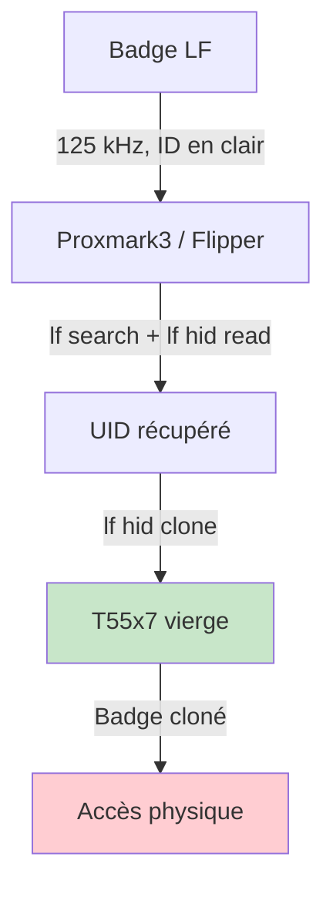
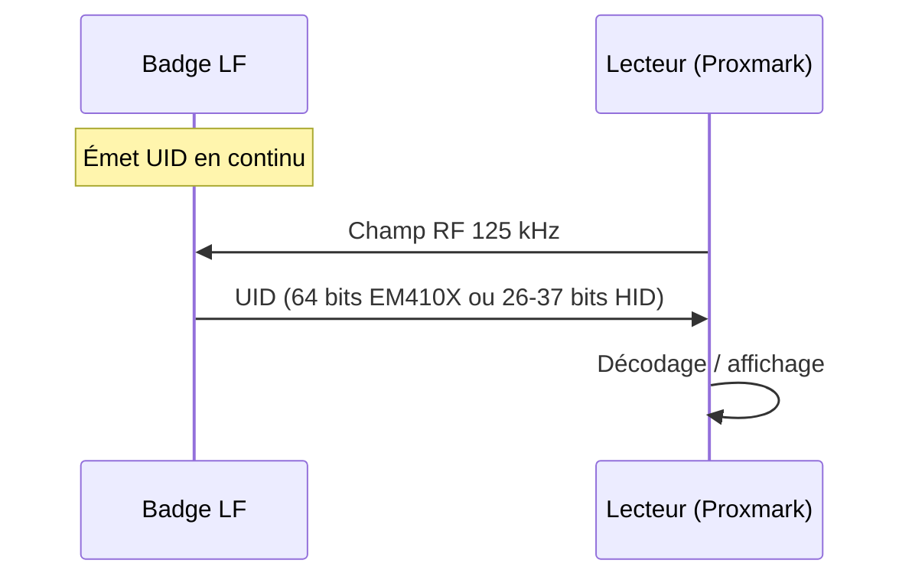
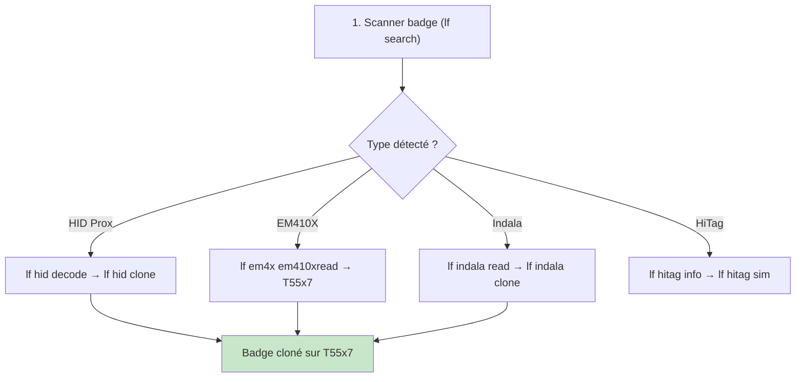
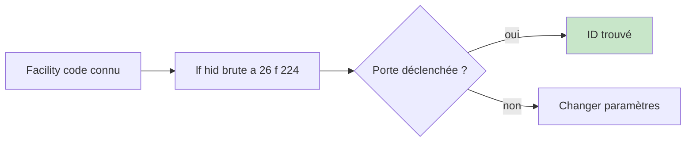
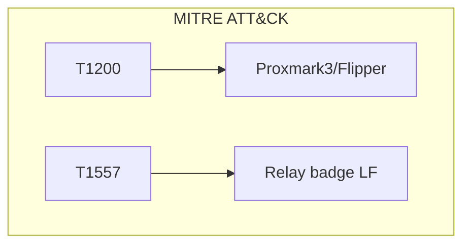

# RFID LF (HID, EM410X, Indala, HiTag)

> [!info] **En 1 phrase**
> Les badges 125 kHz (HID Prox, EM410X, Indala, HiTag) émettent un **ID fixe en clair, sans
> aucune crypto** : on les **lit puis clone en quelques secondes** sur une carte T55x7 vierge.

---

## Overview

| Champ | Valeur |
|---|---|
| **Type** | Communication RFID basse fréquence (125 kHz) |
| **Domaine** | Physical Security / Access Control |
| **Niveau** | Débutant → Avancé |
| **OS cibles** | Systèmes d'accès physique (badges, portes, parking) |
| **Matériel requis** | Proxmark3, Flipper Zero, lecteur 125 kHz, T55x7 vierge |
| **Complexité** | Faible → Moyenne |
| **Dernière mise à jour** | 2024-03-15 |

> [!info] **Diagramme de contexte**
> ```mermaid
> flowchart LR
>     B["Badge LF 125 kHz"] -->|"ID en clair"| R["Lecture"]
>     R -->|"lf search"| T["Carte T55x7"]
>     T -->|"lf hid clone"| C["Clone parfait"]
>     R -->|"lf hid sim"| E["Émulation Proxmark"]
>     style C fill:#c8e6c9
> ```

---

## Concept

> Les badges LF 125 kHz émettent un identifiant fixe en clair sur le拨radio. Il n'y a aucun chiffrement, aucune authentification, aucune variation. Un attaquant peut lire l'ID en approchant un lecteur, puis l'écrire sur une carte vierge T55x7 pour créer un clone parfait.



> [!info] **Le contexte**
> - **HID Prox** : formats H10302/H10304 (26–37 bits), facility code + numéro carte
> - **Indala** : formats propriétaires Motorola/HID
> - **EM410X** : mémoire lecture seule (impossible à réécrire)
> - **HiTag** : badges avec profils `.ht2` (clés)
> - **T55x7** : carte vierge inscriptible, capable d'émuler tous les tags 125 kHz

---

## Concepts fondamentaux

### Formats de badges LF

| Format | Bits | Facility Code | Card Number | Parité |
|---|---|---|---|---|
| **H10302** | 26 bits | 8 bits | 16 bits | Oui |
| **H10304** | 37 bits | 8 bits | 24 bits | Oui |
| **H10301** | 26 bits | 8 bits | 16 bits | Oui |
| **Indala 26** | 26 bits | 8 bits | 16 bits | Oui |
| **EM410X** | 64 bits | — | ID 40 bits | CRC |

### Types de badges LF

| Type | Mémoire | Écriture | Clonage |
|---|---|---|---|
| **EM410X** | 64 bits RO | Lecture seule | Nécessite T55x7 |
| **HID Prox** | 26–84 bits | Variable | `lf hid clone` |
| **Indala** | 26 bits | Variable | `lf indala clone` |
| **HiTag** | Variable | Variable | `lf hitag sim` |
| **T55x7** | 336 bits RW | Inscriptible | Support de clonage |

### Structure HID Prox (H10304)

```text
Bit:  1  2  3  4  5  6  7  8  9 10 11 12 13 14 15 16 17 18 19 20 21 22 23 24 25 26 27 28 29 30 31 32 33 34 35 36 37
      FC FC FC FC FC FC FC FC CN CN CN CN CN CN CN CN CN CN CN CN CN CN CN CN CN CN CN CN CN CN CN CN CN CN CN CN CN  P
      │←──── Facility Code (8 bits) ────→│←───────────────── Card Number (24 bits) ──────────────────────→│  │
      │                                   │                                                                 │  Parité
```

---

## Matériel / Composants

### Outils principaux

| Outil | LF | Usage | Prix |
|---|---|---|---|
| **Proxmark3 Easy** | 125 kHz + 13.56 MHz | Lire, cloner, émuler | ~300 € |
| **Flipper Zero** | 125 kHz | Lire, cloner, émuler | ~170 € |
| **ChameleonMini** | 125 kHz | Émulation badge | ~50 € |
| **EM4095 module** | 125 kHz | Lecture basique | ~10 € |
| **T55x7** | 125 kHz | Carte vierge (clonage) | ~5 € |
| **T5577** | 125 kHz | Carte vierge (compatible T55x7) | ~3 € |

### Cibles typiques

| Catégorie | Format | Vulnérabilité |
|---|---|---|
| Accès bureau | HID Prox | Clonage en secondes |
| Parking | EM410X | ID fixe en clair |
| Portail | Indala | Clonage direct |
| Ancien système | HiTag | Simulation Proxmark |

---

## Protocoles

### LF 125 kHz

| Paramètre | Valeur |
|---|---|
| Fréquence | 125 kHz |
| Portée | 1–10 cm |
| Modulation | Manchester, Biphase, PSK |
| Débit | 2 kbit/s (typique) |
| Chiffrement | Aucun |
| UID | Fixe, émis en continu |

### Séquence de communication



---

## Installation / Setup

### Prérequis

| Composant | Version |
|---|---|
| Proxmark3 client (RRG/Iceman) | latest |
| Python | ≥ 3.8 |
| libnfc | apt install libnfc |

### Connexion Proxmark3

```bash
# Compiler (RRG/Iceman fork)
git clone https://github.com/RfidResearchGroup/proxmark3.git
cd proxmark3 && make

# Lancer le client
./pm3

# Vérifier la connexion
./pm3 --list
```

### Flipper Zero

```text
1. Firmware → Official ou Unleashed
2. Badges → RFID → Add
3. Approcher badge → UID affiché
4. Badges → Sélectionner → Emulate / Write
```

---

## Configuration

| Paramètre | Défaut | Description |
|---|---|---|
| LF frequency | 125 kHz | Fréquence de réception |
| Baudrate Proxmark | 460800 | Vitesse communication |
| Timeout | 3000 ms | Timeout lecteur |

---

## Commandes / Manipulations

### Scan automatique

```bash
lf search
# Sortie : EM410x, HID Prox, Indala, etc.
```

### HID Prox

```bash
# Lire et décoder
lf hid read
lf hid decode <raw_id>

# Cloner
lf hid clone <card_id>

# Émuler
lf hid sim <card_id>

# Encoder carte vierge
lf hid encode H10304 f 49153 c 516907

# Brute-force lecteur
lf hid brute a 26 f 224
lf hid brute v a 26 f 21 c 200 d 2000
```

### Indala

```bash
lf indala read
lf indala sim <raw_id>
lf indala clone <raw_id>
```

### HiTag

```bash
lf hitag info
lf hitag sim <profile.ht2>
```

### EM410X

```bash
lf em4x em410xread
lf em4x em410xsim <id>
lf em 410x clone --id <id>
```

### T55xx (support d'écriture)

```bash
lf t55xx detect
lf t55xx dump
lf t55xx restore
lf t55xx wipe
```

---

## Exemples pratiques

### Débutant — Lire badge (Flipper Zero)

```text
1. Badges → RFID → Add
2. Approcher badge
3. UID affiché : 2004263f88
4. Badges → Emulate → test porte
```

### Intermédiaire — Cloner HID Prox

```bash
# 1. Lire le badge original
lf hid read
# Résultat : HID Prox TAG ID: 2004263f88

# 2. Décoder le format
lf hid decode 2004263f88
# Format : H10304, FC: 1, CN: 516907

# 3. Cloner sur T55x7
lf hid clone 2004263f88

# 4. Vérifier
lf hid read
```

### Avancé — Brute-force lecteur HID

```bash
# Facility code connu → balayer tous les numéros
lf hid brute a 26 f 224
# a <format> : 26|33|34|35|37|40|44|84
# f <facility-code>
# c <cardnumber> (optionnel)
# d <delay> ms (défaut 1000)
```

### Expert — Détection double badge

```python
#!/usr/bin/env python3
"""Détecter les doublons de badges LF"""
import subprocess
import json

def scan_badge():
    """Scanner badge via Proxmark3"""
    result = subprocess.run(['./pm3', '-c', 'lf search'],
                          capture_output=True, text=True, timeout=10)
    return result.stdout

# Comparer deux badges
badge1 = scan_badge()
badge2 = scan_badge()
if badge1 == badge2:
    print("[!] Deux badges avec le même ID détectés!")
```

---

## Workflow complet



| Étape | Action | Commande |
|---|---|---|
| 1 | Scanner | `lf search` |
| 2 | Lire ID | `lf hid read` / `lf em4x em410xread` |
| 3 | Décoder | `lf hid decode <id>` |
| 4 | Cloner | `lf hid clone <id>` |
| 5 | Vérifier | `lf hid read` |

---

## Scénarios avancés

### Scénario 1 — Cloner badge accès bureau

| Élément | Détail |
|---|---|
| **Objectif** | Cloner badge HID Prox d'accès bureau |
| **Outil** | Proxmark3 |
| **Étapes** | `lf search` → `lf hid decode` → `lf hid clone` sur T55x7 |
| **Résultat** | Badge cloné, accès physique |
| **Difficulté** | |

### Scénario 2 — Brute-force lecteur parking

| Élément | Détail |
|---|---|
| **Objectif** | Trouver un ID valide pour un lecteur parking |
| **Outil** | Proxmark3 |
| **Étapes** | Facility code connu → `lf hid brute` → déclenchement porte |
| **Résultat** | ID valide trouvé, accès parking |
| **Difficulté** | |



### Scénario 3 — Simulation badge (relay)

| Élément | Détail |
|---|---|
| **Objectif** | Émuler badge à distance |
| **Outil** | 2× Proxmark3 + réseau |
| **Étapes** | Prox #1 lit badge → relais → Prox #2 émule |
| **Résultat** | Authentification réussie à distance |
| **Difficulté** | |

---

## Cybersecurity use cases

| Use case | Sévérité | Impact |
|---|---|---|
| Badge LF cloné | Élevée | Accès physique |
| ID en clair | Élevée | Fuite d'identité |
| Brute-force lecteur | Élevée | Accès non autorisé |

| Phase pentest | Rôle RFID LF |
|---|---|
| Recon | Lire UIDs des badges |
| Accès initial | Cloner badge d'accès |
| Maintien | Badge cloné permanent |

---

## MITRE ATT&CK

| Technique ID | Nom | Catégorie |
|---|---|---|
| T1200 | Hardware Additions | Initial Access |
| T1557 | Adversary-in-the-Middle | Collection |



---

## Defensive Security

| Mesure | Efficacité | Priorité |
|---|---|---|
| Passer en HF chiffré | Très élevée | Haute |
| Multi-facteur | Élevée | Haute |
| Audit ID | Moyenne | Moyenne |
| Rotation badges | Élevée | Moyenne |

> [!warning] Badges LF = aucune crypto = clonage en secondes. Toujours migrer vers HF DESFire.

---

## Automatisation

```python
#!/usr/bin/env python3
"""Scan et clonage automatique badges LF"""
import subprocess
import re

def lf_search():
    """Scanner les badges LF"""
    result = subprocess.run(['./pm3', '-c', 'lf search'],
                          capture_output=True, text=True, timeout=10)
    return result.stdout

def lf_clone(card_id):
    """Cloner un badge LF"""
    subprocess.run(['./pm3', '-c', f'lf hid clone {card_id}'],
                  capture_output=True, text=True)

# Utilisation
output = lf_search()
print(output)
```

| Outil | Usage |
|---|---|
| Proxmark3 | LF complet |
| Flipper Zero | LF portable |
| ChameleonMini | Émulation |

---

## Output et parsing

```bash
# Dump badge
lf t55xx dump

# Analyse
hexdump -C dump.bin | head -10

# UID depuis lecture
lf hid read | grep "TAG ID"
```

---

## Intégrations

- [[13 - Hardware & IoT| Hardware & IoT]]
- [[Hardware - RFID LF (HID, EM410X, Indala, HiTag)]] (cette fiche)
- [[Hardware - RFID et NFC| RFID/NFC]]

| Outil | Usage |
|---|---|
| [[Hardware - Proxmark]] | RFID dédié |
| [[Hardware - Flipper Zero]] | Multi-protocole RF |
| [[Hardware - RFID MIFARE (HF 13.56 MHz)| MIFARE]] | HF complémentaire |

---

## Alternatives

| Alternative | Avantages | Inconvénients |
|---|---|---|
| Badge HF (DESFire) | AES-128, résistant | Plus cher |
| PIN code | Pas de RFID | Oubliable |
| Biométrie | Difficile à cloner | Coût, faux positifs |

---

## Performance

| Métrique | Valeur |
|---|---|
| Portée | 1–10 cm |
| Temps lecture | < 1 s |
| Temps clonage | < 5 s |
| Débit | 2 kbit/s |

---

## Troubleshooting

| Problème | Cause | Solution |
|---|---|---|
| Badge non détecté | Mauvaise fréquence | Vérifier 125 kHz |
| UID incorrect | Anti-collision | Re-positionner badge |
| Clonage échoue | Badge non LF | Vérifier fréquence |

```bash
# Diagnostic
./pm3 -c "lf tune"
lf search
```

---

## Sécurité

| Risque | Mitigation |
|---|---|
| Badge LF cloné | Passer en HF DESFire |
| ID en clair | Chiffrement HF |
| Brute-force | Multi-facteur |

> [!warning] Badges LF = aucune sécurité. Toujours combiner avec PIN/biométrie.

> [!danger] Cloner des badges sans autorisation = accès non autorisé = illégal.

---

## Limitations

| Limite | Contournement |
|---|---|
| Portée limitée (~10 cm) | Antenne amplifiée |
| ID fixe | Rotation des IDs |
| Aucune crypto | Migration vers HF |

---

## Cheatsheet

```
┌───────────────────────────────────────────────────┐
│ RFID LF — Cheatsheet                              │
├───────────────────────────────────────────────────┤
│ Scan :       lf search                            │
│ Read :       lf hid read / lf em4x em410xread    │
│ Decode :     lf hid decode <id>                   │
│ Clone :      lf hid clone <id> / lf indala clone  │
│ Simulate :   lf hid sim <id> / lf hitag sim       │
│ Brute-force: lf hid brute a 26 f <fc>             │
│ T55x7 :      lf t55xx detect / dump / wipe        │
│ Formats :    H10302, H10304, EM410X, Indala        │
│ Freq :       125 kHz                              │
│ Carte vierge: T55x7 / T5577                       │
└───────────────────────────────────────────────────┘
```

---

## Quick reference

| Élément | Valeur |
|---|---|
| **Fréquence** | 125 kHz |
| **Portée** | 1–10 cm |
| **Clonage** | < 5 secondes |
| **Outil** | Proxmark3 / Flipper |
| **Carte vierge** | T55x7 |
| **Crypto** | Aucune |

---

## Détection & Défense

| Countermeasure | Efficacité |
|---|---|
| Migration HF DESFire | Très élevée |
| Multi-facteur | Élevée |
| Audit logs | Moyenne |

---

## Tips & Pièges

- **EM410X = lecture seule** : pour cloner → T55x7, pas EM410X vierge.
- **Ne jamais écraser** une carte légitime : sauvegarde d'abord.
- **Brute-force HID** = facility code connu, pas crypto.
- Certains systèmes (iCLASS, SEOS) refusent `lf hid sim`.
- Le **format** (H10302/H10304) détermine le nombre de bits.

> [!tip] `lf search` identifie automatiquement le type de badge. Commence toujours par là.

---

## References

> [!info] **Sources**
> - [HardwareAllTheThings — LF HID & Indala](https://github.com/swisskyrepo/HardwareAllTheThings/blob/main/docs/protocols/rfid-nfc/lf-hid-indala.md)
> - [RFID Hacking — Kevin Chung](https://blog.kchung.co/rfid-hacking-with-the-proxmark-3/)

| Source | URL |
|---|---|
| Proxmark3 | https://proxmark.com/ |
| Flipper Zero | https://flipperzero.one/ |
| HID Prox Formats | https://www.hidglobal.com/documents/faq-hid-prox-credentials |

---

**Liens :** [[Hardware - RFID et NFC| Hub RFID]] · [[Hardware - RFID MIFARE (HF 13.56 MHz)| MIFARE]] · [[Hardware - Proxmark| Proxmark]] · [[Hardware - Flipper Zero| Flipper Zero]]
