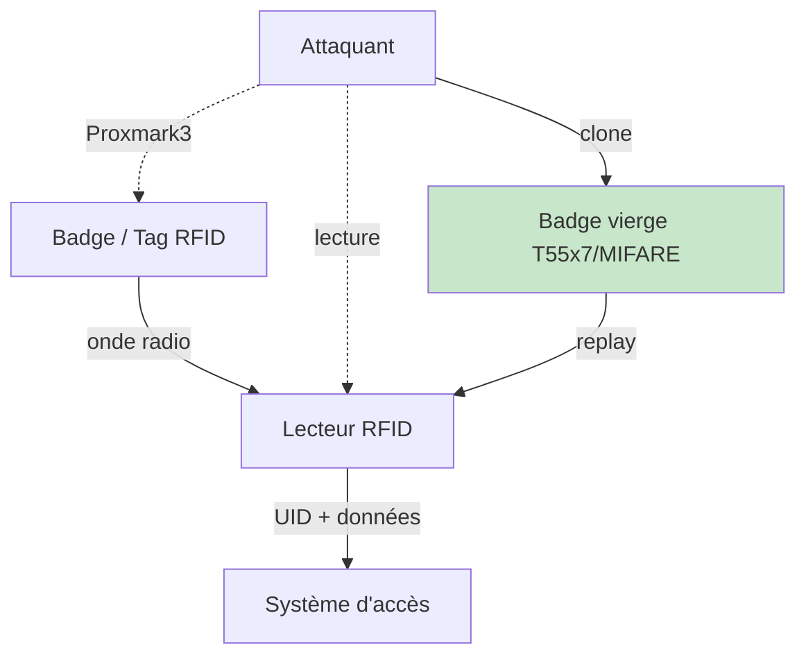
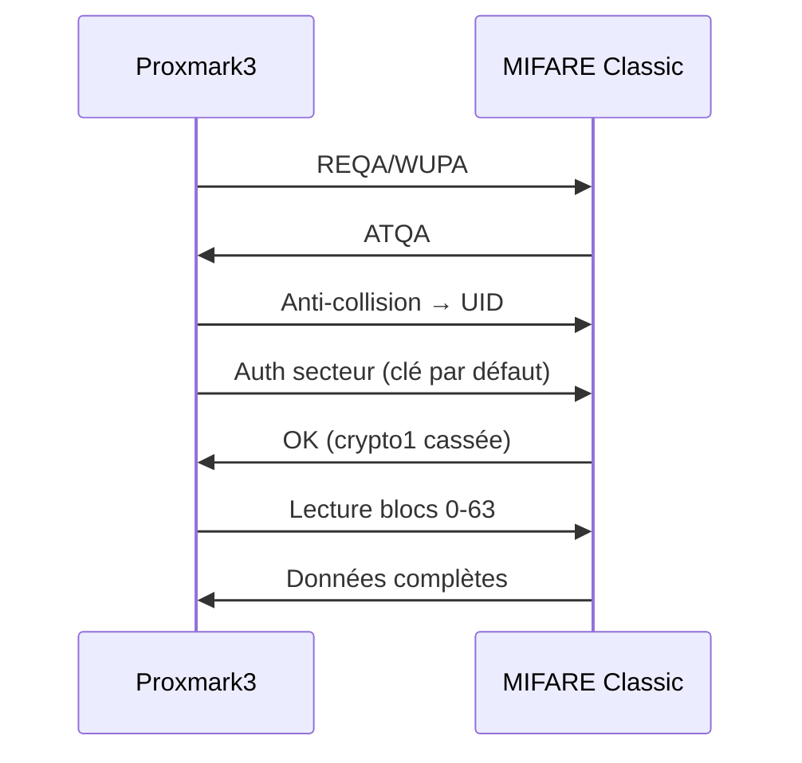
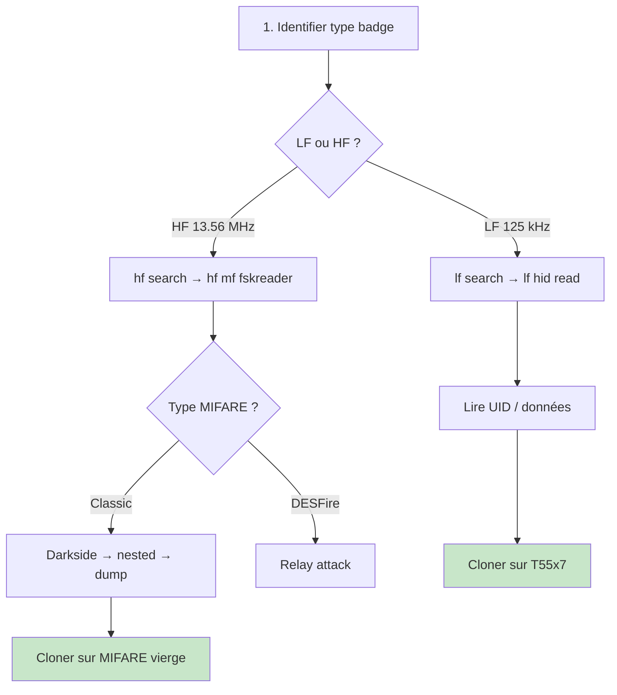
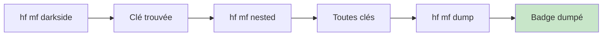
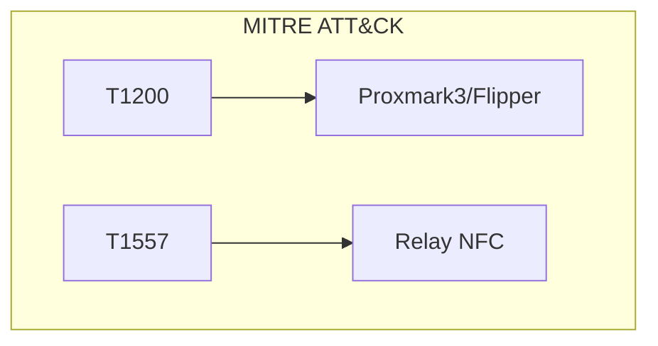

# 🏷️ Hardware - RFID et NFC

> [!info] **En 1 phrase**
> RFID/NFC = **badges, tickets et cartes de paiement** : souvent **clonables**, **rejouables**
> ou **relayables** — et la crypto « sécurisée » (MIFARE Classic) est **cassée**.

---

## 🧾 Overview

| Champ | Valeur |
|---|---|
| **Type** | Protocole de communication sans contact (RFID : 125 kHz LF, NFC : 13.56 MHz HF) |
| **Domaine** | Hardware Hacking / Access Control / Physical Security |
| **Niveau** | Débutant → Avancé |
| **OS cibles** | Systèmes d'accès physique, transports, paiement |
| **Matériel requis** | Proxmark3, Flipper Zero, ChameleonMini, lecteur USB |
| **Complexité** | Faible (LF) → Élevée (HF avancé) |
| **Dernière mise à jour** | 2024-03-15 |

> [!info] 📊 **Diagramme de contexte**
> ```mermaid
> flowchart LR
>     R["RFID / NFC"] --> HF["HF 13.56 MHz<br>MIFARE, DESFire"]
>     R --> LF["LF 125 kHz<br>HID, EM410X"]
>     ATK["Attaquant"] -.->|"lecture/clone"| R
>     HF --> F1["Fiche MIFARE"]
>     LF --> F2["Fiche LF"]
>     style ATK fill:#ffcdd2
> ```

---

## 🎯 Concept

> RFID (Radio Frequency Identification) et NFC (Near Field Communication) sont des technologies de communication sans contact utilisées pour les badges d'accès, tickets de transport, cartes de paiement et tags d'identification. En pentest, elles permettent de lire, cloner ou relayer des identifiants d'accès.



> [!info] 💡 **Ce qu'on peut faire**
> - **Lire** les UIDs de badges (LF et HF)
> - **Cloner** des badges simples (LF, MIFARE Classic)
> - **Rejouer** des transactions NFC
> - **Relayer** des authentifications (MIFARE DESFire)

---

## 🧠 Concepts fondamentaux

### Les 3 mondes RFID/NFC

| Monde | Fréquence | Exemples | Sécurité |
|---|---|---|---|
| **LF** (Low Frequency) | 125 kHz | HID Prox, EM410X, Indala | Aucune crypto |
| **HF** (High Frequency) | 13.56 MHz | MIFARE Classic, DESFire, Ultralight | Crypto1 cassée (Classic) |
| **UHF** (Ultra High) | 860–960 MHz | EPC Gen2, RFID logistique | Variable |

### Terminologie

| Terme | Définition |
|---|---|
| **UID** | Identifiant unique du tag/badge (modifiable sur certains) |
| **Tag** | Composant RFID passif (alimenté par le champ du lecteur) |
| **Reader** | Dispositif qui émet le champ RF et communique avec le tag |
| **Anti-collision** | Protocole pour gérer plusieurs tags simultanés |
| **Crypto1** | Chiffrement utilisé par MIFARE Classic (cassé en 2008) |
| **MIFARE Classic** | Carte HF 13.56 MHz avec crypto1 (1K/4K octets) |
| **DESFire** | Carte HF avancée (AES-128, 3DES) |

### Comparaison LF vs HF

| Caractéristique | LF 125 kHz | HF 13.56 MHz |
|---|---|---|
| Portée | 1–10 cm | 1–10 cm |
| Données | UID fixe (64 bits) | UID + mémoire (1K–8K) |
| Crypto | Aucune | Crypto1, AES, 3DES |
| Clonage | Très facile | MIFARE Classic facile, DESFire dur |
| Outils | Proxmark3, Flipper | Proxmark3, ChameleonMini |
| Coût badge | < 1 € | 1–10 € |

---

## 🔌 Matériel / Composants

### Outils principaux

| Outil | Type | LF | HF | Prix |
|---|---|---|---|---|
| **Proxmark3** | Lecteur/émulateur | 125 kHz | 13.56 MHz | ~300–600 € |
| **Flipper Zero** | Multi-protocole | 125 kHz | 13.56 MHz | ~170 € |
| **ChameleonMini** | Émulateur badge | 125 kHz | 13.56 MHz | ~50 € |
| **ChameleonUltra** | Émulateur avancé | 125 kHz | 13.56 MHz | ~100 € |
| **ACR122U** | Lecteur USB | — | 13.56 MHz | ~30 € |
| **EM4095** | Module LF | 125 kHz | — | ~10 € |

### Cibles typiques

| Catégorie | Type | Vulnérabilités |
|---|---|---|
| Badges accès bureau | LF 125 kHz | Clonage en secondes |
| Tickets transport | HF MIFARE | Crypto1 cassée |
| Cartes paiement | HF DESFire | Relay attack possible |
| NFC tags | HF NFC | Données en clair |

### Types de tags

| Type | Fréquence | Mémoire | Sécurité |
|---|---|---|---|
| EM410X | 125 kHz | 64 bits (RO) | Aucune |
| HID Prox | 125 kHz | 26–84 bits | Aucune |
| T55x7 | 125 kHz | 336 bits (RW) | Programmable |
| MIFARE Classic 1K | 13.56 MHz | 1024 octets | Crypto1 (cassé) |
| MIFARE Ultralight | 13.56 MHz | 512 octets | Aucune |
| MIFARE DESFire | 13.56 MHz | 2–8 Ko | AES-128, 3DES |
| NTAG215 | 13.56 MHz | 540 octets | Password (déduit UID) |

---

## ⚡ Protocoles

### LF 125 kHz

| Paramètre | Valeur |
|---|---|
| Fréquence | 125 kHz |
| Portée | 1–10 cm |
| Données | UID fixe en clair |
| Modulation | Manchester, Biphase |
| Chiffrement | Aucun |

### HF 13.56 MHz (MIFARE Classic)

| Paramètre | Valeur |
|---|---|
| Fréquence | 13.56 MHz |
| Portée | 1–10 cm |
| Mémoire | 1024 octets (1K) |
| Blocs | 16 secteurs × 4 blocs |
| Crypto | Crypto1 (NXP, cassé 2008) |
| Auth | 3 clusters de clés (A/B) |

### Séquence d'attaque MIFARE



---

## 🛠️ Installation / Setup

### Prérequis

| Composant | Version |
|---|---|
| Proxmark3 client | latest (RRG/Iceman fork) |
| Python | ≥ 3.8 |
| libnfc | apt install libnfc |
| mfoc | apt install mfoc |
| mfcuk | apt install mfcuk |

### Connexion Proxmark3

```bash
# Compiler le client Proxmark3
git clone https://github.com/RfidResearchGroup/proxmark3.git
cd proxmark3
make clean && make

# Connexion
./pm3

# Ou via USB
ls /dev/ttyACM*
./pm3 --list
```

### Flipper Zero

```text
1. Mettre à jour le firmware (Official ou Unleashed)
2. Badges → Add RFID → Lire le badge
3. Badges →选择 badge → Emulate / Write
```

---

## ⚙️ Configuration

### Proxmark3

| Paramètre | Défaut | Description |
|---|---|---|
| LF frequency | 125 kHz | Fréquence LF |
| HF frequency | 13.56 MHz | Fréquence HF |
| Baudrate | 460800 | Vitesse communication |
| Timeout | 3000 ms | Timeout lecteur |

---

## ⌨️ Commandes / Manipulations

### Proxmark3 — LF

```bash
# Scanner badge LF
lf search

# Lire HID Prox
lf hid read
lf hid decode <raw>

# Cloner HID
lf hid clone <card_id>

# Lire EM410X
lf em4x em410xread

# Brute-force lecteur HID
lf hid brute a 26 f 224
```

### Proxmark3 — HF

```bash
# Scanner badge HF
hf search

# Lire MIFARE Classic
hf mf fskreader
hf mf darkside      # Attaque darkside (clé par défaut)
hf mf nested         # Attaque nested

# Cloner MIFARE Classic
hf mf cload <dump_file>

# Dump MIFARE Classic
hf mf dump
```

### ACR122U (libnfc)

```bash
# Lire UID
nfc-list

# Écrire tag
nfc-mfclassic W a dump_mifare.bin uid_of_tag

# Dump tag
nfc-mfclassic R a dump_mifare.bin
```

---

## 🧪 Exemples pratiques

### 🟢 Débutant — Lire badge LF (Flipper Zero)

```text
1. Badges → RFID → Add
2. Approcher le badge de l'antenne
3. UID affiché : 2004263f88
4. Badges → Emulate → test porte
```

### 🟡 Intermédiaire — Cloner MIFARE Classic

```bash
# 1. Dump du badge original
hf mf dump -f original.mfd

# 2. Analyse
hf mf info

# 3. Cloner sur badge vierge MIFARE
hf mf cload -f original.mfd

# Vérification
hf fskreader
```

### 🔴 Avancé — Attaque Darkside (clé par défaut)

```bash
# MIFARE Classic : attaque darkside → trouve une clé
hf mf darkside

# Puis lecture avec la clé trouvée
hf mf rdbl --blk 0 -k AAAAAAAAAAAA

# Dump complet avec clés par défaut
# NXP par défaut : FFFFFFFFFFFFF, A0A1A2A3A4A5, D3F7D3F7D3F7
```

### ⚫ Expert — Relay attack MIFARE

```text
1. Proxmark3 #1 (proximité badge) → lit UID
2. Proxmark3 #2 (proximité lecteur) → émule badge
3. Communication relais en temps réel
4. Authentification réussie via relais
```

---

## 🧪 Workflow complet



| Étape | LF | HF |
|---|---|---|
| 1 | `lf search` | `hf search` |
| 2 | `lf hid read` | `hf mf fskreader` |
| 3 | `lf hid clone` | `hf mf cload` |

---

## 🎬 Scénarios avancés

### Scénario 1 — Cloner badge accès bureau (LF)

| Élément | Détail |
|---|---|
| **Objectif** | Cloner badge d'accès HID Prox |
| **Outil** | Proxmark3 ou Flipper Zero |
| **Étapes** | `lf search` → `lf hid decode` → `lf hid clone` |
| **Résultat** | Badge cloné, accès physique |
| **Difficulté** | ⭐ |

### Scénario 2 — Dump MIFARE Classic transport

| Élément | Détail |
|---|---|
| **Objectif** | Extraire crédit tickets de transport |
| **Outil** | Proxmark3, pcsc-tools |
| **Étapes** | Darkside → nested attack → dump → analyse |
| **Résultat** | Dump complet du badge |
| **Difficulté** | ⭐⭐⭐ |



### Scénario 3 — Relay MIFARE DESFire

| Élément | Détail |
|---|---|
| **Objectif** | Relay authentification DESFire |
| **Outil** | 2× Proxmark3 + connexion réseau |
| **Étapes** | Prox #1 lit badge → relais → Prox #2 émule |
| **Résultat** | Authentification réussie à distance |
| **Difficulté** | ⭐⭐⭐⭐ |

---

## 🛡️ Cybersecurity use cases

| Use case | Sévérité | Impact |
|---|---|---|
| Badge LF cloné | Élevée | Accès physique |
| MIFARE Classic dumpé | Élevée | Fuite données/credit |
| Relay DESFire | Critique | Accès non autorisé |

| Phase pentest | Rôle RFID/NFC |
|---|---|
| Recon | Lire UIDs des badges |
| Accès initial | Cloner badge d'accès |
| Maintien | Badge cloné permanent |
| Exfiltration | Dump données badge |

---

## 🎯 MITRE ATT&CK

| Technique ID | Nom | Catégorie |
|---|---|---|
| T1200 | Hardware Additions | Initial Access |
| T1557 | Adversary-in-the-Middle | Collection |
| T1040 | Network Sniffing | Collection |



---

## 🛡️ Defensive Security

| Mesure | Efficacité | Priorité |
|---|---|---|
| Passer en HF chiffré | Très élevée | Haute |
| MIFARE DESFire AES | Élevée | Haute |
| Multi-facteur | Élevée | Haute |
| Audit des ID | Moyenne | Moyenne |
| Rotation badges | Élevée | Moyenne |

> [!warning] Les badges LF (125 kHz) n'ont **aucune** crypto → clonage en quelques secondes.

---

## 🤖 Automatisation

```python
#!/usr/bin/env python3
"""Lecture automatique badges via Proxmark3"""
import subprocess
import re

def read_badge():
    """Lire badge via Proxmark3"""
    result = subprocess.run(['./pm3', '-c', 'lf search'], 
                          capture_output=True, text=True, timeout=10)
    # Parser le résultat
    uid_match = re.search(r'TAG ID: ([0-9a-fA-F]+)', result.stdout)
    if uid_match:
        return uid_match.group(1)
    return None

uid = read_badge()
if uid:
    print(f"[+] Badge détecté: {uid}")
```

| Outil | Usage |
|---|---|
| Proxmark3 | LF + HF complet |
| Flipper Zero | LF + HF portable |
| ChameleonMini | Émulation badges |
| libnfc | NFC (HF) |

---

## 📤 Output et parsing

```bash
# Dump MIFARE
hf mf dump -f dump.mfd

# Analyse dump
hexdump -C dump.mfd | head -30

# UID depuis dump
hexdump -C dump.mfd | head -1
```

---

## 🔗 Intégrations

- [[13 - Hardware & IoT|⚙️ Hardware & IoT]]
- [[Hardware - RFID et NFC]] (cette fiche)
- [[Hardware - RFID MIFARE (HF 13.56 MHz)|💳 MIFARE]]
- [[Hardware - RFID LF (HID, EM410X, Indala, HiTag)|📡 LF]]

| Outil | Usage |
|---|---|
| [[Hardware - Proxmark]] | RFID dédié |
| [[Hardware - Flipper Zero]] | Multi-protocole RF |

---

## 🔄 Alternatives

| Alternative | Avantages | Inconvénients |
|---|---|---|
| Pin code seul | Pas de RFID nécessaire | Oubliable |
| Biométrie | Difficile à cloner | Coût, faux positifs |
| QR code | Pas de matériel RF | Visible, photocopiable |

---

## ⚡ Performance

| Métrique | LF 125 kHz | HF 13.56 MHz |
|---|---|---|
| Portée | 1–10 cm | 1–10 cm |
| Temps lecture | < 1 s | < 1 s |
| Temps clonage | < 5 s | 10–60 s |
| Débit | 2 kbit/s | 106–424 kbit/s |

---

## 🛠️ Troubleshooting

| Problème | Cause | Solution |
|---|---|---|
| Badge non détecté | Mauvaise fréquence | Vérifier LF/HF |
| UID incorrect | Anti-collision échouée | Re-positionner badge |
| Clonage échoue | Badge non compatible | Vérifier type (T55x7, MIFARE) |

```bash
# Diagnostic
./pm3 -c "lf tune"     # Vérifier antenne LF
./pm3 -c "hf tune"     # Vérifier antenne HF
```

---

## 🔐 Sécurité

| Risque | Mitigation |
|---|---|
| Badge LF cloné | Passer en HF DESFire |
| MIFARE Classic | Changer vers DESFire AES |
| Relay attack | Multi-facteur, timeout |

> [!warning] Badges LF = lecture en clair. Toujours migrer vers HF chiffré.

> [!danger] Cadre légal : cloner des badges sans autorisation = accès non autorisé.

---

## ⚠️ Limitations

| Limite | Contournement |
|---|---|
| Portée limitée (~10 cm) | Antenne amplifiée |
| DESFire AES résistant | Relay attack |
| Badge non lisible | Essaye autre fréquence |

---

## 📋 Cheatsheet

```
┌───────────────────────────────────────────────────┐
│ RFID/NFC — Cheatsheet                             │
├───────────────────────────────────────────────────┤
│ LF scan :    lf search                            │
│ LF read :    lf hid read / lf em4x em410xread    │
│ LF clone :   lf hid clone <card_id>              │
│ HF scan :    hf search                            │
│ HF read :    hf mf fskreader                      │
│ HF dump :    hf mf dump                           │
│ HF clone :   hf mf cload -f dump.mfd             │
│ HF crack :   hf mf darkside → hf mf nested       │
│ Flipper :    Badges → RFID → Add/Emulate          │
│ LF freq :    125 kHz (HID, EM410X, Indala)       │
│ HF freq :    13.56 MHz (MIFARE, DESFire, NTAG)   │
└───────────────────────────────────────────────────┘
```

---

## ⚡ Quick reference

| Élément | LF | HF |
|---|---|---|
| **Fréquence** | 125 kHz | 13.56 MHz |
| **Portée** | 1–10 cm | 1–10 cm |
| **Clonage** | Très facile | MIFARE facile |
| **Outil** | Proxmark, Flipper | Proxmark, ACR122U |
| **Crypto** | Aucune | Crypto1 (cassé) |

---

## 🔍 Détection & Défense

| Countermeasure | Efficacité |
|---|---|
| DESFire AES | Très élevée |
| Multi-facteur | Élevée |
| Rotation ID | Élevée |
| Audit logs | Moyenne |

---

## ⚠️ Tips & Pièges

- **LF = lecture en clair** : toujours clonable en secondes.
- **MIFARE Classic = crypto1 cassée** : clé par défaut suffit.
- **DESFire = résistant au clone** : nécessite relay attack.
- **NTAG215** = password dérivé du UID → faible protection.
- **Sauvegarde toujours** le dump avant d'écrire un badge.

> [!tip] Commence par `lf search` / `hf search` pour identifier le type de badge.

---

## 📚 References

> [!info] 📚 **Sources**
> - [HardwareAllTheThings — RFID/NFC](https://github.com/swisskyrepo/HardwareAllTheThings/tree/main/docs/protocols/rfid-nfc)
> - [RFID Hacking — Kevin Chung](https://blog.kchung.co/rfid-hacking-with-the-proxmark-3/)

| Source | URL |
|---|---|
| Proxmark3 | https://proxmark.com/ |
| Flipper Zero | https://flipperzero.one/ |
| libnfc | https://libnfc.org/ |
| MIFARE Classic crypto1 | https://www.crypto1.de/ |

---

➡️ **Liens :** [[13 - Hardware & IoT|⚙️ Hardware & IoT]] · [[Hardware - RFID MIFARE (HF 13.56 MHz)|💳 MIFARE]] · [[Hardware - RFID LF (HID, EM410X, Indala, HiTag)|📡 LF]] · [[Hardware - Proxmark|🛠️ Proxmark]]
