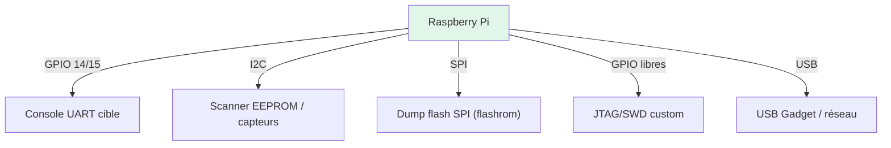
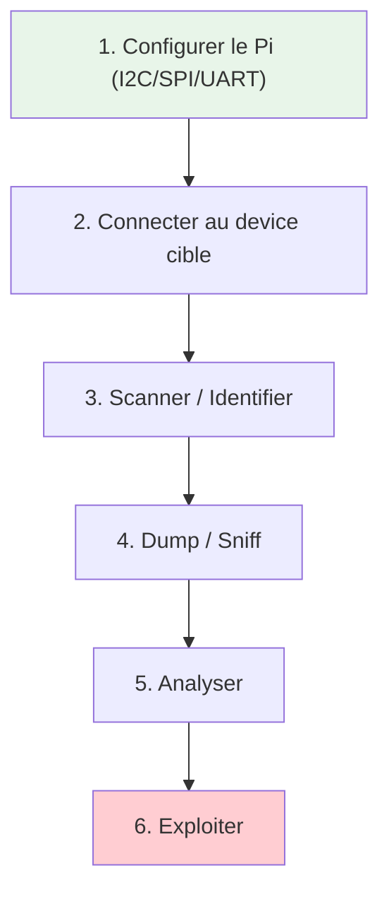
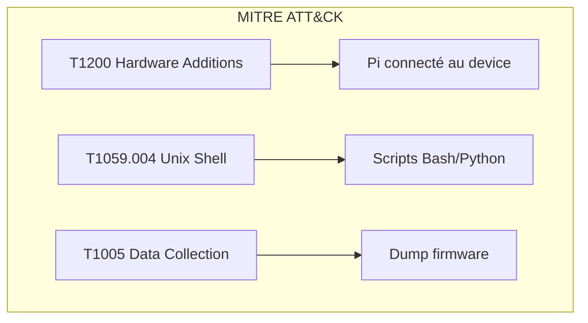
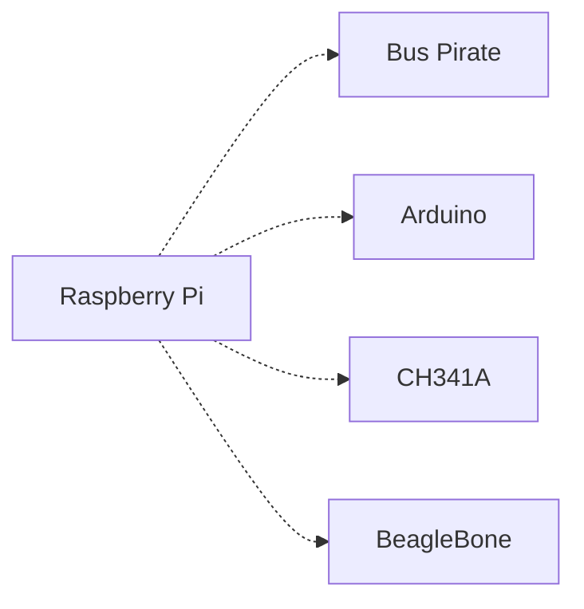

# Raspberry Pi

> [!info] **En 1 phrase**
> Le **Raspberry Pi** n'est pas qu'un mini-PC : son **header GPIO 40 broches** expose
> **UART, I2C, SPI, JTAG** et des GPIO libres — le « poor man's hardware hacking tool »
> qui sert d'interface de debug et de dump à moindre coût.

---

## Overview

| Champ | Valeur |
|---|---|
| **Type** | Single Board Computer (SBC) / Outil de hacking |
| **Domaine** | Hardware Hacking / IoT / Embedded Linux |
| **Niveau** | Beginner → Expert |
| **OS cibles** | Raspberry Pi OS (Debian), Linux embedded |
| **Matériel requis** | Raspberry Pi, carte microSD, alimentation USB-C, PC |
| **Complexité** | Faible → Élevée |
| **Dernière mise à jour** | 2026-08-16 |

> [!info] **Diagramme de contexte**
> ```mermaid
> flowchart LR
>     A["Raspberry Pi"] --> B["GPIO 40 pins"]
>     B --> C["UART / I2C / SPI / JTAG"]
>     C --> D["Device cible"]
>     D --> E["Debug / Dump / Exploit"]
>     style A fill:#e1f5fe
>     style E fill:#c8e6c9
> ```

---

## Concept

Le Raspberry Pi est un mini-ordinateur Linux complet dont le header GPIO 40 broches expose UART, I2C, SPI et GPIO libres. En pentest hardware, il sert de **plateforme de debug** (scanner I2C, dumper flash SPI via flashrom, console UART) et de **cible** (le Pi lui-même peut être compromis via son boot).



---

## Concepts fondamentaux

### GPIO Header 40 pins

| Terme | Définition |
|---|---|
| **GPIO** | General Purpose Input/Output — broches numériques programables |
| **UART** | Universal Asynchronous Receiver/Transmitter — communication série |
| **I2C** | Inter-Integrated Circuit — bus 2 fils (SDA/SCL) |
| **SPI** | Serial Peripheral Interface — bus 4 fils (MOSI/MISO/CS/SCK) |
| **JTAG** | Joint Test Action Group — debug et test de circuits |
| **RP1** | Southbridge custom conçu par Raspberry Pi (Pi 5) |

### Modèles Raspberry Pi (2026)

| Modèle | Processeur | RAM | GPIO | WiFi | Ethernet | USB | Usage pentest |
|---|---|---|---|---|---|---|---|
| Pi Zero 2 W | BCM2710A1 (4x A53) | 512 MB | 40 | WiFi 4 | Non | 1x micro | Compact, wireless |
| Pi 3B+ | BCM2837B0 (4x A53) | 1 GB | 40 | WiFi 4 | GbE (throttled) | 4x | Standard |
| Pi 4B | BCM2711 (4x A72) | 1-8 GB | 40 | WiFi 5 | GbE | 2x3.0+2x2.0 | Puissant |
| Pi 5 | BCM2712 (4x A76) | 1-16 GB | 40 | WiFi 5 | GbE | 2x3.0+2x2.0 | RP1 southbridge, PCIe |
| Pi Pico | RP2040 (M0+双核) | 264 KB | 30 | Non | Non | Micro-USB | Bare-metal, pas de Linux |

> [!note] À vérifier
> Le Pi 5 utilise le southbridge RP1 (basé sur RP2040). Les GPIO sont contrôlés par RP1, pas directement par le BCM2712. Les libgpiod/gpiochip abstractions changent.

---

## Matériel / Composants

### GPIO Pinout (40 pins)

| Broche | BCM GPIO | Fonction | Description |
|---|---|---|---|
| 1 | — | 3.3V Power | Alimentation 3.3V |
| 2 | — | 5V Power | Alimentation 5V |
| 3 | GPIO 2 | I2C SDA | Bus I2C données |
| 4 | — | 5V Power | Alimentation 5V |
| 5 | GPIO 3 | I2C SCL | Bus I2C horloge |
| 6 | — | GND | Masse |
| 8 | GPIO 14 | UART TX | Transmission série |
| 10 | GPIO 15 | UART RX | Réception série |
| 11 | GPIO 17 | GPIO | Usage libre |
| 12 | GPIO 18 | GPIO/PWM | PWM canal |
| 19 | GPIO 10 | SPI MOSI | SPI données sortantes |
| 21 | GPIO 9 | SPI MISO | SPI données entrantes |
| 23 | GPIO 11 | SPI SCLK | SPI horloge |
| 24 | GPIO 8 | SPI CE0 | SPI chip select 0 |
| 26 | GPIO 7 | SPI CE1 | SPI chip select 1 |
| 27 | — | ID_SD | I2C HAT identification |
| 28 | — | ID_SC | I2C HAT identification |

### Outils complémentaires

| Outil | Type | Usage | Prix | Source |
|---|---|---|---|---|
| PiFex | Carte extension | UART/JTAG/SPI/I2C breakout | ~25€ | PiFex |
| raspi-sec-tool | Scripts | Transformer Pi en outil de hacking | Gratuit | arunmagesh |
| Flashrom | Logiciel | Dump flash SPI | Gratuit | flashrom.org |
| OpenOCD | Logiciel | Debug JTAG | Gratuit | openocd.org |

### Outils logiciels

```bash
# Installation des outils hardware
sudo apt-get install i2c-tools spi-tools flashrom openocd

# Vérification I2C
i2cdetect -y 1

# Vérification SPI
ls /dev/spidev*

# Vérification GPIO
gpio readall
```

---

## Protocoles

### Protocoles GPIO

| Protocole | Pins | Vitesse | Usage pentest |
|---|---|---|---|
| UART | GPIO 14 (TX) / 15 (RX) | 115200 | Console debug device cible |
| I2C | GPIO 2 (SDA) / 3 (SCL) | 400 kHz | Scanner EEPROM, capteurs |
| SPI | GPIO 8-11 | 10 MHz | Dump flash NOR (flashrom) |
| JTAG | GPIO libres (via overlay) | Variable | Debug device cible |
| 1-Wire | GPIO 4 | — | Capteurs température |

---

## Installation / Setup

### Prérequis

| Composant | Version | Lien |
|---|---|---|
| Raspberry Pi OS | Bookworm (64-bit) | https://raspberrypi.com/software |
| flashrom | 1.4+ | https://flashrom.org/ |
| OpenOCD | 0.12+ | https://openocd.org/ |
| i2c-tools | Latest | apt install i2c-tools |

### Activation des interfaces

```bash
sudo raspi-config
# Interface Options → I2C → Enable
# Interface Options → SPI → Enable
# Interface Options → UART → Disable (pour libérer GPIO14/15)

sudo apt-get install i2c-tools spi-tools flashrom
```

### Connexion physique

```
Raspberry Pi GPIO  ────────  Device cible
│
│  GPIO 14 (TX) ──────────── RX
│  GPIO 15 (RX) ──────────── TX
│  GPIO 2 (SDA) ──────────── SDA
│  GPIO 3 (SCL) ──────────── SCL
│  GPIO 10 (MOSI) ────────── MOSI
│  GPIO 9 (MISO) ─────────── MISO
│  GPIO 11 (SCLK) ────────── SCK
│  GPIO 8 (CE0) ──────────── CS
│  3.3V ──────────────────── VCC (si 3.3V only)
│  GND ───────────────────── GND
```

---

## Configuration

### Console UART — libérer GPIO14/15

```bash
# Désactiver la console Linux sur UART
sudo raspi-config
# → Interface Options → Serial Port
# → Login shell over serial: No
# → Serial port hardware enabled: Yes

# Ou manuellement
sudo sed -i 's/console=serial[0-9],[0-9]* //' /boot/cmdline.txt
echo "enable_uart=1" | sudo tee -a /boot/config.txt
sudo reboot
```

### Configuration I2C / SPI

```bash
# Vérifier I2C
i2cdetect -y 1
# Affiche les devices connectés au bus I2C

# Vérifier SPI
ls -la /dev/spidev*
# spidev0.0 = CE0, spidev0.1 = CE1
```

---

## Commandes / Manipulations

### Commandes essentielles

| Commande | Description | Exemple |
|---|---|---|
| `i2cdetect` | Scanner bus I2C | `i2cdetect -y 1` |
| `flashrom` | Lire flash SPI | `flashrom -p linux_spi:dev=/dev/spidev0.0 -r dump.bin` |
| `screen` | Console série | `screen /dev/ttyAMA0 115200` |
| `gpio readall` | État GPIO | `gpio readall` |

### Lecture / Écriture

```bash
# Dump flash SPI via flashrom
flashrom -p linux_spi:dev=/dev/spidev0.0,spispeed=512 -r spi_dump.bin

# Flasher une flash SPI
flashrom -p linux_spi:dev=/dev/spidev0.0,spispeed=512 -w new_firmware.bin

# Scanner I2C
i2cdetect -y 1
i2cget -y 1 0x50 0x00  # Lire un octet à l'adresse 0x50

# Console UART (avec câble)
screen /dev/ttyAMA0 115200
# Ou depuis USB-UART
screen /dev/ttyUSB0 115200
```

### Shell / Console

```bash
# Connexion à la console d'un device via GPIO
sudo screen /dev/ttyAMA0 115200

# Ou avec minicom
sudo minicom -D /dev/ttyAMA0 -b 115200
```

---

## Exemples pratiques

### Débutant — Scanner I2C

```bash
# Activer I2C puis scanner
sudo apt-get install i2c-tools
i2cdetect -y 1
# Les adresses affichées sont les devices I2C connectés
# Ex: 0x50 = EEPROM, 0x68 = RTC, 0x76 = Capteur
```

### Intermédiaire — Dump flash SPI

```bash
# Connecter le Pi aux pins SPI de la flash NOR du device cible
# Vérifier la connexion
flashrom -p linux_spi:dev=/dev/spidev0.0,spispeed=512

# Dumper
flashrom -p linux_spi:dev=/dev/spidev0.0,spispeed=512 -r dump.bin

# Vérifier le dump
md5sum dump.bin
strings dump.bin | grep -iE "password|key|admin"
```

### Avancé — Raspberry Pi comme serveur d'exfil

```python
#!/usr/bin/env python3
"""Raspberry Pi comme serveur d'exfiltration pour pentest hardware"""
from flask import Flask, request, jsonify
import json, os
from datetime import datetime

app = Flask(__name__)
LOG_DIR = "/tmp/exfil"
os.makedirs(LOG_DIR, exist_ok=True)

@app.route('/exfil', methods=['POST'])
def exfil():
    data = request.json
    ts = datetime.now().isoformat()
    fname = f"{LOG_DIR}/exfil_{ts}.json"
    with open(fname, 'w') as f:
        json.dump(data, f, indent=2)
    return jsonify({"status": "ok", "file": fname})

@app.route('/data', methods=['GET'])
def get_data():
    files = sorted(os.listdir(LOG_DIR))
    return jsonify({"files": files})

if __name__ == '__main__':
    app.run(host='0.0.0.0', port=8080)
```

### Expert — JTAG custom via GPIO

```text
1. Mapper JTAG sur GPIO libres via device tree overlay
2. Créer un overlay personnalisé :
   dtoverlay=jtag-gpio
   jtag_tms_pin=<pin>
   jtag_tck_pin=<pin>
   jtag_tdi_pin=<pin>
   jtag_tdo_pin=<pin>
3. Utiliser OpenOCD avec le driver "sysfsgpio"
4. Scanner et debugger le device connecté
```

---

## Workflow complet (scénario pas à pas)



### Étape 1 — Configuration

| Action | Commande | Résultat |
|---|---|---|
| Activer I2C | `sudo raspi-config` | I2C disponible |
| Activer SPI | `sudo raspi-config` | SPI disponible |
| Libérer UART | Désactiver console serial | GPIO14/15 libres |

### Étape 2 — Connexion

| Méthode | Difficulté | Fiabilité |
|---|---|---|
| Jumper wires direct | Faible | Élevée |
| Breakout board (PiFex) | Faible | Élevée |
| Soudure | Moyenne | Très élevée |

### Étape 3 — Scan

```bash
i2cdetect -y 1
flashrom -p linux_spi:dev=/dev/spidev0.0,spispeed=512
```

### Étape 4 — Dump

```bash
flashrom -p linux_spi:dev=/dev/spidev0.0,spispeed=512 -r dump.bin
```

### Étape 5 — Post-exploitation

```bash
strings dump.bin | grep -iE "password|key|token|mqtt"
binwalk dump.bin
```

---

## Scénarios avancés

### Scénario 1 — Dump flash NOR via flashrom sur Pi

| Élément | Détail |
|---|---|
| **Objectif** | Extraire le firmware d'une flash NOR SPI connectée à un SoC inconnu |
| **Matériel** | Raspberry Pi, fils, probe clips sur la flash |
| **Étapes** | 1. Identifier la flash NOR sur le PCB<br>2. Connecter SPI (MOSI/MISO/CS/SCK) au Pi<br>3. flashrom -r dump.bin<br>4. Analyser (binwalk, strings) |
| **Résultat** | Firmware dump complet |
| **Difficulté** | |


### Scénario 2 — Raspberry Pi comme implant réseau

| Élément | Détail |
|---|---|
| **Objectif** | Créer un implant WiFi pour exfiltrer données depuis un réseau isolé |
| **Matériel** | Pi Zero 2 W, carte microSD |
| **Étapes** | 1. Configurer Pi Zero 2 W en WiFi client<br>2. Installer serveur d'exfil (Flask)<br>3. Connecter GPIO au device cible<br>4. Exfiltrer données via HTTPS |
| **Résultat** | Accès réseau distant au device |
| **Difficulté** | |

---

## Cybersecurity use cases

| Use case | Sévérité | Matériel requis | Impact |
|---|---|---|---|
| Dump flash SPI | Élevée | RPi + clips | Extraction firmware |
| Scanner I2C | Moyenne | RPi | Identification capteurs/EEPROM |
| Console UART | Élevée | RPi + câble | Accès console device |
| Implant WiFi | Critique | Pi Zero 2 W | Accès réseau persistant |

| Phase pentest | Ce que permet cette technique |
|---|---|
| Recon | Scanner I2C pour identifier les composants |
| Accès initial | Console UART pour root/shell |
| Maintien d'accès | Pi Zero 2 W comme implant WiFi |
| Exfiltration | Serveur Flask pour récupération de données |

---

## MITRE ATT&CK

| Technique ID | Nom | Catégorie | Applicabilité |
|---|---|---|---|
| T1200 | Hardware Additions | Initial Access | Raspberry Pi connecté au PCB |
| T1059.004 | Command and Scripting Interpreter: Unix Shell | Execution | Bash/Python sur Pi |
| T1005 | Data from Local System | Collection | Dump flash, sniffing |
| T1098 | Account Manipulation | Persistence | Ajout user sur Pi |



---

## Defensive Security

### Détection

| Signal de détection | Source | Fiabilité |
|---|---|---|
| Device Raspberry Pi sur réseau | Network scan | Élevée |
| Connexion SPI/I2C inattendue | Bus monitoring | Moyenne |
| GPIO activés non autorisés | Audit config | Élevée |

### Prévention

| Mesure | Efficacité | Coût | Priorité |
|---|---|---|---|
| Désactiver interfaces inutilisées | Élevée | Gratuit | Haute |
| Secure boot (Pi 4+) | Élevée | Gratuit | Haute |
| Ne pas router GPIO libres | Moyenne | Gratuit | Moyenne |

### Durcissement (hardening)

```bash
# Désactiver I2C si non utilisé
sudo raspi-config → Interface Options → I2C → Disable

# Activer secure boot (Pi 4+)
# Nécessite eeprom update
sudo rpi-eeprom-update -a

# Console UART sécurisée
# Remplacer le login shell par un accès SSH uniquement
```

---

## Automatisation

### Scripts d'exploitation

```python
#!/usr/bin/env python3
"""Scanner I2C automatique sur Raspberry Pi"""
import subprocess

def scan_i2c(bus=1):
    result = subprocess.run(
        ['i2cdetect', '-y', str(bus)],
        capture_output=True, text=True
    )
    print(result.stdout)

def dump_eeprom(bus, addr, size=256):
    """Dump une EEPROM I2C"""
    import smbus
    smbus.SMBus(bus)
    data = []
    for i in range(size):
        try:
            bus = smbus.SMBus(1)
            byte = bus.read_byte_data(addr, i)
            data.append(byte)
        except:
            data.append(0xFF)
    with open(f'eeprom_0x{addr:02x}.bin', 'wb') as f:
        f.write(bytes(data))
    print(f"[+] Dumped {len(data)} bytes from 0x{addr:02x}")

if __name__ == "__main__":
    scan_i2c()
```

### Outils d'automatisation

| Outil | Usage | Lien |
|---|---|---|
| flashrom | Dump/flash SPI | https://flashrom.org/ |
| OpenOCD | Debug JTAG | https://openocd.org/ |
| i2c-tools | Scanner I2C | apt install i2c-tools |

---

## Output et parsing

### Formats de sortie

| Format | Exemple | Utilité |
|---|---|---|
| Binary (.bin) | `dump.bin` | Dump flash |
| Text (i2cdetect) | Table de scan | Identification devices |

### Parsing des résultats

```bash
# Analyser le dump SPI
binwalk dump.bin
strings dump.bin | head -100
strings dump.bin | grep -iE "password|key|admin"
```

---

## Intégrations

- [[13 - Hardware & IoT| Hardware & IoT]] global
- [[Hardware - UART| UART]] — Console série
- [[Hardware - I2C et SPI| I2C/SPI]] — Bus communication
- [[Hardware - Dump et Analyse de Firmware| Dump de firmware]]
- [[Hardware - JTAG et SWD| JTAG/SWD]] — Debug

| Outils associés | Usage complémentaire |
|---|---|
| Bus Pirate | Alternative UART/SPI/I2C |
| CH341A | Flash SPI sans Pi |
| Logic Analyzer | Analyse signaux GPIO |

---

## Alternatives

| Alternative | Avantages | Inconvénients | Cas d'usage |
|---|---|---|---|
| Bus Pirate | Multi-protocole | Pas de Linux | Scan rapide |
| Arduino | Bare-metal, pas de Linux | Moins de puissance | Timing précis |
| CH341A | Très bon marché | SPI/I2C uniquement | Flash directe |
| BeagleBone | Plus de GPIO | Plus cher | Analyse avancée |



---

## Performance

| Métrique | Valeur | Impact |
|---|---|---|
| Vitesse SPI (flashrom) | ~1 MB/s | Dump flash 4 Mo en ~4s |
| Vitesse I2C | 400 kHz | Standard |
| Vitesse UART | 115200 bauds | Standard |
| CPU (Pi 5) | 4× A76 @ 2.4 GHz | Très puissant |

---

## Troubleshooting

| Problème | Cause probable | Solution |
|---|---|---|
| I2C ne répond pas | Interface désactivée | `sudo raspi-config` → I2C Enable |
| SPI non disponible | Interface désactivée | `sudo raspi-config` → SPI Enable |
| UART occupé | Console Linux active | Désactiver console serial |
| GPIO 5V endommagé | Trop de courant | Utiliser alim séparée |

### Erreurs courantes

```
Erreur : "i2cdetect: error writing to i2c bus"
Cause : I2C désactivé ou mauvais bus
Solution : sudo raspi-config → Interface Options → I2C → Enable
```

### Diagnostic

```bash
ls /dev/i2c* /dev/spidev*
gpio readall
lsusb
dmesg | tail
```

---

## Sécurité

| Risque | Impact | Mitigation |
|---|---|---|
| Pi compromis | Backdoor réseau | Secure boot, disk encryption |
| GPIO exposé | Accès physique | Désactiver interfaces |
| Pas d'isolation galvanique | Boucle de masse | Optocoupleurs |

> [!warning] Points de sécurité
> - Pas d'**isolation galvanique** : le Pi est alimenté avec la cible — attention aux boucles de masse
> - Les GPIO du Pi sont **3.3V seulement** : ne pas alimenter un bus 5V
> - La **console par défaut sur GPIO14/15** rend l'UART indisponible sans config

### Restrictions légales

> [!danger] Cadre légal
> L'utilisation de Raspberry Pi pour des tests non autorisés est illégale. Techniques pour pentest contractuel et recherche uniquement.

---

## Limitations

| Limite | Impact | Contournement |
|---|---|---|
| GPIO 3.3V seulement | Ne peut pas lire 5V | Level shifter |
| Pas d'isolation galvanique | Risque de boucle | Optocoupleurs |
| Console UART par défaut | UART indisponible | Désactiver console serial |
| SPI clock limité | Dump flash plus lent | Utiliser CH341A |

### Cas où cette technique ne fonctionne pas

| Scénario | Raison |
|---|---|
| Flash SPI chiffrée | Dump illisible |
| Bus 5V uniquement | GPIO Pi = 3.3V max |
| Device à haute fréquence | SPI Pi trop lent |

---

## Cheatsheet

```
┌──────────────────────────────────────────────────────┐
│ Raspberry Pi — Cheatsheet                            │
├──────────────────────────────────────────────────────┤
│ I2C scan :     i2cdetect -y 1                        │
│ SPI dump :     flashrom -p linux_spi:dev=/dev/spidev0.0,spispeed=512 -r dump.bin │
│ UART :         screen /dev/ttyAMA0 115200            │
│ GPIO read :    gpio readall                           │
│ Enable I2C :   sudo raspi-config → I2C               │
│ Enable SPI :   sudo raspi-config → SPI               │
│ Free UART :    Désactiver console serial              │
│ Secure boot :  sudo rpi-eeprom-update -a              │
└──────────────────────────────────────────────────────┘
```

| Action | Commande |
|---|---|
| Scanner I2C | `i2cdetect -y 1` |
| Dump SPI | `flashrom -p linux_spi:dev=/dev/spidev0.0,spispeed=512 -r dump.bin` |
| Console UART | `screen /dev/ttyAMA0 115200` |
| Read GPIO | `gpio readall` |
| Enable I2C | `sudo raspi-config` |

---

## Quick reference

| Élément | Valeur / Commande |
|---|---|
| **Fonction** | Mini-PC Linux + GPIO hacking |
| **Brochage** | GPIO14=TX, GPIO15=RX, GPIO2=SDA, GPIO3=SCL |
| **Vitesse par défaut** | 115200 UART, 400kHz I2C, 10MHz SPI |
| **Voltage GPIO** | 3.3V (5V tolerant sur Pi 5 avec RP1 powered) |
| **Logiciel principal** | flashrom, i2c-tools, OpenOCD |
| **Commande rapide** | `i2cdetect -y 1` |

---

## Détection & Défense

| Signal | Méthode de détection | Outil |
|---|---|---|
| Pi sur réseau | Network scan | `nmap -sn` |
| Connexion GPIO | Inspection physique | Observation visuelle |

| Countermeasure | Efficacité | Implémentation |
|---|---|---|
| Désactiver interfaces | Élevée | `raspi-config` |
| Secure boot | Élevée | `rpi-eeprom-update` |

> [!tip] Défense
> - Désactiver UART/I2C/SPI inutilisés avec `raspi-config`
> - Utiliser des Pi avec eeprom secure boot (Pi 4+)
> - Sécuriser l'accès SSH avec clés uniquement

---

## Tips & Pièges

- **Piège 1** : Pas d'isolation galvanique : boucles de masse possibles.
- **Piège 2** : GPIO = 3.3V : ne pas alimenter bus 5V directement.
- **Piège 3** : Console par défaut sur GPIO14/15 : UART indisponible sans config.
- **Astuce 1** : Un seul Pi peut servir de bus pirate + logic analyzer + serveur d'exfil.
- **Astuce 2** : Pi Zero 2 W idéal comme implant WiFi discret.
- **Astuce 3** : flashrom fonctionne avec la plupart des flash NOR SPI courantes.
- **Bonne pratique** : Toujours vérifier le voltage avant connexion GPIO.

> [!tip] Astuces
> - Le SPI 3.3V du Pi convient à la plupart des flash NOR
> - PiFex est une carte de breakout dédiée au hardware hacking
> - Le Pi 5 avec RP1 offre des GPIO 5V tolerant (quand RP1 powered)

---

## References

> [!info] **Sources**
> - [HardwareAllTheThings — Raspberry Pi](https://github.com/swisskyrepo/HardwareAllTheThings/blob/main/docs/gadgets/raspberry-pi.md)
> - [Raspberry Pi GPIO Pinout](https://pinout.xyz/)
> - [RPi 5 GPIO Theory (Wevolver)](https://www.wevolver.com/article/raspberry-pi-5-gpio-pinout-theory-and-practice-for-engineers)

### Documentation officielle

| Source | URL | Type |
|---|---|---|
| Raspberry Pi Docs | https://www.raspberrypi.com/documentation/ | Documentation |
| flashrom | https://flashrom.org/ | Outil |

### Vidéos / Tutorials

| Titre | Auteur | Lien |
|---|---|---|
| Raspberry Pi Hardware Hacking | Various | YouTube |

### Livres / Articles

| Titre | Auteur | Année |
|---|---|---|
| The Hardware Hacking Handbook | Jasper van Woudenberg | 2021 |
| Raspberry Pi Cookbook | Simon Monk | 2023 |

---

**Liens :** [[13 - Hardware & IoT| Hardware & IoT]] · [[Hardware - UART| UART]] · [[Hardware - I2C et SPI| I2C/SPI]] · [[Hardware - Dump et Analyse de Firmware| Dump de firmware]] · [[Hardware - JTAG et SWD| JTAG/SWD]]
