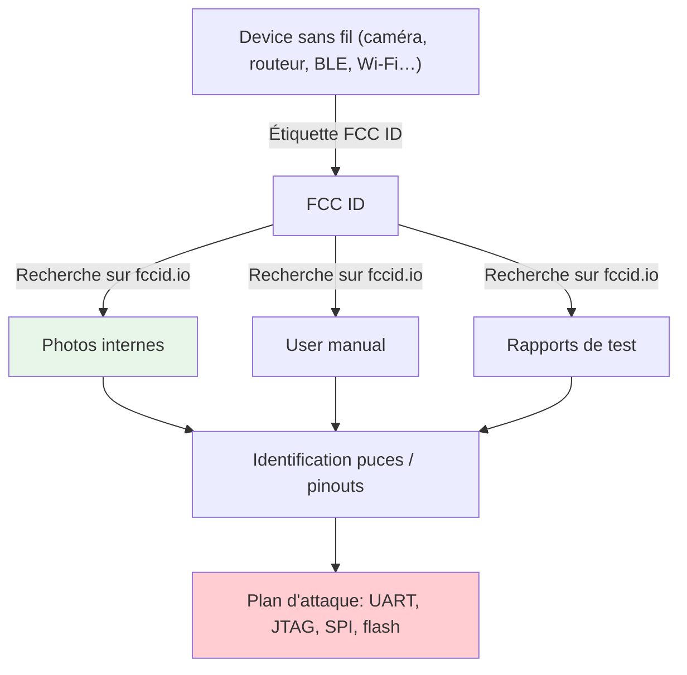
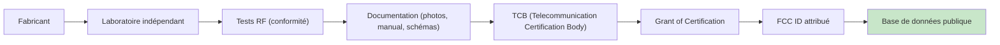
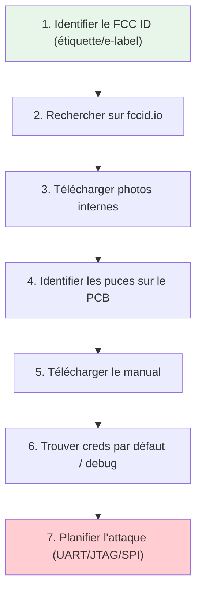
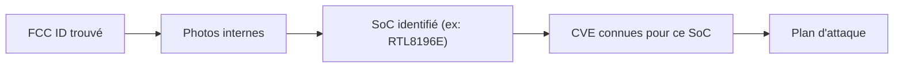
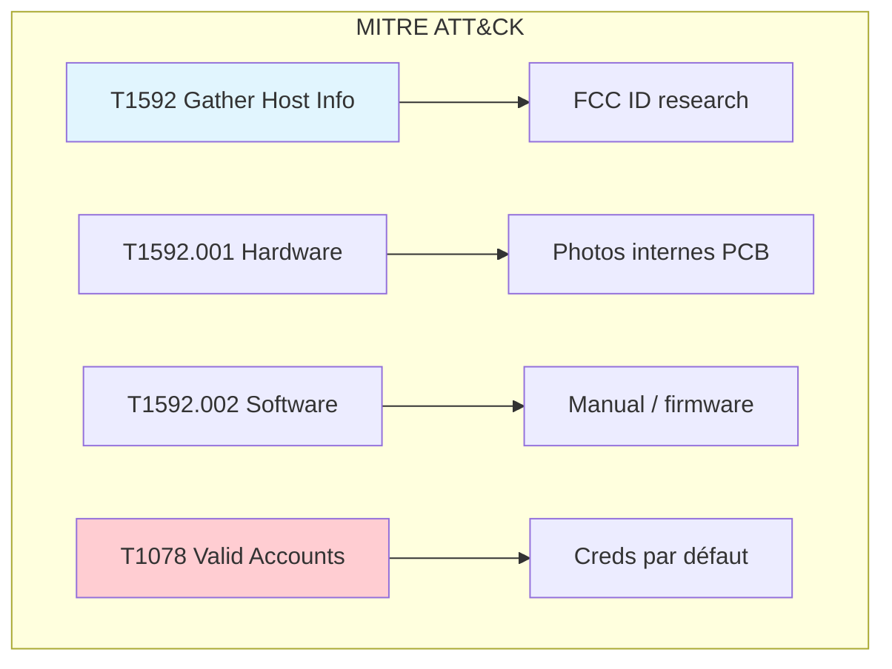
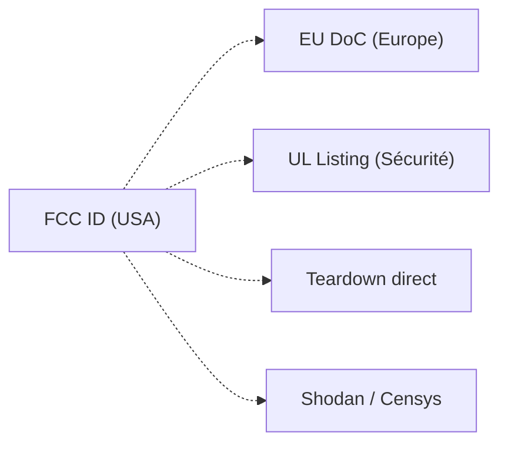

# 🛰️ Recherche FCC ID

> [!info] **En 1 phrase**
> Le **FCC ID** gravé sur tout device sans fil vendu aux USA est la **clé d'accès gratuite
> aux manuels, photos internes, tests et datasheets** — avant même d'ouvrir l'appareil.

---

## 🧾 Overview

| Champ | Valeur |
|---|---|
| **Type** | Technique / Outil de reconnaissance |
| **Domaine** | Hardware Hacking — Enumeration / Recon |
| **Niveau** | Beginner → Advanced |
| **OS cibles** | Tous (device sans fil vendu aux USA) |
| **Matériel requis** | PC, accès Internet, device avec étiquette FCC |
| **Complexité** | Faible |
| **Dernière mise à jour** | 2026-08-16 |

> [!info] 📊 **Diagramme de contexte**
> ```mermaid
> flowchart LR
>     A["Device sans fil"] --> B["Étiquette FCC ID"]
>     B --> C["fccid.io"]
>     C --> D["Photos internes"]
>     C --> E["User manual"]
>     C --> F["Rapports de test"]
>     D --> G["Plan d'attaque HW"]
>     style A fill:#e1f5fe
>     style G fill:#c8e6c9
> ```

---

## 🎯 Concept

> Le **Federal Communications Commission (FCC)** impose à tout fabricant vendant des dispositifs sans fil aux États-Unis de soumettre des documents détaillés : photos internes du PCB, manuels utilisateur, rapports de test RF, et schémas d'application. Ces documents sont **publics** et indexés par FCC ID. Un pentester peut les exploiter pour identifier les puces, repérer les interfaces de debug (UART, JTAG, SPI), trouver les mots de passe par défaut, et planifier une attaque — **sans jamais toucher au device**.



> [!info] 💡 **Ce qu'on peut obtenir sans rien démonter**
> - Les **photos internes** du PCB → identifier les puces, repérer l'UART/JTAG/SPI avant achat.
> - Le **user manual** → mots de passe par défaut, interface de debug, API cachées.
> - Les **rapports de test** → fréquences, puissance, certifications, parfois des infos hardware.
> - Le **grantee code** → lister tous les produits d'un fabricant (vulnérabilité partagée = N devices).

---

## 🧠 Concepts fondamentaux

### Qu'est-ce qu'un FCC ID

> Le **FCC ID** est un **identifiant unique** attribué à un appareil enregistré auprès de la
> **Federal Communications Commission** (États-Unis).

```text
Format : XXnnnnYYYYY
  ├─ 3 à 5 caractères  = Grantee Code  → identifie le fabricant
  │                      (attribué à l'entreprise)
  └─ reste             = Product Code   → identifie le modèle précis
```

- L'émission/la vente légale de dispositifs **sans fil** aux USA impose au fabricant :
  - une **évaluation par un laboratoire indépendant** (conformité aux normes FCC) ;
  - la **fourniture de la documentation** des résultats au FCC ;
  - la fourniture des **manuels utilisateur, documentation et photos** de l'appareil ;
  - le marquage **physique ou digital (e-label)** de l'identifiant unique fourni par la FCC.

> Ces exigences = des tonnes de données publiques exploitables pour le pentest.

### Types de dispositifs nécessitant un FCC ID

| Catégorie | Exemples | FCC ID requis |
|---|---|---|
| Wi-Fi (2.4/5/6 GHz) | Routeurs, AP, adaptateurs USB | Oui |
| Bluetooth / BLE | Claviers, enceintes, trackers | Oui |
| GSM / LTE / 5G | Téléphones, modules IoT, hotspots | Oui |
| Zigbee / Z-Wave | Devices domotiques | Oui |
| LoRa / Sigfox | Capteurs IoT longue portée | Oui |
| RFID / NFC | Lecteurs, tags passifs | Oui (si émetteur actif) |
| Filaire uniquement | Switches, câbles, chargeurs | Non (pas de FCC ID) |

> Le FCC ID ne couvre que les devices **sans fil** vendus aux USA : un device purement filaire n'en a pas.

### Processus de certification FCC



---

## 🔌 Matériel / Composants

### Outils principaux

| Outil | Type | Usage | Prix | Source |
|---|---|---|---|---|
| PC avec Internet | Ordinateur | Recherche FCC ID | — | — |
| navigateur web | Logiciel | Accès fccid.io | — | — |
| curl / wget | CLI | Scraping automatisé | — | Préinstallé |
| Python + requests | Script | Extraction de données | — | pip install requests |
| Loupe / microscope | Optique | Lecture étiquette petite | ~$10 | Amazon |

### Cibles typiques

| Catégorie | Exemples | FCC ID disponible | Documents utiles |
|---|---|---|---|
| Routeurs Wi-Fi | TP-Link, D-Link, Netgear | Oui | Internal Photos, Manual |
| IP Cameras | Hikvision, Dahua, Axis | Oui | Internal Photos, Manual |
| Modules Bluetooth | ESP32, nRF52, CC2540 | Oui | Internal Photos, Test Report |
| Smartphones | Samsung, Google, Xiaomi | Oui (e-label) | Internal Photos, Schematics |
| Modules GSM/LTE | SIM800, SIM900, Quectel | Oui | Internal Photos, Manual |
| IoT Hubs | SmartThings, Hubitat | Oui | Internal Photos, Manual |
| Imprimantes | HP, Canon, Brother | Oui | Internal Photos, Manual |

---

## 📝 Formats et structure du FCC ID

### Grantee Code

| Longueur | Exemple | Description |
|---|---|---|
| 3 caractères | `2AJ` | Plus ancien, fabricants établis |
| 4 caractères | `2AHE` | Intermédiaire |
| 5 caractères | `2AHG4` | Nouveau format (après 2010 environ) |

> Le **Grantee Code** permet de lister **tous les produits** d'un fabricant sur la base FCC.
> C'est la technique la plus puissante : si un device a une vulnérabilité, tous les devices
> du même fabricant avec la même plateforme partagent probablement la même faille.

### Product Code

| Format | Exemple | Description |
|---|---|---|
| Alphanumérique | `FCCID-2AJABC123` | `2AJ` = Grantee, `ABC123` = Product |
| Mixte | `FCCID-2AHG4RT56` | `2AHG4` = Grantee, `RT56` = Product |

### E-label (étiquette digitale)

Certains devices (smartphones, tablets) n'ont pas d'étiquette physique : le FCC ID est accessible via le **menu système** (Settings → About → Legal → Regulatory). Le FCC ID est identique à celui de l'étiquette physique.

---

## 🌐 Recherche dans la base FCC ID

### fccid.io — Outil principal

```text
Site principal : https://fccid.io/

1. Chercher le FCC ID trouvé sur l'étiquette (ou via "grantee" pour lister un fabricant)
2. Onglet "Internal Photos"  → photos du PCB, identification des puces
3. Onglet "Manual"           → manuel utilisateur (mots de passe, debug)
4. Onglet "Test Report"      → fréquences, bandes, puissance, antenna
5. Onglet "External Photos"  → photos de l'extérieur (label, forme)
6. Onglet "Label/Location"   → emplacement du label sur le device
```

```bash
# Automatisation simple : scraper la page du FCC ID avec curl
curl -s "https://fccid.io/<FCC_ID>" | grep -i -E "internal photos|manual|report"

# Rechercher par grantee code (tous les produits d'un fabricant)
curl -s "https://fccid.io/search?q=<GRANTEE_CODE>" | grep -o 'FCC ID: [A-Z0-9]*'
```

### FCC OET (Office of Engineering and Technology)

```text
Site officiel : https://apps.fcc.gov/oetcf/eas/reports/GenericSearch.cfm

Recherche avancée :
  - Grantee Code (3 ou 5 premiers caractères du FCC ID)
  - Equipment Class (DTS, NII, FDD, etc.)
  - Applicant Name (nom du fabricant)
  - TCB Scope (portée du laboratoire certification)

Résultats :
  - Grant of Certification (autorisation)
  - Equipment Class (classe du dispositif)
  - Date of Grant (date d'autorisation)
  - Regulations (règles applicables : Part 15, Part 22, etc.)
```

### Autres bases de données

| Site | Usage | Avantage |
|---|---|---|
| [fccid.io](https://fccid.io) | Recherche FCC ID complète | Interface moderne, photos |
| [fcc.gov/oet](https://www.fcc.gov/oet/ea/fccid) | Recherche officielle FCC | Données source |
| [fccapps.com](https://fccapps.com) | Recherche par modèle | Recherche croisée |
| [ul.com](https://ul.com) | UL listing search | Certification sécurité |
| [fcc.report](https://fcc.report) | Données FCC formatées | API possible |

---

## 🔍 Techniques de recherche avancées

### Recherche par grantee code

Le grantee code est la clé pour trouver **tous les devices** d'un fabricant. Utile pour identifier des plateformes partagées.

```bash
# Exemple : fabricant avec grantee code "2AJ"
# Rechercher tous ses devices :
curl -s "https://fccid.io/2AJ" | grep -oE 'FCC ID: [A-Z0-9]+' | sort -u

# Sur le site officiel FCC :
# https://apps.fcc.gov/oetcf/eas/reports/GenericSearch.cfm
# → Grantee Code: 2AJ
# → Recherche → Liste de tous les grants
```

### Recherche par fréquence

```bash
# Sur fccid.io : recherche par plage de fréquence
# Exemple : trouver tous les devices Bluetooth (2.4 GHz)
curl -s "https://fccid.io/search?q=2400+MHz" | grep -i bluetooth

# Sur le site FCC : recherche par Equipment Class
# DTS = Digital Transmission System (Wi-Fi, Bluetooth)
# NII = Unlicensed National Information Infrastructure (Wi-Fi 5 GHz)
```

### Recherche par modèle

```bash
# Rechercher un modèle spécifique
curl -s "https://fccid.io/search?q=<MODELE>" | head -20

# Exemple : rechercher tous les devices "Archer"
curl -s "https://fccid.io/search?q=Archer" | grep -oE 'FCC ID: [A-Z0-9]+'
```

### Extraction automatique des données

```python
#!/usr/bin/env python3
"""Extraction automatique des données FCC pour un device."""

import requests
import re
import sys

def get_fcc_data(fcc_id):
    """Récupérer les informations d'un FCC ID depuis fccid.io."""
    url = f"https://fccid.io/{fcc_id}"
    headers = {"User-Agent": "Mozilla/5.0 (compatible; FCC-Research/1.0)"}
    response = requests.get(url, headers=headers)

    if response.status_code != 200:
        print(f"[-] Impossible d'accéder à {url}")
        return None

    data = {
        "fcc_id": fcc_id,
        "url": url,
        "has_internal_photos": "Internal Photos" in response.text,
        "has_manual": "Manual" in response.text,
        "has_test_report": "Test Report" in response.text,
        "has_external_photos": "External Photos" in response.text,
    }

    # Extraire le grantee code
    match = re.search(r'Grantee Code:\s*([A-Z0-9]+)', response.text)
    if match:
        data["grantee_code"] = match.group(1)

    return data

def list_grantee_devices(grantee_code):
    """Lister tous les devices d'un grantee code."""
    url = f"https://fccid.io/{grantee_code}"
    headers = {"User-Agent": "Mozilla/5.0 (compatible; FCC-Research/1.0)"}
    response = requests.get(url, headers=headers)

    fcc_ids = re.findall(r'FCC ID:\s*([A-Z0-9]+)', response.text)
    return list(set(fcc_ids))

if __name__ == "__main__":
    if len(sys.argv) < 2:
        print(f"Usage: {sys.argv[0]} <FCC_ID>")
        sys.exit(1)

    fcc_id = sys.argv[1]
    data = get_fcc_data(fcc_id)
    if data:
        print(f"[*] FCC ID: {data['fcc_id']}")
        print(f"[*] URL: {data['url']}")
        print(f"[*] Internal Photos: {data['has_internal_photos']}")
        print(f"[*] Manual: {data['has_manual']}")
        print(f"[*] Test Report: {data['has_test_report']}")
```

---

## ⚙️ Configuration

### Outils de recherche

| Outil | Type | Usage | Lien |
|---|---|---|---|
| fccid.io | Web | Recherche FCC ID complète | fccid.io |
| FCC OET | Web | Recherche officielle FCC | fcc.gov/oet |
| curl | CLI | Scraping automatisé | Préinstallé |
| Python + requests | Script | Extraction de données | pip install requests |
| Wireshark | Desktop | Analyse des rapports de test RF | wireshark.org |

### Sites de référence pour les photos internes

| Section | Contenu utile pour le pentest |
|---|---|
| **Internal Photos** | Photos du PCB → identification des puces, interfaces UART/JTAG/SPI |
| **External Photos** | Forme du device, emplacement des ports, type d'antenne |
| **Manual** | Mots de passe par défaut, modes de debug, API cachées |
| **Test Report** | Fréquences supportées, puissance TX, sensibilité RX |
| **Label/Location** | Emplacement de l'étiquette (utile pour trouver le FCC ID) |
| **Schematics** | Schéma électronique (parfois disponible, très rare) |

---

## 🧪 Exemples pratiques

### 🟢 Débutant — Trouver le FCC ID d'un device

```bash
# Méthode 1 : Étiquette physique
# Chercher une étiquette sur le device (souvent au dos ou sous le boîtier)
# Format : FCC ID: XXXXXXXXX

# Méthode 2 : E-label (smartphones)
# Android : Settings → About phone → Legal → Regulatory
# iOS : Settings → General → About → Legal → Regulatory

# Méthode 3 : Manuel utilisateur
# Chercher "FCC" ou "FCC ID" dans le PDF du manuel

# Méthode 4 : Recherche par modèle sur fccid.io
# https://fccid.io/search?q=<MODELE>
```

### 🟡 Intermédiaire — Analyse complète d'un device via FCC

```bash
# Étape 1 : Trouver le FCC ID (sur l'étiquette ou via recherche)
FCC_ID="2AJGBFRT56"

# Étape 2 : Accéder à fccid.io
curl -s "https://fccid.io/$FCC_ID" | grep -i "internal\|manual\|test"

# Étape 3 : Vérifier les photos internes
# Ouvrir https://fccid.io/$FCC_ID dans le navigateur
# → Onglet "Internal Photos" → télécharger les photos du PCB

# Étape 4 : Identifier les puces sur les photos
# → Utiliser Google Dork : filetype:pdf <référence_puce>

# Étape 5 : Vérifier le manuel
# Onglet "Manual" → télécharger le PDF
# → Chercher les mots de passe par défaut, les modes de debug
```

### 🔴 Avancé — Script d'exploration automatique

```python
#!/usr/bin/env python3
"""Exploration automatique de devices via FCC ID."""

import requests
import re
import json
import sys

def search_fcc(query):
    """Rechercher des FCC IDs par mot-clé."""
    url = f"https://fccid.io/search?q={query}"
    headers = {"User-Agent": "Mozilla/5.0"}
    response = requests.get(url, headers=headers)
    fcc_ids = re.findall(r'/([A-Z0-9]{5,15})', response.text)
    return list(set(fcc_ids))[:10]

def get_device_info(fcc_id):
    """Extraire les informations d'un device."""
    url = f"https://fccid.io/{fcc_id}"
    headers = {"User-Agent": "Mozilla/5.0"}
    response = requests.get(url, headers=headers)

    info = {"fcc_id": fcc_id}
    sections = ["Internal Photos", "Manual", "Test Report",
                 "External Photos", "Label/Location"]

    for section in sections:
        info[section.lower().replace(" ", "_")] = section in response.text

    return info

def batch_analysis(fcc_ids):
    """Analyser plusieurs FCC IDs."""
    results = []
    for fcc_id in fcc_ids:
        info = get_device_info(fcc_id)
        results.append(info)
        print(f"[+] {fcc_id}: Internal={info.get('internal_photos', False)}")
    return results

if __name__ == "__main__":
    if len(sys.argv) < 2:
        print(f"Usage: {sys.argv[0]} <query|fcc_id>")
        sys.exit(1)

    query = sys.argv[1]
    if len(query) > 10:
        # FCC ID direct
        info = get_device_info(query)
        print(json.dumps(info, indent=2))
    else:
        # Recherche par mot-clé
        ids = search_fcc(query)
        print(f"[*] {len(ids)} FCC IDs trouvés")
        batch_analysis(ids)
```

### ⚫ Expert — Cross-référencement avec d'autres bases

```python
#!/usr/bin/env python3
"""Cross-référencement FCC ID + Identification de puces."""

import requests
import re

def fcc_to_pcb_analysis(fcc_id):
    """Analyser un FCC ID et identifier les puces potentielles."""
    url = f"https://fccid.io/{fcc_id}"
    headers = {"User-Agent": "Mozilla/5.0"}
    response = requests.get(url, headers=headers)

    results = {
        "fcc_id": fcc_id,
        "has_internal_photos": "Internal Photos" in response.text,
        "has_manual": "Manual" in response.text,
        "potential_chips": [],
        "recommended_actions": []
    }

    if results["has_internal_photos"]:
        results["recommended_actions"].append(
            "Télécharger les photos internes pour identification des puces"
        )
        results["recommended_actions"].append(
            "Utiliser Google Dork: filetype:pdf <chip_reference> datasheet"
        )

    if results["has_manual"]:
        results["recommended_actions"].append(
            "Vérifier le manual pour mots de passe par défaut"
        )
        results["recommended_actions"].append(
            "Chercher les modes de debug (UART, JTAG) dans la documentation"
        )

    return results

if __name__ == "__main__":
    import sys
    if len(sys.argv) > 1:
        result = fcc_to_pcb_analysis(sys.argv[1])
        for action in result["recommended_actions"]:
            print(f"  → {action}")
```

---

## 🧪 Workflow complet (scénario pas à pas)



### Étape 1 — Identification du FCC ID

| Action | Méthode | Difficulté |
|---|---|---|
| Étiquette physique | Lire le label au dos du device | Faible |
| E-label | Menu système du téléphone | Faible |
| Manuel | Chercher "FCC" dans le PDF | Faible |
| Recherche modèle | fccid.io/search?q=<modele> | Faible |

### Étape 2 — Recherche sur fccid.io

| Action | Résultat |
|---|---|
| Ouvrir fccid.io | Page d'accueil avec recherche |
| Entrer le FCC ID | Page du device avec tous les documents |
| Vérifier les sections disponibles | Photos, manual, rapports, label |

### Étape 3 — Analyse des photos internes

| Action | Objectif |
|---|---|
| Télécharger les photos | Avoir les images en haute résolution |
| Identifier les puces | SoC, mémoire flash, régulateurs |
| Repérer UART/JTAG/SPI | Broches de debug visibles sur le PCB |
| Noter les references | U1, U2, J1, etc. sur le PCB |

### Étape 4 — Analyse du manual

| Action | Objectif |
|---|---|
| Télécharger le PDF | Lire la documentation complète |
| Chercher les mots de passe | Creds par défaut |
| Chercher les modes de debug | UART, JTAG, console |
| Chercher les API cachées | Endpoints non documentés |

---

## 🎬 Scénarios avancés

### Scénario 1 — Audit d'un routeur via FCC ID (sans le posséder)

| Élément | Détail |
|---|---|
| **Objectif** | Identifier les vulnérabilités d'un routeur avant l'achat |
| **Matériel** | PC, accès Internet |
| **Étapes** | 1. Trouver FCC ID 2. Photos internes → identifier SoC 3. Manual → creds par défaut 4. Test Report → fréquences 5. Plan d'attaque |
| **Résultat** | Liste de vulnérabilités potentielles sans toucher au device |
| **Difficulté** | ⭐⭐ |



### Scénario 2 — Plateforme partagée (N devices, même vulnérabilité)

| Élément | Détail |
|---|---|
| **Objectif** | Identifier tous les devices partageant la même plateforme |
| **Matériel** | PC, accès Internet |
| **Étapes** | 1. Trouver grantee code 2. Lister tous les FCC IDs du fabricant 3. Comparer les SoC 4. Identifier les plateformes communes |
| **Résultat** | Liste de devices avec la même vulnérabilité |
| **Difficulté** | ⭐⭐⭐ |

---

## 🛡️ Cybersecurity use cases

| Use case | Sévérité | Matériel requis | Impact |
|---|---|---|---|
| Reconnaissance pré-attaque | Moyenne | PC | Identification des cibles |
| Identification de puces | Faible | PC | Pinout, protocoles, tensions |
| Trouver creds par défaut | Haute | PC | Accès initial potentiel |
| Audit sans possession | Moyenne | PC | Évaluation à distance |

| Phase pentest | Ce que permet cette technique |
|---|---|
| Recon | Identification du hardware sans accès physique |
| Accès initial | Trouver creds par défaut dans le manual |
| Énumération | Identifier les interfaces de debug |
| Escalade | Utiliser les interfaces pour obtenir un shell |

---

## 🎯 MITRE ATT&CK

| Technique ID | Nom | Catégorie | Applicabilité |
|---|---|---|---|
| T1592 | Gather Victim Host Information | Reconnaissance | Collecte d'informations via FCC ID |
| T1592.002 | Gather Victim Host Information: Software | Reconnaissance | Identification du firmware via manual |
| T1592.001 | Gather Victim Host Information: Hardware | Reconnaissance | Identification des puces via photos internes |
| T1078 | Valid Accounts | Initial Access | Creds par défaut trouvés dans le manual |



### Mapping détaillé

| Phase MITRE | Technique | Cette fiche couvre |
|---|---|---|
| Reconnaissance | T1592 | Collecte d'informations sur le hardware via FCC |
| Reconnaissance | T1592.001 | Identification des puces via photos internes |
| Reconnaissance | T1592.002 | Extraction des infos firmware via manual |
| Initial Access | T1078 | Utilisation des creds par défaut trouvés |

---

## 🛡️ Defensive Security

### Détection

| Signal de détection | Source | Fiabilité |
|---|---|---|
| Recherche FCC ID par un concurrent | Logs web analytics | Faible |
| Scraping de fccid.io | Logs serveur | Faible |
| Analyse des photos internes | Non détectable | — |

> La recherche FCC ID est une activité **passive** : elle exploite des données **publiques** et ne génère aucun signal de détection côté cible.

### Prévention

| Mesure | Efficacité | Coût | Priorité |
|---|---|---|---|
| Ne pas vendre aux USA | Élevée | Élevée (perte de marché) | Faible |
| Minimiser les documents soumis | Faible | Faible | Faible |
| Changer les creds par défaut | Élevée | Faible | Haute |
| Désactiver les interfaces de debug | Élevée | Faible | Haute |
| Obfuscation des marquages | Moyenne | Faible | Moyenne |

### Durcissement (hardening)

```bash
# Recommandations pour les fabricants :
# 1. Forcer le changement de mot de passe au premier boot
# 2. Désactiver les interfaces UART/JTAG en production
# 3. Utiliser des credentials uniques par device (label ou app)
# 4. Limiter la documentation soumise au minimum requis
# 5. Ne pas inclure de mots de passe dans le manual public
```

---

## 🤖 Automatisation

### Scripts d'exploitation

```python
#!/usr/bin/env python3
"""Automatisation de la recherche FCC ID pour un parc de devices."""

import requests
import re
import csv

def bulk_fcc_lookup(fcc_ids):
    """Lookup en masse de FCC IDs."""
    results = []
    for fcc_id in fcc_ids:
        url = f"https://fccid.io/{fcc_id}"
        headers = {"User-Agent": "Mozilla/5.0"}
        try:
            resp = requests.get(url, headers=headers, timeout=10)
            has_photos = "Internal Photos" in resp.text
            has_manual = "Manual" in resp.text
            results.append({
                "fcc_id": fcc_id,
                "internal_photos": has_photos,
                "manual": has_manual
            })
        except requests.RequestException:
            results.append({"fcc_id": fcc_id, "error": True})
    return results

def export_to_csv(results, filename="fcc_results.csv"):
    """Exporter les résultats en CSV."""
    with open(filename, 'w', newline='') as f:
        writer = csv.DictWriter(f, fieldnames=results[0].keys())
        writer.writeheader()
        writer.writerows(results)

if __name__ == "__main__":
    ids = ["2AJGBFRT56", "2AHG4RT56", "RX3-12345"]
    results = bulk_fcc_lookup(ids)
    export_to_csv(results)
    print(f"[+] {len(results)} devices analysés, résultats dans fcc_results.csv")
```

### Outils d'automatisation

| Outil | Usage | Lien |
|---|---|---|
| Python + requests | Scraping automatisé | pip install requests |
| curl | Requêtes HTTP simples | Préinstallé |
| wget | Téléchargement de fichiers | Préinstallé |
| Burp Suite | Analyse de traffic web | portswigger.net |

### Intégration dans des frameworks

| Framework | Méthode d'intégration |
|---|---|
| Recon-ng | Module custom pour FCC ID lookup |
| SpiderFoot | Source d'intelligence open source |
| Maltego | Transform pour FCC ID → documents |

---

## 📤 Output et parsing

### Formats de sortie

| Format | Exemple | Utilité |
|---|---|---|
| HTML | Page fccid.io | Lecture humaine |
| JSON | Script Python → JSON | Parsing automatisé |
| CSV | Export batch | Rapport |
| PDF | Manual téléchargé | Documentation offline |

### Parsing des résultats

```bash
# Extraire les liens vers les photos internes
curl -s "https://fccid.io/<FCC_ID>" | grep -o 'href="[^"]*internal[^"]*"'

# Extraire le lien vers le manual
curl -s "https://fccid.io/<FCC_ID>" | grep -o 'href="[^"]*manual[^"]*"'

# Extraire les informations du Test Report
curl -s "https://fccid.io/<FCC_ID>" | grep -i "test report" | head -5
```

### Intégration SIEM / Logging

| Source | Format | Pipeline |
|---|---|---|
| fccid.io | HTML | Parse → JSON → SIEM |
| FCC OET | XML/CSV | Import → Asset management |
| Photos PCB | JPEG/PNG | Stockage → Analyse manuelle |

---

## 🔗 Intégrations

- [[13 - Hardware & IoT|⚙️ Hardware & IoT]] global
- [[Hardware - Identification de puces|🔬 Identification de puces]] — Identifier les composants sur les photos
- [[Hardware - Mots de passe par défaut IoT|🔑 Creds par défaut]] — Utiliser les creds trouvés dans le manual
- [[Hardware - SDR|📡 SDR]] — Analyser les fréquences du device

| Outils associés | Usage complémentaire |
|---|---|
| fccid.io | Recherche FCC ID principale |
| Google Dorks | Recherche de datasheets pour les puces identifiées |
| SMD codebook | Décoder les marquages courts des puces |
| Nmap | Scanner les services après identification |

| Intégration | Comment |
|---|---|
| Google Dorks | `filetype:pdf <chip_reference> datasheet` |
| SMD codebook | Identifier les puces via les marquages courts |
| Recon-ng | Module automatisé pour FCC lookup |

---

## 🔄 Alternatives

| Alternative | Avantages | Inconvénients | Cas d'usage |
|---|---|---|---|
| EU Declaration of Conformity | Europe, pas besoin de FCC ID | Moins de documents | Devices EU uniquement |
| UL Listing | Certification sécurité | Moins de photos HW | Safety cert |
| Teardown direct | Accès physique complet | Nécessite le device | Analyse forensique |
| Shodan/Censys | Discovery réseau | Pas d'info HW interne | Enumeration réseau |
| FCC ID (cette technique) | Gratuit, complet, légal | USA uniquement | Recon avant achat |



---

## ⚡ Performance

| Métrique | Valeur | Impact |
|---|---|---|
| Temps de recherche | 10–30 secondes | Très rapide |
| Accès aux photos | Immédiat (après téléchargement) | Gratuit |
| Couverture USA | ~100% des devices sans fil | Excellente |
| Couverture EU | Via EU DoC (séparé) | Bonne |
| Fiabilité des docs | Officielle (FCC) | Très élevée |

### Optimisations

| Technique | Gain | Complexité |
|---|---|---|
| Batch lookup (Python) | ×10–50 | Moyenne |
| Cache local des résultats | Évite les re-téléchargements | Faible |
| Cross-référencement grantee | Trouve les plateformes partagées | Faible |

---

## 🛠️ Troubleshooting

| Problème | Cause probable | Solution |
|---|---|---|
| FCC ID non trouvé | Device non vendu aux USA | Chercher EU DoC ou teardown |
| Photos non disponibles | Pas de section Internal Photos | Vérifier d'autres sources (Teardown) |
| Manual non trouvé | Document non soumis | Chercher sur le site du fabricant |
| fccid.io timeout | Serveur surchargé | Réessayer ou utiliser FCC OET |
| E-label introuvable | Device sans écran | Vérifier l'étiquette physique |

### Erreurs courantes

```
Erreur : "FCC ID not found"
Cause : Le device n'a pas de FCC ID (non vendu aux USA, ou filaire)
Solution : Chercher le FCC ID sur l'étiquette ou dans le manual

Erreur : "Internal Photos not available"
Cause : Le fabricant n'a pas soumis de photos internes
Solution : Vérifier d'autres sources (teardown sites, FCC OET)

Erreur : "Connection timeout"
Cause : fccid.io temporairement indisponible
Solution : Réessayer plus tard ou utiliser apps.fcc.gov
```

### Diagnostic

```bash
# Vérifier l'accès à fccid.io
curl -s -o /dev/null -w "%{http_code}" https://fccid.io/

# Vérifier si le FCC ID existe sur le site officiel
curl -s "https://apps.fcc.gov/oetcf/eas/reports/GenericSearch.cfm" | grep -i "no results"

# Tester la connectivité générale
ping -c 3 fccid.io
```

---

## 🔐 Sécurité

| Risque | Impact | Mitigation |
|---|---|---|
| Exposition des photos internes | Identification des puces | Minimiser les docs soumises |
| Credentials par défaut exposés | Accès initial | Changer les creds au 1er boot |
| Interfaces de debug exposées | Accès UART/JTAG | Désactiver en production |
| Grantee code exploitable | Tous les devices compromis | Plateformes uniques par device |

> [!warning] Points de sécurité
> - Les documents FCC sont **publics** et ne peuvent pas être supprimés
> - Le grantee code expose **tous les produits** d'un fabricant
> - Les photos internes sont souvent en **haute résolution** (identification facile des puces)
> - Le manual contient souvent les **mots de passe par défaut** en texte clair

### Restrictions légales

> [!danger] Cadre légal
> La recherche d'informations dans la base FCC est **entièrement légale** : il s'agit de données **publiques** rendues obligatoires par la réglementation américaine. Cependant, l'utilisation de ces informations pour accéder à des systèmes sans autorisation est illégale. Cette technique est un outil de **reconnaissance légale** dans le cadre d'un pentest autorisé.

---

## ⚠️ Limitations

| Limite | Impact | Contournement |
|---|---|---|
| USA uniquement (FCC) | Pas de docs pour devices EU/Asie | EU DoC, teardown sites |
| Devices filaires | Pas de FCC ID | Autre technique (label, teardown) |
| Photos parfois floues | Identification difficile | Zoom, Google Dicks |
| Manual parfois incomplet | Creds non listés | Autre wordlist (Mirai) |
| Pas de schémas électroniques | Rarement soumis | Teardown direct |

### Cas où cette technique ne fonctionne pas

| Scénario | Raison |
|---|---|
| Device filaire uniquement | Pas de FCC ID |
| Device non vendu aux USA | Pas de FCC ID |
| Device très ancien (>20 ans) | Pas encore de FCC ID |
| Device contrefait | FCC ID invalide ou falsifié |
| E-label masqué | Le menu est inaccessible |

---

## 📋 Cheatsheet

```
┌─────────────────────────────────────────────────────────────────┐
│ Recherche FCC ID — Cheatsheet                                   │
├─────────────────────────────────────────────────────────────────┤
│ Trouver FCC ID :  Étiquette physique / E-label / Manual         │
│ Recherche :       https://fccid.io/<FCC_ID>                    │
│ Photos internes : Onglet "Internal Photos"                     │
│ Manual :          Onglet "Manual"                               │
│ Test Report :     Onglet "Test Report"                         │
│ Grantee lookup :  https://fccid.io/<GRANTEE>                   │
│ FCC officiel :    https://apps.fcc.gov/oetcf/eas/              │
│ Cross-ref :       Google Dork filetype:pdf <puceref>           │
│ Curl rapide :     curl -s fccid.io/<ID> | grep internal        │
└─────────────────────────────────────────────────────────────────┘
```

| Action | Commande / URL |
|---|---|
| Trouver FCC ID | Étiquette physique → `FCC ID: XXXXXXXXX` |
| Rechercher | `https://fccid.io/<FCC_ID>` |
| Photos internes | Onglet "Internal Photos" → Download |
| Manual | Onglet "Manual" → Download PDF |
| Test Report | Onglet "Test Report" → Download |
| Grantee code | `https://fccid.io/<GRANTEE_CODE>` |
| FCC officiel | `https://apps.fcc.gov/oetcf/eas/reports/GenericSearch.cfm` |

---

## ⚡ Quick reference

| Élément | Valeur / Commande |
|---|---|
| **Fonction** | Reconnaissance hardware via base FCC publique |
| **Site principal** | https://fccid.io |
| **Site officiel** | https://apps.fcc.gov/oetcf/eas/ |
| **Trouver FCC ID** | Étiquette physique / E-label / Manual |
| **Grantee Code** | 3–5 premiers caractères du FCC ID |
| **Documents utiles** | Internal Photos, Manual, Test Report |
| **Commande rapide** | `curl -s fccid.io/<FCC_ID> \| grep internal` |

---

## 🔍 Détection & Défense

| Signal | Méthode de détection | Outil |
|---|---|---|
| Recherche FCC ID | Non détectable (données publiques) | — |
| Scraping automatisé | Logs serveur (fccid.io) | Web analytics |
| Analyse photos | Non détectable | — |

| Countermeasure | Efficacité | Implémentation |
|---|---|---|
| Changer creds par défaut | Élevée | Firmware config |
| Désactiver UART/JTAG | Élevée | Hardware design |
| Minimiser docs FCC | Faible | Procédure de soumission |
| Obfuscation marquages | Moyenne | Physical design |

> [!tip] Défense
> La seule défense efficace contre la recon via FCC ID est de **minimiser les informations exposées** dans les documents soumis et de **changer tous les credentials par défaut**. Les interfaces de debug (UART, JTAG) doivent être **désactivées en production**. Le FCC ID reste une faille structurelle du modèle de certification : il est impossible de vendre légalement aux USA sans exposer ces informations.

---

## ⚠️ Tips & Pièges

- Le **Grantee Code** permet de lister **tous les produits** d'un fabricant → repérer la même plateforme réutilisée sur plusieurs devices (une vuln = N devices).
- Vérifie la **date** des photos/test report : un vieux rapport peut ne pas refléter le hardware final.
- Le **e-label** (étiquette digitale) est aussi sur fccid.io → même ID que l'étiquette physique.
- Le FCC ID ne couvre que les devices **sans fil** vendus aux USA : un device purement filaire n'en a pas.
- Combine toujours avec l'**identification des puces** : les photos internes FCC complètent le datasheet du SoC.
- Les **photos internes** sont souvent en haute résolution → zoomer pour lire les marquages des puces.
- Le **manual** contient parfois des informations sur les **modes de debug** (UART, JTAG, console sérié).
- Le **test report** révèle les **fréquences exactes** supportées → utile pour les tests RF.

> [!tip] Astuces
> - Le **grantee code** est la technique la plus puissante : il expose tous les devices d'un fabricant
> - Chercher toujours les **photos internes** en premier : c'est là que se trouvent les infos HW
> - Le **manual** est la deuxième priorité : creds par défaut et modes de debug
> - Cross-référencer avec **Google Dorks** pour trouver les datasheets des puces identifiées

---

## 📚 References

> [!info] 📚 **Sources**
> - [HardwareAllTheThings — FCC ID](https://github.com/swisskyrepo/HardwareAllTheThings/blob/main/docs/enumeration/fcc-id.md)
> - [FCC OET Equipment Authorization](https://www.fcc.gov/oet/ea/fccid)
> - [fccid.io — FCC ID Search](https://fccid.io)
> - [FCC KDB — Grantee Code Information](https://www.fcc.gov/oet/ea/fccid)
> - [FCC Equipment Authorization Process](https://www.fcc.gov/engineering-technology/laboratory-division/general/equipment-authorization)

### Documentation officielle

| Source | URL | Type |
|---|---|---|
| FCC OET | https://www.fcc.gov/oet/ea/fccid | Base officielle |
| fccid.io | https://fccid.io | Interface améliorée |
| FCC KDB | https://www.fcc.gov/oet/kdb | Documentation technique |
| FCC Equipment Authorization | https://www.fcc.gov/oet/ea | Processus de certification |

### Vidéos / Tutorials

| Titre | Auteur | Lien |
|---|---|---|
| HardwareAllTheThings FCC ID | SwisskyRepo | https://github.com/swisskyrepo/HardwareAllTheThings |
| FCC ID Lookup Tutorial | YouTube | Divers tutos hardware hacking |

### Livres / Articles

| Titre | Auteur | Année |
|---|---|---|
| The Hardware Hacking Handbook | Jasper van Woudenberg | 2021 |
| Practical IoT Hacking | Fotios Chantzis | 2021 |

➡️ **Liens :** [[13 - Hardware & IoT|⚙️ Hardware & IoT]] · [[Hardware - Identification de puces|🔬 Identification de puces]] · [[Hardware - Mots de passe par défaut IoT|🔑 Creds par défaut]] · [[Hardware - SDR|📡 SDR]]
