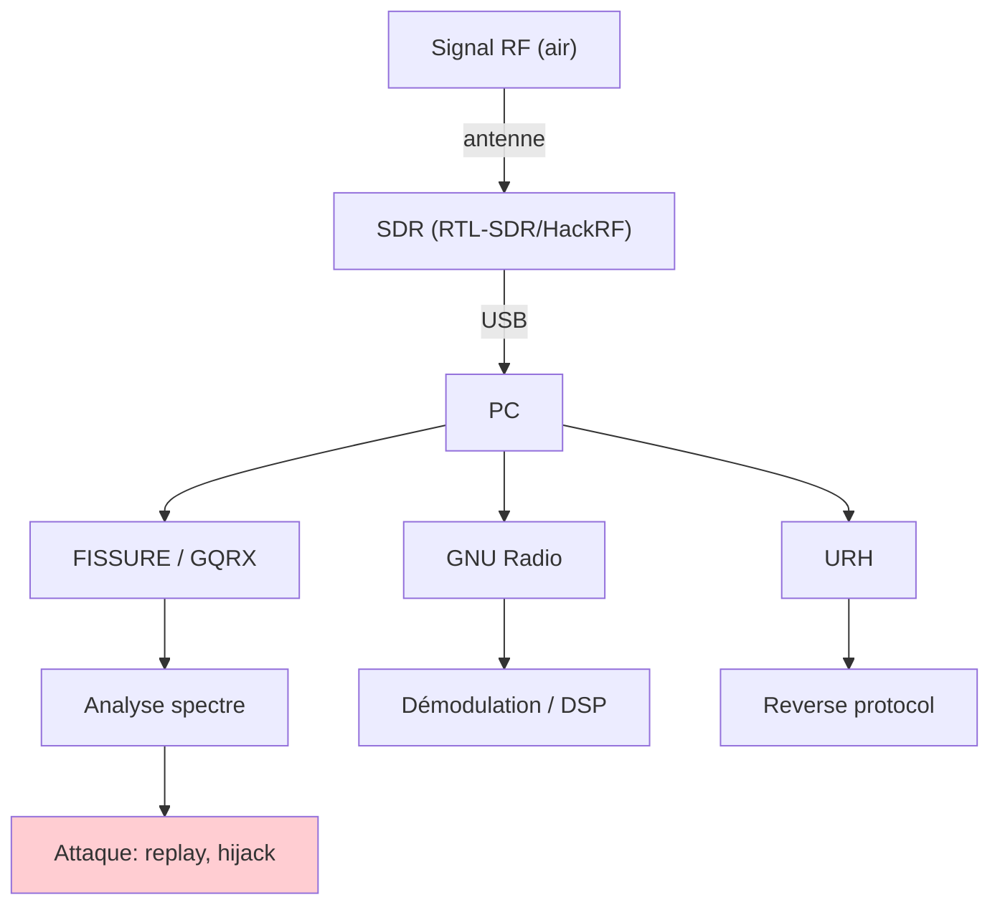
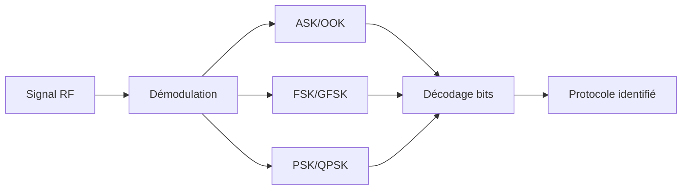
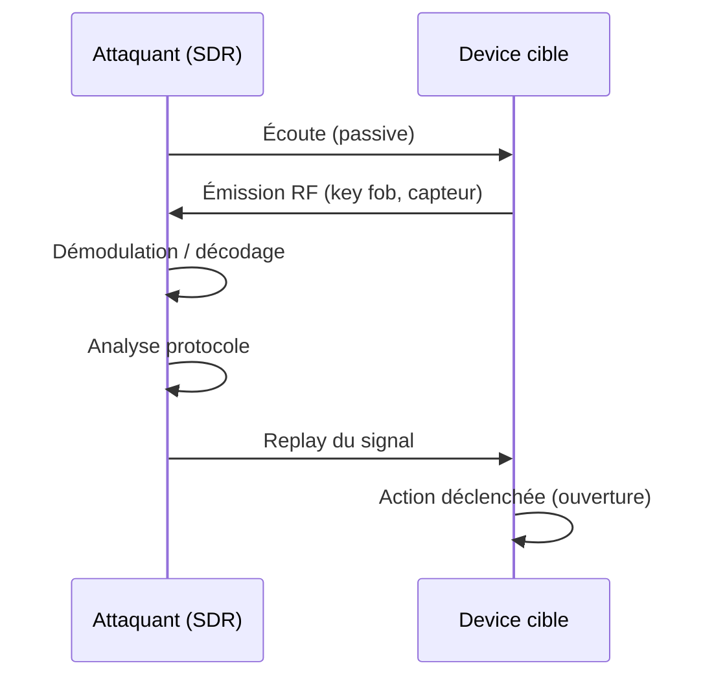
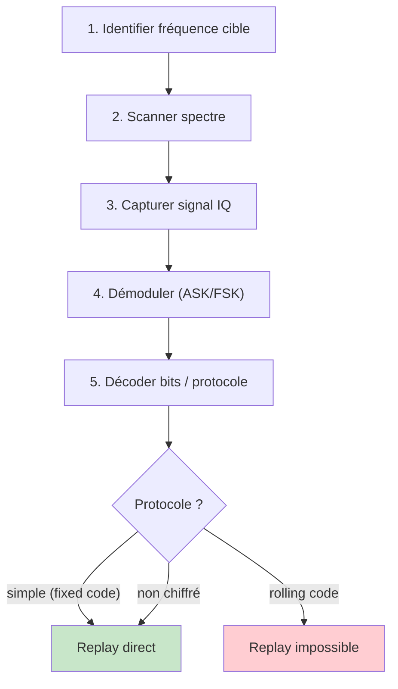
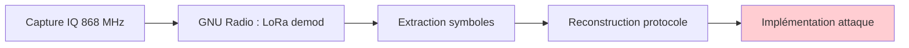
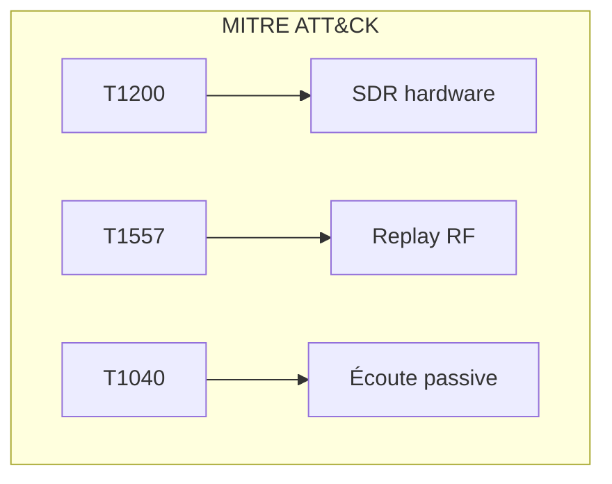

# SDR (Radio Logicielle)

> [!info] **En 1 phrase**
> La **Software Defined Radio** transforme un PC en récepteur/émetteur radio complet
> (HackRF, RTL-SDR) — pour écouter, analyser et attaquer **toutes les liaisons RF** des IoT.

---

## Overview

| Champ | Valeur |
|---|---|
| **Type** | Périphérique radio logiciel (récepteur + émetteur) |
| **Domaine** | RF Security / Hardware Hacking |
| **Niveau** | Débutant → Expert |
| **OS cibles** | Tous (Linux recommandé pour outils RF) |
| **Matériel requis** | RTL-SDR (~30€) ou HackRF (~300€), antenne |
| **Complexité** | Faible (écoute) → Élevée (reverse protocol RF) |
| **Dernière mise à jour** | 2024-03-15 |

> [!info] **Diagramme de contexte**
> ```mermaid
> flowchart LR
>     ANT["Antenne + SDR"] -->|"USB"| PC["PC"]
>     PC --> FISSURE["FISSURE"]
>     PC --> GQRX["GQRX / SDR#"]
>     PC --> URH["Universal Radio Hacker"]
>     PC --> GR["GNU Radio"]
>     FISSURE --> ANALYSE["Analyse RF"]
>     GQRX --> ANALYSE
>     URH --> EXPLOIT["Replay / Hijack"]
>     GR --> DEMOD["Démodulation DSP"]
>     style ANT fill:#e1f5fe
>     style EXPLOIT fill:#ffcdd2
> ```

---

## Concept

> La SDR remplace le traitement hardware du signal par du logiciel. Cela permet d'écouter n'importe quelle fréquence (dans la plage de l'hardware) et de décoder n'importe quel protocole RF : key fobs, capteurs, radios, GSM, ADS-B...



> [!info] **Ce qu'on peut écouter/attaquer**
> - **Key fobs** (voiture, garage) → replay/hijack 433/868 MHz
> - **Pagers POCSAG**, radios PMR, talkies-walkies
> - **GSM/2G** (LimeSDR), ADS-B (avions), GPS, LoRa, Zigbee
> - **Sonneries/infrarouge** et protocoles non chiffrés

---

## Concepts fondamentaux

### Fréquences RF courantes

| Bande | Fréquence | Usage |
|---|---|---|
| HF | 3–30 MHz | Radioamateur, SWL |
| VHF | 30–300 MHz | FM radio, PMR, aviation |
| UHF | 300 MHz–3 GHz | TV, GSM, WiFi, Bluetooth |
| ISM 315 MHz | 315 MHz | Key fobs (US) |
| ISM 433 MHz | 433.92 MHz | Key fobs, capteurs, LoRa |
| ISM 868 MHz | 868 MHz | Key fobs, IoT (EU) |
| ISM 915 MHz | 915 MHz | IoT (US), LoRa |
| 2.4 GHz | 2.4 GHz | WiFi, BLE, Zigbee |

### Modulations RF

| Modulation | Principe | Usage |
|---|---|---|
| **ASK** (Amplitude Shift Keying) | Variation d'amplitude | Key fobs, capteurs |
| **FSK** (Frequency Shift Keying) | Variation de fréquence | GSM, LoRa |
| **PSK** (Phase Shift Keying) | Variation de phase | WiFi, Bluetooth |
| **OOK** (On-Off Keying) | Présence/absence signal | Télécommandes simples |



---

## Matériel / Composants

### SDR hardware

| Périphérique | Bande | Rôle | Prix |
|---|---|---|---|
| **RTL-SDR** | 24 MHz–1.7 GHz | Récepteur uniquement | ~30 € |
| **HackRF One** | 1 MHz–6 GHz | Émetteur + récepteur | ~300 € |
| **LimeSDR** | 100 kHz–3.8 GHz | Émetteur/récepteur large | ~300 € |
| **PlutoSDR (ADALM)** | 325 MHz–3.8 GHz | Émetteur/récepteur low-cost | ~150 € |
| **USRP** | Selon modèle | SDR professionnel | ~1000+ € |
| **Yard Stick One** | Sub-1 GHz | Émetteur/récepteur ISM | ~100 € |

---

## Protocoles RF

### Protocoles ISM courants

| Protocole | Fréquence | Modulation | Usage |
|---|---|---|---|
| **OOK/ASK** | 433/315 MHz | ASK/OOK | Key fobs, capteurs |
| **Fixed code** | 433 MHz | ASK | Portes garage |
| **Rolling code** | 433/868 MHz | ASK+crypto | Voitures modernes |
| **LoRa** | 868/915 MHz | CSS | IoT longue portée |
| **Zigbee** | 2.4 GHz | O-QPSK | Domotique |
| **BLE** | 2.4 GHz | GFSK | Objets connectés |

### Séquence d'attaque RF typique



---

## Installation / Setup

### Prérequis

| Composant | Version | Lien |
|---|---|---|
| RTL-SDR drivers | librtlsdr | apt install rtl-sdr |
| GQRX | ≥ 2.14 | apt install gqrx |
| GNU Radio | ≥ 3.10 | apt install gnuradio |
| URH | ≥ 2.9 | pip install urh |
| FISSURE | latest | github.com/ainfosec/FISSURE |
| rtl_433 | latest | apt install rtl-433 |

### Connexion

```bash
# RTL-SDR : installer les drivers
sudo apt install rtl-sdr librtlsdr-dev
rtl_test             # Vérifier le périphérique

# HackRF : installer les outils
sudo apt install hackrf
hackrf_info          # Vérifier

# GQRX : lancer
gqrx                 # Interface graphique
```

### Désactiver le driver DVB-T

```bash
# RTL-SDR : blacklist du driver DVB-T
echo 'blacklist dvb_usb_rtl28xxu' | sudo tee /etc/modprobe.d/blacklist-rtlsdr.conf
sudo rmmod dvb_usb_rtl28xxu
sudo modprobe dvb_usb_rtl28xxu  # Recharger
```

---

## Configuration

### RTL-SDR

| Paramètre | Recommandé | Description |
|---|---|---|
| Sample rate | 2.048 MHz | Bande passante |
| Frequency | Selon cible | Fréquence de réception |
| Gain | Auto ou 40 dB | Amplification |
| PPM correction | 0–50 | Correction oscillator |

### HackRF One

| Paramètre | Recommandé | Description |
|---|---|---|
| Sample rate | 2–20 MHz | Bande passante |
| Frequency | 1 MHz–6 GHz | Plage complète |
| TX Gain | 0–62 dB | Amplification émission |
| RX Gain | 0–62 dB | Amplification réception |

---

## Commandes / Manipulations

### Écoute basique

```bash
# RTL-SDR : écouter en FM
rtl_fm -f 100.5M -s 200000 - | aplay -r 200000 -f S16_LE -c 1

# rtl_433 : décoder capteurs ISM
rtl_433 -f 433920000
rtl_433 -f 868M -R 1   # protocol 1

# HackRF : émettre un signal
hackrf_transfer -t signal.bin -f 433920000 -s 2000000 -a 1
```

### Analyse spectre

```bash
# GQRX : interface graphique
gqrx

# rtl_power : scan de fréquences
rtl_power -f 400M:900M:1M -g 40 -i 10 -e 1h scan.csv

# Sigrok : capture et décodage
sigrok-cli -d fx2lafw --config samplerate=1000000 --samples 10000000 \
    -P uart:baudrate=115200:rx=D0 -O ascii
```

### FISSURE

```bash
# Lancer FISSURE
fissure

# Interface : spectrum, waterfall, demod, flow graph
# Détection/démodulation automatique de signaux
# Reverse engineering RF (bursts, protocoles)
```

---

## Exemples pratiques

### Débutant — Écouter capteurs 433 MHz

```bash
# rtl_433 écoute les capteurs en direct
rtl_433 -f 433920000

# Sortie typique :
# sensor_id: 23, temperature: 22.5°C, humidity: 45%
# protocol: Acurite-606TX, device: 0xC4F2
```

### Intermédiaire — Analyser un key fob

```bash
# 1. Capturer le signal
rtl_433 -f 433920000 -g 40 -S all

# 2. Analyser avec URH
urh  # Charger le fichier IQ capturé
# Identifier : modulation ASK/OOK, débit, protocole

# 3. Décoder les bits
# Pattern : preamble + sync + data + checksum
```

### Avancé — Replay attack

```python
#!/usr/bin/env python3
"""Replay attack avec HackRF"""
import subprocess
import numpy as np

# 1. Capturer le signal du key fob
subprocess.run([
    'hackrf_transfer', '-r', 'capture.raw',
    '-f', '433920000', '-s', '2000000', '-g', '40',
    '-l', '32'
])

# 2. Analyser et isoler le burst
# (utiliser URH ou script Python)

# 3. Rejouer le signal
subprocess.run([
    'hackrf_transfer', '-t', 'replay.raw',
    '-f', '433920000', '-s', '2000000', '-a', '1',
    '-x', '40'
])
```

### Expert — Reverse protocol avec GNU Radio

```text
1. Capturer IQ avec HackRF/RTL-SDR
2. Ouvrir dans GNU Radio Companion
3. Appliquer : Low Pass Filter → Demodulation → Clock Recovery
4. Identifier les symboles (bits)
5. Reconstruire le protocole
6. Implémenter l'émission avec le protocole inversé
```

---

## Workflow complet



| Étape | Action | Outil |
|---|---|---|
| 1 | Identifier fréquence | Documentation, scan |
| 2 | Scanner spectre | rtl_power, GQRX |
| 3 | Capturer IQ | rtl_sdr, hackrf_transfer |
| 4 | Démoduler | GQRX, GNU Radio, URH |
| 5 | Décoder | URH, script Python |
| 6 | Attaquer | HackRF, Yard Stick One |

---

## Scénarios avancés

### Scénario 1 — Replay key fob garage

| Élément | Détail |
|---|---|
| **Objectif** | Ouvrir un portail de garage |
| **Fréquence** | 433.92 MHz |
| **Modulation** | ASK/OOK, fixed code |
| **Matériel** | RTL-SDR (capture) + HackRF (replay) |
| **Difficulté** | |

### Scénario 2 — Analyse protocole LoRa

| Élément | Détail |
|---|---|
| **Objectif** | Reverse engineering protocole LoRa private |
| **Fréquence** | 868 MHz |
| **Modulation** | CSS (LoRa) |
| **Matériel** | HackRF + GNU Radio |
| **Difficulté** | |



### Scénario 3 — Décodage ADS-B (avions)

| Élément | Détail |
|---|---|
| **Objectif** | Suivre les avions en temps réel |
| **Fréquence** | 1090 MHz |
| **Protocole** | ADS-B (Mode S) |
| **Matériel** | RTL-SDR + antenne 1090 MHz |
| **Difficulté** | |

---

## Cybersecurity use cases

| Use case | Sévérité | Impact |
|---|---|---|
| Replay key fob | Élevée | Accès non autorisé |
| Écoute capteurs | Moyenne | Fuite données |
| Hijack portail | Élevée | Intrusion physique |
| Écoute GSM (2G) | Critique | Interception communications |

| Phase pentest | Rôle SDR |
|---|---|
| Recon | Écoute passive, détection signaux |
| Accès initial | Replay key fob |
| Maintien | Émulation capteur |
| Exfiltration | Écoute communications RF |

---

## MITRE ATT&CK

| Technique ID | Nom | Catégorie |
|---|---|---|
| T1200 | Hardware Additions | Initial Access |
| T1557 | Adversary-in-the-Middle | Collection |
| T1040 | Network Sniffing | Collection |
| T1565 | Data Manipulation | Impact |



---

## Defensive Security

| Mesure | Efficacité | Priorité |
|---|---|---|
| Chiffrement RF | Très élevée | Haute |
| Rolling codes | Élevée | Haute |
| Authentification mutuelle | Élevée | Moyenne |
| Détection émission | Moyenne | Moyenne |
| FHSS (frequency hopping) | Élevée | Moyenne |

```text
Rolling code : chaque transaction utilise un code unique
→ le replay ne fonctionne pas (code déjà consommé)
```

---

## Automatisation

```python
#!/usr/bin/env python3
"""Scan automatique des fréquences ISM"""
import subprocess
import os

def scan_ism_band():
    """Scanner les bandes ISM courantes"""
    frequencies = [315000000, 433920000, 868000000, 915000000]
    
    for freq in frequencies:
        print(f"[*] Scanning {freq/1e6} MHz...")
        cmd = f"rtl_433 -f {freq} -g 40 -t 10"
        os.system(cmd)

def capture_iq(freq, duration=10, output="capture.raw"):
    """Capturer des données IQ"""
    cmd = f"rtl_sdr -f {freq} -s 2048000 -g 40 -n {duration*2048000} {output}"
    os.system(cmd)

scan_ism_band()
```

| Outil | Usage |
|---|---|
| rtl_433 | Décodage capteurs ISM |
| GQRX | Visualisation spectre |
| URH | Reverse protocol |
| GNU Radio | DSP personnalisé |
| FISSURE | Framework RF complet |

---

## Output et parsing

```bash
# Analyse capture IQ
rtl_power -f 400M:900M:1M -g 40 -i 10 scan.csv

# Convertir raw → WAV pour analyse
rtl_sdr -f 433920000 -s 2048000 capture.raw
python3 -c "
import numpy as np
data = np.fromfile('capture.raw', dtype=np.uint8)
print(f'Samples: {len(data)}')
print(f'Duration: {len(data)/2048000:.2f}s')
"
```

---

## Intégrations

- [[13 - Hardware & IoT| Hardware & IoT]]
- [[Hardware - SDR]] (cette fiche)
- [[Hardware - RFID et NFC| RFID/NFC]]

| Outil | Usage |
|---|---|
| [[Hardware - RFID et NFC]] | RFIDHF/LF |
| [[Hardware - Flipper Zero]] | Multi-protocole RF |
| [[Hardware - Proxmark]] | RFID dédié |

---

## Alternatives

| Alternative | Avantages | Inconvénients |
|---|---|---|
| Flipper Zero | Tout-en-un, portable | Moins flexible |
| Proxmark | RFID dédié | Uniquement RFID |
| CC1101 module | Pas cher, ISM | Bande étroite |

---

## Performance

| Métrique | RTL-SDR | HackRF |
|---|---|---|
| Plage | 24 MHz–1.7 GHz | 1 MHz–6 GHz |
| Sample rate | 2.4 MS/s | 20 MS/s |
| Émission | Non | Oui |
| Dynamic range | 8-bit | 8-bit |
| Portée (réception) | 10-50 m | 10-100 m |

---

## Troubleshooting

| Problème | Cause | Solution |
|---|---|---|
| RTL-SDR non détecté | Driver DVB-T actif | Blacklist dvb_usb_rtl28xxu |
| Bruit élevé | Gain trop élevé | Réduire gain, antenne mieux orientée |
| Pas de signaux | Mauvaise fréquence | Scanner le spectre |
| HackRF : pas TX | Firmware non mis à jour | hackrf_spiflash |

```bash
# Diagnostic RTL-SDR
rtl_test -t
hackrf_info
lsusb | grep -i "rtl\|hackrf"
```

---

## Sécurité

| Risque | Mitigation |
|---|---|
| Replay key fob | Rolling codes |
| Écoute communications | Chiffrement (AES) |
| Spoofing capteurs | Authentification mutuelle |

> [!warning] **Écouter est souvent légal, émettre rarement.** Le spectre est réglementé. Utilise atténuateur et reste dans les bandes ISM autorisées.

> [!danger] Émettre sur des fréquences non autorisées est illégal et peut être localisé par triangulation.

---

## Limitations

| Limite | Contournement |
|---|---|
| RTL-SDR = réception seule | HackRF ou LimeSDR pour émission |
| Rolling code anti-replay | Impossible à replay, necesita autre vecteur |
| Chiffrement RF | Nécessite clé pour déchiffrer |
| Portée limitée | Antenne directionnelle, amplificateur |

---

## Cheatsheet

```
┌───────────────────────────────────────────────────┐
│ SDR — Cheatsheet                                  │
├───────────────────────────────────────────────────┤
│ Écoute :    rtl_433 -f 433920000                  │
│ Spectre :   rtl_power -f 400M:900M:1M scan.csv   │
│ Capture :   rtl_sdr -f 433920000 -s 2048000 cap.raw│
│ Replay :    hackrf_transfer -t cap.raw -f 433920000│
│ Analyse :   URH / GNU Radio / FISSURE             │
│ ISM :       315/433/868/915 MHz                   │
│ Modulations: ASK, FSK, PSK, OOK                   │
│ Rolling code: anti-replay (ne fonctionne pas)     │
└───────────────────────────────────────────────────┘
```

---

## Quick reference

| Élément | Valeur |
|---|---|
| **RTL-SDR** | 24 MHz–1.7 GHz, RX seul |
| **HackRF** | 1 MHz–6 GHz, TX+RX |
| **ISM** | 315/433/868/915 MHz |
| **Écoute FM** | `rtl_fm -f 100.5M -s 200000` |
| **Capture** | `rtl_sdr -f FREQ -s RATE` |
| **Replay** | `hackrf_transfer -t file.raw` |

---

## Détection & Défense

| Countermeasure | Efficacité |
|---|---|
| Chiffrement RF | Très élevée |
| Rolling codes | Élevée |
| FHSS | Élevée |
| Auth mutuelle | Élevée |

---

## Tips & Pièges

- **RTL-SDR est RX seul** : pour émettre → HackRF/LimeSDR.
- **Écouter est légal, émettre rarement** : utilise atténuateur.
- **Signal identique = probable replay** : analyse modulation d'abord.
- **FISSURE simplifie** mais comprendre GNU Radio reste la base.
- **Fréquences courantes IoT** : 315/433/868/915 MHz ISM.

> [!tip] Commence par rtl_433 pour les capteurs 433 MHz → détection automatique de protocoles.

---

## References

> [!info] **Sources**
> - [HardwareAllTheThings — SDR](https://github.com/swisskyrepo/HardwareAllTheThings/blob/main/docs/radio-frequency/sdr.md)
> - [RTL-SDR.com](https://www.rtl-sdr.com/)
> - [HackRF One](https://greatscottgadgets.com/hackrf/)

| Source | URL |
|---|---|
| GNU Radio | https://www.gnuradio.org/ |
| FISSURE | https://github.com/ainfosec/FISSURE |
| URH | https://github.com/jopohl/urh |
| rtl_433 | https://github.com/merbanan/rtl_433 |

---

**Liens :** [[13 - Hardware & IoT| Hardware & IoT]] · [[Hardware - RFID et NFC| RFID/NFC]] · [[Hardware - Flipper Zero| Flipper Zero]]
