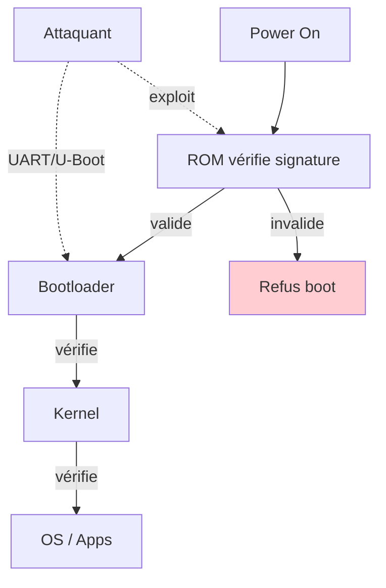
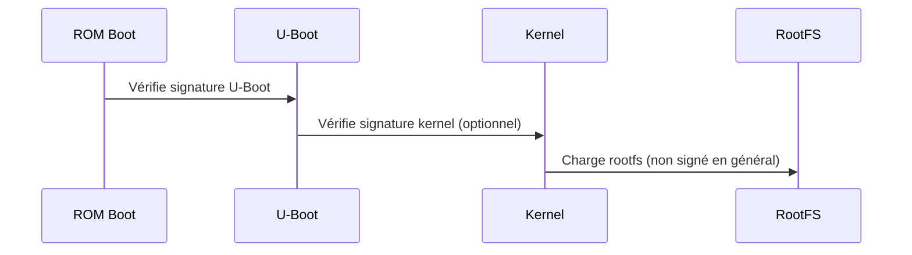
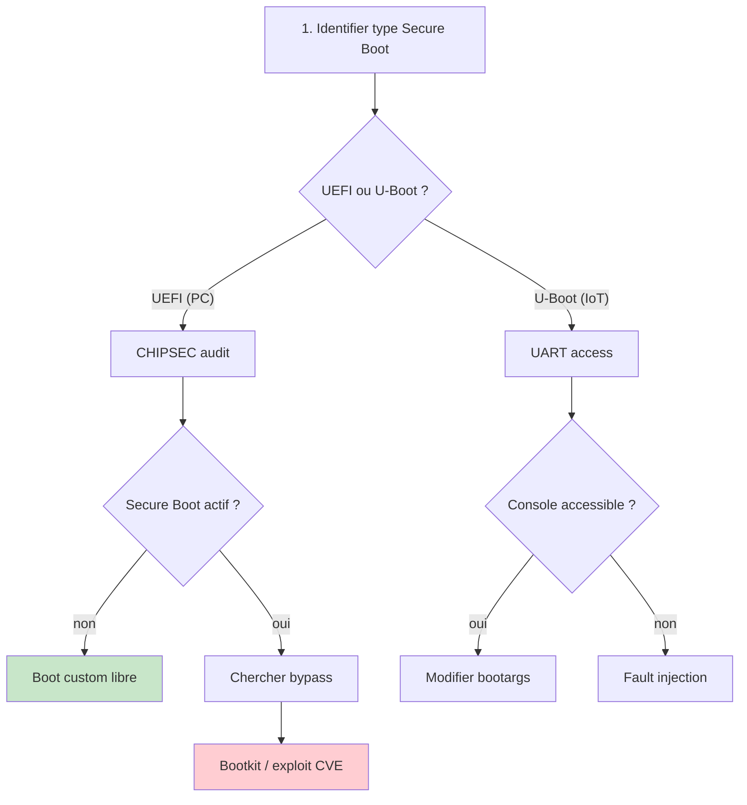
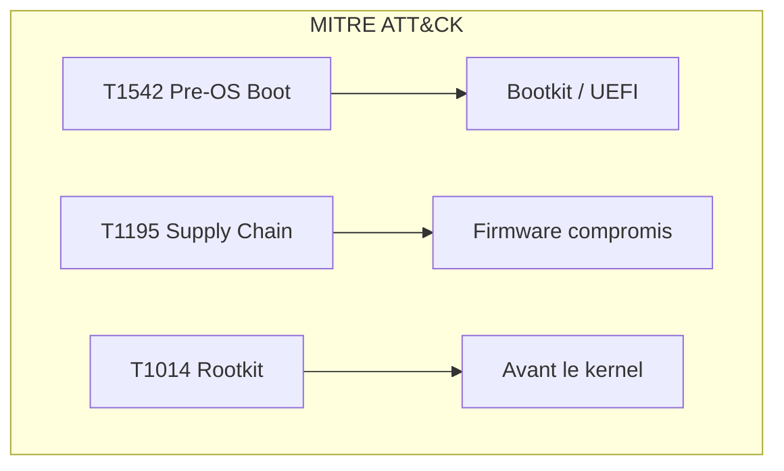

# Secure Boot

> [!info] **En 1 phrase**
> Le **Secure Boot** garantit qu'**uniquement des logiciels signés et de confiance** se chargent
> au démarrage — le contourner est souvent la **porte d'entrée du hacking firmware/IoT**.

---

## Overview

| Champ | Valeur |
|---|---|
| **Type** | Mécanisme de sécurité matérielle/logicielle |
| **Domaine** | Firmware Security / Embedded Security |
| **Niveau** | Intermédiaire → Expert |
| **OS cibles** | UEFI (x86), U-Boot (ARM/MIPS), SoC divers |
| **Matériel requis** | Accès physique, outils de dump, fault injection |
| **Complexité** | Moyenne → Très élevée |
| **Dernière mise à jour** | 2024-03-15 |

> [!info] **Diagramme de contexte**
> ```mermaid
> flowchart LR
>     ROM["UEFI/ROM"] -->|"vérifie"| OROM["Option ROM"]
>     OROM -->|"vérifie"| BOOT["Bootloader"]
>     BOOT -->|"vérifie"| KERNEL["Kernel"]
>     KERNEL -->|"vérifie"| OS["Système"]
>     ROM -.->|"signature invalide"| BLOCK["Refus"]
>     style BLOCK fill:#ffcdd2
>     style OS fill:#c8e6c9
> ```

---

## Concept

> Le Secure Boot établit une chaîne de confiance : chaque composant du boot vérifie la signature du suivant. Si un lien est compromis ou absent, le boot s'arrête. L'attaque consiste à casser cette chaîne.



> [!info] **Ce qui est vérifié**
> - **Pilotes UEFI** (option ROMs)
> - **Applications EFI**
> - **Pilotes et binaires de l'OS**
> - Si signatures invalides → boot refusé

---

## Concepts fondamentaux

### La chaîne de confiance UEFI

| Composant | Rôle | Modifiable |
|---|---|---|
| **PK** (Platform Key) | Clé racine OEM | Oui (physical presence) |
| **KEK** (Key Exchange Key) | Signe mises à jour db/dbx | Oui (avec PK) |
| **db** | Liste signatures autorisées | Oui (avec KEK) |
| **dbx** | Liste noire révoquées | Oui (avec KEK) |

### Chaîne de confiance IoT (U-Boot)

| Composant | Rôle | Vulnérabilité |
|---|---|---|
| **ROM Boot** | Premier bootloader (gravé) | Rarement attaquable |
| **U-Boot** | Bootloader principal | UART, modification env |
| **Kernel** | Noyau Linux | Signature optionnelle |
| **RootFS** | Système de fichiers | Rarement signé |


### Méthodes de contournement

| Méthode | Cible | Difficulté |
|---|---|---|
| Bootkit UEFI | Firmware PC | Élevée |
| Exploit db/dbx | CVE mises à jour | Moyenne |
| Vol clé signée | Bootloader | Moyenne |
| Désactivation BIOS | BIOS setup | Faible |
| UART/U-Boot | IoT devices | Faible |
| Downgrade attack | Protection version | Moyenne |
| Fault injection | Vérif signature | Élevée |

---

## Matériel / Composants

### Outils principaux

| Outil | Type | Usage |
|---|---|---|
| UEFI Tool | Logiciel | Analyse/modification firmware UEFI |
| CHIPSEC | Framework | Audit sécurité UEFI |
| U-Boot | Bootloader | IoT devices |
| Flashrom | Logiciel | Dump/flash firmware |
| OpenOCD | Logiciel | JTAG/SWD dump |

### Cibles typiques

| Catégorie | Secure Boot | Vulnérabilités |
|---|---|---|
| PC x86 | UEFI Secure Boot | CVE db/dbx, bootkits |
| IoT ARM | U-Boot signé | UART, fault injection |
| IoT MIPS | U-Boot signé | UART, flash dump |
| Smartphone | Verified Boot | Bootloader unlockable |

---

## Protocoles

### Chaîne de vérification UEFI

| Étape | Composant vérifié | Signature requise |
|---|---|---|
| 1 | Option ROM (pilotes) | Oui (db) |
| 2 | Applications EFI | Oui (db) |
| 3 | Pilotes OS | Oui (db) |
| 4 | Noyau OS | Oui (shim + db) |

### Chaîne U-Boot IoT



---

## Installation / Setup

### Prérequis

| Composant | Version |
|---|---|
| CHIPSEC | pip install chipsec |
| UEFI Tool | GitHub release |
| flashrom | apt install flashrom |
| OpenOCD | apt install openocd |
| Python | ≥ 3.8 |

### Connexion physique

```text
Pour IoT : UART + JTAG/SWD
Pour PC : accès BIOS + accès physique flash SPI
```

---

## Configuration

### UEFI Secure Boot (BIOS)

| Option | Valeur | Description |
|---|---|---|
| Secure Boot | Enabled/Disabled | Active/désactive la vérification |
| Custom Mode | Allowed | Permet d'ajouter des clés |
| PK/KEK/db | Configurables | Gestion des clés |
| dbx | Mise à jour | Révocation de clés compromises |

### U-Boot IoT

| Option | Commande | Effet |
|---|---|---|
| bootdelay | `setenv bootdelay 0` | Pas de fenêtre d'interruption |
| secure boot | `setenv secure 1` | Active vérification signature |
|密码 console | `setenv password ...` | Protège la console |

---

## Commandes / Manipulations

### Lecture/U-Boot

```bash
# U-Boot commands
printenv              # Variables d'environnement
ls mmc 0:1           # Lister partitions
tftpboot 0x80000000 fw.bin  # Boot custom
setenv bootargs ...   # Modifier args de boot
saveenv               # Sauvegarder
boot                  # Démarrer
```

### CHIPSEC (UEFI)

```bash
# Lancer l'audit
chipsec_main -m common.secureboot

# Vérifier Secure Boot
chipsec_main -m common.uefi.access_uefi_rs

# Dump BIOS
chipsec_util spi dump bios.bin
```

### Dump firmware IoT

```bash
# UART : U-Boot
screen /dev/ttyUSB0 115200

# JTAG : OpenOCD
sudo openocd -f interface/stlink-v2.cfg -f target/stm32f1x.cfg \
    -c "init; halt; dump_image firmware.bin 0x08000000 0x40000; exit"
```

---

## Exemples pratiques

### Débutant — Vérifier Secure Boot (Linux)

```bash
# Vérifier l'état du Secure Boot
mokutil --sb-state
# Résultat : SecureBoot enabled / disabled

# Ou via dmesg
dmesg | grep -i secure
```

### Intermédiaire — Désactiver Secure Boot (BIOS)

```text
1. Redémarrer → accéder au BIOS (Suppr/F2)
2. Security → Secure Boot → Disabled
3. Sauvegarder et redémarrer
4. Vérifier : mokutil --sb-state
```

### Avancé — Bypass U-Boot IoT

```bash
# 1. Connecter UART
screen /dev/ttyUSB0 115200

# 2. Interrompre le boot (appuyer Entrée au bootdelay)
# 3. Prompt U-Boot =>
printenv                # Voir les variables
setenv bootdelay 0      # Désactiver le timeout
setenv bootcmd 'tftpboot 0x80000000 custom.bin; bootm'
saveenv
boot
```

### Expert — Bootkit UEFI (memN0ps)

| Élément | Détail |
|---|---|
| **Objectif** | Installer un bootkit UEFI persistant |
| **Méthode** | Modifier la partition ESP, signer avec clé volée |
| **Résultat** | Code exécuté avant l'OS, persistence totale |
| **Difficulté** | |

```text
Bootkit en Rust (memN0ps) :
1. Obtenir accès physique ou admin
2. Modifier /EFI/BOOT/BOOTX64.EFI
3. Signer avec clé OEM ou désactiver Secure Boot
4. Redémarrer → bootkit chargé avant l'OS
```

---

## Workflow complet



| Étape | Action | Outil |
|---|---|---|
| 1 | Identifier type | Observation, dmesg |
| 2 | Audit sécurité | CHIPSEC, UEFI Tool |
| 3 | Tenter bypass | UART, exploit |
| 4 | Si échec | Fault injection |
| 5 | Persister | Bootkit, modif flash |

---

## Scénarios avancés

### Scénario 1 — PC : bypass Secure Boot via CVE

| Élément | Détail |
|---|---|
| **Objectif** | Installer bootkit malgré Secure Boot |
| **Méthode** | Exploit CVE-2023-24932 (BlackLotus) |
| **Étapes** | Vol clé → signer bootkit → modifier ESP → boot |
| **Difficulté** | |

### Scénario 2 — IoT : bypass U-Boot signé

| Élément | Détail |
|---|---|
| **Objectif** | Boot custom firmware sur routeur |
| **Méthode** | Fault injection + UART |
| **Étapes** | Glitch vérif signature → U-Boot console → tftpboot |
| **Difficulté** | |


---

## Cybersecurity use cases

| Use case | Sévérité | Impact |
|---|---|---|
| Secure Boot désactivé | Critique | Boot custom libre |
| Bootkit UEFI | Critique | Persistence totale |
| U-Boot UART | Élevée | Accès root IoT |
| Downgrade attack | Élevée | Firmware vulnérable |

| Phase pentest | Rôle Secure Boot |
|---|---|
| Recon | Vérifier état Secure Boot |
| Accès initial | Bypass si désactivé |
| Persistence | Bootkit si bypass réussi |
| Évasion | Avant le kernel/OS |

---

## MITRE ATT&CK

| Technique ID | Nom | Catégorie |
|---|---|---|
| T1195 | Supply Chain Compromise | Initial Access |
| T1542 | Pre-OS Boot | Persistence |
| T1554 | Compromise Client Software | Persistence |
| T1014 | Rootkit | Defense Evasion |



---

## Defensive Security

| Mesure | Efficacité | Priorité |
|---|---|---|
| PK en OTP/eFuse | Très élevée | Haute |
| db/dbx à jour | Élevée | Haute |
| TPM + PCR | Élevée | Moyenne |
| Mot de passe BIOS | Élevée | Haute |
| Protection version | Élevée | Moyenne |

```bash
# Mettre à jour dbx (révocations)
# Via Windows Update ou outils OEM
# Vérifier : mokutil --list-unused
```

---

## Automatisation

```python
#!/usr/bin/env python3
"""Vérification automatique Secure Boot"""
import subprocess
import re

def check_secure_boot():
    """Vérifier l'état du Secure Boot"""
    result = subprocess.run(['mokutil', '--sb-state'], capture_output=True, text=True)
    return 'enabled' in result.stdout.lower()

def audit_uefi():
    """Lancer CHIPSEC audit"""
    result = subprocess.run(['chipsec_main', '-m', 'common.secureboot'], 
                          capture_output=True, text=True)
    return result.stdout

if check_secure_boot():
    print("[+] Secure Boot activé")
    print("[*] Lancement audit CHIPSEC...")
    print(audit_uefi())
else:
    print("[-] Secure Boot désactivé → boot custom possible")
```

| Outil | Usage |
|---|---|
| CHIPSEC | Audit UEFI |
| UEFI Tool | Analyse firmware |
| mokutil | Vérification Secure Boot |

---

## Output et parsing

```bash
# Vérification état
mokutil --sb-state
dmesg | grep -i secure

# Audit CHIPSEC
chipsec_main -m common.secureboot 2>&1 | tee chipsec_report.txt

# Analyse bootkit
strings efi_bootkit.bin | grep -iE 'boot|efi|sign'
```

---

## Intégrations

- [[13 - Hardware & IoT| Hardware & IoT]]
- [[Hardware - Secure Boot]] (cette fiche)
- [[Hardware - Fault Injection| Fault Injection]]

| Outil | Usage |
|---|---|
| [[Hardware - UART]] | U-Boot access |
| [[Hardware - Fault Injection]] | Bypass vérif |
| [[Hardware - Dump et Analyse de Firmware| Dump de firmware]] | Extraction firmware |

---

## Alternatives

| Alternative | Avantages | Inconvénients |
|---|---|---|
| Chiffrement firmware | Protège contenu | Ne protège pas l'exécution |
| Boot vérifié (dm-verity) | Vérif runtime | Nécessite Linux |
| HSM dédié | Clés hors CPU | Coût |

---

## Performance

| Métrique | Valeur |
|---|---|
| Overhead Secure Boot | 1-5 s au boot |
| Taille clé RSA | 2048-4096 bits |
| Temps vérif signature | ~100 ms |

---

## Troubleshooting

| Problème | Cause | Solution |
|---|---|---|
| "Secure Boot failed" | Clé non trouvée | Ajouter clé dans db |
| Boot impossible | dbx révoque clé | Mettre à jour firmware |
| U-Boot inaccessible | bootdelay=0 | UART au bon moment |

```bash
# Diagnostic
mokutil --sb-state
dmesg | grep -i secure
chipsec_main -m common.secureboot
```

---

## Sécurité

| Risque | Mitigation |
|---|---|
| Secure Boot désactivé | Forcer activation BIOS |
| Bootkit UEFI | db/dbx à jour |
| U-Boot exposé | bootdelay=0, password |

> [!warning] Secure Boot n'empêche pas le dump de firmware. Combiner avec chiffrement.

> [!danger] Un bootkit UEFI peut être invisible pour l'OS. TPM/attestation nécessaire.

---

## Limitations

| Limite | Contournement |
|---|---|
| Ne chiffre pas | Chiffrement firmware |
| Clés OEM révoquées | Nouvelles clés via mise à jour |
| IoT : UART expose U-Boot | Protéger console |

---

## Cheatsheet

```
┌───────────────────────────────────────────────────┐
│ Secure Boot — Cheatsheet                          │
├───────────────────────────────────────────────────┤
│ Vérifier :   mokutil --sb-state                   │
│ Audit :      chipsec_main -m common.secureboot    │
│ U-Boot :     printenv, setenv bootdelay 0         │
│ Bypass IoT : UART + U-Boot console                │
│ Bypass PC :  CVE db/dbx, bootkit UEFI             │
│ Clés :       PK → KEK → db → Bootloaders         │
│ Défense :    PK en OTP, db/dbx à jour, TPM       │
└───────────────────────────────────────────────────┘
```

---

## Quick reference

| Élément | Valeur |
|---|---|
| **UEFI** | PK → KEK → db → dbx |
| **IoT** | U-Boot signé + OTP |
| **Vérif** | `mokutil --sb-state` |
| **Audit** | `chipsec_main -m common.secureboot` |
| **Bypass IoT** | UART + U-Boot console |
| **Bypass PC** | CVE db/dbx, bootkit |

---

## Détection & Défense

| Countermeasure | Efficacité |
|---|---|
| PK en OTP/eFuse | Très élevée |
| db/dbx à jour | Élevée |
| TPM + PCR | Élevée |
| Bootdelay=0 | Élevée |

---

## Tips & Pièges

- **Désactiver Secure Boot en BIOS** est trivial avec accès physique.
- **Bootkit signé** passe tout le Secure Boot : hygiène db/dbx cruciale.
- **Secure Boot ne chiffre rien** : il authentifie uniquement.
- Sur **IoT**, cherche toujours l'**UART** : prompt U-Boot contourne souvent.
- **TPM + Secure Boot** = attestation intégrité.

> [!tip] Sur IoT, UART est souvent la voie d'accès la plus rapide pour bypasser U-Boot.

---

## References

> [!info] **Sources**
> - [HardwareAllTheThings — Secure Boot](https://github.com/swisskyrepo/HardwareAllTheThings/blob/main/docs/secure-boot/README.md)
> - [memN0ps Bootkit Rust](https://github.com/memN0ps/bootkit-rs)
> - [Awesome UEFI Security](https://github.com/river-li/awesome-uefi-security)

| Source | URL |
|---|---|
| CHIPSEC | https://chipsec.github.io/ |
| UEFI Spec | https://uefi.org/specifications |
| Microsoft Secure Boot | https://docs.microsoft.com/en-us/windows-hardware/design/device-experiences/oem-secure-boot |

---

**Liens :** [[13 - Hardware & IoT| Hardware & IoT]] · [[Hardware - UART| UART]] · [[Hardware - Fault Injection| Fault Injection]] · [[Hardware - Dump et Analyse de Firmware| Dump de firmware]]
