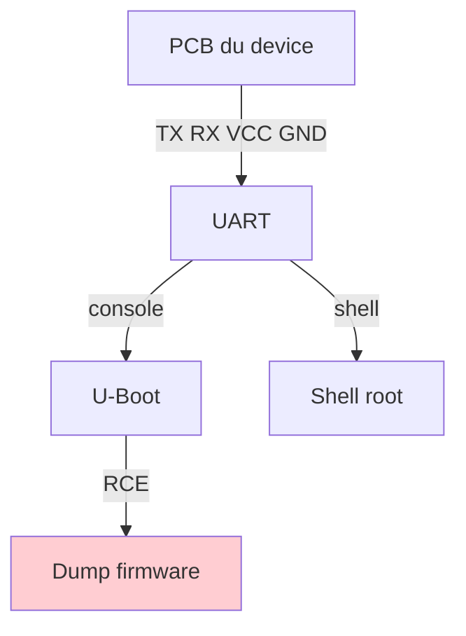
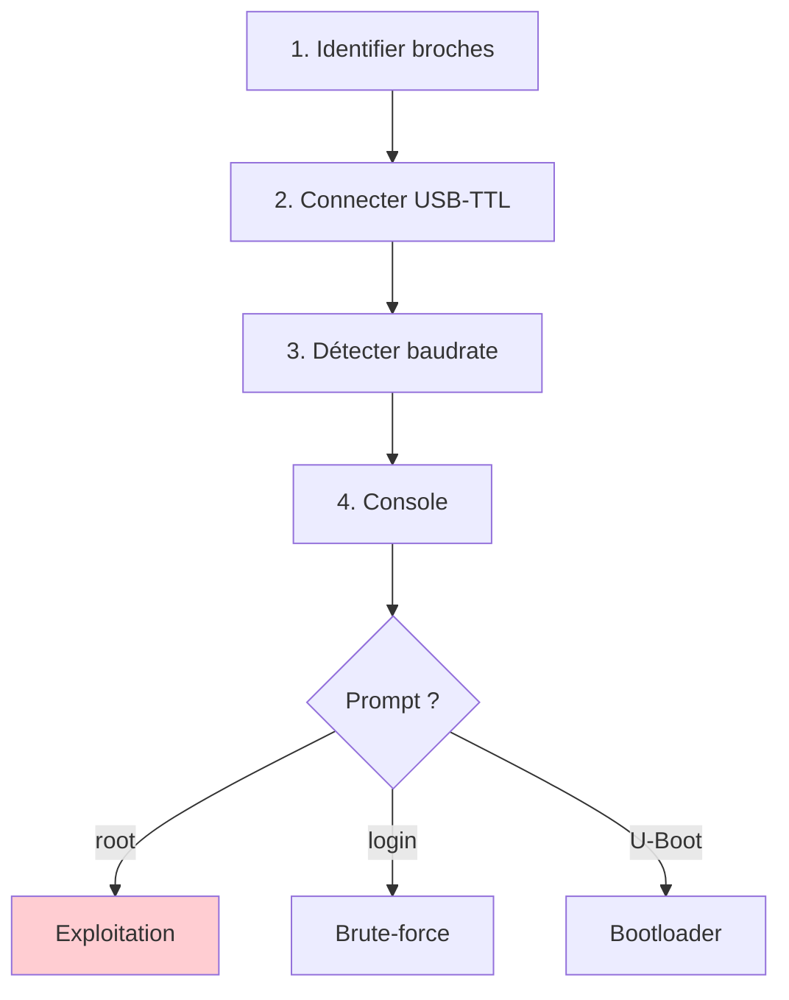
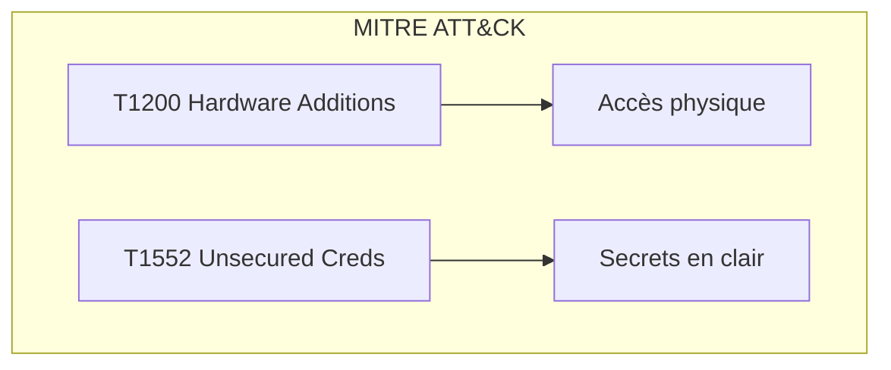

# UART

> [!info] **En 1 phrase**
> UART = la **console série** des objets connectés (bootloader + logs + souvent un **shell root**)
> — c'est **l'interface de debug la plus simple** à trouver et à exploiter.

---

## Overview

| Champ | Valeur |
|---|---|
| **Type** | Protocole série asynchrone |
| **Domaine** | Hardware Hacking / Debug |
| **Niveau** | Débutant → Avancé |
| **OS cibles** | Linux embedded, bare-metal, RTOS, U-Boot |
| **Matériel requis** | Adaptateur USB-TTL (CH340, CP2102, FT232), pinces, multimètre |
| **Complexité** | Faible → Moyenne |
| **Dernière mise à jour** | 2024-03-15 |

> [!info] **Diagramme de contexte**
> ```mermaid
> flowchart LR
>     PC["PC (attaquant)"] -->|"USB-TTL"| TXRX["Broches TX/RX"]
>     TXRX --> MCU["Microcontrôleur"]
>     MCU -->|"console"| SHELL["Accès complet"]
>     style PC fill:#e1f5fe
>     style SHELL fill:#c8e6c9
> ```

---

## Concept

> UART permet la communication série asynchrone. En pentest hardware, c'est la porte d'entrée n°1 : console série active offrant accès au bootloader, logs et shell root.



> [!info] **Ce qu'on peut obtenir**
> - **Shell** (parfois root) ou prompt **U-Boot** → dump flash, boot custom.
> - **Logs de démarrage** → versions, secrets, chemins.
> - **Mot de passe root** (souvent en clair).

---

## Concepts fondamentaux

### Protocole série asynchrone

| Terme | Définition |
|---|---|
| **Baudrate** | Bits/s. Courants : 9600, 57600, 115200, 230400 |
| **TX** | Émission device → RX adaptateur |
| **RX** | Réception device ← TX adaptateur |
| **GND** | Masse commune |
| **VCC** | Alimentation (3.3V/5V). **Ne jamais brancher depuis l'adaptateur** |
| **8N1** | 8 bits, no parity, 1 stop |

### Niveaux logiques

| Standard | HIGH | LOW | Usage |
|---|---|---|---|
| TTL 5V | > 3.0V | < 0.8V | Arduino Uno |
| TTL 3.3V | > 2.0V | < 0.8V | Raspberry Pi, STM32, ESP32 |

---

## Matériel / Composants

### Outils principaux

| Outil | Type | Usage | Prix |
|---|---|---|---|
| CH340G | USB-TTL | Connexion série | ~5 € |
| CP2102 | USB-TTL | Stable, driver natif | ~8 € |
| FT232RL | USB-TTL | Professionnel | ~12 € |
| Bus Pirate | Multi-protocole | I2C, SPI, UART | ~30 € |
| Logic Analyzer | Analyseur | Capture signaux | ~10-30 € |

### Cibles typiques

| Catégorie | Exemples | Bauds | Vulnérabilités |
|---|---|---|---|
| Routeurs IoT | TP-Link, Netgear | 115200 | Shell root |
| Caméras IP | Hikvision, Dahua | 115200 | Credentials |
| Box ADSL/Fibre | Livebox, Freebox | 115200 | Shell root |

### Pinout

```text
       ┌──────────────┐
  VCC ─┤1            8├─ [unused]
   TX ─┤2            7├─ [unused]
   RX ─┤3            6├─ [unused]
  GND ─┤4            5├─ [unused]
       └──────────────┘
```

---

## Protocoles

| Paramètre | Valeur |
|---|---|
| **Type** | Série asynchrone |
| **Vitesse** | 9600–921600 bauds (115200 standard) |
| **Voltage** | 3.3V / 5V TTL |
| **Fils** | TX + RX + GND |
| **Direction** | Full-duplex |

### Comparaison protocoles

| Protocole | Vitesse | Sécurité | Usage |
|---|---|---|---|
| UART | 9600–921600 | Aucune | Console debug |
| I2C | 100k–3.4M | Aucune | EEPROM, capteurs |
| SPI | 1–100 MHz | Aucune | Flash |
| JTAG | 10–100 MHz | Debug pwd | Debug, dump |

---

## Installation / Setup

### Prérequis

| Composant | Version |
|---|---|
| Python | ≥ 3.8 |
| pyserial | ≥ 3.5 |
| minicom | ≥ 2.7 |
| screen | any |
| PulseView | ≥ 0.4 |

### Connexion physique

```text
PC ──── USB-TTL ──── Device
│                      │
│  TX ──────────── RX (device)
│  RX ──────────── TX (device)
│  GND ─────────── GND (device)
│  VCC ──[NE PAS]── VCC
```

> [!danger] Ne jamais connecter VCC entre adaptateur et device.

```bash
# Installation outils
sudo apt install minicom screen picocom
pip install pyserial

# Détection
ls /dev/ttyUSB*
sudo usermod -a -G dialout $USER
```

---

## Configuration

| Option | Défaut | Description |
|---|---|---|
| Baudrate | 115200 | Vitesse |
| Data bits | 8 | Bits données |
| Parity | None | Pas de parité |
| Stop bits | 1 | Bit stop |

### Adaptateurs

| Adaptateur | Chip | Voltage |
|---|---|---|
| CH340G | CH340 | 3.3V/5V |
| CP2102 | CP2102 | 3.3V |
| FT232RL | FTDI | 3.3V |
| PL2303 | Prolific | 3.3V/5V |

---

## Commandes / Manipulations

| Commande | Description |
|---|---|
| `screen /dev/ttyUSB0 115200` | Console interactive |
| `minicom -b 115200 -o -D /dev/ttyUSB0` | Terminal complet |
| `picocom -b 115200 /dev/ttyUSB0` | Terminal léger |
| `cat /dev/ttyUSB0 > dump.txt` | Lecture brute |

### Baudrate inconnu

```bash
# Auto-detection
wget https://raw.githubusercontent.com/devttys0/baudrate/master/baudrate.py
python2.7 baudrate.py -p /dev/ttyUSB0

# Ou depuis PulseView : 1 / durée_bit
```

---

## Exemples pratiques

### Débutant — Connexion

```bash
dmesg | grep ttyUSB          # identifier le port
screen /dev/ttyUSB0 115200   # se connecter
# Appuyer Entrée → prompt = accès
```

### Intermédiaire — Scan bauds

```bash
#!/bin/bash
PORT="/dev/ttyUSB0"
for baud in 9600 19200 38400 57600 115200 230400; do
    timeout 3 stty -F "$PORT" "$baud" 2>/dev/null
    echo "test" > "$PORT"; timeout 2 cat "$PORT" > /tmp/uart_$baud &
    sleep 3; kill %1 2>/dev/null
    [ -s /tmp/uart_$baud ] && echo ">>> $baud" && break
done
```

### Avancé — Brute-force

```python
import serial, time
ser = serial.Serial("/dev/ttyUSB0", 115200, timeout=1)
for pwd in ["root","admin","password","1234",""]:
    ser.write((pwd+"\n").encode()); time.sleep(0.5)
    resp = ser.read(ser.in_waiting).decode(errors='ignore')
    if any(m in resp for m in ["#","$","~"]):
        print(f"[+] {pwd}"); break
ser.close()
```

### Expert — Sigrok

```bash
sigrok-cli -d fx2lafw --config samplerate=1000000 --samples 10000000 \
    -P uart:baudrate=115200:rx=D0 -B uart=rx -O ascii
```

---

## Workflow complet (scénario pas à pas)



| Étape | Action | Commande |
|---|---|---|
| 1 | Identifier GND | Multimètre continuité |
| 2 | Identifier TX | DC 20V, fluctue au boot |
| 3 | Connecter | TX→RX, RX→TX, GND→GND |
| 4 | Baud detection | baudrate.py ou 115200 |
| 5 | Connexion | screen /dev/ttyUSB0 115200 |

---

## Scénarios avancés

### Scénario 1 — Routeur : shell root

| Élément | Détail |
|---|---|
| **Objectif** | Shell root routeur TP-Link |
| **Matériel** | CH340G, pinces |
| **Étapes** | 4 broches → screen 115200 → root shell |
| **Difficulté** | |

### Scénario 2 — Caméra : dump firmware

| Élément | Détail |
|---|---|
| **Objectif** | Extraire firmware Hikvision |
| **Matériel** | CP2102 |
| **Étapes** | UART → U-Boot → tftpboot → dd dump |
| **Difficulté** | |

---

## Cybersecurity use cases

| Use case | Sévérité | Impact |
|---|---|---|
| Console UART exposée | Critique | Accès root direct |
| Boot log secrets | Élevée | Fuite credentials |
| U-Boot non protégé | Élevée | Dump firmware |

| Phase pentest | Rôle UART |
|---|---|
| Recon | Logs → versions, services |
| Accès initial | Shell root / U-Boot |
| Maintien | Modif config, cron |
| Évasion | Logs rarement monitorés |

---

## MITRE ATT&CK

| Technique ID | Nom | Catégorie |
|---|---|---|
| T1200 | Hardware Additions | Initial Access |
| T1195 | Supply Chain Compromise | Initial Access |
| T1556 | Modify Authentication Process | Credential Access |
| T1552 | Unsecured Credentials | Credential Access |
| T1033 | System Owner/User Discovery | Discovery |



---

## Defensive Security

| Mesure | Efficacité | Priorité |
|---|---|---|
| Désactiver UART | Très élevée | Haute |
| Console protégée | Moyenne | Haute |
| Secure boot | Élevée | Moyenne |
| Effacer pads debug | Élevée | Haute |

```bash
setenv bootdelay 0    # U-Boot : pas de fenêtre
saveenv
```

---

## Automatisation

```python
import serial, time, base64
class UARTExploit:
    def __init__(self, port="/dev/ttyUSB0"):
        self.ser = serial.Serial(port, 115200, timeout=2)
    def cmd(self, c, wait=1):
        self.ser.write((c+"\n").encode())
        time.sleep(wait)
        return self.ser.read(self.ser.in_waiting).decode(errors='ignore')
    def dump(self, remote, local):
        r = self.cmd(f"base64 {remote}", 5)
        if r: open(local,'wb').write(base64.b64decode(r.strip()))
    def close(self): self.ser.close()
```

| Outil | Usage |
|---|---|
| screen / minicom | Console interactive |
| sigrok-cli | Capture signaux |
| baudrate.py | Auto-détection |

---

## Output et parsing

```bash
# IPs dans logs
cat boot.log | grep -oE '([0-9]{1,3}\.){3}[0-9]{1,3}'
# Versions
cat boot.log | grep -iE 'version|v[0-9]+'
# Hex dump
xxd dump.bin > dump.hex; binwalk dump.bin
```

---

## Intégrations

- [[13 - Hardware & IoT| Hardware & IoT]]
- [[Hardware - UART]]
- [[Hardware - Dump et Analyse de Firmware| Dump de firmware]]

| Outil associé | Usage |
|---|---|
| [[Hardware - Bus Pirate]] | Multi-protocole |
| [[Hardware - CH341A]] | Adaptateur bon marché |
| [[Hardware - Logic Analyzer]] | Capture signaux |

---

## Alternatives

| Alternative | Avantages | Inconvénients |
|---|---|---|
| JTAG/SWD | Mémoire complète | Broches absentes |
| I2C/SPI | EEPROM/flash | Moins interactif |
| SSH | Pas physique | Nécessite réseau |

---

## Performance

| Métrique | Valeur |
|---|---|
| Vitesse | 115200 bauds (~11.5 KB/s) |
| Latence | < 1 ms |
| Fiabilité | Très élevée |
| Portée | 1–3 m |

---

## Troubleshooting

| Problème | Cause | Solution |
|---|---|---|
| Aucune sortie | Mauvais baud | Tester 115200/9600 |
| Illisible | Baud incorrect | Auto-détection |
| Permission refusée | Pas dans dialout | `usermod -a -G dialout` |
| Reset boucle | Court-circuit | Vérifier connexions |

```bash
lsusb | grep -i "ch34\|cp210\|ftdi"
dmesg | tail -20
groups $USER
```

---

## Sécurité

| Risque | Mitigation |
|---|---|
| Shell root exposé | Désactiver UART |
| Secrets dans logs | Nettoyer logs |
| Boot sans vérif | Secure boot |

> [!warning] Points de sécurité
> - Toujours désactiver UART en production
> - Combiner avec secure boot

> [!danger] Cadre légal
> Accès physique sans autorisation = illégal. Pentest contractuel uniquement.

---

## Limitations

| Limite | Contournement |
|---|---|
| Baud inconnu | Auto-détection |
| Console protégée | Brute-force |
| UART désactivé | JTAG, fault injection |

---

## Cheatsheet

```
┌─────────────────────────────────────────────────┐
│ UART — Cheatsheet                               │
├─────────────────────────────────────────────────┤
│ GND :   Multimètre continuité → beep            │
│ TX :    DC 20V → fluctue au boot                │
│ Baud :  115200 8N1 (défaut)                     │
│ Shell : screen /dev/ttyUSB0 115200              │
│ Dump :  dd if=/dev/mtd0 of=dump.bin             │
│ Auto :  baudrate.py -p /dev/ttyUSB0             │
└─────────────────────────────────────────────────┘
```

---

## Quick reference

| Élément | Valeur |
|---|---|
| **Brochage** | TX, RX, GND, VCC |
| **Vitesse** | 115200 bauds 8N1 |
| **Voltage** | 3.3V / 5V |
| **Logiciel** | screen / minicom |
| **Commande** | `screen /dev/ttyUSB0 115200` |

---

## Détection & Défense

| Countermeasure | Efficacité |
|---|---|
| Désactiver UART | Très élevée |
| Console protégée | Élevée |
| Secure boot | Élevée |
| Chiffrer firmware | Élevée |

---

## Tips & Pièges

- **RX ↔ TX s'inversent** : TX device → RX adaptateur.
- **VCC/GND** : VCC sur GND = device grillé.
- Baud défaut souvent **115200**.
- **Power cycle** après connexion → boot log riche.
- Cherche **4 trous non soudés** sur PCB.

> [!tip] Astuces
> - Teste 115200 8N1 en premier
> - Boot log souvent plus riche que le shell

---

## References

> [!info] **Sources**
> - [HardwareAllTheThings — UART](https://github.com/swisskyrepo/HardwareAllTheThings/blob/main/docs/debug-interfaces/uart.md)

| Source | URL |
|---|---|
| FTDI FT232RL | https://ftdichip.com/wp-content/uploads/2024/05/DS_FT232R.pdf |
| WCH CH340 | http://www.wch-ic.com/products/CH340.html |
| Sigrok UART | https://sigrok.org/wiki/UART_decoder |

---

**Liens :** [[13 - Hardware & IoT| Hardware & IoT]] · [[Hardware - JTAG et SWD| JTAG/SWD]] · [[Hardware - Dump et Analyse de Firmware| Dump de firmware]] · [[Hardware - I2C et SPI| I2C/SPI]]
