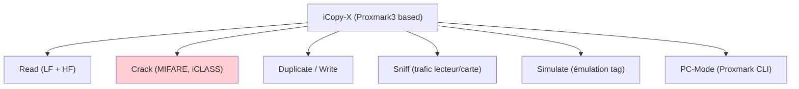
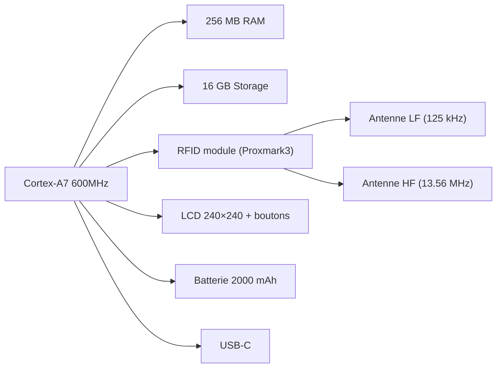
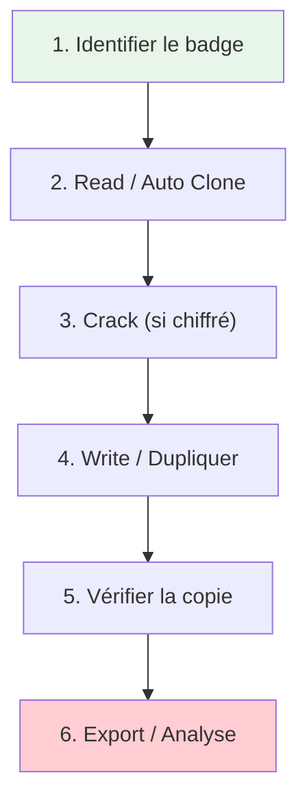
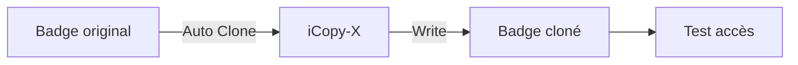
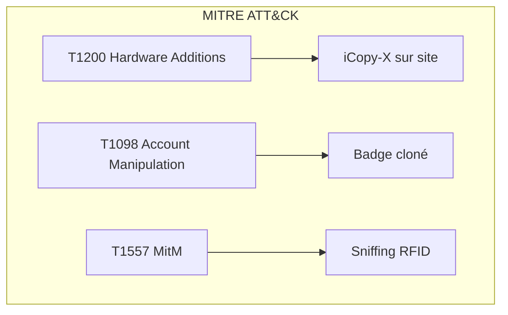
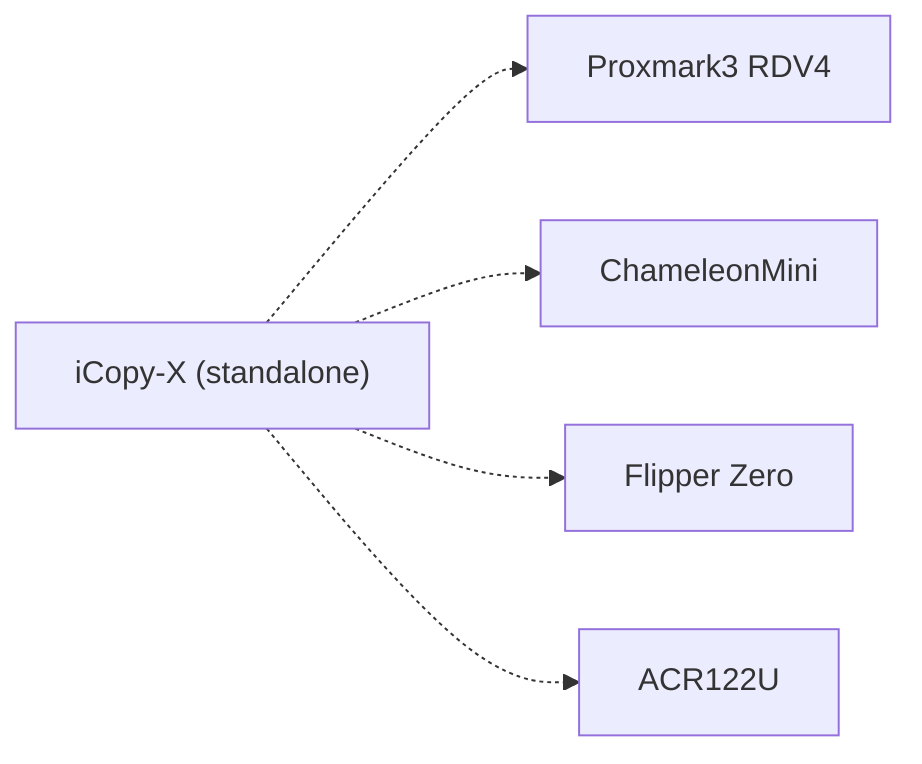

# 🏷️ iCopy-X

> [!info] **En 1 phrase**
> iCopy-X = un **copieur RFID portable « super-automatisé »** basé sur
> **Proxmark3** : il **lit, craque, duplique, sniffe et simule** des cartes
> RFID **sans PC**, en autonomie complète.

---

## 🧾 Overview

| Champ | Valeur |
|---|---|
| **Type** | Copieur RFID portable / Outil pentest NFC |
| **Domaine** | Hardware Hacking / RFID Security |
| **Niveau** | Beginner → Expert |
| **OS cibles** | Propriétaire (standalone), Linux (PC-Mode) |
| **Matériel requis** | iCopy-X (XS recommandé), cartes blanches iCopy-X, PC (optionnel) |
| **Complexité** | Faible → Moyenne |
| **Dernière mise à jour** | 2026-08-16 |

> [!info] 📊 **Diagramme de contexte**
> ```mermaid
> flowchart LR
>     A["iCopy-X"] --> B["Read — lecture RFID"]
>     A --> C["Crack — craquage clés"]
>     A --> D["Duplicate — duplication"]
>     A --> E["Sniff — sniffing"]
>     A --> F["Simulate — simulation tag"]
>     style A fill:#e1f5fe
>     style C fill:#ffcdd2
> ```

---

## 🎯 Concept

L'iCopy-X est un device RFID portable autonome basé sur le **Proxmark3 RDV 4.01**. Il combine un écran LCD, des boutons de navigation, un processeur ARM Cortex-A7 (600 MHz) et 256 MB de RAM pour exécuter des opérations de lecture, craquage et duplication de badges RFID **sans ordinateur**. Le modèle **iCopy-XS** est open source et exécute le firmware Iceman Proxmark3.



---

## 🧠 Concepts fondamentaux

### RFID LF vs HF

| Terme | Définition |
|---|---|
| **LF (Low Frequency)** | 125/134 kHz — EM4100, HID Prox, T5577, Indala |
| **HF (High Frequency)** | 13.56 MHz — MIFARE, NTAG, iCLASS, ISO14443A/B, ISO15693 |
| **Proxmark3** | Outil open-source de référence pour la recherche RFID |
| **Iceman firmware** | Fork le plus avancé du firmware Proxmark3 |
| **MIFARE Classic** | Carte HF avec chiffrement Crypto-1 (craquable) |
| **T5577** | Carte LF modifiable — permet la duplication de badges LF |

### Architecture iCopy-X



---

## 🔌 Matériel / Composants

### Outils principaux

| Outil | Type | Usage | Prix | Source |
|---|---|---|---|---|
| iCopy-X (Basic) | Copieur RFID | Lecture/craquage/duplication basique | ~200€ | icopy-x.com |
| iCopy-X (Intermediate) | Copieur RFID | + iCLASS Elite | ~300€ | icopy-x.com |
| iCopy-XS (Advanced) | Copieur RFID | Open source, firmware Iceman | ~340€ | Lab401 |
| Cartes blanches iCopy-X | Tags vides | Duplication (HF + LF) | ~5-10€/lot | icopy-x.com |
| iCS Decoder | Accessoire | iCLASS SE / SEOS decoder | ~445€ | Lab401 |

### Spécifications techniques

| Composant | Spécification |
|---|---|
| **Processeur** | ARM Cortex-A7 @ 600 MHz |
| **RAM** | 256 MB |
| **Stockage** | 16 GB (interne + U-disk) |
| **Écran** | LCD RGB 1.3" 240×240 |
| **Navigation** | Boutons physiques (flèches + sélection) |
| **RFID** | Module personnalisé Proxmark3 RDV 4.01 |
| **LF** | 125/134 kHz (EM4XX, T5577, HID, etc.) |
| **HF** | 13.56 MHz (MIFARE, NTAG, iCLASS, ISO14443A/B, ISO15693) |
| **Batterie** | Li-ion 2000 mAh (7.4 Wh) |
| **Autonomie** | ~4.5 heures (veille) |
| **Charge** | USB-C, 10W max, ~2h charge |
| **Dimensions** | 120 × 55 × 24 mm |
| **Poids** | 113 g |
| **Connectique** | USB-C (charge + data) |

### Modèles iCopy-X

| Modèle | Capacité | Open Source | Firmware |
|---|---|---|---|
| iCopy-X (Basic) | Lecture/craquage basique | Non | Propriétaire |
| iCopy-XR (Intermediate) | + iCLASS | Non | Propriétaire |
| iCopy-XS (Advanced) | Complet | **Oui** | Iceman Proxmark3 |

### Tags RFID supportés

| Type | LF (125 kHz) | HF (13.56 MHz) |
|---|---|---|
| **MIFARE** | — | Classic 1K/4K, Ultralight, Ultralight C/EV1, NTAG |
| **ISO14443B** | — | iCLASS Legacy, iCLASS Elite, iCLASS SE*, iCLASS SEOS* |
| **ISO15693** | — | iCODE SLI (partiel), iCODE SLIX (partiel) |
| **EM** | EM4XX | — |
| **T5577** | T5577 (writable) | — |
| **HID** | HID Prox | — |
| **Indala** | Indala | — |
| **Autres LF** | AWID, ioProx, Viking, FDX-B, KERI, VISA2000, HITAG, Motorola, Paradox, Presco, GProx, SecuraKey, PAC, Stanley, NexWatch | — |

> [!note] À vérifier
> iCLASS SE / SEOS nécessitent l'accessoire **iCS Decoder**. MIFARE DESFire et iCLASS Elite avec clés custom **ne sont pas supportés**.

---

## ⚡ Protocoles

### Protocoles RFID supportés

| Protocole | Fréquence | Usage | Vulnerabilité |
|---|---|---|---|
| ISO14443A | 13.56 MHz | MIFARE, NTAG | Crypto-1 crack |
| ISO14443B | 13.56 MHz | iCLASS | Key crack |
| ISO15693 | 13.56 MHz | iCODE | Partiellement supporté |
| EM4XX | 125 kHz | EM4100, EM4305 | Clonage direct |
| T5577 | 125 kHz | Writable LF | Duplication badges LF |
| HID Prox | 125 kHz | HID badges | Clonage |
| iCLASS | 13.56 MHz | HID iCLASS | Key crack |

---

## 🛠️ Installation / Setup

### Prérequis

| Composant | Version | Lien |
|---|---|---|
| iCopy-X firmware | 1.0.90+ | https://icopy-x.com/otasys/ |
| Proxmark3 client (PC-Mode) | Iceman fork | Fourni sur le disque U intégré |
| PC (optionnel) | Windows/Linux/macOS | Pour PC-Mode |

### Mise à jour firmware

```text
Étape 1 : Saisir le S/N du device (menu "About") sur icopy-x.com
Étape 2 : Télécharger le package de mise à jour
Étape 3 : Brancher l'iCopy-X au PC (USB-C)
Étape 4 : Supprimer tous les fichiers ".ipk" de la racine
Étape 5 : Copier le nouveau package à la racine
Étape 6 : Appuyer sur "Ok" dans le menu "About" pour lancer la MAJ
```

> [!warning] Vérifier que le **numéro de série** est correct avant la mise à jour.

### Mode autonome (standalone)

```text
1. Allumer l'iCopy-X
2. Placer un badge sur l'antenne
3. Naviguer avec les boutons fléchés
4. Sélectionner "Auto Clone" ou l'opération souhaitée
5. L'appareil gère automatiquement la détection, le craquage et la copie
```

### PC-Mode (mode Proxmark3)

```text
1. Brancher l'iCopy-X au PC via USB-C
2. Ouvrir le client depuis le disque U intégré (dossier CLIENT_X86)
3. Utiliser les commandes Proxmark3 universelles
```

---

## ⚙️ Configuration

### Paramètres iCopy-X

| Option | Valeur | Description |
|---|---|---|
| Language | English | Interface (anglais par défaut) |
| Brightness | Variable | Luminosité écran |
| Auto-save | On | Sauvegarde auto des données badge |
| Key dictionary | Interne | Dictionnaire de clés pour craquage |

### Dictionnaire de clés

```text
L'iCopy-X contient un dictionnaire interne de clés MIFARE
et T5577 pour le craquage automatique.
Le dictionnaire est mis à jour via les firmwares OTA.
```

---

## ⌨️ Commandes / Manipulations

### Commandes standalone (écran)

| Action | Menu | Description |
|---|---|---|
| Auto Clone | Menu principal | Lecture + craquage + copie automatique |
| Read | Menu | Lecture basique du badge |
| Write | Menu | Écriture sur badge vierge |
| Sniff | Menu | Capture de trafic lecteur/carte |
| Simulate | Menu | Émulation d'un badge |
| Decode | Menu | Décodage de données badge |
| Keys | Menu | Gestion des clés |

### Commandes Proxmark3 (PC-Mode)

```bash
# Connexion au device
pm3 --> hf mf autopwn           # Attaque MIFARE Classic automatisée
pm3 --> lf em 410x reader        # Lecture tags 125 kHz (EM410x)
pm3 --> hf 14a list              # Sniff/analyse ISO14443A
pm3 --> lf t55xx detect          # Détection T5577
pm3 --> hf mf rdbl --blk 0      # Lecture d'un bloc MIFARE
pm3 --> lf hid read             # Lecture HID Prox
pm3 --> hf mf cwpa              # Crack WPA pour MIFARE
pm3 --> hw tune                  # Mesure antenne RF
```

### Options Proxmark3

| Option | Description | Exemple |
|---|---|---|
| `hf mf autopwn` | Attaque complète MIFARE | Crée toutes les clés |
| `lf em 410x reader` | Lit les tags EM410x | 125 kHz LF |
| `hf 14a list` | Sniff ISO14443A | Analyse trafic |
| `hw tune` | Calibre antenne | Vérifie la résonance RF |
| `lf t55xx write` | Écrit sur T5577 | Duplication LF |

---

## 🧪 Exemples pratiques

### 🟢 Débutant — Clonage automatisé

```text
1. Allumer l'iCopy-X
2. Placer le badge original sur l'antenne
3. Sélectionner "Auto Clone"
4. L'appareil détecte automatiquement le type de badge
5. Pour les badges chiffrés (MIFARE), lance le craquage automatique
6. Retirer le badge original, placer le badge vierge
7. L'iCopy-X écrit les données
8. Vérifier la copie en relisant le nouveau badge
```

### 🟡 Intermédiaire — Sniffing de trafic RFID

```text
1. Sélectionner "Sniff" dans le menu
2. Placer l'iCopy-X entre le lecteur et le badge
3. Demander à quelqu'un de badger
4. L'iCopy-X capture le trafic
5. Analyser la capture sur PC en mode Proxmark3
6. Extraire les clés depuis la trace
```

### 🔴 Avancé — Attaque MIFARE complète via PC-Mode

```bash
# Brancher l'iCopy-X au PC
# Ouvrir le client Proxmark3

# 1. Sniff du trafic
pm3 --> hf 14a list

# 2. Attaque MIFARE automatisée (Darkside + Nested + StaticNested)
pm3 --> hf mf autopwn

# 3. Lecture des blocs avec les clés trouvées
pm3 --> hf mf rdsc -a -k FFFFFFFFFFFF

# 4. Dump complet du badge
pm3 --> hf mf dump

# 5. Copie sur un nouveau badge
pm3 --> hf mf restore
```

### ⚫ Expert — Clonage iCLASS SE avec iCS Decoder

```text
1. Connecter l'accessoire iCS Decoder à l'iCopy-X
2. Placer le badge iCLASS SE sur l'antenne
3. Sélectionner "iCLASS SE Decode"
4. L'accessoire déchiffre les clés propriétaires
5. Les données sont sauvegardées dans l'iCopy-X
6. Duplication possible sur des cartes iCLASS compatibles
```

---

## 🧪 Workflow complet (scénario pas à pas)



### Étape 1 — Identification

| Action | Commande | Résultat |
|---|---|---|
| Placer badge | Auto-detect | Type LF/HF identifié |
| hw tune (PM3) | Vérifier antenne | Résonance RF OK |

### Étape 2 — Lecture

| Méthode | Difficulté | Fiabilité |
|---|---|---|
| Auto Clone (standalone) | Faible | Élevée |
| Read (standalone) | Faible | Élevée |
| hf mf info (PM3) | Moyenne | Élevée |

### Étape 3 — Craquage

```text
MIFARE Classic → Darkside attack (~12s/key)
T5577 → Dictionary attack (70% succès)
iCLASS → Key recovery via iCS Decoder
```

### Étape 4 — Duplication

```text
Placer badge vierge iCopy-X
Sélectionner "Write"
Attendre la confirmation
```

### Étape 5 — Vérification

```text
Relire le nouveau badge
Comparer les données avec l'original
Vérifier le numéro de série
```

---

## 🎬 Scénarios avancés

### Scénario 1 — Pentest physique complet (badges bureau)

| Élément | Détail |
|---|---|
| **Objectif** | Évaluer la sécurité RFID d'un bâtiment de bureau |
| **Matériel** | iCopy-XS, badges vierges iCopy-X |
| **Étapes** | 1. Collecter les badges (scan discret)<br>2. Auto Clone sur iCopy-X<br>3. Tester les badges clonés sur les lecteurs<br>4. Documenter les badges non sécurisés |
| **Résultat** | Rapport de vulnérabilités RFID |
| **Difficulté** | ⭐⭐ |



### Scénario 2 — Analyse de système RFID d'accès

| Élément | Détail |
|---|---|
| **Objectif** | Analyser la sécurité d'un système d'accès RFID |
| **Matériel** | iCopy-XS, PC, iCS Decoder (si iCLASS) |
| **Étapes** | 1. Identifier le type de badge (LF/HF)<br>2. Sniff du trafic lecteur/carte<br>3. Analyser le chiffrement<br>4. Craquer les clés<br>5. Documenter les faiblesses |
| **Résultat** | Analyse complète du système RFID |
| **Difficulté** | ⭐⭐⭐ |

---

## 🛡️ Cybersecurity use cases

| Use case | Sévérité | Matériel requis | Impact |
|---|---|---|---|
| Clonage de badge MIFARE | Élevée | iCopy-X + badge vierge | Accès non autorisé |
| Craquage T5577 | Moyenne | iCopy-X | Duplication badges LF |
| Sniffing RFID | Élevée | iCopy-X | Capture de clés |
| Bypass contrôle accès | Critique | iCopy-X | Accès physique |

| Phase pentest | Ce que permet cette technique |
|---|---|
| Recon | Identifier les types de badges utilisés |
| Accès initial | Cloner un badge pour entrer |
| Maintien d'accès | Badge cloné pour accès récurrent |
| Évasion | Simulation de badge légitime |

---

## 🎯 MITRE ATT&CK

| Technique ID | Nom | Catégorie | Applicabilité |
|---|---|---|---|
| T1200 | Hardware Additions | Initial Access | iCopy-X utilisé sur site |
| T1098 | Account Manipulation | Persistence | Badge cloné pour accès persistant |
| T1557 | Adversary-in-the-Middle | Collection | Sniffing RFID |



---

## 🛡️ Defensive Security

### Détection

| Signal de détection | Source | Fiabilité |
|---|---|---|
| Device RFID non autorisé | Surveillance physique | Élevée |
| Badge cloné utilisé multiple fois | Logs d'accès | Élevée |
| Trafic RFID suspect | Monitoring RF | Moyenne |

### Prévention

| Mesure | Efficacité | Coût | Priorité |
|---|---|---|---|
| Migrer vers DESFire EV2/EV3 | Élevée | Moyen | Haute |
| Validation contextuelle (anti-passback) | Élevée | Moyen | Haute |
| Chiffrement fort (AES-128) | Élevée | Faible | Haute |
| Biometrie en complément | Élevée | Élevé | Moyenne |

### Durcissement (hardening)

```text
- Ne PAS utiliser MIFARE Classic (Crypto-1 cracké)
- Utiliser MIFARE DESFire EV2/EV3 ou iCLASS SE (AES-128)
- Implémenter l'anti-passback (le badge doit être lu à l'entrée ET à la sortie)
- Valider les timestamps (les badges clonés ont des données statiques)
- Activer les alertes sur les badges utilisés en doublon
```

---

## 🤖 Automatisation

### Scripts d'exploitation

```python
#!/usr/bin/env python3
"""Analyse de dumps RFID depuis iCopy-X"""
import sys
import json

def analyze_mifare_dump(filepath):
    with open(filepath, 'rb') as f:
        data = f.read()

    print(f"[*] Taille: {len(data)} octets")
    if len(data) >= 1024:
        print(f"[*] MIFARE 1K détecté (1024 blocs × 16 octets)")
        for block in range(64):
            offset = block * 16
            block_data = data[offset:offset+16]
            if block % 4 == 0:
                print(f"\nSector {block//4}:")
            print(f"  Block {block:2d}: {block_data.hex()}")

if __name__ == "__main__":
    analyze_mifare_dump(sys.argv[1])
```

---

## 📤 Output et parsing

### Formats de sortie

| Format | Exemple | Utilité |
|---|---|---|
| EM410x | ID unique | Badge LF clonable |
| MIFARE dump | Blocs hexadécimaux | Badge HF |
| Proxmark trace | JSON/binaire | Analyse trafic RFID |
| T5577 data | Configuration register | Badge LF writable |

---

## 🔗 Intégrations

- [[13 - Hardware & IoT|⚙️ Hardware & IoT]] global
- [[Hardware - RFID et NFC|🏷️ RFID/NFC]]
- [[Hardware - Proxmark]] — Proxmark3 complet

| Outils associés | Usage complémentaire |
|---|---|
| Proxmark3 RDV4 | Version complète, plus flexible |
| ChameleonMini | Alternative pour emulation |
| AC1222 | Reader USB pour analyse |

---

## 🔄 Alternatives

| Alternative | Avantages | Inconvénients | Cas d'usage |
|---|---|---|---|
| Proxmark3 RDV4 | Plus puissant, open | Plus cher, sans écran standalone | Recherche avancée |
| ChameleonMini | Emulation multi-cartes | Pas de craquage | Test d'émulation |
| Flipper Zero | Multi-outils (RFID+Sub-GHz) | RFID moins puissant | Usage général |
| ACR122U | Reader USB simple | Pas de duplication | Analyse seule |



---

## ⚡ Performance

| Métrique | Valeur | Impact |
|---|---|---|
| Darkside crack | ~12s/key | MIFARE rapide |
| Nested crack | ~5s/key | Amélioration |
| StaticNested | Identique x86 | Très rapide |
| Lecture LF | < 1s | Immédiat |
| Autonomie batterie | ~4.5h veille | Journée de terrain |

---

## 🛠️ Troubleshooting

| Problème | Cause probable | Solution |
|---|---|---|
| Badge non détecté | Mauvais placement | Rapprocher le badge de l'antenne |
| Crack échoue | Clés non dans dictionnaire | Utiliser PC-Mode pour attaque manuelle |
| Écran ne s'allume pas | Batterie vide | Recharger via USB-C |
| Firmware échoue | Mauvais S/N | Vérifier le numéro de série |

### Erreurs courantes

```
Erreur : "Tag not found"
Cause : Badge trop loin ou incompatible
Solution : Rapprocher le badge, vérifier la fréquence

Erreur : "Crack failed"
Cause : Clés non trouvées
Solution : Utiliser PC-Mode avec hf mf autopwn
```

### Diagnostic

```bash
# PC-Mode : vérifier la connexion
pm3 --> hw version
pm3 --> hw tune
pm3 --> lf t55xx detect
```

---

## 🔐 Sécurité

| Risque | Impact | Mitigation |
|---|---|---|
| Badge cloné | Accès non autorisé | Chiffrement fort (DESFire) |
| Sniffing RFID | Capture de clés | Chiffrement dynamique |
| T5577 crack | Duplication LF | Migration vers HF sécurisé |

> [!warning] Points de sécurité
> - L'iCopy-X ne peut **pas** détecter ou bypasser les algorithmes anti-copy européens
> - MIFARE DESFire et iCLASS Elite avec clés custom **ne sont pas supportés** nativement
> - La sécurité RFID dépend de la force du chiffrement du badge

### Restrictions légales

> [!danger] Cadre légal
> Le clonage de badges RFID sans autorisation est illégal. Ces techniques sont pour pentest physique autorisé uniquement.

---

## ⚠️ Limitations

| Limite | Impact | Contournement |
|---|---|---|
| Pas de MIFARE DESFire | Badges sécurisés non clonables | Utiliser un reader dédié |
| Anti-copy algorithms | Systèmes européens bloqués | Analyse manuelle |
| iCLASS SE : accessoire requis | iCS Decoder coûteux | Utiliser Proxmark3 seul |
| Badges iCopy-X uniquement | Pas de génériques | Acheter les packs officiels |

### Cas où cette technique ne fonctionne pas

| Scénario | Raison |
|---|---|
| MIFARE DESFire EV2/EV3 | Chiffrement AES-128 non craquable |
| Badges à clé dynamique (HID iCLASS SE) | Chiffrement par session |
| Système biométrique seul | RFID = 1 facteur uniquement |

---

## 📋 Cheatsheet

```
┌──────────────────────────────────────────────────────┐
│ iCopy-X — Cheatsheet                                 │
├──────────────────────────────────────────────────────┤
│ Auto Clone :    Menu → Auto Clone                    │
│ Read :          Menu → Read (LF + HF)                │
│ Sniff :         Menu → Sniff (trafic lecteur/carte)  │
│ Simulate :      Menu → Simulate (émulation badge)    │
│ PC-Mode :       Branche → Client dans U-disk         │
│ PM3 autopwn :   hf mf autopwn (MIFARE)              │
│ PM3 read LF :   lf em 410x reader                    │
│ PM3 sniff :     hf 14a list                          │
│ PM3 tune :      hw tune (test antenne)               │
│ MAJ firmware :  S/N sur icopy-x.com → download → OK  │
└──────────────────────────────────────────────────────┘
```

| Action | Commande |
|---|---|
| Auto Clone | Menu → Auto Clone |
| Read HF | `hf mf info` (PC-Mode) |
| Read LF | `lf em 410x reader` (PC-Mode) |
| Crack MIFARE | `hf mf autopwn` (PC-Mode) |
| Sniff | `hf 14a list` (PC-Mode) |
| hw tune | `hw tune` (PC-Mode) |

---

## ⚡ Quick reference

| Élément | Valeur / Commande |
|---|---|
| **Fonction** | Copieur RFID portable autonome |
| **LF** | 125/134 kHz (EM4100, T5577, HID) |
| **HF** | 13.56 MHz (MIFARE, NTAG, iCLASS) |
| **Batterie** | 2000 mAh (~4.5h) |
| **Logiciel principal** | iCopy-X standalone / Proxmark3 CLI |
| **Commande rapide** | Menu → Auto Clone |
| **PC-Mode** | `pm3 --> hf mf autopwn` |

---

## 🔍 Détection & Défense

| Signal | Méthode de détection | Outil |
|---|---|---|
| Device RFID non autorisé | Surveillance physique | Caméras, agents sécurité |
| Badge cloné (même UID) | Logs d'accès multiples | SIEM, logs lecteurs |
| Trafic RF suspect | Monitoring RF | Spectrum analyzer |

| Countermeasure | Efficacité | Implémentation |
|---|---|---|
| DESFire EV2/EV3 | Élevée | Migration badges |
| Anti-passback | Élevée | Configuration système |
| Validation timestamp | Élevée | Logiciel d'accès |

> [!tip] Défense
> - Migrer vers **MIFARE DESFire EV2/EV3** (AES-128)
> - Implémenter **anti-passback** et validation timestamp
> - Surveiller les **badges utilisés en doublon**
> - Combiner RFID avec **biométrie** (2 facteurs)

---

## ⚠️ Tips & Pièges

- **Piège 1** : Les badges MIFARE Classic sont **craqués en ~12 secondes** — ne pas les utiliser pour la sécurité.
- **Piège 2** : Les cartes blanches doivent être **iCopy-X specific** — les génériques ne fonctionnent pas sur le device.
- **Piège 3** : Le S/N doit être correct pour les mises à jour OTA.
- **Astuce 1** : Le **PC-Mode** réutilise les commandes Proxmark3 — tes scripts PM3 fonctionnent.
- **Astuce 2** : Le client s'ouvre depuis le **disque U intégré** (dossier `CLIENT_X86`).
- **Astuce 3** : Les repos communautaires (`icopyx-*`) contiennent des informations utiles.
- **Bonne pratique** : Toujours commencer par "Auto Clone" avant de passer au PC-Mode.

> [!tip] Astuces
> - L'iCopy-XS est open source — le firmware Iceman est le plus puissant
> - Les clones T5577 supportent la plupart des badges LF
> - Utiliser `hw tune` pour vérifier la qualité de la résonance antenne

---

## 📚 References

> [!info] 📚 **Sources**
> - [HardwareAllTheThings — iCopy-X](https://github.com/swisskyrepo/HardwareAllTheThings/blob/main/docs/gadgets/icopy-x.md)
> - [iCopy-X — Site officiel](https://icopy-x.com/)
> - [iCopy-X-Community — GitHub](https://github.com/iCopy-X-Community)
> - [Proxmark3 Iceman Fork](https://github.com/RfidResearchGroup/proxmark3)

### Documentation officielle

| Source | URL | Type |
|---|---|---|
| iCopy-X | https://icopy-x.com/ | Produit |
| iCopy-X-Community | https://github.com/iCopy-X-Community | Open source |
| Lab401 | https://lab401.com/ | Distributeur |

### Vidéos / Tutorials

| Titre | Auteur | Lien |
|---|---|---|
| iCopy-X Demo | iCopy-X Team | YouTube |
| Proxmark3 Tutorial | Iceman | GitHub |

### Livres / Articles

| Titre | Auteur | Année |
|---|---|---|
| RFID Security | Frank Thornton | 2021 |
| The Hardware Hacking Handbook | Jasper van Woudenberg | 2021 |

---

➡️ **Liens :** [[13 - Hardware & IoT|⚙️ Hardware & IoT]] · [[Hardware - RFID et NFC|🏷️ RFID/NFC]]
