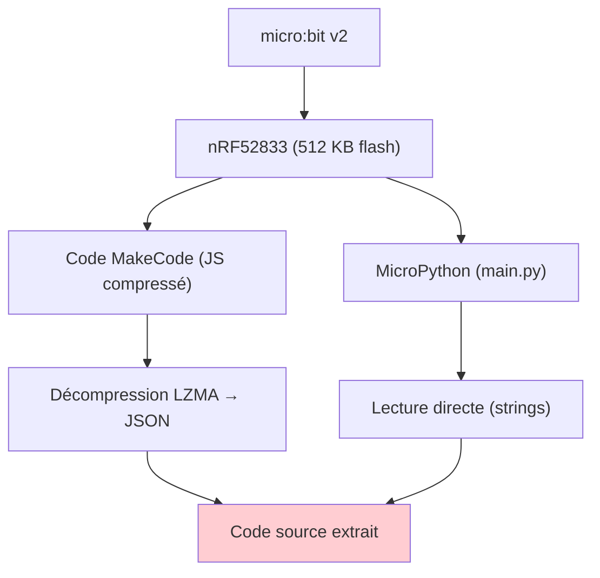
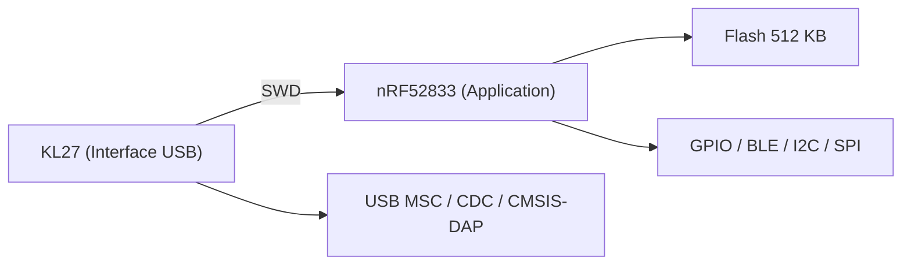
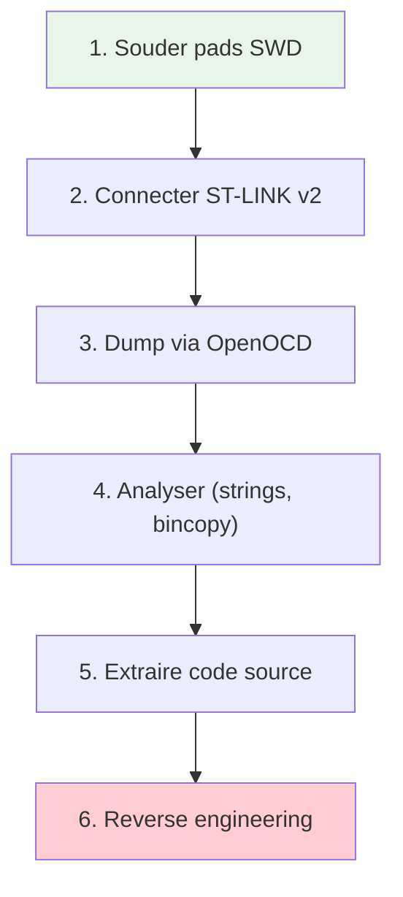
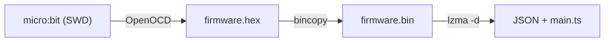
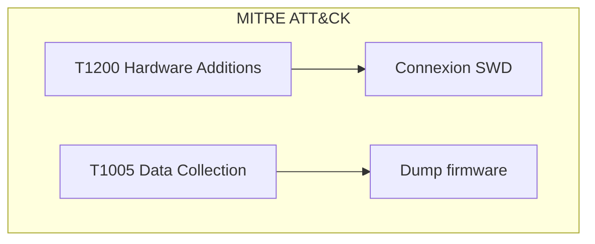
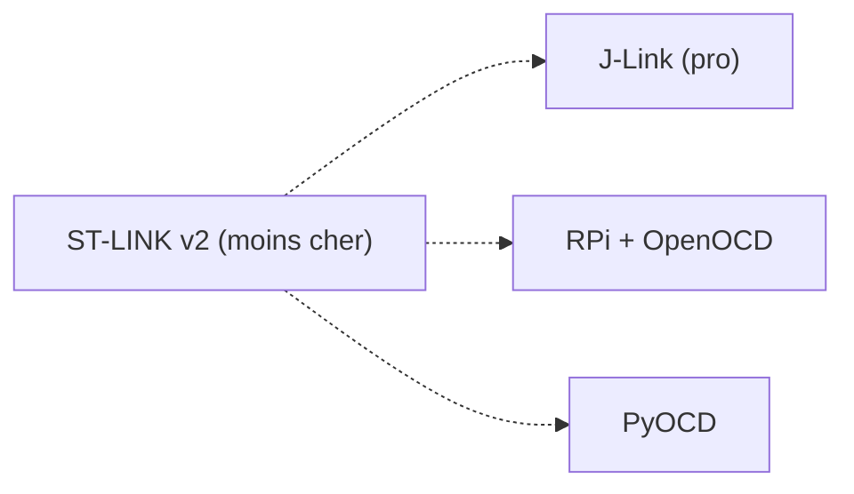

# micro:bit

> [!info] **En 1 phrase**
> Le micro:bit (BBC) est une carte de prototypage éducative à base de **nRF52833** (Nordic, ARM Cortex-M4F + BLE 5.1) : en pentest, son intérêt réside dans **l'extraction du code source JavaScript MakeCode** depuis le firmware, et dans le **dump de flash via SWD** (OpenOCD + ST-LINK v2).

---

## Overview

| Champ | Valeur |
|---|---|
| **Type** | Carte de prototypage éducative / Cible pentest |
| **Domaine** | Hardware Hacking / IoT |
| **Niveau** | Beginner → Intermediate |
| **OS cibles** | DAPLink (interface), MicroPython / MakeCode (application) |
| **Matériel requis** | micro:bit v2, ST-LINK v2, PC, câbles |
| **Complexité** | Faible → Moyenne |
| **Dernière mise à jour** | 2026-08-16 |

> [!info] **Diagramme de contexte**
> ```mermaid
> flowchart LR
>     A["micro:bit v2"] --> B["nRF52833 (ARM Cortex-M4F)"]
>     B --> C["Flash 512 KB"]
>     C --> D["Code source (MakeCode / MicroPython)"]
>     D --> E["Extraction & Reverse Engineering"]
>     style A fill:#e1f5fe
>     style E fill:#c8e6c9
> ```

---

## Concept

Le micro:bit embarque un SoC Nordic **nRF52833** (ARM Cortex-M4F, 64 MHz, 512 KB flash, 128 KB RAM) avec BLE 5.1. Le firmware contient le code source utilisateur (JavaScript MakeCode ou MicroPython) en clair ou compressé. Le dump via SWD permet d'extraire ce code, révélant IP, secrets et logique applicative.



---

## Concepts fondamentaux

### nRF52833 et SWD

| Terme | Définition |
|---|---|
| **nRF52833** | SoC Nordic — ARM Cortex-M4F, 64 MHz, 512 KB flash, 128 KB RAM, BLE 5.1 |
| **SWD** | Serial Wire Debug — protocole de debug 2 fils (SWDIO/SWCLK) |
| **DAPLink** | Firmware de l'interface USB (KL27) — drag-and-drop programming |
| **MakeCode** | Environnement de programmation par blocs/JavaScript pour micro:bit |
| **LZMA** | Algorithme de compression utilisé dans le firmware MakeCode |
| **J-Link OB** | Débogueur ARM intégré au nRF52833 |

### Deux processeurs

Le micro:bit v2 contient **deux processeurs** :
1. **nRF52833** (application) : exécute le code utilisateur
2. **NXP KL27** (interface) : gère USB, drag-and-drop, CMSIS-DAP



---

## Matériel / Composants

### Outils principaux

| Outil | Type | Usage | Prix | Source |
|---|---|---|---|---|
| micro:bit v2 | Carte éducative | Cible pentest | ~15-20€ | BBC/micro:bit |
| ST-LINK v2 | Débogueur SWD | Dump flash | ~5-10€ | STMicroelectronics |
| PC (Linux/Windows) | Station de travail | Analyse firmware | — | — |
| Câbles dupont | Connexions | SWDIO/SWCLK/GND/VCC | ~2€ | — |

### Spécifications micro:bit v2

| Composant | Spécification |
|---|---|
| **SoC principal** | Nordic nRF52833 |
| **Cœur** | ARM Cortex-M4F, 64 MHz |
| **Flash** | 512 KB (128 KB firmware, 128 KB NVS, reste = code) |
| **RAM** | 128 KB (32 KB utilisés) |
| **Interface USB** | NXP KL27 (Cortex-M0+, 48 MHz) |
| **BLE** | Bluetooth 5.1 (BLE) |
| **Radio** | 2.4 GHz (micro:bit Radio protocol) |
| **Capteurs** | LSM303AGR (accéléromètre + magnétomètre) |
| **Microphone** | Knowles MEMS SPU0410LR5H-QB-7 |
| **Haut-parleur** | Intégré (v2) |
| **LED** | 5×5 matrix (25 LEDs) |
| **Boutons** | A, B (front), System (back) |
| **GPIO** | 19 broches assignables |
| **Edge connector** | 80 pins, 1.27mm pitch |
| **Borne ext.** | 5 pads (P0-P2, 3V, GND) |
| **ADC** | 10 bits (0-1023) |
| **Alimentation** | 1.8V-3.6V, max 300 mA |

### Pinout micro:bit v2

| Broche | GPIO nRF52833 | Fonction |
|---|---|---|
| **P0** | P0.02 | RING0 — GPIO/Analog/Touch |
| **P1** | P0.03 | RING1 — GPIO/Analog/Touch |
| **P2** | P0.04 | RING2 — GPIO/Analog/Touch |
| **P3** | P0.31 | COL3 — Display/Analog |
| **P4** | P0.28 | COL1 — Display/Analog |
| **P5** | P0.14 | BTN_A (Bouton A) |
| **P6** | P1.05 | COL4 |
| **P7** | P0.11 | COL2 |
| **P8** | P0.10 | GPIO1 |
| **P9** | P0.09 | GPIO2 (NFC1) |
| **P10** | P0.30 | COL5 — Display/Analog |
| **P11** | P0.23 | BTN_B (Bouton B) |
| **P12** | P0.12 | GPIO4 |
| **P13** | P0.17 | SCK (SPI externe) |
| **P14** | P0.01 | MISO (SPI externe) |
| **P15** | P0.13 | MOSI (SPI externe) |
| **P16** | P1.02 | GPIO3 |
| **P19** | P0.26 | I2C_EXT_SCL |
| **P20** | P1.00 | I2C_EXT_SDA |
| **3V** | — | Alimentation 3V |
| **GND** | — | Masse |

### Test points SWD (sous le masque)

| Test Point | Fonction |
|---|---|
| TP11 | U2_SWDCLK — Debug nRF52833 |
| TP12 | U2_SWDIO — Debug nRF52833 |
| TP4 | U5_SWD_DIO — Debug KL27 |
| TP3 | U5_SWD_TCLK — Debug KL27 |

---

## Protocoles

### Protocoles supportés

| Protocole | Interface | Vitesse | Usage pentest |
|---|---|---|---|
| SWD | GPIO (SWDIO/SWCLK) | Variable | Dump flash, debug |
| I2C | P19/P20 | 400 kHz | Scanner capteurs externes |
| SPI | P13/P14/P15 | Variable | Flash externe |
| UART | P6/P8 (soft) | 115200 | Console série |
| BLE | 2.4 GHz | — | Communication sans fil |
| micro:bit Radio | 2.4 GHz | 1-2 Mbps | Communication inter-cartes |

---

## Installation / Setup

### Prérequis

| Composant | Version | Lien |
|---|---|---|
| Python | 3.8+ | https://python.org |
| OpenOCD | 0.12+ | https://openocd.org/ |
| bincopy | Latest | pip install bincopy |
| lzma | Python stdlib | Inclus |

### Connexion physique SWD

```
ST-LINK v2          micro:bit v2 (test points)
│                   │
│  SWDIO ────────── TP12 (U2_SWDIO)
│  SWCLK ────────── TP11 (U2_SWDCLK)
│  GND ──────────── GND (pad GND)
│  3.3V ─────────── 3V (pad 3V) — optionnel
```

### Outils logiciels

```bash
# Installation des dépendances
pip install bincopy

# Vérifier OpenOCD
openocd --version
```

---

## Configuration

### Fichier de commandes OpenOCD (`dump_fw.cfg`)

```bash
init
reset init
halt
dump_image image.bin 0x00000000 0x00040000
exit
```

> [!info] Mémoire
> Section code nRF52833 : `hex(1024*256) = 0x40000` → dump `0x00000000 → 0x00040000` (256 KB).

---

## Commandes / Manipulations

### Dump du firmware via SWD

```bash
# Lancement OpenOCD avec ST-LINK v2
sudo openocd -f /path/to/interface/stlink-v2-1.cfg \
             -f /path/to/target/nrf51.cfg \
             -f dump_fw.cfg
```

### Analyse du dump

```bash
# Extraction de strings
strings image.bin | head -200

# Recherche de code Python
strings image.bin | grep -i "import\|def\|class\|print"

# Recherche de secrets
strings image.bin | grep -iE "password|key|token|secret"
```

---

## Exemples pratiques

### Débutant — Extraction de code MakeCode

```text
1. Récupérer le fichier .hex du firmware (téléchargé ou dumpé)
2. Le fichier contient deux blocs séparés par une ligne vide
3. Bloc 0 = raw (bootloader/DAPLink)
4. Bloc 1 = code (MakeCode, Intel HEX)
5. Convertir le bloc code en binaire
6. Bruteforcer l'offset LZMA pour décompresser le JSON
```

### Intermédiaire — Extraction complète avec script Python

```python
import bincopy
import lzma
import sys
import subprocess
import json

# Split firmware into raw and code
with open(sys.argv[1], 'r') as f:
    fwstring = f.read()
    fwsplit = fwstring.split('\n\n')
    with open('fw_raw.hex', 'w') as g:
        g.write(fwsplit[0])
    with open('fw_code.hex', 'w') as g:
        g.write(fwsplit[1])

# Convert ihex to bin
f = bincopy.BinFile()
f.add_ihex_file('fw_code.hex')
binary = f.as_binary()
print("[+] ihex converted to binary")

# Bruteforce LZMA offset
for i in range(200):
    with open('firmware.bin', 'w+b') as g:
        g.write(binary[i:])
    try:
        data = subprocess.run(
            ["lzma", "firmware.bin", "-d", "--stdout"],
            capture_output=True
        )
        data = data.stdout.decode().split('}', 1)
        data = data[1][1:]
        data = json.loads(data)
        print(data)
        print("\n[+] Javascript code")
        print(data['main.ts'])
    except Exception:
        continue
```

### Avancé — Dump SWD + MicroPython extraction

```bash
# Dump complet via SWD
sudo openocd -f interface/stlink-v2-1.cfg \
             -f target/nrf51.cfg \
             -c "init; reset init; halt; dump_image full_dump.bin 0x00000000 0x00040000; exit"

# Extraction MicroPython
strings full_dump.bin | grep -A 20 "main.py"
```

### Expert — Reconstruction de firmware

```text
1. Dump complet via SWD (0x00000000 → 0x00040000)
2. Identifier les sections : bootloader (DAPlink) + application
3. Modifier la section application (patch binaire)
4. Recalculer le checksum/CRC
5. Re-flash via SWD (ST-LINK v2 + OpenOCD)
6. Tester le firmware modifié
```

---

## Workflow complet (scénario pas à pas)



### Étape 1 — Connexion SWD

| Action | Commande | Résultat |
|---|---|---|
| Souder fils sur TP11/TP12 | Soudure | Connexion SWD |
| Connecter ST-LINK v2 | câbles dupont | SWDIO/SWCLK/GND |

### Étape 2 — Dump

```bash
sudo openocd -f interface/stlink-v2-1.cfg -f target/nrf51.cfg \
  -c "init; reset init; halt; dump_image image.bin 0x00000000 0x00040000; exit"
```

### Étape 3 — Analyse

```bash
strings image.bin | grep -iE "main.py|import|def|password"
```

### Étape 4 — Extraction code

```python
# Script d'extraction MakeCode (voir exemple ci-dessus)
python extract_makecode.py firmware.hex
```

### Étape 5 — Post-exploitation

```bash
# Recherche de secrets dans le code extrait
grep -iE "api_key|token|password|secret" extracted_code.js
```

---

## Scénarios avancés

### Scénario 1 — Extraction de code source MakeCode

| Élément | Détail |
|---|---|
| **Objectif** | Récupérer le code source JavaScript d'un micro:bit compromis |
| **Matériel** | ST-LINK v2, câbles, PC |
| **Étapes** | 1. Dump firmware via SWD<br>2. Extraire bloc code depuis .hex<br>3. Décompresser LZMA<br>4. Lire JSON avec main.ts |
| **Résultat** | Code source JavaScript complet |
| **Difficulté** | |



### Scénario 2 — Récupération de secrets MicroPython

| Élément | Détail |
|---|---|
| **Objectif** | Extraire des credentials depuis du MicroPython embarqué |
| **Matériel** | ST-LINK v2, PC |
| **Étapes** | 1. Dump via SWD<br>2. `strings` sur le dump<br>3. Identifier le code MicroPython<br>4. Extraire les secrets en clair |
| **Résultat** | Secrets et code propriétaire |
| **Difficulté** | |

---

## Cybersecurity use cases

| Use case | Sévérité | Matériel requis | Impact |
|---|---|---|---|
| Extraction code source MakeCode | Élevée | ST-LINK v2 | IP exposée |
| Dump flash MicroPython | Élevée | ST-LINK v2 | Secrets en clair |
| Reverse engineering firmware | Moyenne | PC | Compréhension logique |
| Re-flash modifié | Critique | ST-LINK v2 | Contrôle du device |

| Phase pentest | Ce que permet cette technique |
|---|---|
| Recon | Identifier le SoC (nRF52833) |
| Collecte | Extraire le code source (JS/Python) |
| Exploitation | Modifier et reflasher le firmware |
| Exfiltration | Secrets et IP du code |

---

## MITRE ATT&CK

| Technique ID | Nom | Catégorie | Applicabilité |
|---|---|---|---|
| T1200 | Hardware Additions | Initial Access | ST-LINK v2 connecté |
| T1005 | Data from Local System | Collection | Extraction code source |
| T1027 | Obfuscated Files | Defense Evasion | Firmware compressé |



---

## Defensive Security

### Détection

| Signal de détection | Source | Fiabilité |
|---|---|---|
| Connexion SWD non autorisée | Inspection physique | Élevée |
| Dump flash en cours | SWD bus monitoring | Moyenne |

### Prévention

| Mesure | Efficacité | Coût | Priorité |
|---|---|---|---|
| Ne pas stocker de secrets en code | Élevée | Gratuit | Haute |
| Chiffrement firmware | Élevée | Moyen | Haute |
| SWD disable (si supporté) | Élevée | Gratuit | Moyenne |

### Durcissement (hardening)

```text
- Ne JAMAIS embarquer de secrets en clair dans le code utilisateur
- Utiliser des variables d'environnement ou des services externes
- Considérer le chiffrement de la couche firmware
- Désactiver SWD via les fuse bits si la plateforme le permet
- Sur les déploiements professionnels, chiffrer les données stockées
```

---

## Automatisation

### Scripts d'exploitation

```python
#!/usr/bin/env python3
"""Extraction automatique de code depuis firmware micro:bit"""
import subprocess
import sys
import re

def dump_swd():
    cmd = [
        "sudo", "openocd",
        "-f", "interface/stlink-v2-1.cfg",
        "-f", "target/nrf51.cfg",
        "-c", "init; reset init; halt; dump_image dump.bin 0x00000000 0x00040000; exit"
    ]
    subprocess.run(cmd, check=True)

def extract_secrets(path):
    with open(path, 'rb') as f:
        data = f.read()
    patterns = [b'password', b'key', b'token', b'secret', b'api_key', b'import']
    for pat in patterns:
        idx = data.find(pat)
        if idx >= 0:
            context = data[max(0,idx-20):idx+50]
            print(f"[+] '{pat.decode()}' trouvé à offset 0x{idx:x}: {context}")

if __name__ == "__main__":
    dump_swd()
    extract_secrets("dump.bin")
```

### Outils d'automatisation

| Outil | Usage | Lien |
|---|---|---|
| OpenOCD | Dump SWD | https://openocd.org/ |
| bincopy | Conversion HEX→BIN | pip install bincopy |
| strings | Extraction texte | GNU binutils |

---

## Output et parsing

### Formats de sortie

| Format | Exemple | Utilité |
|---|---|---|
| Binary (.bin) | `dump.bin` | Dump flash complet |
| Intel HEX | `firmware.hex` | Format MakeCode |
| JSON | `project.json` | Code MakeCode extrait |

### Parsing des résultats

```bash
strings dump.bin | grep -iE "main.py|import|password|key"
```

---

## Intégrations

- [[13 - Hardware & IoT| Hardware & IoT]] global
- [[Hardware - Dump et Analyse de Firmware| Dump de firmware]]
- [[Hardware - JTAG et SWD| JTAG/SWD]]
- [[Hardware - Raspberry Pi]] — Plateforme de debug alternative

| Outils associés | Usage complémentaire |
|---|---|
| ST-LINK v2 | Débogueur SWD low-cost |
| J-Link | Débogueur ARM professionnel |
| OpenOCD | Interface de debug open-source |

---

## Alternatives

| Alternative | Avantages | Inconvénients | Cas d'usage |
|---|---|---|---|
| J-Link | Plus rapide, plus fiable | Plus cher (~200€) | Debug avancé |
| RPi + OpenOCD | Linux intégré | Setup plus complexe | Debug portable |
| PyOCD | Pure Python | Plus lent | Quick testing |



---

## Performance

| Métrique | Valeur | Impact |
|---|---|---|
| Vitesse dump SWD | Variable (~1 MB/s) | Dump 256 KB en ~1s |
| Taille dump | 256 KB (0x40000) | Fichier manageable |
| Décompression LZMA | < 1s | Extraction rapide |

---

## Troubleshooting

| Problème | Cause probable | Solution |
|---|---|---|
| OpenOCD ne détecte pas le nRF5 mauvais config | Fichier de config cible | Utiliser nrf51.cfg |
| Dump partiel | SWD mal connecté | Vérifier TP11/TP12 |
| LZMA error | Offset incorrect | Bruteforcer offset (0-200) |
| split('\n\n') error | Fichier HEX unique | Vérifier le format MakeCode |

### Erreurs courantes

```
Erreur : "Error: init mode failed"
Cause : Connexion SWD défaillante
Solution : Vérifier les fils SWDIO/SWCLK/GND
```

### Diagnostic

```bash
openocd -f interface/stlink-v2-1.cfg -f target/nrf51.cfg -c "init"
ls -la dump.bin
file dump.bin
```

---

## Sécurité

| Risque | Impact | Mitigation |
|---|---|---|
| Code source en clair | IP exposée | Chiffrement firmware |
| Secrets dans le code | Credentials compromis | Variables d'environnement |
| SWD accessible | Dump trivial | Désactiver SWD (fuse bits) |

> [!warning] Points de sécurité
> - Le firmware embarque le code source complet → **IP / secrets exposés**
> - Les pads SWD sont accessibles sous le logo sur certains modèles
> - Le dump est **non chiffré** par défaut

### Restrictions légales

> [!danger] Cadre légal
> Extraction de firmware sans autorisation est illégale. Techniques pour pentest autorisé uniquement.

---

## Limitations

| Limite | Impact | Contournement |
|---|---|---|
| SWD peut être désactivé | Dump impossible | Attaque physique (clock glitching) |
| Code MakeCode compressé | Extraction indirecte | Bruteforce offset LZMA |
| Pads SWD sous le logo | Accessibilité réduite | Soudure fine / test probes |

### Cas où cette technique ne fonctionne pas

| Scénario | Raison |
|---|---|
| SWD désactivé via fuse | Pas d'accès debug |
| Firmware chiffré | Dump illisible |
| Carte v1 (nRF51822) | Mémoire différente (256 KB) |

---

## Cheatsheet

```
┌──────────────────────────────────────────────────────┐
│ micro:bit — Cheatsheet                               │
├──────────────────────────────────────────────────────┤
│ SWD pins :     TP11=SWDCLK, TP12=SWDIO              │
│ SoC :          nRF52833 (ARM Cortex-M4F, 64 MHz)    │
│ Flash :        512 KB (256 KB code utile)             │
│ Dump SWD :     openocd → dump_image image.bin        │
│ Extract JS :   split hex → bincopy → lzma → JSON    │
│ Extract Py :   strings dump.bin | grep "main.py"     │
│ ST-LINK :      SWDIO→TP12, SWCLK→TP11, GND→GND     │
└──────────────────────────────────────────────────────┘
```

| Action | Commande |
|---|---|
| Dump SWD | `openocd -f stlink.cfg -f nrf51.cfg -c "dump_image dump.bin 0x0 0x40000"` |
| Strings | `strings dump.bin \| head -200` |
| Extract MakeCode | `python extract_makecode.py firmware.hex` |

---

## Quick reference

| Élément | Valeur / Commande |
|---|---|
| **Fonction** | Carte éducative / Cible pentest |
| **SoC** | nRF52833 (ARM Cortex-M4F) |
| **SWD pins** | TP11=SWDCLK, TP12=SWDIO |
| **Flash** | 512 KB (256 KB dump utile) |
| **Voltage** | 1.8V-3.6V (3.3V typique) |
| **Logiciel principal** | OpenOCD |
| **Commande rapide** | `strings dump.bin \| grep -i password` |

---

## Détection & Défense

| Signal | Méthode de détection | Outil |
|---|---|---|
| Connexion SWD | Inspection physique | Observation |
| Dump flash | SWD bus monitoring | Logic analyzer |

| Countermeasure | Efficacité | Implémentation |
|---|---|---|
| Pas de secrets en clair | Élevée | Architecture logicielle |
| SWD disable | Élevée | Fuse bits |
| Chiffrement firmware | Élevée | nRF SDK crypto |

> [!tip] Défense
> - Ne jamais embarquer de secrets dans le code MakeCode/MicroPython
> - Utiliser des services externes pour les clés API
> - Désactiver SWD sur les cartes de production

---

## Tips & Pièges

- **Piège 1** : `split('\n\n')` suppose le format MakeCode — un fichier HEX "simple" ne donne rien.
- **Piège 2** : Le bruteforce LZMA dépend de `lzma` sur le PATH système.
- **Piège 3** : Sur certains modèles, les pads SWD sont **masqués sous le logo**.
- **Piège 4** : `:` est interdit dans les noms de fichiers Windows.
- **Astuce 1** : Le bruteforce d'offset LZMA est rapide (≤ 200 essais).
- **Astuce 2** : Le code Python MicroPython est lisible directement via `strings`.
- **Astuce 3** : La v2 est open-source (schémas disponibles sur GitHub).
- **Bonne pratique** : Vérifier la révision de la carte avant de souder les pads SWD.

> [!tip] Astuces
> - Le micro:bit v2 est plus intéressant que la v1 (nRF52833 vs nRF51822, plus de RAM/flash)
> - La mémoire code fait 256 KB max → dump rapide
> - Les repos communautaires `microbit-*` contiennent des informations utiles

---

## References

> [!info] **Sources**
> - [HardwareAllTheThings — micro:bit](https://github.com/swisskyrepo/HardwareAllTheThings/blob/main/docs/gadgets/micro-bit.md)
> - [micro:bit Hardware](https://tech.microbit.org/hardware/)
> - [micro:bit v2 Datasheet](https://microbit.org/get-started/features/overview/)

### Documentation officielle

| Source | URL | Type |
|---|---|---|
| micro:bit Tech | https://tech.microbit.org/ | Hardware docs |
| Nordic nRF52833 | https://www.nordicsemi.com/Products/nRF52833 | Datasheet |

### Vidéos / Tutorials

| Titre | Auteur | Lien |
|---|---|---|
| micro:bit Hacking | Various | YouTube |

### Livres / Articles

| Titre | Auteur | Année |
|---|---|---|
| The Hardware Hacking Handbook | Jasper van Woudenberg | 2021 |

---

**Liens :** [[13 - Hardware & IoT| Hardware & IoT]] · [[Hardware - Dump et Analyse de Firmware| Dump de firmware]] · [[Hardware - JTAG et SWD| JTAG/SWD]] · [[Hardware - Raspberry Pi]] · [[Hardware - SDR]]
