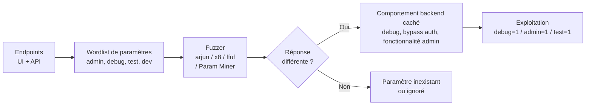

# 🕵️ Hidden Parameters

> [!info] **En 1 phrase**
> Hidden Parameters = des **paramètres non documentés** (`debug`, `admin`, `test`, `dev`…) que l'app accepte en plus de ceux exposés dans l'UI
> → le backend change de comportement : affichage de debug, bypass de contrôle d'accès, activation de fonctionnalités cachées.
>
> Source principale : **[PayloadsAllTheThings — HTTP Hidden Parameters (swisskyrepo)](https://github.com/swisskyrepo/PayloadsAllTheThings/blob/master/HTTP%20Hidden%20Parameters/README.md)**

---

## 🎯 Concept



> [!info] 💡 **Pourquoi ça marche**
> Les devs laissent des **paramètres de debug/test/désactivation** en production (`debug=1`, `admin=true`,
> `test=1`, `dev=1`). Ils ne figurent ni dans l'UI ni dans le HTML, mais le backend **les lit quand même** :
> l'app traite **tout paramètre reçu** sans allowlist → on peut activer des comportements cachés.

---

## 📋 Paramètres connus à tester

> [!tip] 💡 Commencer par une **petite wordlist ciblée** (rapide), ne passer à la grande que si rien n'est trouvé.

### Wordlists exactes du README (source)

| Wordlist | Lien |
|---|---|
| `arjun/db/small.txt` | https://github.com/s0md3v/Arjun/blob/master/arjun/db/small.txt |
| `arjun/db/medium.txt` | https://github.com/s0md3v/Arjun/blob/master/arjun/db/medium.txt |
| `arjun/db/large.txt` | https://github.com/s0md3v/Arjun/blob/master/arjun/db/large.txt |
| `sam-cc-parameters-lowercase-all.txt` (samlists) | https://github.com/the-xentropy/samlists/blob/main/sam-cc-parameters-lowercase-all.txt |
| `sam-cc-parameters-mixedcase-all.txt` (samlists) | https://github.com/the-xentropy/samlists/blob/main/sam-cc-parameters-mixedcase-all.txt |

### Paramètres classiques à tester en premier

```txt
debug  debug_mode  debug_level  verbose  trace
admin  adm  is_admin  role  user_role  superuser
test  testing  trial  stage  staging  dev  development
config  configuration  mode  env  environment  profile
token  key  api_key  apikey  secret  private  internal  flag
cmd  command  exec  run  shell  eval  phpinfo
```

---

## 🔥 Fuzzing de paramètres

### Arjun (s0md3v) — découverte HTTP

```bash
# Scan simple (GET)
arjun -u https://example.com/

# Méthode + headers personnalisés (JSON)
arjun -u https://example.com/api -m POST -H "Content-Type: application/json"

# Depuis un fichier de requête Burp
arjun -r request.txt

# Wordlist custom + cookies
arjun -u https://example.com -w /path/to/wordlist.txt -c "PHPSESSID=xxx"
```

### x8 (Sh1Yo) — rapide et fiable

```bash
x8 -u "https://example.com/" -w <wordlist>
x8 -u "https://example.com/" -X POST -w <wordlist>
x8 -u "https://example.com/api" -X POST -d '{}' -H 'Content-Type: application/json' -w <wordlist>
```

### ffuf — fuzzing générique

```bash
# Query string (GET)
ffuf -u "https://example.com/?FUZZ=value" -w wordlist.txt -mc all -fc 200

# Body POST
ffuf -u "https://example.com/login" -X POST -d "username=admin&password=admin&FUZZ=1" \
     -w wordlist.txt -mc all -fc 302
```

### Burp Param Miner (PortSwigger)

- Extension Burp : **Param Miner** → identifie les paramètres cachés/non liés d'un endpoint.
- Onglet `Param miner` → `Guess param names` pendant une numérisation active.
- Fuzze **query string, body POST, headers et cookies** (configurable).

### Méthode (Bruteforce)

1. Envoyer les wordlists de paramètres communs sur chaque endpoint.
2. **Observer le comportement backend inattendu** : contenu, code HTTP, timing.
3. Un seul paramètre qui change la réponse = candidat à exploiter.

### Anciens paramètres (Old Parameters)

Explorer toutes les URLs de la cible pour retrouver les **anciens paramètres** encore supportés :

```bash
# Wayback Machine — toutes les URLs connues du domaine
echo "example.com" | waybackurls

# Mining d'URLs depuis les archives (Arjun/ParamSpider)
paramspider -d example.com

# + parcourir les fichiers JS pour découvrir des paramètres "inutilisés"
```

- Sources : Wayback Machine (web.archive.org), JS files, cache Google, Common Crawl.

---

## 🔎 Détection d'un paramètre trouvé

Comparer la réponse **avec** le paramètre injecté contre la réponse **de référence** (sans) :

```txt
Sans le paramètre      → réponse de référence (status, headers, body, temps)
Avec ?debug=1          → si la réponse diffère → paramètre TRAITÉ
Avec ?zzz_random=1     → si la réponse diffère aussi → faux positif (le site reflète tout)
```

### Signaux à surveiller

| Signal | Indice |
|---|---|
| **Contenu** | Message/nouvelles données affichées, bouton admin visible, stacktrace |
| **Code HTTP / headers** | 200 ↔ 302, `Set-Cookie`, changement de taille du body |
| **Timing** | Réponse plus lente = le paramètre déclenche un traitement supplémentaire |

> [!warning] ⚠️ Toujours tester un **paramètre aléatoire témoin** (`zzz_123`) en parallèle :
> si la réponse varie pareil, la variation n'a rien à voir avec le paramètre testé.

---

## 💥 Exploitation

### Paramètres de debug / bypass classiques

```txt
debug=1      → affiche var_dump, erreurs, stacktraces (divulgation d'infos sensibles)
admin=1      → bypass de contrôle d'accès / élévation de rôle
test=1       → active le mode test (paiement, quota, envoi d'emails...)
dev=1        → active des routes/fonctionnalités en développement
```

```http
GET /search.php?q=test&debug=1 HTTP/1.1
Host: example.com
# Backend : if ($_GET['debug'] == '1') { var_dump($db); }  → infos de connexion BDD

GET /user/profile?id=123&admin=1 HTTP/1.1
Host: example.com
# Le serveur vérifie ?admin=1 au lieu du rôle de session → profil d'un autre utilisateur
```

### Accès à des fonctionnalités cachées

```http
POST /api/users/ HTTP/1.1
Host: example.com
Content-Type: application/x-www-form-urlencoded

id=1&role=admin&test=1

# Un paramètre rôle/approbation non affiché dans l'UI, mais lu par l'API
```

| Paramètre | Effet possible |
|---|---|
| `debug`, `verbose`, `trace` | divulgation d'informations (stacktraces, variables) |
| `admin`, `is_admin`, `role` | bypass de contrôle d'accès |
| `test`, `testing`, `dev` | activation du mode test/développement |
| `config`, `mode`, `env` | changement de configuration / environnement |

---

## 🛠️ Outils

| Outil | Usage | Lien |
|---|---|---|
| **Arjun** | découverte HTTP de paramètres (GET/POST/JSON) | https://github.com/s0md3v/Arjun |
| **x8** | découverte rapide et fiable de paramètres cachés | https://github.com/Sh1Yo/x8 |
| **ffuf** | fuzzing générique (query, body, headers) | https://github.com/ffuf/ffuf |
| **Param Miner** | extension Burp (detect hidden/unlinked params) | https://github.com/PortSwigger/param-miner |
| **waybackurls** | toutes les URLs Wayback d'un domaine | https://github.com/tomnomnom/waybackurls |
| **ParamSpider** | mining d'URLs depuis les archives | https://github.com/devanshbatham/ParamSpider |
| **SecLists** | wordlists (ex : `SecLists/Discovery/Web-Content/burp-parameter-names.txt`) | https://github.com/danielmiessler/SecLists |

---

## 🔍 Détection & Défense

| Réponse | Détail |
|---|---|
| **Allowlist de paramètres** | Le backend n'accepte et ne traite que les paramètres attendus ; les autres sont ignorés |
| **Pas de paramètres cachés sensibles** | `debug`, `admin`, `test`, `dev` ne doivent pas exister en production |
| **Validation serveur** | Types, valeurs autorisées et surtout **autorisation (rôle)** sur chaque paramètre |
| **Minimiser le debug** | Journaliser les erreurs (logs serveur) plutôt que `var_dump`/stacktraces exposées |
| **Contrôle d'accès côté session** | `admin=1` ne doit jamais suffire : vérifier le rôle de la session côté serveur |
| **Surveillance** | Logs + alertes sur les paramètres inhabituels (pattern de fuzzing), rate limiting |

---

## ⚠️ Tips & Pièges

> [!tip] 💡 **Ordre logique d'attaque**
> 1. **Identifier la fonctionnalité** : endpoint, paramètres visibles, méthode HTTP, type de contenu.
> 2. **Fuzzer** les paramètres avec une wordlist adaptée à la fonctionnalité.
> 3. **Confirmer** que le paramètre change vraiment le comportement (avec témoin).
> 4. **Exploiter** : `debug` → divulgation, `admin` → bypass, `test` → fonctionnalité cachée.

> [!warning] ⚠️ **Pièges**
> - **Paramètre réfléchi ≠ vulnérable** : si la valeur est simplement reflétée dans le body (echo), c'est un faux positif — seul un changement de **comportement côté serveur** compte.
> - **Fausses pistes de timing** : une réponse lente peut venir d'un traitement normal, pas d'un paramètre trouvé → re-tester plusieurs fois.
> - **Vitesse d'exécution** : x8 est très rapide mais moins "fin" que Arjun ; les grosses wordlists (`large.txt`) prennent du temps → commencer par `small.txt`.
> - **API / JSON** : fuzzer le **body POST**, pas seulement la query string.
> - Un `admin=1` reflété dans un champ ne prouve rien : vérifier l'effet réel côté serveur.
> - Penser aux **anciens paramètres** (Wayback, JS) : les apps gardent souvent la compatibilité avec de vieux paramètres oubliés.

---

## 🔗 Liens

- [[Virtual Hosts|🏠 Virtual Hosts]]
- [[API Key Leaks|🔑 API Key Leaks]]
- [[IDOR|🎯 IDOR]]
- → Note complète : [[03 - Exploitation Web|🌍 Exploitation Web]]
- 📚 Source : [PayloadsAllTheThings — HTTP Hidden Parameters](https://github.com/swisskyrepo/PayloadsAllTheThings/blob/master/HTTP%20Hidden%20Parameters/README.md)
